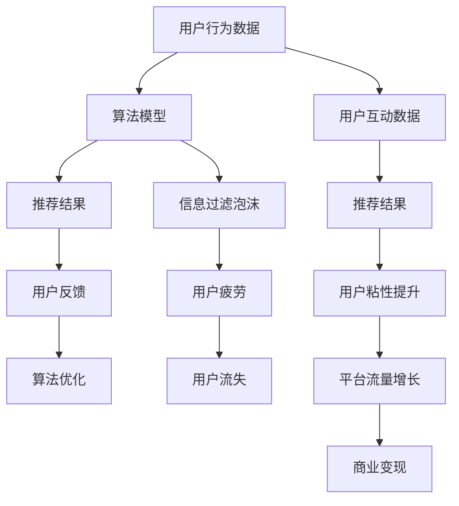

                 

# 注意力经济与社交媒体算法的共生

> 关键词：
> - 社交媒体
> - 算法推荐
> - 注意力机制
> - 用户行为
> - 信息过滤泡沫
> - 用户粘性
> - 个性化推荐
> - 广告投放

## 1. 背景介绍

随着互联网的普及和社交媒体平台的兴起，人们越来越多地依赖于网络获取信息和娱乐。这种趋势不仅改变了人们的生活方式，也引发了对信息筛选机制的重新思考。在信息爆炸的时代，用户如何在海量内容中筛选出对自己有用的信息，成为了一个亟待解决的问题。

社交媒体平台通过算法推荐技术，为用户推荐其可能感兴趣的内容，提升了用户体验和平台粘性。但算法推荐并非万能钥匙，它也会带来信息过滤泡沫和用户疲劳等问题。如何平衡算法推荐和用户需求之间的关系，构建更加公平、健康的信息生态系统，成为了一个重要议题。

本文将从社交媒体算法推荐的核心原理和算法模型出发，探讨其与注意力经济之间的关系，并给出应对当前问题的策略。希望通过本文的探讨，能够为未来社交媒体平台的信息筛选机制和推荐系统提供新的思路和方向。

## 2. 核心概念与联系

### 2.1 核心概念概述

在深入讨论前，我们先来明确几个核心概念及其之间的联系：

- **社交媒体**：指用户可以自由发布、分享、互动的互联网平台，如Facebook、Twitter、微博等。社交媒体通过算法推荐系统，向用户提供个性化的内容。

- **算法推荐**：基于用户行为数据和内容特征，利用算法模型对用户可能感兴趣的内容进行预测和推荐。常见的算法包括协同过滤、内容推荐、序列模型等。

- **注意力机制**：指在模型中引入注意力权重，对输入数据进行加权处理，增强模型对关键信息的关注度。注意力机制在自然语言处理、计算机视觉等领域得到了广泛应用。

- **用户行为**：指用户在社交媒体平台上的浏览、点赞、评论等互动行为。用户行为数据是算法推荐和广告投放的基础。

- **信息过滤泡沫**：指用户长时间只接触到符合自己偏好的信息，而逐渐失去了对其他信息的关注。长期接触同质化的信息，会引发信息茧房效应，减少用户对不同观点的接触。

- **用户粘性**：指用户对平台的忠诚度和依赖程度。算法推荐通过提高用户粘性，推动平台的流量增长和商业变现。

### 2.2 核心概念原理和架构的 Mermaid 流程图



这个流程图展示了社交媒体算法推荐系统的核心流程：

1. 用户行为数据收集：从用户在平台上的各种互动中提取数据，如点击、点赞、评论等。
2. 算法模型训练：利用用户行为数据训练推荐算法，预测用户可能感兴趣的内容。
3. 推荐结果展示：将推荐结果展示给用户，提高用户粘性。
4. 用户反馈收集：收集用户对推荐结果的反馈，用于优化算法。
5. 信息过滤泡沫：长期接触同质化信息，会形成信息过滤泡沫，降低用户对其他信息的接触。
6. 用户疲劳和流失：信息过滤泡沫和疲劳可能使用户逐渐失去对平台的兴趣，导致用户流失。
7. 平台流量和商业变现：通过提高用户粘性，推动平台流量增长和商业变现。

## 3. 核心算法原理 & 具体操作步骤

### 3.1 算法原理概述

社交媒体平台的算法推荐系统主要基于协同过滤、内容推荐、序列模型等算法。这些算法共同的核心目标是通过用户的历史行为数据，预测用户对内容的兴趣，并推荐其可能感兴趣的内容。

算法推荐的原理主要包括以下几个步骤：

1. 特征提取：从用户行为数据中提取特征，如浏览历史、点赞、评论等。
2. 相似度计算：利用特征相似度计算，找到与用户兴趣相似的其他用户或内容。
3. 排序与过滤：根据相似度计算结果，对推荐内容进行排序和过滤，去除低相关性内容。
4. 展示与反馈：将推荐结果展示给用户，并根据用户的反馈，优化推荐算法。

### 3.2 算法步骤详解

以下详细说明基于协同过滤的推荐算法流程：

**Step 1: 用户行为数据收集**
从社交媒体平台中收集用户的历史行为数据，如浏览网页、点赞、评论等。数据通常被表示为矩阵形式，如 $U \times I$ 的矩阵，其中 $U$ 表示用户数，$I$ 表示物品数。

**Step 2: 用户特征构建**
利用用户行为数据构建用户特征向量，如用户兴趣偏好、历史浏览记录等。特征通常通过TF-IDF、词袋模型等技术进行提取。

**Step 3: 计算相似度**
计算用户之间的相似度，如余弦相似度、皮尔逊相关系数等，找到与目标用户兴趣相似的其他用户。相似度计算可以通过矩阵分解、奇异值分解(SVD)等技术进行。

**Step 4: 推荐结果生成**
根据相似度计算结果，生成推荐结果列表，如用户U的推荐列表为：$I_U = N_{U \times I} \times P_{I \times I} \times U_{I \times 1}$，其中 $N_{U \times I}$ 表示用户矩阵，$P_{I \times I}$ 表示物品间的相似度矩阵，$U_{I \times 1}$ 表示用户特征向量。

**Step 5: 展示与反馈**
将推荐结果展示给用户，并收集用户反馈，如点击、不喜欢等。根据反馈数据，调整推荐算法，如引入用户反馈、调整相似度计算方式等。

### 3.3 算法优缺点

基于协同过滤的算法推荐具有以下优点：

1. 简单高效：只需要收集用户行为数据，利用相似度计算即可生成推荐结果，计算复杂度较低。
2. 用户行为可解释：用户行为数据可以直接解释推荐结果的来源，用户理解度高。
3. 适应用户兴趣变化：随着用户行为的改变，算法可以动态更新推荐结果，保持相关性。

同时，该算法也存在以下缺点：

1. 冷启动问题：对于新用户和新物品，缺少足够的历史数据，难以进行准确的推荐。
2. 稀疏性问题：用户行为数据往往稀疏，无法有效构建用户特征向量。
3. 噪声干扰：用户行为数据中可能存在噪声，影响推荐结果的准确性。

### 3.4 算法应用领域

基于协同过滤的推荐算法广泛应用于社交媒体、电商、新闻网站等平台。这些平台通过算法推荐，提升了用户粘性和平台流量，推动了商业变现。

在社交媒体平台上，算法推荐帮助用户发现感兴趣的内容，增强了平台的互动性和活跃度。在电商平台上，算法推荐帮助用户发现可能感兴趣的商品，提高了转化率和销售额。在新闻网站上，算法推荐帮助用户发现相关的新闻内容，增加了网站的停留时间和访问量。

## 4. 数学模型和公式 & 详细讲解 & 举例说明

### 4.1 数学模型构建

基于协同过滤的推荐系统主要基于用户行为数据矩阵和物品相似度矩阵，构建推荐模型。以矩阵分解为例，用户行为数据矩阵 $U \times I$ 表示为 $R$，物品相似度矩阵表示为 $P$，用户特征向量表示为 $U$，推荐结果表示为 $I_U$。

用户行为数据矩阵 $R$ 表示为：

$$
R = \begin{bmatrix}
r_{11} & r_{12} & r_{13} & \cdots & r_{1I} \\
r_{21} & r_{22} & r_{23} & \cdots & r_{2I} \\
\vdots & \vdots & \vdots & \ddots & \vdots \\
r_{U1} & r_{U2} & r_{U3} & \cdots & r_{UI}
\end{bmatrix}
$$

其中 $r_{ij}$ 表示用户 $i$ 对物品 $j$ 的评分。

物品相似度矩阵 $P$ 表示为：

$$
P = \begin{bmatrix}
p_{11} & p_{12} & p_{13} & \cdots & p_{1I} \\
p_{21} & p_{22} & p_{23} & \cdots & p_{2I} \\
\vdots & \vdots & \vdots & \ddots & \vdots \\
p_{I1} & p_{I2} & p_{I3} & \cdots & p_{II}
\end{bmatrix}
$$

其中 $p_{ij}$ 表示物品 $i$ 和物品 $j$ 的相似度。

### 4.2 公式推导过程

以下我们以SVD为例，推导协同过滤算法的矩阵分解过程：

假设 $R$ 可以分解为 $U \times P \times V^T$ 形式，其中 $U$ 为用户矩阵，$P$ 为物品相似度矩阵，$V^T$ 为物品特征矩阵。分解过程如下：

$$
R = U \times P \times V^T
$$

通过矩阵分解，可以将稀疏矩阵 $R$ 转换为稠密矩阵，便于进行数值计算。通过最小二乘法求解 $U$、$P$、$V^T$，即可得到推荐结果 $I_U = U \times P \times V^T$。

### 4.3 案例分析与讲解

以推荐系统为例，假设一个社交媒体平台收集到了用户的浏览历史数据，如$R$ 矩阵，用户 $i$ 对物品 $j$ 的评分为 $r_{ij}$。假设物品 $j$ 的相似度为 $p_{ij}$，用户特征为 $u_i$。

通过对 $R$ 进行SVD分解，得到用户矩阵 $U$、物品相似度矩阵 $P$ 和物品特征矩阵 $V^T$，则推荐结果 $I_U = U \times P \times V^T$ 可以表示为：

$$
I_U = \sum_{i=1}^U \sum_{j=1}^I r_{ij} p_{ij} v_{ij}
$$

其中 $v_{ij}$ 为物品特征向量。通过计算用户特征向量 $u_i$ 和物品特征向量 $v_{ij}$ 的点积，可以生成用户 $i$ 对物品 $j$ 的推荐分数。

## 5. 项目实践：代码实例和详细解释说明

### 5.1 开发环境搭建

在进行推荐系统开发前，我们需要准备好开发环境。以下是使用Python进行Scikit-learn开发的环境配置流程：

1. 安装Anaconda：从官网下载并安装Anaconda，用于创建独立的Python环境。

2. 创建并激活虚拟环境：
```bash
conda create -n recomm-env python=3.8 
conda activate recomm-env
```

3. 安装Scikit-learn：
```bash
conda install scikit-learn
```

4. 安装各类工具包：
```bash
pip install numpy pandas scikit-learn matplotlib tqdm jupyter notebook ipython
```

完成上述步骤后，即可在`recomm-env`环境中开始推荐系统开发。

### 5.2 源代码详细实现

下面我们以协同过滤推荐系统为例，给出使用Scikit-learn库对电影推荐进行代码实现。

首先，定义电影推荐系统所需的数据处理函数：

```python
from sklearn.metrics.pairwise import cosine_similarity
from scipy.sparse import csr_matrix

def load_data():
    data = {}
    with open('movie_lens100k ratings.csv') as f:
        for line in f:
            user_id, movie_id, rating = line.strip().split(',')
            user_id = int(user_id)
            movie_id = int(movie_id)
            rating = float(rating)
            if user_id not in data:
                data[user_id] = {}
            data[user_id][movie_id] = rating
    return data

def build_ratings_matrix(data):
    R = {}
    for user_id in data:
        R[user_id] = {}
        for movie_id in data[user_id]:
            R[user_id][movie_id] = data[user_id][movie_id]
    return R

def build_item_similarity_matrix(R):
    I = {}
    for user_id in R:
        I[user_id] = {}
        for movie_id in R[user_id]:
            I[user_id][movie_id] = cosine_similarity(R[user_id].toarray(), csr_matrix(R).T.toarray()[:, movie_id]).ravel()[0]
    return I

# 构建推荐系统所需的数据
data = load_data()
R = build_ratings_matrix(data)
I = build_item_similarity_matrix(R)
```

然后，定义推荐模型函数：

```python
from sklearn.decomposition import TruncatedSVD
from scipy.sparse import csr_matrix

def recommend_movies(user_id, top_n=10, feature_dim=50):
    R = build_ratings_matrix(data)
    I = build_item_similarity_matrix(R)
    svd = TruncatedSVD(n_components=feature_dim, random_state=42)
    U = svd.fit_transform(csr_matrix(R).T)
    P = svd.transform(I)
    V = svd.components_
    user_vector = U[user_id].T.dot(V)
    movie_vector = P.T.dot(V)
    user_rank = np.dot(user_vector, movie_vector.T)
    top_indices = user_rank.argsort()[::-1][:top_n]
    top_movies = [(i, user_rank[i]) for i in top_indices]
    return top_movies
```

最后，测试推荐系统并输出推荐结果：

```python
user_id = 1
top_movies = recommend_movies(user_id)
for movie_id, score in top_movies:
    print(f"User {user_id}'s top {top_n} movie recommendations: {movie_id} with score {score}")
```

以上就是使用Scikit-learn库对协同过滤推荐系统进行代码实现的完整代码示例。可以看到，借助Scikit-learn库，推荐系统的开发变得更加简洁高效。

### 5.3 代码解读与分析

让我们再详细解读一下关键代码的实现细节：

**load_data函数**：
- 从数据文件中读取用户-电影评分数据，存储为字典形式。

**build_ratings_matrix函数**：
- 将用户-电影评分数据转换成稀疏矩阵形式，便于进行数值计算。

**build_item_similarity_matrix函数**：
- 计算物品之间的相似度，利用余弦相似度公式计算。

**recommend_movies函数**：
- 使用TruncatedSVD算法对用户行为数据和物品相似度矩阵进行降维，得到用户特征向量和物品特征向量。
- 计算用户特征向量和物品特征向量的点积，得到推荐分数。
- 根据推荐分数进行排序，输出前 $top_n$ 条推荐结果。

**测试推荐系统并输出推荐结果**：
- 指定用户ID，获取其前 $top_n$ 条推荐结果。
- 输出推荐结果，包括电影ID和推荐分数。

可以看出，借助Scikit-learn库，我们可以用较少的代码实现完整的协同过滤推荐系统。开发者可以根据实际需求调整模型参数，进一步优化推荐效果。

## 6. 实际应用场景

### 6.1 智能推荐系统

智能推荐系统已经成为电商、新闻、视频等平台的核心功能之一。通过算法推荐，平台能够准确预测用户兴趣，提升用户体验和平台流量。智能推荐系统已经广泛应用于推荐商品、新闻、视频等内容，成为用户获取信息的重要渠道。

以电商推荐系统为例，通过算法推荐，平台能够向用户推荐其可能感兴趣的商品，提高购买转化率。电商推荐系统通过用户浏览历史、购买记录等数据，生成个性化推荐列表，提升用户购物体验。在用户每次浏览和购买时，算法都会更新其推荐列表，不断优化推荐结果。

### 6.2 内容推荐系统

内容推荐系统是社交媒体平台的重要组成部分，通过算法推荐，平台能够向用户推荐其可能感兴趣的文章、视频等内容，提升用户粘性和平台活跃度。内容推荐系统通过用户行为数据，预测用户对不同内容的兴趣，生成个性化推荐列表。用户每次互动时，算法都会更新其推荐列表，不断优化推荐结果。

以新闻推荐系统为例，通过算法推荐，平台能够向用户推荐其可能感兴趣的新闻内容，提高文章点击率和用户停留时间。新闻推荐系统通过用户阅读历史、点赞记录等数据，生成个性化推荐列表，提升用户阅读体验。在用户每次阅读和点赞时，算法都会更新其推荐列表，不断优化推荐结果。

## 7. 工具和资源推荐

### 7.1 学习资源推荐

为了帮助开发者系统掌握推荐算法理论基础和实践技巧，这里推荐一些优质的学习资源：

1. 《推荐系统实战》系列书籍：由大模型技术专家撰写，深入浅出地介绍了推荐算法原理和实践技巧，涵盖协同过滤、内容推荐、深度学习等方向。

2. Coursera《推荐系统与协同过滤》课程：由斯坦福大学开设的推荐系统课程，有Lecture视频和配套作业，系统讲解推荐算法原理和应用。

3. 《机器学习》书籍：周志华著作，全面介绍了机器学习理论基础和实践技巧，涵盖回归、分类、聚类等方向，对推荐算法也有详细讲解。

4. 《深度学习》书籍：Ian Goodfellow著作，全面介绍了深度学习理论基础和实践技巧，涵盖神经网络、卷积神经网络、循环神经网络等方向，对推荐算法也有详细讲解。

5. arXiv推荐系统相关论文：arXiv是机器学习领域的重要资源，收录了大量推荐系统相关的论文，系统掌握最新研究成果。

通过对这些资源的学习实践，相信你一定能够快速掌握推荐算法的精髓，并用于解决实际的推荐问题。

### 7.2 开发工具推荐

高效的开发离不开优秀的工具支持。以下是几款用于推荐系统开发的常用工具：

1. Scikit-learn：Python的机器学习库，集成了大量推荐算法和模型评估方法，便于快速开发推荐系统。

2. TensorFlow：由Google主导开发的深度学习框架，支持分布式训练，适用于大规模推荐系统。

3. PyTorch：由Facebook主导开发的深度学习框架，灵活高效，适用于推荐算法的研究和开发。

4. Spark MLlib：Apache Spark的机器学习库，支持分布式训练和推荐系统优化。

5. Apache Mahout：Apache开源的推荐系统框架，支持多种推荐算法和模型评估方法，便于快速开发推荐系统。

合理利用这些工具，可以显著提升推荐系统开发效率，加快创新迭代的步伐。

### 7.3 相关论文推荐

推荐系统的发展源于学界的持续研究。以下是几篇奠基性的相关论文，推荐阅读：

1. BPR: Collaborative Filtering for Implicit Feedback Datasets（BPR算法）：提出了基于对数极差（BPR）的协同过滤算法，提升了推荐系统性能。

2. A Probabilistic Algorithm for Matrix Completion（矩阵补全算法）：提出了基于概率模型的矩阵补全算法，提升了推荐系统的准确性。

3. Deep Matrix Factorization for Recommender Systems（深度矩阵分解算法）：提出了基于深度学习模型的推荐系统算法，提升了推荐系统的效果。

4. Projecting User Preferences to Collective Representations（用户偏好投影算法）：提出了基于用户偏好投影的协同过滤算法，提升了推荐系统的多样性和鲁棒性。

5. Using the Alternating Least Squares（交替最小二乘算法）：提出了基于交替最小二乘算法的协同过滤算法，提升了推荐系统的计算效率。

这些论文代表了大推荐系统的发展脉络。通过学习这些前沿成果，可以帮助研究者把握学科前进方向，激发更多的创新灵感。

## 8. 总结：未来发展趋势与挑战

### 8.1 总结

本文从社交媒体算法推荐的核心原理和算法模型出发，探讨了其与注意力经济之间的关系，并给出应对当前问题的策略。社交媒体平台通过算法推荐，提升了用户粘性和平台流量，推动了商业变现。但算法推荐也会带来信息过滤泡沫和用户疲劳等问题，需要进行全面优化。

通过本文的探讨，可以看到，社交媒体算法推荐系统已经成为平台的核心功能之一，其性能和效果直接影响用户体验和平台发展。未来，伴随技术不断进步，推荐系统将进一步提升用户体验和平台价值。

### 8.2 未来发展趋势

展望未来，社交媒体推荐系统将呈现以下几个发展趋势：

1. 个性化推荐提升：通过引入更多用户行为数据和内容特征，提升推荐系统的个性化水平，满足用户多样化需求。

2. 多模态推荐应用：推荐系统将融合文本、图像、音频等多模态数据，提供更加全面、准确的信息推荐。

3. 跨平台推荐优化：通过跨平台数据共享和协同优化，提升推荐系统的效果和覆盖范围，推动多平台协同发展。

4. 实时推荐系统构建：通过实时数据流处理和模型动态更新，实现快速响应和个性化推荐，提升用户体验。

5. 算法鲁棒性增强：通过引入对抗训练和鲁棒优化技术，提升推荐系统的鲁棒性和泛化能力，抵御噪声干扰。

6. 推荐结果可解释：通过引入可解释算法和用户反馈机制，提升推荐结果的可解释性和用户理解度，增强用户信任。

### 8.3 面临的挑战

尽管社交媒体推荐系统取得了显著进展，但在迈向更加智能化、普适化应用的过程中，仍面临诸多挑战：

1. 数据隐私和安全：用户行为数据的收集和使用需要遵守隐私保护法规，推荐系统需要确保数据安全。

2. 推荐效果一致性：不同推荐模型和推荐结果之间的差异需要进一步减小，避免误导用户。

3. 算法公平性和透明性：推荐系统需要避免歧视和偏见，增强算法公平性和透明性，增强用户信任。

4. 用户疲劳和粘性提升：信息过滤泡沫和用户疲劳问题需要进一步解决，提升用户粘性和平台活跃度。

5. 算法可解释性：推荐系统需要提升算法可解释性，增强用户理解度，减少用户对系统的误解和不满。

6. 跨平台协同推荐：推荐系统需要在不同平台之间实现数据共享和协同优化，提升推荐效果。

### 8.4 研究展望

面对社交媒体推荐系统所面临的种种挑战，未来的研究需要在以下几个方面寻求新的突破：

1. 引入更多用户行为数据：通过引入更多用户行为数据和内容特征，提升推荐系统的个性化水平，满足用户多样化需求。

2. 融合多模态数据：推荐系统将融合文本、图像、音频等多模态数据，提供更加全面、准确的信息推荐。

3. 跨平台协同优化：通过跨平台数据共享和协同优化，提升推荐系统的效果和覆盖范围，推动多平台协同发展。

4. 实时推荐系统构建：通过实时数据流处理和模型动态更新，实现快速响应和个性化推荐，提升用户体验。

5. 引入对抗训练和鲁棒优化：通过引入对抗训练和鲁棒优化技术，提升推荐系统的鲁棒性和泛化能力，抵御噪声干扰。

6. 增强推荐结果可解释性：通过引入可解释算法和用户反馈机制，提升推荐结果的可解释性和用户理解度，增强用户信任。

7. 跨平台协同推荐：推荐系统需要在不同平台之间实现数据共享和协同优化，提升推荐效果。

这些研究方向将进一步推动社交媒体推荐系统的发展，提升用户体验和平台价值。

## 9. 附录：常见问题与解答

**Q1：推荐系统如何避免冷启动问题？**

A: 推荐系统可以通过引入专家知识、用户标签、商品属性等信息，提升新用户和新物品的推荐效果。例如，通过用户注册时填写的兴趣标签，推荐与其标签相关的商品或内容。通过商品属性标签，推荐与其属性匹配的商品或内容。

**Q2：推荐系统如何处理噪声干扰？**

A: 推荐系统可以通过引入噪声鲁棒优化技术，如梯度裁剪、正则化等方法，减少噪声对推荐结果的影响。同时，可以通过数据清洗和过滤，去除低质量的数据和噪声。

**Q3：推荐系统如何提升用户粘性？**

A: 推荐系统可以通过引入互动评价和反馈机制，提升用户对推荐结果的信任度和满意度。例如，通过用户点击、收藏、分享等行为，评估推荐结果的准确性。通过用户反馈，调整推荐算法和模型参数，不断优化推荐效果。

**Q4：推荐系统如何提升推荐效果一致性？**

A: 推荐系统可以通过引入多模型集成和不确定性度量技术，提升不同推荐模型和结果之间的一致性。例如，通过多个推荐模型组合预测结果，减小预测偏差。通过不确定性度量，评估推荐结果的可靠性和准确性。

**Q5：推荐系统如何增强公平性和透明性？**

A: 推荐系统可以通过引入公平性约束和透明性评估技术，增强推荐算法的公平性和透明性。例如，通过公平性约束，避免推荐结果的歧视和偏见。通过透明性评估，公开推荐算法的决策过程，增强用户信任。

这些问题的解答将帮助开发者更全面地理解推荐系统的设计思路和优化策略，构建更加高效、公平和透明化的推荐系统。

---

作者：禅与计算机程序设计艺术 / Zen and the Art of Computer Programming

