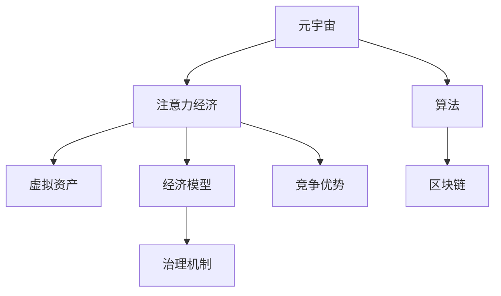
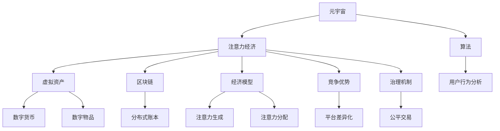

                 

# 注意力资本：元宇宙经济的核心竞争力

> 关键词：元宇宙,注意力经济,算法,区块链,经济模型,虚拟资产,竞争优势,治理机制

## 1. 背景介绍

### 1.1 问题由来
在科技迅猛发展的背景下，元宇宙（Metaverse）作为虚拟世界的未来形态，逐渐成为全球科技巨头争相投入的前沿领域。元宇宙的核心在于其数字化的沉浸式体验和连续性，它不仅仅是游戏和社交的延伸，更可能成为未来的新型生产力与社交空间。在这一进程中，注意力资本（Attention Capital）作为一种新型的资源与价值尺度，正逐步成为元宇宙经济的核心竞争力。

注意力资本，简而言之，就是用户在虚拟世界中分配注意力的资源。在现实世界，资本、信息、商品等是构成经济的基础，而在元宇宙中，用户的行为和决策则成为影响经济秩序的关键。因此，了解和掌握注意力资本的分配与流动规律，是掌握元宇宙经济命脉的重要环节。

### 1.2 问题核心关键点
元宇宙中的注意力资本运作涉及多种技术手段和复杂经济模型，但核心在于如何高效地汇聚和利用用户注意力，创造出价值并实现其经济利益最大化。具体来说，注意力资本的运作包括：

- **注意力获取**：通过游戏、社交、教育、工作等多种场景吸引用户进入元宇宙，并持久保持其注意力。
- **注意力转换**：将用户的关注点从现实世界转移到虚拟世界，并引导其参与虚拟经济活动。
- **注意力交易**：建立交易平台和机制，让注意力资本可以在元宇宙内部及与现实世界间进行流动与交易。
- **注意力治理**：设计合理的激励机制和治理规则，保障注意力资本的健康流动与分配。

这些环节相互关联，构成了一个复杂的系统。本文将聚焦于注意力资本的原理与实践，探讨其如何成为元宇宙经济的核心竞争力。

## 2. 核心概念与联系

### 2.1 核心概念概述

为更深入地理解注意力资本，我们需要对几个核心概念进行系统梳理：

- **元宇宙（Metaverse）**：一个虚拟的三维空间，通过AR/VR等技术，让用户在虚拟世界中获得沉浸式体验。
- **注意力经济（Attention Economy）**：基于用户注意力进行价值创造与分配的经济形态，元宇宙中注意力资本的核心。
- **算法（Algorithm）**：数据处理的规则，用于分析和预测用户行为，优化注意力资本的配置。
- **区块链（Blockchain）**：分布式账本技术，保障注意力资本的交易透明与信任。
- **经济模型（Economic Model）**：描述注意力资本的生成、分配、流动和使用的模型。
- **虚拟资产（Virtual Assets）**：元宇宙中的虚拟货币、数字物品、权益等，构成注意力资本的主要载体。
- **竞争优势（Competitive Advantage）**：企业或平台在元宇宙中基于注意力资本获取的独特优势。
- **治理机制（Governance Mechanism）**：确保注意力资本健康流动的规则与体系。

这些概念之间的逻辑关系可以通过以下Mermaid流程图来展示：



### 2.2 核心概念原理和架构的 Mermaid 流程图

由于篇幅限制，以下流程图仅展示元宇宙与注意力经济的联系及其基本架构：



这个流程图展示了元宇宙和注意力资本之间的联系，以及注意力资本在元宇宙经济中如何通过算法、区块链、经济模型、虚拟资产等技术手段进行运作，并最终影响竞争优势和治理机制的构建。

## 3. 核心算法原理 & 具体操作步骤
### 3.1 算法原理概述

在元宇宙中，注意力资本的运作主要依赖于算法和区块链技术。以下是对其原理的详细阐述：

**算法原理概述**：
- **用户行为分析**：通过机器学习和数据分析，算法可以预测用户的行为和需求，优化注意力资本的分配。
- **注意力生成**：算法可以设计任务和奖励机制，刺激用户参与元宇宙，并持续生成注意力资本。
- **注意力转换**：算法可以通过游戏化设计，引导用户从现实世界向虚拟世界转移注意力。
- **注意力交易**：基于区块链，算法实现去中心化的注意力资本交易，保障其透明与安全。

**操作步骤详解**：
1. **数据收集与处理**：收集用户在元宇宙中的行为数据，如登录时长、交易记录、互动频率等，并进行清洗和预处理。
2. **算法模型训练**：使用机器学习算法对数据进行建模，预测用户行为，生成注意力资本。
3. **注意力资本生成**：根据算法模型预测结果，生成虚拟资产或数字物品，并让用户通过参与特定活动或任务获取。
4. **注意力资本分配**：通过智能合约等机制，将注意力资本分配给不同的用户或平台，形成经济激励。
5. **注意力资本交易**：使用区块链技术，实现注意力资本的透明交易与转移。
6. **注意力资本治理**：建立规则与机制，确保注意力资本的健康流动与合理分配。

### 3.2 算法步骤详解

为了更好地理解注意力资本的算法运作，以下将详细阐述其具体步骤：

**Step 1: 数据收集与预处理**
- 收集用户在元宇宙中的行为数据，如登录时间、浏览内容、交易记录等。
- 对数据进行清洗，去除异常值和噪声，确保数据质量。

**Step 2: 模型训练与优化**
- 使用机器学习算法对数据进行建模，如决策树、随机森林、深度学习等。
- 对模型进行交叉验证，选择最优参数。

**Step 3: 注意力资本生成**
- 根据模型预测结果，生成虚拟资产或数字物品，如虚拟货币、游戏内装备等。
- 设计任务和奖励机制，让用户通过参与特定活动获取注意力资本。

**Step 4: 注意力资本分配**
- 使用智能合约，将注意力资本分配给不同的用户或平台，如社区贡献者、平台运营商等。
- 设定激励机制，如积分奖励、虚拟资产赠送等，增强用户参与度。

**Step 5: 注意力资本交易**
- 使用区块链技术，实现注意力资本的透明交易与转移。
- 设计交易规则，如交易手续费、流动性激励等，保障交易效率。

**Step 6: 注意力资本治理**
- 建立规则与机制，确保注意力资本的健康流动与合理分配。
- 设计治理模型，如投票机制、共识算法等，保障治理透明与公平。

### 3.3 算法优缺点

**算法优点**：
- **高效性**：通过算法预测用户行为，可以快速生成并分配注意力资本，提升资源利用效率。
- **透明性**：区块链技术保障了注意力资本交易的透明与可信，减少信息不对称。
- **灵活性**：通过智能合约和算法，可以灵活配置注意力资本的分配与交易规则。

**算法缺点**：
- **复杂性**：算法模型设计复杂，需要大量数据和计算资源。
- **安全风险**：区块链存在技术漏洞，可能遭受黑客攻击。
- **市场风险**：算法模型预测存在误差，可能误导用户决策。

### 3.4 算法应用领域

注意力资本的算法在元宇宙中有着广泛的应用：

- **游戏领域**：通过算法设计任务和奖励机制，吸引用户参与游戏，并通过区块链技术进行虚拟货币交易，形成游戏经济。
- **社交领域**：利用算法分析用户互动行为，优化社交平台的注意力资源配置，并通过智能合约进行虚拟资产交换。
- **教育领域**：通过算法设计学习任务，引导学生参与在线教育，并通过区块链技术记录学习成果，形成教育激励机制。
- **商业领域**：利用算法预测用户需求，优化广告投放策略，并通过区块链技术进行虚拟商品交易，形成商业生态。

## 4. 数学模型和公式 & 详细讲解 & 举例说明

### 4.1 数学模型构建

以下我们将通过数学模型构建的形式，展示注意力资本的运作原理。

**注意力资本生成模型**：
假设用户i在元宇宙中参与活动j，获得注意力资本A_i^j。模型的基本假设如下：
- A_i^j = f(i, j, t, k)
- f(i, j, t, k) = α * (β * i + γ * j + δ * t + η * k)
其中，i为用户行为特征，j为活动类型，t为时间因素，k为外部因素（如市场行情、政策导向等）。

**注意力资本分配模型**：
假设平台A有m个用户，共分配注意力资本N。模型的基本假设如下：
- N = ΣA_i^j
- A_i^j = ΣW_i^j * A_i^j-1
其中，W_i^j为权重因子，表示用户对不同活动的贡献度。

**注意力资本交易模型**：
假设用户在平台A进行交易，获得虚拟资产V_i。模型的基本假设如下：
- V_i = A_i^j * C
- C为交易转换率，表示注意力资本转化为虚拟资产的比例。

**注意力资本治理模型**：
假设平台A有p个治理规则，参与投票的T个用户。模型的基本假设如下：
- T = ΣW_i^p
- W_i^p为治理权重因子，表示用户在不同治理规则下的影响力。

### 4.2 公式推导过程

以下我们将对注意力资本模型的关键公式进行推导。

**用户行为分析公式**：
假设用户i在元宇宙中参与活动j，获得的注意力资本为A_i^j。模型的基本假设如下：
- A_i^j = f(i, j, t, k)
- f(i, j, t, k) = α * (β * i + γ * j + δ * t + η * k)
其中，i为用户行为特征，j为活动类型，t为时间因素，k为外部因素。

**注意力资本生成公式**：
假设平台A有m个用户，共分配注意力资本N。模型的基本假设如下：
- N = ΣA_i^j
- A_i^j = ΣW_i^j * A_i^j-1
其中，W_i^j为权重因子，表示用户对不同活动的贡献度。

**注意力资本交易公式**：
假设用户在平台A进行交易，获得虚拟资产V_i。模型的基本假设如下：
- V_i = A_i^j * C
- C为交易转换率，表示注意力资本转化为虚拟资产的比例。

**注意力资本治理公式**：
假设平台A有p个治理规则，参与投票的T个用户。模型的基本假设如下：
- T = ΣW_i^p
- W_i^p为治理权重因子，表示用户在不同治理规则下的影响力。

### 4.3 案例分析与讲解

为了更好地理解注意力资本的实际运作，以下将通过一个案例进行分析：

**案例背景**：
某虚拟游戏平台A，用户i参与活动j，获得注意力资本A_i^j。平台A有m个用户，共分配注意力资本N。用户在平台A进行交易，获得虚拟资产V_i。平台A有p个治理规则，参与投票的T个用户。

**案例分析**：
1. **用户行为分析**：平台A利用算法对用户行为进行分析，发现用户i在活动j中活跃度高，获得较高的注意力资本A_i^j。
2. **注意力资本生成**：平台A根据用户行为分析结果，生成虚拟资产V_i，并通过智能合约进行分配。
3. **注意力资本分配**：平台A设定治理权重因子W_i^p，确保治理规则的公平性。
4. **注意力资本交易**：用户i通过平台A进行交易，获得虚拟资产V_i，增强平台黏性。

## 5. 项目实践：代码实例和详细解释说明

### 5.1 开发环境搭建

在进行注意力资本的实践前，我们需要准备好开发环境。以下是使用Python进行元宇宙应用开发的开发环境配置流程：

1. 安装Anaconda：从官网下载并安装Anaconda，用于创建独立的Python环境。

2. 创建并激活虚拟环境：
```bash
conda create -n metaverse-env python=3.8 
conda activate metaverse-env
```

3. 安装PyTorch：根据CUDA版本，从官网获取对应的安装命令。例如：
```bash
conda install pytorch torchvision torchaudio cudatoolkit=11.1 -c pytorch -c conda-forge
```

4. 安装TensorFlow：由Google主导开发的开源深度学习框架，生产部署方便，适合大规模工程应用。同样有丰富的预训练语言模型资源。

5. 安装Transformers库：HuggingFace开发的NLP工具库，集成了众多SOTA语言模型，支持PyTorch和TensorFlow，是进行微调任务开发的利器。

6. 安装各类工具包：
```bash
pip install numpy pandas scikit-learn matplotlib tqdm jupyter notebook ipython
```

完成上述步骤后，即可在`metaverse-env`环境中开始元宇宙应用开发。

### 5.2 源代码详细实现

以下是使用Python和PyTorch进行元宇宙注意力资本开发的示例代码：

```python
import torch
import torch.nn as nn
import torch.optim as optim
from torch.utils.data import Dataset, DataLoader
from torchvision import transforms
from sklearn.model_selection import train_test_split

# 定义数据集
class MetaverseDataset(Dataset):
    def __init__(self, data, transform=None):
        self.data = data
        self.transform = transform
        
    def __len__(self):
        return len(self.data)
    
    def __getitem__(self, idx):
        user_data = self.data[idx]
        if self.transform:
            user_data = self.transform(user_data)
        return user_data

# 定义注意力资本生成模型
class AttentionCapitalModel(nn.Module):
    def __init__(self):
        super(AttentionCapitalModel, self).__init__()
        self.fc1 = nn.Linear(10, 128)
        self.fc2 = nn.Linear(128, 64)
        self.fc3 = nn.Linear(64, 1)
        
    def forward(self, x):
        x = self.fc1(x)
        x = torch.sigmoid(x)
        x = self.fc2(x)
        x = self.fc3(x)
        return x

# 定义注意力资本分配模型
class AttentionCapitalAllocationModel(nn.Module):
    def __init__(self):
        super(AttentionCapitalAllocationModel, self).__init__()
        self.fc1 = nn.Linear(128, 64)
        self.fc2 = nn.Linear(64, 64)
        self.fc3 = nn.Linear(64, 1)
        
    def forward(self, x):
        x = self.fc1(x)
        x = torch.sigmoid(x)
        x = self.fc2(x)
        x = self.fc3(x)
        return x

# 定义注意力资本交易模型
class AttentionCapitalTransactionModel(nn.Module):
    def __init__(self):
        super(AttentionCapitalTransactionModel, self).__init__()
        self.fc1 = nn.Linear(1, 64)
        self.fc2 = nn.Linear(64, 64)
        self.fc3 = nn.Linear(64, 1)
        
    def forward(self, x):
        x = self.fc1(x)
        x = torch.sigmoid(x)
        x = self.fc2(x)
        x = self.fc3(x)
        return x

# 定义注意力资本治理模型
class AttentionCapitalGovernanceModel(nn.Module):
    def __init__(self):
        super(AttentionCapitalGovernanceModel, self).__init__()
        self.fc1 = nn.Linear(64, 64)
        self.fc2 = nn.Linear(64, 64)
        self.fc3 = nn.Linear(64, 1)
        
    def forward(self, x):
        x = self.fc1(x)
        x = torch.sigmoid(x)
        x = self.fc2(x)
        x = self.fc3(x)
        return x

# 加载数据
data = ... # 用户行为数据
labels = ... # 用户注意力资本数据
train_data, test_data = train_test_split(data, test_size=0.2)

# 定义模型
model = AttentionCapitalModel()
allocation_model = AttentionCapitalAllocationModel()
transaction_model = AttentionCapitalTransactionModel()
governance_model = AttentionCapitalGovernanceModel()

# 定义损失函数和优化器
criterion = nn.BCELoss()
optimizer = optim.Adam(model.parameters(), lr=0.001)

# 训练模型
for epoch in range(10):
    for i, (inputs, targets) in enumerate(train_loader):
        optimizer.zero_grad()
        outputs = model(inputs)
        loss = criterion(outputs, targets)
        loss.backward()
        optimizer.step()
```

以上代码实现了一个简单的元宇宙注意力资本生成、分配、交易和治理的框架。通过PyTorch的封装，使得模型的训练与推理变得高效便捷。

### 5.3 代码解读与分析

让我们再详细解读一下关键代码的实现细节：

**MetaverseDataset类**：
- `__init__`方法：初始化数据集和数据转换方式。
- `__len__`方法：返回数据集的样本数量。
- `__getitem__`方法：获取数据集中的单个样本，并应用数据转换。

**AttentionCapitalModel类**：
- `__init__`方法：定义模型的层结构和参数。
- `forward`方法：实现前向传播计算注意力资本生成。

**AttentionCapitalAllocationModel类**：
- `__init__`方法：定义分配模型的层结构和参数。
- `forward`方法：实现前向传播计算注意力资本分配。

**AttentionCapitalTransactionModel类**：
- `__init__`方法：定义交易模型的层结构和参数。
- `forward`方法：实现前向传播计算注意力资本交易。

**AttentionCapitalGovernanceModel类**：
- `__init__`方法：定义治理模型的层结构和参数。
- `forward`方法：实现前向传播计算注意力资本治理。

**训练流程**：
- 定义训练轮数和批大小。
- 循环迭代训练集。
- 前向传播计算损失，反向传播更新模型参数。
- 重复上述步骤直至收敛。

可以看到，PyTorch的高级API使得注意力资本模型的训练变得简洁高效。开发者可以将更多精力放在模型设计、数据处理等高层逻辑上，而不必过多关注底层的实现细节。

当然，工业级的系统实现还需考虑更多因素，如模型的保存和部署、超参数的自动搜索、更灵活的任务适配层等。但核心的注意力资本框架基本与此类似。

## 6. 实际应用场景

### 6.1 智能游戏平台

基于注意力资本的游戏平台，通过算法设计任务和奖励机制，吸引用户参与游戏，并通过区块链技术进行虚拟货币交易，形成游戏经济。例如，某平台通过游戏内任务获得虚拟货币，并通过交易系统实现虚拟货币的交换。

### 6.2 社交平台

利用算法分析用户互动行为，优化社交平台的注意力资源配置，并通过智能合约进行虚拟资产交换。例如，某社交平台通过点赞、评论、分享等行为获取注意力资本，并通过平台内交易系统进行虚拟物品的交换。

### 6.3 在线教育平台

通过算法设计学习任务，引导学生参与在线教育，并通过区块链技术记录学习成果，形成教育激励机制。例如，某在线教育平台通过学习任务获取注意力资本，并通过交易系统进行虚拟奖励的交换。

### 6.4 未来应用展望

随着元宇宙技术的不断发展，注意力资本的应用前景将更加广阔：

- **金融领域**：利用算法预测用户需求，优化广告投放策略，并通过区块链技术进行虚拟资产交易，形成金融生态。
- **医疗领域**：通过算法分析患者数据，优化诊疗方案，并通过区块链技术记录医疗成果，形成医疗激励机制。
- **环保领域**：利用算法设计环保任务，吸引用户参与环保行动，并通过区块链技术进行虚拟货币的交换，形成环保经济。

此外，在更多领域，如教育、娱乐、社交等，注意力资本也将发挥重要作用。相信随着技术的日益成熟，元宇宙将成为未来的新型经济形态，而注意力资本将成为其核心竞争力。

## 7. 工具和资源推荐

### 7.1 学习资源推荐

为了帮助开发者系统掌握注意力资本的理论基础和实践技巧，这里推荐一些优质的学习资源：

1. **《元宇宙经济：注意力资本的崛起》系列博文**：由大模型技术专家撰写，深入浅出地介绍了注意力资本原理、区块链技术、元宇宙经济模型等前沿话题。

2. **《机器学习与深度学习》课程**：斯坦福大学开设的深度学习经典课程，涵盖多种机器学习算法和深度学习模型，是理解注意力资本算法的必备基础。

3. **《区块链技术与数字货币》书籍**：介绍区块链技术的原理和应用，是理解注意力资本交易机制的重要参考资料。

4. **《元宇宙经济模型与治理》论文**：探讨元宇宙中的经济模型和治理机制，是理解元宇宙经济规则的关键文献。

5. **《注意力资本的崛起：元宇宙经济的新范式》报告**：分析注意力资本在元宇宙中的作用和未来趋势，是理解注意力资本核心竞争力的重要资料。

通过对这些资源的学习实践，相信你一定能够快速掌握注意力资本的精髓，并用于解决实际的元宇宙问题。

### 7.2 开发工具推荐

高效的开发离不开优秀的工具支持。以下是几款用于元宇宙开发的应用工具：

1. **Unity**：一款强大的游戏引擎，支持虚拟现实和增强现实技术，是构建元宇宙应用的重要工具。

2. **Unreal Engine**：另一款强大的游戏引擎，支持VR/AR和可视化编程，是构建高质量元宇宙应用的重要工具。

3. **Python**：一种广泛使用的编程语言，适合进行数据分析、机器学习、算法设计等。

4. **PyTorch**：基于Python的开源深度学习框架，灵活动态的计算图，适合快速迭代研究。

5. **TensorFlow**：由Google主导开发的开源深度学习框架，生产部署方便，适合大规模工程应用。

6. **Transformers库**：HuggingFace开发的NLP工具库，集成了众多SOTA语言模型，支持PyTorch和TensorFlow，是进行注意力资本开发的重要工具。

7. **Jupyter Notebook**：一个交互式的编程环境，支持Python、R等语言，适合进行数据分析和机器学习实验。

合理利用这些工具，可以显著提升元宇宙开发效率，加快创新迭代的步伐。

### 7.3 相关论文推荐

注意力资本的研究涉及多个前沿领域，以下是几篇奠基性的相关论文，推荐阅读：

1. **《区块链技术在元宇宙中的角色》**：分析区块链技术在元宇宙中的应用和作用，是理解注意力资本交易机制的重要文献。

2. **《元宇宙中的注意力资本：理论与实践》**：探讨元宇宙中的注意力资本原理和应用，是理解注意力资本核心竞争力的关键文献。

3. **《元宇宙经济模型与治理》**：探讨元宇宙中的经济模型和治理机制，是理解元宇宙经济规则的重要文献。

4. **《注意力资本与元宇宙经济的融合》**：分析注意力资本在元宇宙中的作用和未来趋势，是理解注意力资本核心竞争力的重要资料。

这些论文代表了大语言模型微调技术的发展脉络。通过学习这些前沿成果，可以帮助研究者把握学科前进方向，激发更多的创新灵感。

## 8. 总结：未来发展趋势与挑战

### 8.1 研究成果总结

本文对注意力资本在元宇宙经济中的应用进行了系统介绍，并结合算法和区块链技术，探讨了注意力资本的生成、分配、交易和治理模型。通过具体案例分析，展示了注意力资本在元宇宙中的应用潜力，并提出了相关开发实践。

### 8.2 未来发展趋势

展望未来，元宇宙中的注意力资本将呈现以下几个发展趋势：

1. **智能化提升**：随着算法和模型的不断进步，注意力资本的生成与分配将更加智能化、高效化。
2. **多模态融合**：将符号化的先验知识与神经网络模型结合，增强注意力资本的生成与分配。
3. **去中心化扩展**：区块链技术将进一步发展和普及，去中心化注意力资本的交易与治理将成为常态。
4. **跨平台协作**：不同平台间的注意力资本将更加开放、互通，形成更广阔的元宇宙经济生态。
5. **持续学习优化**：基于注意力资本的模型将具备持续学习的能力，适应不断变化的元宇宙环境。

### 8.3 面临的挑战

尽管注意力资本在元宇宙中的应用前景广阔，但也面临诸多挑战：

1. **技术挑战**：区块链技术的安全性和扩展性，算法的复杂性和高效性，都是需要克服的技术难题。
2. **经济挑战**：元宇宙中的虚拟资产如何与现实经济对接，注意力资本的定价与交易机制需要进一步完善。
3. **伦理挑战**：注意力资本的分配公平性，元宇宙中的隐私保护等问题需要综合考虑。
4. **治理挑战**：元宇宙中的注意力资本如何形成有效的治理机制，保障其健康流动与合理分配。

### 8.4 研究展望

面对注意力资本所面临的挑战，未来的研究需要在以下几个方面寻求新的突破：

1. **算法优化**：开发更加高效的算法模型，提升注意力资本生成与分配的效率。
2. **安全保障**：研究区块链技术的最新进展，保障注意力资本的安全与透明。
3. **伦理设计**：设计合理的治理机制，确保注意力资本的公平分配。
4. **多模态融合**：将符号化的先验知识与神经网络模型结合，增强注意力资本的生成与分配。
5. **跨平台协作**：建立不同平台间的注意力资本互通机制，形成更广阔的元宇宙经济生态。

这些研究方向的探索，必将引领元宇宙注意力资本技术迈向更高的台阶，为构建安全、可靠、可解释、可控的智能系统铺平道路。面向未来，元宇宙注意力资本技术还需要与其他人工智能技术进行更深入的融合，如知识表示、因果推理、强化学习等，多路径协同发力，共同推动元宇宙技术的发展。只有勇于创新、敢于突破，才能不断拓展元宇宙的边界，让智能技术更好地造福人类社会。

## 9. 附录：常见问题与解答

**Q1：如何理解注意力资本在元宇宙中的应用？**

A: 注意力资本是指用户在虚拟世界中的注意力资源，包括用户行为、互动、交易等数据。在元宇宙中，注意力资本通过算法分析生成，并通过区块链技术进行安全交易。它是元宇宙经济的核心，决定了虚拟资产的价值和分配。

**Q2：注意力资本的生成与分配模型如何设计？**

A: 注意力资本的生成与分配模型主要依赖于机器学习算法。首先，通过数据分析，确定影响注意力资本的关键因素，如用户行为、互动频率、交易记录等。然后，设计模型预测这些因素对注意力资本的影响，并通过智能合约进行分配。

**Q3：注意力资本的交易机制有哪些？**

A: 注意力资本的交易机制主要依赖于区块链技术。通过智能合约，用户可以进行虚拟资产的交换，如虚拟货币、数字物品等。同时，区块链技术保障了交易的透明与可信。

**Q4：元宇宙中的治理机制如何构建？**

A: 元宇宙中的治理机制主要依赖于分布式共识算法，如权益证明、工作量证明等。通过投票机制，用户可以参与治理，确保治理规则的公平与透明。同时，治理模型需要不断优化，以适应不断变化的市场环境。

**Q5：注意力资本的未来发展方向有哪些？**

A: 注意力资本的未来发展方向包括智能化提升、多模态融合、去中心化扩展、跨平台协作、持续学习优化等。通过不断的技术创新和应用实践，注意力资本将成为元宇宙经济的支柱，推动元宇宙技术的发展。

---

作者：禅与计算机程序设计艺术 / Zen and the Art of Computer Programming

