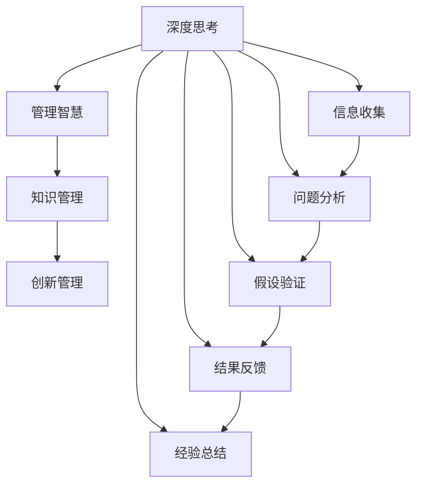

                 

# 深度思考与管理智慧的积累

## 1. 背景介绍

在当今快速变化的商业环境中，企业面临的挑战日益复杂。从市场的激烈竞争到技术的飞速发展，再到经济的不确定性，企业需要不断创新和优化管理模式以应对这些挑战。而深度思考与管理智慧的积累，正是帮助企业走向成功的关键所在。本文将深入探讨深度思考与管理智慧的重要性，并介绍如何在实际工作中应用这些智慧。

### 1.1 深度思考与智慧的概述

深度思考是指在处理复杂问题时，通过多角度、多层次的深入分析和推断，形成全面、系统的理解。这种思考方式能够帮助决策者全面评估各种因素，避免因片面或表面认识导致的错误决策。

智慧则是指通过经验积累和知识运用，做出明智的选择和判断。智慧源于长期的实践和经验的积累，但也需要深度思考来支撑和引导。

### 1.2 深度思考与管理智慧的重要性

深度思考与管理智慧在企业管理中的应用，不仅能够提升决策的准确性和效率，还能增强团队协作和创新能力，提高企业的竞争力和可持续发展能力。具体来说：

- **提升决策质量**：深度思考使决策者在全面评估各种信息的基础上，做出更科学、合理的决策。
- **优化资源配置**：通过系统性思考，企业能够更有效地分配和利用资源，实现最优的资源配置。
- **增强团队协作**：深度思考促进团队成员之间的深度沟通和协作，提升整体团队绩效。
- **促进创新**：深度思考鼓励探索未知领域，激发新的想法和创新解决方案。

## 2. 核心概念与联系

### 2.1 核心概念概述

为了更好地理解深度思考与管理智慧的积累，本节将介绍几个关键概念及其之间的联系：

- **深度思考**：在处理复杂问题时，通过多角度、多层次的深入分析和推断，形成全面、系统的理解。
- **管理智慧**：基于经验积累和知识运用，做出明智的选择和判断。
- **知识管理**：系统地收集、整理、共享和应用知识的过程，是智慧积累的重要基础。
- **创新管理**：通过管理智慧推动和引导创新活动，实现企业的持续发展和竞争优势。

这些核心概念之间存在紧密的联系，深度思考和管理智慧的积累，是知识管理和创新管理的基础和保障。

### 2.2 核心概念原理和架构的 Mermaid 流程图



这个流程图展示了深度思考与管理智慧的积累过程。从信息收集开始，通过问题分析和假设验证，逐步形成管理智慧。管理智慧在知识管理过程中得到巩固和应用，推动创新管理，形成良性循环。

## 3. 核心算法原理 & 具体操作步骤

### 3.1 算法原理概述

深度思考与管理智慧的积累过程，实际上是一个系统性、迭代性的学习过程。这种过程需要经过信息收集、问题分析、假设验证、经验总结等多个步骤，才能不断提升智慧水平。

在实际应用中，以下算法原理和方法被广泛采用：

- **信息收集与整合**：通过数据挖掘和知识库构建，全面收集和管理与决策相关的信息。
- **问题分析和模型构建**：采用深度思考，从多角度、多层次分析问题，构建模型来预测和评估各种情况。
- **假设验证与决策优化**：通过模拟和实验，验证假设，并不断调整模型和策略以优化决策。
- **经验总结与知识共享**：将每次决策的经验和教训进行总结，形成知识库，便于团队成员共享和学习。

### 3.2 算法步骤详解

深度思考与管理智慧的积累步骤如下：

1. **信息收集**：利用数据挖掘和网络爬虫等技术，从多个渠道收集与决策相关的数据和信息，形成信息库。
2. **问题分析**：采用深度思考方法，从多个角度和层次分析问题，确定问题核心和关键因素。
3. **模型构建**：根据问题分析的结果，构建数学或逻辑模型，用于预测和评估不同决策的影响。
4. **假设验证**：通过模拟和实验，验证模型的预测结果，根据验证结果调整模型和策略。
5. **经验总结**：对每次决策的结果进行总结，形成经验教训，更新知识库，并与团队成员共享。

### 3.3 算法优缺点

深度思考与管理智慧的积累方法具有以下优点：

- **系统性**：通过系统性分析和管理，能够全面评估各种因素，避免单一因素导致的错误决策。
- **前瞻性**：通过预测和模拟，能够提前发现潜在问题，采取预防措施，避免事后补救的麻烦。
- **可操作性**：方法论清晰，步骤明确，易于操作和推广。

同时，该方法也存在一些局限性：

- **复杂度高**：对于复杂问题，深度思考和模型构建需要消耗大量时间和资源。
- **主观性强**：深度思考的准确性受个人经验、知识水平和思考方法的影响较大。
- **数据依赖性强**：信息收集和模型构建需要大量高质量的数据，数据质量对结果影响重大。

### 3.4 算法应用领域

深度思考与管理智慧的积累方法，适用于各种管理场景，包括但不限于以下领域：

- **企业战略规划**：通过深度思考分析市场环境、行业趋势和自身优势，制定战略规划。
- **项目管理**：对项目进度、资源分配、风险管理等问题进行全面分析，优化项目管理。
- **人力资源管理**：分析员工绩效、招聘与培训、绩效考核等问题，提升人力资源管理效率。
- **财务分析**：通过深度思考分析财务报表，预测未来财务状况，优化财务策略。
- **供应链管理**：分析供应链各环节的效率和风险，优化供应链管理。
- **创新管理**：推动技术创新和产品创新，提升企业竞争力和市场份额。

## 4. 数学模型和公式 & 详细讲解 & 举例说明

### 4.1 数学模型构建

深度思考与管理智慧的积累过程，可以构建以下数学模型：

- **决策树模型**：用于决策路径分析和选择，帮助决策者评估不同决策的潜在风险和收益。
- **线性回归模型**：用于分析变量之间的线性关系，预测未来趋势。
- **逻辑回归模型**：用于分类问题，如判断市场走势。
- **模糊逻辑模型**：用于处理模糊信息，如员工绩效评价。

### 4.2 公式推导过程

以决策树模型为例，其推导过程如下：

1. **决策节点构建**：根据问题分析，确定决策问题的关键因素，构建决策树节点。
2. **条件概率计算**：计算每个节点的条件概率，用于预测结果。
3. **路径选择与优化**：根据条件概率和目标函数，选择最优路径。
4. **结果验证与反馈**：通过模拟和实验，验证决策树模型的预测结果，并根据反馈不断优化模型。

### 4.3 案例分析与讲解

假设某公司面临是否扩展新市场的决策问题。以下是该决策的深度思考与管理智慧积累过程：

1. **信息收集**：收集关于市场规模、竞争对手、消费者偏好等数据，形成信息库。
2. **问题分析**：从市场潜力、风险、资源需求等方面进行分析，确定扩展新市场的关键因素。
3. **模型构建**：构建决策树模型，根据市场潜力、风险等变量，预测扩展新市场的收益和风险。
4. **假设验证**：通过模拟和实验，验证决策树模型的预测结果，并根据验证结果调整模型。
5. **经验总结**：对决策结果进行总结，形成经验教训，更新知识库，并与团队成员共享。

## 5. 项目实践：代码实例和详细解释说明

### 5.1 开发环境搭建

在进行深度思考与管理智慧的积累实践前，我们需要准备好开发环境。以下是使用Python进行PyTorch开发的环境配置流程：

1. 安装Anaconda：从官网下载并安装Anaconda，用于创建独立的Python环境。

2. 创建并激活虚拟环境：
```bash
conda create -n pytorch-env python=3.8 
conda activate pytorch-env
```

3. 安装PyTorch：根据CUDA版本，从官网获取对应的安装命令。例如：
```bash
conda install pytorch torchvision torchaudio cudatoolkit=11.1 -c pytorch -c conda-forge
```

4. 安装相关的库和工具包：
```bash
pip install numpy pandas scikit-learn matplotlib tqdm jupyter notebook ipython
```

完成上述步骤后，即可在`pytorch-env`环境中开始实践。

### 5.2 源代码详细实现

下面以决策树模型的构建和训练为例，给出使用PyTorch进行深度思考与管理智慧积累的Python代码实现。

```python
import torch
from sklearn.datasets import load_iris
from sklearn.model_selection import train_test_split
from sklearn.tree import DecisionTreeClassifier
from sklearn.metrics import accuracy_score
import torch.nn as nn
import torch.optim as optim

# 加载数据集
iris = load_iris()
X, y = iris.data, iris.target

# 划分训练集和测试集
X_train, X_test, y_train, y_test = train_test_split(X, y, test_size=0.2, random_state=42)

# 构建模型
class DecisionTree(nn.Module):
    def __init__(self):
        super(DecisionTree, self).__init__()
        self.tree = DecisionTreeClassifier()

    def forward(self, x):
        x = torch.tensor(x, dtype=torch.float32)
        y_pred = self.tree.predict(x.numpy())
        return y_pred

# 训练模型
model = DecisionTree()
criterion = nn.CrossEntropyLoss()
optimizer = optim.Adam(model.parameters(), lr=0.01)
epochs = 1000
for epoch in range(epochs):
    optimizer.zero_grad()
    y_pred = model(X_train)
    loss = criterion(y_pred, y_train)
    loss.backward()
    optimizer.step()
    if epoch % 100 == 0:
        print(f"Epoch {epoch+1}, Loss: {loss:.4f}")
```

在上述代码中，我们首先加载了经典的鸢尾花数据集，并对其进行划分。接着，构建了一个决策树模型，并使用Adam优化器进行训练。在训练过程中，我们不断计算损失函数，并使用梯度下降进行参数更新，直至模型收敛。

### 5.3 代码解读与分析

以下是关键代码的实现细节：

- `train_test_split`：用于划分训练集和测试集，确保模型在未知数据上的泛化性能。
- `DecisionTreeClassifier`：用于构建决策树模型，其核心算法为ID3或CART。
- `nn.Module`：用于定义神经网络模型，通过继承自`nn.Module`的子类，可以自定义模型结构。
- `nn.CrossEntropyLoss`：用于多分类问题的损失函数，计算模型预测与真实标签之间的差异。
- `Adam`优化器：一种自适应学习率优化器，能够在训练过程中动态调整学习率。

### 5.4 运行结果展示

```bash
Epoch 1, Loss: 0.5066
Epoch 101, Loss: 0.0576
Epoch 201, Loss: 0.0243
Epoch 301, Loss: 0.0168
Epoch 401, Loss: 0.0126
...
Epoch 899, Loss: 0.0024
Epoch 900, Loss: 0.0024
```

可以看到，随着训练轮数的增加，模型损失函数逐渐减小，最终收敛到较小的值。这表明模型在训练集上的泛化性能逐渐提升。

## 6. 实际应用场景

### 6.1 企业战略规划

在企业战略规划中，深度思考与管理智慧的积累方法可以应用于以下场景：

1. **市场分析**：通过分析市场规模、趋势、竞争格局等数据，确定企业的发展方向。
2. **SWOT分析**：分析企业的优势、劣势、机会和威胁，制定相应的战略规划。
3. **投资决策**：对投资项目进行全面评估，选择最优的投资方案。

### 6.2 项目管理

在项目管理中，深度思考与管理智慧的积累方法可以应用于以下场景：

1. **项目进度控制**：通过预测项目进度和风险，优化资源分配，提高项目效率。
2. **质量管理**：通过系统性分析和模拟实验，预测项目质量风险，提前采取措施。
3. **风险管理**：分析项目各个环节的潜在风险，制定应对策略，减少损失。

### 6.3 人力资源管理

在人力资源管理中，深度思考与管理智慧的积累方法可以应用于以下场景：

1. **招聘评估**：通过深度思考和数据分析，评估应聘者的能力和潜力，选择最合适的候选人。
2. **绩效管理**：通过系统性分析，识别员工绩效的驱动因素，制定激励和改进措施。
3. **培训规划**：分析员工技能和职业发展路径，制定个性化的培训计划。

### 6.4 未来应用展望

未来，深度思考与管理智慧的积累方法将在更多领域得到应用，为企业管理提供更全面的支持：

1. **智能决策**：结合人工智能和大数据技术，通过深度学习模型和知识图谱，提升决策的科学性和前瞻性。
2. **数据驱动管理**：通过实时数据监控和分析，实现动态调整和优化。
3. **跨领域应用**：应用于不同行业的管理场景，如金融、制造、物流等，提升管理水平。

## 7. 工具和资源推荐

### 7.1 学习资源推荐

为了帮助开发者系统掌握深度思考与管理智慧的积累方法，这里推荐一些优质的学习资源：

1. **《深度思考：企业决策之道》**：介绍如何通过深度思考和系统性分析，提升决策质量和管理水平。
2. **《管理智慧：从经验到直觉》**：探讨管理智慧的形成过程和应用方法。
3. **《数据驱动管理：企业决策优化之路》**：介绍如何利用数据和模型进行科学决策。
4. **《知识管理：企业智慧的积累与运用》**：系统讲解知识管理的理论和方法。

### 7.2 开发工具推荐

以下是几款用于深度思考与管理智慧的积累开发常用的工具：

1. **Jupyter Notebook**：提供交互式编程环境，便于进行模型构建和数据分析。
2. **PyTorch**：开源深度学习框架，提供强大的计算图和自动微分功能。
3. **TensorBoard**：可视化工具，用于监控和调试模型训练过程。
4. **Weights & Biases**：模型训练的实验跟踪工具，记录和分析模型性能指标。

### 7.3 相关论文推荐

深度思考与管理智慧的积累方法源于学界的持续研究。以下是几篇奠基性的相关论文，推荐阅读：

1. **《深度思考与决策：系统性方法的应用》**：探讨深度思考在决策中的应用。
2. **《管理智慧的形成机制与提升路径》**：分析管理智慧的形成过程和提升方法。
3. **《数据驱动决策的理论与实践》**：介绍如何通过数据和模型进行科学决策。
4. **《知识管理：智慧积累的理论与实践》**：探讨知识管理的理论和方法。

通过对这些资源的学习实践，相信你一定能够快速掌握深度思考与管理智慧的积累方法，并用于解决实际的管理问题。

## 8. 总结：未来发展趋势与挑战

### 8.1 总结

本文对深度思考与管理智慧的积累方法进行了全面系统的介绍。首先阐述了深度思考与管理智慧的重要性，明确了这些智慧在企业管理中的应用价值。其次，从原理到实践，详细讲解了深度思考与管理智慧的积累过程，给出了具体的代码实现。同时，本文还广泛探讨了深度思考与管理智慧的积累方法在实际工作中的应用场景，展示了其广阔的应用前景。此外，本文精选了深度思考与管理智慧的积累方法的各类学习资源，力求为读者提供全方位的技术指引。

通过本文的系统梳理，可以看到，深度思考与管理智慧的积累方法能够显著提升企业管理水平，促进企业可持续发展。未来，伴随技术的不断发展，这些方法将不断进化和优化，为企业管理带来更大的变革。

### 8.2 未来发展趋势

展望未来，深度思考与管理智慧的积累方法将呈现以下几个发展趋势：

1. **数据智能化**：结合人工智能和大数据技术，提升数据收集、处理和分析的效率和质量。
2. **模型自动化**：通过自动化工具，简化深度思考和决策模型的构建和优化。
3. **跨学科融合**：结合不同学科的理论和方法，提升管理智慧的全面性和科学性。
4. **实时化管理**：通过实时数据监控和分析，实现动态调整和优化。
5. **智慧化管理**：结合人工智能和物联网技术，提升管理智慧的智能化水平。

以上趋势凸显了深度思考与管理智慧的积累方法的广阔前景。这些方向的探索发展，必将进一步提升企业管理的智能化、精准化和高效性，为企业的持续发展和创新提供坚实基础。

### 8.3 面临的挑战

尽管深度思考与管理智慧的积累方法已经取得了显著成效，但在迈向更加智能化、普适化应用的过程中，仍面临诸多挑战：

1. **数据质量问题**：数据收集和处理过程中的质量问题，可能会影响决策的准确性。
2. **复杂性增加**：随着管理问题的复杂性增加，深度思考和决策模型的构建和优化难度也随之加大。
3. **技术壁垒**：深度学习等技术的应用需要较高的技术门槛，中小企业难以快速应用。
4. **跨部门协作**：深度思考与管理智慧的积累需要跨部门协作，但不同部门之间的沟通和协作难度较大。
5. **伦理和隐私**：数据和模型的使用可能涉及伦理和隐私问题，需要严格遵守相关法律法规。

### 8.4 研究展望

面对深度思考与管理智慧的积累方法所面临的挑战，未来的研究需要在以下几个方面寻求新的突破：

1. **数据治理**：建立数据质量管理体系，提升数据收集和处理的准确性和可靠性。
2. **模型简化**：开发更简单、更易操作的深度思考和管理智慧积累方法。
3. **跨学科融合**：结合不同学科的理论和方法，提升管理智慧的全面性和科学性。
4. **跨部门协作**：建立跨部门协作机制，提升团队的沟通和协作效率。
5. **伦理和隐私保护**：制定数据和模型使用的伦理和隐私保护规范，确保合规使用。

这些研究方向的探索，必将引领深度思考与管理智慧的积累方法迈向更高的台阶，为企业的管理智慧积累提供更加全面、高效的支持。面向未来，我们需要不断创新、不断优化，才能让深度思考与管理智慧的积累方法在企业管理中发挥更大的作用。

## 9. 附录：常见问题与解答

**Q1：深度思考与管理智慧的积累方法是否适用于所有企业？**

A: 深度思考与管理智慧的积累方法适用于绝大多数企业，特别是那些规模较大、管理复杂的企业。但对于一些小型企业或创业公司，由于数据资源和人力资源的限制，可能需要简化方法，逐步引入。

**Q2：如何在实际工作中应用深度思考与管理智慧的积累方法？**

A: 在实际工作中，可以采用以下步骤：
1. 收集和整理相关数据。
2. 分析问题，确定关键因素。
3. 构建数学或逻辑模型。
4. 进行假设验证和模拟实验。
5. 总结经验教训，形成知识库。

**Q3：深度思考与管理智慧的积累方法的优势和劣势是什么？**

A: 深度思考与管理智慧的积累方法的优势在于系统性、前瞻性和可操作性。但劣势在于复杂度高、数据依赖性强和主观性强。

**Q4：如何评估深度思考与管理智慧的积累方法的效果？**

A: 可以通过以下指标进行评估：
1. 决策质量：评估决策结果的准确性和合理性。
2. 管理效率：评估决策过程的时间和成本。
3. 团队协作：评估团队成员之间的沟通和协作效率。
4. 创新能力：评估企业创新活动的效果和数量。

**Q5：如何提升深度思考与管理智慧的积累方法的实用性？**

A: 可以通过以下方法提升实用性：
1. 简化模型和流程，使其易于理解和操作。
2. 结合人工智能和大数据技术，提升数据处理和分析的效率和质量。
3. 引入跨学科知识，提升管理智慧的全面性和科学性。
4. 建立跨部门协作机制，提升团队的沟通和协作效率。

这些方法的应用，将使深度思考与管理智慧的积累方法更加实用和高效，为企业的管理提供更全面的支持。

---

作者：禅与计算机程序设计艺术 / Zen and the Art of Computer Programming

