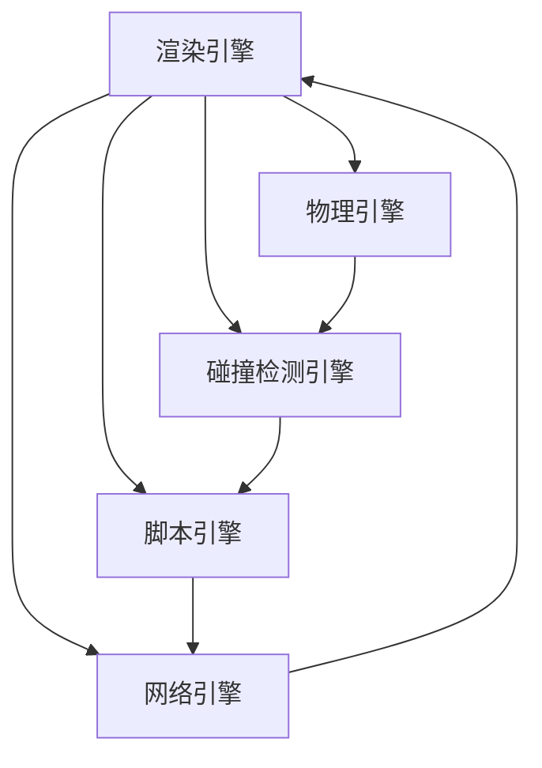

                 

# 游戏开发框架选择与应用

在当前的游戏开发生态中，选择合适的开发框架至关重要。本文将深入探讨游戏开发框架的核心概念与联系，分析不同框架的原理与操作步骤，并通过项目实践展示其优缺点及应用领域。同时，文章还将总结框架的未来发展趋势与挑战，并推荐相关的学习资源与工具。

## 1. 背景介绍

### 1.1 问题由来

随着游戏行业的迅猛发展，游戏开发框架也在不断演进。从早期的C++引擎，到如今的无引擎游戏开发，框架的选择直接关系到游戏开发的效率与质量。框架的选择直接影响开发者对游戏架构的理解、编程习惯的培养以及项目的进度和可维护性。

### 1.2 问题核心关键点

选择游戏开发框架主要需要考虑以下几点：
- **框架的功能与特性**：如引擎的图形渲染能力、物理模拟、网络通信等。
- **学习曲线和生态系统**：框架的学习难度、社区支持和第三方库资源。
- **性能与优化**：框架的性能表现和优化特性。
- **跨平台支持**：框架对不同平台（如PC、移动、主机等）的兼容性。
- **扩展性与灵活性**：框架是否容易扩展，是否支持自定义插件等。
- **成本与收益**：框架的商业许可证、开发成本以及使用效益。

## 2. 核心概念与联系

### 2.1 核心概念概述

游戏开发框架是指用于简化游戏开发过程的工具和资源的集合，包括图形渲染引擎、物理引擎、人工智能引擎、音频引擎等。一个完整的游戏开发框架通常包括以下组件：
- **渲染引擎**：用于处理图形渲染的引擎，如Unity、Unreal Engine等。
- **物理引擎**：用于处理游戏物理的引擎，如PhysX、NVIDIA Physics等。
- **碰撞检测引擎**：用于处理游戏物体之间的碰撞检测，如Box2D等。
- **脚本引擎**：用于编写游戏逻辑的引擎，如Lua、JavaScript等。
- **网络引擎**：用于处理多人在线游戏的引擎，如TCP/UDP、P2P等。

### 2.2 核心概念原理和架构的 Mermaid 流程图



### 2.3 核心概念的联系

这些核心概念通过合作提供了一个完整的游戏开发框架，各自在框架中扮演着不同的角色，但它们之间相互依赖、相互协作，共同构建起游戏开发的生态环境。

- **渲染引擎**：负责处理图形渲染，提供场景渲染、光照、材质等特效功能，是游戏界面展示的基础。
- **物理引擎**：处理游戏物体的物理交互，如碰撞检测、重力、摩擦力等，提供真实的物理模拟。
- **碰撞检测引擎**：检测并处理游戏物体间的碰撞，保证游戏逻辑的正确性。
- **脚本引擎**：负责游戏的逻辑控制，如角色行为、AI等，使游戏动态运行。
- **网络引擎**：处理游戏的网络传输，支持多人在线游戏，提供稳定的网络通信。

## 3. 核心算法原理 & 具体操作步骤

### 3.1 算法原理概述

一个游戏开发框架的核心算法原理可以归纳为以下几点：
- **物理模拟**：通过数学模型模拟游戏物体的物理行为，如刚体动力学、碰撞响应等。
- **渲染管线**：通过图形渲染管线，将3D场景转换为2D图像，处理光照、阴影等效果。
- **碰撞检测**：通过算法检测游戏物体之间的碰撞，实现物体间的交互。
- **网络通信**：通过算法实现游戏中的网络通信，处理玩家之间的同步和数据传输。
- **脚本执行**：通过解释器或编译器执行游戏逻辑，控制游戏流程。

### 3.2 算法步骤详解

选择游戏开发框架的一般步骤如下：
1. **需求分析**：明确游戏的功能需求、技术要求、性能指标等。
2. **框架调研**：收集主流游戏开发框架的信息，包括功能特性、社区支持、学习难度等。
3. **框架评估**：根据需求分析结果，对比不同框架的优势和劣势。
4. **试用测试**：在开发过程中试用框架，验证其性能和稳定性。
5. **框架选择**：综合考虑多方面因素，选择最适合的框架。

### 3.3 算法优缺点

游戏开发框架的选择应当权衡其优缺点，考虑以下几个方面：
- **优点**：
  - 提高开发效率：框架提供了大量的工具和组件，减少了开发时间。
  - 提高开发质量：框架的代码库和社区支持提高了代码质量和可维护性。
  - 跨平台支持：框架通常支持多平台开发，便于部署。
- **缺点**：
  - 学习曲线高：部分框架的复杂度较高，初学者可能需要花费一定时间学习。
  - 性能瓶颈：框架的性能优化空间有限，存在一定限制。
  - 生态系统依赖：框架的生态系统依赖于第三方库和插件，一旦出现问题可能影响整个项目。

### 3.4 算法应用领域

游戏开发框架的应用领域非常广泛，主要包括以下几个方面：
- **游戏开发**：包括各种类型的游戏，如动作、冒险、角色扮演等。
- **游戏引擎开发**：开发新的游戏引擎，用于提供基础组件和工具。
- **游戏工具开发**：开发游戏开发所需的各种工具，如编辑器、调试器等。
- **游戏物理模拟**：开发物理引擎，提供真实的物理模拟。
- **游戏网络通信**：开发网络引擎，支持多人在线游戏。

## 4. 数学模型和公式 & 详细讲解 & 举例说明

### 4.1 数学模型构建

游戏开发中的数学模型主要涉及以下几个方面：
- **线性代数**：用于处理3D坐标变换、矩阵运算等。
- **微积分**：用于处理物理模拟、动画插值等。
- **统计学**：用于数据分析、AI算法等。
- **几何学**：用于碰撞检测、光照计算等。

### 4.2 公式推导过程

以碰撞检测为例，常见的碰撞检测算法有：
- **包围盒检测**：通过包围盒判断两个物体是否相交。
- **碰撞轴检测**：通过物体之间的轴线判断是否相交。
- **分离轴定理**：通过找到分离轴判断碰撞。

### 4.3 案例分析与讲解

以Unity中的碰撞检测为例，其碰撞检测原理如下：
1. **包围盒检测**：Unity使用包围盒（AABB）检测两个物体是否相交。
2. **碰撞轴检测**：通过找到两个物体的最小轴线，判断它们是否平行。
3. **分离轴定理**：找到分离轴，计算两个物体的距离，判断是否发生碰撞。

## 5. 项目实践：代码实例和详细解释说明

### 5.1 开发环境搭建

以下是一个基于Unity 3D的开发环境搭建流程：
1. **安装Unity**：从Unity官网下载并安装Unity。
2. **配置环境变量**：配置Unity的安装路径、编辑环境等。
3. **安装插件**：根据项目需求，安装必要的Unity插件。
4. **创建项目**：使用Unity Hub创建新项目，选择适合的模板。

### 5.2 源代码详细实现

以下是一个简单的Unity 3D场景创建的代码实现：
```csharp
using UnityEngine;

public class Main : MonoBehaviour
{
    void Start()
    {
        // 创建场景对象
        GameObject scene = new GameObject("Scene");
        scene.AddComponent<Scene>();

        // 创建地面
        GameObject ground = new GameObject("Ground");
        ground.AddComponent<BoxCollider>();
        ground.AddComponent<Rigidbody>();
        ground.AddComponent<MeshFilter>();
        ground.AddComponent<MeshRenderer>();
        ground.GetComponent<MeshRenderer>().mesh = Mesh.GenerateBox(new Vector3(10, 0.1f, 10), new Vector3(1, 0.1f, 1));

        // 创建玩家
        GameObject player = new GameObject("Player");
        player.AddComponent<BoxCollider>();
        player.AddComponent<Rigidbody>();
        player.AddComponent<MeshFilter>();
        player.AddComponent<MeshRenderer>();
        player.GetComponent<MeshRenderer>().mesh = Mesh.GenerateBox(new Vector3(0.5f, 0.5f, 0.5f), new Vector3(1, 1, 1));

        // 设置玩家物理属性
        player.GetComponent<Rigidbody>().useGravity = false;
        player.GetComponent<MeshRenderer>().material.color = new Color(1, 0, 0);

        // 创建光源
        GameObject light = new GameObject("Light");
        light.AddComponent<Light>();
        light.GetComponent<Light>().shadows = true;
        light.GetComponent<Light>().shadowDistance = 10;
    }
}
```

### 5.3 代码解读与分析

上述代码中，我们创建了一个简单的Unity 3D场景，包括地面、玩家和光源。代码主要涉及对象的创建、组件的添加和属性的设置。
- **场景对象**：创建了一个名为"Scene"的场景对象，并添加了Scene组件。
- **地面对象**：创建了一个名为"Ground"的地面对象，并添加了BoxCollider、Rigidbody、MeshFilter和MeshRenderer等组件。
- **玩家对象**：创建了一个名为"Player"的玩家对象，并添加了BoxCollider、Rigidbody、MeshFilter和MeshRenderer等组件。
- **光源对象**：创建了一个名为"Light"的光源对象，并添加了Light组件。

### 5.4 运行结果展示

运行上述代码后，可以看到一个简单的Unity 3D场景，地面、玩家和光源均已正确创建，且玩家可以在场景中移动。

## 6. 实际应用场景

### 6.1 游戏开发

Unity和Unreal Engine是目前最流行的游戏开发框架，广泛应用于各类游戏开发中。如《王者荣耀》、《绝地求生》等热门游戏均基于这两款引擎开发。

### 6.2 游戏引擎开发

Unreal Engine 5的蓝图系统允许开发者无需编写代码即可创建游戏引擎，大大降低了游戏引擎开发的门槛。

### 6.3 游戏工具开发

Unity的编辑器和插件生态系统非常丰富，如Asset Store、Unity Hub等，提供了大量的工具和组件，方便开发者进行游戏开发。

### 6.4 未来应用展望

随着游戏技术的不断进步，未来的游戏开发框架将具备更高的性能、更好的跨平台支持和更多的功能特性。如VR/AR游戏、云游戏等新技术将为游戏开发框架带来新的挑战和机遇。

## 7. 工具和资源推荐

### 7.1 学习资源推荐

1. **Unity官方文档**：提供了全面的Unity 3D开发教程和文档，适合初学者和进阶开发者。
2. **Unreal Engine官方文档**：提供了Unreal Engine 4和5的开发教程和文档，适合有C++基础的开发者。
3. **游戏编程指南**：讲解了Unity、Unreal Engine等游戏引擎的开发流程和实战案例。
4. **C++游戏编程**：讲解了C++在游戏开发中的应用，适合有C++基础的开发者。
5. **Gamasutra**：提供了大量的游戏开发教程和案例，适合有一定经验的开发者。

### 7.2 开发工具推荐

1. **Unity Hub**：用于管理Unity项目和插件的集成环境。
2. **Unreal Engine Editor**：用于创建和编辑Unreal Engine游戏的编辑器。
3. **VS Code**：支持Unity和Unreal Engine开发的环境配置和管理。
4. **Git**：用于版本控制，方便开发者协作开发。
5. **GitHub**：用于代码托管和分享，适合开源项目的协作开发。

### 7.3 相关论文推荐

1. **《Unity游戏开发实战》**：讲解了Unity 3D的开发流程和实战案例，适合初学者。
2. **《Unreal Engine 5实战》**：讲解了Unreal Engine 5的开发流程和实战案例，适合有C++基础的开发者。
3. **《游戏编程模式》**：讲解了游戏编程中的经典模式和设计原则。
4. **《游戏物理模拟》**：讲解了游戏物理模拟的数学模型和算法实现。
5. **《游戏网络通信》**：讲解了游戏网络通信的算法实现和优化。

## 8. 总结：未来发展趋势与挑战

### 8.1 研究成果总结

本文对游戏开发框架的选择与应用进行了系统介绍，分析了框架的核心概念与联系，以及框架的算法原理和操作步骤。通过项目实践展示了框架的优缺点和应用领域，总结了框架的未来发展趋势和挑战，并推荐了相关的学习资源与工具。

### 8.2 未来发展趋势

未来的游戏开发框架将具备更高的性能、更好的跨平台支持和更多的功能特性。如VR/AR游戏、云游戏等新技术将为游戏开发框架带来新的挑战和机遇。

### 8.3 面临的挑战

选择游戏开发框架时，需要权衡其优缺点，考虑多方面因素。如框架的学习曲线、性能优化、生态系统依赖等。

### 8.4 研究展望

未来的游戏开发框架将更加注重性能优化、跨平台支持和社区生态的建设。如多线程并发处理、内存管理优化、跨平台性能优化等。

## 9. 附录：常见问题与解答

**Q1：如何选择适合的游戏开发框架？**

A: 选择游戏开发框架时，应根据项目需求、团队技术栈、开发成本等因素进行评估。建议试用多个框架，并根据实际效果做出选择。

**Q2：如何提高Unity开发效率？**

A: 使用Unity Hub管理项目和插件，使用VS Code作为编辑器，使用Git进行版本控制，使用Unity Asset Store获取第三方资源。

**Q3：如何使用Unreal Engine进行多人在线游戏开发？**

A: 使用Unreal Engine的网络引擎，实现TCP/UDP通信，使用蓝图编写多人游戏逻辑。

**Q4：如何优化Unity的性能？**

A: 使用Unity优化工具进行性能分析，使用Mesh压缩、纹理压缩等技术减小文件大小，使用静态批处理、异步加载等技术提高渲染效率。

**Q5：如何实现Unreal Engine 5的游戏引擎开发？**

A: 使用Unreal Engine Editor创建游戏引擎，使用C++编写引擎代码，使用蓝图进行逻辑控制。

---

作者：禅与计算机程序设计艺术 / Zen and the Art of Computer Programming

