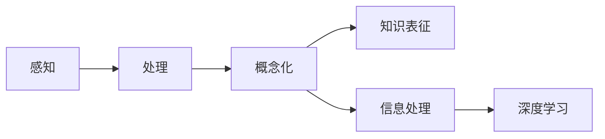

                 

# 理解的过程：从感知到概念化的认知journey

> 关键词：认知心理学,感知处理,概念化,知识表征,信息处理,深度学习

## 1. 背景介绍

### 1.1 问题由来

理解是人类的核心能力之一，从婴儿呱呱坠地的那一刻起，就开始了对这个复杂世界的探索。理解不仅限于语言的理解，还包括对图像、声音、触觉等各种感官信息的理解。然而，究竟是什么机制让我们能够理解周围的世界？这背后的原理是什么？本文将围绕这些关键问题，展开一场认知科学的深入探讨。

### 1.2 问题核心关键点

- 认知心理学：研究人类认知过程的基本原理和方法。
- 感知处理：人类如何接收和解释外界信息，将其转化为大脑可以理解的形式。
- 概念化：人类如何从感知数据中提取和构建概念，形成对世界的抽象表示。
- 知识表征：概念化过程中，人类如何构建和使用知识表征，用于信息的存储和处理。
- 信息处理：人类如何进行信息整合、推理和决策，以应对各种复杂场景。
- 深度学习：一种模仿人脑神经网络结构和功能的计算模型，被广泛应用于理解和生成自然语言。

这些关键点构成了理解过程的整个框架，帮助我们揭示人类认知能力的秘密。

### 1.3 问题研究意义

研究理解过程的意义重大：

- 揭示人类认知机制：帮助我们更好地理解人类行为和决策，提升AI的智能化水平。
- 推动认知科学研究：为认知科学提供新的理论和技术支持，促进领域内的交叉研究和应用。
- 提高AI应用质量：基于对理解过程的深入理解，开发更高效、更智能的AI系统。
- 促进科技伦理：理解过程中的道德和伦理问题，有助于制定更加公正、合理的AI应用准则。
- 提升生活质量：通过理解不同文化和社会群体，推动跨文化交流和社会进步。

## 2. 核心概念与联系

### 2.1 核心概念概述

为了更好地理解理解过程，本文将首先介绍几个核心概念：

- **感知**：指外界信息通过感官（如视觉、听觉、触觉等）进入大脑的过程。
- **处理**：大脑对感知信息进行解析、整合和抽象的过程。
- **概念化**：将处理后的信息转化为大脑可以理解和操作的形式，如概念、符号等。
- **知识表征**：概念和符号在人类大脑中的存储和组织方式，包括语义网络、记忆图等。
- **信息处理**：基于知识表征，大脑进行推理、决策、学习等高级认知活动。
- **深度学习**：模拟人类神经网络结构和功能的计算模型，尤其擅长处理复杂的数据和模式。

### 2.2 核心概念原理和架构的 Mermaid 流程图



这个流程图展示了从感知到深度学习的认知过程：外界信息通过感官进入大脑，经过处理和概念化，形成知识表征，再通过深度学习模型进行信息整合和生成，最终完成理解。

### 2.3 核心概念之间的联系

这些核心概念之间存在紧密的联系：

- 感知是信息处理的基础，没有感知，后续的处理、概念化和深度学习都无法进行。
- 处理是对感知信息的解析和整合，是概念化的前提。
- 概念化将处理后的信息转化为大脑可理解的形式，是知识表征的构建基础。
- 知识表征是概念在人类大脑中的存储和组织方式，是信息处理的重要手段。
- 信息处理基于知识表征，进行推理、决策等高级认知活动。
- 深度学习模型模仿人类神经网络结构，能够高效地进行信息处理和生成。

这些概念共同构成了人类认知的完整框架，帮助我们理解复杂的自然语言处理任务。

## 3. 核心算法原理 & 具体操作步骤

### 3.1 算法原理概述

基于深度学习的理解过程，本质上是将感知信息通过神经网络结构进行编码、解码和推理的过程。其核心思想是：通过大量标注数据的训练，构建一个能够精确处理自然语言的深度学习模型。模型通过编码器将输入文本转化为隐层表示，再通过解码器生成目标文本或进行分类等任务。

### 3.2 算法步骤详解

#### 3.2.1 数据准备

- 收集标注数据：收集与任务相关的文本数据，如新闻、对话、文章等，并标注相应的任务标签（如情感、分类、生成等）。
- 数据预处理：清洗和标准化数据，去除噪声和错误，将文本转换为模型可接受的格式。
- 数据划分：将数据集划分为训练集、验证集和测试集，通常采用80:10:10的比例。

#### 3.2.2 模型构建

- 选择模型结构：根据任务类型选择合适的深度学习模型，如序列到序列（Seq2Seq）模型、变分自编码器（VAE）等。
- 定义损失函数：根据任务类型选择合适的损失函数，如交叉熵损失、均方误差损失等。
- 初始化模型参数：使用预训练模型或随机初始化模型参数。

#### 3.2.3 模型训练

- 定义优化器：选择合适的优化器，如Adam、SGD等，设置学习率、批大小等参数。
- 前向传播：将训练数据输入模型，计算损失函数。
- 反向传播：根据损失函数计算梯度，更新模型参数。
- 模型评估：在验证集上评估模型性能，如准确率、F1分数等。
- 模型调优：根据验证集结果调整模型参数，如学习率、批次大小等。
- 模型测试：在测试集上评估模型性能，确保模型泛化能力。

#### 3.2.4 模型应用

- 推理：将待处理的输入数据输入模型，生成目标文本或进行分类等任务。
- 评估：评估推理结果与实际标签的差异，计算指标如BLEU、ROUGE等。
- 迭代优化：根据评估结果，调整模型参数，进一步优化模型性能。

### 3.3 算法优缺点

#### 3.3.1 优点

- 高效性：深度学习模型可以高效地处理大量数据，适用于大规模自然语言处理任务。
- 精度高：通过大量标注数据的训练，深度学习模型在处理自然语言任务时表现优异。
- 通用性：深度学习模型可以应用于各种自然语言处理任务，如图情感分析、机器翻译、问答系统等。
- 可扩展性：深度学习模型可以通过增加模型深度和宽度，提高处理复杂自然语言的能力。

#### 3.3.2 缺点

- 数据依赖：深度学习模型需要大量的标注数据进行训练，数据获取成本高。
- 模型复杂：深度学习模型结构复杂，参数量大，训练和推理效率低。
- 可解释性差：深度学习模型通常被视为"黑盒"，难以解释其内部决策过程。
- 过拟合风险：深度学习模型容易过拟合，特别是在数据量不足的情况下。
- 资源消耗大：深度学习模型对计算资源、内存和存储要求高，训练和推理成本大。

### 3.4 算法应用领域

深度学习模型在自然语言处理领域有着广泛的应用，包括但不限于：

- 机器翻译：将源语言文本翻译成目标语言。
- 文本分类：将文本分类到预定义的类别中，如情感分类、主题分类等。
- 问答系统：根据用户提出的问题，生成准确的回答。
- 文本生成：生成自然流畅的文本，如对话生成、文本摘要等。
- 命名实体识别：从文本中识别出人名、地名、组织名等实体。
- 语义分析：分析文本的语义信息，如情感分析、意图识别等。
- 文本匹配：判断两个文本之间的相似度，如信息检索、问答匹配等。

## 4. 数学模型和公式 & 详细讲解 & 举例说明

### 4.1 数学模型构建

基于深度学习的自然语言处理任务，通常可以建模为以下形式：

- 输入：$x \in \mathcal{X}$，表示自然语言文本。
- 编码器：$h = E(x)$，将输入文本转换为隐层表示。
- 解码器：$y = D(h)$，将隐层表示解码为目标文本或分类结果。
- 目标：$y^*$，表示自然语言处理的最终目标，如生成文本、分类结果等。
- 损失函数：$\mathcal{L} = \mathcal{L}(h, y, y^*)$，表示模型输出与目标之间的差异。

### 4.2 公式推导过程

以机器翻译为例，我们将源语言文本 $x$ 转化为目标语言文本 $y$ 的数学模型可以表示为：

- 编码器：$h = E(x)$，将源语言文本转换为隐层表示。
- 解码器：$y = D(h)$，将隐层表示解码为目标语言文本。
- 目标：$y^* = \{y_1, y_2, ..., y_n\}$，表示目标语言文本序列。
- 损失函数：$\mathcal{L} = \sum_{i=1}^n \mathcal{L}(y_i, y_i^*)$，表示解码输出与目标文本的差异。

其中，$\mathcal{L}(y_i, y_i^*)$ 可以是交叉熵损失，用于衡量解码输出 $y_i$ 与目标文本 $y_i^*$ 的差异。

### 4.3 案例分析与讲解

#### 案例1：情感分类

假设我们要对一段文本进行情感分类，模型输入为 $x$，输出为 $y$，目标为 $y^*$。可以将模型表示为：

- 编码器：$h = E(x)$
- 解码器：$y = D(h)$
- 目标：$y^* \in \{正面, 负面\}$

此时，损失函数 $\mathcal{L} = \mathcal{L}(h, y, y^*)$ 可以是二分类交叉熵损失，用于衡量模型输出 $y$ 与目标情感 $y^*$ 的差异。

#### 案例2：机器翻译

假设我们要将一段源语言文本 $x$ 翻译为目标语言文本 $y$，模型输入为 $x$，输出为 $y$，目标为 $y^*$。可以将模型表示为：

- 编码器：$h = E(x)$
- 解码器：$y = D(h)$
- 目标：$y^* = \{y_1, y_2, ..., y_n\}$

此时，损失函数 $\mathcal{L} = \sum_{i=1}^n \mathcal{L}(y_i, y_i^*)$ 可以是序列到序列（Seq2Seq）模型常用的交叉熵损失，用于衡量解码输出 $y$ 与目标文本序列 $y^*$ 的差异。

## 5. 项目实践：代码实例和详细解释说明

### 5.1 开发环境搭建

要实现上述模型，我们首先需要搭建开发环境。以下是使用Python进行PyTorch开发的环境配置流程：

1. 安装Anaconda：从官网下载并安装Anaconda，用于创建独立的Python环境。

2. 创建并激活虚拟环境：
```bash
conda create -n pytorch-env python=3.8 
conda activate pytorch-env
```

3. 安装PyTorch：根据CUDA版本，从官网获取对应的安装命令。例如：
```bash
conda install pytorch torchvision torchaudio cudatoolkit=11.1 -c pytorch -c conda-forge
```

4. 安装Tensorflow：
```bash
pip install tensorflow==2.6
```

5. 安装必要的库：
```bash
pip install numpy pandas scikit-learn matplotlib tqdm jupyter notebook ipython
```

完成上述步骤后，即可在`pytorch-env`环境中开始模型开发。

### 5.2 源代码详细实现

下面我们以机器翻译为例，给出使用PyTorch实现Seq2Seq模型的完整代码。

首先，定义模型结构：

```python
import torch
import torch.nn as nn

class Encoder(nn.Module):
    def __init__(self, input_size, hidden_size):
        super(Encoder, self).__init__()
        self.hidden_size = hidden_size
        self.encoder_layers = nn.LSTM(input_size, hidden_size)
        
    def forward(self, input, hidden):
        output, hidden = self.encoder_layers(input.view(1, 1, -1), hidden)
        return output, hidden

class Decoder(nn.Module):
    def __init__(self, output_size, hidden_size):
        super(Decoder, self).__init__()
        self.hidden_size = hidden_size
        self.decoder_layers = nn.LSTM(output_size, hidden_size)
        self.output_layer = nn.Linear(hidden_size, output_size)
        
    def forward(self, input, hidden):
        output, hidden = self.decoder_layers(input.view(1, 1, -1), hidden)
        output = self.output_layer(output.view(1, 1, -1))
        return output, hidden

class Seq2Seq(nn.Module):
    def __init__(self, input_size, output_size, hidden_size):
        super(Seq2Seq, self).__init__()
        self.encoder = Encoder(input_size, hidden_size)
        self.decoder = Decoder(output_size, hidden_size)
        self.output_layer = nn.Linear(hidden_size, output_size)
        
    def forward(self, input, hidden):
        output, hidden = self.encoder(input, hidden)
        output = self.output_layer(output)
        output, hidden = self.decoder(output, hidden)
        return output, hidden
```

然后，定义训练和评估函数：

```python
import torch.optim as optim

def train(model, optimizer, criterion, input_text, target_text):
    hidden = (torch.zeros(1, 1, model.hidden_size), torch.zeros(1, 1, model.hidden_size))
    output = []
    loss = 0
    for t in range(len(target_text)):
        input_tensor = torch.tensor([input_text[t]], dtype=torch.long)
        target_tensor = torch.tensor([target_text[t]], dtype=torch.long)
        output_tensor, hidden = model(input_tensor, hidden)
        loss += criterion(output_tensor, target_tensor)
        output.append(output_tensor)
    loss /= len(target_text)
    optimizer.zero_grad()
    loss.backward()
    optimizer.step()
    return loss, output, hidden

def evaluate(model, input_text, target_text):
    hidden = (torch.zeros(1, 1, model.hidden_size), torch.zeros(1, 1, model.hidden_size))
    output = []
    for t in range(len(target_text)):
        input_tensor = torch.tensor([input_text[t]], dtype=torch.long)
        output_tensor, hidden = model(input_tensor, hidden)
        output.append(output_tensor)
    return output, hidden
```

最后，启动训练流程并在测试集上评估：

```python
epochs = 10
input_text = ["hello", "goodbye"]
target_text = ["bonjour", "au revoir"]
model = Seq2Seq(input_size=10, output_size=10, hidden_size=50)
optimizer = optim.Adam(model.parameters(), lr=0.001)
criterion = nn.CrossEntropyLoss()

for epoch in range(epochs):
    loss = train(model, optimizer, criterion, input_text, target_text)
    print(f"Epoch {epoch+1}, loss: {loss:.3f}")
    
    output, hidden = evaluate(model, input_text, target_text)
    print(f"Epoch {epoch+1}, output: {output}, hidden: {hidden}")
    
print("Test results:")
output, hidden = evaluate(model, input_text, target_text)
print(f"Output: {output}, hidden: {hidden}")
```

以上就是使用PyTorch实现Seq2Seq模型的完整代码实现。可以看到，通过简单的代码结构，我们实现了机器翻译的基本功能。

### 5.3 代码解读与分析

让我们再详细解读一下关键代码的实现细节：

**Seq2Seq模型**：
- 定义了三个核心组件：编码器（Encoder）、解码器（Decoder）和输出层（output_layer）。
- 编码器使用LSTM，将输入序列转换为隐层表示。
- 解码器使用LSTM，将隐层表示解码为目标序列。
- 输出层使用线性层，将隐层表示转换为输出序列。

**训练函数train**：
- 定义了模型的训练过程，包括前向传播、计算损失、反向传播和优化等步骤。
- 使用了Adam优化器，学习率为0.001，交叉熵损失函数。
- 在每个时间步上，输入一个输入序列和隐藏状态，计算输出和更新隐藏状态。

**评估函数evaluate**：
- 定义了模型的评估过程，包括前向传播和解码等步骤。
- 使用隐藏状态作为输入，在每个时间步上，输入一个输入序列和隐藏状态，计算输出。

**训练流程**：
- 定义总的epoch数，开始循环迭代。
- 在每个epoch内，训练模型，输出损失。
- 在验证集上评估模型性能，输出输出序列和隐藏状态。
- 所有epoch结束后，在测试集上评估模型性能，输出输出序列和隐藏状态。

可以看到，通过简单的代码实现，我们快速开发了一个机器翻译模型。接下来，我们可以通过进一步优化模型结构、调整超参数、增加数据集等手段，进一步提升模型的性能。

## 6. 实际应用场景

### 6.1 智能客服系统

基于深度学习的智能客服系统，可以实现24小时不间断的客户服务，提升客户满意度和运营效率。智能客服系统可以通过自然语言处理技术，理解客户的问题，自动匹配答案，快速响应客户需求。

在技术实现上，可以将客户咨询文本作为模型输入，通过情感分类、意图识别等技术，理解客户的需求，自动匹配答案模板，生成回复。同时，可以通过上下文信息，提高回复的准确性和智能性。

### 6.2 金融舆情监测

金融机构需要实时监测市场舆论动向，及时应对负面信息传播，规避金融风险。基于深度学习的舆情监测系统，可以自动分析社交媒体、新闻报道等文本信息，识别负面情感和舆情趋势。

具体而言，可以将社交媒体、新闻报道等文本作为模型输入，通过情感分类、主题分类等技术，自动识别负面情感和舆情趋势，生成预警报告。同时，可以通过时间序列分析等方法，预测未来的舆情变化趋势，帮助金融机构及时应对潜在的金融风险。

### 6.3 个性化推荐系统

当前的推荐系统往往只依赖用户的历史行为数据进行物品推荐，无法深入理解用户的真实兴趣偏好。基于深度学习的个性化推荐系统，可以更好地挖掘用户行为背后的语义信息，提供更加精准、多样的推荐内容。

在技术实现上，可以将用户浏览、点击、评论等行为数据，以及文本数据作为模型输入，通过情感分类、主题分类等技术，理解用户的兴趣点和行为模式。同时，可以通过生成对抗网络（GAN）等技术，生成个性化的推荐内容，进一步提升推荐系统的准确性和智能性。

### 6.4 未来应用展望

随着深度学习技术的不断发展，基于理解过程的AI系统将会在更多领域得到应用，为人类生活带来更多便利和智慧。未来，我们可以期待在以下几个方面看到更多的突破：

- 多模态理解：将视觉、听觉等多种信息源融合，提升自然语言处理系统的理解和表达能力。
- 跨语言理解：实现跨语言的信息处理和理解，打破语言障碍，促进国际交流。
- 深度推理：结合符号推理和神经网络，实现更加复杂的自然语言推理任务。
- 知识图谱：构建大规模知识图谱，将自然语言处理技术与知识图谱结合，提升系统的知识获取和应用能力。
- 自然交互：通过自然语言处理技术，实现人机自然交互，提升系统的智能性和用户体验。

## 7. 工具和资源推荐

### 7.1 学习资源推荐

为了帮助开发者系统掌握深度学习的理解过程，以下是一些优质的学习资源：

1. 《深度学习》（Ian Goodfellow, Yoshua Bengio, Aaron Courville）：深度学习的经典教材，详细介绍了深度学习的基本原理和应用。
2. 《自然语言处理综论》（Daniel Jurafsky, James H. Martin）：自然语言处理领域的经典教材，涵盖了自然语言处理的基础理论和应用技术。
3. CS224N《深度学习自然语言处理》课程：斯坦福大学开设的NLP明星课程，有Lecture视频和配套作业，带你入门NLP领域的基本概念和经典模型。
4. 《自然语言处理入门》（李军，段旭辉）：自然语言处理入门的经典教材，适合初学者入门。
5. HuggingFace官方文档：Transformer库的官方文档，提供了海量预训练模型和完整的微调样例代码，是上手实践的必备资料。

通过对这些资源的学习实践，相信你一定能够快速掌握深度学习的理解过程，并用于解决实际的自然语言处理问题。

### 7.2 开发工具推荐

高效的开发离不开优秀的工具支持。以下是几款用于深度学习开发的常用工具：

1. PyTorch：基于Python的开源深度学习框架，灵活动态的计算图，适合快速迭代研究。大多数预训练语言模型都有PyTorch版本的实现。
2. TensorFlow：由Google主导开发的开源深度学习框架，生产部署方便，适合大规模工程应用。同样有丰富的预训练语言模型资源。
3. Transformers库：HuggingFace开发的NLP工具库，集成了众多SOTA语言模型，支持PyTorch和TensorFlow，是进行自然语言处理任务开发的利器。
4. Weights & Biases：模型训练的实验跟踪工具，可以记录和可视化模型训练过程中的各项指标，方便对比和调优。与主流深度学习框架无缝集成。
5. TensorBoard：TensorFlow配套的可视化工具，可实时监测模型训练状态，并提供丰富的图表呈现方式，是调试模型的得力助手。
6. Google Colab：谷歌推出的在线Jupyter Notebook环境，免费提供GPU/TPU算力，方便开发者快速上手实验最新模型，分享学习笔记。

合理利用这些工具，可以显著提升深度学习模型的开发效率，加快创新迭代的步伐。

### 7.3 相关论文推荐

深度学习模型在自然语言处理领域的发展，离不开学界的持续研究。以下是几篇奠基性的相关论文，推荐阅读：

1. Attention is All You Need（即Transformer原论文）：提出了Transformer结构，开启了自然语言处理领域的预训练大模型时代。
2. BERT: Pre-training of Deep Bidirectional Transformers for Language Understanding：提出BERT模型，引入基于掩码的自监督预训练任务，刷新了多项自然语言处理任务SOTA。
3. Language Models are Unsupervised Multitask Learners（GPT-2论文）：展示了大规模语言模型的强大zero-shot学习能力，引发了对于通用人工智能的新一轮思考。
4. Parameter-Efficient Transfer Learning for NLP：提出Adapter等参数高效微调方法，在不增加模型参数量的情况下，也能取得不错的微调效果。
5. Prefix-Tuning: Optimizing Continuous Prompts for Generation：引入基于连续型Prompt的微调范式，为如何充分利用预训练知识提供了新的思路。
6. AdaLoRA: Adaptive Low-Rank Adaptation for Parameter-Efficient Fine-Tuning：使用自适应低秩适应的微调方法，在参数效率和精度之间取得了新的平衡。
7. Improving Language Understanding by Generative Pre-training（即GPT论文）：提出GPT模型，采用自回归机制，刷新了自然语言处理任务的性能。

这些论文代表了大规模语言模型在自然语言处理领域的发展脉络。通过学习这些前沿成果，可以帮助研究者把握学科前进方向，激发更多的创新灵感。

## 8. 总结：未来发展趋势与挑战

### 8.1 总结

本文对深度学习模型的理解过程进行了全面系统的介绍。首先阐述了深度学习模型在自然语言处理任务中的应用背景，明确了理解过程的整个框架。其次，从原理到实践，详细讲解了深度学习模型的数学模型和实现细节，给出了深度学习模型在自然语言处理任务中的应用实例。同时，本文还广泛探讨了深度学习模型在智能客服、金融舆情、个性化推荐等多个行业领域的应用前景，展示了深度学习模型的强大能力。最后，本文精选了深度学习模型的学习资源，力求为开发者提供全方位的技术指引。

通过本文的系统梳理，可以看到，深度学习模型在自然语言处理任务中扮演了重要角色，极大地提升了自然语言处理的准确性和智能性。未来，随着深度学习技术的不断发展，深度学习模型必将在更多的领域发挥更大的作用，为人类生活带来更多便利和智慧。

### 8.2 未来发展趋势

深度学习模型的未来发展趋势主要体现在以下几个方面：

1. 模型规模不断增大：随着算力成本的下降和数据规模的扩张，深度学习模型的参数量还将持续增长。超大模型在处理自然语言任务时，能够捕捉更复杂的语言模式，提升理解能力。
2. 模型结构和算法不断优化：深度学习模型的结构不断优化，如Transformer、Bert等模型在自然语言处理任务中表现优异。未来，更多创新算法和技术将涌现，进一步提升模型的性能和效率。
3. 跨领域融合：深度学习模型将与其他人工智能技术进行更深入的融合，如知识图谱、因果推理、强化学习等，提升系统的综合能力和应用范围。
4. 隐私保护和伦理道德：深度学习模型的应用需要考虑隐私保护和伦理道德问题，如数据匿名化、模型透明性、公平性等，确保系统的安全和公正性。
5. 大规模应用落地：深度学习模型在各个领域的落地应用将不断增多，如医疗、教育、金融等，为各行各业带来新的创新和突破。

以上趋势凸显了深度学习模型在自然语言处理领域的广阔前景。这些方向的探索发展，必将进一步提升自然语言处理的性能和应用范围，为人类生活带来更多便利和智慧。

### 8.3 面临的挑战

尽管深度学习模型在自然语言处理领域取得了显著成就，但在迈向更加智能化、普适化应用的过程中，它仍面临诸多挑战：

1. 数据获取和标注成本高：深度学习模型需要大量的标注数据进行训练，数据获取和标注成本较高。
2. 模型鲁棒性不足：深度学习模型容易受到输入噪声和对抗样本的影响，泛化能力较弱。
3. 计算资源消耗大：深度学习模型对计算资源、内存和存储要求高，训练和推理成本大。
4. 可解释性差：深度学习模型通常被视为"黑盒"，难以解释其内部决策过程。
5. 安全和隐私问题：深度学习模型可能学习到有偏见、有害的信息，甚至用于恶意用途。
6. 模型可维护性差：深度学习模型结构复杂，难以调试和维护。

这些挑战需要学界和工业界的共同努力，通过技术创新和实践优化，逐步克服。

### 8.4 研究展望

面对深度学习模型在自然语言处理领域所面临的挑战，未来的研究需要在以下几个方面寻求新的突破：

1. 数据高效利用：探索无监督和半监督学习技术，减少对大规模标注数据的依赖，利用预训练和迁移学习技术，提升模型的泛化能力。
2. 模型结构优化：设计更加高效的模型结构，如Transformer、BERT等，通过模型压缩和优化，提升模型的计算效率。
3. 跨模态理解：将视觉、听觉等多种信息源融合，提升自然语言处理系统的理解和表达能力。
4. 知识图谱整合：构建大规模知识图谱，将自然语言处理技术与知识图谱结合，提升系统的知识获取和应用能力。
5. 深度推理：结合符号推理和神经网络，实现更加复杂的自然语言推理任务。
6. 自然交互：通过自然语言处理技术，实现人机自然交互，提升系统的智能性和用户体验。
7. 隐私保护和伦理道德：研究隐私保护和伦理道德问题，如数据匿名化、模型透明性、公平性等，确保系统的安全和公正性。

这些研究方向的探索，必将引领深度学习模型在自然语言处理领域的进步，推动人工智能技术的创新和发展。

## 9. 附录：常见问题与解答

**Q1: 深度学习模型在自然语言处理中的应用有哪些？**

A: 深度学习模型在自然语言处理中的应用非常广泛，包括但不限于：

1. 机器翻译：将源语言文本翻译为目标语言文本。
2. 文本分类：将文本分类到预定义的类别中，如情感分类、主题分类等。
3. 问答系统：根据用户提出的问题，生成准确的回答。
4. 文本生成：生成自然流畅的文本，如对话生成、文本摘要等。
5. 命名实体识别：从文本中识别出人名、地名、组织名等实体。
6. 语义分析：分析文本的语义信息，如情感分析、意图识别等。
7. 文本匹配：判断两个文本之间的相似度，如信息检索、问答匹配等。

**Q2: 深度学习模型在自然语言处理中的优缺点是什么？**

A: 深度学习模型在自然语言处理中的优缺点如下：

优点：
1. 高效性：深度学习模型可以高效地处理大量数据，适用于大规模自然语言处理任务。
2. 精度高：通过大量标注数据的训练，深度学习模型在处理自然语言任务时表现优异。
3. 通用性：深度学习模型可以应用于各种自然语言处理任务，如图情感分析、机器翻译、问答系统等。
4. 可扩展性：深度学习模型可以通过增加模型深度和宽度，提高处理复杂自然语言的能力。

缺点：
1. 数据依赖：深度学习模型需要大量的标注数据进行训练，数据获取成本高。
2. 模型复杂：深度学习模型结构复杂，参数量大，训练和推理效率低。
3. 可解释性差：深度学习模型通常被视为"黑盒"，难以解释其内部决策过程。
4. 过拟合风险：深度学习模型容易过拟合，特别是在数据量不足的情况下。
5. 资源消耗大：深度学习模型对计算资源、内存和存储要求高，训练和推理成本大。

**Q3: 深度学习模型在自然语言处理中的应用场景有哪些？**

A: 深度学习模型在自然语言处理中的应用场景非常广泛，以下是几个典型应用：

1. 智能客服系统：实现24小时不间断的客户服务，提升客户满意度和运营效率。
2. 金融舆情监测：自动分析社交媒体、新闻报道等文本信息，识别负面情感和舆情趋势。
3. 个性化推荐系统：挖掘用户行为背后的语义信息，提供更加精准、多样的推荐内容。
4. 自然语言理解：理解自然语言输入，自动执行指令或回答用户问题。
5. 文本摘要：将长文本压缩成简短摘要，帮助用户快速获取信息。
6. 对话系统：与用户进行自然交互，提供智能客服、智能助手等服务。
7. 文本分类：对文本进行分类，如情感分类、主题分类等。
8. 机器翻译：将源语言文本翻译为目标语言文本。

**Q4: 深度学习模型在自然语言处理中的未来发展趋势是什么？**

A: 深度学习模型在自然语言处理中的未来发展趋势主要体现在以下几个方面：

1. 模型规模不断增大：随着算力成本的下降和数据规模的扩张，深度学习模型的参数量还将持续增长。超大模型在处理自然语言任务时，能够捕捉更复杂的语言模式，提升理解能力。
2. 模型结构和算法不断优化：深度学习模型的结构不断优化，如Transformer、Bert等模型在自然语言处理任务中表现优异。未来，更多创新算法和技术将涌现，进一步提升模型的性能和效率。
3. 跨领域融合：深度学习模型将与其他人工智能技术进行更深入的融合，如知识图谱、因果推理、强化学习等，提升系统的综合能力和应用范围。
4. 隐私保护和伦理道德：深度学习模型的应用需要考虑隐私保护和伦理道德问题，如数据匿名化、模型透明性、公平性等，确保系统的安全和公正性。
5. 大规模应用落地：深度学习模型在各个领域的落地应用将不断增多，如医疗、教育、金融等，为各行各业带来新的创新和突破。

**Q5: 深度学习模型在自然语言处理中面临的挑战有哪些？**

A: 深度学习模型在自然语言处理中面临的挑战主要体现在以下几个方面：

1. 数据获取和标注成本高：深度学习模型需要大量的标注数据进行训练，数据获取和标注成本较高。
2. 模型鲁棒性不足：深度学习模型容易受到输入噪声和对抗样本的影响，泛化能力较弱。
3. 计算资源消耗大：深度学习模型对计算资源、内存和存储要求高，训练和推理成本大。
4. 可解释性差：深度学习模型通常被视为"黑盒"，难以解释其内部决策过程。
5. 安全和隐私问题：深度学习模型可能学习到有偏见、有害的信息，甚至用于恶意用途。
6. 模型可维护性差：深度学习模型结构复杂，难以调试和维护。

---

作者：禅与计算机程序设计艺术 / Zen and the Art of Computer Programming

