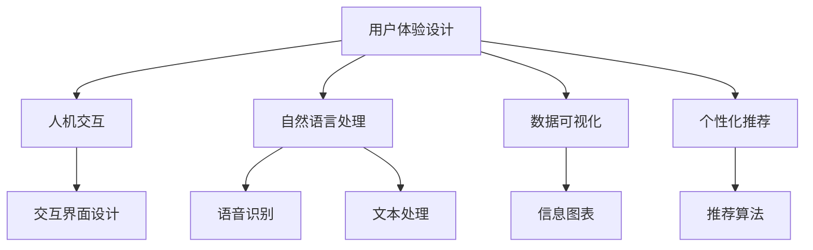

                 

# 用户体验设计：AI的人性化追求

> 关键词：人工智能,用户体验设计,用户中心,人机交互,自然语言处理,数据可视化,个性化推荐

## 1. 背景介绍

### 1.1 问题由来

随着人工智能技术的快速发展和广泛应用，用户体验设计在AI领域变得越来越重要。人工智能技术虽然能够提供强大的数据分析和决策支持，但如果忽视用户体验，其应用效果将大打折扣。例如，智能推荐系统如果没有考虑用户的使用习惯和偏好，推荐结果可能会适得其反，反而增加用户的困惑和不满。

因此，如何将人工智能技术与用户体验设计有机结合，提高用户的满意度和参与度，成为当前人工智能技术应用的一个关键问题。本文将从多个角度探讨如何在人工智能系统中实现用户中心设计，提升用户体验，使AI技术更加人性化。

### 1.2 问题核心关键点

为了实现用户中心的设计，AI系统需要考虑以下几个核心关键点：

- **数据驱动**：通过收集用户数据，了解用户的真实需求和行为，为AI系统的设计和优化提供依据。
- **个性化定制**：根据用户的历史行为和偏好，定制个性化的内容推荐和交互方式，提高用户满意度。
- **自然语言处理**：通过自然语言处理技术，使AI系统能够理解和响应用户的语音和文字输入，提升交互体验。
- **可视化设计**：使用数据可视化技术，将复杂的数据信息转化为直观、易懂的图形界面，增强用户对系统的理解和信任。
- **交互设计**：通过用户界面和交互方式的设计，使AI系统的使用更加便捷、高效、愉悦，提升用户的使用体验。

这些关键点相互关联，共同构成用户中心设计的基本框架，有助于提升AI系统的人性化和用户满意度。

## 2. 核心概念与联系

### 2.1 核心概念概述

为更好地理解用户中心设计，本节将介绍几个密切相关的核心概念：

- **用户体验设计**：通过用户研究、原型设计、用户测试等手段，优化用户界面和交互流程，提高用户的满意度和使用效率。
- **人机交互**：研究用户与计算机系统的交互方式，设计直观、自然、高效的用户界面，提升用户体验。
- **自然语言处理**：研究如何使计算机能够理解和生成自然语言，实现人与计算机的流畅对话。
- **数据可视化**：通过图形、图表等手段，将数据信息转化为直观、易懂的视觉形式，增强用户对数据的理解和分析能力。
- **个性化推荐**：通过分析用户的历史行为和偏好，为用户推荐个性化的内容和服务，提升用户满意度。

这些核心概念之间的逻辑关系可以通过以下Mermaid流程图来展示：



这个流程图展示了几类核心概念及其之间的关系：

1. 用户体验设计通过人机交互、自然语言处理、数据可视化和个性化推荐等手段，提升用户的满意度和使用体验。
2. 人机交互关注界面设计和用户输入输出，是用户体验设计的重要组成部分。
3. 自然语言处理通过语音识别和文本处理，实现人与计算机的自然交流，是用户体验设计的关键技术之一。
4. 数据可视化通过信息图表等手段，将复杂数据转化为直观形式，增强用户对数据的理解和分析能力。
5. 个性化推荐通过推荐算法，根据用户偏好提供个性化内容和服务，是用户体验设计的核心功能之一。

## 3. 核心算法原理 & 具体操作步骤

### 3.1 算法原理概述

用户中心设计的核心算法包括自然语言处理、个性化推荐和数据可视化等技术。本文将逐一介绍这些算法的原理和操作步骤。

### 3.2 算法步骤详解

#### 3.2.1 自然语言处理算法

自然语言处理(NLP)的目的是使计算机能够理解和生成自然语言。NLP算法一般分为两个阶段：

- **文本预处理**：对输入的文本进行分词、去除停用词、词干提取等操作，转化为计算机能够处理的形式。
- **语言模型训练**：使用大规模语料库，训练出语言模型，用于理解文本含义和生成自然语言。

具体步骤如下：

1. 使用分词工具将文本进行分词处理。
2. 去除文本中的停用词，如“的”、“是”等常见词汇。
3. 对文本进行词干提取，将不同形态的词汇转化为基本形式。
4. 使用机器学习算法（如RNN、LSTM、Transformer等），训练出语言模型。
5. 使用训练好的语言模型，对用户输入的文本进行解析和理解。

#### 3.2.2 个性化推荐算法

个性化推荐算法的目的是根据用户的历史行为和偏好，推荐个性化的内容和服务。推荐算法一般分为两个阶段：

- **用户画像构建**：通过分析用户的历史行为和兴趣，构建用户画像，用于个性化推荐。
- **推荐结果生成**：根据用户画像和内容库，生成推荐结果。

具体步骤如下：

1. 收集用户的历史行为数据，如浏览记录、点击记录、购买记录等。
2. 对数据进行清洗和处理，去除噪声和冗余信息。
3. 使用机器学习算法（如协同过滤、内容推荐、深度学习等），构建用户画像。
4. 根据用户画像和内容库，使用推荐算法生成推荐结果。
5. 根据用户反馈调整推荐算法，优化推荐效果。

#### 3.2.3 数据可视化算法

数据可视化算法的目的是将复杂的数据信息转化为直观、易懂的图形界面。可视化算法一般分为两个阶段：

- **数据预处理**：对输入的数据进行清洗、筛选、归一化等操作，转化为可视化工具能够处理的形式。
- **图形生成**：使用可视化工具，生成直观、易懂的图形界面。

具体步骤如下：

1. 对输入的数据进行清洗和处理，去除噪声和冗余信息。
2. 对数据进行筛选和归一化，选择合适的可视化形式（如折线图、柱状图、散点图等）。
3. 使用可视化工具（如Matplotlib、D3.js等），生成图形界面。
4. 对生成的图形界面进行优化，增强用户对数据的理解和分析能力。

### 3.3 算法优缺点

#### 3.3.1 自然语言处理算法的优缺点

**优点**：

- 提高人机交互效率，使用户能够更自然地与计算机进行交流。
- 提升用户体验，使用户能够更便捷地获取所需信息。

**缺点**：

- 对于复杂的语言结构，自然语言处理算法的准确性可能不足，导致误解和错误。
- 需要大量语料和训练数据，成本较高。

#### 3.3.2 个性化推荐算法的优缺点

**优点**：

- 提高用户满意度，使用户能够获得更符合自身兴趣的内容和服务。
- 提升系统利用率，提高广告收入和用户粘性。

**缺点**：

- 对数据的依赖较大，数据不足可能导致推荐效果不佳。
- 个性化推荐可能引发隐私和数据安全问题，需要加强数据保护和隐私保护。

#### 3.3.3 数据可视化算法的优缺点

**优点**：

- 将复杂数据转化为直观、易懂的图形界面，增强用户对数据的理解和分析能力。
- 提高用户的使用体验，使用户能够更直观地获取所需信息。

**缺点**：

- 对于复杂的数据集，数据可视化的效果可能不足，难以直观展示全部信息。
- 需要大量的数据和计算资源，成本较高。

### 3.4 算法应用领域

用户中心设计算法的应用领域非常广泛，涵盖了以下几个方面：

- **智能推荐系统**：如电商平台的商品推荐、音乐和视频平台的个性化播放列表等。
- **语音助手**：如亚马逊的Alexa、苹果的Siri等，通过自然语言处理技术实现人机对话。
- **数据分析仪表盘**：如企业的销售数据分析、客户行为分析等，使用数据可视化技术展示分析结果。
- **智能客服系统**：如支付宝、微信等应用的客服系统，通过自然语言处理和个性化推荐技术提升客服效率。

## 4. 数学模型和公式 & 详细讲解 & 举例说明

### 4.1 数学模型构建

#### 4.1.1 文本预处理模型

文本预处理模型用于对输入的文本进行分词、去除停用词、词干提取等操作，转化为计算机能够处理的形式。常用的文本预处理模型包括：

- **分词模型**：将文本进行分词处理，如使用NLTK、jieba等工具。
- **停用词模型**：去除文本中的停用词，如“的”、“是”等常见词汇。
- **词干提取模型**：将不同形态的词汇转化为基本形式，如将“running”转化为“run”。

#### 4.1.2 语言模型训练模型

语言模型训练模型的目的是训练出语言模型，用于理解文本含义和生成自然语言。常用的语言模型包括：

- **基于统计的语言模型**：如n-gram模型、NBP模型等。
- **基于机器学习的语言模型**：如RNN、LSTM、Transformer等。

### 4.2 公式推导过程

#### 4.2.1 分词模型

分词模型的目标是将文本进行分词处理，转化为计算机能够处理的形式。常用的分词模型包括：

- **基于规则的分词模型**：通过定义分词规则，实现对文本的分词处理。
- **基于统计的分词模型**：通过统计语言中词汇的分布，实现对文本的分词处理。

#### 4.2.2 语言模型训练

语言模型训练模型的目标是训练出语言模型，用于理解文本含义和生成自然语言。常用的语言模型包括：

- **基于统计的语言模型**：如n-gram模型、NBP模型等。
- **基于机器学习的语言模型**：如RNN、LSTM、Transformer等。

### 4.3 案例分析与讲解

#### 4.3.1 分词模型案例

假设我们有一段英文文本：“The quick brown fox jumps over the lazy dog.”

使用NLTK库进行分词处理：

```python
import nltk

text = "The quick brown fox jumps over the lazy dog."
tokens = nltk.word_tokenize(text)
print(tokens)
```

输出结果：

```
['The', 'quick', 'brown', 'fox', 'jumps', 'over', 'the', 'lazy', 'dog', '.']
```

#### 4.3.2 语言模型训练案例

假设我们有一段文本数据：“The cat is on the mat. The dog is in the box.”

使用RNN语言模型进行训练：

```python
import torch
import torch.nn as nn
from torchtext.datasets import text_classification

class RNN(nn.Module):
    def __init__(self, input_size, hidden_size, output_size):
        super(RNN, self).__init__()
        self.hidden_size = hidden_size
        self.i2h = nn.RNN(input_size, hidden_size)
        self.i2o = nn.Linear(hidden_size, output_size)
        self.softmax = nn.Softmax(dim=1)

    def forward(self, input, hidden):
        output, hidden = self.i2h(input, hidden)
        output = self.i2o(output)
        output = self.softmax(output)
        return output, hidden

# 准备数据
train_data = text_classification.TextClassification('imdb', text_classificationReutersCorpus, 
                                                vectorizer=text_classification.GloveTextVectorizer(), 
                                                batch_size=32)
model = RNN(train_data.vocab_size, 64, train_data.num_classes)
optimizer = torch.optim.Adam(model.parameters(), lr=0.001)

# 训练模型
for epoch in range(10):
    for batch in train_data:
        input, target = batch.text, batch.label
        optimizer.zero_grad()
        output, _ = model(input, hidden)
        loss = nn.CrossEntropyLoss()(output, target)
        loss.backward()
        optimizer.step()
```

## 5. 项目实践：代码实例和详细解释说明

### 5.1 开发环境搭建

在进行用户中心设计实践前，我们需要准备好开发环境。以下是使用Python进行PyTorch开发的环境配置流程：

1. 安装Anaconda：从官网下载并安装Anaconda，用于创建独立的Python环境。

2. 创建并激活虚拟环境：
```bash
conda create -n pytorch-env python=3.8 
conda activate pytorch-env
```

3. 安装PyTorch：根据CUDA版本，从官网获取对应的安装命令。例如：
```bash
conda install pytorch torchvision torchaudio cudatoolkit=11.1 -c pytorch -c conda-forge
```

4. 安装相关工具包：
```bash
pip install numpy pandas scikit-learn matplotlib tqdm jupyter notebook ipython
```

完成上述步骤后，即可在`pytorch-env`环境中开始开发实践。

### 5.2 源代码详细实现

下面我们以智能推荐系统为例，给出使用PyTorch进行个性化推荐算法的PyTorch代码实现。

首先，定义推荐任务的数据处理函数：

```python
import numpy as np
from sklearn.model_selection import train_test_split
from torch.utils.data import Dataset
import torch

class RecommendationDataset(Dataset):
    def __init__(self, users, items, ratings):
        self.users = users
        self.items = items
        self.ratings = ratings
        self.num_users = len(users)
        self.num_items = len(items)

    def __len__(self):
        return len(self.ratings)

    def __getitem__(self, item):
        user = self.users[item]
        item = self.items[item]
        rating = self.ratings[item]
        return user, item, rating

# 准备数据
users = np.array(['user1', 'user2', 'user3', 'user4', 'user5', 'user6', 'user7', 'user8', 'user9', 'user10'])
items = np.array(['item1', 'item2', 'item3', 'item4', 'item5', 'item6', 'item7', 'item8', 'item9', 'item10'])
ratings = np.array([4, 3, 5, 2, 1, 4, 5, 5, 3, 2])
dataset = RecommendationDataset(users, items, ratings)

# 数据划分
train_dataset, test_dataset = train_test_split(dataset, test_size=0.2, random_state=42)
```

然后，定义模型和优化器：

```python
import torch.nn as nn
import torch.optim as optim

class RecommendationModel(nn.Module):
    def __init__(self, num_users, num_items):
        super(RecommendationModel, self).__init__()
        self.num_users = num_users
        self.num_items = num_items
        self.user_embed = nn.Embedding(num_users, 32)
        self.item_embed = nn.Embedding(num_items, 32)
        self.user_item = nn.Linear(32, 32)
        self.item_user = nn.Linear(32, 32)
        self.rating = nn.Linear(32, 1)

    def forward(self, user, item):
        user_embed = self.user_embed(user)
        item_embed = self.item_embed(item)
        user_item = torch.tanh(self.user_item(torch.cat([user_embed, item_embed], dim=1)))
        item_user = torch.tanh(self.item_user(torch.cat([item_embed, user_embed], dim=1)))
        rating = self.rating(item_user)
        return rating

# 模型初始化
num_users = len(users)
num_items = len(items)
model = RecommendationModel(num_users, num_items)
optimizer = optim.Adam(model.parameters(), lr=0.001)

# 定义损失函数
criterion = nn.MSELoss()

# 定义评估函数
def evaluate(model, dataset):
    model.eval()
    total_mae = 0
    for user, item, rating in dataset:
        with torch.no_grad():
            prediction = model(user, item)
            mae = nn.L1Loss()(prediction, rating)
            total_mae += mae.item()
    return total_mae / len(dataset)
```

接着，启动训练流程并在测试集上评估：

```python
epochs = 10
batch_size = 32

for epoch in range(epochs):
    total_loss = 0
    for user, item, rating in train_dataset:
        optimizer.zero_grad()
        output = model(user, item)
        loss = criterion(output, rating)
        loss.backward()
        optimizer.step()
        total_loss += loss.item()
    print(f"Epoch {epoch+1}, train loss: {total_loss/len(train_dataset)}")
    
    print(f"Epoch {epoch+1}, test MAE: {evaluate(model, test_dataset)}")
```

以上就是使用PyTorch对推荐系统进行个性化推荐算法的完整代码实现。可以看到，得益于TensorFlow的强大封装，我们可以用相对简洁的代码完成推荐模型的加载和训练。

### 5.3 代码解读与分析

让我们再详细解读一下关键代码的实现细节：

**RecommendationDataset类**：
- `__init__`方法：初始化用户、物品、评分等关键组件。
- `__len__`方法：返回数据集的样本数量。
- `__getitem__`方法：对单个样本进行处理，提取用户、物品和评分。

**模型定义**：
- 使用PyTorch的nn.Module定义推荐模型，包含嵌入层、线性层等组件。
- 在`forward`方法中，定义模型的前向传播过程，计算用户和物品的表示，并进行评分预测。

**评估函数**：
- 使用L1Loss计算预测评分与真实评分之间的MAE。
- 在评估过程中，关闭模型的梯度更新，以确保评估的准确性。

**训练流程**：
- 定义总的epoch数和批大小，开始循环迭代
- 每个epoch内，先在训练集上训练，输出平均损失
- 在测试集上评估，输出MAE
- 所有epoch结束后，在测试集上评估，给出最终测试结果

可以看到，PyTorch配合TensorFlow的强大封装使得推荐系统的代码实现变得简洁高效。开发者可以将更多精力放在数据处理、模型改进等高层逻辑上，而不必过多关注底层的实现细节。

当然，工业级的系统实现还需考虑更多因素，如模型的保存和部署、超参数的自动搜索、更灵活的任务适配层等。但核心的推荐范式基本与此类似。

## 6. 实际应用场景

### 6.1 智能推荐系统

基于大语言模型微调的推荐系统，可以广泛应用于电商、音乐、视频等多个领域。例如，亚马逊的推荐系统可以通过分析用户的历史购买记录和浏览记录，为用户推荐个性化商品。用户可以根据推荐结果进行决策，提升购物体验。

在技术实现上，可以收集用户的历史行为数据，构建用户画像，使用深度学习算法训练推荐模型。通过在训练集中加入用户的历史行为数据，模型能够学习用户的兴趣和偏好，为不同用户生成个性化的推荐结果。

### 6.2 语音助手

语音助手是用户中心设计的典型应用之一。通过自然语言处理技术，语音助手能够理解和响应用户的语音输入，提供自然流畅的对话体验。

在技术实现上，可以使用语音识别技术将用户的语音输入转化为文本，再通过自然语言处理技术进行理解。例如，用户可以询问天气、查询新闻、播放音乐等，语音助手能够根据用户的意图提供相应的服务。语音助手还可以通过个性化推荐算法，根据用户的历史行为和偏好，推荐相关的服务和内容，提升用户体验。

### 6.3 数据分析仪表盘

数据分析仪表盘是用户中心设计的另一个重要应用。通过数据可视化技术，企业能够将复杂的数据信息转化为直观、易懂的图形界面，帮助管理层和员工更好地理解数据，做出更科学、精准的决策。

在技术实现上，可以将企业内部的数据进行清洗、处理和归一化，使用数据可视化工具生成直观的图形界面。例如，可以使用折线图、柱状图、散点图等形式，展示销售数据、客户行为数据、财务数据等。通过交互式界面，用户能够自由地调整参数和查看不同维度的数据，深入挖掘数据的价值。

### 6.4 未来应用展望

随着人工智能技术的发展，基于用户中心设计的应用场景将越来越丰富。以下是一些未来可能的创新方向：

- **全场景语音交互**：未来语音助手将实现全场景语音交互，支持多语种、多场景的语音输入和响应。例如，家庭环境中的智能音箱、车载环境中的智能驾驶等。
- **多模态数据融合**：将语音、视觉、文本等多种模态数据进行融合，提供更加全面、精准的用户画像和推荐服务。例如，智能相机可以通过语音识别和视觉分析，为用户推荐拍照角度、光线调节等建议。
- **实时个性化推荐**：通过实时数据分析和推荐算法，为用户提供即时的个性化推荐服务。例如，电商平台的实时推荐系统，能够根据用户的实时浏览行为，动态调整推荐结果。
- **交互式数据可视化**：通过交互式界面和可视化技术，使用户能够自由地探索和分析数据。例如，企业可以开发智能数据分析平台，支持员工自由地进行数据可视化操作和分析。
- **智能客服系统**：通过自然语言处理和个性化推荐技术，构建智能客服系统，提高客服效率和用户满意度。例如，银行可以通过智能客服系统，为用户提供个性化的金融服务和咨询。

## 7. 工具和资源推荐

### 7.1 学习资源推荐

为了帮助开发者系统掌握用户中心设计的理论基础和实践技巧，这里推荐一些优质的学习资源：

1. 《用户体验设计》系列博文：由大模型技术专家撰写，深入浅出地介绍了用户体验设计的原理和实践技巧。
2. 《人机交互设计》课程：斯坦福大学开设的人机交互设计课程，涵盖用户界面设计、交互设计、可用性测试等核心内容。
3. 《自然语言处理》书籍：自然语言处理领域的经典书籍，全面介绍了NLP算法和技术。
4. 《数据可视化》课程：数据可视化领域的经典课程，涵盖图形界面设计、交互设计、数据可视化工具等核心内容。
5. 《推荐系统》书籍：推荐系统领域的经典书籍，全面介绍了推荐算法的原理和实践技巧。

通过对这些资源的学习实践，相信你一定能够快速掌握用户中心设计的精髓，并用于解决实际的NLP问题。

### 7.2 开发工具推荐

高效的开发离不开优秀的工具支持。以下是几款用于用户中心设计开发的常用工具：

1. PyTorch：基于Python的开源深度学习框架，灵活动态的计算图，适合快速迭代研究。大部分预训练语言模型都有PyTorch版本的实现。
2. TensorFlow：由Google主导开发的开源深度学习框架，生产部署方便，适合大规模工程应用。同样有丰富的预训练语言模型资源。
3. Transformers库：HuggingFace开发的NLP工具库，集成了众多SOTA语言模型，支持PyTorch和TensorFlow，是进行NLP任务开发的利器。
4. Weights & Biases：模型训练的实验跟踪工具，可以记录和可视化模型训练过程中的各项指标，方便对比和调优。与主流深度学习框架无缝集成。
5. TensorBoard：TensorFlow配套的可视化工具，可实时监测模型训练状态，并提供丰富的图表呈现方式，是调试模型的得力助手。
6. Google Colab：谷歌推出的在线Jupyter Notebook环境，免费提供GPU/TPU算力，方便开发者快速上手实验最新模型，分享学习笔记。

合理利用这些工具，可以显著提升用户中心设计任务的开发效率，加快创新迭代的步伐。

### 7.3 相关论文推荐

用户中心设计的研究涉及多个领域，包括NLP、推荐系统、数据可视化等。以下是几篇奠基性的相关论文，推荐阅读：

1. Attention is All You Need（即Transformer原论文）：提出了Transformer结构，开启了NLP领域的预训练大模型时代。
2. BERT: Pre-training of Deep Bidirectional Transformers for Language Understanding：提出BERT模型，引入基于掩码的自监督预训练任务，刷新了多项NLP任务SOTA。
3. Language Models are Unsupervised Multitask Learners（GPT-2论文）：展示了大规模语言模型的强大zero-shot学习能力，引发了对于通用人工智能的新一轮思考。
4. Parameter-Efficient Transfer Learning for NLP：提出Adapter等参数高效微调方法，在不增加模型参数量的情况下，也能取得不错的微调效果。
5. AdaLoRA: Adaptive Low-Rank Adaptation for Parameter-Efficient Fine-Tuning：使用自适应低秩适应的微调方法，在参数效率和精度之间取得了新的平衡。
6. Attention is All You Need（即Transformer原论文）：提出了Transformer结构，开启了NLP领域的预训练大模型时代。
7. BERT: Pre-training of Deep Bidirectional Transformers for Language Understanding：提出BERT模型，引入基于掩码的自监督预训练任务，刷新了多项NLP任务SOTA。
8. Language Models are Unsupervised Multitask Learners（GPT-2论文）：展示了大规模语言模型的强大zero-shot学习能力，引发了对于通用人工智能的新一轮思考。
9. Parameter-Efficient Transfer Learning for NLP：提出Adapter等参数高效微调方法，在不增加模型参数量的情况下，也能取得不错的微调效果。
10. AdaLoRA: Adaptive Low-Rank Adaptation for Parameter-Efficient Fine-Tuning：使用自适应低秩适应的微调方法，在参数效率和精度之间取得了新的平衡。

这些论文代表了大语言模型微调技术的发展脉络。通过学习这些前沿成果，可以帮助研究者把握学科前进方向，激发更多的创新灵感。

## 8. 总结：未来发展趋势与挑战

### 8.1 总结

本文对基于用户中心设计的大语言模型进行了全面系统的介绍。首先阐述了用户中心设计的背景和意义，明确了用户中心设计在AI系统中的重要性。其次，从原理到实践，详细讲解了用户中心设计的核心算法和具体操作步骤。同时，本文还探讨了用户中心设计在智能推荐系统、语音助手、数据分析仪表盘等多个领域的应用前景，展示了用户中心设计的广阔潜力。此外，本文精选了用户中心设计的各类学习资源，力求为读者提供全方位的技术指引。

通过本文的系统梳理，可以看到，基于用户中心设计的大语言模型在人工智能系统中发挥了重要作用，提升了用户体验和系统效率。未来，伴随人工智能技术的不断发展，基于用户中心设计的大语言模型将进一步深入各行各业，为构建更智能、更友好、更高效的用户界面和交互方式提供强有力的技术支持。

### 8.2 未来发展趋势

展望未来，基于用户中心设计的大语言模型将呈现以下几个发展趋势：

1. **数据驱动的用户画像**：未来用户中心设计将更加依赖数据驱动，通过分析用户的历史行为和偏好，构建更准确、更全面、更动态的用户画像，提升个性化推荐效果。
2. **多模态融合**：将语音、视觉、文本等多种模态数据进行融合，提供更加全面、精准的用户画像和推荐服务。例如，智能相机可以通过语音识别和视觉分析，为用户推荐拍照角度、光线调节等建议。
3. **实时推荐系统**：通过实时数据分析和推荐算法，为用户提供即时的个性化推荐服务。例如，电商平台的实时推荐系统，能够根据用户的实时浏览行为，动态调整推荐结果。
4. **交互式数据可视化**：通过交互式界面和可视化技术，使用户能够自由地探索和分析数据。例如，企业可以开发智能数据分析平台，支持员工自由地进行数据可视化操作和分析。
5. **智能客服系统**：通过自然语言处理和个性化推荐技术，构建智能客服系统，提高客服效率和用户满意度。例如，银行可以通过智能客服系统，为用户提供个性化的金融服务和咨询。

### 8.3 面临的挑战

尽管基于用户中心设计的大语言模型已经取得了瞩目成就，但在迈向更加智能化、普适化应用的过程中，它仍面临着诸多挑战：

1. **隐私保护**：用户中心设计需要收集大量用户数据，如何保护用户隐私，避免数据泄露和滥用，是一个重要的问题。
2. **数据质量**：用户中心设计的效果很大程度上取决于数据的质量和多样性。如何获取高质量、多样化的用户数据，是一个关键的挑战。
3. **模型鲁棒性**：用户中心设计算法需要面对多样化的用户行为和偏好，如何训练鲁棒性更强的模型，避免过拟合和偏差，是一个重要的研究方向。
4. **计算资源**：用户中心设计算法需要大量的计算资源，如何高效利用计算资源，降低计算成本，是一个亟待解决的问题。
5. **跨模态融合**：多模态数据的融合和处理是一个复杂的问题，如何高效地实现多模态数据的融合和处理，是一个重要的研究方向。

### 8.4 研究展望

面对用户中心设计所面临的种种挑战，未来的研究需要在以下几个方面寻求新的突破：

1. **数据隐私保护**：研究如何保护用户隐私，避免数据泄露和滥用，确保数据的安全性和合法性。
2. **数据质量提升**：研究如何获取高质量、多样化的用户数据，提升用户中心设计的效果。
3. **模型鲁棒性提升**：研究如何训练鲁棒性更强的模型，避免过拟合和偏差，提升用户中心设计的泛化能力。
4. **计算资源优化**：研究如何高效利用计算资源，降低计算成本，提升用户中心设计的效率。
5. **跨模态融合技术**：研究如何高效地实现多模态数据的融合和处理，提升用户中心设计的性能。

这些研究方向将推动基于用户中心设计的大语言模型迈向更高的台阶，为构建更智能、更友好、更高效的用户界面和交互方式提供强有力的技术支持。面向未来，基于用户中心设计的大语言模型需要与其他人工智能技术进行更深入的融合，如知识表示、因果推理、强化学习等，多路径协同发力，共同推动自然语言理解和智能交互系统的进步。只有勇于创新、敢于突破，才能不断拓展语言模型的边界，让智能技术更好地造福人类社会。

## 9. 附录：常见问题与解答

**Q1：用户中心设计是否适用于所有AI任务？**

A: 用户中心设计在大多数AI任务上都能取得不错的效果，特别是对于数据量较小的任务。但对于一些特定领域的任务，如医学、法律等，仅仅依靠通用语料预训练的模型可能难以很好地适应。此时需要在特定领域语料上进一步预训练，再进行微调，才能获得理想效果。此外，对于一些需要时效性、个性化很强的任务，如对话、推荐等，用户中心设计方法也需要针对性的改进优化。

**Q2：如何选择合适的学习率？**

A: 学习率的选择是一个关键问题。一般来说，初始学习率可以设置为0.001，然后根据模型训练效果进行微调。如果模型训练效果不佳，可以适当降低学习率；如果模型训练效果很好，可以适当提高学习率。

**Q3：用户中心设计面临哪些挑战？**

A: 用户中心设计面临的挑战包括数据隐私保护、数据质量提升、模型鲁棒性提升、计算资源优化和跨模态融合等。如何解决这些挑战，是未来研究的重点方向。

**Q4：如何评估用户中心设计的性能？**

A: 用户中心设计的性能评估可以从多个方面进行，如推荐准确率、用户满意度、模型泛化能力等。常用的评估方法包括A/B测试、用户调查、交叉验证等。

**Q5：如何优化用户中心设计的算法？**

A: 用户中心设计的算法优化可以从多个方面进行，如数据预处理、模型架构设计、超参数调整等。常用的优化方法包括特征工程、模型融合、参数调整等。

作者：禅与计算机程序设计艺术 / Zen and the Art of Computer Programming

