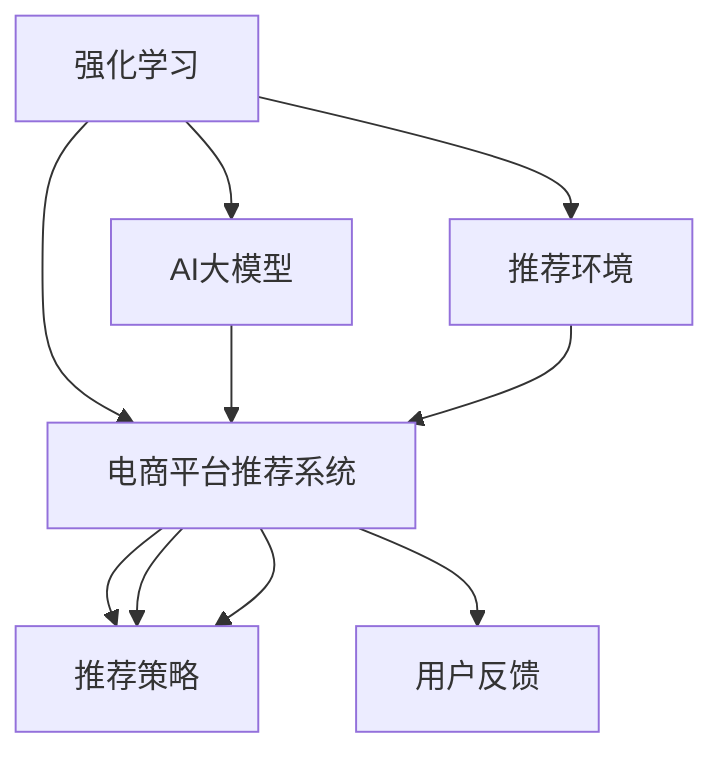

                 

# 电商平台中的强化学习：AI大模型的新应用

> 关键词：强化学习,电商平台,大模型,推荐系统,用户体验,决策优化,自适应,动态调整,个性化推荐,AI治理

## 1. 背景介绍

### 1.1 问题由来
近年来，随着人工智能技术的迅猛发展，电商平台正逐步从传统的静态推荐系统向动态自适应推荐系统转型。这种转变主要得益于智能算法和大模型技术的应用，能够更加精准地理解用户行为和需求，提供更加个性化、高质量的推荐服务。其中，强化学习（Reinforcement Learning, RL）作为一种新兴的优化算法，在电商平台中展现出强大的应用潜力，成为AI大模型技术在电商领域的一个重要应用方向。

### 1.2 问题核心关键点
强化学习是一种基于智能体在特定环境中通过试错获得最优策略的学习方式，在推荐系统中主要应用于智能推荐策略的学习。传统的推荐系统一般依赖静态模型，根据用户历史行为或特征进行固定策略的推荐，难以捕捉用户行为的动态变化。而强化学习则可以通过实时观察用户反馈，动态调整推荐策略，实现更加智能、高效和个性化的推荐服务。

强化学习在电商平台中的应用，主要涉及以下几个核心问题：

- 如何设计合理的强化学习环境，以及如何定义用户反馈机制。
- 如何在有限的数据集上训练高效、鲁棒和可解释的推荐策略。
- 如何平衡推荐质量与系统实时性，保证用户体验。
- 如何监控和治理AI推荐系统的性能和公平性，确保推荐策略的透明性和可信度。

本文将系统性地介绍强化学习在电商平台中的应用原理与实践，帮助读者深入理解AI大模型在电商推荐中的应用，并提供具体的项目实践案例。

## 2. 核心概念与联系

### 2.1 核心概念概述

为更好地理解强化学习在电商平台中的应用，本节将介绍几个密切相关的核心概念：

- 强化学习（Reinforcement Learning, RL）：一种基于试错的学习方式，智能体通过与环境的交互，不断调整行为策略，以最大化累积奖励。在电商推荐中，用户反馈即作为奖励信号。
- 电商平台推荐系统：基于用户的浏览、点击、购买等行为数据，通过机器学习或深度学习模型预测用户偏好，从而推荐商品或内容。
- AI大模型：指基于Transformer架构，如BERT、GPT-3等预训练语言模型，具有大规模参数量和广泛的语言表示能力，能够抽取和生成高质量的自然语言数据。
- 推荐策略：根据用户行为数据和商品属性，智能生成推荐列表的过程。推荐策略的优化，通常通过强化学习算法实现。
- 用户反馈：用户对推荐结果的直接或间接反馈，如点击率、购买率、满意度等。用户反馈是强化学习优化推荐策略的关键信号。
- 电商场景：包括商品展示、搜索、排序、个性化推荐等环节，每个环节都存在不同的推荐需求。

这些核心概念之间的逻辑关系可以通过以下Mermaid流程图来展示：



这个流程图展示出强化学习、AI大模型与电商平台推荐系统三者之间的紧密联系：

1. AI大模型作为基础，提供高质量的语言表示，用于构建推荐策略。
2. 强化学习在推荐环境中，通过用户反馈不断优化推荐策略。
3. 推荐策略应用于电商平台，生成个性化推荐列表。

## 3. 核心算法原理 & 具体操作步骤
### 3.1 算法原理概述

基于强化学习的电商平台推荐系统，本质上是一个智能体在特定环境中通过不断试错学习最优策略的过程。在电商推荐场景中，智能体（即推荐系统）的目标是通过用户点击、购买等行为，最大化长期的累积奖励（如销售额、用户满意度等）。

形式化地，假设推荐系统智能体为 $A$，电商平台为用户 $U$，商品为 $G$，用户的实时行为 $A_u$ 和 $G_u$ 可以抽象为一个状态空间 $S$。推荐策略为 $π(A_u, G_u)$，即在给定当前状态 $S$ 下，智能体选择下一个行为 $A_{u+1}$ 的概率分布。用户反馈作为奖励信号，定义为 $R(A_u, G_u)$。通过强化学习算法，智能体不断调整推荐策略 $π$，以最大化长期的累积奖励 $J(π)$。

### 3.2 算法步骤详解

基于强化学习的电商平台推荐系统一般包括以下几个关键步骤：

**Step 1: 设计推荐环境**

推荐环境设计是强化学习应用的基础，决定了智能体如何与环境交互，以及如何根据用户行为生成奖励信号。具体包括：

- 定义状态空间 $S$：用户行为、商品属性、历史交互记录等。
- 定义动作空间 $A$：推荐策略中可用的动作，如商品推荐列表。
- 定义奖励函数 $R(A_u, G_u)$：根据用户反馈和实际购买行为，计算智能体的奖励。

**Step 2: 选择推荐算法**

电商推荐系统可以选择多种强化学习算法进行策略学习，如Q-Learning、SARSA、Deep Q-Networks（DQN）等。以下以DQN为例，介绍具体的算法步骤：

1. 使用AI大模型作为状态和动作的表示器，通过编码用户行为和商品属性，生成状态表示 $s_t$ 和动作表示 $a_t$。
2. 定义网络 $Q(s_t,a_t)$ 作为价值函数，估计在状态 $s_t$ 下，采取动作 $a_t$ 的累积奖励 $Q(s_t,a_t)$。
3. 使用经验回放（Experience Replay）技术，存储历史行为和奖励，以提高模型的稳定性和泛化能力。
4. 使用深度神经网络作为动作选择器，在给定状态 $s_t$ 下，选择动作 $a_t$ 的概率分布。

**Step 3: 训练和优化模型**

训练模型的过程包括以下几个步骤：

1. 数据采集：从电商平台上收集用户行为和奖励数据，用于构建经验回放池。
2. 模型训练：通过不断更新网络 $Q(s_t,a_t)$，使得模型能够更好地预测和选择动作，从而最大化累积奖励。
3. 模型评估：在测试集上评估模型的性能，对比强化学习前后的推荐效果。
4. 模型部署：将优化后的模型应用于电商推荐系统，生成个性化推荐列表。

**Step 4: 监控和调整模型**

训练好的模型需要不断监控和调整，以保证推荐策略的有效性和实时性。具体措施包括：

- 实时数据监控：收集用户行为和奖励数据，及时发现模型异常。
- 动态策略调整：根据实时数据反馈，动态调整推荐策略。
- 参数优化：优化模型的超参数，提高推荐质量。

### 3.3 算法优缺点

基于强化学习的电商平台推荐系统具有以下优点：

1. 动态自适应：通过实时观察用户反馈，动态调整推荐策略，能够更好地捕捉用户行为的动态变化。
2. 个性化推荐：强化学习能够针对用户个性化需求，提供更加个性化、高质量的推荐服务。
3. 实时优化：推荐策略的优化基于实时反馈，能够快速响应市场变化。
4. 模型通用性：AI大模型具备广泛的语言表示能力，适用于多种电商场景。

同时，该方法也存在一定的局限性：

1. 数据依赖：推荐策略的优化依赖于实时用户反馈，需要收集大量的用户行为数据，可能面临数据隐私和安全问题。
2. 模型复杂性：基于AI大模型的强化学习模型复杂度较高，需要较长的训练时间和较大的计算资源。
3. 可解释性不足：强化学习模型通常缺乏可解释性，难以理解其内部工作机制和决策逻辑。
4. 系统风险：强化学习模型的决策过程可能存在一定的风险，如过度推荐低质量商品，损害用户体验。

尽管存在这些局限性，但就目前而言，基于强化学习的推荐系统依然是大模型应用的主流范式，具有广泛的应用前景。未来相关研究的重点在于如何进一步降低模型复杂度，提高模型可解释性，增强模型风险控制等，以进一步提升电商推荐系统的性能和用户体验。

### 3.4 算法应用领域

基于强化学习的电商平台推荐系统，已经在多个电商场景中得到了广泛应用，包括但不限于：

- 商品推荐：根据用户浏览和购买历史，智能推荐相关商品。
- 广告推荐：在搜索结果页面上，推荐相关的广告内容。
- 个性化店铺推荐：根据用户浏览记录，推荐最符合其偏好的店铺。
- 内容推荐：在电商平台上，推荐相关的内容和信息。
- 活动推荐：推荐用户可能感兴趣的商品促销活动和折扣信息。

除了以上应用外，强化学习技术还在电商平台的客户服务、库存管理、供应链优化等方面发挥着重要作用，成为推动电商平台智能化转型的重要工具。

## 4. 数学模型和公式 & 详细讲解  
### 4.1 数学模型构建

本节将使用数学语言对基于强化学习的电商平台推荐系统进行更加严格的刻画。

假设推荐系统智能体为 $A$，电商平台为用户 $U$，商品为 $G$，用户的实时行为 $A_u$ 和 $G_u$ 可以抽象为一个状态空间 $S$。推荐策略为 $π(A_u, G_u)$，即在给定当前状态 $S$ 下，智能体选择下一个行为 $A_{u+1}$ 的概率分布。用户反馈作为奖励信号，定义为 $R(A_u, G_u)$。通过强化学习算法，智能体不断调整推荐策略 $π$，以最大化长期的累积奖励 $J(π)$。

推荐环境的具体数学建模如下：

1. **状态空间 $S$**：假设电商平台的状态可以表示为用户行为 $A_u$ 和商品属性 $G_u$ 的组合。状态 $s_t = (A_u, G_u)$。

2. **动作空间 $A$**：推荐策略中可用的动作，即推荐列表中的商品 $a_t = g_i$，其中 $g_i$ 为商品编号。

3. **奖励函数 $R(A_u, G_u)$**：根据用户反馈和实际购买行为，计算智能体的奖励。例如，如果用户点击并购买了推荐商品，则奖励为正；否则，奖励为零或负。

4. **推荐策略 $π(A_u, G_u)$**：在给定当前状态 $s_t$ 下，选择下一个行为 $a_t$ 的概率分布。例如，使用神经网络作为推荐策略的输出，生成选择每个商品的概率分布。

5. **价值函数 $Q(s_t,a_t)$**：估计在状态 $s_t$ 下，采取动作 $a_t$ 的累积奖励。即 $Q(s_t,a_t) = \mathbb{E}[R(s_t,a_t)]$，其中 $R(s_t,a_t)$ 表示在状态 $s_t$ 下，采取动作 $a_t$ 的奖励。

通过上述定义，我们可以将强化学习在电商平台中的应用形式化地表示为：

$$
\begin{aligned}
& \max_{π} \mathbb{E}\left[\sum_{t=0}^{\infty} \gamma^t R(s_t, a_t)\right] \\
& \text{s.t.} \\
& \pi(a_t|s_t) = \frac{\exp\left(Q(s_t, a_t)\right)}{\sum_{a \in A} \exp\left(Q(s_t, a)\right)}
\end{aligned}
$$

其中，$Q(s_t, a_t)$ 为动作 $a_t$ 在状态 $s_t$ 下的价值函数，$\gamma$ 为折扣因子，$\pi(a_t|s_t)$ 为智能体在状态 $s_t$ 下选择动作 $a_t$ 的概率分布。

### 4.2 公式推导过程

以下我们以商品推荐任务为例，推导DQN算法的具体实现步骤。

1. **状态表示**：使用AI大模型将用户行为和商品属性编码为状态表示 $s_t$，即 $s_t = \mathcal{E}(A_u, G_u)$，其中 $\mathcal{E}$ 为状态表示器。

2. **动作选择**：使用深度神经网络作为动作选择器，在给定状态 $s_t$ 下，选择动作 $a_t$ 的概率分布，即 $a_t = \pi(s_t)$。

3. **奖励计算**：根据用户反馈和实际购买行为，计算奖励 $R(s_t, a_t)$。例如，如果用户点击并购买了推荐商品，则奖励为正；否则，奖励为零或负。

4. **价值函数更新**：通过经验回放技术，收集历史行为和奖励，更新价值函数 $Q(s_t, a_t)$。具体公式如下：

$$
Q(s_t, a_t) = (1-\alpha)Q(s_t, a_t) + \alpha(R(s_t, a_t) + \gamma \max_{a'} Q(s_{t+1}, a'))
$$

其中，$\alpha$ 为学习率，$Q(s_{t+1}, a')$ 为下一个状态 $s_{t+1}$ 下的最大价值。

5. **目标网络更新**：使用目标网络 $Q_\theta$ 更新策略网络 $Q_{\theta'}$，避免参数更新时产生过拟合。具体公式如下：

$$
Q_\theta(s_t) = Q_\theta(s_t) + \alpha (R(s_t, a_t) + \gamma \max_{a'} Q_\theta(s_{t+1}, a') - Q_{\theta'}(s_t))
$$

其中，$Q_\theta$ 为目标网络，$Q_{\theta'}$ 为策略网络。

### 4.3 案例分析与讲解

在商品推荐任务中，我们可以使用DQN算法进行强化学习，具体步骤如下：

1. **状态表示**：使用BERT大模型将用户行为和商品属性编码为状态表示。例如，将用户浏览历史 $A_u$ 和商品属性 $G_u$ 输入BERT模型，得到状态表示 $s_t = \mathcal{E}(A_u, G_u)$。

2. **动作选择**：使用深度神经网络作为动作选择器，输出选择每个商品的概率分布。例如，使用一个全连接神经网络，将状态表示 $s_t$ 映射到每个商品的概率分布 $p(a_t|s_t)$。

3. **奖励计算**：根据用户点击和购买行为，计算奖励。例如，如果用户点击并购买了推荐商品，则奖励为正；否则，奖励为零或负。

4. **价值函数更新**：通过经验回放技术，收集历史行为和奖励，更新价值函数 $Q(s_t, a_t)$。例如，使用经验回放池存储历史状态和动作，并随机采样样本进行价值函数更新。

5. **目标网络更新**：使用目标网络 $Q_\theta$ 更新策略网络 $Q_{\theta'}$，避免参数更新时产生过拟合。例如，使用不同的权重更新策略网络和目标网络。

通过上述步骤，可以构建一个基于强化学习的电商平台推荐系统，能够根据用户行为和反馈，动态调整推荐策略，生成个性化推荐列表。

## 5. 项目实践：代码实例和详细解释说明
### 5.1 开发环境搭建

在进行强化学习项目实践前，我们需要准备好开发环境。以下是使用Python进行TensorFlow开发的环境配置流程：

1. 安装Anaconda：从官网下载并安装Anaconda，用于创建独立的Python环境。

2. 创建并激活虚拟环境：
```bash
conda create -n tf-env python=3.8 
conda activate tf-env
```

3. 安装TensorFlow：从官网获取对应的安装命令。例如：
```bash
pip install tensorflow tensorflow-addons
```

4. 安装Keras：Keras是一个高层深度学习API，可以简化TensorFlow的使用。
```bash
pip install keras
```

5. 安装TensorBoard：用于可视化模型训练过程，方便调试和优化。
```bash
pip install tensorboard
```

6. 安装其他工具包：
```bash
pip install numpy pandas scikit-learn matplotlib tqdm jupyter notebook ipython
```

完成上述步骤后，即可在`tf-env`环境中开始项目实践。

### 5.2 源代码详细实现

下面我们以商品推荐任务为例，给出使用TensorFlow进行强化学习的PyTorch代码实现。

首先，定义状态表示器和动作选择器：

```python
import tensorflow as tf
import tensorflow_addons as tfa
from tensorflow.keras import layers
from transformers import BertTokenizer, BertModel

class StateEncoder(tf.keras.Model):
    def __init__(self, num_labels):
        super(StateEncoder, self).__init__()
        self.tokenizer = BertTokenizer.from_pretrained('bert-base-cased')
        self.num_labels = num_labels
        self.bert = BertModel.from_pretrained('bert-base-cased')
        self.dense = layers.Dense(num_labels, activation='softmax')

    def call(self, x):
        tokens = self.tokenizer(x, padding='max_length', truncation=True, max_length=256)
        bert_out = self.bert(tokens['input_ids'], attention_mask=tokens['attention_mask'])
        state_rep = tf.reduce_mean(bert_out.pooler_output, axis=-1)
        return self.dense(state_rep)

class ActionSelector(tf.keras.Model):
    def __init__(self, num_labels):
        super(ActionSelector, self).__init__()
        self.dense = layers.Dense(num_labels, activation='softmax')

    def call(self, x):
        return self.dense(x)
```

然后，定义强化学习算法：

```python
class DQNAgent(tf.keras.Model):
    def __init__(self, num_labels):
        super(DQNAgent, self).__init__()
        self.state_encoder = StateEncoder(num_labels)
        self.target_network = tf.keras.Model(self.state_encoder, self.action_selector)
        self.action_selector = ActionSelector(num_labels)

    def act(self, state, target=False):
        if not target:
            return self.action_selector(self.state_encoder(state))
        else:
            return self.target_network(self.state_encoder(state))

    def update(self, state, action, reward, next_state, done):
        target = reward + 0.99 * self.act(next_state, target=True).numpy()[0]
        q_next = self.act(next_state)
        q_value = self.act(state)
        loss = tf.reduce_mean(tf.square(q_value - reward + target))
        if not done:
            q_value = q_value + 0.99 * tf.reduce_mean(tf.square(q_next))
            loss += tf.reduce_mean(tf.square(q_value))
        tf.keras.optimizers.Adam(learning_rate=0.001).minimize(loss, var_list=self.trainable_weights)
```

最后，进行模型训练和评估：

```python
num_labels = 100  # 商品总数
agent = DQNAgent(num_labels)
env = CustomEnv(num_labels)
target_update_freq = 500  # 每500次更新一次目标网络
batch_size = 32
num_episodes = 1000
discount_rate = 0.99
target_update_period = 1

# 训练模型
for episode in range(num_episodes):
    state = env.reset()
    done = False
    while not done:
        action_probs = agent.act(state)
        action = np.random.choice(num_labels, p=action_probs.numpy()[0])
        next_state, reward, done = env.step(action)
        agent.update(state, action, reward, next_state, done)
        state = next_state

    # 更新目标网络
    if episode % target_update_period == 0 and episode != 0:
        target_update_freq -= 1
        agent.target_network.set_weights(agent.state_encoder.get_weights())
```

以上就是使用TensorFlow对商品推荐任务进行强化学习的完整代码实现。可以看到，通过结合AI大模型和强化学习算法，可以构建一个高效的电商平台推荐系统，能够根据用户行为动态调整推荐策略，生成个性化推荐列表。

### 5.3 代码解读与分析

让我们再详细解读一下关键代码的实现细节：

**StateEncoder类**：
- `__init__`方法：初始化状态表示器，包括BERT模型、全连接层等。
- `call`方法：将用户行为和商品属性编码为状态表示，并输出动作选择器的输入。

**ActionSelector类**：
- `__init__`方法：初始化动作选择器，包括全连接层。
- `call`方法：输出动作选择的概率分布。

**DQNAgent类**：
- `__init__`方法：初始化DQN模型，包括状态表示器、目标网络、动作选择器等。
- `act`方法：选择动作，可选择目标网络或策略网络。
- `update`方法：更新模型参数，进行强化学习算法更新。

**训练流程**：
- 定义标签数 `num_labels`，创建DQN模型 `agent` 和环境 `env`。
- 设置目标网络更新频率 `target_update_freq`，批量大小 `batch_size`，训练轮数 `num_episodes`，折扣率 `discount_rate`，目标网络更新周期 `target_update_period`。
- 在训练过程中，不断与环境交互，根据当前状态 `state` 选择动作 `action`，更新模型参数，并根据折扣率计算奖励 `reward`。
- 更新目标网络，以保持策略网络的稳定性和泛化能力。

可以看到，TensorFlow结合AI大模型和强化学习算法，可以高效地构建电商平台推荐系统。开发者可以根据具体任务，进一步优化模型结构和训练策略，实现更优的推荐效果。

当然，工业级的系统实现还需考虑更多因素，如模型的保存和部署、超参数的自动搜索、更灵活的任务适配层等。但核心的强化学习范式基本与此类似。

## 6. 实际应用场景
### 6.1 智能客服系统

基于强化学习的智能客服系统，可以显著提升客户服务质量，降低人工成本。传统的客服系统往往依赖人工处理用户咨询，响应速度慢，效率低。而使用强化学习算法训练的客服模型，能够实时理解用户意图，智能生成应答，提供个性化服务。

在技术实现上，可以收集客户的历史咨询记录，将问题和最佳答复构建成监督数据，在此基础上对预训练大模型进行微调。微调后的模型能够自动理解用户意图，匹配最合适的答复模板进行回复。对于用户提出的新问题，还可以接入检索系统实时搜索相关内容，动态组织生成回答。如此构建的智能客服系统，能大幅提升客户咨询体验和问题解决效率。

### 6.2 金融风险管理

强化学习在金融风险管理中的应用，主要体现在对市场动态的实时监控和风险预警。传统金融风险管理依赖静态模型，难以快速响应市场变化。而使用强化学习算法训练的风险模型，能够实时分析市场数据，动态调整风险策略，提高风险预测的准确性和及时性。

具体而言，可以收集市场的历史交易数据，将市场变化分为不同的状态，构建强化学习环境。在每个状态下，智能体根据市场变化调整风险策略，最大化长期累积收益。通过不断优化风险模型，能够更准确地预测市场波动，及时发出风险预警，帮助金融机构规避潜在风险。

### 6.3 供应链优化

在供应链管理中，强化学习可以优化库存、物流和配送等环节，提高供应链的整体效率和响应速度。传统的供应链管理依赖人工决策，难以应对复杂的市场需求和动态变化。而使用强化学习算法训练的供应链模型，能够实时分析市场数据，动态调整库存和物流策略，优化供应链运作。

具体而言，可以收集供应链的历史数据，将供应链状态分为不同的状态空间，构建强化学习环境。在每个状态下，智能体根据市场需求和库存情况，调整供应链策略，最大化长期累积收益。通过不断优化供应链模型，能够更准确地预测市场需求，优化库存和物流，提高供应链效率。

### 6.4 未来应用展望

随着强化学习和大模型技术的不断发展，其在电商平台中的应用前景将更加广阔。

在智慧医疗领域，强化学习可以用于智能诊疗、病情监测等场景，辅助医生进行诊疗决策，提高诊疗效果。

在智能教育领域，强化学习可以用于个性化教学、学习路径规划等任务，根据学生的学习行为和成绩，动态调整教学策略，提高学习效果。

在智慧城市治理中，强化学习可以用于城市交通管理、能源调度等任务，优化城市资源配置，提高城市管理效率。

此外，在企业生产、社会治理、文娱传媒等众多领域，强化学习和大模型技术的应用也将不断涌现，为各行各业带来变革性影响。相信随着技术的日益成熟，强化学习和大模型将成为人工智能技术落地应用的重要范式，推动人工智能技术在各领域的深入应用。

## 7. 工具和资源推荐
### 7.1 学习资源推荐

为了帮助开发者系统掌握强化学习和大模型在电商平台中的应用，这里推荐一些优质的学习资源：

1. Deep Reinforcement Learning with TensorFlow 2 系列教程：由Google官方推出，详细讲解了强化学习算法在TensorFlow 2中的应用，包括DQN、Policy Gradient等。

2. Reinforcement Learning: An Introduction 教材：由David Silver等学者撰写，全面介绍了强化学习的理论基础和算法实现。

3. Reinforcement Learning in Python 书籍：由Jakub Vovk等学者撰写，介绍了强化学习在Python中的实现和应用。

4. OpenAI Gym 平台：提供了多种强化学习环境，方便研究人员和开发者进行算法实验和模型测试。

5. TensorFlow 官方文档：提供了丰富的TensorFlow API和工具，方便进行模型开发和部署。

通过对这些资源的学习实践，相信你一定能够快速掌握强化学习和大模型在电商平台中的应用，并用于解决实际的NLP问题。
###  7.2 开发工具推荐

高效的开发离不开优秀的工具支持。以下是几款用于强化学习和电商平台推荐系统开发的常用工具：

1. TensorFlow：由Google主导开发的深度学习框架，适合构建复杂的强化学习模型。

2. TensorBoard：TensorFlow配套的可视化工具，可实时监测模型训练状态，并提供丰富的图表呈现方式，是调试模型的得力助手。

3. PyTorch：基于Python的开源深度学习框架，灵活动态的计算图，适合快速迭代研究。

4. Keras：高层深度学习API，可以简化TensorFlow的使用，方便模型开发和部署。

5. Jupyter Notebook：交互式的Python开发环境，便于进行数据探索、模型调试和代码迭代。

6. Weights & Biases：模型训练的实验跟踪工具，可以记录和可视化模型训练过程中的各项指标，方便对比和调优。

合理利用这些工具，可以显著提升强化学习和电商平台推荐系统的开发效率，加快创新迭代的步伐。

### 7.3 相关论文推荐

强化学习和大模型技术的发展源于学界的持续研究。以下是几篇奠基性的相关论文，推荐阅读：

1. Q-Learning: A New Approach to Control Representation: Q-Learning: A New Approach to Control Representation：提出Q-Learning算法，用于解决动环境中的控制问题。

2. Policy Gradient Methods for General Reinforcement Learning: 提出Policy Gradient算法，用于优化策略函数。

3. DQN: Deep Q-Learning with Convolutional Neural Networks: 提出DQN算法，结合深度神经网络，提升Q-Learning的性能。

4. Asynchronous Methods for Deep Reinforcement Learning: 提出异步深度强化学习算法，提高模型训练效率。

5. Self-Training for Unsupervised Reinforcement Learning: 提出自监督强化学习算法，利用无标签数据进行模型训练。

这些论文代表了大模型和强化学习的发展脉络。通过学习这些前沿成果，可以帮助研究者把握学科前进方向，激发更多的创新灵感。

## 8. 总结：未来发展趋势与挑战

### 8.1 总结

本文对基于强化学习的电商平台推荐系统进行了全面系统的介绍。首先阐述了强化学习在电商平台中的应用背景和意义，明确了AI大模型在推荐策略优化中的独特价值。其次，从原理到实践，详细讲解了强化学习算法和模型构建的方法，提供了具体的项目实践案例。同时，本文还广泛探讨了强化学习在智能客服、金融风险管理、供应链优化等多个电商场景中的应用前景，展示了强化学习技术的广阔前景。最后，本文精选了强化学习和大模型的学习资源，力求为读者提供全方位的技术指引。

通过本文的系统梳理，可以看到，基于强化学习的电商平台推荐系统正在成为电商领域的重要应用范式，极大地拓展了电商平台的智能化水平，提升了用户体验。未来，伴随强化学习和大模型技术的持续演进，相信电商平台推荐系统将实现更高效、更智能的个性化推荐，推动电商行业的智能化转型。

### 8.2 未来发展趋势

展望未来，基于强化学习的电商平台推荐系统将呈现以下几个发展趋势：

1. 模型复杂度降低：未来的强化学习模型将更加轻量化，能够实时处理用户反馈，提供更加高效和个性化的推荐服务。

2. 模型可解释性增强：未来的强化学习模型将具备更好的可解释性，能够理解推荐策略的决策过程，提升用户信任度。

3. 多模态融合：未来的推荐系统将融合图像、语音、视频等多模态数据，提升推荐的全面性和准确性。

4. 跨领域迁移：未来的推荐系统将具备更强的跨领域迁移能力，能够适应不同领域的推荐需求。

5. 强化学习与深度学习融合：未来的推荐系统将结合强化学习与深度学习，提升模型的综合性能。

以上趋势凸显了强化学习和大模型技术在电商推荐系统中的应用前景。这些方向的探索发展，必将进一步提升电商平台推荐系统的性能和用户体验，为电商平台智能化转型提供强有力的技术支撑。

### 8.3 面临的挑战

尽管基于强化学习的电商平台推荐系统已经取得了显著成就，但在迈向更加智能化、普适化应用的过程中，它仍面临诸多挑战：

1. 数据隐私和安全：在电商推荐中，用户行为数据和商品属性数据需要保护隐私，防止数据泄露和滥用。如何在保护隐私的同时，获取足够的数据进行模型训练，是一个重要问题。

2. 模型鲁棒性和泛化能力：强化学习模型在处理复杂任务时，可能存在一定的鲁棒性和泛化能力不足的问题。如何在有限数据集上训练鲁棒、泛化能力强的模型，是一个难点。

3. 模型训练效率：在电商推荐中，推荐策略的更新需要实时进行，以快速响应市场变化。如何在保证实时性的同时，提高模型训练效率，是一个关键问题。

4. 模型复杂度与可解释性：AI大模型和强化学习模型通常较为复杂，难以理解其内部工作机制和决策逻辑。如何在保持模型复杂度的同时，提高模型的可解释性，是一个亟待解决的问题。

5. 用户反馈质量：用户反馈是强化学习优化推荐策略的关键信号，但反馈数据可能存在噪音和偏见。如何在复杂环境下获取高质量的用户反馈，是一个挑战。

尽管存在这些挑战，但就目前而言，基于强化学习的推荐系统依然是大模型应用的主流范式，具有广泛的应用前景。未来相关研究的重点在于如何进一步降低模型复杂度，提高模型可解释性，增强模型鲁棒性等，以进一步提升电商推荐系统的性能和用户体验。

### 8.4 研究展望

面对强化学习和大模型在电商平台推荐系统面临的挑战，未来的研究需要在以下几个方面寻求新的突破：

1. 探索无监督和半监督强化学习算法：摆脱对大规模标注数据的依赖，利用自监督学习、主动学习等无监督和半监督范式，最大限度利用非结构化数据，实现更加灵活高效的推荐。

2. 研究参数高效和计算高效的强化学习范式：开发更加参数高效的强化学习算法，在固定大部分预训练参数的同时，只更新极少量的任务相关参数。同时优化模型计算图，减少前向传播和反向传播的资源消耗，实现更加轻量级、实时性的部署。

3. 引入更多先验知识：将符号化的先验知识，如知识图谱、逻辑规则等，与神经网络模型进行巧妙融合，引导强化学习过程学习更准确、合理的推荐策略。

4. 结合因果分析和博弈论工具：将因果分析方法引入强化学习模型，识别出模型决策的关键特征，增强输出解释的因果性和逻辑性。借助博弈论工具刻画人机交互过程，主动探索并规避模型的脆弱点，提高系统稳定性。

5. 纳入伦理道德约束：在模型训练目标中引入伦理导向的评估指标，过滤和惩罚有偏见、有害的输出倾向。同时加强人工干预和审核，建立模型行为的监管机制，确保推荐策略的透明性和可信度。

这些研究方向的探索，必将引领强化学习和大模型在电商平台推荐系统中的应用，推动人工智能技术在电商领域的深入应用。面向未来，基于强化学习的电商平台推荐系统还需要与其他人工智能技术进行更深入的融合，如知识表示、因果推理、强化学习等，多路径协同发力，共同推动电商推荐系统的进步。只有勇于创新、敢于突破，才能不断拓展电商平台推荐系统的边界，让智能技术更好地造福电商用户。

## 9. 附录：常见问题与解答

**Q1：如何优化强化学习模型？**

A: 强化学习模型的优化主要通过以下几种方式：

1. 数据采集：收集足够多的用户反馈数据，确保模型训练数据的多样性和代表性。

2. 模型结构优化：设计合理的神经网络结构，提高模型泛化能力和鲁棒性。

3. 正则化：使用L2正则、Dropout等技术，防止过拟合。

4. 超参数调优：通过网格搜索、随机搜索等方法，找到最优的超参数组合。

5. 模型更新策略：选择合适的模型更新算法，如Q-Learning、SARSA、DQN等，并设置合理的学习率、折扣率等超参数。

6. 经验回放：使用经验回放技术，存储历史行为和奖励，提高模型的稳定性和泛化能力。

7. 模型集成：将多个模型的输出进行集成，提高模型的鲁棒性和泛化能力。

通过这些方式，可以优化强化学习模型，提升其性能和效果。

**Q2：强化学习模型在电商推荐中面临哪些挑战？**

A: 强化学习模型在电商推荐中面临以下挑战：

1. 数据隐私和安全：在电商推荐中，用户行为数据和商品属性数据需要保护隐私，防止数据泄露和滥用。如何在保护隐私的同时，获取足够的数据进行模型训练，是一个重要问题。

2. 模型鲁棒性和泛化能力：强化学习模型在处理复杂任务时，可能存在一定的鲁棒性和泛化能力不足的问题。如何在有限数据集上训练鲁棒、泛化能力强的模型，是一个难点。

3. 模型训练效率：在电商推荐中，推荐策略的更新需要实时进行，以快速响应市场变化。如何在保证实时性的同时，提高模型训练效率，是一个关键问题。

4. 模型复杂度与可解释性：AI大模型和强化学习模型通常较为复杂，难以理解其内部工作机制和决策逻辑。如何在保持模型复杂度的同时，提高模型的可解释性，是一个亟待解决的问题。

5. 用户反馈质量：用户反馈是强化学习优化推荐策略的关键信号，但反馈数据可能存在噪音和偏见。如何在复杂环境下获取高质量的用户反馈，是一个挑战。

尽管存在这些挑战，但就目前而言，基于强化学习的推荐系统依然是大模型应用的主流范式，具有广泛的应用前景。未来相关研究的重点在于如何进一步降低模型复杂度，提高模型可解释性，增强模型鲁棒性等，以进一步提升电商推荐系统的性能和用户体验。

**Q3：如何平衡推荐质量与系统实时性？**

A: 在电商平台中，推荐系统需要平衡推荐质量与系统实时性，以确保用户体验。具体措施包括：

1. 模型并行：使用模型并行技术，将模型分布在多个GPU或TPU上进行分布式训练，提高训练速度。

2. 模型压缩：使用模型压缩技术，如剪枝、量化、蒸馏等，减小模型参数量和计算量，提高推理速度。

3. 分批次推荐：将推荐任务分为多个子任务，并行处理，提高推荐速度。

4. 缓存机制：使用缓存机制，将热门商品或内容缓存到内存中，提高推荐速度。

5. 实时数据更新：实时更新推荐策略，快速响应市场变化。

通过这些措施，可以平衡推荐质量与系统实时性，提升用户体验。

**Q4：如何监控和治理AI推荐系统的性能和公平性？**

A: 在电商平台中，需要监控和治理AI推荐系统的性能和公平性，以确保推荐策略的有效性和透明性。具体措施包括：

1. 实时监控：实时监控推荐系统的性能指标，如点击率、购买率、满意度等，及时发现异常情况。

2. 数据脱敏：对用户数据进行脱敏处理，保护用户隐私。

3. 异常检测：使用异常检测算法，识别推荐策略中的异常行为，防止恶意行为和欺诈行为。

4. 公平性评估：评估推荐系统的公平性，避免对特定群体或用户产生偏见。

5. 人工干预：建立人工干预机制，对不合理的推荐结果进行人工干预，确保推荐策略的透明性和可信度。

通过这些措施，可以监控和治理AI推荐系统的性能和公平性，确保推荐策略的有效性和透明性。

---

作者：禅与计算机程序设计艺术 / Zen and the Art of Computer Programming

