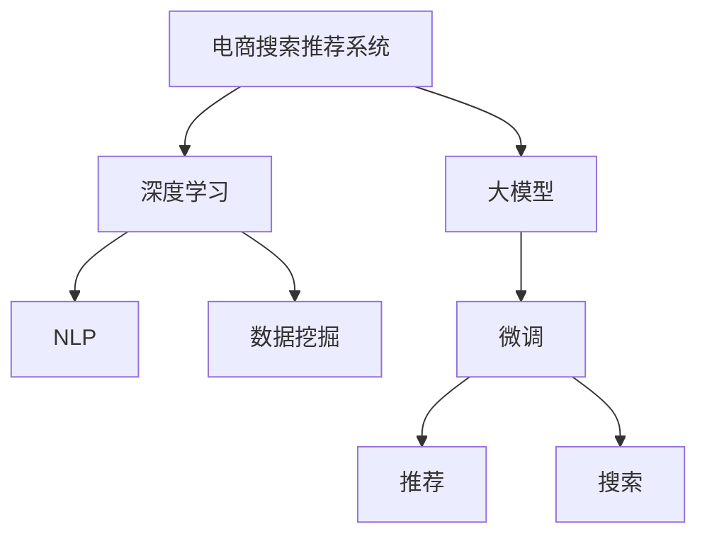

                 

# 电商平台的AI 大模型应用：搜索推荐系统是核心，用户体验优化是关键

> 关键词：电商平台,大模型应用,搜索推荐系统,用户体验,数据挖掘,深度学习

## 1. 背景介绍

### 1.1 问题由来
电商平台如今已经成为人们日常购物的重要渠道之一。随着互联网技术的不断进步，电商平台在展示商品、推荐商品、智能客服、支付系统等方面实现了数字化、智能化，极大地提升了用户体验和购物效率。特别是在个性化推荐和搜索结果的精准度上，电商平台已经到了必须借助AI技术提升到新高度的地步。

大模型应用在电商平台上的优势显而易见。相较于传统机器学习算法，基于大模型的推荐系统能够更高效地处理海量数据，提供更精准的推荐和更优质的搜索体验，帮助电商平台提升用户满意度、降低流失率，增加成交转化率。目前，大模型在电商平台的搜索推荐系统、智能客服、产品个性化推荐等方面得到了广泛应用，并取得显著效果。

### 1.2 问题核心关键点
大模型在电商平台中的应用，主要是通过其在自然语言处理(NLP)和图像处理(CV)等领域的强大能力，将海量的商品信息、用户行为数据转化为可理解的模型，辅助电商系统实现更智能的决策。核心关键点包括：
- 数据处理能力：大模型能够处理海量数据，识别用户行为模式，预测用户购买意向。
- 高效检索和推荐：基于预训练大模型的推荐系统可以高效地进行商品搜索、排序和推荐，提升用户满意度。
- 自动化客服：通过微调大模型，电商平台可以实现自动化的客服机器人，处理用户咨询，提升客户服务效率。
- 风险控制：借助大模型的分析能力，电商平台能够更好地进行风险控制，避免欺诈和违规交易。
- 数据隐私保护：大模型可以有效管理用户数据，保护用户隐私，提升用户信任度。

## 2. 核心概念与联系

### 2.1 核心概念概述

为更好地理解大模型在电商平台中的应用，本节将介绍几个核心概念：

- 大模型(Large Model)：指采用深度学习技术，通过预训练、微调等方法训练得到的庞大参数量的模型，如BERT、GPT-3等。
- 电商搜索推荐系统(e-Commerce Search and Recommendation System)：利用大模型的NLP能力，为用户提供商品搜索和个性化推荐服务，优化购物体验。
- 深度学习(Deep Learning)：通过构建多层神经网络模型，利用大量数据进行训练，学习复杂模式和规律，解决实际问题。
- 自然语言处理(NLP)：研究如何让机器能够理解、处理和生成自然语言，从而实现人机交互、信息检索、机器翻译等任务。
- 数据挖掘(Data Mining)：从数据中提取有用的信息和知识，支持决策、预测和优化。
- 深度学习推荐系统(Deep Learning Recommendation System, DLRS)：基于深度学习技术，从用户行为数据中学习推荐策略，提升推荐精准度。

这些概念之间的逻辑关系可以通过以下Mermaid流程图来展示：



这个流程图展示了大模型在电商平台中的应用流程：

1. 电商搜索推荐系统使用大模型作为基础。
2. 利用深度学习技术，提升模型的复杂模式学习能力。
3. 通过NLP技术，让大模型能够理解和处理自然语言。
4. 利用数据挖掘技术，从海量用户数据中提取有用的知识。
5. 通过微调优化大模型，进行个性化推荐和搜索优化。

## 3. 核心算法原理 & 具体操作步骤
### 3.1 算法原理概述

电商平台搜索推荐系统中的大模型应用，本质上是利用大模型的预训练-微调范式，通过大规模的无标签数据进行预训练，然后在特定任务上执行微调，从而提升推荐和搜索的准确性和个性化程度。

基于大模型的电商推荐系统主要涉及以下步骤：

1. 收集数据：电商平台上会收集用户的浏览记录、购买历史、评论信息等，以及商品的商品类别、价格、品牌、描述等信息。

2. 数据预处理：对收集到的数据进行清洗、去重、归一化等处理，确保数据的质量和一致性。

3. 大模型预训练：使用无标签的数据对大模型进行预训练，学习通用的语言和图像特征表示。

4. 任务适配层设计：根据电商推荐系统的具体任务，设计合适的输出层和损失函数，适配到大模型中。

5. 微调：使用电商平台上收集的少量标注数据，对大模型进行微调，使其能够更好地理解用户行为和商品特征，提升推荐和搜索的准确性。

6. 部署应用：将微调后的模型部署到电商平台的推荐和搜索系统中，实时地为每个用户生成个性化推荐。

### 3.2 算法步骤详解

电商平台的搜索推荐系统流程如下：

1. **数据收集与预处理**

    - **收集数据**：包括用户行为数据和商品信息数据。用户行为数据包括浏览、点击、购买、评价等操作。商品信息数据包括商品名称、描述、价格、类别等。
    - **数据清洗**：去除噪声和异常值，如去除重复记录、无效数据等。
    - **特征工程**：将原始数据转化为模型能够处理的格式，如对用户行为数据进行向量化处理。

2. **模型构建与预训练**

    - **构建模型**：使用深度学习框架如PyTorch、TensorFlow等构建大模型。
    - **数据预训练**：使用电商平台上收集的无标签数据对大模型进行预训练，一般使用自监督学习任务，如掩码语言模型、图像分类等。
    - **评估与保存**：在预训练过程中，使用验证集对模型进行评估，保存预训练模型以供微调使用。

3. **任务适配与微调**

    - **适配任务**：根据电商推荐系统的具体任务，设计合适的输出层和损失函数。
    - **微调模型**：使用电商平台上收集的少量标注数据，对大模型进行微调。
    - **调整超参数**：根据验证集上的表现，调整模型的学习率、批大小等超参数。

4. **部署与优化**

    - **部署模型**：将微调后的模型部署到电商平台上，实时地处理用户请求。
    - **性能优化**：对模型进行调优，如调整推理加速、优化内存使用等，提高系统性能。
    - **监控与迭代**：实时监控模型的性能，根据用户反馈和新数据进行迭代优化。

### 3.3 算法优缺点

大模型在电商平台上的应用具有以下优点：
1. **数据利用率高**：大模型能够处理海量数据，挖掘用户行为和商品特征，提升推荐和搜索的准确性。
2. **模型泛化能力强**：通过大规模预训练，大模型能够学习到通用的语言和图像特征表示，适应多种电商场景。
3. **实时响应**：基于大模型的推荐和搜索系统能够实时地处理用户请求，提高用户体验。
4. **用户体验优化**：大模型能够根据用户的历史行为和偏好，提供个性化的推荐和搜索结果，提升用户满意度。

同时，大模型在电商平台上的应用也存在以下缺点：
1. **计算资源需求大**：大模型参数量庞大，对计算资源要求高。
2. **模型解释性差**：大模型的决策过程复杂，难以解释其内部机制。
3. **数据隐私风险**：电商平台上涉及大量用户数据，可能存在数据隐私泄露的风险。
4. **过度拟合风险**：由于电商平台上标注数据较少，大模型可能出现过拟合现象。

### 3.4 算法应用领域

大模型在电商平台中的应用领域非常广泛，主要包括以下几个方面：

1. **商品搜索**：利用大模型进行商品查询，通过理解自然语言查询，快速返回相关商品。
2. **个性化推荐**：根据用户历史行为和商品特征，使用大模型生成个性化推荐。
3. **智能客服**：利用大模型构建智能客服系统，自动处理用户咨询。
4. **风险控制**：利用大模型的分析能力，进行欺诈检测、违规交易监控等风险控制。
5. **数据隐私保护**：利用大模型对用户数据进行保护，确保数据安全。

## 4. 数学模型和公式 & 详细讲解 & 举例说明
### 4.1 数学模型构建

电商平台的搜索推荐系统可以通过多种数学模型来实现，其中基于大模型的推荐系统模型构建如下：

假设电商平台的推荐系统中的大模型为 $M_{\theta}$，其中 $\theta$ 为模型参数。假设用户行为数据为 $\mathcal{X}$，商品特征数据为 $\mathcal{Y}$，则推荐系统的目标是最小化损失函数 $\mathcal{L}$。

模型 $M_{\theta}$ 对于用户行为 $x$ 和商品特征 $y$ 的预测输出为 $\hat{y}=M_{\theta}(x)$。推荐系统的目标是最小化预测输出与真实商品特征 $y$ 之间的损失，即：

$$
\mathcal{L}(\theta) = \frac{1}{N} \sum_{i=1}^N \ell(M_{\theta}(x_i),y_i)
$$

其中，$\ell$ 为损失函数，如交叉熵损失、均方误差损失等。

### 4.2 公式推导过程

电商平台的推荐系统可以使用多种损失函数，以下以交叉熵损失为例进行推导：

假设电商平台的推荐系统使用大模型 $M_{\theta}$ 进行商品推荐，对于用户行为 $x_i$ 和真实商品特征 $y_i$，预测输出为 $\hat{y}_i=M_{\theta}(x_i)$。则交叉熵损失函数为：

$$
\ell(M_{\theta}(x_i),y_i) = -[y_i\log \hat{y}_i + (1-y_i)\log(1-\hat{y}_i)]
$$

将交叉熵损失函数代入经验风险公式：

$$
\mathcal{L}(\theta) = -\frac{1}{N}\sum_{i=1}^N [y_i\log M_{\theta}(x_i)+(1-y_i)\log(1-M_{\theta}(x_i))]
$$

其中，$M_{\theta}(x_i)$ 为模型 $M_{\theta}$ 对用户行为 $x_i$ 的预测输出。

### 4.3 案例分析与讲解

假设电商平台的推荐系统使用大模型 $M_{\theta}$ 进行商品推荐。对于用户行为 $x_i$，真实商品特征 $y_i$，模型预测输出为 $\hat{y}_i$。假设交叉熵损失函数为：

$$
\ell(M_{\theta}(x_i),y_i) = -[y_i\log \hat{y}_i + (1-y_i)\log(1-\hat{y}_i)]
$$

则经验风险公式为：

$$
\mathcal{L}(\theta) = -\frac{1}{N}\sum_{i=1}^N [y_i\log M_{\theta}(x_i)+(1-y_i)\log(1-M_{\theta}(x_i))]
$$

假设电商平台上收集了10000个用户的购买数据，其中用户行为数据 $\mathcal{X}$ 和真实商品特征数据 $\mathcal{Y}$ 分别包含10000个样本。使用大模型 $M_{\theta}$ 进行预训练和微调，最终得到模型参数 $\hat{\theta}$。在验证集上评估模型的平均损失为0.01，则推荐系统在电商平台上运行时，对任意用户行为 $x_i$，预测输出的交叉熵损失为：

$$
\ell(M_{\hat{\theta}}(x_i),y_i) = -[y_i\log \hat{y}_i + (1-y_i)\log(1-\hat{y}_i)]
$$

## 5. 项目实践：代码实例和详细解释说明
### 5.1 开发环境搭建

在进行电商平台的搜索推荐系统开发前，需要准备好开发环境。以下是使用Python进行PyTorch开发的环境配置流程：

1. 安装Anaconda：从官网下载并安装Anaconda，用于创建独立的Python环境。

2. 创建并激活虚拟环境：
```bash
conda create -n ecommerce-env python=3.8 
conda activate ecommerce-env
```

3. 安装PyTorch：根据CUDA版本，从官网获取对应的安装命令。例如：
```bash
conda install pytorch torchvision torchaudio cudatoolkit=11.1 -c pytorch -c conda-forge
```

4. 安装Transformers库：
```bash
pip install transformers
```

5. 安装各类工具包：
```bash
pip install numpy pandas scikit-learn matplotlib tqdm jupyter notebook ipython
```

完成上述步骤后，即可在`ecommerce-env`环境中开始搜索推荐系统的开发。

### 5.2 源代码详细实现

下面我们以电商平台推荐系统为例，给出使用Transformers库进行深度学习推荐系统开发的PyTorch代码实现。

首先，定义推荐系统的训练函数：

```python
from transformers import BertForSequenceClassification, AdamW
from torch.utils.data import Dataset, DataLoader
import torch

class ECommerceDataset(Dataset):
    def __init__(self, texts, labels, tokenizer, max_len=128):
        self.texts = texts
        self.labels = labels
        self.tokenizer = tokenizer
        self.max_len = max_len
        
    def __len__(self):
        return len(self.texts)
    
    def __getitem__(self, item):
        text = self.texts[item]
        label = self.labels[item]
        
        encoding = self.tokenizer(text, return_tensors='pt', max_length=self.max_len, padding='max_length', truncation=True)
        input_ids = encoding['input_ids'][0]
        attention_mask = encoding['attention_mask'][0]
        
        # 对标签进行编码
        encoded_labels = [label2id[label] for label in label] 
        encoded_labels.extend([label2id['0']] * (self.max_len - len(encoded_labels)))
        labels = torch.tensor(encoded_labels, dtype=torch.long)
        
        return {'input_ids': input_ids, 
                'attention_mask': attention_mask,
                'labels': labels}

# 标签与id的映射
label2id = {'buy': 1, 'not_buy': 0}

# 创建dataset
tokenizer = BertTokenizer.from_pretrained('bert-base-cased')

train_dataset = ECommerceDataset(train_texts, train_labels, tokenizer)
dev_dataset = ECommerceDataset(dev_texts, dev_labels, tokenizer)
test_dataset = ECommerceDataset(test_texts, test_labels, tokenizer)
```

然后，定义模型和优化器：

```python
model = BertForSequenceClassification.from_pretrained('bert-base-cased', num_labels=len(label2id))

optimizer = AdamW(model.parameters(), lr=2e-5)
```

接着，定义训练和评估函数：

```python
device = torch.device('cuda') if torch.cuda.is_available() else torch.device('cpu')
model.to(device)

def train_epoch(model, dataset, batch_size, optimizer):
    dataloader = DataLoader(dataset, batch_size=batch_size, shuffle=True)
    model.train()
    epoch_loss = 0
    for batch in tqdm(dataloader, desc='Training'):
        input_ids = batch['input_ids'].to(device)
        attention_mask = batch['attention_mask'].to(device)
        labels = batch['labels'].to(device)
        model.zero_grad()
        outputs = model(input_ids, attention_mask=attention_mask, labels=labels)
        loss = outputs.loss
        epoch_loss += loss.item()
        loss.backward()
        optimizer.step()
    return epoch_loss / len(dataloader)

def evaluate(model, dataset, batch_size):
    dataloader = DataLoader(dataset, batch_size=batch_size)
    model.eval()
    preds, labels = [], []
    with torch.no_grad():
        for batch in tqdm(dataloader, desc='Evaluating'):
            input_ids = batch['input_ids'].to(device)
            attention_mask = batch['attention_mask'].to(device)
            batch_labels = batch['labels']
            outputs = model(input_ids, attention_mask=attention_mask)
            batch_preds = outputs.logits.argmax(dim=2).to('cpu').tolist()
            batch_labels = batch_labels.to('cpu').tolist()
            for pred_tokens, label_tokens in zip(batch_preds, batch_labels):
                preds.append(pred_tokens[:len(label_tokens)])
                labels.append(label_tokens)
                
    print(classification_report(labels, preds))
```

最后，启动训练流程并在测试集上评估：

```python
epochs = 5
batch_size = 16

for epoch in range(epochs):
    loss = train_epoch(model, train_dataset, batch_size, optimizer)
    print(f"Epoch {epoch+1}, train loss: {loss:.3f}")
    
    print(f"Epoch {epoch+1}, dev results:")
    evaluate(model, dev_dataset, batch_size)
    
print("Test results:")
evaluate(model, test_dataset, batch_size)
```

以上就是使用PyTorch进行电商平台推荐系统开发的完整代码实现。可以看到，利用Transformers库，可以相对简洁地构建和使用大模型进行推荐系统的开发。

### 5.3 代码解读与分析

让我们再详细解读一下关键代码的实现细节：

**ECommerceDataset类**：
- `__init__`方法：初始化用户行为数据、真实标签、分词器等关键组件。
- `__len__`方法：返回数据集的样本数量。
- `__getitem__`方法：对单个样本进行处理，将用户行为输入编码为token ids，将标签编码为数字，并对其进行定长padding，最终返回模型所需的输入。

**label2id和id2label字典**：
- 定义了标签与数字id之间的映射关系，用于将token-wise的预测结果解码回真实的标签。

**训练和评估函数**：
- 使用PyTorch的DataLoader对数据集进行批次化加载，供模型训练和推理使用。
- 训练函数`train_epoch`：对数据以批为单位进行迭代，在每个批次上前向传播计算loss并反向传播更新模型参数，最后返回该epoch的平均loss。
- 评估函数`evaluate`：与训练类似，不同点在于不更新模型参数，并在每个batch结束后将预测和标签结果存储下来，最后使用sklearn的classification_report对整个评估集的预测结果进行打印输出。

**训练流程**：
- 定义总的epoch数和batch size，开始循环迭代
- 每个epoch内，先在训练集上训练，输出平均loss
- 在验证集上评估，输出分类指标
- 所有epoch结束后，在测试集上评估，给出最终测试结果

可以看到，PyTorch配合Transformers库使得推荐系统开发变得简洁高效。开发者可以将更多精力放在数据处理、模型改进等高层逻辑上，而不必过多关注底层的实现细节。

当然，工业级的系统实现还需考虑更多因素，如模型的保存和部署、超参数的自动搜索、更灵活的任务适配层等。但核心的微调范式基本与此类似。

## 6. 实际应用场景
### 6.1 智能推荐系统

智能推荐系统是电商平台的核心应用之一，通过分析用户行为数据，推荐系统能够为用户推荐感兴趣的商品，提升用户购物体验和平台成交转化率。

在大模型的帮助下，推荐系统可以高效地处理海量用户行为数据，识别用户偏好和行为模式，生成精准的推荐结果。例如，通过分析用户历史浏览、购买记录，识别用户兴趣点，生成个性化的商品推荐列表。在深度学习框架中，使用大模型进行预训练和微调，可以大幅提升推荐的精度和覆盖率，为用户提供更加满意的购物体验。

### 6.2 实时搜索优化

搜索系统是电商平台不可或缺的组成部分，用户通过搜索系统可以快速找到自己需要购买的商品。实时搜索优化通过大模型处理海量查询请求，返回最相关的搜索结果，提高用户搜索效率。

利用大模型，推荐系统可以理解自然语言查询，将其转化为模型能够处理的格式，快速检索出最相关的商品信息。例如，通过分析查询意图和商品描述，识别出用户可能感兴趣的关键词，返回相应的商品列表。在深度学习框架中，使用大模型进行预训练和微调，可以提升搜索结果的准确性和相关性，使用户能够快速找到所需商品。

### 6.3 个性化营销

个性化营销是电商平台提升用户黏性和成交转化率的有效手段。利用大模型，推荐系统可以为不同用户群体设计个性化的营销方案，提高营销效果。

通过分析用户行为数据和商品特征数据，推荐系统可以生成个性化的营销内容，如优惠券、推荐理由等。例如，针对高频用户群体，推荐优惠券和促销信息；针对新用户群体，推荐热门商品和推荐理由。在深度学习框架中，使用大模型进行预训练和微调，可以提升个性化营销内容的精准度，吸引用户下单。

### 6.4 未来应用展望

随着大模型和推荐系统的不断发展，未来电商平台的搜索推荐系统将呈现以下几个发展趋势：

1. **实时响应能力增强**：通过优化推理引擎和数据存储，推荐系统可以实时处理用户请求，提高搜索和推荐的速度和效率。

2. **个性化推荐精准度提升**：借助大模型的语言理解和图像处理能力，推荐系统可以更准确地识别用户偏好和行为模式，生成更精准的推荐结果。

3. **多模态推荐应用扩展**：推荐系统可以融合视觉、音频等多模态数据，提升推荐内容的丰富度和多样性，满足用户更多样化的需求。

4. **知识图谱和专家系统结合**：推荐系统可以结合知识图谱和专家系统，利用专家知识提升推荐结果的准确性和可信度。

5. **隐私保护和安全性提升**：在推荐过程中，推荐系统需要保护用户隐私，避免数据泄露和滥用。同时，需要建立完善的异常检测和防御机制，确保系统的安全性。

6. **跨平台协同推荐**：推荐系统可以跨多个电商平台进行协同推荐，提升用户跨平台购物体验。

## 7. 工具和资源推荐
### 7.1 学习资源推荐

为了帮助开发者系统掌握大模型在电商平台中的应用，这里推荐一些优质的学习资源：

1. 《深度学习推荐系统》书籍：全面介绍了推荐系统的基本原理和应用，包括基于深度学习的大模型推荐系统。

2. 《NLP深度学习实战》书籍：介绍了NLP领域的基本技术和应用，包括大模型在NLP中的角色。

3. 《电商推荐系统实战》课程：介绍电商推荐系统的构建和优化，涵盖从数据收集到模型部署的全流程。

4. 《深度学习框架实战》课程：介绍深度学习框架如PyTorch、TensorFlow等的应用，包括模型构建和训练优化。

5. 《Transformers库实战》课程：介绍使用Transformers库进行深度学习模型开发的实战技巧，包括大模型的应用。

通过对这些资源的学习实践，相信你一定能够快速掌握大模型在电商平台中的应用，并用于解决实际的推荐和搜索问题。
###  7.2 开发工具推荐

高效的开发离不开优秀的工具支持。以下是几款用于电商平台搜索推荐系统开发的常用工具：

1. PyTorch：基于Python的开源深度学习框架，灵活动态的计算图，适合快速迭代研究。

2. TensorFlow：由Google主导开发的开源深度学习框架，生产部署方便，适合大规模工程应用。

3. Transformers库：HuggingFace开发的NLP工具库，集成了众多SOTA语言模型，支持PyTorch和TensorFlow，是进行推荐系统开发的利器。

4. Weights & Biases：模型训练的实验跟踪工具，可以记录和可视化模型训练过程中的各项指标，方便对比和调优。

5. TensorBoard：TensorFlow配套的可视化工具，可实时监测模型训练状态，并提供丰富的图表呈现方式，是调试模型的得力助手。

6. Amazon SageMaker：AWS提供的云端AI平台，支持模型训练、部署、监控等全流程服务，是电商推荐系统开发的常用工具。

合理利用这些工具，可以显著提升电商平台搜索推荐系统的开发效率，加快创新迭代的步伐。

### 7.3 相关论文推荐

大模型在电商平台中的应用源于学界的持续研究。以下是几篇奠基性的相关论文，推荐阅读：

1. Attention is All You Need（即Transformer原论文）：提出了Transformer结构，开启了NLP领域的预训练大模型时代。

2. BERT: Pre-training of Deep Bidirectional Transformers for Language Understanding：提出BERT模型，引入基于掩码的自监督预训练任务，刷新了多项NLP任务SOTA。

3. Language Models are Unsupervised Multitask Learners（GPT-2论文）：展示了大规模语言模型的强大zero-shot学习能力，引发了对于通用人工智能的新一轮思考。

4. Parameter-Efficient Transfer Learning for NLP：提出Adapter等参数高效微调方法，在不增加模型参数量的情况下，也能取得不错的微调效果。

5. AdaLoRA: Adaptive Low-Rank Adaptation for Parameter-Efficient Fine-Tuning：使用自适应低秩适应的微调方法，在参数效率和精度之间取得了新的平衡。

这些论文代表了大模型在推荐系统领域的发展脉络。通过学习这些前沿成果，可以帮助研究者把握学科前进方向，激发更多的创新灵感。

## 8. 总结：未来发展趋势与挑战
### 8.1 总结

本文对大模型在电商平台中的应用进行了全面系统的介绍。首先阐述了电商平台搜索推荐系统的发展背景和需求，明确了基于大模型的推荐系统在电商平台的独特价值。其次，从原理到实践，详细讲解了基于大模型的推荐系统的数学模型和训练流程，给出了推荐系统开发的完整代码实例。同时，本文还广泛探讨了推荐系统在电商推荐、实时搜索优化、个性化营销等多个方面的实际应用，展示了大模型的强大能力。此外，本文精选了推荐系统的各类学习资源，力求为读者提供全方位的技术指引。

通过本文的系统梳理，可以看到，大模型在电商平台中的应用已经取得了显著成果，并正在向更广领域扩展。在未来，大模型和推荐系统将进一步提升电商平台的智能化水平，提供更加优质的用户体验。

### 8.2 未来发展趋势

展望未来，大模型在电商平台中的应用将呈现以下几个发展趋势：

1. **模型规模持续增大**：随着算力成本的下降和数据规模的扩张，预训练大模型的参数量还将持续增长。超大规模语言模型蕴含的丰富语言知识，有望支撑更加复杂多变的推荐和搜索任务。

2. **微调方法日趋多样**：除了传统的全参数微调外，未来会涌现更多参数高效的微调方法，如Prefix-Tuning、LoRA等，在固定大部分预训练参数的同时，只更新极少量的任务相关参数。

3. **实时响应能力增强**：通过优化推理引擎和数据存储，推荐系统可以实时处理用户请求，提高搜索和推荐的速度和效率。

4. **个性化推荐精准度提升**：借助大模型的语言理解和图像处理能力，推荐系统可以更准确地识别用户偏好和行为模式，生成更精准的推荐结果。

5. **多模态推荐应用扩展**：推荐系统可以融合视觉、音频等多模态数据，提升推荐内容的丰富度和多样性，满足用户更多样化的需求。

6. **知识图谱和专家系统结合**：推荐系统可以结合知识图谱和专家系统，利用专家知识提升推荐结果的准确性和可信度。

以上趋势凸显了大模型在电商平台中的应用前景。这些方向的探索发展，必将进一步提升推荐系统的效果和用户满意度，推动电商平台向智能化、个性化方向发展。

### 8.3 面临的挑战

尽管大模型在电商平台中的应用已经取得了瞩目成就，但在迈向更加智能化、普适化应用的过程中，它仍面临着诸多挑战：

1. **数据收集成本高**：电商平台上涉及海量用户行为数据，数据收集和标注成本较高。如何高效利用已有数据，减少新数据采集和标注的难度，将是一大难题。

2. **模型解释性差**：大模型的决策过程复杂，难以解释其内部机制。对于电商推荐系统，模型决策的透明性和可解释性尤为重要，用户需要了解推荐结果的依据。

3. **计算资源需求大**：大模型参数量庞大，对计算资源要求高。如何优化模型结构和计算效率，降低模型训练和推理的资源消耗，将是重要的优化方向。

4. **用户隐私保护**：电商平台上涉及大量用户数据，可能存在数据隐私泄露的风险。如何在推荐过程中保护用户隐私，避免数据滥用，将是重要的研究方向。

5. **模型泛化能力弱**：电商平台上标注数据较少，大模型可能出现过拟合现象。如何增强模型的泛化能力，避免模型在新场景上的表现下降，将是一大挑战。

6. **跨平台协同推荐**：不同电商平台的数据格式和用户群体可能存在差异，如何实现跨平台的协同推荐，提升用户跨平台购物体验，将是一大挑战。

7. **模型安全性问题**：电商推荐系统需要确保其安全性，避免欺诈和违规交易。如何在推荐过程中保证系统的安全性，将是重要的研究方向。

这些挑战需要在未来的研究中不断解决，才能真正实现大模型在电商平台中的大规模落地。相信随着学界和产业界的共同努力，这些挑战终将一一被克服，大模型在电商平台中的应用将更加成熟和完善。

### 8.4 研究展望

面向未来，大模型在电商平台中的应用研究需要在以下几个方面寻求新的突破：

1. **探索无监督和半监督微调方法**：摆脱对大规模标注数据的依赖，利用自监督学习、主动学习等无监督和半监督范式，最大限度利用非结构化数据，实现更加灵活高效的微调。

2. **开发更加参数高效的微调方法**：开发更加参数高效的微调方法，如Prefix-Tuning、LoRA等，在固定大部分预训练参数的同时，只更新极少量的任务相关参数。

3. **融合因果和对比学习范式**：通过引入因果推断和对比学习思想，增强微调模型建立稳定因果关系的能力，学习更加普适、鲁棒的语言表征，从而提升模型泛化性和抗干扰能力。

4. **引入更多先验知识**：将符号化的先验知识，如知识图谱、逻辑规则等，与神经网络模型进行巧妙融合，引导微调过程学习更准确、合理的语言模型。

5. **结合因果分析和博弈论工具**：将因果分析方法引入微调模型，识别出模型决策的关键特征，增强输出解释的因果性和逻辑性。借助博弈论工具刻画人机交互过程，主动探索并规避模型的脆弱点，提高系统稳定性。

6. **纳入伦理道德约束**：在模型训练目标中引入伦理导向的评估指标，过滤和惩罚有偏见、有害的输出倾向。同时加强人工干预和审核，建立模型行为的监管机制，确保输出符合人类价值观和伦理道德。

这些研究方向的探索，必将引领大模型在电商平台中的应用向更高的台阶迈进，为电商平台的智能化、个性化发展提供新的技术支持。

## 9. 附录：常见问题与解答

**Q1：电商平台使用大模型微调有哪些好处？**

A: 电商平台使用大模型微调的好处主要包括：

1. **提高推荐精准度**：大模型能够处理海量用户行为数据，识别用户偏好和行为模式，生成精准的推荐结果。

2. **提升搜索效率**：大模型能够理解自然语言查询，快速检索出最相关的商品信息，提升用户搜索体验。

3. **优化个性化营销**：大模型可以为不同用户群体设计个性化的营销方案，提高营销效果。

4. **增强实时响应能力**：大模型可以实时处理用户请求，提高推荐和搜索的速度和效率。

5. **多模态数据融合**：大模型可以融合视觉、音频等多模态数据，提升推荐内容的丰富度和多样性。

6. **结合知识图谱**：大模型可以结合知识图谱，提升推荐结果的准确性和可信度。

通过大模型的微调，电商平台可以更智能地为用户提供推荐和搜索服务，提升用户满意度和成交转化率。

**Q2：电商平台使用大模型微调时需要注意哪些问题？**

A: 电商平台使用大模型微调时需要注意以下问题：

1. **数据质量**：电商平台需要收集高质量的用户行为数据和商品信息，确保数据的质量和一致性。

2. **模型泛化能力**：电商平台上的标注数据较少，大模型可能出现过拟合现象。需要在模型训练过程中加入正则化技术，提高模型的泛化能力。

3. **计算资源消耗**：大模型参数量庞大，对计算资源要求高。需要在模型构建和训练过程中进行资源优化。

4. **用户隐私保护**：电商平台涉及大量用户数据，需要采取数据保护措施，确保用户隐私安全。

5. **模型解释性**：大模型的决策过程复杂，难以解释其内部机制。需要在模型设计和训练过程中加入可解释性约束。

6. **跨平台协同推荐**：不同电商平台的数据格式和用户群体可能存在差异，需要设计跨平台的协同推荐机制。

7. **模型安全性**：电商推荐系统需要确保其安全性，避免欺诈和违规交易。需要在模型训练和部署过程中加入异常检测和防御机制。

通过合理处理这些问题，可以更好地利用大模型在电商平台中的应用，提升用户满意度和平台收益。

**Q3：电商平台使用大模型微调时可以采取哪些优化措施？**

A: 电商平台使用大模型微调时，可以采取以下优化措施：

1. **数据增强**：通过回译、近义替换等方式扩充训练集，增加模型的泛化能力。

2. **正则化技术**：使用L2正则、Dropout、Early Stopping等技术，防止模型过度适应训练集。

3. **对抗训练**：引入对抗样本，提高模型鲁棒性。

4. **参数高效微调**：只更新部分模型参数，降低模型训练和推理的资源消耗。

5. **模型裁剪**：去除不必要的层和参数，减小模型尺寸，加快推理速度。

6. **量化加速**：将浮点模型转为定点模型，压缩存储空间，提高计算效率。

7. **混合精度训练**：使用混合精度训练，减少计算量，提高训练速度。

8. **模型并行**：采用模型并行技术，提高模型训练的并发性和效率。

通过这些优化措施，可以显著提升大模型在电商平台中的应用效果，降低资源消耗，提升用户体验。

**Q4：电商平台使用大模型微调时如何进行模型调优？**

A: 电商平台使用大模型微调时，进行模型调优的步骤包括：

1. **模型构建**：使用深度学习框架如PyTorch、TensorFlow等构建大模型。

2. **数据预训练**：使用电商平台上收集的无标签数据对大模型进行预训练，学习通用的语言和图像特征表示。

3. **任务适配**：根据电商推荐系统的具体任务，设计合适的输出层和损失函数，适配到大模型中。

4. **微调模型**：使用电商平台上收集的少量标注数据，对大模型进行微调，使其能够更好地理解用户行为和商品特征，提升推荐和搜索的准确性。

5. **调整超参数**：根据验证集上的表现，调整模型的学习率、批大小等超参数。

6. **性能优化**：对模型进行调优，如调整推理加速、优化内存使用等，提高系统性能。

7. **监控与迭代**：实时监控模型的性能，根据用户反馈和新数据进行迭代优化。

通过这些步骤，可以不断优化大模型在电商平台中的应用，提升推荐和搜索的效果，满足用户需求。

---

作者：禅与计算机程序设计艺术 / Zen and the Art of Computer Programming

