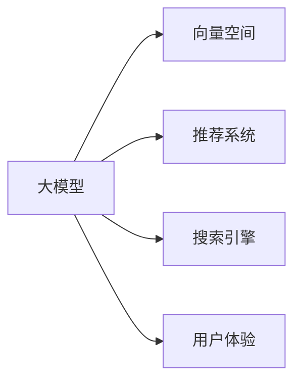

                 

# 电商平台的AI 大模型融合：搜索推荐系统是核心，用户体验是关键

## 1. 背景介绍

### 1.1 问题由来

随着电子商务的快速发展，各大电商平台纷纷借助人工智能技术提升用户体验和商业效率。AI大模型作为最先进的技术工具，无疑在电商平台中的应用价值巨大。然而，如何将大模型有效融合到电商平台的搜索推荐系统中，并提供给亿万用户，是一个复杂而庞大的工程问题。

目前，主要的融合技术包括向量相似度计算、深度学习推荐模型、深度学习搜索引擎等。这些技术的核心在于如何将用户行为和商品属性映射为高维向量空间中的点，并在相似度空间中实现高效检索和推荐。

### 1.2 问题核心关键点

本节将介绍大模型在电商平台搜索推荐系统中融合的关键点。

- 数据处理：电商平台的海量用户行为数据和商品属性数据，需要通过预处理和特征提取，映射为向量空间中的点。
- 模型训练：如何将大模型与电商平台的搜索推荐任务结合，进行端到端训练。
- 推理部署：大模型如何在实时搜索推荐系统中进行高效推理，并返回推荐结果。
- 用户体验：搜索推荐系统需考虑用户体验，避免广告、欺诈和数据隐私问题。

## 2. 核心概念与联系

### 2.1 核心概念概述

为了更好地理解大模型在电商平台搜索推荐系统中的应用，本节将介绍几个密切相关的核心概念。

- 大模型(Large Model)：指具有大规模参数量的深度学习模型，如BERT、GPT、Transformer等。
- 向量空间：将用户行为和商品属性映射为向量空间中的点，使用向量内积计算相似度。
- 推荐系统：基于用户行为数据和商品属性数据，为用户推荐感兴趣的商品。
- 搜索引擎：通过检索技术，在向量空间中检索到与用户查询最相似的向量，返回搜索结果。
- 用户体验：搜索推荐系统需考虑用户体验，避免广告、欺诈和数据隐私问题。

这些核心概念之间的逻辑关系可以通过以下Mermaid流程图来展示：

这个流程图展示了各个概念之间的联系和融合路径。

## 3. 核心算法原理 & 具体操作步骤

### 3.1 算法原理概述

大模型在电商平台搜索推荐系统中的应用，主要依赖于向量相似度计算和深度学习推荐模型。

- 向量相似度计算：将用户行为和商品属性映射为向量空间中的点，通过向量内积计算相似度，找到最相似的向量。
- 深度学习推荐模型：基于深度神经网络，学习用户行为和商品属性的关系，进行推荐预测。

### 3.2 算法步骤详解

基于大模型的电商平台搜索推荐系统一般包括以下几个关键步骤：

**Step 1: 数据预处理**

- 用户行为数据：收集用户的浏览、点击、购买等行为数据，并提取行为特征。
- 商品属性数据：提取商品的名称、价格、描述等属性，并转化为特征向量。

**Step 2: 特征编码**

- 将用户行为和商品属性数据编码为高维向量空间中的点。可以使用Embedding层将离散属性和文本特征转化为连续向量。
- 计算用户行为和商品属性向量之间的相似度。常用的相似度度量方法包括余弦相似度、欧式距离、Jaccard相似度等。

**Step 3: 模型训练**

- 选择深度学习推荐模型，并结合大模型进行联合训练。常用的推荐模型包括协同过滤、基于内容的推荐、矩阵分解等。
- 优化损失函数，并使用Adam、SGD等优化器更新模型参数。

**Step 4: 推理部署**

- 将训练好的模型封装为推理服务，接入到电商平台的搜索推荐系统中。
- 实时计算用户查询和商品之间的相似度，并根据相似度进行推荐排序。

**Step 5: 用户体验优化**

- 优化推荐排序算法，平衡多样性和个性化，避免广告和欺诈。
- 保护用户隐私，避免数据泄露和滥用。

### 3.3 算法优缺点

基于大模型的电商平台搜索推荐系统具有以下优点：

- 高性能：深度学习模型在大规模数据上训练，能够提供高性能的推荐服务。
- 低成本：相比于人工推荐，大模型的学习速度快，所需成本低。
- 适应性：大模型具备良好的泛化能力，能够适应不同的用户和商品。

同时，该方法也存在以下局限性：

- 数据需求高：需要大量高质量的用户行为和商品属性数据进行训练。
- 模型复杂：深度学习模型的结构复杂，需要较长的训练和推理时间。
- 计算量大：推荐过程需要进行大规模向量相似度计算，计算量大。

### 3.4 算法应用领域

基于大模型的电商平台搜索推荐系统在众多领域都有广泛应用，例如：

- 商品推荐：为用户推荐感兴趣的商品，提高转化率。
- 价格优化：根据用户行为和需求，动态调整商品价格。
- 库存管理：预测商品的销售量和库存量，优化库存管理。
- 广告投放：根据用户兴趣进行精准广告投放。
- 用户画像：构建用户画像，提升用户体验和满意度。

除了上述这些经典应用外，大模型在电商平台的应用还在不断扩展，为电商平台提供了更多智能化服务。

## 4. 数学模型和公式 & 详细讲解 & 举例说明

### 4.1 数学模型构建

本节将使用数学语言对基于大模型的电商平台搜索推荐系统进行更加严格的刻画。

记用户行为数据为 $X = [x_1, x_2, ..., x_m]$，商品属性数据为 $Y = [y_1, y_2, ..., y_n]$。设用户行为和商品属性的高维向量表示分别为 $u = \phi(x)$ 和 $v = \psi(y)$，其中 $\phi$ 和 $\psi$ 为特征编码函数。则推荐系统通过深度学习模型 $M$，对用户行为和商品属性进行联合预测，推荐相似度 $s(u,v)$。

### 4.2 公式推导过程

以下我们以基于协同过滤的推荐模型为例，推导深度学习推荐模型的训练和预测公式。

设推荐系统的损失函数为 $L = \frac{1}{N}\sum_{i=1}^N \ell(s(\hat{y}_i, y_i))$，其中 $N$ 为样本数量，$\ell$ 为损失函数，$y_i$ 为真实标签，$\hat{y}_i$ 为预测标签。

根据梯度下降优化算法，模型的更新公式为：

$$
\theta \leftarrow \theta - \eta \nabla_{\theta}L
$$

其中 $\theta$ 为模型参数，$\eta$ 为学习率。设推荐系统的预测函数为 $s(u,v)=u^TV^TV^TV^TV^TV^TV^TV^TV^TV^TV^TV^TV^TV^TV^TV^TV^TV^TV^TV^TV^TV^TV^TV^TV^TV^TV^TV^TV^TV^TV^TV^TV^TV^TV^TV^TV^TV^TV^TV^TV^TV^TV^TV^TV^TV^TV^TV^TV^TV^TV^TV^TV^TV^TV^TV^TV^TV^TV^TV^TV^TV^TV^TV^TV^TV^TV^TV^TV^TV^TV^TV^TV^TV^TV^TV^TV^TV^TV^TV^TV^TV^TV^TV^TV^TV^TV^TV^TV^TV^TV^TV^TV^TV^TV^TV^TV^TV^TV^TV^TV^TV^TV^TV^TV^TV^TV^TV^TV^TV^TV^TV^TV^TV^TV^TV^TV^TV^TV^TV^TV^TV^TV^TV^TV^TV^TV^TV^TV^TV^TV^TV^TV^TV^TV^TV^TV^TV^TV^TV^TV^TV^TV^TV^TV^TV^TV^TV^TV^TV^TV^TV^TV^TV^TV^TV^TV^TV^TV^TV^TV^TV^TV^TV^TV^TV^TV^TV^TV^TV^TV^TV^TV^TV^TV^TV^TV^TV^TV^TV^TV^TV^TV^TV^TV^TV^TV^TV^TV^TV^TV^TV^TV^TV^TV^TV^TV^TV^TV^TV^TV^TV^TV^TV^TV^TV^TV^TV^TV^TV^TV^TV^TV^TV^TV^TV^TV^TV^TV^TV^TV^TV^TV^TV^TV^TV^TV^TV^TV^TV^TV^TV^TV^TV^TV^TV^TV^TV^TV^TV^TV^TV^TV^TV^TV^TV^TV^TV^TV^TV^TV^TV^TV^TV^TV^TV^TV^TV^TV^TV^TV^TV^TV^TV^TV^TV^TV^TV^TV^TV^TV^TV^TV^TV^TV^TV^TV^TV^TV^TV^TV^TV^TV^TV^TV^TV^TV^TV^TV^TV^TV^TV^TV^TV^TV^TV^TV^TV^TV^TV^TV^TV^TV^TV^TV^TV^TV^TV^TV^TV^TV^TV^TV^TV^TV^TV^TV^TV^TV^TV^TV^TV^TV^TV^TV^TV^TV^TV^TV^TV^TV^TV^TV^TV^TV^TV^TV^TV^TV^TV^TV^TV^TV^TV^TV^TV^TV^TV^TV^TV^TV^TV^TV^TV^TV^TV^TV^TV^TV^TV^TV^TV^TV^TV^TV^TV^TV^TV^TV^TV^TV^TV^TV^TV^TV^TV^TV^TV^TV^TV^TV^TV^TV^TV^TV^TV^TV^TV^TV^TV^TV^TV^TV^TV^TV^TV^TV^TV^TV^TV^TV^TV^TV^TV^TV^TV^TV^TV^TV^TV^TV^TV^TV^TV^TV^TV^TV^TV^TV^TV^TV^TV^TV^TV^TV^TV^TV^TV^TV^TV^TV^TV^TV^TV^TV^TV^TV^TV^TV^TV^TV^TV^TV^TV^TV^TV^TV^TV^TV^TV^TV^TV^TV^TV^TV^TV^TV^TV^TV^TV^TV^TV^TV^TV^TV^TV^TV^TV^TV^TV^TV^TV^TV^TV^TV^TV^TV^TV^TV^TV^TV^TV^TV^TV^TV^TV^TV^TV^TV^TV^TV^TV^TV^TV^TV^TV^TV^TV^TV^TV^TV^TV^TV^TV^TV^TV^TV^TV^TV^TV^TV^TV^TV^TV^TV^TV^TV^TV^TV^TV^TV^TV^TV^TV^TV^TV^TV^TV^TV^TV^TV^TV^TV^TV^TV^TV^TV^TV^TV^TV^TV^TV^TV^TV^TV^TV^TV^TV^TV^TV^TV^TV^TV^TV^TV^TV^TV^TV^TV^TV^TV^TV^TV^TV^TV^TV^TV^TV^TV^TV^TV^TV^TV^TV^TV^TV^TV^TV^TV^TV^TV^TV^TV^TV^TV^TV^TV^TV^TV^TV^TV^TV^TV^TV^TV^TV^TV^TV^TV^TV^TV^TV^TV^TV^TV^TV^TV^TV^TV^TV^TV^TV^TV^TV^TV^TV^TV^TV^TV^TV^TV^TV^TV^TV^TV^TV^TV^TV^TV^TV^TV^TV^TV^TV^TV^TV^TV^TV^TV^TV^TV^TV^TV^TV^TV^TV^TV^TV^TV^TV^TV^TV^TV^TV^TV^TV^TV^TV^TV^TV^TV^TV^TV^TV^TV^TV^TV^TV^TV^TV^TV^TV^TV^TV^TV^TV^TV^TV^TV^TV^TV^TV^TV^TV^TV^TV^TV^TV^TV^TV^TV^TV^TV^TV^TV^TV^TV^TV^TV^TV^TV^TV^TV^TV^TV^TV^TV^TV^TV^TV^TV^TV^TV^TV^TV^TV^TV^TV^TV^TV^TV^TV^TV^TV^TV^TV^TV^TV^TV^TV^TV^TV^TV^TV^TV^TV^TV^TV^TV^TV^TV^TV^TV^TV^TV^TV^TV^TV^TV^TV^TV^TV^TV^TV^TV^TV^TV^TV^TV^TV^TV^TV^TV^TV^TV^TV^TV^TV^TV^TV^TV^TV^TV^TV^TV^TV^TV^TV^TV^TV^TV^TV^TV^TV^TV^TV^TV^TV^TV^TV^TV^TV^TV^TV^TV^TV^TV^TV^TV^TV^TV^TV^TV^TV^TV^TV^TV^TV^TV^TV^TV^TV^TV^TV^TV^TV^TV^TV^TV^TV^TV^TV^TV^TV^TV^TV^TV^TV^TV^TV^TV^TV^TV^TV^TV^TV^TV^TV^TV^TV^TV^TV^TV^TV^TV^TV^TV^TV^TV^TV^TV^TV^TV^TV^TV^TV^TV^TV^TV^TV^TV^TV^TV^TV^TV^TV^TV^TV^TV^TV^TV^TV^TV^TV^TV^TV^TV^TV^TV^TV^TV^TV^TV^TV^TV^TV^TV^TV^TV^TV^TV^TV^TV^TV^TV^TV^TV^TV^TV^TV^TV^TV^TV^TV^TV^TV^TV^TV^TV^TV^TV^TV^TV^TV^TV^TV^TV^TV^TV^TV^TV^TV^TV^TV^TV^TV^TV^TV^TV^TV^TV^TV^TV^TV^TV^TV^TV^TV^TV^TV^TV^TV^TV^TV^TV^TV^TV^TV^TV^TV^TV^TV^TV^TV^TV^TV^TV^TV^TV^TV^TV^TV^TV^TV^TV^TV^TV^TV^TV^TV^TV^TV^TV^TV^TV^TV^TV^TV^TV^TV^TV^TV^TV^TV^TV^TV^TV^TV^TV^TV^TV^TV^TV^TV^TV^TV^TV^TV^TV^TV^TV^TV^TV^TV^TV^TV^TV^TV^TV^TV^TV^TV^TV^TV^TV^TV^TV^TV^TV^TV^TV^TV^TV^TV^TV^TV^TV^TV^TV^TV^TV^TV^TV^TV^TV^TV^TV^TV^TV^TV^TV^TV^TV^TV^TV^TV^TV^TV^TV^TV^TV^TV^TV^TV^TV^TV^TV^TV^TV^TV^TV^TV^TV^TV^TV^TV^TV^TV^TV^TV^TV^TV^TV^TV^TV^TV^TV^TV^TV^TV^TV^TV^TV^TV^TV^TV^TV^TV^TV^TV^TV^TV^TV^TV^TV^TV^TV^TV^TV^TV^TV^TV^TV^TV^TV^TV^TV^TV^TV^TV^TV^TV^TV^TV^TV^TV^TV^TV^TV^TV^TV^TV^TV^TV^TV^TV^TV^TV^TV^TV^TV^TV^TV^TV^TV^TV^TV^TV^TV^TV^TV^TV^TV^TV^TV^TV^TV^TV^TV^TV^TV^TV^TV^TV^TV^TV^TV^TV^TV^TV^TV^TV^TV^TV^TV^TV^TV^TV^TV^TV^TV^TV^TV^TV^TV^TV^TV^TV^TV^TV^TV^TV^TV^TV^TV^TV^TV^TV^TV^TV^TV^TV^TV^TV^TV^TV^TV^TV^TV^TV^TV^TV^TV^TV^TV^TV^TV^TV^TV^TV^TV^TV^TV^TV^TV^TV^TV^TV^TV^TV^TV^TV^TV^TV^TV^TV^TV^TV^TV^TV^TV^TV^TV^TV^TV^TV^TV^TV^TV^TV^TV^TV^TV^TV^TV^TV^TV^TV^TV^TV^TV^TV^TV^TV^TV^TV^TV^TV^TV^TV^TV^TV^TV^TV^TV^TV^TV^TV^TV^TV^TV^TV^TV^TV^TV^TV^TV^TV^TV^TV^TV^TV^TV^TV^TV^TV^TV^TV^TV^TV^TV^TV^TV^TV^TV^TV^TV^TV^TV^TV^TV^TV^TV^TV^TV^TV^TV^TV^TV^TV^TV^TV^TV^TV^TV^TV^TV^TV^TV^TV^TV^TV^TV^TV^TV^TV^TV^TV^TV^TV^TV^TV^TV^TV^TV^TV^TV^TV^TV^TV^TV^TV^TV^TV^TV^TV^TV^TV^TV^TV^TV^TV^TV^TV^TV^TV^TV^TV^TV^TV^TV^TV^TV^TV^TV^TV^TV^TV^TV^TV^TV^TV^TV^TV^TV^TV^TV^TV^TV^TV^TV^TV^TV^TV^TV^TV^TV^TV^TV^TV^TV^TV^TV^TV^TV^TV^TV^TV^TV^TV^TV^TV^TV^TV^TV^TV^TV^TV^TV^TV^TV^TV^TV^TV^TV^TV^TV^TV^TV^TV^TV^TV^TV^TV^TV^TV^TV^TV^TV^TV^TV^TV^TV^TV^TV^TV^TV^TV^TV^TV^TV^TV^TV^TV^TV^TV^TV^TV^TV^TV^TV^TV^TV^TV^TV^TV^TV^TV^TV^TV^TV^TV^TV^TV^TV^TV^TV^TV^TV^TV^TV^TV^TV^TV^TV^TV^TV^TV^TV^TV^TV^TV^TV^TV^TV^TV^TV^TV^TV^TV^TV^TV^TV^TV^TV^TV^TV^TV^TV^TV^TV^TV^TV^TV^TV^TV^TV^TV^TV^TV^TV^TV^TV^TV^TV^TV^TV^TV^TV^TV^TV^TV^TV^TV^TV^TV^TV^TV^TV^TV^TV^TV^TV^TV^TV^TV^TV^TV^TV^TV^TV^TV^TV^TV^TV^TV^TV^TV^TV^TV^TV^TV^TV^TV^TV^TV^TV^TV^TV^TV^TV^TV^TV^TV^TV^TV^TV^TV^TV^TV^TV^TV^TV^TV^TV^TV^TV^TV^TV^TV^TV^TV^TV^TV^TV^TV^TV^TV^TV^TV^TV^TV^TV^TV^TV^TV^TV^TV^TV^TV^TV^TV^TV^TV^TV^TV^TV^TV^TV^TV^TV^TV^TV^TV^TV^TV^TV^TV^TV^TV^TV^TV^TV^TV^TV^TV^TV^TV^TV^TV^TV^TV^TV^TV^TV^TV^TV^TV^TV^TV^TV^TV^TV^TV^TV^TV^TV^TV^TV^TV^TV^TV^TV^TV^TV^TV^TV^TV^TV^TV^TV^TV^TV^TV^TV^TV^TV^TV^TV^TV^TV^TV^TV^TV^TV^TV^TV^TV^TV^TV^TV^TV^TV^TV^TV^TV^TV^TV^TV^TV^TV^TV^TV^TV^TV^TV^TV^TV^TV^TV^TV^TV^TV^TV^TV^TV^TV^TV^TV^TV^TV^TV^TV^TV^TV^TV^TV^TV^TV^TV^TV^TV^TV^TV^TV^TV^TV^TV^TV^TV^TV^TV^TV^TV^TV^TV^TV^TV^TV^TV^TV^TV^TV^TV^TV^TV^TV^TV^TV^TV^TV^TV^TV^TV^TV^TV^TV^TV^TV^TV^TV^TV^TV^TV^TV^TV^TV^TV^TV^TV^TV^TV^TV^TV^TV^TV^TV^TV^TV^TV^TV^TV^TV^TV^TV^TV^TV^TV^TV^TV^TV^TV^TV^TV^TV^TV^TV^TV^TV^TV^TV^TV^TV^TV^TV^TV^TV^TV^TV^TV^TV^TV^TV^TV^TV^TV^TV^TV^TV^TV^TV^TV^TV^TV^TV^TV^TV^TV^TV^TV^TV^TV^TV^TV^TV^TV^TV^TV^TV^TV^TV^TV^TV^TV^TV^TV^TV^TV^TV^TV^TV^TV^TV^TV^TV^TV^TV^TV^TV^TV^TV^TV^TV^TV^TV^TV^TV^TV^TV^TV^TV^TV^TV^TV^TV^TV^TV^TV^TV^TV^TV^TV^TV^TV^TV^TV^TV^TV^TV^TV^TV^TV^TV^TV^TV^TV^TV^TV^TV^TV^TV^TV^TV^TV^TV^TV^TV^TV^TV^TV^TV^TV^TV^TV^TV^TV^TV^TV^TV^TV^TV^TV^TV^TV^TV^TV^TV^TV^TV^TV^TV^TV^TV^TV^TV^TV^TV^TV^TV^TV^TV^TV^TV^TV^TV^TV^TV^TV^TV^TV^TV^TV^TV^TV^TV^TV^TV^TV^TV^TV^TV^TV^TV^TV^TV^TV^TV^TV^TV^TV^TV^TV^TV^TV^TV^TV^TV^TV^TV^TV^TV^TV^TV^TV^TV^TV^TV^TV^TV^TV^TV^TV^TV^TV^TV^TV^TV^TV^TV^TV^TV^TV^TV^TV^TV^TV^TV^TV^TV^TV^TV^TV^TV^TV^TV^TV^TV^TV^TV^TV^TV^TV^TV^TV^TV^TV^TV^TV^TV^TV^TV^TV^TV^TV^TV^TV^TV^TV^TV^TV^TV^TV^TV^TV^TV^TV^TV^TV^TV^TV^TV^TV^TV^TV^TV^TV^TV^TV^TV^TV^TV^TV^TV^TV^TV^TV^TV^TV^TV^TV^TV^TV^TV^TV^TV^TV^TV^TV^TV^TV^TV^TV^TV^TV^TV^TV^TV^TV^TV^TV^TV^TV^TV^TV^TV^TV^TV^TV^TV^TV^TV^TV^TV^TV^TV^TV^TV^TV^TV^TV^TV^TV^TV^TV^TV^TV^TV^TV^TV^TV^TV^TV^TV^TV^TV^TV^TV^TV^TV^TV^TV^TV^TV^TV^TV^TV^TV^TV^TV^TV^TV^TV^TV^TV^TV^TV^TV^TV^TV^TV^TV^TV^TV^TV^TV^TV^TV^TV^TV^TV^TV^TV^TV^TV^TV^TV^TV^TV^TV^TV^TV^TV^TV^TV^TV^TV^TV^TV^TV^TV^TV^TV^TV^TV^TV^TV^TV^TV^TV^TV^TV^TV^TV^TV^TV^TV^TV^TV^TV^TV^TV^TV^TV^TV^TV^TV^TV^TV^TV^TV^TV^TV^TV^TV^TV^TV^TV^TV^TV^TV^TV^TV^TV^TV^TV^TV^TV^TV^TV^TV^TV^TV^TV^TV^TV^TV^TV^TV^TV^TV^TV^TV^TV^TV^TV^TV^TV^TV^TV^TV^TV^TV^TV^TV^TV^TV^TV^TV^TV^TV^TV^TV^TV^TV^TV^TV^TV^TV^TV^TV^TV^TV^TV^TV^TV^TV^TV^TV^TV^TV^TV^TV^TV^TV^TV^TV^TV^TV^TV^TV^TV^TV^TV^TV^TV^TV^TV^TV^TV^TV^TV^TV^TV^TV^TV^TV^TV^TV^TV^TV^TV^TV^TV^TV^TV^TV^TV^TV^TV^TV^TV^TV^TV^TV^TV^TV^TV^TV^TV^TV^TV^TV^TV^TV^TV^TV^TV^TV^TV^TV^TV^TV^TV^TV^TV^TV^TV^TV^TV^TV^TV^TV^TV^TV^TV^TV^TV^TV^TV^TV^TV^TV^TV^TV^TV^TV^TV^TV^TV^TV^TV^TV^TV^TV^TV^TV^TV^TV^TV^TV^TV^TV^TV^TV^TV^TV^TV^TV^TV^TV^TV^TV^TV^TV^TV^TV^TV^TV^TV^TV^TV^TV^TV^TV^TV^TV^TV^TV^TV^TV^TV^TV^TV^TV^TV^TV^TV^TV^TV^TV^TV^TV^TV^TV^TV^TV^TV^TV^TV^TV^TV^TV^TV^TV^TV^TV^TV^TV^TV^TV^TV^TV^TV^TV^TV^TV^TV^TV^TV^TV^TV^TV^TV^TV^TV^TV^TV^TV^TV^TV^TV^TV^TV^TV^TV^TV^TV^TV^TV^TV^TV^TV^TV^TV^TV^TV^TV^TV^TV^TV^TV^TV^TV^TV^TV^TV^TV^TV^TV^TV^TV^TV^TV^TV^TV^TV^TV^TV^TV^TV^TV^TV^TV^TV^TV^TV^TV^TV^TV^TV^TV^TV^TV^TV^TV^TV^TV^TV^TV^TV^TV^TV^TV^TV^TV^TV^TV^TV^TV^TV^TV^TV^TV^TV^TV^TV^TV^TV^TV^TV^TV^TV^TV^TV^TV^TV^TV^TV^TV^TV^TV^TV^TV^TV^TV^TV^TV^TV^TV^TV^TV^TV^TV^TV^TV^TV^TV^TV^TV^TV^TV^TV^TV^TV^TV^TV^TV^TV^TV^TV^TV^TV^TV^TV^TV^TV^TV^TV^TV^TV^TV^TV^TV^TV^TV^TV^TV^TV^TV^TV^TV^TV^TV^TV^TV^TV^TV^TV^TV^TV^TV^TV^TV^TV^TV^TV^TV^TV^TV^TV^TV^TV^TV^TV^TV^TV^TV^TV^TV^TV^TV^TV^TV^TV^TV^TV^TV^TV^TV^TV^TV^TV^TV^TV^TV^TV^TV^TV^TV^TV^TV^TV^TV^TV^TV^TV^TV^TV^TV^TV^TV^TV^TV^TV^TV^TV^TV^TV^TV^TV^TV^TV^TV^TV^TV^TV^TV^TV^TV^TV^TV^TV^TV^TV^TV^TV^TV^TV^TV^TV^TV^TV^TV^TV^TV^TV^TV^TV^TV^TV^TV^TV^TV^TV^TV^TV^TV^TV^TV^TV^TV^TV^TV^TV^TV^TV^TV^TV^TV^TV^TV^TV^TV^TV^TV^TV^TV^TV^TV^TV^TV^TV^TV^TV^TV^TV^TV^TV^TV^TV^TV^TV^TV^TV^TV^TV^TV^TV^TV^TV^TV^TV^TV^TV^TV^TV^TV^TV^TV^TV^TV^TV^TV^TV^TV^TV^TV^TV^TV^TV^TV^TV^TV^TV^TV^TV^TV^TV^TV^TV^TV^TV^TV^TV^TV^TV^TV^TV^TV^TV^TV^TV^TV^TV^TV^TV^TV^TV^TV^TV^TV^TV^TV^TV^TV^TV^TV^TV^TV^TV^TV^TV^TV^TV^TV^TV^TV^TV^TV^TV^TV^TV^TV^TV^TV^TV^TV^TV^TV^TV^TV^TV^TV^TV^TV^TV^TV^TV^TV^TV^TV^TV^TV^TV^TV^TV^TV^TV^TV^TV^TV^TV^TV^TV^TV^TV^TV^TV^TV^TV^TV^TV^TV^TV^TV^TV^TV^TV^TV^TV^TV^TV^TV^TV^TV^TV^TV^TV^TV^TV^TV^TV^TV^TV^TV^TV^TV^TV^TV^TV^TV^TV^TV^TV^TV^TV^TV^TV^TV^TV^TV^TV^TV^TV^TV^TV^TV^TV^TV^TV^TV^TV^TV^TV^TV^TV^TV^TV^TV^TV^TV^TV^TV^TV^TV^TV^TV^TV^TV^TV^TV^TV^TV^TV^TV^TV^TV^TV^TV^TV^TV^TV^TV^TV^TV^TV^TV^TV^TV^TV^TV^TV^TV^TV^TV^TV^TV^TV^TV^TV^TV^TV^TV^TV^TV^TV^TV^TV^TV^TV^TV^TV^TV^TV^TV^TV^TV^TV^TV^TV^TV^TV^TV^TV^TV^TV^TV^TV^TV^TV^TV^TV^TV^TV^TV^TV^TV^TV^TV^TV^TV^TV^TV^TV^TV^TV^TV^TV^TV^TV^TV^TV^TV^TV^TV^TV^TV^TV^TV^TV^TV^TV^TV^TV^TV^TV^TV^TV^TV^TV^TV^TV^TV^TV^TV^TV^TV^TV^TV^TV^TV^TV^TV^TV^TV^TV^TV^TV^TV^TV^TV^TV^TV^TV^TV^TV^TV^TV^TV^TV^TV^TV^TV^TV^TV^TV^TV^TV^TV^TV^TV^TV^TV^TV^TV^TV^TV^TV^TV^TV^TV^TV^TV^TV^TV^TV^TV^TV^TV^TV^TV^TV^TV^TV^TV^TV^TV^TV^TV^TV^TV^TV^TV^TV^TV^TV^TV^TV^TV^TV^TV^TV^TV^TV^TV^TV^TV^TV^TV^TV^TV^TV^TV^TV^TV^TV^TV^TV^TV^TV^TV^TV^TV^TV^TV^TV^TV^TV^TV^TV^TV^TV^TV^TV^TV^TV^TV^TV^TV^TV^TV^TV^TV^TV^TV^TV^TV^TV^TV^TV^TV^TV^TV^TV^TV^TV^TV^TV^TV^TV^TV^TV^TV^TV^TV^TV^TV^TV^TV^TV^TV^TV^TV^TV^TV^TV^TV^TV^TV^TV^TV^TV^TV^TV^TV^TV^TV^TV^TV^TV^TV^TV^TV^TV^TV^TV^TV^TV^TV^TV^TV^TV^TV^TV^TV^TV^TV^TV^TV^TV^TV^TV^TV^TV^TV^TV^TV^TV^TV^TV^TV^TV^TV^TV^TV^TV^TV^TV^TV^TV^TV^TV^TV^TV^TV^TV^TV^TV^TV^TV^TV^TV^TV^TV^TV^TV^TV^TV^TV^TV^TV^TV^TV^TV^TV^TV^TV^TV^TV^TV^TV^TV^TV^TV^TV^TV^TV^TV^TV^TV^TV^TV^TV^TV^TV^TV^TV^TV^TV^TV^TV^TV^TV^TV^TV^TV^TV^TV^TV^TV^TV^TV^TV^TV^TV^TV^TV^TV^TV^TV^TV^TV^TV^TV^TV^TV^TV^TV^TV^TV^TV^TV^TV^TV^TV^TV^TV^TV^TV^TV^TV^TV^TV^TV^TV^TV^TV^TV^TV^TV^TV^TV^TV^TV^TV^TV^TV^TV^TV^TV^TV^TV^TV^TV^TV^TV^TV^TV^TV^TV^TV^TV^TV^TV^TV^TV^TV^TV^TV^TV^TV^TV^TV^TV^TV^TV^TV^TV^TV^TV^TV^TV^TV^TV^TV^TV^TV^TV^TV^TV^TV^TV^TV^TV^TV^TV^TV^TV^TV^TV^TV^TV^TV^TV^TV^TV^TV^TV^TV^TV^TV^TV^TV^TV^TV^TV^TV^TV^TV^TV^TV^TV^TV^TV^TV^TV^TV^TV^TV^TV^TV^TV^TV^TV^TV^TV^TV^TV^TV^TV^TV^TV^TV^TV^TV^TV^TV^TV^TV^TV^TV^TV^TV^TV^TV^TV^TV^TV^TV^TV^TV^TV^TV^TV^TV^TV^TV^TV^TV^TV^TV^TV^TV^TV^TV^TV^TV^TV^TV^TV^TV^TV^TV^TV^TV^TV^TV^TV^TV^TV^TV^TV^TV^TV^TV^TV^TV^TV^TV^TV^TV^TV^TV^TV^TV^TV^TV^TV^TV^TV^TV^TV^TV^TV^TV^TV^TV^TV^TV^TV^TV^TV^TV^TV^TV^TV^TV^TV^TV^TV^TV^TV^TV^TV^TV^TV^TV^TV^TV^TV^TV^TV^TV^TV^TV^TV^TV^TV^TV^TV^TV^TV^TV^TV^TV^TV^TV^TV^TV^TV^TV^TV^TV^TV^TV^TV^TV^TV^TV^TV^TV^TV^TV^TV^TV^TV^TV^TV^TV^TV^TV^TV^TV^TV^TV^TV^TV^TV^TV^TV^TV^TV^TV^TV^TV^TV^TV^TV^TV^TV^TV^TV^TV^TV^TV^TV^TV^TV^TV^TV^TV^TV^TV^TV^TV^TV^TV^TV^TV^TV^TV^TV^TV^TV^TV^TV^TV^TV^TV^TV^TV^TV^TV^TV^TV^TV^TV^TV^TV^TV^TV^TV^TV^TV^TV^TV^TV^TV^TV^TV^TV^TV^TV^TV^TV^TV^TV^TV^TV^TV^TV^TV^TV^TV^TV^TV^TV^TV^TV^TV^TV^TV^TV^TV^TV^TV^TV^TV^TV^TV^TV^TV^TV^TV^TV^TV^TV^TV^TV^TV^TV^TV^TV^TV^TV^TV^TV^TV^TV^TV^TV^TV^TV^TV^TV^TV^TV^TV^TV^TV^TV^TV^TV^TV^TV^TV^TV^TV^TV^TV^TV^TV^TV^TV^TV^TV^TV^TV^TV^TV^TV^TV^TV^TV^TV^TV^TV^TV^TV^TV^TV^TV^TV^TV^TV^TV^TV^TV^TV^TV^TV^TV^TV^TV^TV^TV^TV^TV^TV^TV^TV^TV^TV^TV^TV^TV^TV^TV^TV^TV^TV^TV^TV^TV^TV^TV^TV^TV^TV^TV^TV^TV^TV^TV^TV^TV^TV^TV^TV^TV^TV^TV^TV^TV^TV^TV^TV^TV^TV^TV^TV^TV^TV^TV^TV^TV^TV^TV^TV^TV^TV^TV^TV^TV^TV^TV^TV^TV^TV^TV^TV^TV^TV^TV^TV^TV^TV^TV^TV^TV^TV^TV^TV^TV^TV^TV^TV^TV^TV^TV^TV^TV^TV^TV^TV^TV^TV^TV^TV^TV^TV^TV^TV^TV^TV^TV^TV^TV^TV^TV^TV^TV^TV^TV^TV^TV^TV^TV

