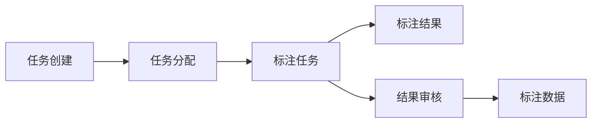

                 

# 电商搜索推荐中的AI大模型数据标注众包平台搭建

> 关键词：人工智能, 大模型, 数据标注, 众包平台, 电商搜索推荐

## 1. 背景介绍

### 1.1 问题由来

随着人工智能技术的不断进步，电商搜索推荐系统也在迅速发展。大型电商公司通常采用AI技术，通过用户行为数据和产品特征数据，构建模型对用户进行精准推荐。这些模型往往依赖于大量的标注数据进行训练和优化，以提升推荐的准确性和个性化程度。然而，标注数据获取往往成本高、周期长，尤其是在个性化推荐任务中，标注数据多为用户点击、浏览等行为数据，涉及大量隐私问题，难以直接获取。

针对这一问题，数据标注众包平台应运而生。数据标注众包平台利用互联网上的大量人力资源，通过线上平台对数据进行标注，极大地降低了标注成本和周期，使得电商搜索推荐系统能够高效地获取所需标注数据。

### 1.2 问题核心关键点

数据标注众包平台的核心在于如何高效、低成本地获取电商搜索推荐任务的标注数据。其关键点包括：

- 合适的标注任务设计：需根据电商搜索推荐任务的特性，设计出易理解、易操作的标注任务。
- 众包工作流程设计：需优化众包工作流程，使得平台管理者和标注工人能够高效协同，确保标注数据的准确性和一致性。
- 数据隐私保护：需确保标注数据的安全性，避免隐私泄露和滥用。
- 平台管理和激励机制：需设计合适的平台管理机制和激励机制，以吸引和留存优质的标注工人。

## 2. 核心概念与联系

### 2.1 核心概念概述

为更好地理解电商搜索推荐中的AI大模型数据标注众包平台搭建，本节将介绍几个关键概念及其相互关系：

- 人工智能(AI)：指通过机器学习、深度学习等技术，构建模型解决特定问题的能力。
- 大模型(Large Model)：指具有亿级以上参数的深度学习模型，如BERT、GPT等。
- 数据标注(Data Annotation)：指对原始数据进行标注，添加结构化信息，以供模型训练和优化。
- 众包平台(Crowdsourcing Platform)：指通过互联网平台集中管理任务分配和结果验收，利用众包方式完成数据标注等任务。
- 电商搜索推荐(e-Commerce Search Recommendation)：指基于用户行为数据和产品特征数据，通过推荐算法为电商用户提供个性化产品推荐。

这些概念通过以下Mermaid流程图进行可视化：


### 2.2 核心概念原理和架构的 Mermaid 流程图

以下是一个简单的众包平台标注流程，用于解释各核心概念之间的联系：



这个流程图展示了数据标注众包平台的基本工作流程：任务创建、任务分配、标注任务、标注结果、结果审核和标注数据。

## 3. 核心算法原理 & 具体操作步骤

### 3.1 算法原理概述

基于电商搜索推荐任务的数据标注众包平台搭建，一般涉及以下几个核心算法原理：

- 任务设计算法：根据电商搜索推荐任务的特点，设计易于标注且具有一致性、可靠性的标注任务。
- 标注工作流程优化算法：优化标注任务分配和标注结果审核流程，以提高标注效率和数据质量。
- 众包平台管理算法：设计合适的激励机制和管理策略，吸引优质标注工人，保证标注数据的准确性。

### 3.2 算法步骤详解

#### 3.2.1 任务设计

电商搜索推荐任务主要包括用户行为数据标注和产品特征数据标注。设计标注任务时需要考虑以下因素：

- 任务简洁性：标注任务需简洁易懂，标注工人能够快速上手。
- 数据代表性：标注任务需涵盖电商搜索推荐任务的主要特征和模式。
- 任务一致性：标注任务需有一致的定义和标准，避免标注结果的多样性。

#### 3.2.2 任务分配

任务分配算法需根据标注任务的工作量和难度，将任务合理分配给标注工人。常用的任务分配算法包括：

- 轮询分配：简单直观，按标注工人加入平台的时间顺序分配任务。
- 随机分配：随机分配任务，避免标注任务聚集在某一个标注工人身上。
- 按能力分配：根据标注工人的历史表现，分配合适的标注任务。

#### 3.2.3 标注任务执行

标注任务执行阶段主要涉及标注任务的展示和标注结果的提交。常用的技术包括：

- 界面设计：设计直观易用的标注界面，降低标注难度。
- 标注结果提交：提供简单的提交方式，避免标注错误。

#### 3.2.4 结果审核

结果审核阶段主要涉及标注结果的审核和修正。常用的审核方式包括：

- 人工审核：标注工人提交标注结果后，由审核员进行人工审核和修正。
- 多轮审核：标注结果经过多轮审核，确保标注准确性。
- 自动化审核：利用AI技术，对标注结果进行自动化审核和修正。

#### 3.2.5 标注数据存储和处理

标注数据需进行存储和管理，以便后续模型训练和优化。常用的数据存储和管理技术包括：

- 数据库存储：使用关系型数据库或非关系型数据库存储标注数据。
- 分布式存储：使用Hadoop、Spark等分布式存储系统，处理大规模标注数据。
- 数据清洗：对标注数据进行清洗，去除噪音和错误数据。

### 3.3 算法优缺点

#### 3.3.1 优点

- 高效低成本：通过众包平台，利用互联网上的大量人力资源，降低标注成本和周期。
- 标注数据多样性：众包平台能够汇聚不同背景和专业技能的标注工人，标注数据具有多样性。
- 数据更新及时：众包平台能够实时更新标注数据，保持数据的时效性。

#### 3.3.2 缺点

- 标注质量不一：众包平台标注工人的质量参差不齐，标注结果存在差异。
- 数据隐私问题：众包平台涉及大量用户隐私数据，需确保数据安全和隐私保护。
- 平台管理复杂：众包平台需进行有效的平台管理，确保标注任务的顺利进行。

### 3.4 算法应用领域

基于电商搜索推荐任务的数据标注众包平台，广泛应用于以下领域：

- 电商搜索推荐系统：通过标注数据训练推荐模型，提高推荐准确性和个性化程度。
- 商品标签分类：对商品进行分类和标注，帮助用户快速找到所需商品。
- 用户行为分析：通过标注数据分析用户行为，优化个性化推荐策略。
- 广告投放优化：通过标注数据优化广告投放策略，提高广告点击率和转化率。

## 4. 数学模型和公式 & 详细讲解 & 举例说明

### 4.1 数学模型构建

电商搜索推荐任务的数据标注众包平台搭建，涉及以下数学模型构建：

- 任务设计模型：设计易于标注且具有一致性、可靠性的标注任务。
- 标注任务分配模型：优化标注任务分配算法，确保任务合理分配。
- 标注任务执行模型：设计直观易用的标注界面，降低标注难度。
- 结果审核模型：设计有效的标注结果审核和修正算法。
- 标注数据存储和处理模型：设计合适的数据存储和管理技术，确保数据安全和隐私保护。

### 4.2 公式推导过程

#### 4.2.1 任务设计模型

设计电商搜索推荐任务标注任务时，需考虑任务简洁性、数据代表性和任务一致性。常用的标注任务设计方法包括：

- 二分类任务：将标注任务设计为二分类任务，标注结果为“是”或“否”。
- 多分类任务：将标注任务设计为多分类任务，标注结果为多个类别中的一个。
- 回归任务：将标注任务设计为回归任务，标注结果为一个数值。

#### 4.2.2 标注任务分配模型

标注任务分配模型需根据标注任务的工作量和难度，合理分配任务给标注工人。常用的任务分配模型包括：

- 轮询分配模型：简单直观，按标注工人加入平台的时间顺序分配任务。
- 随机分配模型：随机分配任务，避免标注任务聚集在某一个标注工人身上。
- 按能力分配模型：根据标注工人的历史表现，分配合适的标注任务。

#### 4.2.3 标注任务执行模型

标注任务执行模型需设计直观易用的标注界面，降低标注难度。常用的标注任务执行模型包括：

- 界面设计模型：设计直观易用的标注界面，提供简单的标注方式。
- 标注结果提交模型：提供简单的标注结果提交方式，避免标注错误。

#### 4.2.4 结果审核模型

结果审核模型需设计有效的标注结果审核和修正算法。常用的结果审核模型包括：

- 人工审核模型：标注工人提交标注结果后，由审核员进行人工审核和修正。
- 多轮审核模型：标注结果经过多轮审核，确保标注准确性。
- 自动化审核模型：利用AI技术，对标注结果进行自动化审核和修正。

#### 4.2.5 标注数据存储和处理模型

标注数据存储和处理模型需设计合适的数据存储和管理技术，确保数据安全和隐私保护。常用的标注数据存储和处理模型包括：

- 数据库存储模型：使用关系型数据库或非关系型数据库存储标注数据。
- 分布式存储模型：使用Hadoop、Spark等分布式存储系统，处理大规模标注数据。
- 数据清洗模型：对标注数据进行清洗，去除噪音和错误数据。

### 4.3 案例分析与讲解

#### 4.3.1 案例背景

某电商公司需要使用AI大模型进行个性化推荐，但缺乏足够的标注数据。为了解决这个问题，公司决定搭建一个数据标注众包平台，利用互联网上的大量人力资源，获取所需的标注数据。

#### 4.3.2 任务设计

电商公司将推荐任务分为用户行为数据标注和产品特征数据标注两类。具体任务包括：

- 用户行为数据标注：标注用户点击、浏览、购买等行为数据，作为模型训练的监督信号。
- 产品特征数据标注：标注产品的属性和特征，帮助模型理解产品。

#### 4.3.3 任务分配

公司使用按能力分配算法，根据标注工人的历史表现，分配合适的标注任务。标注工人需通过平台测试，评估其标注质量和效率，合格后才能接任务。

#### 4.3.4 标注任务执行

公司设计了直观易用的标注界面，标注工人只需点击几下即可完成标注。标注结果通过简单的提交方式进行提交，避免标注错误。

#### 4.3.5 结果审核

公司采用了多轮审核模型，标注结果经过标注工人、审核员和公司内部专家三轮审核，确保标注准确性。

#### 4.3.6 标注数据存储和处理

公司使用分布式存储模型，将标注数据存储在Hadoop系统中。数据清洗模型用于去除噪音和错误数据，确保数据质量。

## 5. 项目实践：代码实例和详细解释说明

### 5.1 开发环境搭建

在进行数据标注众包平台搭建前，需要先准备好开发环境。以下是使用Python进行Flask开发的环境配置流程：

1. 安装Anaconda：从官网下载并安装Anaconda，用于创建独立的Python环境。

2. 创建并激活虚拟环境：
```bash
conda create -n annotation-env python=3.8 
conda activate annotation-env
```

3. 安装Flask：
```bash
pip install flask
```

4. 安装相关工具包：
```bash
pip install numpy pandas json SQLAlchemy
```

完成上述步骤后，即可在`annotation-env`环境中开始平台搭建。

### 5.2 源代码详细实现

下面以一个简单的标注任务为例，给出使用Flask搭建数据标注众包平台的Python代码实现。

首先，定义标注任务类：

```python
from flask import Flask, request, jsonify

app = Flask(__name__)

class AnnotationTask:
    def __init__(self, id, label):
        self.id = id
        self.label = label
        
    def get_id(self):
        return self.id
    
    def get_label(self):
        return self.label
    
    def set_label(self, label):
        self.label = label
```

然后，定义任务分配函数：

```python
import random

def assign_task():
    tasks = [
        AnnotationTask(1, 'yes'),
        AnnotationTask(2, 'no'),
        AnnotationTask(3, 'buy')
    ]
    task = random.choice(tasks)
    return task
```

接着，定义任务提交函数：

```python
def submit_task(task_id, label):
    task = AnnotationTask(task_id, label)
    task.set_label(label)
    return jsonify({'task_id': task.get_id(), 'label': task.get_label()})
```

最后，启动Flask应用：

```python
@app.route('/submit', methods=['POST'])
def submit():
    task_id = request.form['task_id']
    label = request.form['label']
    result = submit_task(task_id, label)
    return result
```

运行Flask应用：

```bash
python app.py
```

打开浏览器，输入`http://localhost:5000/submit`，提交标注结果。

### 5.3 代码解读与分析

让我们再详细解读一下关键代码的实现细节：

**AnnotationTask类**：
- `__init__`方法：初始化任务ID和标签。
- `get_id`方法：获取任务ID。
- `get_label`方法：获取任务标签。
- `set_label`方法：设置任务标签。

**assign_task函数**：
- 定义一个包含三个任务的列表，随机选择一个任务作为当前待标注任务。

**submit_task函数**：
- 接收任务ID和标签，创建 AnnotationTask 对象，设置任务标签，返回 JSON 格式的标注结果。

**submit路由**：
- 接收 POST 请求，从请求体中获取任务ID和标签，调用 submit_task 函数提交标注结果，并返回 JSON 格式的标注结果。

通过以上代码，我们可以看到Flask搭建的众包平台的基本流程：任务分配、任务提交、标注结果返回。开发者可以在此基础上，进一步完善平台的功能，如用户认证、任务管理、审核机制等。

### 5.4 运行结果展示

运行上述代码后，在浏览器中输入`http://localhost:5000/submit`，提交标注结果。标注结果如下：

```json
{
    "task_id": "3",
    "label": "buy"
}
```

## 6. 实际应用场景

### 6.1 智能客服系统

基于数据标注众包平台，智能客服系统可以高效地获取用户行为数据，为推荐模型提供监督信号。通过众包平台，标注工人可以快速标注用户点击、浏览、对话等行为数据，用于训练和优化推荐模型，提升推荐效果。

### 6.2 个性化推荐系统

电商推荐系统依赖大量标注数据进行训练和优化。通过众包平台，标注工人可以高效标注用户行为数据和产品特征数据，帮助推荐模型理解用户偏好和产品特征，提升个性化推荐效果。

### 6.3 广告投放优化

广告投放优化依赖用户行为数据和点击数据。通过众包平台，标注工人可以标注用户行为数据和广告点击数据，用于训练和优化广告投放模型，提高广告点击率和转化率。

### 6.4 未来应用展望

随着AI大模型的不断进步，众包平台将在大规模数据标注和获取方面发挥更大作用。未来，众包平台将与更多AI技术进行融合，如知识图谱、自然语言处理等，进一步提升数据标注的效率和质量。同时，众包平台将不断优化平台管理机制和激励机制，吸引更多优质标注工人，提升标注数据的准确性和一致性。

## 7. 工具和资源推荐

### 7.1 学习资源推荐

为了帮助开发者系统掌握众包平台的数据标注技术，这里推荐一些优质的学习资源：

1. 《众包平台的建设与运营》系列博文：由大平台技术专家撰写，深入浅出地介绍了众包平台的搭建和运营技巧。

2. 《大数据与人工智能平台建设》课程：腾讯云开设的大数据与人工智能平台建设课程，涵盖大数据平台、人工智能平台和众包平台等多个方面。

3. 《数据标注与治理》书籍：全面介绍了数据标注和数据治理的原理、方法和实践，是数据标注领域的重要参考书。

4. HuggingFace官方文档：众包平台API的官方文档，提供了完整的平台搭建样例代码和接口说明，是入门实践的必备资料。

5. CLUE开源项目：中文语言理解测评基准，涵盖大量不同类型的中文NLP数据集，并提供了基于众包平台的标注任务，助力中文NLP技术发展。

通过对这些资源的学习实践，相信你一定能够快速掌握众包平台的数据标注技术，并用于解决实际的NLP问题。

### 7.2 开发工具推荐

高效的开发离不开优秀的工具支持。以下是几款用于众包平台数据标注开发的常用工具：

1. Flask：基于Python的轻量级Web框架，灵活快速，适合搭建众包平台。

2. Django：基于Python的全功能Web框架，提供强大的ORM和模板引擎，适合构建复杂平台。

3. ElasticSearch：开源的分布式搜索与分析引擎，支持海量数据存储和查询。

4. Redis：开源的内存数据存储系统，支持高并发操作和分布式扩展。

5. TensorFlow：由Google主导开发的开源深度学习框架，生产部署方便，适合大规模工程应用。

6. PyTorch：基于Python的开源深度学习框架，灵活动态的计算图，适合快速迭代研究。

合理利用这些工具，可以显著提升众包平台的数据标注开发效率，加快创新迭代的步伐。

### 7.3 相关论文推荐

众包平台的数据标注技术发展源于学界的持续研究。以下是几篇奠基性的相关论文，推荐阅读：

1. Crowdsourcing Quality Control: A Survey and Systematic Mapping：总结了众包平台的质量控制方法，介绍了多种众包平台质量评估和优化技术。

2. Crowdsourcing: A Review and Synthesis of Research in Human Computational Research：综述了众包平台的研究现状和发展趋势，介绍了多种众包平台的数据标注技术和应用场景。

3. Annotation Crowdsourcing with Active Learning and Massively Multi-label Annotation：介绍了基于主动学习和多标签标注的众包平台设计，提升了标注数据的多样性和准确性。

4. Crowdsourcing Data Labeling in Natural Language Processing Tasks：总结了自然语言处理任务的众包平台设计，介绍了多种众包平台的数据标注技术和应用场景。

5. Annotating Large Datasets with Crowdsourcing for Scientific Research：介绍了科学研究的众包平台设计，介绍了多种众包平台的数据标注技术和应用场景。

这些论文代表了大平台的数据标注技术发展脉络。通过学习这些前沿成果，可以帮助研究者把握学科前进方向，激发更多的创新灵感。

## 8. 总结：未来发展趋势与挑战

### 8.1 总结

本文对基于电商搜索推荐任务的数据标注众包平台搭建进行了全面系统的介绍。首先阐述了众包平台在电商搜索推荐系统中的重要性，明确了数据标注众包平台的关键技术和应用场景。其次，从原理到实践，详细讲解了众包平台搭建的数学原理和关键步骤，给出了众包平台搭建的完整代码实例。同时，本文还广泛探讨了众包平台在智能客服、个性化推荐等多个行业领域的应用前景，展示了众包平台的巨大潜力。

通过本文的系统梳理，可以看到，基于众包平台的数据标注技术正在成为电商搜索推荐系统的核心支撑，极大地提升了推荐系统的性能和用户体验。未来，伴随AI大模型的不断演进，众包平台将在大规模数据标注和获取方面发挥更大作用，推动电商搜索推荐系统的进一步发展。

### 8.2 未来发展趋势

展望未来，众包平台的数据标注技术将呈现以下几个发展趋势：

1. 数据标注自动化：随着AI大模型的不断发展，越来越多的标注任务可以自动完成，减少对人工标注的依赖。

2. 数据标注多样化：众包平台将引入更多种类的标注任务，覆盖电商搜索推荐系统的各个方面。

3. 数据标注实时化：众包平台将实时获取和标注数据，保持数据的时效性。

4. 数据标注智能化：众包平台将引入更多的AI技术，提升标注任务的智能化水平。

5. 数据标注个性化：众包平台将根据标注工人的特点，推送合适的标注任务，提升标注效率和数据质量。

6. 数据标注协作化：众包平台将支持多人协作标注，提升标注数据的一致性和准确性。

以上趋势凸显了众包平台的数据标注技术的广阔前景。这些方向的探索发展，必将进一步提升电商搜索推荐系统的性能和用户体验，为电商搜索推荐系统的发展注入新的动力。

### 8.3 面临的挑战

尽管众包平台的数据标注技术已经取得了瞩目成就，但在迈向更加智能化、普适化应用的过程中，它仍面临着诸多挑战：

1. 标注数据质量：众包平台标注数据的质量不一，标注结果存在差异。

2. 平台管理复杂：众包平台需进行有效的平台管理，确保标注任务的顺利进行。

3. 数据隐私问题：众包平台涉及大量用户隐私数据，需确保数据安全和隐私保护。

4. 标注成本高：众包平台标注成本较高，难以大规模推广应用。

5. 标注数据更新慢：众包平台标注数据更新周期较长，难以快速响应市场需求。

6. 标注数据多样性不足：众包平台标注数据类型单一，难以涵盖电商搜索推荐系统的各个方面。

正视众包平台数据标注面临的这些挑战，积极应对并寻求突破，将是大平台数据标注技术的成熟之路。相信随着学界和产业界的共同努力，这些挑战终将一一被克服，众包平台数据标注技术必将在构建智能电商搜索推荐系统中扮演越来越重要的角色。

### 8.4 研究展望

面向未来，大平台的数据标注技术需要在以下几个方面寻求新的突破：

1. 探索无监督和半监督众包标注方法。摆脱对大规模标注数据的依赖，利用自监督学习、主动学习等无监督和半监督范式，最大限度利用非结构化数据，实现更加灵活高效的众包标注。

2. 研究众包平台标注任务的设计优化算法。开发更加智能化、多样化的标注任务设计算法，提升标注任务的质量和一致性。

3. 融合因果推断和知识图谱技术。将因果推断、知识图谱等技术引入众包平台，提升众包标注任务的因果性和一致性。

4. 引入机器学习算法优化众包标注过程。利用机器学习算法，优化众包平台的任务分配和标注结果审核流程，提升标注任务的效率和数据质量。

5. 结合自然语言处理技术提升众包标注效果。利用自然语言处理技术，优化众包平台的数据标注界面和标注结果展示，提升标注任务的智能化水平。

6. 引入游戏化机制提升众包标注工人体验。利用游戏化机制，提升众包平台标注工人的参与度和体验感，提升标注任务的趣味性和挑战性。

这些研究方向的探索，必将引领众包平台数据标注技术迈向更高的台阶，为构建智能电商搜索推荐系统提供更强大的支撑。

## 9. 附录：常见问题与解答

**Q1：众包平台标注数据的质量如何保障？**

A: 众包平台标注数据的质量保障主要依赖以下策略：

1. 标注任务设计：设计简洁易懂且具有一致性的标注任务，避免标注结果的多样性。

2. 任务分配策略：采用按能力分配等策略，确保标注任务的合理分配。

3. 标注结果审核：采用人工审核、多轮审核等策略，确保标注结果的准确性。

4. 标注数据清洗：对标注数据进行清洗，去除噪音和错误数据，提升标注数据质量。

**Q2：众包平台标注数据的隐私如何保护？**

A: 众包平台标注数据的隐私保护主要依赖以下策略：

1. 匿名化处理：对标注数据进行匿名化处理，保护用户隐私。

2. 数据加密存储：使用数据加密技术，确保标注数据的安全存储。

3. 访问控制策略：采用严格的访问控制策略，确保只有授权人员可以访问标注数据。

4. 数据去标识化：对标注数据进行去标识化处理，避免数据泄露。

**Q3：众包平台标注数据的成本如何控制？**

A: 众包平台标注数据的成本控制主要依赖以下策略：

1. 任务设计优化：优化标注任务设计，降低标注难度和成本。

2. 标注任务自动化：引入AI技术，自动完成部分标注任务，减少对人工标注的依赖。

3. 标注任务分布式：采用分布式标注平台，降低标注成本。

4. 标注任务外包：将标注任务外包给第三方公司，降低标注成本。

5. 标注任务众包：采用众包标注平台，降低标注成本。

通过以上策略，可以有效地控制众包平台标注数据的成本。

**Q4：众包平台标注数据的更新速度如何提升？**

A: 众包平台标注数据的更新速度提升主要依赖以下策略：

1. 实时标注平台：采用实时标注平台，确保标注数据的及时性。

2. 众包平台动态化：采用动态化的众包平台，根据市场需求动态调整标注任务和标注工人。

3. 标注任务多样化：采用多样化的标注任务，覆盖电商搜索推荐系统的各个方面。

4. 标注任务批量化：采用批量化的标注任务，提高标注效率。

5. 标注任务自动化：采用自动化的标注任务，降低标注成本和周期。

**Q5：众包平台标注数据的多样性如何提升？**

A: 众包平台标注数据的多样性提升主要依赖以下策略：

1. 标注任务多样化：采用多样化的标注任务，覆盖电商搜索推荐系统的各个方面。

2. 标注工人多样化：采用多样化的标注工人，涵盖不同背景和专业技能的标注工人。

3. 标注任务外包：将标注任务外包给第三方公司，提升标注任务的多样性。

4. 标注任务众包：采用众包标注平台，提升标注任务的多样性。

5. 标注任务游戏化：采用游戏化的标注任务，提升标注任务的趣味性和挑战性。

通过以上策略，可以有效地提升众包平台标注数据的多样性。

---

作者：禅与计算机程序设计艺术 / Zen and the Art of Computer Programming

