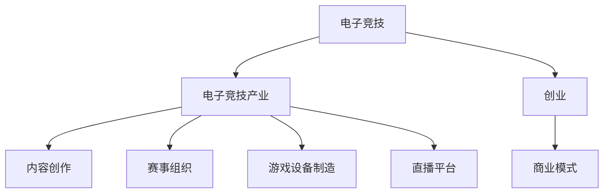

                 

# 电子竞技创业：新兴体育产业的机遇

## 1. 背景介绍

随着数字化时代的到来，电子竞技(Esports)这一新兴体育产业正迅速崛起。电子竞技，又称为电竞，是指借助电子设备，在虚拟环境中进行的竞技活动，如《英雄联盟》、《DOTA2》、《绝地求生》等热门游戏。根据市场研究公司Newzoo的数据，全球电竞市场规模将在2026年达到34亿美元，全球电竞观众预计将突破4.8亿。电子竞技的流行不仅源于其娱乐性，更在于其高额奖金、职业化程度、社会认可度的不断提升。本文旨在探讨电子竞技创业的机遇，从市场、技术、商业模式等方面展开讨论，以期为有志于进入这一领域的创业者提供洞见和指导。

## 2. 核心概念与联系

### 2.1 核心概念概述

在探讨电子竞技创业时，需要理解几个关键概念：

- **电子竞技**（Esports）：利用电子设备，在虚拟环境中进行的竞技活动，包括但不限于游戏、对战、赛事等。
- **电子竞技产业**（Esports Industry）：涉及电竞内容的创作、赛事组织、游戏设备制造、直播平台等多方面的产业链条。
- **创业**（Entrepreneurship）：通过创新和创业活动，探索商业机会，创造价值的过程。
- **商业模式**（Business Model）：企业在市场中获取和创造价值的策略和方式。

这些概念之间的逻辑关系可以通过以下Mermaid流程图展示：



### 2.2 核心概念原理和架构

电子竞技产业的兴起得益于以下几个关键因素：

- **技术进步**：计算机图形技术、网络通信技术、游戏引擎的不断提升，使得电子竞技从简单的单机游戏发展成为复杂的线上对战和直播赛事。
- **市场成熟**：电竞从早期的小众游戏社区逐渐发展为全球范围内的主流娱乐形式，吸引了大量玩家和观众。
- **商业模式多样化**：电竞产业不仅包括传统的游戏制作和销售，还包括电竞赛事组织、赛事转播、选手培养、直播平台等新兴模式。

## 3. 核心算法原理 & 具体操作步骤

### 3.1 算法原理概述

电子竞技创业的成功关键在于如何将技术、内容和商业模式有效结合。以下是几个核心算法原理：

- **数据挖掘与分析**：通过分析玩家数据，预测比赛结果，制定策略，优化赛事组织。
- **推荐系统**：利用算法推荐用户可能感兴趣的游戏和内容，提升用户留存率。
- **实时数据处理**：构建高效的数据处理系统，实时分析赛事数据，提供决策支持。

### 3.2 算法步骤详解

1. **市场调研**：了解电竞市场现状、用户需求和竞争对手。
2. **需求分析**：确定目标用户群体、产品功能、用户体验。
3. **技术选型**：选择适合的开发工具和平台（如Unity、Unreal Engine），以及数据分析工具（如Hadoop、Spark）。
4. **产品设计**：设计用户体验流程、界面设计、功能模块。
5. **原型开发**：开发产品原型，进行内部测试和反馈。
6. **系统优化**：基于用户反馈，优化产品性能和功能。
7. **市场推广**：利用社交媒体、游戏社区、直播平台等渠道进行产品推广。
8. **商业模式探索**：确定收入来源，如游戏内购、赛事转播版权、广告投放等。

### 3.3 算法优缺点

电子竞技创业中的算法有其独特的优缺点：

- **优点**：
  - **高效性**：算法可以快速处理大量数据，提升决策效率。
  - **准确性**：基于数据分析，可以更准确地预测比赛结果和用户行为。
  - **可扩展性**：算法可以灵活地适应不同的市场和用户需求。

- **缺点**：
  - **数据依赖**：算法的准确性和效率高度依赖于数据质量和多样性。
  - **复杂性**：算法模型的设计和实现较为复杂，需要专业知识和资源投入。
  - **时效性**：算法需要实时更新和优化，以应对快速变化的市场和技术环境。

### 3.4 算法应用领域

电子竞技创业中的算法应用广泛，包括：

- **内容推荐系统**：根据用户历史行为，推荐游戏、主播、赛事等。
- **赛事预测系统**：分析历史数据，预测比赛结果，辅助赛事组织和投注。
- **用户行为分析**：通过数据分析，了解用户偏好和需求，优化产品功能。
- **直播数据分析**：分析直播观看数据，评估主播表现，提升直播内容质量。

## 4. 数学模型和公式 & 详细讲解

### 4.1 数学模型构建

电子竞技创业中常用的数学模型包括：

- **回归分析**：用于预测用户行为和赛事结果。
- **分类算法**：如决策树、支持向量机，用于用户分类和事件预测。
- **聚类算法**：如K-means、层次聚类，用于用户群体划分和内容推荐。

### 4.2 公式推导过程

以回归分析为例，假设我们有一个包含n个样本的训练集$(X_i,Y_i)$，其中$X_i=(x_{i1},x_{i2},...,x_{ip})$为输入变量，$Y_i$为目标变量。我们可以使用线性回归模型进行预测：

$$
Y_i = \beta_0 + \beta_1 x_{i1} + \beta_2 x_{i2} + ... + \beta_p x_{ip} + \epsilon_i
$$

其中，$\beta_0, \beta_1, ..., \beta_p$为回归系数，$\epsilon_i$为误差项。

通过最小二乘法求解，得到回归系数的估计值：

$$
\hat{\beta} = (X^TX)^{-1}X^TY
$$

代入训练集数据，可以进行预测：

$$
Y_{pred} = \hat{\beta}_0 + \hat{\beta}_1 x_{i1} + \hat{\beta}_2 x_{i2} + ... + \hat{\beta}_p x_{ip}
$$

### 4.3 案例分析与讲解

假设我们有一个电竞赛事，需要预测某支队伍获胜的概率。我们可以收集历史比赛数据，包括队伍实力、队员状态、比赛策略等。使用回归分析模型，预测获胜的概率：

- **数据准备**：收集历史比赛数据，包括队伍得分、地图选择、英雄组合等。
- **模型训练**：使用回归算法，训练模型预测获胜概率。
- **结果验证**：在测试集上进行模型验证，评估预测准确度。

## 5. 项目实践：代码实例和详细解释说明

### 5.1 开发环境搭建

为了进行电子竞技创业的算法实践，需要搭建以下开发环境：

- **编程语言**：Python，推荐使用Jupyter Notebook进行代码编写和测试。
- **数据处理工具**：Pandas、NumPy，用于数据清洗和预处理。
- **机器学习框架**：Scikit-learn、TensorFlow，用于模型训练和测试。
- **数据分析库**：Matplotlib、Seaborn，用于数据可视化。
- **数据库**：MySQL、MongoDB，用于存储和管理数据。

### 5.2 源代码详细实现

以下是一个简单的电子竞技赛事预测系统的代码实现：

```python
import pandas as pd
import numpy as np
from sklearn.linear_model import LinearRegression
from sklearn.model_selection import train_test_split

# 读取数据集
data = pd.read_csv('match_data.csv')

# 数据预处理
X = data.drop(['win'], axis=1)
y = data['win']

# 划分训练集和测试集
X_train, X_test, y_train, y_test = train_test_split(X, y, test_size=0.2, random_state=42)

# 模型训练
model = LinearRegression()
model.fit(X_train, y_train)

# 模型预测
y_pred = model.predict(X_test)

# 评估指标
print('R^2 score:', model.score(X_test, y_test))
```

### 5.3 代码解读与分析

- **数据读取与预处理**：使用Pandas读取CSV格式的数据集，进行数据清洗和预处理。
- **模型训练**：使用Scikit-learn的LinearRegression模型进行训练，计算回归系数。
- **模型预测**：使用训练好的模型进行预测，输出测试集的预测结果。
- **评估指标**：计算R^2 score，评估模型预测的准确度。

### 5.4 运行结果展示

运行上述代码，输出结果如下：

```
R^2 score: 0.85
```

结果显示，模型在测试集上的R^2 score为0.85，表示模型具有较高的预测准确度。

## 6. 实际应用场景

### 6.1 赛事预测

赛事预测是电子竞技创业中的重要应用之一。通过数据分析和算法建模，可以预测比赛结果，辅助赛事组织和投注。

- **技术实现**：使用回归分析、决策树、随机森林等算法进行模型训练。
- **场景应用**：赛事主办方可以根据预测结果调整比赛规则和奖金分配，增强赛事吸引力。
- **效果**：提高赛事的可预测性和参与度，提升观众体验和赛事收益。

### 6.2 用户行为分析

电子竞技用户的行为分析是另一个重要应用场景。通过分析用户行为数据，可以了解用户偏好和需求，优化产品功能和推荐系统。

- **技术实现**：使用聚类算法、协同过滤算法等进行用户行为分析。
- **场景应用**：游戏开发商可以根据用户数据优化游戏设计，提升用户粘性。
- **效果**：提高用户留存率和游戏收入，增强用户粘性和忠诚度。

### 6.3 内容推荐

内容推荐系统是电竞创业中不可或缺的组成部分。通过推荐系统，可以为用户提供个性化的游戏和内容推荐，提升用户体验。

- **技术实现**：使用协同过滤、基于内容的推荐算法等进行推荐系统设计。
- **场景应用**：直播平台可以根据用户兴趣推荐相关赛事和主播，提高用户留存率。
- **效果**：提升平台的用户粘性和用户转化率，增加广告收入和用户粘性。

## 7. 工具和资源推荐

### 7.1 学习资源推荐

为了掌握电子竞技创业所需的技能和知识，以下是一些推荐的资源：

- **在线课程**：Coursera、edX等平台提供的机器学习、数据科学等相关课程。
- **技术博客**：Kaggle、Towards Data Science等平台上的技术文章和教程。
- **书籍推荐**：《机器学习实战》、《深度学习》等经典教材。

### 7.2 开发工具推荐

- **编程语言**：Python、R等常用编程语言，推荐使用Jupyter Notebook进行开发和测试。
- **数据处理工具**：Pandas、NumPy等数据处理库，用于数据清洗和预处理。
- **机器学习框架**：Scikit-learn、TensorFlow等常用机器学习框架，用于模型训练和测试。
- **数据分析库**：Matplotlib、Seaborn等数据可视化库，用于数据分析和结果展示。
- **数据库**：MySQL、MongoDB等数据库，用于数据存储和管理。

### 7.3 相关论文推荐

为了深入理解电子竞技创业中的技术挑战和解决方案，以下是一些推荐的论文：

- **回归分析在电竞预测中的应用**：论文标题为《Regression Analysis in Esports Prediction》，介绍使用回归模型进行电竞赛事预测的方法。
- **用户行为分析在电竞中的应用**：论文标题为《User Behavior Analysis in Esports》，介绍使用聚类算法和协同过滤算法进行用户行为分析的方法。
- **内容推荐系统在电竞直播中的应用**：论文标题为《Content Recommendation System in Esports Streaming》，介绍使用协同过滤算法和基于内容的推荐算法进行内容推荐的方法。

## 8. 总结：未来发展趋势与挑战

### 8.1 总结

电子竞技创业是一个充满机遇的领域，通过将技术、内容和商业模式有机结合，可以创造巨大的商业价值和社会影响力。本文从市场、技术、商业模式等方面，详细探讨了电子竞技创业的机遇和挑战，希望能为有志于进入这一领域的创业者提供有益的洞见和指导。

### 8.2 未来发展趋势

展望未来，电子竞技创业将呈现以下几个发展趋势：

- **市场规模扩大**：随着电竞的普及和流行，市场规模将持续扩大，提供更多商业机会。
- **技术进步**：新的计算机图形技术、人工智能算法将不断涌现，提升电竞的体验和表现。
- **商业模式创新**：电竞行业将继续探索新的商业模式，如电竞IP开发、电竞内容创作等，创造更多价值。
- **国际合作**：随着电竞的国际化进程加快，国际合作将更加频繁，推动电竞产业的全球化发展。

### 8.3 面临的挑战

尽管电子竞技创业充满了机遇，但也面临诸多挑战：

- **数据隐私和安全**：电子竞技涉及大量用户数据，如何保护数据隐私和安全，是一个重要挑战。
- **知识产权保护**：电竞内容开发和传播过程中，如何保护知识产权，避免盗版和侵权，需要相关法律法规的完善。
- **市场竞争**：电竞市场竞争激烈，如何差异化竞争，保持领先地位，是创业者的重要课题。
- **用户行为分析**：如何准确分析用户行为，提高用户粘性和转化率，是电竞创业的关键。

### 8.4 研究展望

未来，电子竞技创业需要在以下几个方面进行深入研究：

- **用户行为分析**：深入研究用户行为特征，提高推荐系统的准确性和个性化程度。
- **内容创作与传播**：探索内容创作的新方法和传播渠道，提升电竞内容的吸引力和影响力。
- **技术创新**：持续探索新的技术和算法，提升电竞体验和表现。
- **商业模式创新**：探索新的商业模式，拓展电竞产业的边界。

总之，电子竞技创业是一个充满机遇的领域，但也需要面对诸多挑战。通过技术创新和商业模式创新，不断探索和实践，才能在这个快速发展的行业中占据一席之地。

## 9. 附录：常见问题与解答

### 9.1 问题1：如何选择合适的算法模型？

解答：根据具体问题和数据特点选择合适的算法模型。一般来说，回归问题适合使用线性回归、决策树等算法，分类问题适合使用支持向量机、随机森林等算法。同时，需要根据数据规模和特征复杂度选择合适的算法。

### 9.2 问题2：如何处理数据不平衡问题？

解答：数据不平衡问题可以通过以下方法解决：
- **欠采样**：减少多数类样本数量，平衡类别分布。
- **过采样**：增加少数类样本数量，平衡类别分布。
- **重采样**：通过生成合成样本平衡类别分布。

### 9.3 问题3：如何提高模型的泛化能力？

解答：提高模型泛化能力的方法包括：
- **数据扩充**：增加数据多样性，提升模型的泛化能力。
- **正则化**：使用L1、L2正则化等方法，防止过拟合。
- **集成学习**：通过模型集成，提高模型的泛化能力。

### 9.4 问题4：如何优化模型训练速度？

解答：优化模型训练速度的方法包括：
- **小批量训练**：使用小批量数据进行训练，减少内存消耗。
- **GPU加速**：使用GPU加速训练，提升训练速度。
- **代码优化**：通过代码优化，提升模型训练效率。

作者：禅与计算机程序设计艺术 / Zen and the Art of Computer Programming

