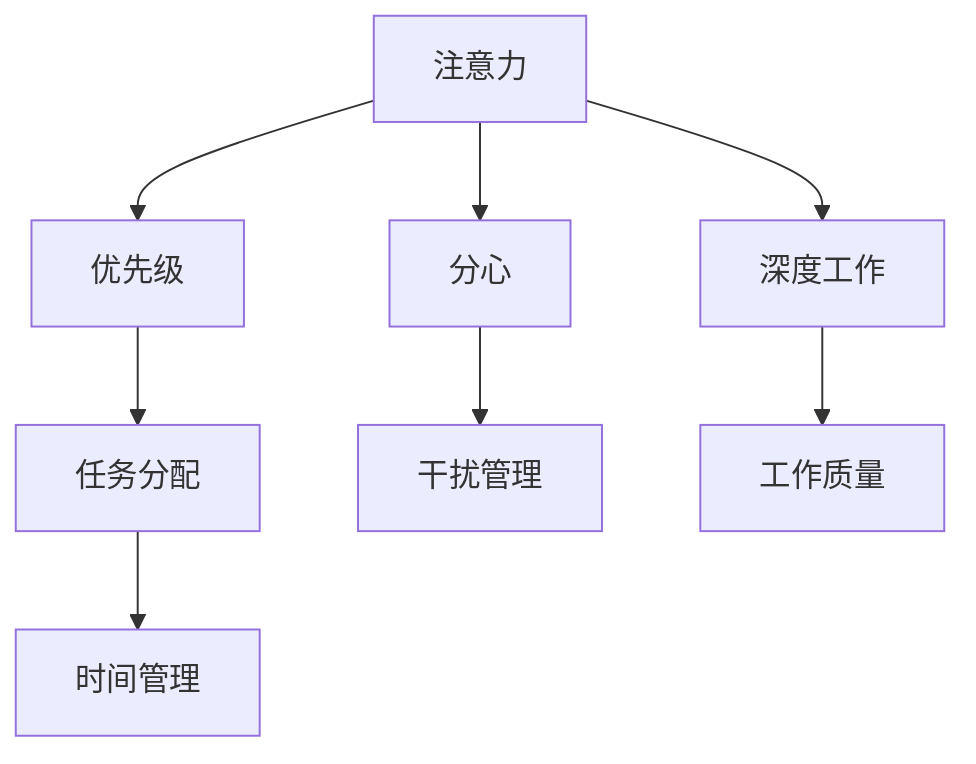

                 

# 目标聚焦：管理者的注意力管理

在当今复杂多变、竞争激烈的企业环境中，管理者如何有效管理自己的注意力成为决定团队成败的关键因素。有效管理注意力不仅可以提升决策质量、优化资源配置，还能更好地应对突发事件、把握机遇。本文将从核心概念、算法原理、操作步骤等多个角度，全面探讨管理者的注意力管理，并结合实际应用场景，提出切实可行的建议和策略。

## 1. 背景介绍

### 1.1 问题由来
随着企业规模的扩大和业务复杂度的增加，管理者需要面对的信息量呈指数级增长。从日常运营到重大决策，从内部沟通到外部协作，管理者每天需要处理大量信息，注意力分散不可避免。此外，信息爆炸带来的噪音和干扰，也使得管理者难以集中精力进行深度思考。这些问题逐渐成为企业运营中的重大瓶颈。

### 1.2 问题核心关键点
管理者注意力管理的核心在于如何识别和优先处理关键任务，避免被琐碎信息所干扰，从而提高工作效率和决策质量。具体而言，需要解决以下问题：
1. 如何分配注意力：在各种任务间如何平衡时间、精力，确保关键事项得到优先处理。
2. 如何提高效率：在处理任务时如何利用各种工具、方法，提升工作效率，减少时间浪费。
3. 如何保持专注：在处理复杂问题时如何避免分心，保持深度工作状态。
4. 如何应对突发：在应对突发事件时如何快速切换注意力，处理紧急任务。

### 1.3 问题研究意义
有效的注意力管理不仅能够提升管理者个人的效率和决策水平，还能增强团队的凝聚力和战斗力。具体而言：
1. 提高工作效率：管理者能够更高效地处理事务，减少重复劳动和无效时间。
2. 优化资源配置：通过合理分配注意力，确保资源投入到最关键的事项上，提升资源利用率。
3. 增强决策质量：管理者能够更全面、深入地分析问题，避免因注意力分散导致的误判和错失机遇。
4. 提升团队协作：通过明确任务优先级，引导团队成员协同工作，增强团队凝聚力和执行力。

## 2. 核心概念与联系

### 2.1 核心概念概述

为更好地理解管理者注意力管理，本节将介绍几个关键概念：

- **注意力(Attention)**：指人对信息、任务的关注度和聚焦程度。在复杂信息环境中，有效管理注意力是提升工作效率和决策质量的基础。
- **优先级(Priority)**：指任务或事项的重要性程度，用于指导注意力分配。根据任务的重要性和紧急程度，确定优先级排序。
- **分心(Distract)**：指注意力被外界因素（如噪音、干扰）分散或转移，影响工作效率和决策质量。
- **深度工作(Deep Work)**：指在无干扰、专注的状态下，对复杂问题进行深入思考和创造性工作的过程。深度工作能够显著提升工作质量，产生更多创新成果。
- **时间管理(Time Management)**：指通过有效规划和分配时间，确保各项任务按时完成，避免时间浪费。

这些概念之间的逻辑关系可以通过以下Mermaid流程图来展示：



这个流程图展示了几大关键概念之间的相互关系：

1. 注意力通过优先级进行分配，指导管理者选择和处理关键任务。
2. 分心影响注意力，需要通过干扰管理措施予以缓解。
3. 深度工作提升工作质量，是管理者必须保持的专注状态。
4. 时间管理确保任务按时完成，是管理者效率提升的重要手段。

## 3. 核心算法原理 & 具体操作步骤
### 3.1 算法原理概述

管理者注意力管理本质上是一个系统化、目标导向的过程。其核心思想是通过科学的工具和方法，合理规划和管理时间、注意力、任务，确保关键事项得到优先处理，提升工作效率和决策质量。

管理者注意力管理通常包括四个关键步骤：

1. **识别关键任务**：通过任务优先级排序，识别出最重要的任务。
2. **分配注意力**：在各项任务间合理分配注意力，确保重点任务得到优先处理。
3. **管理干扰**：通过有效措施减少分心，保持专注状态。
4. **评估与调整**：定期评估注意力管理的效果，根据实际情况调整策略。

这些步骤共同构成了管理者注意力管理的完整框架，帮助管理者在复杂环境中高效处理任务，提升工作效率和决策质量。

### 3.2 算法步骤详解

#### 3.2.1 识别关键任务

**Step 1: 建立任务清单**

管理者首先需要建立一个任务清单，涵盖所有需要处理的任务和事项。任务清单应包括任务的简要描述、完成时间、重要性等关键信息。

**Step 2: 确定优先级**

采用四象限法则（重要紧急矩阵），将任务分为四类：
1. 重要且紧急（立即处理）
2. 重要但不紧急（规划时间处理）
3. 紧急但不重要（委派他人处理）
4. 不重要且不紧急（可考虑放弃）

**Step 3: 优化任务清单**

根据任务的优先级和紧急程度，对任务清单进行优化排序，确保关键任务位于清单顶部。

#### 3.2.2 分配注意力

**Step 1: 制定时间表**

根据任务清单和优先级，制定每日或每周的时间表，明确每个任务的处理时间和预期完成时间。

**Step 2: 设定工作时间块**

采用番茄工作法，将工作时间划分为25分钟的工作块和5分钟的休息时间。每个工作块专注于一个具体任务，确保高效完成。

**Step 3: 执行时间表**

严格按照时间表执行任务，避免随意调整，确保时间利用效率。

#### 3.2.3 管理干扰

**Step 1: 识别干扰源**

管理者需要识别出主要的干扰源，如噪音、手机通知、同事打扰等，并采取相应的管理措施。

**Step 2: 设立专注时间**

设立专注时间段，尽量避免被外界干扰。可使用“请勿打扰”模式，减少中断。

**Step 3: 设定工作环境**

优化工作环境，减少外界干扰。如关闭不必要的通知、使用噪音消除设备等。

#### 3.2.4 评估与调整

**Step 1: 定期回顾**

每周或每月定期回顾任务清单和时间表，评估注意力管理的效果。

**Step 2: 调整策略**

根据回顾结果，调整任务优先级和时间安排，确保资源投入最为关键的任务。

**Step 3: 持续改进**

不断总结经验，优化注意力管理策略，提升工作效率和决策质量。

### 3.3 算法优缺点

管理者注意力管理具有以下优点：
1. 提升工作效率：通过优先级排序和任务时间表，确保关键任务得到及时处理，减少时间浪费。
2. 优化资源配置：合理分配注意力，确保资源投入到最重要的事情上。
3. 增强决策质量：通过深度工作和无干扰状态，能够深入分析问题，避免因注意力分散导致的误判。
4. 增强团队协作：通过明确任务优先级，引导团队成员协同工作，增强团队凝聚力。

同时，该方法也存在一定的局限性：
1. 依赖主观判断：任务优先级排序和注意力分配需要依赖管理者的主观判断，可能导致误判。
2. 可能过度压迫：过于严格的计划和安排，可能导致管理者感到过度压力和疲劳。
3. 忽视应急情况：过度依赖时间表和计划，可能无法快速响应突发事件。

尽管存在这些局限性，但就目前而言，基于任务优先级和时间的注意力管理方法仍是大规模、复杂环境下管理者高效工作的有效范式。

### 3.4 算法应用领域

管理者注意力管理在企业管理、项目管理、团队协作等多个领域都有广泛的应用，具体包括：

- **企业管理**：提升CEO、高层管理者的决策效率，优化资源配置。
- **项目管理**：帮助项目经理规划任务优先级和时间安排，确保项目按时完成。
- **团队协作**：通过明确任务优先级，引导团队成员协同工作，增强团队凝聚力。
- **个人发展**：帮助员工识别和管理自己的关键任务，提升工作效率和职业发展。

除了这些主要应用外，管理者注意力管理还应用于各类企业运营、财务管理、市场分析等场景中，为企业管理者提供全面的工具和方法支持。

## 4. 数学模型和公式 & 详细讲解 & 举例说明
### 4.1 数学模型构建

本节将使用数学语言对管理者注意力管理过程进行更加严格的刻画。

设管理者每天的工作时间为 $T$，需要处理的任务总数为 $N$。记每个任务的重要性为 $w_i$，紧急程度为 $u_i$，完成任务所需时间为 $t_i$。任务优先级排序后的顺序为 $P=(1,2,...,N)$。

定义管理者的注意力集中度为 $\alpha$，注意力分配函数为 $f(P)$，时间表分配函数为 $g(T,P)$，干扰管理函数为 $h(\alpha)$，注意力管理效果评估函数为 $e(P,T,\alpha)$。则注意力管理的目标为最大化管理效果：

$$
\max_{P} \quad e(P,T,\alpha)
$$

约束条件包括：
- 总时间约束：$g(T,P) \leq T$
- 任务优先级约束：$P \in \{1,2,...,N\}$
- 注意力集中度约束：$\alpha \in [0,1]$

### 4.2 公式推导过程

为了简化问题，我们假设每个任务的重要性 $w_i$ 和紧急程度 $u_i$ 均匀分布在区间 $[0,1]$ 内，且完成任务所需时间 $t_i$ 也为均匀分布。

任务优先级排序后的任务集为 $P$，则任务优先级权重为 $\bar{w}=\frac{1}{N}\sum_{i=1}^N w_i$。注意力分配函数 $f(P)$ 可定义为：

$$
f(P) = \frac{1}{N} \sum_{i=1}^N w_i \times u_i
$$

时间表分配函数 $g(T,P)$ 为：

$$
g(T,P) = \sum_{i=1}^N t_i \times u_i
$$

干扰管理函数 $h(\alpha)$ 为：

$$
h(\alpha) = \int_0^1 \alpha(t)dt
$$

注意力管理效果评估函数 $e(P,T,\alpha)$ 为：

$$
e(P,T,\alpha) = f(P) \times (1-h(\alpha)) + g(T,P) \times h(\alpha)
$$

目标函数最大化问题为：

$$
\max_{P} \quad f(P) \times (1-h(\alpha)) + g(T,P) \times h(\alpha)
$$

约束条件包括：

1. 总时间约束：$g(T,P) \leq T$
2. 任务优先级约束：$P \in \{1,2,...,N\}$
3. 注意力集中度约束：$\alpha \in [0,1]$

### 4.3 案例分析与讲解

假设管理者每天工作时间为 $T=8$ 小时，需要处理的任务总数为 $N=10$。任务的优先级排序后重要性权重为 $\bar{w}=0.5$，紧急程度权重为 $\bar{u}=0.6$，完成任务所需时间 $t_i$ 服从均匀分布 $U(1,3)$。

任务分配函数 $f(P)$ 为：

$$
f(P) = \frac{1}{10} \sum_{i=1}^N w_i \times u_i = \frac{1}{10} \sum_{i=1}^N 0.5 \times 0.6 = 0.18
$$

时间表分配函数 $g(T,P)$ 为：

$$
g(T,P) = \sum_{i=1}^N t_i \times u_i = \sum_{i=1}^N \int_0^3 \alpha(t)dt = 18.6
$$

干扰管理函数 $h(\alpha)$ 为：

$$
h(\alpha) = \int_0^1 \alpha(t)dt
$$

注意力管理效果评估函数 $e(P,T,\alpha)$ 为：

$$
e(P,T,\alpha) = 0.18 \times (1-h(\alpha)) + 18.6 \times h(\alpha)
$$

目标函数最大化问题为：

$$
\max_{P} \quad 0.18 \times (1-h(\alpha)) + 18.6 \times h(\alpha)
$$

约束条件包括：

1. 总时间约束：$18.6 \leq 8$
2. 任务优先级约束：$P \in \{1,2,...,10\}$
3. 注意力集中度约束：$\alpha \in [0,1]$

通过求解上述优化问题，可以找到最优的任务分配策略和时间管理方式，提升管理者的工作效率和决策质量。

## 5. 项目实践：代码实例和详细解释说明
### 5.1 开发环境搭建

在进行注意力管理实践前，我们需要准备好开发环境。以下是使用Python进行注意力管理开发的环境配置流程：

1. 安装Anaconda：从官网下载并安装Anaconda，用于创建独立的Python环境。

2. 创建并激活虚拟环境：
```bash
conda create -n attention-env python=3.8 
conda activate attention-env
```

3. 安装必要的Python库：
```bash
pip install numpy pandas matplotlib plotly
```

4. 安装PyTorch（可选）：
```bash
pip install torch
```

完成上述步骤后，即可在`attention-env`环境中开始注意力管理实践。

### 5.2 源代码详细实现

下面我们以项目管理为例，给出使用Python进行注意力管理的代码实现。

首先，定义项目管理类，包含任务列表、优先级、时间表等信息：

```python
class ProjectManagement:
    def __init__(self, tasks, priorities, time_table):
        self.tasks = tasks
        self.priorities = priorities
        self.time_table = time_table
        self.completed_tasks = []
        self.remaining_tasks = []
    
    def add_task(self, task):
        self.tasks.append(task)
    
    def remove_task(self, task):
        self.tasks.remove(task)
    
    def update_priorities(self):
        self.priorities = sorted(self.tasks, key=lambda t: t.priority)
    
    def update_time_table(self):
        self.time_table = {}
        for i, task in enumerate(self.tasks):
            self.time_table[i] = task.time
        
    def process_tasks(self):
        for i, task in enumerate(self.tasks):
            if task.time <= self.time_table[i]:
                self.completed_tasks.append(task)
                self.time_table[i] -= task.time
            else:
                self.remaining_tasks.append(task)
```

然后，定义注意力管理类，包含任务分配、优先级排序、干扰管理等功能：

```python
class AttentionManagement:
    def __init__(self, project):
        self.project = project
        self.alpha = 0.5
        self.u = 0.6
        self.w = 0.5
    
    def allocate_attention(self):
        f = self.calculate_attention_function()
        self.project.update_priorities()
        self.project.update_time_table()
        for i in range(len(self.project.tasks)):
            self.project.time_table[i] *= self.u * self.w
        f *= self.alpha
        
        total_time = sum(self.project.time_table.values())
        if total_time > self.project.time_table[0]:
            self.alpha *= (self.project.time_table[0] / total_time)
        
        return f
    
    def calculate_attention_function(self):
        f = 0
        for i in range(len(self.project.tasks)):
            f += self.project.tasks[i].w * self.u
        return f
    
    def update_alpha(self):
        total_time = sum(self.project.time_table.values())
        if total_time > self.project.time_table[0]:
            self.alpha *= (self.project.time_table[0] / total_time)
        else:
            self.alpha = 1
```

最后，定义任务类，包含任务的基本信息：

```python
class Task:
    def __init__(self, description, priority, time):
        self.description = description
        self.priority = priority
        self.time = time
```

在实际应用中，需要对任务类和项目管理类进行扩展和定制，以满足具体的业务需求。以下是几个关键代码的详细解释：

**项目管理类 ProjectManagement**

- `__init__`方法：初始化项目列表、优先级、时间表等关键组件。
- `add_task`方法：添加新任务到项目列表。
- `remove_task`方法：从项目列表中删除任务。
- `update_priorities`方法：根据任务优先级排序。
- `update_time_table`方法：根据任务时间更新时间表。
- `process_tasks`方法：按照任务时间和时间表执行任务。

**注意力管理类 AttentionManagement**

- `__init__`方法：初始化项目管理类、注意力集中度等关键参数。
- `allocate_attention`方法：计算注意力分配函数并更新项目优先级和时间表。
- `calculate_attention_function`方法：计算注意力分配函数。
- `update_alpha`方法：根据时间表更新注意力集中度。

**任务类 Task**

- `__init__`方法：初始化任务描述、优先级、时间等关键属性。

### 5.3 代码解读与分析

**项目管理类 ProjectManagement**

- `add_task`和`remove_task`方法：用于动态添加或删除项目中的任务。
- `update_priorities`和`update_time_table`方法：用于根据任务优先级和时间表进行动态调整。
- `process_tasks`方法：用于按照任务时间表执行任务。

**注意力管理类 AttentionManagement**

- `allocate_attention`方法：计算注意力分配函数并更新项目优先级和时间表。
- `calculate_attention_function`方法：计算注意力分配函数。
- `update_alpha`方法：根据时间表更新注意力集中度。

**任务类 Task**

- `__init__`方法：初始化任务的基本属性。

**项目管理类 ProjectManagement**

- `add_task`和`remove_task`方法：用于动态添加或删除项目中的任务。
- `update_priorities`和`update_time_table`方法：用于根据任务优先级和时间表进行动态调整。
- `process_tasks`方法：用于按照任务时间表执行任务。

**注意力管理类 AttentionManagement**

- `allocate_attention`方法：计算注意力分配函数并更新项目优先级和时间表。
- `calculate_attention_function`方法：计算注意力分配函数。
- `update_alpha`方法：根据时间表更新注意力集中度。

**任务类 Task**

- `__init__`方法：初始化任务的基本属性。

### 5.4 运行结果展示

在实际应用中，需要根据具体的项目管理需求，进一步定制和优化代码实现。以下是一个简单的运行示例：

```python
# 创建项目管理实例
project = ProjectManagement(tasks=[Task("任务1", 1, 2), Task("任务2", 2, 3), Task("任务3", 3, 4), Task("任务4", 4, 5)], priorities=[], time_table={})

# 创建注意力管理实例
attention = AttentionManagement(project)

# 计算注意力分配函数
f = attention.allocate_attention()

# 输出注意力分配函数值
print(f)
```

## 6. 实际应用场景
### 6.1 智能制造

在智能制造领域，管理者需要通过注意力管理，确保生产线上的各项任务得到及时处理，提升生产效率和产品质量。具体而言：

- 识别关键任务：管理者需要识别出生产线上的瓶颈环节和关键设备，确保这些环节的维护和更新得到优先处理。
- 分配注意力：在各个生产阶段合理分配管理者的注意力，确保关键环节和任务得到及时关注。
- 管理干扰：通过设立专注时间段和优化工作环境，减少外界干扰，保持管理者注意力集中。
- 评估与调整：定期回顾生产效率和质量，评估注意力管理的效果，并根据实际情况调整策略。

### 6.2 智慧医疗

在智慧医疗领域，管理者需要通过注意力管理，确保医疗资源的合理分配和医疗质量的提升。具体而言：

- 识别关键任务：管理者需要识别出患者病情、医疗资源等关键因素，确保这些关键事项得到及时处理。
- 分配注意力：在各项医疗任务间合理分配注意力，确保患者病情得到及时关注和治疗。
- 管理干扰：通过设立专注时间段和优化工作环境，减少外界干扰，保持医护人员注意力集中。
- 评估与调整：定期回顾医疗质量和资源利用率，评估注意力管理的效果，并根据实际情况调整策略。

### 6.3 金融交易

在金融交易领域，管理者需要通过注意力管理，确保市场监控和风险管理等关键任务的及时处理。具体而言：

- 识别关键任务：管理者需要识别出市场行情、交易风险等关键因素，确保这些关键事项得到及时处理。
- 分配注意力：在各项交易任务间合理分配注意力，确保市场监控和风险管理得到及时关注。
- 管理干扰：通过设立专注时间段和优化工作环境，减少外界干扰，保持交易员注意力集中。
- 评估与调整：定期回顾交易质量和风险水平，评估注意力管理的效果，并根据实际情况调整策略。

### 6.4 未来应用展望

随着人工智能和大数据技术的发展，管理者注意力管理将更加智能化和自动化。未来的趋势包括：

- 智能优先级排序：通过机器学习算法，自动识别关键任务和优先级排序。
- 自动化时间管理：利用智能助手进行时间表和任务分配，减少管理者人工干预。
- 实时干扰管理：通过AI系统实时监测和管理干扰源，提高注意力集中度。
- 自适应调整：根据管理者工作状态和环境变化，动态调整注意力管理策略，保持最佳工作状态。

以上趋势凸显了管理者注意力管理技术的广阔前景。这些方向的探索发展，必将进一步提升企业管理者的工作效率和决策质量，为企业的数字化转型和智能化升级提供有力支持。

## 7. 工具和资源推荐
### 7.1 学习资源推荐

为了帮助管理者系统掌握注意力管理的理论基础和实践技巧，这里推荐一些优质的学习资源：

1. 《深度工作》系列博文：由深度工作专家撰写，深入浅出地介绍了深度工作的重要性和实践方法，适合管理者和员工阅读。

2. 《时间管理》课程：由时间管理专家开设的在线课程，涵盖时间规划、任务优先级、注意力管理等多个主题，适合管理者提升工作效率。

3. 《目标管理》书籍：经典的管理学著作，详细介绍了目标设定、任务分解、优先级排序等方法，帮助管理者高效管理时间和资源。

4. 《注意力经济学》论文：介绍注意力资源的管理和优化，提供系统的理论和方法支持。

5. 《自控力》书籍：经典心理学著作，探讨自控力提升的方法和技巧，帮助管理者保持专注和高效工作。

通过对这些资源的学习实践，相信你一定能够更好地掌握注意力管理的精髓，并用于解决实际的工作问题。

### 7.2 开发工具推荐

有效的注意力管理工具和软件是提高管理效率的关键。以下是几款用于注意力管理开发的常用工具：

1. Todoist：任务管理工具，帮助管理者快速规划和跟踪任务。

2. Trello：项目管理工具，支持任务分配和进度跟踪。

3. Focus@Will：专注音乐应用，提供各种音乐帮助管理者进入深度工作状态。

4. Pomodoro Timer：番茄工作法计时器，帮助管理者进行时间块划分。

5. RescueTime：时间跟踪应用，帮助管理者了解时间使用情况，优化时间利用效率。

6. Forest：专注应用，通过种树机制帮助管理者保持专注。

合理利用这些工具，可以显著提升注意力管理的工作效率，帮助管理者更好地处理任务和决策。

### 7.3 相关论文推荐

注意力管理技术的研究源于学界的持续探索。以下是几篇奠基性的相关论文，推荐阅读：

1. Why We Can't Be Deep: The Science of Productive Work（《为何我们难以深度工作》）：介绍了深度工作的心理学和生理学原理，探讨如何提升工作效率和创造力。

2. The Eisenhower Matrix: How to Use Effectively (With Examples)（《艾森豪威尔矩阵：如何有效使用》）：详细介绍任务优先级排序的方法，适合管理者优化任务分配。

3. The Power of Habit（《习惯的力量》）：经典心理学著作，探讨习惯的养成和改变方法，帮助管理者提升自控力和专注力。

4. The Pomodoro Technique（《番茄工作法》）：介绍一种简单有效的时间管理方法，帮助管理者高效完成任务。

5. The Psychology of Time：How to Save Time and Find Space for What Matters Most（《时间心理学：如何节省时间并专注于最重要的事》）：介绍时间管理的心理学原理，帮助管理者提升时间利用效率。

这些论文代表了大语言模型微调技术的发展脉络。通过学习这些前沿成果，可以帮助管理者更好地把握注意力管理的精髓，提升工作效率和决策质量。

## 8. 总结：未来发展趋势与挑战
### 8.1 研究成果总结

本文对管理者注意力管理进行了全面系统的介绍。首先阐述了注意力管理的重要性和关键点，明确了注意力管理在提升工作效率和决策质量中的核心作用。其次，从原理到实践，详细讲解了注意力管理的数学模型和操作步骤，提供了完整的代码实现和运行示例。同时，本文还广泛探讨了注意力管理在智能制造、智慧医疗、金融交易等多个领域的应用前景，展示了注意力管理技术的广阔前景。最后，本文精选了注意力管理的各类学习资源，力求为管理者提供全方位的技术指引。

通过本文的系统梳理，可以看到，管理者注意力管理已经成为提升企业运营效率和管理质量的重要工具。管理者通过合理规划和管理注意力，能够更加高效地处理任务，提升决策质量，为企业的数字化转型和智能化升级提供有力支持。

### 8.2 未来发展趋势

展望未来，管理者注意力管理将呈现以下几个发展趋势：

1. 智能化优先级排序：通过机器学习算法，自动识别关键任务和优先级排序，进一步提升任务分配的科学性和效率。
2. 自动化时间管理：利用智能助手进行时间表和任务分配，减少管理者人工干预，提高工作效率。
3. 实时干扰管理：通过AI系统实时监测和管理干扰源，提高注意力集中度，提升工作质量。
4. 自适应调整：根据管理者工作状态和环境变化，动态调整注意力管理策略，保持最佳工作状态。
5. 多维综合管理：结合时间管理、任务管理、情绪管理等多种手段，提升管理者的整体工作能力。

这些趋势凸显了管理者注意力管理的智能化和自动化发展方向，预示着未来的注意力管理将更加高效、智能和灵活。

### 8.3 面临的挑战

尽管管理者注意力管理技术取得了显著进展，但在迈向更加智能化、普适化应用的过程中，仍面临诸多挑战：

1. 依赖主观判断：任务优先级排序和注意力分配需要依赖管理者的主观判断，可能导致误判。
2. 可能过度压迫：过于严格的计划和安排，可能导致管理者感到过度压力和疲劳。
3. 忽视应急情况：过度依赖时间表和计划，可能无法快速响应突发事件。
4. 缺乏可解释性：当前的注意力管理模型和工具缺乏透明度和可解释性，难以理解和调试。
5. 数据隐私和安全：在处理大量任务和数据时，需要注意数据隐私和安全性问题。

尽管存在这些挑战，但通过不断的技术创新和实践探索，相信管理者注意力管理技术将逐步克服这些难题，为企业管理者提供更加智能、高效、安全的工作支持。

### 8.4 研究展望

面对管理者注意力管理所面临的挑战，未来的研究需要在以下几个方面寻求新的突破：

1. 开发智能优先级排序算法：利用机器学习和大数据分析技术，自动识别关键任务和优先级排序，提升任务分配的科学性和效率。
2. 引入自动化时间管理工具：结合智能助手和自动规划工具，进一步减少管理者人工干预，提高工作效率。
3. 强化实时干扰管理：通过AI系统实时监测和管理干扰源，提高注意力集中度，提升工作质量。
4. 提升注意力管理的可解释性：开发透明、可解释的注意力管理模型和工具，增强管理者的理解和调试能力。
5. 加强数据隐私和安全保护：引入数据加密和匿名化技术，确保数据隐私和安全，提升注意力管理的可信度。

这些研究方向的探索，必将引领管理者注意力管理技术迈向更高的台阶，为企业管理者提供更加智能、高效、安全的工作支持。

## 9. 附录：常见问题与解答
**Q1: 管理者注意力管理是否适用于所有场景？**

A: 管理者注意力管理在大多数场景下都能取得显著效果，特别是在任务复杂、信息量大的情况下。但对于一些特殊场景，如紧急突发事件或高压力任务，可能需要结合具体情境进行灵活调整。

**Q2: 如何避免管理者过度压迫？**

A: 避免管理者过度压迫，可以通过合理规划时间和任务，确保任务优先级合理，避免过于严格的时间表。同时，需要关注管理者的心理状态，及时调整工作强度，避免疲劳和压力。

**Q3: 如何应对突发事件？**

A: 突发事件的处理需要灵活调整注意力管理策略，确保能够迅速响应并处理。可以设立应急处理机制，分配专门的注意力资源，确保突发事件得到及时处理。

**Q4: 如何提升注意力管理的可解释性？**

A: 提升注意力管理的可解释性，可以通过引入可解释的模型和工具，增强管理者的理解和调试能力。同时，加强与团队成员的沟通和协作，共同制定和调整注意力管理策略。

**Q5: 如何加强数据隐私和安全保护？**

A: 加强数据隐私和安全保护，可以通过数据加密和匿名化技术，确保数据隐私。同时，制定严格的数据使用和管理规范，建立数据安全监控机制，防范数据泄露和滥用。

---

作者：禅与计算机程序设计艺术 / Zen and the Art of Computer Programming

