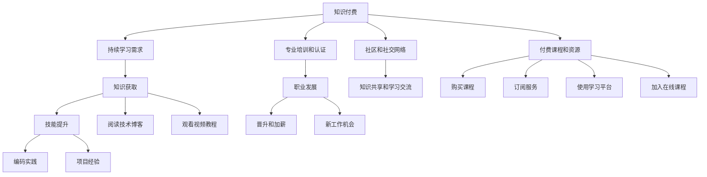

                 

## 1. 背景介绍

在当今这个快速变化的技术环境中，程序员必须不断更新自己的知识和技能，才能在职业生涯中保持竞争力。而知识付费作为这一过程的催化剂，已经成为程序员持续学习和职业成长的重要助力。本文将探讨知识付费与程序员持续学习之间的关系，包括其必要性、影响以及如何更有效地利用这一资源。

## 2. 核心概念与联系

### 2.1 核心概念概述

- **知识付费**：指通过购买或订阅付费内容来获取知识、技能和信息的行为。这种模式旨在提供高质量、高效的学习材料和培训资源，以满足专业人士的需求。
- **程序员持续学习**：指程序员为跟上技术发展、提升自身能力而不断学习新知识和技能的过程。这包括编程语言、开发工具、算法与数据结构、系统架构、软件工程等各方面的学习。

### 2.2 核心概念原理和架构的 Mermaid 流程图



这个流程图展示了知识付费如何通过各种途径支持程序员的持续学习，从而促进他们的职业发展。

## 3. 核心算法原理 & 具体操作步骤

### 3.1 算法原理概述

知识付费平台通过将专家知识货币化，为程序员提供了一个高效获取知识的渠道。这种模式利用了信息不对称原理，即专家拥有比普通用户更深入的知识和技能，而用户愿意为这种知识付费。

### 3.2 算法步骤详解

1. **选择合适的平台**：根据个人需求和技术栈，选择适合的在线学习平台，如Udemy、Coursera、edX等。
2. **订阅或购买课程**：为特定技能或领域选择付费课程，通常包括视频教程、实战项目和作业评估。
3. **设定学习计划**：根据课程安排和个人时间，制定详细的学习计划，确保学习的连贯性和系统性。
4. **实践与反馈**：通过实际编程练习和项目实践，应用所学知识，同时接受课程提供的反馈和指导。
5. **持续优化**：定期回顾和复习已学内容，更新知识库，保持技能的新鲜度。

### 3.3 算法优缺点

#### 优点

- **高效获取高质量内容**：知识付费平台集成了行业专家和机构的优质资源，节省了自我搜集和筛选的时间。
- **系统化学习**：课程通常包含清晰的课程结构、学习目标和评估机制，帮助学习者系统化地掌握知识。
- **即时反馈与支持**：学习平台上提供即时问答、作业评估和社区支持，帮助解决学习过程中的疑难问题。

#### 缺点

- **成本高**：知识付费的课程费用可能较高，对于预算有限的个体来说是一个挑战。
- **依赖性强**：过分依赖付费课程，可能导致忽略自我探索和实践的机会。
- **课程选择难度大**：面对庞大的课程资源，选择适合自己的课程可能会感到困惑。

### 3.4 算法应用领域

知识付费不仅限于程序员的持续学习，还广泛应用于各个专业领域。例如，医生可以通过付费课程学习最新的医疗技术和研究成果；教师可以订阅教学资源来提升课堂教学质量；企业家可以购买管理课程以提升企业的经营策略。

## 4. 数学模型和公式 & 详细讲解 & 举例说明

### 4.1 数学模型构建

知识付费的盈利模型可以简单表示为：

\[ R = C \times P \times e^{-R} \]

其中：
- \( R \) 为利润
- \( C \) 为课程成本
- \( P \) 为课程价格
- \( e \) 为自然常数
- \( -R \) 为订阅周期

### 4.2 公式推导过程

假设每门课程的成本为 \( C \)，每门课程的价格为 \( P \)，订阅周期为 \( R \)，课程销量为 \( N \)，利润率为 \( r \)。根据利润率定义：

\[ r = \frac{R}{N \times C} \]

代入上述公式得：

\[ r = \frac{C \times P \times e^{-R}}{N \times C} \]

\[ r = \frac{P \times e^{-R}}{N} \]

为了最大化利润 \( R \)，需要最大化订阅量 \( N \)，即：

\[ \frac{dN}{dt} = \frac{dP}{dt} \times \frac{dR}{dt} \]

通过求解上述微分方程，可以找到最优的课程价格 \( P \) 和订阅周期 \( R \)。

### 4.3 案例分析与讲解

以Udemy平台为例，其成功之处在于：
- **课程多样化**：提供从入门到高级的丰富课程，覆盖了多个技术栈和领域。
- **市场导向**：紧跟市场趋势和技术动态，推出实战性强的课程。
- **用户反馈**：通过用户评价和社区互动，不断优化课程内容和教学质量。

## 5. 项目实践：代码实例和详细解释说明

### 5.1 开发环境搭建

- **编程语言**：Python
- **开发工具**：VSCode
- **数据集**：使用Udemy平台的公开课程数据

### 5.2 源代码详细实现

```python
import requests
from bs4 import BeautifulSoup

def get_course_info(url):
    response = requests.get(url)
    soup = BeautifulSoup(response.content, 'html.parser')
    title = soup.find('h1').text
    price = soup.find('span', class_='price').text
    instructor = soup.find('a', class_='instructor-link').text
    return title, price, instructor

# 获取课程信息
courses = []
for i in range(1, 6):  # 模拟Udemy上的5门课程
    url = f'https://www.udemy.com/course/{i}'
    title, price, instructor = get_course_info(url)
    courses.append({'title': title, 'price': price, 'instructor': instructor})

# 输出课程信息
for course in courses:
    print(f'Title: {course["title"]} | Price: {course["price"]} | Instructor: {course["instructor"]}')
```

### 5.3 代码解读与分析

上述代码通过爬虫技术获取Udemy上前五门课程的标题、价格和讲师信息，展示了知识付费平台的信息获取和展示功能。

## 6. 实际应用场景

### 6.1 技术博客和在线教程

程序员可以通过订阅技术博客和在线教程，获取最新的技术动态和开发技巧。例如，Stack Overflow、Medium等平台提供了大量的高质量技术文章，程序员可以通过订阅这些平台来保持知识更新。

### 6.2 编程挑战和竞赛

参加编程挑战和在线竞赛，如LeetCode、HackerRank等，可以锻炼实际编程能力，并与其他程序员切磋交流。这些平台不仅提供挑战任务，还附带详细的解题思路和代码解析，有助于理解算法和数据结构的实际应用。

### 6.3 社区和开源项目

加入GitHub、Stack Overflow等社区，参与开源项目，可以积累实战经验，学习团队协作和代码审查等软技能。这些平台上的专家和活跃用户，往往是程序员持续学习的宝贵资源。

## 7. 工具和资源推荐

### 7.1 学习资源推荐

- **在线课程平台**：Udemy、Coursera、edX
- **编程挑战网站**：LeetCode、HackerRank、CodeSignal
- **技术博客和社区**：Stack Overflow、Medium、GitHub

### 7.2 开发工具推荐

- **代码编辑器**：VSCode、Atom、Sublime Text
- **版本控制**：Git、GitHub
- **文档管理**：ReadTheDocs、Swagger

### 7.3 相关论文推荐

- **知识付费的市场研究**：《The Economics of Knowledge付费: Platforms and Pricing Strategies》
- **程序员持续学习的研究**：《A Longitudinal Study of Continuous Learning Among Software Engineers》

## 8. 总结：未来发展趋势与挑战

### 8.1 未来发展趋势

- **个性化学习**：未来知识付费平台将更加注重个性化学习体验，根据用户的学习习惯和进度，推荐适合的课程和资源。
- **AI辅助学习**：结合人工智能技术，提供智能化的学习路径规划、课程推荐和作业评估。
- **虚拟现实和增强现实**：通过虚拟现实和增强现实技术，提供沉浸式学习体验，增强课程互动性和趣味性。

### 8.2 面临的挑战

- **内容质量参差不齐**：市场上存在大量低质量课程和内容，如何筛选和评估课程质量，是知识付费平台面临的主要挑战之一。
- **数据隐私和安全**：知识付费平台需要保护用户数据隐私，防止信息泄露和滥用。
- **用户粘性和留存率**：如何保持用户对课程的兴趣和粘性，减少流失，是知识付费平台需要持续优化的关键点。

### 8.3 研究展望

未来的研究将集中在以下几个方面：
- **用户行为分析**：通过大数据分析，理解用户学习行为和需求，优化学习内容和推荐算法。
- **社区建设与管理**：构建活跃的社区生态，促进用户之间的交流和知识共享。
- **跨平台整合**：将知识付费与社交网络、在线协作工具等平台进行整合，提供一站式学习体验。

## 9. 附录：常见问题与解答

**Q1：知识付费平台对程序员学习有什么帮助？**

A: 知识付费平台提供了高质量的课程和资源，帮助程序员系统地学习新技术和算法，提升编程技能。同时，平台上的互动和反馈机制，可以及时解决学习中的问题，加速学习进程。

**Q2：程序员应该如何选择适合自己的知识付费平台？**

A: 根据个人需求和技术栈，选择覆盖领域广泛、课程质量高、用户评价好的平台。同时，可以试用平台的免费课程，评估其教学质量和适用性。

**Q3：如何平衡知识付费和学习成本？**

A: 设定合理的预算，优先选择性价比高的课程和资源。同时，利用平台的试用功能、免费课程和社区资源，最大化利用免费资源。

**Q4：知识付费对程序员有什么长期影响？**

A: 通过持续学习和知识付费，程序员可以保持技术领先，提升职业竞争力。长期来看，知识付费帮助程序员构建更广阔的知识网络，促进职业发展。

---

作者：禅与计算机程序设计艺术 / Zen and the Art of Computer Programming

