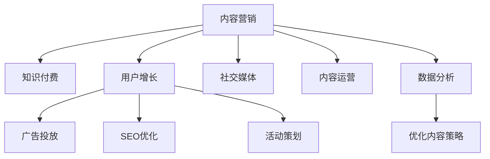

                 

# 知识付费创业中的内容营销策略

> 关键词：知识付费, 内容营销, 用户增长, 社交媒体, 内容运营, 数据分析

## 1. 背景介绍

### 1.1 问题由来
随着互联网的快速发展和普及，用户获取知识的方式发生了翻天覆地的变化。从传统的线下培训、书籍学习到在线课程、视频讲座，知识付费平台逐渐成为人们获取专业知识的重要渠道。如何在这片蓝海市场中脱颖而出，是每个知识付费创业者必须思考的问题。内容营销作为一种高效的用户获取策略，凭借其低成本、高回报的特点，越来越受到创业者的青睐。

### 1.2 问题核心关键点
内容营销的核心在于通过优质的内容吸引并留住用户，最终实现转化和增长。内容形式多种多样，包括文章、视频、音频、图表等。其核心在于持续提供有价值、有趣味的内容，满足用户的需求，提高用户粘性。

内容营销的关键在于理解用户需求，并通过数据分析、用户反馈不断优化内容策略。同时，通过社交媒体、搜索引擎等渠道推广优质内容，提高曝光度，吸引更多潜在用户。

## 2. 核心概念与联系

### 2.1 核心概念概述

为更好地理解知识付费平台中的内容营销策略，本节将介绍几个密切相关的核心概念：

- 内容营销（Content Marketing）：以内容为核心的营销策略，通过提供有价值的内容吸引和转化用户。其核心在于内容的原创性和持续性。
- 知识付费（Knowledge-Based Subscription）：用户为获取专业知识和技能，支付一定费用订阅内容平台。知识付费的本质是通过内容创造价值，满足用户需求。
- 用户增长（User Acquisition）：通过各种手段增加用户数量和提高用户活跃度。内容营销是用户增长的重要手段之一。
- 社交媒体（Social Media）：包括微博、微信、抖音等社交平台，是内容营销的主要渠道之一。
- 内容运营（Content Operations）：通过策划、生产、推广、监测和优化等环节，确保内容策略的有效执行。
- 数据分析（Data Analytics）：通过收集和分析用户行为数据，优化内容策略，提高用户转化率和满意度。

这些核心概念之间的逻辑关系可以通过以下Mermaid流程图来展示：



这个流程图展示了几者之间的关系：

1. 内容营销是知识付费的核心，通过优质内容吸引用户。
2. 用户增长主要依赖于内容营销和广告投放等手段。
3. 社交媒体是内容营销的重要渠道。
4. 内容运营确保内容策略的有效执行。
5. 数据分析帮助优化内容策略，提高用户转化率和满意度。

## 3. 核心算法原理 & 具体操作步骤
### 3.1 算法原理概述

内容营销的算法原理主要基于以下两个方面：

1. **用户行为分析**：通过对用户行为数据的收集和分析，了解用户兴趣和需求，从而优化内容策略，提高用户转化率。

2. **内容推荐算法**：通过协同过滤、内容相似性等算法，推荐用户感兴趣的内容，增加用户粘性。

### 3.2 算法步骤详解

基于内容营销的算法原理，内容营销的操作步骤主要包括以下几个关键步骤：

**Step 1: 收集和分析用户数据**

- 收集用户在平台上的行为数据，包括浏览记录、互动行为、购买记录等。
- 使用数据分析工具（如Google Analytics、Mixpanel等）分析用户行为模式，识别出用户兴趣和需求。

**Step 2: 内容策划和生产**

- 根据用户行为数据，策划内容主题和形式，确保内容与用户需求相匹配。
- 制作高质量的内容，包括文章、视频、音频等。

**Step 3: 内容推广和分发**

- 选择合适的社交媒体平台（如微博、微信、抖音等）进行内容推广。
- 使用SEO优化，提高内容的搜索引擎排名。
- 利用广告投放工具（如Google Ads、Facebook Ads等）扩大内容曝光度。

**Step 4: 内容监测和优化**

- 使用数据分析工具（如Google Analytics、Kissmetrics等）监测内容表现。
- 根据用户反馈和行为数据，不断优化内容策略，提高用户转化率。

### 3.3 算法优缺点

内容营销的算法优点在于：

1. **低成本高回报**：相对于传统广告，内容营销的成本较低，但能够带来更高的用户转化率和用户粘性。
2. **持续性**：内容营销是一个持续的过程，通过不断更新优质内容，保持用户兴趣。
3. **精准性**：通过数据分析，能够精准定位用户需求，提供更有针对性的内容。

同时，该方法也存在一些局限性：

1. **内容生产成本高**：制作高质量内容需要投入大量的人力和资源。
2. **效果难以量化**：内容营销的效果通常难以直接量化，依赖于用户反馈和行为数据。
3. **推广渠道有限**：内容营销主要依赖于社交媒体和搜索引擎等渠道，推广范围有限。

尽管存在这些局限性，但就目前而言，内容营销仍是知识付费平台中最有效的用户获取策略之一。未来相关研究将进一步探索如何提高内容生产效率和效果可量化，以及如何扩展推广渠道，以提升内容营销的整体效果。

### 3.4 算法应用领域

内容营销在知识付费平台中的应用已经非常广泛，以下是几个典型应用场景：

1. **课程推荐**：通过分析用户浏览和购买记录，推荐用户感兴趣的课程内容，提高课程订阅率。
2. **会员专属内容**：为付费会员提供专属内容，增加会员粘性和满意度。
3. **社区互动**：通过内容运营，活跃社区，促进用户间的交流和分享，增加用户粘性。
4. **品牌推广**：通过内容营销提升品牌知名度，吸引更多潜在用户。

## 4. 数学模型和公式 & 详细讲解  
### 4.1 数学模型构建

内容营销的数学模型主要包括以下几个关键组件：

- 用户行为数据：$D=\{(x_i,y_i)\}_{i=1}^N$，其中 $x_i$ 表示用户行为记录，$y_i$ 表示用户特征标签。
- 内容推荐模型：$f(x)$，用于根据用户行为数据预测其对不同内容的相关度。
- 内容策略优化目标：$\min \mathcal{L}(f)$，其中 $\mathcal{L}$ 为损失函数，用于衡量内容推荐模型与真实用户行为之间的差异。

### 4.2 公式推导过程

假设用户行为数据 $D$ 为 $\{(x_i,y_i)\}_{i=1}^N$，其中 $x_i$ 表示用户浏览记录，$y_i$ 表示用户特征标签。内容推荐模型 $f(x)$ 为用户浏览记录 $x_i$ 预测相关度 $y_i$ 的函数。设推荐模型的损失函数为 $\mathcal{L}(f)$，则优化目标为：

$$
\min_{f} \mathcal{L}(f) = \min_{f} \frac{1}{N} \sum_{i=1}^N \ell(f(x_i),y_i)
$$

其中 $\ell$ 为损失函数，可以是均方误差损失、交叉熵损失等。

**以均方误差损失为例**，损失函数 $\mathcal{L}(f)$ 可以表示为：

$$
\mathcal{L}(f) = \frac{1}{N} \sum_{i=1}^N (f(x_i) - y_i)^2
$$

### 4.3 案例分析与讲解

以下是一个简单的案例分析：

假设我们有一个内容推荐系统，需要对用户浏览的文章内容进行推荐。用户数据 $D$ 包含用户的浏览记录 $x_i$ 和用户特征标签 $y_i$，其中 $y_i$ 为 0 表示不感兴趣，1 表示感兴趣。

我们定义内容推荐模型 $f(x)$ 为：

$$
f(x) = \sum_{j=1}^k w_j \cdot x_{ij}
$$

其中 $w_j$ 为权重系数，$x_{ij}$ 为第 $j$ 个特征在文章中的出现次数。

假设我们采用均方误差损失，则推荐模型的损失函数为：

$$
\mathcal{L}(f) = \frac{1}{N} \sum_{i=1}^N (f(x_i) - y_i)^2
$$

通过优化 $\mathcal{L}(f)$，我们可以得到最优的权重系数 $w_j$，从而得到推荐模型 $f(x)$。

## 5. 项目实践：代码实例和详细解释说明
### 5.1 开发环境搭建

在进行内容营销项目实践前，我们需要准备好开发环境。以下是使用Python进行内容营销开发的环境配置流程：

1. 安装Anaconda：从官网下载并安装Anaconda，用于创建独立的Python环境。

2. 创建并激活虚拟环境：
```bash
conda create -n content-env python=3.8 
conda activate content-env
```

3. 安装所需库：
```bash
pip install tensorflow pandas numpy matplotlib scikit-learn
```

4. 安装数据处理和可视化工具：
```bash
pip install pandas-profiling
```

完成上述步骤后，即可在`content-env`环境中开始内容营销实践。

### 5.2 源代码详细实现

下面以一个简单的课程推荐系统为例，给出使用TensorFlow进行内容营销的PyTorch代码实现。

首先，定义用户行为数据和特征：

```python
import pandas as pd
import numpy as np
from sklearn.preprocessing import StandardScaler

# 用户行为数据
data = pd.read_csv('user_behavior.csv')
features = ['浏览时间', '观看视频', '购买课程']
target = '是否购买'

# 特征缩放
scaler = StandardScaler()
data[features] = scaler.fit_transform(data[features])
```

然后，定义模型：

```python
import tensorflow as tf
from tensorflow.keras.layers import Dense, Input
from tensorflow.keras.models import Model

# 定义输入层
input_layer = Input(shape=(len(features),), name='input')

# 定义模型结构
hidden_layer = Dense(32, activation='relu')(input_layer)
output_layer = Dense(1, activation='sigmoid')(hidden_layer)

# 定义模型
model = Model(inputs=input_layer, outputs=output_layer)
```

接着，定义损失函数和优化器：

```python
# 定义损失函数
loss = tf.keras.losses.BinaryCrossentropy(from_logits=True)

# 定义优化器
optimizer = tf.keras.optimizers.Adam(learning_rate=0.001)
```

然后，训练模型：

```python
# 分割训练集和验证集
train_size = int(len(data) * 0.8)
train_data = data[:train_size]
val_data = data[train_size:]

# 定义训练集和验证集
train_dataset = tf.data.Dataset.from_tensor_slices((train_data[features], train_data[target]))
val_dataset = tf.data.Dataset.from_tensor_slices((val_data[features], val_data[target]))

# 训练模型
model.compile(optimizer=optimizer, loss=loss, metrics=['accuracy'])
model.fit(train_dataset.shuffle(100).batch(32), epochs=10, validation_data=val_dataset.shuffle(100).batch(32))
```

最后，进行模型评估和预测：

```python
# 测试集
test_data = data[train_size:]

# 定义测试集
test_dataset = tf.data.Dataset.from_tensor_slices((test_data[features], test_data[target]))

# 评估模型
test_loss, test_acc = model.evaluate(test_dataset.shuffle(100).batch(32))

# 进行预测
predictions = model.predict(test_dataset.shuffle(100).batch(32))
```

以上就是使用TensorFlow对课程推荐系统进行内容营销的完整代码实现。可以看到，通过简单的数据预处理和模型训练，我们可以实现用户行为数据的建模和推荐，进而优化内容策略，提升用户转化率。

### 5.3 代码解读与分析

让我们再详细解读一下关键代码的实现细节：

**用户行为数据处理**：
- 使用Pandas读取用户行为数据，提取特征和标签。
- 使用Sklearn的StandardScaler进行特征缩放，标准化数据分布。

**模型定义**：
- 使用TensorFlow定义输入层、隐藏层和输出层，其中输出层使用sigmoid激活函数，输出一个0到1之间的概率值。

**损失函数和优化器**：
- 使用TensorFlow内置的BinaryCrossentropy作为损失函数，适合二分类问题。
- 使用Adam优化器，学习率为0.001。

**训练和评估**：
- 将数据集分割为训练集和验证集。
- 使用tf.data.Dataset对数据进行批处理和打乱。
- 调用model.fit进行模型训练，设置epochs为10。
- 使用model.evaluate对模型进行评估，返回测试集上的损失和精度。

**预测**：
- 使用model.predict对测试集进行预测，返回每个用户是否购买课程的概率。

可以看到，TensorFlow使得内容营销模型的构建和训练变得简洁高效。开发者可以将更多精力放在数据处理、模型优化等高层逻辑上，而不必过多关注底层的实现细节。

当然，工业级的系统实现还需考虑更多因素，如模型的保存和部署、超参数的自动搜索、更灵活的任务适配层等。但核心的内容营销流程基本与此类似。

## 6. 实际应用场景
### 6.1 在线教育

在线教育平台通过内容营销可以显著提升课程订阅率。平台可以收集用户浏览、观看、评分等行为数据，构建用户画像，并进行内容推荐。具体实现步骤如下：

1. 收集用户行为数据，包括浏览时间、观看视频、评分等。
2. 使用机器学习模型进行内容推荐，推荐用户感兴趣的相关课程。
3. 利用社交媒体和广告渠道进行推广，提高课程曝光度。
4. 通过数据分析，优化内容策略，提升用户转化率。

通过内容营销，在线教育平台能够更好地满足用户需求，提高课程订阅率和用户满意度。

### 6.2 健康管理

健康管理平台通过内容营销可以提供个性化的健康建议和内容推荐，提升用户粘性。平台可以收集用户健康数据、饮食记录、运动习惯等行为数据，构建用户健康画像，并进行内容推荐。具体实现步骤如下：

1. 收集用户健康数据，包括饮食、运动、睡眠等行为记录。
2. 使用机器学习模型进行健康建议和内容推荐，提供个性化的健康方案。
3. 利用社交媒体和健康社区进行推广，提高健康建议的曝光度。
4. 通过数据分析，优化健康内容策略，提升用户粘性。

通过内容营销，健康管理平台能够更好地满足用户健康需求，提高用户粘性和满意度。

### 6.3 金融理财

金融理财平台通过内容营销可以提供个性化的投资建议和内容推荐，提升用户粘性。平台可以收集用户投资数据、风险偏好、交易记录等行为数据，构建用户投资画像，并进行内容推荐。具体实现步骤如下：

1. 收集用户投资数据，包括股票、基金、债券等投资记录。
2. 使用机器学习模型进行投资建议和内容推荐，提供个性化的投资方案。
3. 利用社交媒体和理财社区进行推广，提高投资建议的曝光度。
4. 通过数据分析，优化投资内容策略，提升用户粘性。

通过内容营销，金融理财平台能够更好地满足用户投资需求，提高用户粘性和满意度。

### 6.4 未来应用展望

随着知识付费市场的不断成熟，内容营销的应用场景将不断扩展。未来，内容营销将更注重以下几个方向：

1. **个性化推荐**：通过深度学习和协同过滤等技术，实现更加精准的内容推荐。
2. **多渠道推广**：利用社交媒体、搜索引擎、邮件等渠道，全方位推广优质内容。
3. **用户互动**：通过社区、论坛等形式，增强用户间的互动和交流，提升用户粘性。
4. **内容创作激励**：通过奖励机制，激励用户创作优质内容，增加内容多样化。
5. **数据分析优化**：通过大数据分析，优化内容策略，提高用户转化率。

以上方向将进一步提升内容营销的效果，为知识付费平台带来更大的用户增长和用户粘性。

## 7. 工具和资源推荐
### 7.1 学习资源推荐

为了帮助开发者系统掌握内容营销的理论基础和实践技巧，这里推荐一些优质的学习资源：

1. **《内容营销全攻略》**：知名内容营销专家乔纳森·杰维特的著作，全面介绍了内容营销的各个环节和实践技巧。
2. **Coursera《内容营销与品牌建设》课程**：由内容营销专家Adam Hardin讲授，系统介绍了内容营销的理论基础和实战技巧。
3. **Udemy《内容营销大师班》课程**：由内容营销专家乔恩·奥伯格讲授，深入浅出地介绍了内容营销的核心策略和工具。
4. **HubSpot博客**：内容营销领域的权威资源，提供大量的营销策略、案例分析和实用工具。
5. **Content Marketing Institute**：全球最大的内容营销社区，提供最新的行业动态、研究报告和营销工具。

通过对这些资源的学习实践，相信你一定能够快速掌握内容营销的精髓，并用于解决实际的营销问题。

### 7.2 开发工具推荐

高效的开发离不开优秀的工具支持。以下是几款用于内容营销开发的常用工具：

1. **Jupyter Notebook**：数据科学和机器学习的主要开发环境，支持Python、R等多种语言，可方便地进行数据处理和模型训练。
2. **TensorFlow**：Google开发的深度学习框架，支持多种机器学习模型，适合内容推荐等场景。
3. **Pandas**：数据处理和分析的重要工具，支持多种数据格式和操作，适合数据清洗和预处理。
4. **TensorBoard**：TensorFlow的可视化工具，可实时监测模型训练状态，提供丰富的图表呈现方式。
5. **Google Analytics**：网站流量和用户行为分析工具，支持深入的用户画像分析和行为跟踪。

合理利用这些工具，可以显著提升内容营销任务的开发效率，加快创新迭代的步伐。

### 7.3 相关论文推荐

内容营销的研究方向涵盖了多个领域，以下是几篇奠基性的相关论文，推荐阅读：

1. **《Content Mining and Tropism》**：介绍了内容营销的基础理论和实践方法，适合入门学习。
2. **《The Content Marketing V Matrix》**：通过分析内容营销的多个维度，提出了一个内容营销矩阵模型。
3. **《The Content Marketing Research Review》**：系统回顾了内容营销的研究进展，提供了大量的案例分析和实践指导。
4. **《A Comprehensive Review of Content Marketing》**：全面介绍了内容营销的理论基础和应用实践，适合深入研究。
5. **《The Future of Content Marketing》**：探讨了内容营销的未来趋势和挑战，提供了最新的研究动态和展望。

这些论文代表了大数据和人工智能时代的内容营销研究进展，帮助研究者把握学科前进方向，激发更多的创新灵感。

## 8. 总结：未来发展趋势与挑战

### 8.1 总结

本文对内容营销在知识付费创业中的策略进行了全面系统的介绍。首先阐述了内容营销在知识付费平台中的重要性，明确了内容营销在用户增长、品牌建设等方面的独特价值。其次，从原理到实践，详细讲解了内容营销的数学模型和操作步骤，给出了内容营销任务开发的完整代码实例。同时，本文还广泛探讨了内容营销在在线教育、健康管理、金融理财等多个领域的应用前景，展示了内容营销范式的巨大潜力。此外，本文精选了内容营销学习的各类资源，力求为读者提供全方位的技术指引。

通过本文的系统梳理，可以看到，内容营销在知识付费平台中的应用已经非常广泛，成为用户增长的重要手段之一。内容营销的低成本、高回报、精准性和持续性，使得其成为知识付费创业者必须掌握的关键策略。未来，伴随大数据和人工智能技术的不断演进，内容营销也将迎来更多创新和突破，为知识付费市场带来更大的用户增长和用户粘性。

### 8.2 未来发展趋势

展望未来，内容营销将呈现以下几个发展趋势：

1. **个性化推荐**：通过深度学习和协同过滤等技术，实现更加精准的内容推荐。
2. **多渠道推广**：利用社交媒体、搜索引擎、邮件等渠道，全方位推广优质内容。
3. **用户互动**：通过社区、论坛等形式，增强用户间的互动和交流，提升用户粘性。
4. **内容创作激励**：通过奖励机制，激励用户创作优质内容，增加内容多样化。
5. **数据分析优化**：通过大数据分析，优化内容策略，提高用户转化率。

这些趋势凸显了内容营销的广阔前景。这些方向的探索发展，必将进一步提升内容营销的效果，为知识付费平台带来更大的用户增长和用户粘性。

### 8.3 面临的挑战

尽管内容营销在知识付费平台中已经取得了显著成效，但在迈向更加智能化、普适化应用的过程中，它仍面临诸多挑战：

1. **内容生产成本高**：制作高质量内容需要投入大量的人力和资源。
2. **内容更新频率低**：内容生产和更新的周期较长，难以实时响应用户需求。
3. **效果难以量化**：内容营销的效果通常难以直接量化，依赖于用户反馈和行为数据。
4. **推广渠道有限**：内容营销主要依赖于社交媒体和搜索引擎等渠道，推广范围有限。

尽管存在这些挑战，但就目前而言，内容营销仍是知识付费平台中最有效的用户获取策略之一。未来相关研究将进一步探索如何提高内容生产效率和效果可量化，以及如何扩展推广渠道，以提升内容营销的整体效果。

### 8.4 未来突破

面对内容营销面临的挑战，未来的研究需要在以下几个方面寻求新的突破：

1. **内容自动化生产**：通过AI技术，实现内容自动生成，降低人力成本，提高生产效率。
2. **内容实时更新**：利用实时数据流处理技术，实现内容实时更新，满足用户即时需求。
3. **效果量化评估**：引入量化评估指标，如点击率、转化率、用户满意度等，优化内容策略。
4. **多渠道推广优化**：利用大数据和机器学习技术，优化推广渠道选择，提高推广效果。
5. **用户行为分析优化**：利用深度学习和大数据分析，优化用户行为模型，提高用户粘性。

这些研究方向的探索，必将引领内容营销技术迈向更高的台阶，为知识付费平台带来更大的用户增长和用户粘性。

## 9. 附录：常见问题与解答

**Q1：内容营销与传统广告有什么区别？**

A: 内容营销与传统广告的最大区别在于，内容营销强调的是内容本身，而非单纯为了推广产品或服务。内容营销的核心是通过提供有价值、有趣味的内容吸引并留住用户，从而实现转化和增长。传统广告则主要是通过广告位、投放策略等手段进行推广，对内容质量要求不高，以快速提高品牌知名度为主要目标。

**Q2：内容营销的效果如何衡量？**

A: 内容营销的效果通常通过以下指标来衡量：
1. 点击率（Click-Through Rate, CTR）：用户点击内容的概率。
2. 转化率（Conversion Rate, CR）：用户完成预期行为（如订阅、购买）的概率。
3. 用户停留时间（User Engagement Time）：用户停留内容的时间长度，反映内容的吸引力。
4. 用户互动率（User Interaction Rate）：用户对内容的互动频率，如评论、分享等。

**Q3：内容营销的主要挑战有哪些？**

A: 内容营销的主要挑战包括：
1. 内容生产成本高：制作高质量内容需要投入大量的人力和资源。
2. 内容更新频率低：内容生产和更新的周期较长，难以实时响应用户需求。
3. 效果难以量化：内容营销的效果通常难以直接量化，依赖于用户反馈和行为数据。
4. 推广渠道有限：内容营销主要依赖于社交媒体和搜索引擎等渠道，推广范围有限。

**Q4：如何提高内容营销的效果？**

A: 提高内容营销效果的策略包括：
1. 用户画像分析：通过分析用户行为数据，构建用户画像，提供个性化内容。
2. 内容优化：不断优化内容策略，提高内容的相关性和吸引力。
3. 多渠道推广：利用社交媒体、搜索引擎、邮件等渠道，全方位推广优质内容。
4. 数据分析优化：通过大数据分析，优化内容策略，提高用户转化率。

**Q5：内容营销的未来发展方向是什么？**

A: 内容营销的未来发展方向包括：
1. 个性化推荐：通过深度学习和协同过滤等技术，实现更加精准的内容推荐。
2. 多渠道推广：利用社交媒体、搜索引擎、邮件等渠道，全方位推广优质内容。
3. 用户互动：通过社区、论坛等形式，增强用户间的互动和交流，提升用户粘性。
4. 内容创作激励：通过奖励机制，激励用户创作优质内容，增加内容多样化。
5. 数据分析优化：通过大数据分析，优化内容策略，提高用户转化率。

这些方向将进一步提升内容营销的效果，为知识付费平台带来更大的用户增长和用户粘性。

---

作者：禅与计算机程序设计艺术 / Zen and the Art of Computer Programming

