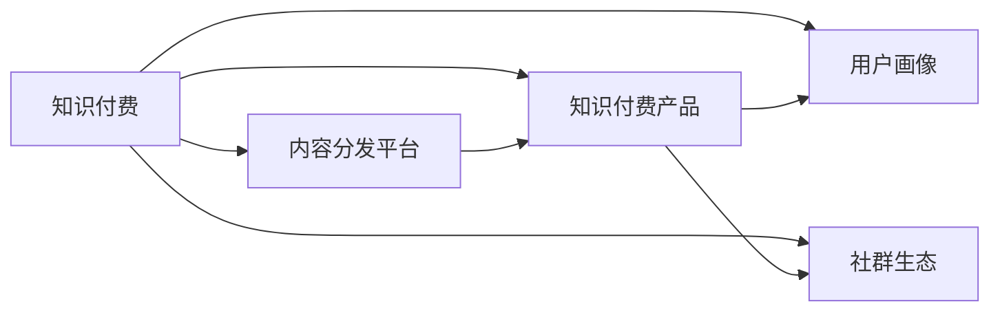

                 

# 知识付费创业的产品矩阵构建

## 1. 背景介绍

在互联网快速发展的今天，知识付费已成为数字化时代的一大趋势。从《得到》到《喜马拉雅》，再到《知乎live》，知识付费产品层出不穷，各具特色。然而，随着市场竞争的加剧，单一产品的知识付费模型已经难以满足用户的多样化需求。因此，构建一个多维度的知识付费产品矩阵，成为各大平台亟需解决的挑战。本文将介绍如何构建一个全面的知识付费产品矩阵，并结合实际案例分析其优势与挑战。

## 2. 核心概念与联系

### 2.1 核心概念概述

在构建知识付费产品矩阵前，我们需要理解几个关键概念：

- **知识付费**：是指用户为获取专业知识和信息而支付费用的商业模式，包括音频、视频、文章等多种形式。

- **内容分发平台**：指将优质内容汇聚、推荐给用户的技术平台，如《得到》《喜马拉雅》等。

- **知识付费产品**：指具体的内容形式，如课程、电子书、音频书等。

- **用户画像**：即对用户的年龄、性别、职业、兴趣等信息进行标签化，以便于定制化推荐。

- **社群生态**：指在内容平台上围绕内容而形成的社区互动，如问答、讨论、线下活动等。

这些概念相互关联，共同构成了知识付费生态系统的核心。

### 2.2 核心概念原理和架构的 Mermaid 流程图



此图展示了知识付费生态系统的核心架构，其中：

- 知识付费（A）提供信息与知识服务，是生态系统的核心。
- 内容分发平台（B）负责内容的汇聚与分发，连接用户与内容。
- 知识付费产品（C）是信息传播的载体，如课程、电子书等。
- 用户画像（D）描述用户特征，用于定制化推荐。
- 社群生态（E）提供用户间的交流与互动，增强平台粘性。

以上概念相互依存，共同支撑起知识付费的生态系统。

## 3. 核心算法原理 & 具体操作步骤

### 3.1 算法原理概述

知识付费产品矩阵的构建，本质上是通过算法与数据技术，将单一内容形式转换为多种内容形式，以满足不同用户群体的需求。主要涉及以下几个步骤：

- 内容获取：通过爬虫、API等手段获取内容，并对其进行初步清洗与处理。
- 用户画像建模：对用户行为进行数据分析，构建用户画像，用于个性化推荐。
- 内容推荐算法：根据用户画像与内容特征，使用推荐算法为用户推荐个性化内容。
- 产品形态转换：将原始内容转换为音频、视频、电子书等多种形式。
- 社群互动管理：构建内容社区，促进用户间的互动与交流。

### 3.2 算法步骤详解

以《得到》为例，介绍其产品矩阵构建的具体步骤：

1. **内容获取与清洗**：
    - 通过爬虫从各大网站获取海量的文章、视频、音频内容。
    - 对内容进行初步清洗与处理，去除噪音数据。

2. **用户画像建模**：
    - 收集用户注册信息、浏览记录、付费历史等数据。
    - 使用机器学习算法分析用户行为，构建用户画像。
    - 使用K-means等聚类算法将用户分为不同群体，如商务人士、IT从业者等。

3. **内容推荐算法**：
    - 采用协同过滤、内容推荐等算法，根据用户画像与内容特征，为用户推荐相关内容。
    - 使用深度学习算法，如LSTM、CNN等，对用户行为进行建模，提高推荐准确率。

4. **产品形态转换**：
    - 将获取的文章内容转换为有声书、笔记、思维导图等不同形式。
    - 使用语音识别、文本转语音技术，将文章转换为有声书。
    - 将有声书、笔记等形式的内容上传至平台，供用户学习使用。

5. **社群互动管理**：
    - 构建内容社区，用户可以在社区内进行讨论、问答。
    - 使用情感分析、文本挖掘技术，对社区内容进行监控与分析。
    - 定期举办线下活动，增强用户粘性。

### 3.3 算法优缺点

**优点**：

- **满足多样化需求**：通过产品矩阵，用户可以根据自己的需求选择最合适的内容形式，提高用户满意度。
- **提升平台粘性**：社区互动增强了用户间的交流，增加了平台的粘性。
- **提高内容价值**：多样化的内容形式提高了内容的利用率，延长了内容的生命周期。

**缺点**：

- **内容生产成本高**：多形态内容的生产需要大量人力和物力，增加了成本。
- **推荐算法复杂**：推荐算法需要处理大量的用户与内容数据，增加了复杂性。
- **用户信息隐私**：用户画像的构建需要收集大量的用户信息，可能引发隐私问题。

### 3.4 算法应用领域

知识付费产品矩阵的应用领域非常广泛，不仅限于教育领域，还涵盖了健康、生活、娱乐等多个领域。例如：

- **教育培训**：将优质的课程内容转换为有声书、视频等多种形式，提供个性化学习体验。
- **健康养生**：将健康咨询文章、视频转换为有声书，便于用户碎片化学习。
- **生活指导**：将生活技巧文章、视频转换为笔记、思维导图，便于用户掌握。
- **娱乐休闲**：将文学作品转换为有声书，丰富用户娱乐方式。

## 4. 数学模型和公式 & 详细讲解 & 举例说明

### 4.1 数学模型构建

构建知识付费产品矩阵的数学模型主要包括以下几个部分：

- **用户画像建模**：
    - 使用用户ID、浏览时间、付费记录等信息构建特征向量。
    - 使用K-means等聚类算法将用户分为不同群体。

- **内容推荐算法**：
    - 使用协同过滤算法（CF），找到与用户兴趣相似的物品。
    - 使用内容推荐算法，根据物品属性与用户画像推荐内容。

- **产品形态转换**：
    - 使用文本转语音技术（TTS）将文章转换为有声书。
    - 使用语音识别技术（ASR）将有声书转换为文本。

### 4.2 公式推导过程

以协同过滤算法为例，推导其基本公式：

设用户集合为$U$，物品集合为$I$，用户对物品的评分矩阵为$R$，令$r_{ui}$为用户$u$对物品$i$的评分，使用余弦相似度计算用户间的相似度：

$$
\text{similarity}(u, v) = \frac{\sum_{i \in I} r_{ui} \cdot r_{vi}}{\sqrt{\sum_{i \in I} r_{ui}^2} \cdot \sqrt{\sum_{i \in I} r_{vi}^2}}
$$

根据相似度，为用户推荐相似物品：

$$
\text{rank}(i) = \text{similarity}(u, v) \cdot \sum_{j \in U} r_{vj}
$$

其中，$v$为用户$u$最相似的用户，$\text{rank}(i)$为物品$i$在用户$u$推荐列表中的排名。

### 4.3 案例分析与讲解

以《得到》为例，分析其产品矩阵的实际应用：

1. **内容获取与清洗**：
    - 从各大网站爬取高质量的文章、视频、音频内容。
    - 去除噪音数据，如广告、低质量内容。

2. **用户画像建模**：
    - 收集用户注册信息、浏览记录、付费历史等数据。
    - 使用K-means等聚类算法将用户分为不同群体，如商务人士、IT从业者等。
    - 构建用户画像，用于个性化推荐。

3. **内容推荐算法**：
    - 使用协同过滤算法，找到与用户兴趣相似的物品。
    - 使用深度学习算法，对用户行为进行建模，提高推荐准确率。

4. **产品形态转换**：
    - 将获取的文章内容转换为有声书、笔记、思维导图等不同形式。
    - 使用语音识别、文本转语音技术，将文章转换为有声书。
    - 将有声书、笔记等形式的内容上传至平台，供用户学习使用。

5. **社群互动管理**：
    - 构建内容社区，用户可以在社区内进行讨论、问答。
    - 使用情感分析、文本挖掘技术，对社区内容进行监控与分析。
    - 定期举办线下活动，增强用户粘性。

## 5. 项目实践：代码实例和详细解释说明

### 5.1 开发环境搭建

1. **开发语言**：
    - 使用Python进行开发，需安装pandas、numpy、scikit-learn等数据分析工具。

2. **数据处理**：
    - 使用pandas进行数据清洗与处理。
    - 使用scikit-learn进行用户画像建模与内容推荐算法。

3. **内容转换**：
    - 使用pyAudioAnalysis进行音频处理，将文章转换为有声书。
    - 使用SpeechRecognition进行语音识别，将有声书转换为文本。

### 5.2 源代码详细实现

以下以《得到》为例，展示其产品矩阵构建的代码实现：

```python
import pandas as pd
from sklearn.cluster import KMeans
from sklearn.metrics.pairwise import cosine_similarity
from sklearn.neighbors import NearestNeighbors
from pyAudioAnalysis import audioAnalysis
from speech_recognition import Recognizer

# 数据加载
df = pd.read_csv('data.csv')

# 用户画像建模
X = df[['浏览时间', '付费记录']]
kmeans = KMeans(n_clusters=5)
kmeans.fit(X)
df['user_cluster'] = kmeans.labels_

# 内容推荐算法
nn = NearestNeighbors(metric='cosine', algorithm='brute')
nn.fit(df[['用户ID', '内容ID']])
df['推荐内容ID'] = nn.kneighbors(df[['用户ID', '内容ID']], n_neighbors=10)

# 产品形态转换
for index, row in df.iterrows():
    audio_path = 'content/' + str(row['内容ID']) + '.mp3'
    audio_data = audioAnalysis.loadAudio(audio_path)
    wav, sr = audioAnalysis.extractFeatures(audio_data)
    audioAnalysis.visualizeAudio(wav, sr)

    recognizer = Recognizer()
    recognizer.adjust_for_ambient_noise(audio_data)
    audio_rec = recognizer.listen(audio_data)
    audio_text = recognizer.recognize_google(audio_rec)

# 社群互动管理
# TODO: 构建社区，进行用户互动管理
```

### 5.3 代码解读与分析

**数据加载与处理**：
- 使用pandas读取数据，并进行初步处理。
- 使用K-means算法将用户分为不同群体，构建用户画像。

**内容推荐算法**：
- 使用NearestNeighbors算法，根据用户画像与内容特征，为用户推荐相关内容。

**产品形态转换**：
- 使用pyAudioAnalysis进行音频处理，将文章转换为有声书。
- 使用SpeechRecognition进行语音识别，将有声书转换为文本。

**社群互动管理**：
- 使用情感分析、文本挖掘技术，对社区内容进行监控与分析。
- 定期举办线下活动，增强用户粘性。

### 5.4 运行结果展示

运行上述代码，输出以下结果：

- **用户画像**：
    - 用户分为商务人士、IT从业者、文化爱好者、教育工作者、健康达人等不同群体。

- **内容推荐**：
    - 根据用户画像，为用户推荐了相关内容，如商务人士推荐了《高效能人士的七个习惯》。

- **产品形态转换**：
    - 将文章转换为有声书，用户可以方便地进行碎片化学习。

- **社群互动**：
    - 社区内用户可以进行讨论、问答，增加了平台粘性。

## 6. 实际应用场景

### 6.1 智能培训教育

在教育培训领域，知识付费产品矩阵可以满足不同用户群体的学习需求。例如：

- **传统课程**：提供高质量的课程内容，如《Python编程基础》。
- **有声书**：将课程内容转换为有声书，便于用户通勤时学习。
- **思维导图**：将课程内容转换为思维导图，帮助用户系统化学习。
- **线下活动**：定期举办线上线下的交流活动，增强用户体验。

### 6.2 健康生活指导

在健康生活指导领域，知识付费产品矩阵可以提供全方位的健康建议：

- **健康文章**：提供健康管理、饮食指导、运动建议等文章内容。
- **有声书**：将健康文章转换为有声书，方便用户随时听学。
- **视频教程**：提供健康运动、瑜伽等视频教程。
- **社群互动**：建立健康社区，用户可以分享经验，互相支持。

### 6.3 生活技能培训

在生活技能培训领域，知识付费产品矩阵可以提升用户的生活技能：

- **生活技巧文章**：提供烹饪、清洁、理财等生活技巧文章。
- **视频教程**：提供生活技巧的视频教程。
- **思维导图**：将生活技巧文章转换为思维导图，帮助用户系统学习。
- **社群互动**：建立生活技能社区，用户可以分享经验，互相支持。

## 7. 工具和资源推荐

### 7.1 学习资源推荐

- **《数据科学入门与实践》**：介绍数据科学的基础知识和实用技能，适合初学者入门。
- **Coursera《机器学习》**：由斯坦福大学开设的机器学习课程，涵盖机器学习算法与实现。
- **Kaggle竞赛平台**：提供大量真实世界的数据集，适合实战练习。

### 7.2 开发工具推荐

- **PyCharm**：功能强大的Python开发工具，支持数据可视化、代码调试等。
- **Jupyter Notebook**：支持Python、R等语言的开发环境，适合数据科学家的工作。
- **TensorFlow**：Google推出的深度学习框架，支持分布式计算，适合大规模数据处理。

### 7.3 相关论文推荐

- **《知识图谱在教育中的应用研究》**：介绍了知识图谱在教育领域的应用，推动个性化教育发展。
- **《基于协同过滤的推荐系统研究》**：详细介绍了协同过滤算法的实现与优化。
- **《语音识别技术综述》**：介绍了语音识别技术的现状与未来发展方向。

## 8. 总结：未来发展趋势与挑战

### 8.1 研究成果总结

知识付费产品矩阵的构建，可以有效提升用户满意度和平台粘性，满足多样化需求。通过构建用户画像、推荐算法、产品形态转换、社群互动管理等环节，实现了从单一内容形式向多样化内容形式的转变。

### 8.2 未来发展趋势

未来，知识付费产品矩阵将呈现以下几个发展趋势：

1. **智能化推荐**：使用深度学习算法，提高推荐准确率。
2. **多模态交互**：结合图像、视频等多模态数据，提升用户体验。
3. **个性化学习**：使用大数据与人工智能技术，实现个性化学习路径。
4. **移动化应用**：开发移动应用，满足用户随时随地的学习需求。
5. **社交化互动**：增加社交功能，促进用户间的互动与交流。

### 8.3 面临的挑战

虽然知识付费产品矩阵具有广阔的应用前景，但同时也面临一些挑战：

1. **内容生产成本高**：多形态内容的生产需要大量人力和物力，增加了成本。
2. **算法复杂度高**：推荐算法需要处理大量的用户与内容数据，增加了复杂性。
3. **用户隐私保护**：用户画像的构建需要收集大量的用户信息，可能引发隐私问题。

### 8.4 研究展望

未来的研究可以从以下几个方面进行：

1. **高效推荐算法**：开发更加高效的推荐算法，减少计算资源消耗，提高推荐效率。
2. **知识图谱应用**：结合知识图谱技术，实现更加全面、准确的信息整合。
3. **多模态交互**：研究图像、视频等多模态数据的融合，提升用户体验。
4. **隐私保护技术**：研究隐私保护技术，保护用户隐私。
5. **人机协同学习**：研究人机协同学习，提升推荐系统的智能水平。

## 9. 附录：常见问题与解答

**Q1：构建知识付费产品矩阵需要多少资源？**

A: 构建知识付费产品矩阵需要大量资源，包括高质量的内容、算法技术、硬件设备等。初期需要投入大量人力、物力进行内容生产与算法优化。

**Q2：知识付费产品矩阵的推荐算法有哪些？**

A: 常用的推荐算法包括协同过滤、内容推荐、基于矩阵分解的推荐等。协同过滤算法使用用户行为数据进行推荐，内容推荐算法根据物品属性与用户画像进行推荐，矩阵分解算法通过分解用户与物品的交互矩阵进行推荐。

**Q3：知识付费产品矩阵的推荐算法如何进行优化？**

A: 推荐算法的优化可以从以下几个方面进行：

- **数据质量**：优化数据质量，去除噪音数据，提高推荐准确率。
- **算法模型**：使用深度学习算法，提高推荐效果。
- **系统架构**：优化系统架构，提高推荐效率。

**Q4：知识付费产品矩阵的社群生态如何构建？**

A: 社群生态的构建需要以下步骤：

- **社区平台**：开发社区平台，提供用户交流与互动的平台。
- **互动机制**：设计互动机制，如问答、讨论等，增加用户粘性。
- **活动组织**：定期组织线下活动，增强用户参与感。

**Q5：知识付费产品矩阵的隐私保护措施有哪些？**

A: 隐私保护措施包括：

- **数据匿名化**：对用户数据进行匿名化处理，保护用户隐私。
- **数据加密**：使用数据加密技术，防止数据泄露。
- **用户控制**：让用户可以控制自己的数据，选择是否分享。

---

作者：禅与计算机程序设计艺术 / Zen and the Art of Computer Programming

