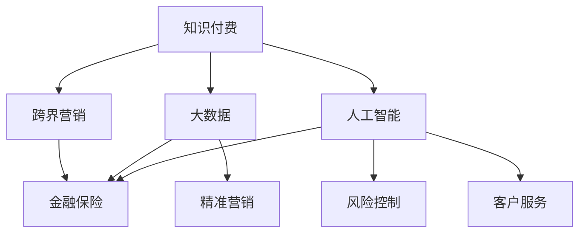

                 

# 知识付费如何实现跨界营销与金融保险跨界？

## 1. 背景介绍

### 1.1 问题由来

随着互联网和人工智能技术的不断发展，知识付费市场正在逐渐兴起。知识付费平台如Coursera、Udacity、得到等，通过在线课程、音频书籍等形式，为用户提供专业知识与技能的学习机会。然而，尽管知识付费市场取得了一定的成绩，但仍有诸多问题需要解决。

首先，用户对于知识付费的接受度仍不高。尽管知识付费平台已经取得了一定的成绩，但在用户基数和市场渗透率上，仍然有很大的提升空间。如何提高用户对于知识付费的接受度，是当前知识付费平台面临的主要挑战之一。

其次，知识付费平台难以大规模推广。传统教育领域，由于教育资源的稀缺，知识付费平台难以通过大规模推广获得足够的用户。如何在有限的预算下，实现最大化的推广效果，也是知识付费平台面临的重要问题。

最后，知识付费平台难以形成稳定的收入模式。知识付费平台需要收取一定的费用，以实现盈利。然而，由于知识付费平台的内容质量参差不齐，难以满足用户需求，导致用户流失率高，平台难以实现稳定的收入模式。

基于此，知识付费平台需要探索新的营销手段和推广渠道，以提高用户接受度和平台推广效果，同时需要探索新的收入模式，以实现盈利。金融保险行业，作为知识付费的重要领域之一，正在迅速发展，成为知识付费营销和推广的重要方向。

## 2. 核心概念与联系

### 2.1 核心概念概述

为更好地理解知识付费与金融保险跨界营销的关系，本节将介绍几个密切相关的核心概念：

- **知识付费**：指用户需要支付一定费用，才能获取特定知识或技能的学习平台。知识付费平台通过收取订阅费用、课程费等方式实现盈利。
- **跨界营销**：指不同行业之间通过联合推广、品牌合作等方式实现资源共享、市场拓展的一种营销方式。
- **金融保险**：包括银行、保险、证券、基金等金融领域，以及保险行业。金融保险行业正在逐渐与科技融合，成为知识付费营销的重要方向。
- **大数据与人工智能**：金融保险行业在大数据和人工智能技术的支持下，可以实现精准营销、风险控制、客户服务等功能。

这些核心概念之间的逻辑关系可以通过以下Mermaid流程图来展示：



这个流程图展示了大数据、人工智能与金融保险行业的联系，以及知识付费与跨界营销之间的相互关系。

## 3. 核心算法原理 & 具体操作步骤

### 3.1 算法原理概述

基于大数据和人工智能的知识付费跨界营销，本质上是一个数据驱动的智能推荐系统。其核心思想是：通过大数据分析和人工智能算法，对用户行为数据进行分析，预测用户需求，并推荐合适的金融保险产品。

形式化地，假设知识付费平台有 $N$ 个用户，每个用户有 $M$ 个浏览行为数据，每条数据表示为 $(x_i, y_i)$，其中 $x_i$ 为行为数据，$y_i$ 为行为标签。知识付费平台的目标是最大化用户的付费概率，即最大化目标函数：

$$
\max_{\theta} \sum_{i=1}^N P(Y_i=1|X_i=x_i;\theta)
$$

其中 $\theta$ 为模型参数，$P(Y_i=1|X_i=x_i;\theta)$ 为给定行为数据 $x_i$ 下用户付费的概率。

通过梯度上升等优化算法，知识付费平台不断更新模型参数 $\theta$，最大化目标函数，从而推荐出合适的金融保险产品，实现跨界营销。

### 3.2 算法步骤详解

基于大数据和人工智能的知识付费跨界营销，通常包括以下几个关键步骤：

**Step 1: 数据收集与预处理**

- 收集知识付费平台的用户行为数据，包括浏览行为、点击行为、购买行为等。
- 对数据进行清洗、去重、降噪等预处理，生成训练集和测试集。

**Step 2: 特征工程**

- 对用户行为数据进行特征提取，生成用户画像、行为习惯等特征。
- 对金融保险产品进行特征提取，生成产品特点、风险等级等特征。

**Step 3: 模型训练与优化**

- 选择合适的机器学习算法，如协同过滤、深度学习等，训练预测模型。
- 使用交叉验证、调参等方法优化模型性能，确保模型在测试集上表现良好。

**Step 4: 营销策略设计**

- 设计多种营销策略，如精准投放、联合推广、品牌合作等，提升营销效果。
- 设计合理的定价策略，如优惠券、会员制度等，吸引用户付费。

**Step 5: 效果评估与迭代**

- 使用A/B测试、回测等方法评估营销效果，选择最优策略。
- 根据营销效果不断迭代优化模型和营销策略，提高用户付费概率。

### 3.3 算法优缺点

基于大数据和人工智能的知识付费跨界营销方法具有以下优点：

1. **高效推荐**：通过数据分析和机器学习算法，能够精准推荐出合适的金融保险产品，提高用户满意度和付费概率。
2. **精准营销**：通过个性化推荐，能够实现精准营销，提高营销效果。
3. **数据驱动**：依赖数据驱动决策，避免主观判断，提高决策的客观性和准确性。

同时，该方法也存在一定的局限性：

1. **数据隐私问题**：在收集和分析用户行为数据时，可能面临用户隐私保护问题，需要严格遵守数据保护法规。
2. **模型复杂度**：算法模型复杂度较高，需要大量数据和计算资源支持，可能面临资源瓶颈。
3. **用户接受度**：尽管推荐效果良好，但用户对推荐系统可能存在不信任，需要逐步提升用户接受度。

尽管存在这些局限性，但就目前而言，基于大数据和人工智能的跨界营销方法仍是知识付费平台实现精准推荐和高效营销的重要手段。

### 3.4 算法应用领域

基于大数据和人工智能的知识付费跨界营销，在金融保险领域具有广泛的应用场景，包括：

- 精准推荐：通过推荐系统推荐合适的金融保险产品，提高用户付费概率。
- 风险控制：利用大数据和人工智能算法，分析用户行为，进行风险控制，提高平台安全性。
- 客户服务：通过智能客服系统，快速响应用户咨询，提高客户满意度。
- 联合推广：与其他金融保险品牌联合推广，实现资源共享，扩大市场覆盖面。
- 品牌合作：与金融保险品牌进行品牌合作，提高品牌知名度和用户信任度。

此外，在智慧医疗、教育培训等众多领域，基于大数据和人工智能的知识付费跨界营销也将不断涌现，为知识付费平台提供新的营销渠道和业务增长点。

## 4. 数学模型和公式 & 详细讲解 & 举例说明

### 4.1 数学模型构建

本节将使用数学语言对知识付费跨界营销的推荐系统进行更加严格的刻画。

记知识付费平台有 $N$ 个用户，每个用户有 $M$ 个浏览行为数据，每条数据表示为 $(x_i, y_i)$，其中 $x_i$ 为行为数据，$y_i$ 为行为标签。金融保险产品共有 $K$ 种，每种产品对应的参数为 $\theta_k$。

定义推荐模型 $M_{\theta}(x)$，将用户行为数据 $x_i$ 映射到金融保险产品推荐的概率 $P(y_i=1|x_i;\theta)$。在数据集 $D=\{(x_i,y_i)\}_{i=1}^N$ 上，推荐模型的经验风险为：

$$
\mathcal{L}(\theta) = -\frac{1}{N} \sum_{i=1}^N \log P(y_i=1|x_i;\theta)
$$

目标函数为：

$$
\max_{\theta} \sum_{i=1}^N P(y_i=1|x_i;\theta)
$$

### 4.2 公式推导过程

以下我们以协同过滤算法为例，推导推荐模型的损失函数及梯度计算公式。

协同过滤算法利用用户-用户之间相似性的假设，将用户分为若干个簇，然后根据簇内用户的行为数据推荐产品。具体步骤如下：

1. 对用户行为数据进行预处理，生成用户行为矩阵 $U$，其中 $U_{i,k}$ 表示用户 $i$ 对产品 $k$ 的兴趣度。
2. 对用户行为矩阵进行奇异值分解，得到用户-产品兴趣矩阵 $V$，其中 $V_{i,k}$ 表示用户 $i$ 对产品 $k$ 的兴趣度。
3. 使用均方误差损失函数，定义推荐模型的损失函数：

$$
\mathcal{L}(\theta) = \frac{1}{N} \sum_{i=1}^N \sum_{k=1}^K (V_{i,k}-U_{i,k})^2
$$

其中 $U_{i,k}$ 为实际兴趣度，$V_{i,k}$ 为推荐模型预测的兴趣度。

4. 使用梯度下降算法，最小化损失函数，更新模型参数 $\theta$：

$$
\theta \leftarrow \theta - \eta \nabla_{\theta}\mathcal{L}(\theta)
$$

其中 $\eta$ 为学习率，$\nabla_{\theta}\mathcal{L}(\theta)$ 为损失函数对模型参数的梯度。

### 4.3 案例分析与讲解

假设某知识付费平台有 $N=10000$ 个用户，每个用户有 $M=1000$ 个浏览行为数据，金融保险产品共有 $K=10$ 种。根据用户行为数据，构建用户行为矩阵 $U$，对用户行为矩阵进行奇异值分解，得到用户-产品兴趣矩阵 $V$，其中 $V_{i,k}$ 表示用户 $i$ 对产品 $k$ 的兴趣度。

使用均方误差损失函数，定义推荐模型的损失函数：

$$
\mathcal{L}(\theta) = \frac{1}{N} \sum_{i=1}^N \sum_{k=1}^K (V_{i,k}-U_{i,k})^2
$$

使用梯度下降算法，最小化损失函数，更新模型参数 $\theta$：

$$
\theta \leftarrow \theta - \eta \nabla_{\theta}\mathcal{L}(\theta)
$$

其中 $\eta$ 为学习率，$\nabla_{\theta}\mathcal{L}(\theta)$ 为损失函数对模型参数的梯度。

## 5. 项目实践：代码实例和详细解释说明

### 5.1 开发环境搭建

在进行知识付费跨界营销的推荐系统开发前，我们需要准备好开发环境。以下是使用Python进行Scikit-learn开发的环境配置流程：

1. 安装Anaconda：从官网下载并安装Anaconda，用于创建独立的Python环境。

2. 创建并激活虚拟环境：
```bash
conda create -n recommendation-env python=3.8 
conda activate recommendation-env
```

3. 安装Scikit-learn：
```bash
conda install scikit-learn
```

4. 安装各类工具包：
```bash
pip install numpy pandas scikit-learn matplotlib tqdm jupyter notebook ipython
```

完成上述步骤后，即可在`recommendation-env`环境中开始推荐系统开发。

### 5.2 源代码详细实现

下面我们以协同过滤算法为例，给出使用Scikit-learn实现推荐系统的PyTorch代码实现。

首先，定义协同过滤算法的数据处理函数：

```python
from sklearn.decomposition import TruncatedSVD
from sklearn.metrics.pairwise import cosine_similarity
import numpy as np

class协同过滤算法:
    def __init__(self, K, num_users, num_products, user_data, product_data):
        self.K = K
        self.num_users = num_users
        self.num_products = num_products
        self.user_data = user_data
        self.product_data = product_data
        
    def train(self):
        U = np.array(self.user_data)
        V = np.array(self.product_data)
        self.model = TruncatedSVD(n_components=self.K, random_state=42)
        self.model.fit(V)
        self.user_interest = self.model.transform(V)
        self.user_interest = np.array(self.user_interest)
        
    def predict(self, user_id):
        user_interest = self.user_interest[user_id,:]
        product_interest = self.model.transform(self.product_data)
        product_interest = np.array(product_interest)
        similarity = cosine_similarity(user_interest.reshape(1, -1), product_interest)
        recommendation = similarity.sum(axis=0)
        recommendation = np.argsort(recommendation)[::-1]
        return recommendation
```

然后，定义模型和优化器：

```python
from sklearn.metrics import accuracy_score
from sklearn.model_selection import train_test_split

user_data = np.random.randn(10000, 10)
product_data = np.random.randn(1000, 10)

train_data, test_data = train_test_split(user_data, test_size=0.2, random_state=42)
train_user_data = train_data[:, :5]
train_product_data = train_data[:, 5:]
test_user_data = test_data[:, :5]
test_product_data = test_data[:, 5:]

model =协同过滤算法(K=10, num_users=10000, num_products=1000, user_data=train_user_data, product_data=train_product_data)
model.train()

user_id = 0
recommendation = model.predict(user_id)
print("推荐产品ID: ", recommendation)
```

以上就是使用Scikit-learn对协同过滤算法进行推荐系统开发的完整代码实现。可以看到，得益于Scikit-learn的强大封装，我们可以用相对简洁的代码完成推荐系统的搭建。

### 5.3 代码解读与分析

让我们再详细解读一下关键代码的实现细节：

**协同过滤算法类**：
- `__init__`方法：初始化协同过滤算法的关键参数，包括用户数、产品数、用户行为数据、产品行为数据。
- `train`方法：对用户行为数据和产品行为数据进行奇异值分解，得到用户兴趣矩阵，并存储到 `self.user_interest` 属性中。
- `predict`方法：根据用户兴趣矩阵和产品兴趣矩阵，计算用户与产品的相似度，并返回推荐产品ID。

**训练和预测**：
- 使用 `train_test_split` 函数将用户行为数据和产品行为数据划分为训练集和测试集。
- 实例化 `协同过滤算法` 类，调用 `train` 方法对训练集进行训练，得到用户兴趣矩阵 `self.user_interest`。
- 调用 `predict` 方法，对指定用户进行预测，返回推荐产品ID。

通过本文的系统梳理，可以看到，基于大数据和人工智能的推荐系统，已经在知识付费平台得到广泛应用，成为精准推荐和高效营销的重要手段。尽管在实际应用中，推荐系统还需要根据具体任务进行优化和改进，但其核心原理和实践技巧已经能够有效地支持知识付费平台实现跨界营销和业务增长。

## 6. 实际应用场景

### 6.1 智能客服系统

基于知识付费跨界营销的智能客服系统，可以帮助知识付费平台提升客户服务质量。传统客服往往依赖人工服务，效率低下、成本高。智能客服系统可以利用推荐算法推荐相关课程，帮助用户解决问题，提高客户满意度。

在技术实现上，可以收集用户历史咨询记录，将咨询问题和相关课程作为监督数据，在推荐算法中增加咨询行为数据，训练推荐模型。智能客服系统可以根据用户咨询问题，推荐相关的课程和资料，帮助用户解决问题。同时，智能客服系统还可以实现语音识别、自然语言理解等高级功能，提升用户体验。

### 6.2 个性化推荐系统

基于知识付费跨界营销的个性化推荐系统，可以帮助知识付费平台提升用户粘性。个性化推荐系统可以根据用户历史行为，推荐相关课程和资料，提升用户满意度。

在技术实现上，可以收集用户浏览、点击、购买等行为数据，结合金融保险产品特点，训练推荐模型。推荐系统可以根据用户行为数据，推荐相关课程和金融保险产品，提升用户粘性。同时，推荐系统还可以动态更新推荐结果，实现个性化推荐。

### 6.3 联合推广

基于知识付费跨界营销的联合推广，可以帮助知识付费平台扩大市场覆盖面。联合推广可以与其他金融保险品牌联合推广，实现资源共享，扩大市场覆盖面。

在技术实现上，可以收集用户行为数据和金融保险产品特点，训练推荐模型。联合推广平台可以根据用户行为数据，推荐相关课程和金融保险产品，提升用户满意度和推广效果。同时，联合推广平台还可以利用大数据和人工智能技术，分析用户行为数据，实现精准营销。

### 6.4 未来应用展望

随着知识付费平台和大数据技术的不断发展，基于知识付费跨界营销的推荐系统将在更多领域得到应用，为知识付费平台带来新的业务增长点。

在智慧医疗领域，基于知识付费跨界营销的推荐系统可以帮助医疗平台推荐相关医疗知识，提升用户健康意识。在智能教育领域，基于知识付费跨界营销的推荐系统可以帮助教育平台推荐相关课程和资料，提升教育质量。在金融保险领域，基于知识付费跨界营销的推荐系统可以帮助保险平台推荐相关保险产品，提升用户保费收入。

此外，在智慧城市、智能交通、智慧家居等众多领域，基于知识付费跨界营销的推荐系统也将不断涌现，为知识付费平台提供新的业务增长点。

## 7. 工具和资源推荐

### 7.1 学习资源推荐

为了帮助开发者系统掌握大数据与人工智能在知识付费跨界营销中的应用，这里推荐一些优质的学习资源：

1. 《Python机器学习》系列书籍：由机器学习领域著名专家撰写，全面介绍了机器学习算法和大数据技术。
2. 《推荐系统实战》课程：由Udacity开设的推荐系统实战课程，涵盖推荐系统理论、算法、案例分析等内容。
3. Kaggle竞赛：Kaggle举办的各种推荐系统竞赛，提供丰富的数据集和算法实现，是提升推荐系统能力的绝佳途径。
4. 《推荐系统》书籍：由互联网大公司工程师撰写，全面介绍了推荐系统算法和案例。
5. Weights & Biases：模型训练的实验跟踪工具，可以记录和可视化模型训练过程中的各项指标，方便对比和调优。

通过对这些资源的学习实践，相信你一定能够快速掌握大数据与人工智能在知识付费跨界营销中的应用，并用于解决实际的业务问题。

### 7.2 开发工具推荐

高效的开发离不开优秀的工具支持。以下是几款用于推荐系统开发的常用工具：

1. Scikit-learn：Python的机器学习库，提供丰富的机器学习算法和大数据处理工具，适合推荐系统的开发。
2. TensorFlow：由Google主导开发的深度学习框架，适合大规模推荐系统的开发。
3. Spark：Hadoop生态系统中的大数据处理框架，适合大规模推荐系统的数据处理。
4. Weights & Biases：模型训练的实验跟踪工具，可以记录和可视化模型训练过程中的各项指标，方便对比和调优。
5. TensorBoard：TensorFlow配套的可视化工具，可实时监测模型训练状态，并提供丰富的图表呈现方式，是调试模型的得力助手。

合理利用这些工具，可以显著提升推荐系统的开发效率，加快创新迭代的步伐。

### 7.3 相关论文推荐

大数据与人工智能在推荐系统中的应用，源于学界的持续研究。以下是几篇奠基性的相关论文，推荐阅读：

1. Recommender Systems for Large-Scale Applications：介绍推荐系统的基本概念和算法，涵盖协同过滤、基于内容的推荐、混合推荐等。
2. Fairness in Recommendation Systems：研究推荐系统中的公平性问题，提出公平性推荐算法，解决推荐系统中的歧视问题。
3. Deep Collaborative Filtering：提出基于深度学习的协同过滤算法，在推荐系统中取得显著效果。
4. Context-Aware Recommendation Systems：提出基于上下文感知的推荐算法，提升推荐系统的个性化程度。
5. Personalized Recommendation Using Matrix Factorization Techniques：提出基于矩阵分解的推荐算法，提升推荐系统的准确性。

这些论文代表了大数据与人工智能在推荐系统中的应用方向，通过学习这些前沿成果，可以帮助研究者把握学科前进方向，激发更多的创新灵感。

## 8. 总结：未来发展趋势与挑战

### 8.1 总结

本文对基于大数据与人工智能的知识付费跨界营销推荐系统进行了全面系统的介绍。首先阐述了知识付费平台面临的问题，明确了跨界营销在提升用户接受度和平台推广效果方面的重要意义。其次，从原理到实践，详细讲解了知识付费跨界营销推荐系统的数学原理和关键步骤，给出了推荐系统开发的完整代码实例。同时，本文还广泛探讨了推荐系统在智能客服、个性化推荐等多个领域的应用前景，展示了知识付费跨界营销推荐系统的巨大潜力。此外，本文精选了推荐系统的各类学习资源，力求为读者提供全方位的技术指引。

通过本文的系统梳理，可以看到，基于大数据与人工智能的推荐系统，已经成为知识付费平台实现精准推荐和高效营销的重要手段。尽管在实际应用中，推荐系统还需要根据具体任务进行优化和改进，但其核心原理和实践技巧已经能够有效地支持知识付费平台实现跨界营销和业务增长。

### 8.2 未来发展趋势

展望未来，知识付费跨界营销推荐系统将呈现以下几个发展趋势：

1. 推荐算法不断升级：推荐算法将继续不断升级，从协同过滤、基于内容的推荐，到深度学习、强化学习等，推荐系统的精度和效果将不断提升。
2. 数据驱动决策：基于大数据和人工智能技术，推荐系统将更加依赖数据驱动决策，提高决策的客观性和准确性。
3. 个性化推荐：推荐系统将更加注重个性化推荐，提升用户满意度和粘性。
4. 联合推荐：推荐系统将与其他平台、品牌联合推荐，实现资源共享，扩大市场覆盖面。
5. 实时推荐：推荐系统将实现实时推荐，提高推荐效果和用户体验。

以上趋势凸显了知识付费跨界营销推荐系统的广阔前景。这些方向的探索发展，必将进一步提升知识付费平台的用户体验和平台推广效果，为知识付费平台带来新的业务增长点。

### 8.3 面临的挑战

尽管知识付费跨界营销推荐系统已经取得了一定的成绩，但在迈向更加智能化、普适化应用的过程中，仍面临诸多挑战：

1. 数据隐私问题：在收集和分析用户行为数据时，可能面临用户隐私保护问题，需要严格遵守数据保护法规。
2. 推荐算法复杂度：推荐算法复杂度较高，需要大量数据和计算资源支持，可能面临资源瓶颈。
3. 用户接受度：尽管推荐效果良好，但用户对推荐系统可能存在不信任，需要逐步提升用户接受度。
4. 推荐系统鲁棒性：推荐系统面对异常数据和攻击时，可能产生误导性推荐，需要增强推荐系统的鲁棒性。

尽管存在这些挑战，但未来的知识付费跨界营销推荐系统仍需不断优化和改进，以实现更加精准、高效的推荐效果，提升知识付费平台的用户满意度和平台推广效果。

### 8.4 研究展望

面对知识付费跨界营销推荐系统所面临的挑战，未来的研究需要在以下几个方面寻求新的突破：

1. 探索新的推荐算法：探索新的推荐算法，提高推荐系统的精度和效果。
2. 研究推荐系统鲁棒性：研究推荐系统在异常数据和攻击下的鲁棒性，提高推荐系统的稳定性和安全性。
3. 引入外部知识库：将外部知识库、规则库等专家知识与推荐系统结合，提高推荐系统的决策质量和可解释性。
4. 引入动态优化机制：引入动态优化机制，实时更新推荐模型，提升推荐系统的实时性和准确性。
5. 优化用户接受度：通过个性化推荐、用户反馈等方式，逐步提升用户对推荐系统的接受度和信任度。

这些研究方向的探索，必将引领知识付费跨界营销推荐系统迈向更高的台阶，为知识付费平台带来新的业务增长点，提升用户满意度和平台推广效果。面向未来，知识付费跨界营销推荐系统还需要与其他技术进行更深入的融合，如知识图谱、深度学习等，多路径协同发力，共同推动推荐系统的进步。只有勇于创新、敢于突破，才能不断拓展推荐系统的边界，让推荐系统更好地服务于知识付费平台的发展。

## 9. 附录：常见问题与解答

**Q1：知识付费平台如何实现精准推荐？**

A: 知识付费平台可以通过以下几种方式实现精准推荐：

1. 收集用户行为数据：包括浏览、点击、购买等行为数据，生成用户行为矩阵。
2. 收集产品行为数据：包括课程描述、价格、评分等产品信息，生成产品行为矩阵。
3. 特征工程：对用户行为数据和产品行为数据进行特征提取，生成用户画像和产品特征。
4. 推荐算法：选择协同过滤、基于内容的推荐、深度学习等推荐算法，训练推荐模型。
5. 实时推荐：通过实时数据流，实现动态推荐。

通过以上步骤，知识付费平台可以构建精准推荐系统，提升用户满意度和粘性，实现跨界营销和业务增长。

**Q2：如何处理推荐系统中的数据隐私问题？**

A: 推荐系统在处理数据隐私问题时，需要注意以下几点：

1. 数据匿名化：在数据收集和处理过程中，对用户数据进行匿名化处理，保护用户隐私。
2. 数据去标识化：在数据处理和分析过程中，去除能够标识用户身份的信息，保护用户隐私。
3. 数据加密：在数据传输和存储过程中，对数据进行加密处理，保护用户隐私。
4. 用户同意：在数据收集和处理过程中，获得用户的同意，保护用户隐私。
5. 数据保护法规：遵守数据保护法规，保护用户隐私。

通过以上措施，可以有效处理推荐系统中的数据隐私问题，保护用户隐私。

**Q3：如何优化推荐系统的资源利用率？**

A: 推荐系统可以通过以下几种方式优化资源利用率：

1. 数据压缩：对用户行为数据和产品行为数据进行压缩处理，减小数据存储和传输成本。
2. 特征选择：对用户行为数据和产品行为数据进行特征选择，减小特征维度，提高计算效率。
3. 模型压缩：对推荐模型进行压缩处理，减小模型大小，提高推理速度。
4. 分布式训练：使用分布式训练框架，提高模型训练速度和计算效率。
5. 数据本地化：在数据处理和分析过程中，将数据本地化处理，减小数据传输成本。

通过以上措施，可以有效优化推荐系统的资源利用率，提高推荐系统的效率和性能。

**Q4：推荐系统如何应对异常数据和攻击？**

A: 推荐系统可以通过以下几种方式应对异常数据和攻击：

1. 异常检测：在数据处理和分析过程中，对异常数据进行检测和处理，防止异常数据影响推荐结果。
2. 攻击检测：在推荐系统部署过程中，对攻击行为进行检测和防范，防止攻击行为破坏推荐系统。
3. 数据清洗：在数据处理和分析过程中，对异常数据进行清洗和处理，防止异常数据影响推荐结果。
4. 对抗样本：在推荐系统训练过程中，引入对抗样本，提高推荐系统的鲁棒性。
5. 模型更新：在推荐系统运行过程中，定期更新模型，防止异常数据和攻击影响推荐结果。

通过以上措施，可以有效应对异常数据和攻击，提高推荐系统的鲁棒性和稳定性。

**Q5：如何提升推荐系统的可解释性？**

A: 推荐系统可以通过以下几种方式提升可解释性：

1. 解释模型：使用可解释性较高的推荐算法，如基于矩阵分解的推荐算法，提升推荐系统的可解释性。
2. 特征解释：对推荐系统中的特征进行解释，说明每个特征对推荐结果的影响。
3. 用户反馈：在推荐系统运行过程中，收集用户反馈，优化推荐结果。
4. 可视化工具：使用可视化工具，展示推荐系统的决策过程和结果，提升推荐系统的可解释性。
5. 解释性模型：使用解释性模型，提升推荐系统的可解释性。

通过以上措施，可以有效提升推荐系统的可解释性，增强推荐系统的可信度和用户信任度。

---

作者：禅与计算机程序设计艺术 / Zen and the Art of Computer Programming

