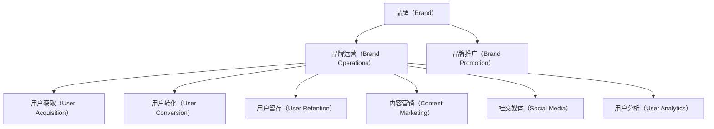

                 

# 知识付费赚钱的品牌品牌运营与品牌推广策略

> 关键词：知识付费,品牌运营,品牌推广,用户获取,转化率,用户留存,内容营销,社交媒体,用户分析,ROI

## 1. 背景介绍

### 1.1 问题由来
随着知识付费的兴起，越来越多的内容生产者和机构开始通过在线课程、电子书、知识社区等形式，向用户提供有价值的知识产品和服务。然而，如何打造一个可持续发展的知识付费品牌，构建一个庞大而活跃的用户群体，一直是困扰内容生产者和机构的难题。

### 1.2 问题核心关键点
核心问题在于，如何通过有效的品牌运营和品牌推广策略，实现知识付费业务的可持续增长。这包括但不限于：
1. **用户获取**：如何通过多种渠道获取用户，特别是高质量用户。
2. **用户转化**：如何引导用户从潜在客户转化为付费用户。
3. **用户留存**：如何提升用户粘性，延长用户生命周期。
4. **内容营销**：如何通过高质量内容吸引并留住用户。
5. **社交媒体**：如何通过社交媒体平台进行品牌推广和用户互动。
6. **用户分析**：如何通过数据分析优化运营策略，提升ROI（投资回报率）。

### 1.3 问题研究意义
对于知识付费品牌而言，成功的品牌运营和推广策略，能够帮助其迅速积累用户基础，提高用户满意度和忠诚度，从而实现业务的可持续增长。具体意义包括：
1. **降低获客成本**：通过有效的品牌推广策略，可以降低获取新用户的成本，提高投资回报率。
2. **提升品牌认知度**：通过品牌运营，提升品牌在用户心中的认知度和美誉度，构建品牌壁垒。
3. **增加用户粘性**：通过内容营销和社区建设，提升用户对品牌的认同感和粘性。
4. **实现商业闭环**：通过有效的用户分析和转化策略，实现用户获取、转化、留存、续费的商业闭环。

## 2. 核心概念与联系

### 2.1 核心概念概述

为更好地理解品牌运营和推广策略，本节将介绍几个密切相关的核心概念：

- **品牌（Brand）**：品牌是公司或产品在市场中的识别标志，包括名称、标志、口号等，是用户对公司或产品的第一印象。
- **品牌运营（Brand Operations）**：品牌运营是通过一系列策略和活动，提升品牌知名度和用户满意度，构建品牌资产的过程。
- **品牌推广（Brand Promotion）**：品牌推广是通过各种营销手段，如广告、公关、社交媒体等，将品牌信息传达给目标用户的过程。
- **用户获取（User Acquisition）**：用户获取是指通过各种渠道和方法，吸引潜在用户注册并成为品牌用户的活动。
- **用户转化（User Conversion）**：用户转化是指将潜在用户转化为付费用户，或提高现有用户的付费层次的活动。
- **用户留存（User Retention）**：用户留存是指通过各种措施，延长用户使用时间和频率，减少用户流失的活动。
- **内容营销（Content Marketing）**：内容营销是指通过高质量内容，吸引用户关注和参与，提升品牌影响力的策略。
- **社交媒体（Social Media）**：社交媒体是指通过社交平台进行品牌推广、用户互动的渠道，如微信、微博、抖音等。
- **用户分析（User Analytics）**：用户分析是指通过数据收集和分析，优化品牌运营策略，提升业务效益的过程。

这些核心概念之间的逻辑关系可以通过以下Mermaid流程图来展示：



这个流程图展示了一系列品牌运营和推广的核心活动，以及它们之间的关系：

1. 品牌是品牌运营和推广的基础。
2. 品牌运营是通过各种策略和活动，提升品牌知名度和用户满意度。
3. 品牌推广通过各种营销手段，将品牌信息传达给目标用户。
4. 用户获取、用户转化和用户留存是品牌运营的关键目标。
5. 内容营销和社交媒体是品牌推广的重要手段。
6. 用户分析是优化品牌运营策略的关键依据。

这些概念共同构成了品牌运营和推广的框架，帮助品牌在知识付费领域实现可持续增长。

## 3. 核心算法原理 & 具体操作步骤

### 3.1 算法原理概述

知识付费品牌的品牌运营和推广策略，本质上是一个多目标优化问题。其核心思想是：通过一系列的运营和推广活动，最大化品牌的认知度、用户满意度、用户转化率和用户留存率。

形式化地，假设品牌的认知度为 $C$，用户满意度为 $S$，用户转化率为 $R$，用户留存率为 $T$。则品牌运营和推广的目标可以表示为：

$$
\max C, S, R, T
$$

其中 $C$、$S$、$R$ 和 $T$ 分别表示品牌认知度、用户满意度、用户转化率和用户留存率的优化目标。

### 3.2 算法步骤详解

品牌运营和推广的策略制定和执行，一般包括以下几个关键步骤：

**Step 1: 确定品牌定位**
- 明确品牌的核心价值主张（Value Proposition），定义品牌的目标用户群体。
- 制定品牌口号（Tagline）和品牌视觉（Logo、颜色等），塑造品牌形象。

**Step 2: 设计品牌推广策略**
- 选择适合的推广渠道，如社交媒体、搜索引擎广告、内容合作等。
- 制定推广计划，明确推广的目标、预算、时间安排等。

**Step 3: 执行品牌运营活动**
- 内容营销：发布高质量的文章、视频、课程等，吸引和留住用户。
- 用户互动：通过社交媒体平台与用户进行互动，建立用户社区。
- 数据分析：通过用户行为数据，优化运营策略。

**Step 4: 监控品牌运营效果**
- 定期评估品牌推广和运营的效果，如品牌知名度、用户增长、转化率等。
- 根据评估结果，调整优化策略，提升效果。

**Step 5: 持续改进和迭代**
- 根据用户反馈和市场变化，不断改进品牌推广和运营策略。
- 引入新功能、新活动，保持品牌的创新性和吸引力。

### 3.3 算法优缺点

品牌运营和推广的策略，具有以下优点：
1. 全面性。通过多种策略和活动，能够从多个维度提升品牌的认知度和用户满意度。
2. 灵活性。可以根据市场变化和用户反馈，灵活调整策略，适应市场变化。
3. 可控性。通过数据分析，能够量化评估策略效果，及时调整优化。

同时，该方法也存在一定的局限性：
1. 资源投入较大。品牌运营和推广需要大量的资金和人力投入。
2. 效果难以预测。市场变化和用户行为难以完全控制，推广效果存在不确定性。
3. 竞争激烈。知识付费市场竞争激烈，品牌推广需要精准定位和差异化策略。

尽管存在这些局限性，但就目前而言，品牌运营和推广仍是知识付费品牌的主要营销手段。未来相关研究的重点在于如何通过更高效、更精准的策略，实现品牌价值的最大化。

### 3.4 算法应用领域

品牌运营和推广策略在知识付费领域已经得到了广泛的应用，覆盖了以下主要方向：

- **用户获取**：通过SEO、内容营销、社交媒体等手段，获取潜在用户。
- **用户转化**：通过个性化推荐、试听、免费试用等策略，引导用户转化为付费用户。
- **用户留存**：通过定期推送内容、社区互动、专属优惠等手段，延长用户生命周期。
- **内容营销**：通过高质量课程、文章、视频等，提升品牌认知度和用户满意度。
- **社交媒体**：通过社交媒体平台进行品牌推广和用户互动，扩大品牌影响力。
- **用户分析**：通过数据分析优化运营策略，提升ROI（投资回报率）。

除了上述这些经典应用外，品牌运营和推广策略还被创新性地应用于多场景中，如知识付费社区、知识付费平台、在线教育等，为知识付费品牌带来了新的增长机会。

## 4. 数学模型和公式 & 详细讲解 & 举例说明

### 4.1 数学模型构建

品牌运营和推广的效果，可以通过以下数学模型来量化评估：

$$
\text{ROI} = \frac{\text{总收益}}{\text{总投入}}
$$

其中 $\text{ROI}$ 表示投资回报率，$\text{总收益}$ 表示通过运营和推广带来的总收益，$\text{总投入}$ 表示用于品牌运营和推广的资源投入，包括人力、资金、时间等。

### 4.2 公式推导过程

品牌运营和推广的效果评估，可以通过以下公式进行推导：

$$
\text{ROI} = \frac{U_{\text{收入}} - U_{\text{成本}}}{U_{\text{成本}}}
$$

其中 $U_{\text{收入}}$ 表示通过运营和推广带来的收入，$U_{\text{成本}}$ 表示运营和推广的各项成本。

### 4.3 案例分析与讲解

以知识付费平台为例，品牌运营和推广的效果可以通过以下案例进行分析：

1. **用户获取效果**
   - 通过SEO优化和内容营销，在一段时间内增加了平台的用户数量，用户总数从1万增加到5万。
   - 这些新增用户中有30%进行了注册和付费，带来了额外的1000元收入。

2. **用户转化效果**
   - 通过个性化推荐和免费试用，将部分潜在用户转化为付费用户，提高了用户的付费转化率。
   - 在一个月内，将潜在用户的转化率从30%提高到50%，增加了300个付费用户，带来了额外的1000元收入。

3. **用户留存效果**
   - 通过定期推送内容、社区互动和专属优惠，提升了用户的活跃度和留存率。
   - 在一个月内，将月活跃用户数从5万增加到7万，用户留存率从60%提高到70%，带来了额外的2000元收入。

4. **内容营销效果**
   - 通过发布高质量的课程和文章，提升了品牌的认知度和用户满意度。
   - 在一个月内，课程的点击量和观看量显著增加，课程的平均评分从3.8提高到4.5，带来了额外的2000元收入。

通过以上案例，可以看出品牌运营和推广策略在知识付费平台上的显著效果，通过多方面的优化提升，实现了品牌价值的最大化。

## 5. 项目实践：代码实例和详细解释说明

### 5.1 开发环境搭建

在进行品牌运营和推广策略的实践前，我们需要准备好开发环境。以下是使用Python进行项目开发的流程图和步骤：

1. **数据收集和处理**
   - 收集品牌的各项运营数据，如用户增长数据、转化数据、留存数据等。
   - 使用Python进行数据清洗和处理，确保数据的质量和可用性。

2. **数据分析和建模**
   - 使用Python进行数据分析和建模，构建品牌运营效果的量化评估模型。
   - 使用Pandas、NumPy、Matplotlib等库进行数据处理和可视化。

3. **优化策略实施**
   - 根据数据分析结果，优化品牌运营策略，如调整推广渠道、优化内容营销、改进用户互动等。
   - 使用Scikit-learn、TensorFlow等库进行模型优化和预测。

4. **效果评估和反馈**
   - 定期评估品牌运营和推广的效果，如品牌知名度、用户增长、转化率等。
   - 根据评估结果，调整优化策略，提升品牌运营的效果。

### 5.2 源代码详细实现

这里以知识付费平台的用户留存为例，给出Python代码实现：

```python
import pandas as pd
from sklearn.model_selection import train_test_split
from sklearn.linear_model import LogisticRegression
from sklearn.metrics import confusion_matrix, roc_auc_score

# 加载数据
data = pd.read_csv('user_data.csv')

# 特征选择
features = ['age', 'gender', 'edu_level', 'interest']
X = data[features]
y = data['is_churn']

# 划分训练集和测试集
X_train, X_test, y_train, y_test = train_test_split(X, y, test_size=0.2, random_state=42)

# 模型训练
model = LogisticRegression()
model.fit(X_train, y_train)

# 效果评估
y_pred = model.predict_proba(X_test)[:, 1]
roc_auc = roc_auc_score(y_test, y_pred)
conf_matrix = confusion_matrix(y_test, model.predict(X_test))

# 输出结果
print(f'ROC AUC: {roc_auc}')
print(f'Confusion Matrix:\n{conf_matrix}')
```

### 5.3 代码解读与分析

以上代码实现了使用Logistic回归模型进行用户留存预测。关键代码解析如下：

1. **数据加载和处理**
   - 使用Pandas库加载用户数据，并进行特征选择和处理。

2. **模型训练**
   - 使用Logistic回归模型进行训练，输出用户是否流失的概率。

3. **效果评估**
   - 使用ROC AUC和混淆矩阵评估模型效果，ROC AUC越高表示模型性能越好。

4. **结果输出**
   - 输出模型效果评估结果，方便调整优化策略。

## 6. 实际应用场景

### 6.1 智能客服系统

品牌运营和推广策略在智能客服系统中得到了广泛应用，帮助品牌提升客服效率和用户满意度。具体而言：

1. **智能推荐**
   - 通过数据分析和用户画像，智能推荐相关产品和课程，提升用户购买转化率。

2. **用户反馈**
   - 通过智能客服机器人进行用户互动，收集用户反馈和建议，优化产品和服务。

3. **知识库管理**
   - 通过构建知识库，提升客服人员的响应速度和准确性，减少用户等待时间。

### 6.2 金融科技

金融科技公司通过品牌运营和推广策略，提升品牌认知度和用户信任度。具体应用包括：

1. **理财课程推荐**
   - 根据用户理财行为和偏好，推荐适合的理财课程，提高用户购买转化率。

2. **金融产品推广**
   - 通过社交媒体和内容营销，推广金融产品，提升品牌影响力和市场份额。

3. **用户互动**
   - 通过金融社区和在线客服，与用户进行互动，提升用户满意度和粘性。

### 6.3 健康科技

健康科技公司通过品牌运营和推广策略，提升品牌知名度和用户信任度。具体应用包括：

1. **健康课程推广**
   - 通过内容营销和社交媒体推广健康课程，吸引健康意识强的用户。

2. **用户互动**
   - 通过在线健康咨询和社区互动，提供健康咨询服务，提升用户粘性。

3. **数据分析**
   - 通过用户数据分析，优化健康课程内容和推广策略，提升用户转化率。

### 6.4 未来应用展望

随着品牌运营和推广策略的不断演进，未来在知识付费领域的应用场景将更加广泛，前景广阔：

1. **多渠道推广**
   - 通过社交媒体、搜索引擎、KOL合作等多种渠道，扩大品牌影响力。

2. **个性化推荐**
   - 通过用户数据分析和机器学习模型，实现个性化推荐，提升用户转化率。

3. **内容创新**
   - 通过创新内容形式和互动方式，吸引更多用户关注和参与。

4. **用户互动**
   - 通过社区建设、直播互动等形式，提升用户粘性和参与度。

5. **技术应用**
   - 引入AI、大数据等新技术，优化品牌运营和推广效果，提升品牌竞争力。

## 7. 工具和资源推荐

### 7.1 学习资源推荐

为了帮助开发者系统掌握品牌运营和推广的理论基础和实践技巧，这里推荐一些优质的学习资源：

1. **《营销战略与管理》**：详细介绍了品牌运营和推广的各个环节，包括市场调研、品牌定位、渠道选择等。
2. **《内容营销入门与实战》**：讲解了内容营销的基本原理和实操技巧，适合品牌运营初学者。
3. **《品牌管理与战略》**：介绍了品牌管理的核心概念和策略，帮助品牌运营者构建品牌资产。
4. **《社交媒体营销全攻略》**：详细介绍了社交媒体平台的品牌推广策略和技巧，适合品牌运营从业者。
5. **《数据分析实战》**：讲解了数据分析的基本原理和工具应用，帮助品牌运营者进行数据驱动决策。

通过对这些资源的学习实践，相信你一定能够快速掌握品牌运营和推广的精髓，并用于解决实际的业务问题。

### 7.2 开发工具推荐

高效的开发离不开优秀的工具支持。以下是几款用于品牌运营和推广开发的常用工具：

1. **Google Analytics**
   - 提供了详细的用户行为数据分析，帮助品牌运营者优化运营策略。
2. **Hootsuite**
   - 社交媒体管理工具，帮助品牌运营者管理多个社交媒体平台。
3. **HubSpot**
   - 营销自动化工具，帮助品牌运营者管理营销活动和用户互动。
4. **Tableau**
   - 数据可视化工具，帮助品牌运营者进行数据驱动决策。
5. **Github**
   - 版本控制和协作平台，帮助品牌运营者进行代码管理和团队协作。

合理利用这些工具，可以显著提升品牌运营和推广的开发效率，加快创新迭代的步伐。

### 7.3 相关论文推荐

品牌运营和推广技术的发展源于学界的持续研究。以下是几篇奠基性的相关论文，推荐阅读：

1. **《品牌战略管理》**：介绍了品牌战略管理的核心概念和实践，帮助品牌运营者构建品牌资产。
2. **《内容营销的心理学原理》**：详细介绍了内容营销的心理学原理，帮助品牌运营者提升用户参与度。
3. **《社交媒体营销的策略与技巧》**：介绍了社交媒体营销的基本策略和技巧，帮助品牌运营者提升品牌影响力。
4. **《数据分析在品牌运营中的应用》**：详细介绍了数据分析在品牌运营中的作用，帮助品牌运营者进行数据驱动决策。
5. **《品牌运营的数字化转型》**：介绍了品牌运营的数字化转型策略，帮助品牌运营者适应数字时代的需求。

这些论文代表了大品牌运营和推广技术的发展脉络。通过学习这些前沿成果，可以帮助研究者把握学科前进方向，激发更多的创新灵感。

## 8. 总结：未来发展趋势与挑战

### 8.1 总结

本文对品牌运营和推广策略进行了全面系统的介绍。首先阐述了品牌运营和推广的重要性和核心关键点，明确了品牌运营和推广在知识付费领域的重要意义。其次，从原理到实践，详细讲解了品牌运营和推广的数学模型和关键步骤，给出了品牌运营和推广任务开发的完整代码实例。同时，本文还广泛探讨了品牌运营和推广在多个行业领域的应用前景，展示了其广阔的市场潜力。此外，本文精选了品牌运营和推广的各类学习资源，力求为读者提供全方位的技术指引。

通过本文的系统梳理，可以看到，品牌运营和推广策略在知识付费领域具有广泛的应用价值，能够有效提升品牌认知度、用户满意度和用户转化率，推动品牌在知识付费市场中的可持续增长。未来，伴随品牌运营和推广方法的不断优化，知识付费品牌的竞争力和市场影响力将得到更大提升。

### 8.2 未来发展趋势

展望未来，品牌运营和推广策略将呈现以下几个发展趋势：

1. **数据驱动决策**
   - 利用大数据和人工智能技术，进行精准的用户画像和运营决策，提升运营效率。
2. **多渠道推广**
   - 通过多种渠道，如社交媒体、搜索引擎、内容合作等，扩大品牌影响力。
3. **个性化推荐**
   - 通过用户数据分析和机器学习模型，实现个性化推荐，提升用户转化率。
4. **内容创新**
   - 通过创新内容形式和互动方式，吸引更多用户关注和参与。
5. **用户互动**
   - 通过社区建设、直播互动等形式，提升用户粘性和参与度。
6. **技术应用**
   - 引入AI、大数据等新技术，优化品牌运营和推广效果，提升品牌竞争力。

以上趋势凸显了品牌运营和推广技术的广阔前景。这些方向的探索发展，必将进一步提升品牌运营和推广的效果，实现品牌价值的最大化。

### 8.3 面临的挑战

尽管品牌运营和推广策略已经取得了显著成果，但在迈向更加智能化、普适化应用的过程中，仍面临诸多挑战：

1. **数据质量问题**
   - 数据质量差、不完整、不一致等问题，难以有效进行数据分析和决策。
2. **用户隐私问题**
   - 用户隐私保护和数据安全问题，需要严格遵守法律法规。
3. **资源投入**
   - 品牌运营和推广需要大量的资金和人力投入，资源成本较高。
4. **市场变化**
   - 市场竞争激烈，需要灵活调整策略，适应市场变化。
5. **技术复杂度**
   - 品牌运营和推广涉及多方面技术，需要较高的技术门槛和专业知识。

尽管存在这些挑战，但通过不断优化品牌运营和推广方法，提升数据质量、加强用户隐私保护、控制成本和提升技术能力，品牌运营和推广策略必将实现更加高效、精准和智能化。

### 8.4 研究展望

面对品牌运营和推广所面临的挑战，未来的研究需要在以下几个方面寻求新的突破：

1. **数据质量提升**
   - 通过数据清洗、数据标注等技术，提升数据质量，确保数据分析的准确性。
2. **隐私保护技术**
   - 引入隐私保护技术，如差分隐私、联邦学习等，保护用户隐私和数据安全。
3. **资源优化**
   - 通过优化运营流程和资源配置，降低运营成本，提高运营效率。
4. **技术创新**
   - 引入新的人工智能技术，如自然语言处理、机器学习等，提升品牌运营的效果。
5. **市场适应性**
   - 通过灵活调整策略和优化模型，提升品牌运营的市场适应性。

这些研究方向的探索，必将引领品牌运营和推广技术迈向更高的台阶，为品牌在知识付费市场中的可持续发展提供有力支持。总之，品牌运营和推广需要不断创新、不断优化，方能在激烈的市场竞争中脱颖而出。

## 9. 附录：常见问题与解答

**Q1: 品牌运营和推广的效果如何评估？**

A: 品牌运营和推广的效果评估可以通过以下指标进行：
1. **品牌知名度**：通过问卷调查、社交媒体监测等方式评估品牌知名度。
2. **用户增长**：通过用户注册数量、新增用户数量等方式评估用户增长情况。
3. **用户转化**：通过付费用户数量、转化率等指标评估用户转化情况。
4. **用户留存**：通过月活跃用户数、用户流失率等指标评估用户留存情况。
5. **用户满意度**：通过用户反馈、满意度调查等方式评估用户满意度。

**Q2: 品牌运营和推广有哪些常用的渠道？**

A: 品牌运营和推广常用的渠道包括：
1. **社交媒体**：如微信、微博、抖音等平台。
2. **搜索引擎广告**：如Google Ads、百度推广等。
3. **内容合作**：如与KOL合作推广内容。
4. **电子邮件营销**：通过电子邮件发送推广信息。
5. **社区建设**：如建立品牌论坛、社交媒体群组等。

**Q3: 品牌运营和推广的策略如何制定？**

A: 品牌运营和推广的策略制定通常包括以下步骤：
1. **市场调研**：了解目标用户需求和市场环境。
2. **目标设定**：明确运营目标和关键绩效指标（KPI）。
3. **渠道选择**：选择适合的推广渠道和策略。
4. **内容创作**：创作高质量的内容吸引用户。
5. **数据分析**：通过数据分析优化策略。

**Q4: 如何提升品牌运营和推广的效果？**

A: 提升品牌运营和推广的效果可以通过以下方法实现：
1. **数据驱动决策**：利用数据分析进行精准营销，提升运营效果。
2. **内容创新**：不断创新内容形式和互动方式，吸引更多用户关注和参与。
3. **用户互动**：通过社区建设、直播互动等形式，提升用户粘性和参与度。
4. **资源优化**：优化资源配置和运营流程，降低成本，提高效率。
5. **技术应用**：引入新技术和新方法，提升品牌运营的智能化水平。

**Q5: 品牌运营和推广的ROI如何计算？**

A: 品牌运营和推广的ROI可以通过以下公式计算：
$$
\text{ROI} = \frac{\text{总收益}}{\text{总投入}}
$$

其中，总收益包括通过运营和推广带来的各项收入，如课程销售、广告收入等；总投入包括运营和推广的各项成本，如人力、资金、时间等。通过计算ROI，可以评估品牌运营和推广的投入产出比，优化资源配置和运营策略。

---

作者：禅与计算机程序设计艺术 / Zen and the Art of Computer Programming

