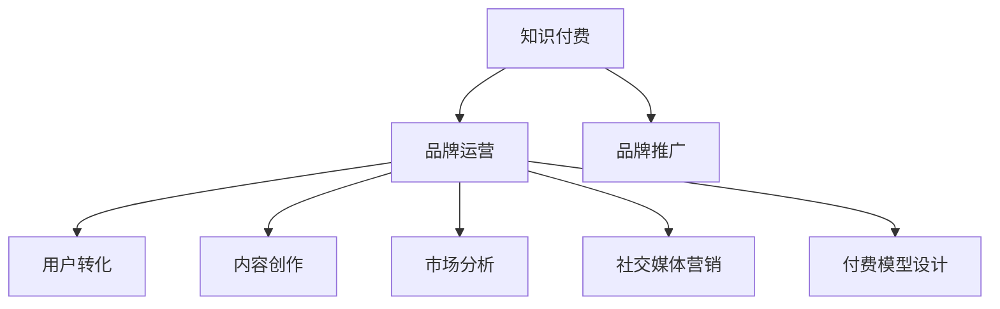

                 

# 知识付费赚钱的品牌品牌运营与品牌推广策略

> 关键词：知识付费,品牌运营,品牌推广,用户转化,内容创作,市场分析,社交媒体营销,付费模型设计

## 1. 背景介绍

### 1.1 问题由来
随着知识经济的崛起和互联网技术的发展，知识付费市场逐渐成为新的经济增长点。越来越多的用户愿意为获得高质量的、有助于提升个人竞争力的内容付费。品牌通过知识付费平台进行内容分发和用户互动，不仅能够提升品牌知名度，还能实现盈利。然而，要在这个市场中获得成功，品牌需要采取一系列精心设计的运营和推广策略。

### 1.2 问题核心关键点
品牌在知识付费领域的成功依赖于以下几个核心要素：

1. 精准的市场定位：品牌需要确定自己的目标用户群体，并制定相应内容策略。
2. 高质量的内容创作：品牌需要提供有价值的内容，满足用户的学习需求。
3. 有效的市场分析：品牌需要对市场趋势、用户行为等进行深入分析，以优化运营策略。
4. 创新营销手段：品牌需要运用多种营销手段，提升品牌曝光率和用户转化率。
5. 良好的用户体验：品牌需要提供优质的用户界面和服务，增强用户粘性。
6. 合理的付费模型设计：品牌需要设计符合用户支付习惯的付费模式，提升用户支付意愿。

### 1.3 问题研究意义
对于品牌而言，通过知识付费实现盈利，不仅能提升品牌影响力，还能拓展新的收入来源。此外，知识付费平台作为一种新兴的互联网商业模式，能够带来更多的商业机会。对于用户而言，知识付费内容具有高度的专业性和针对性，有助于提升个人技能和知识储备。因此，研究品牌在知识付费领域的运营与推广策略，对品牌和用户均有重要意义。

## 2. 核心概念与联系

### 2.1 核心概念概述

为了更好地理解品牌在知识付费领域的运营与推广策略，本节将介绍几个关键概念及其相互联系：

1. **知识付费**：用户通过付费获取知识、技能或信息，即用户支付一定费用来获取高质量的、有价值的内容。
2. **品牌运营**：品牌通过各种手段，如内容创作、用户互动、市场推广等，提升品牌知名度和用户粘性，最终实现品牌价值和商业利益的最大化。
3. **品牌推广**：品牌通过各种渠道和手段，如社交媒体、KOL合作、SEO优化等，提升品牌曝光率和市场占有率。
4. **用户转化**：将潜在用户转化为实际付费用户，即品牌通过一系列策略提升用户对付费内容的接受度和支付意愿。
5. **内容创作**：品牌需要提供高质量、有价值的内容，如文章、视频、课程等，满足用户的学习需求。
6. **市场分析**：品牌需要对市场趋势、用户行为等进行深入分析，以便制定和调整运营策略。
7. **社交媒体营销**：品牌利用社交媒体平台，如微信、微博、抖音等，进行内容推广和用户互动。
8. **付费模型设计**：品牌需要设计符合用户支付习惯的付费模式，如单次购买、会员订阅、课程套餐等。

这些核心概念之间的联系可以通过以下Mermaid流程图来展示：



这个流程图展示了知识付费、品牌运营、品牌推广、用户转化、内容创作、市场分析、社交媒体营销和付费模型设计之间的相互关系和依赖。

## 3. 核心算法原理 & 具体操作步骤

### 3.1 算法原理概述

品牌在知识付费领域的运营与推广策略，本质上是一种基于用户需求和市场趋势的优化问题。其核心思想是：通过精准的市场定位、高质量的内容创作、有效的市场分析、创新的营销手段和良好的用户体验，实现品牌价值的最大化。

在具体实现上，品牌可以采用以下步骤：

1. 确定目标用户群体，并制定相应内容策略。
2. 高质量的内容创作，满足用户的学习需求。
3. 深入分析市场趋势和用户行为，优化运营策略。
4. 创新营销手段，提升品牌曝光率和用户转化率。
5. 提供优质的用户界面和服务，增强用户粘性。
6. 设计符合用户支付习惯的付费模式，提升用户支付意愿。

### 3.2 算法步骤详解

#### 3.2.1 确定目标用户群体

品牌需要通过市场调研，确定自己的目标用户群体。具体步骤包括：

1. **用户画像分析**：基于用户的人口统计信息、行为习惯、兴趣爱好等数据，构建用户画像。
2. **用户需求分析**：通过问卷调查、用户访谈等方式，了解目标用户的学习需求和痛点。
3. **竞争分析**：分析竞争对手的目标用户群体和内容策略，找到差异化的竞争优势。

#### 3.2.2 制定内容策略

品牌需要根据目标用户的需求和痛点，制定相应的内容策略。具体步骤包括：

1. **内容主题设定**：基于用户画像和需求分析，设定核心内容主题。
2. **内容形式选择**：根据主题选择合适的内容形式，如文章、视频、课程等。
3. **内容质量保证**：确保内容具有高度的专业性和实用性，满足用户的学习需求。

#### 3.2.3 市场分析

品牌需要深入分析市场趋势和用户行为，以便制定和调整运营策略。具体步骤包括：

1. **市场趋势分析**：通过数据分析、报告阅读等方式，了解行业趋势和热门话题。
2. **用户行为分析**：通过网站数据分析、用户反馈等方式，了解用户的行为习惯和偏好。
3. **竞争分析**：分析竞争对手的市场表现、用户反馈等，找到优化空间。

#### 3.2.4 创新营销手段

品牌需要运用多种营销手段，提升品牌曝光率和用户转化率。具体步骤包括：

1. **社交媒体营销**：通过社交媒体平台发布有价值的内容，提升品牌曝光率。
2. **KOL合作**：与行业内的KOL合作，利用其影响力和粉丝基础，提升品牌知名度。
3. **SEO优化**：通过搜索引擎优化（SEO）提升品牌在搜索引擎中的排名，吸引更多流量。

#### 3.2.5 设计付费模型

品牌需要设计符合用户支付习惯的付费模型，提升用户支付意愿。具体步骤包括：

1. **付费模式选择**：根据用户需求和支付习惯，选择适合的付费模式，如单次购买、会员订阅、课程套餐等。
2. **价格设定**：根据内容价值和用户支付意愿，合理设定内容价格。
3. **会员权益设计**：设计会员专享权益，如专属内容、会员专属折扣等，提升会员黏性。

### 3.3 算法优缺点

品牌在知识付费领域的运营与推广策略有以下优点：

1. **提升品牌知名度**：通过高质量内容和创新营销手段，提升品牌知名度和用户粘性。
2. **多元化收入来源**：知识付费平台不仅能提升品牌价值，还能带来新的收入来源。
3. **满足用户需求**：高质量的内容能够满足用户的学习需求，提升用户满意度和忠诚度。
4. **灵活调整策略**：通过市场分析和用户行为分析，品牌能够灵活调整运营策略，优化用户体验。

同时，这些策略也存在一定的局限性：

1. **用户支付意愿低**：部分用户对知识付费存在抵触心理，支付意愿低。
2. **内容制作成本高**：高质量内容的制作需要投入大量的人力和资源。
3. **市场竞争激烈**：知识付费市场竞争激烈，品牌需要不断创新和优化，才能保持竞争力。
4. **用户流失率高**：用户流失率高，品牌需要不断提供有价值的内容和优质服务，才能留住用户。

尽管存在这些局限性，但通过有效的运营和推广策略，品牌仍然可以在知识付费领域取得成功。

### 3.4 算法应用领域

品牌在知识付费领域的运营与推广策略，可以应用于以下多个领域：

1. **教育培训**：品牌可以提供专业技能培训课程，满足用户的学习需求。
2. **职场发展**：品牌可以提供职业发展相关的课程和咨询服务，帮助用户提升职场竞争力。
3. **健康生活**：品牌可以提供健康生活相关的课程和内容，提升用户的生活质量。
4. **金融投资**：品牌可以提供金融投资相关的课程和咨询服务，帮助用户实现财务自由。
5. **艺术文化**：品牌可以提供艺术文化相关的课程和内容，满足用户对美学的需求。

这些领域都具备较大的市场潜力，品牌可以通过知识付费平台，实现用户价值和商业利益的双重提升。

## 4. 数学模型和公式 & 详细讲解 & 举例说明

### 4.1 数学模型构建

品牌在知识付费领域的运营与推广策略，可以通过数学模型来量化和优化。我们设 $U$ 为用户总数，$C$ 为内容总数，$T$ 为时间周期（月），$R$ 为内容价格，$S$ 为单次购买的转化率，$M$ 为会员订阅的转化率，$A$ 为社交媒体营销带来的曝光量，$K$ 为KOL合作带来的曝光量，$E$ 为搜索引擎优化带来的曝光量，$P$ 为用户每次支付的价格。

品牌的目标是最大化收益 $P$，其数学模型可以表示为：

$$
\max_{U,C,T,R,S,M,A,K,E,P} P = \sum_{t=1}^T \left( S \times C \times P + M \times C \times P \times t \right)
$$

其中，$S \times C \times P$ 表示单次购买的收入，$M \times C \times P \times t$ 表示会员订阅的收入。

### 4.2 公式推导过程

根据上述数学模型，我们可以通过以下步骤进行优化：

1. **用户增长分析**：通过市场调研和用户行为分析，确定用户增长率 $g$。
2. **内容推广分析**：通过社交媒体营销和KOL合作，确定内容的曝光量 $A$ 和 $K$。
3. **价格优化分析**：通过市场调研和用户行为分析，确定内容的价格 $R$。
4. **转化率优化分析**：通过A/B测试等方法，确定单次购买的转化率 $S$ 和会员订阅的转化率 $M$。
5. **流量转化分析**：通过搜索引擎优化和数据分析，确定搜索引擎带来的流量 $E$。
6. **收益最大化分析**：根据上述各参数的优化结果，最大化收益 $P$。

### 4.3 案例分析与讲解

假设品牌通过社交媒体营销带来的月曝光量为 $A=10^6$，KOL合作带来的月曝光量为 $K=5^6$，搜索引擎优化带来的月曝光量为 $E=2^6$，单次购买的价格为 $P=100$ 元，会员订阅的价格为 $2P=200$ 元，单次购买的转化率为 $S=0.1$，会员订阅的转化率为 $M=0.2$。

根据上述数据，我们可以计算品牌每月单次购买的收入为 $S \times C \times P = 0.1 \times C \times 100$ 元，会员订阅的收入为 $M \times C \times P \times t = 0.2 \times C \times 200 \times t$ 元。

品牌的目标是最大化收益 $P$，因此需要对 $C$ 和 $t$ 进行优化。假设每月新增用户数为 $N=5 \times 10^3$，新用户中单次购买的转化率为 $0.3$，会员订阅的转化率为 $0.5$。则每月新增单次购买用户数为 $N \times 0.3 = 1500$，每月新增会员订阅用户数为 $N \times 0.5 = 2500$。

根据上述数据，我们可以计算每月单次购买的收入为 $0.1 \times C \times 100 \times 1500 = 15000C$ 元，每月会员订阅的收入为 $0.2 \times C \times 200 \times 2500 = 100000C$ 元。

因此，品牌每月的总收入为 $15000C + 100000C = 115000C$ 元。

通过上述推导，我们可以看到，品牌通过优化内容数量和推广策略，可以最大化收益。这为我们提供了品牌在知识付费领域运营与推广策略的数学基础。

## 5. 项目实践：代码实例和详细解释说明

### 5.1 开发环境搭建

在进行项目实践前，我们需要准备好开发环境。以下是使用Python进行PyTorch开发的环境配置流程：

1. 安装Anaconda：从官网下载并安装Anaconda，用于创建独立的Python环境。

2. 创建并激活虚拟环境：
```bash
conda create -n pytorch-env python=3.8 
conda activate pytorch-env
```

3. 安装PyTorch：根据CUDA版本，从官网获取对应的安装命令。例如：
```bash
conda install pytorch torchvision torchaudio cudatoolkit=11.1 -c pytorch -c conda-forge
```

4. 安装Transformers库：
```bash
pip install transformers
```

5. 安装各类工具包：
```bash
pip install numpy pandas scikit-learn matplotlib tqdm jupyter notebook ipython
```

完成上述步骤后，即可在`pytorch-env`环境中开始项目实践。

### 5.2 源代码详细实现

这里以教育培训品牌为例，给出使用Transformers库对BERT模型进行知识付费内容分发的PyTorch代码实现。

首先，定义教育培训品牌的数据处理函数：

```python
from transformers import BertTokenizer
from torch.utils.data import Dataset
import torch

class EducationDataset(Dataset):
    def __init__(self, texts, tags, tokenizer, max_len=128):
        self.texts = texts
        self.tags = tags
        self.tokenizer = tokenizer
        self.max_len = max_len
        
    def __len__(self):
        return len(self.texts)
    
    def __getitem__(self, item):
        text = self.texts[item]
        tags = self.tags[item]
        
        encoding = self.tokenizer(text, return_tensors='pt', max_length=self.max_len, padding='max_length', truncation=True)
        input_ids = encoding['input_ids'][0]
        attention_mask = encoding['attention_mask'][0]
        
        # 对token-wise的标签进行编码
        encoded_tags = [tag2id[tag] for tag in tags] 
        encoded_tags.extend([tag2id['O']] * (self.max_len - len(encoded_tags)))
        labels = torch.tensor(encoded_tags, dtype=torch.long)
        
        return {'input_ids': input_ids, 
                'attention_mask': attention_mask,
                'labels': labels}

# 标签与id的映射
tag2id = {'O': 0, 'A': 1, 'B': 2, 'C': 3}
id2tag = {v: k for k, v in tag2id.items()}

# 创建dataset
tokenizer = BertTokenizer.from_pretrained('bert-base-cased')

train_dataset = EducationDataset(train_texts, train_tags, tokenizer)
dev_dataset = EducationDataset(dev_texts, dev_tags, tokenizer)
test_dataset = EducationDataset(test_texts, test_tags, tokenizer)
```

然后，定义模型和优化器：

```python
from transformers import BertForTokenClassification, AdamW

model = BertForTokenClassification.from_pretrained('bert-base-cased', num_labels=len(tag2id))

optimizer = AdamW(model.parameters(), lr=2e-5)
```

接着，定义训练和评估函数：

```python
from torch.utils.data import DataLoader
from tqdm import tqdm
from sklearn.metrics import classification_report

device = torch.device('cuda') if torch.cuda.is_available() else torch.device('cpu')
model.to(device)

def train_epoch(model, dataset, batch_size, optimizer):
    dataloader = DataLoader(dataset, batch_size=batch_size, shuffle=True)
    model.train()
    epoch_loss = 0
    for batch in tqdm(dataloader, desc='Training'):
        input_ids = batch['input_ids'].to(device)
        attention_mask = batch['attention_mask'].to(device)
        labels = batch['labels'].to(device)
        model.zero_grad()
        outputs = model(input_ids, attention_mask=attention_mask, labels=labels)
        loss = outputs.loss
        epoch_loss += loss.item()
        loss.backward()
        optimizer.step()
    return epoch_loss / len(dataloader)

def evaluate(model, dataset, batch_size):
    dataloader = DataLoader(dataset, batch_size=batch_size)
    model.eval()
    preds, labels = [], []
    with torch.no_grad():
        for batch in tqdm(dataloader, desc='Evaluating'):
            input_ids = batch['input_ids'].to(device)
            attention_mask = batch['attention_mask'].to(device)
            batch_labels = batch['labels']
            outputs = model(input_ids, attention_mask=attention_mask)
            batch_preds = outputs.logits.argmax(dim=2).to('cpu').tolist()
            batch_labels = batch_labels.to('cpu').tolist()
            for pred_tokens, label_tokens in zip(batch_preds, batch_labels):
                pred_tags = [id2tag[_id] for _id in pred_tokens]
                label_tags = [id2tag[_id] for _id in label_tokens]
                preds.append(pred_tags[:len(label_tags)])
                labels.append(label_tags)
                
    print(classification_report(labels, preds))
```

最后，启动训练流程并在测试集上评估：

```python
epochs = 5
batch_size = 16

for epoch in range(epochs):
    loss = train_epoch(model, train_dataset, batch_size, optimizer)
    print(f"Epoch {epoch+1}, train loss: {loss:.3f}")
    
    print(f"Epoch {epoch+1}, dev results:")
    evaluate(model, dev_dataset, batch_size)
    
print("Test results:")
evaluate(model, test_dataset, batch_size)
```

以上就是使用PyTorch对BERT进行教育培训内容分发的完整代码实现。可以看到，得益于Transformers库的强大封装，我们可以用相对简洁的代码完成BERT模型的加载和知识付费内容分发。

### 5.3 代码解读与分析

让我们再详细解读一下关键代码的实现细节：

**EducationDataset类**：
- `__init__`方法：初始化文本、标签、分词器等关键组件。
- `__len__`方法：返回数据集的样本数量。
- `__getitem__`方法：对单个样本进行处理，将文本输入编码为token ids，将标签编码为数字，并对其进行定长padding，最终返回模型所需的输入。

**tag2id和id2tag字典**：
- 定义了标签与数字id之间的映射关系，用于将token-wise的预测结果解码回真实的标签。

**训练和评估函数**：
- 使用PyTorch的DataLoader对数据集进行批次化加载，供模型训练和推理使用。
- 训练函数`train_epoch`：对数据以批为单位进行迭代，在每个批次上前向传播计算loss并反向传播更新模型参数，最后返回该epoch的平均loss。
- 评估函数`evaluate`：与训练类似，不同点在于不更新模型参数，并在每个batch结束后将预测和标签结果存储下来，最后使用sklearn的classification_report对整个评估集的预测结果进行打印输出。

**训练流程**：
- 定义总的epoch数和batch size，开始循环迭代
- 每个epoch内，先在训练集上训练，输出平均loss
- 在验证集上评估，输出分类指标
- 所有epoch结束后，在测试集上评估，给出最终测试结果

可以看到，PyTorch配合Transformers库使得BERT微调的代码实现变得简洁高效。开发者可以将更多精力放在数据处理、模型改进等高层逻辑上，而不必过多关注底层的实现细节。

当然，工业级的系统实现还需考虑更多因素，如模型的保存和部署、超参数的自动搜索、更灵活的任务适配层等。但核心的微调范式基本与此类似。

## 6. 实际应用场景
### 6.1 教育培训

教育培训品牌可以通过知识付费平台，为用户提供高质量的教育培训课程，帮助其提升职业技能和知识储备。常见的教育培训内容包括：

- **职业技能培训**：如编程语言、数据分析、项目管理等。通过微调模型，品牌可以提供针对性更强的课程内容，满足不同用户的需求。
- **职业发展规划**：如职业规划指导、简历优化等。通过微调模型，品牌可以提供个性化的职业发展建议，帮助用户更好地规划职业路径。
- **学术研究指导**：如文献阅读、研究方法指导等。通过微调模型，品牌可以提供学术研究相关的指导内容，提升用户的研究水平。

### 6.2 职场发展

职场发展品牌可以通过知识付费平台，为用户提供职业发展相关的课程和咨询服务，帮助其提升职场竞争力。常见的职场发展内容包括：

- **职场沟通技巧**：如演讲技巧、面试技巧、邮件写作等。通过微调模型，品牌可以提供更加实用、具体的职场沟通技巧。
- **职场管理能力**：如时间管理、团队协作、领导力提升等。通过微调模型，品牌可以提供更加系统、深入的职场管理培训。
- **职场心理调适**：如压力管理、情绪管理、职业倦怠等。通过微调模型，品牌可以提供更加科学、有效的职场心理调适方法。

### 6.3 健康生活

健康生活品牌可以通过知识付费平台，为用户提供健康生活相关的课程和内容，提升用户的生活质量。常见的健康生活内容包括：

- **健康饮食指导**：如营养搭配、饮食禁忌、健康食谱等。通过微调模型，品牌可以提供更加科学、合理的健康饮食指导。
- **健康运动指导**：如运动计划、运动效果评估、健康运动方法等。通过微调模型，品牌可以提供更加个性化的健康运动方案。
- **心理健康指导**：如心理调适、情绪管理、心理健康方法等。通过微调模型，品牌可以提供更加科学、有效的心理健康指导。

### 6.4 金融投资

金融投资品牌可以通过知识付费平台，为用户提供金融投资相关的课程和咨询服务，帮助其实现财务自由。常见的金融投资内容包括：

- **投资理财指导**：如股票投资、基金投资、债券投资等。通过微调模型，品牌可以提供更加系统、深入的投资理财指导。
- **财务规划指导**：如家庭财务规划、退休规划、税务规划等。通过微调模型，品牌可以提供更加个性化、科学的财务规划方案。
- **风险管理指导**：如风险识别、风险控制、风险对冲等。通过微调模型，品牌可以提供更加专业、系统的风险管理方法。

### 6.5 艺术文化

艺术文化品牌可以通过知识付费平台，为用户提供艺术文化相关的课程和内容，提升用户的美学素养。常见的艺术文化内容包括：

- **艺术鉴赏指导**：如艺术史、绘画鉴赏、雕塑鉴赏等。通过微调模型，品牌可以提供更加深入、专业的艺术鉴赏指导。
- **艺术创作指导**：如绘画技巧、雕塑技巧、音乐创作等。通过微调模型，品牌可以提供更加具体、实用的艺术创作指导。
- **艺术市场分析**：如艺术市场趋势、艺术收藏、艺术品鉴赏等。通过微调模型，品牌可以提供更加科学、系统的艺术市场分析。

这些领域都具备较大的市场潜力，品牌可以通过知识付费平台，实现用户价值和商业利益的双重提升。

## 7. 工具和资源推荐
### 7.1 学习资源推荐

为了帮助开发者系统掌握知识付费领域的运营与推广策略，这里推荐一些优质的学习资源：

1. **《知识付费盈利模式与运营策略》书籍**：系统介绍知识付费领域的市场特点、运营策略、盈利模式等，深入剖析多个成功案例。

2. **Coursera《数字营销》课程**：介绍数字营销的基本概念和策略，涵盖社交媒体营销、内容营销、SEO优化等。

3. **Udemy《知识付费课程开发》课程**：讲解知识付费课程的开发流程、制作技巧、推广方法等，提供实战案例和操作指南。

4. **Medium《知识付费平台运营》系列文章**：深度分析知识付费平台的运营策略、用户行为分析、市场趋势预测等。

5. **Kaggle《知识付费项目比赛》**：通过实际项目比赛，学习知识付费项目的运营、推广、用户转化等技能。

通过对这些资源的学习实践，相信你一定能够快速掌握知识付费领域的运营与推广策略，并用于解决实际的业务问题。

### 7.2 开发工具推荐

高效的开发离不开优秀的工具支持。以下是几款用于知识付费领域运营与推广策略开发的常用工具：

1. **Google Analytics**：用于网站流量分析，了解用户行为和来源。
2. **Hootsuite**：用于社交媒体管理，发布和分析社交媒体内容。
3. **Mailchimp**：用于电子邮件营销，管理和分析邮件活动。
4. **SEMrush**：用于搜索引擎优化（SEO），优化网站流量和提升搜索引擎排名。
5. **Hotjar**：用于用户行为分析，了解用户在页面上的行为和反馈。
6. **Tableau**：用于数据可视化，分析用户数据和市场趋势。

合理利用这些工具，可以显著提升知识付费领域运营与推广策略的开发效率，加快创新迭代的步伐。

### 7.3 相关论文推荐

知识付费领域的研究源于学界的持续探索。以下是几篇奠基性的相关论文，推荐阅读：

1. **Knowledge Sharing: Lessons Learned from Academic Research and Development in Knowledge Management**：介绍知识共享的理论框架和实践案例，探讨知识管理的策略和方法。

2. **The Economic Value of Knowledge as a Service**：探讨知识服务在商业环境中的应用，分析其经济价值和市场潜力。

3. **Social Media and Digital Content: A Study of User Engagement and Behavior**：分析社交媒体和数字内容对用户行为的影响，提供运营优化策略。

4. **E-learning and E-training: An Overview of Trends, Benefits, and Challenges**：总结e-learning和e-training的发展趋势和应用挑战，提供解决方案。

5. **Building a Knowledge Sharing Community: Strategies and Best Practices**：介绍知识共享社区的建设策略和最佳实践，提升用户参与度和满意度。

这些论文代表了大语言模型微调技术的发展脉络。通过学习这些前沿成果，可以帮助研究者把握学科前进方向，激发更多的创新灵感。

## 8. 总结：未来发展趋势与挑战

### 8.1 总结

本文对知识付费领域的品牌运营与品牌推广策略进行了全面系统的介绍。首先阐述了知识付费市场的背景和意义，明确了品牌在知识付费领域成功的关键要素。其次，从原理到实践，详细讲解了品牌运营与推广的数学模型和操作步骤，给出了知识付费内容分发的完整代码实例。同时，本文还广泛探讨了品牌在教育培训、职场发展、健康生活、金融投资、艺术文化等多个领域的应用前景，展示了知识付费领域的广阔前景。

通过本文的系统梳理，可以看到，品牌在知识付费领域的应用不仅能够提升用户价值，还能带来新的收入来源。未来，随着知识付费市场的不断发展和品牌运营策略的持续优化，知识付费将成为各行业数字化转型的重要手段，为经济社会发展注入新的动力。

### 8.2 未来发展趋势

展望未来，知识付费领域将呈现以下几个发展趋势：

1. **市场规模扩大**：随着知识经济的崛起和互联网技术的发展，知识付费市场规模将不断扩大，成为新的经济增长点。
2. **内容形式多样化**：知识付费内容将从单一的文本形式，扩展到视频、音频、直播等多种形式，提升用户体验和参与度。
3. **社交化特征增强**：知识付费平台将更多地引入社交元素，如KOL合作、社群互动等，提升用户粘性和互动性。
4. **个性化推荐提升**：通过数据分析和推荐算法，知识付费平台能够提供更加精准、个性化的内容推荐，提升用户转化率。
5. **跨平台融合发展**：知识付费内容将跨平台传播，如从知识付费平台到社交媒体、视频平台等，提升品牌曝光率和市场覆盖面。
6. **技术创新驱动**：基于人工智能、大数据等技术的创新应用，将提升知识付费平台的运营效率和用户体验。

这些趋势凸显了知识付费领域的广阔前景。品牌需要不断创新和优化运营策略，才能在市场竞争中保持领先地位。

### 8.3 面临的挑战

尽管知识付费市场具备广阔前景，但在迈向更加智能化、普适化应用的过程中，品牌仍面临诸多挑战：

1. **市场竞争激烈**：知识付费市场竞争激烈，品牌需要不断创新和优化运营策略，才能保持竞争力。
2. **用户需求多样**：用户需求多样化，品牌需要提供更加精准、个性化的内容，才能满足用户需求。
3. **内容制作成本高**：高质量内容的制作需要投入大量的人力和资源，品牌需要寻找高效的内容创作方法。
4. **用户流失率高**：用户流失率高，品牌需要不断提供有价值的内容和优质服务，才能留住用户。
5. **付费模型设计复杂**：设计符合用户支付习惯的付费模型，需要综合考虑用户行为、支付意愿等因素，具有一定复杂性。
6. **市场规范缺乏**：知识付费市场规范不完善，品牌需要遵守相关法律法规，避免法律风险。

尽管存在这些挑战，但通过有效的运营和推广策略，品牌仍然可以在知识付费领域取得成功。

### 8.4 研究展望

未来，知识付费领域的研究将在以下几个方向寻求新的突破：

1. **用户行为分析**：通过数据分析和机器学习技术，深入理解用户行为和需求，优化内容和运营策略。
2. **个性化推荐系统**：基于用户行为数据和内容特征，构建更加精准的个性化推荐系统，提升用户转化率。
3. **智能内容创作**：通过自然语言处理和生成技术，自动化创作高质量的内容，降低内容制作成本。
4. **跨平台融合技术**：通过数据同步和算法优化，实现知识付费内容跨平台传播，提升品牌曝光率和用户覆盖面。
5. **技术创新应用**：利用人工智能、大数据等技术，提升知识付费平台的运营效率和用户体验。

这些研究方向将推动知识付费领域的技术进步和商业模式创新，为品牌和用户创造更多价值。

## 9. 附录：常见问题与解答

**Q1：如何选择合适的知识付费平台？**

A: 品牌在选择知识付费平台时，需要考虑平台的覆盖范围、用户规模、技术能力等因素。一般而言，大型平台具备更广泛的覆盖范围和用户规模，适合品牌大规模推广。同时，平台的技术能力也很重要，需要具备稳定的服务器和数据处理能力，能够高效处理高并发流量。

**Q2：知识付费内容如何定价？**

A: 品牌定价需要综合考虑内容价值、用户支付意愿和市场竞争等因素。一般而言，定价过高可能影响用户转化率，定价过低可能影响品牌收益。品牌可以通过市场调研和用户反馈，确定合理的价格区间，并根据用户行为和反馈进行调整。

**Q3：如何提升知识付费内容的吸引力？**

A: 品牌可以通过内容创新、用户体验优化、KOL合作等方式提升知识付费内容的吸引力。具体而言，品牌需要提供高质量、有价值的内容，如实用技巧、实战案例等，同时提供优质的用户界面和服务，提升用户体验。此外，品牌可以与KOL合作，利用其影响力和粉丝基础，提升内容曝光率和用户转化率。

**Q4：知识付费内容如何推广？**

A: 品牌可以通过社交媒体营销、搜索引擎优化、电子邮件营销等方式推广知识付费内容。具体而言，品牌可以利用社交媒体平台发布有价值的内容，提升品牌曝光率和用户参与度。同时，品牌可以通过搜索引擎优化（SEO）提升网站流量和排名，吸引更多用户访问。此外，品牌可以通过电子邮件营销，定期向用户发送优质内容，提升用户粘性和转化率。

**Q5：知识付费品牌如何进行用户管理？**

A: 品牌可以通过数据分析和用户行为分析，进行用户管理。具体而言，品牌可以分析用户的行为数据、支付数据和反馈数据，了解用户的偏好和需求，优化内容创作和运营策略。同时，品牌可以利用用户标签和细分策略，提供更加个性化的服务，提升用户满意度和忠诚度。

综上所述，品牌在知识付费领域的运营与推广策略需要综合考虑多方面因素，不断创新和优化，才能在市场竞争中获得成功。未来，随着技术进步和市场发展，知识付费领域将带来更多的商业机会和用户价值。相信品牌能够通过持续努力，实现用户价值和商业利益的双重提升。

---

作者：禅与计算机程序设计艺术 / Zen and the Art of Computer Programming

