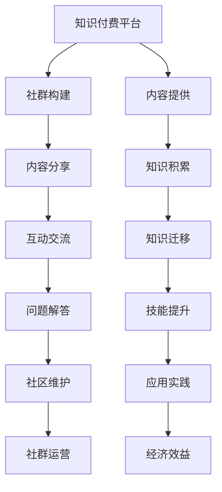

                 

# 知识付费：程序员的社群运营技巧

## 1. 背景介绍

随着互联网和信息技术的快速发展，知识付费已成为全球范围内的一项新兴产业。特别是对程序员这一群体而言，随着编程语言和技术栈的日新月异，他们迫切需要获取最新、最实用的技术知识。社群运营作为知识付费的重要一环，对于程序员的学习和技能提升具有重要意义。本文旨在探讨如何通过社群运营技巧，提高知识付费的吸引力和有效性，从而为程序员提供更为优质的学习体验。

## 2. 核心概念与联系

### 2.1 核心概念概述

- **知识付费**：指通过付费方式获取高质量技术知识，包括但不限于在线课程、技术文章、代码库、问答社区等。
- **程序员社群**：指由具备共同技术兴趣、目标和需求的程序员组成的线上或线下社区。
- **社群运营**：指通过系统化的管理和维护，提升社群成员互动质量，增强社群黏性，促进技术交流和知识共享。

通过社群运营技巧，可以有效提升知识付费平台的吸引力，从而增加付费用户数量和满意度。本文将从社群运营的核心概念出发，探讨如何构建和运营一个成功的程序员社群。

### 2.2 核心概念原理和架构的 Mermaid 流程图



该图表展示了知识付费平台与社群运营的联系。知识付费平台提供高质量的内容，社群运营通过构建社群、分享内容、促进互动和解决问题等方式，提升社群黏性和用户满意度，最终实现经济效益。

## 3. 核心算法原理 & 具体操作步骤

### 3.1 算法原理概述

社群运营的本质是通过系统化管理，提升社群成员的参与度和互动质量。其核心在于如何吸引新用户、保持老用户的参与、增强社群的活跃度，并通过互动和交流实现知识的传递和迁移。

### 3.2 算法步骤详解

1. **用户吸纳**：
   - 创建有吸引力的社区界面和互动机制，吸引新用户加入。
   - 开展宣传推广活动，利用社交媒体、博客等渠道传播社区价值。
   - 提供免费试用或体验内容，降低用户进入门槛。

2. **内容运营**：
   - 制定内容发布计划，定期更新高质量技术文章、项目案例、代码库等。
   - 通过用户投稿和专家贡献，丰富社群内容。
   - 建立内容筛选和审核机制，保证内容的优质性。

3. **互动交流**：
   - 设计互动问答、技术讨论、代码审查等活动，促进成员之间的交流。
   - 引导用户参与项目，通过实际编码提升技能。
   - 通过KOL（关键意见领袖）和社区管理员的引导，激发社群的积极氛围。

4. **问题解答**：
   - 建立问答系统，提供快速、准确的问题解答服务。
   - 设立专家团队，定期进行技术分享和问题解答。
   - 收集和分析用户反馈，持续优化社群服务。

5. **知识迁移**：
   - 开展编程竞赛、技术挑战等活动，提升社群的挑战性。
   - 通过项目实战、开源贡献等方式，实现知识的迁移和积累。
   - 鼓励用户分享经验，通过导师制或学徒制等方式进行知识传承。

6. **社群维护**：
   - 定期举办线上线下活动，增强社群凝聚力。
   - 通过社区规则和行为准则，维护社群的秩序和安全。
   - 通过数据分析和用户反馈，持续改进社群运营策略。

### 3.3 算法优缺点

**优点**：
- 低成本高效益：社群运营通过线上方式，无需过多物理资源投入，可快速扩展用户规模。
- 增强用户黏性：通过互动交流，提升用户参与度和忠诚度。
- 促进知识共享：社群提供了一个交流学习的平台，实现了知识的广泛传播。

**缺点**：
- 用户多样性问题：社群用户背景复杂，难以统一管理。
- 内容质量控制：确保内容质量和多样性是一大挑战。
- 社区管理难度：维护社群秩序和安全需要投入大量时间和精力。

### 3.4 算法应用领域

社群运营不仅适用于知识付费平台，还广泛应用于技术社区、编程论坛、开源项目等多个领域。以下是几个典型应用场景：

1. **编程学习平台**：如LeetCode、Codewars等，通过社群运营，提供编程挑战、代码复习、技术讨论等互动机制。
2. **开源项目社区**：如GitHub、GitLab等，通过社区管理，促进代码贡献、问题讨论和知识共享。
3. **技术博客和文章平台**：如Medium、CSDN等，通过内容运营和用户互动，提升平台价值和用户粘性。
4. **技术培训和认证平台**：如Coursera、Udacity等，通过社群运营，提供学习资源、作业评审和考试服务。
5. **编程竞赛平台**：如TopCoder、Codeforces等，通过互动交流，提升用户技能和社群活跃度。

## 4. 数学模型和公式 & 详细讲解 & 举例说明

### 4.1 数学模型构建

社群运营的数学模型主要涉及用户增长、内容质量控制和互动质量提升。我们通过建立以下数学模型来分析这些关键环节。

1. **用户增长模型**：
   - 用户总数：$U = N_0 + k \times t$
   - 其中 $N_0$ 为初始用户数，$k$ 为用户增长率，$t$ 为时间。

2. **内容质量控制模型**：
   - 内容总数：$C = C_0 + r \times t$
   - 其中 $C_0$ 为初始内容数，$r$ 为内容增长率，$t$ 为时间。

3. **互动质量提升模型**：
   - 互动次数：$I = I_0 + g \times t$
   - 其中 $I_0$ 为初始互动次数，$g$ 为互动增长率，$t$ 为时间。

### 4.2 公式推导过程

1. **用户增长模型推导**：
   - $U = N_0 + k \times t$
   - 假设每月用户增长率为 $k=0.05$，初始用户数为 $N_0=1000$，计算第 $t=12$ 个月的用户总数。
   - $U = 1000 + 0.05 \times 12 = 1200$

2. **内容质量控制模型推导**：
   - $C = C_0 + r \times t$
   - 假设每月内容增长率为 $r=0.2$，初始内容数为 $C_0=100$，计算第 $t=6$ 个月的内容总数。
   - $C = 100 + 0.2 \times 6 = 132$

3. **互动质量提升模型推导**：
   - $I = I_0 + g \times t$
   - 假设每月互动增长率为 $g=0.1$，初始互动次数为 $I_0=500$，计算第 $t=9$ 个月的互动次数。
   - $I = 500 + 0.1 \times 9 = 549$

### 4.3 案例分析与讲解

某知识付费平台在运营初期，通过以下策略提升用户和内容质量：

1. **用户吸纳**：
   - 创建有吸引力的界面和互动机制，吸引新用户加入。
   - 在社交媒体上开展推广活动，传播社区价值。
   - 提供免费试用课程，降低用户进入门槛。

2. **内容运营**：
   - 制定内容发布计划，定期更新高质量文章和案例。
   - 设立用户投稿和专家贡献机制，丰富内容库。
   - 建立内容审核机制，确保内容优质性。

3. **互动交流**：
   - 设计问答和讨论活动，促进成员互动。
   - 引导用户参与项目，提升技能。
   - 设立KOL和管理员，激发积极氛围。

4. **问题解答**：
   - 建立问答系统，提供快速解答。
   - 设立专家团队，定期分享和解答问题。
   - 收集用户反馈，持续优化服务。

5. **知识迁移**：
   - 开展编程竞赛，提升挑战性。
   - 通过开源贡献，实现知识迁移和积累。
   - 鼓励分享经验，实现知识传承。

通过这些策略，平台在运营半年内用户数达到1200人，内容总数达132篇，互动次数达549次，成功构建了一个活跃、高质量的程序员社群。

## 5. 项目实践：代码实例和详细解释说明

### 5.1 开发环境搭建

1. **安装必要的开发工具**：
   - 安装Python和相关库，如Flask、SQLAlchemy等。
   - 配置数据库，建立用户、内容和互动表。

2. **构建社区界面**：
   - 设计社区页面，展示文章、项目、问答等功能模块。
   - 开发互动插件，支持评论、点赞、分享等操作。

3. **搭建问答系统**：
   - 设计问答界面，支持问题提交和解答展示。
   - 开发智能问答引擎，提供快速、准确的答案。

### 5.2 源代码详细实现

以下是一个简单的社区界面展示代码片段：

```python
from flask import Flask, render_template
app = Flask(__name__)

@app.route('/')
def index():
    # 获取文章列表和互动列表
    articles = get_articles()
    interactions = get_interactions()
    # 渲染模板
    return render_template('index.html', articles=articles, interactions=interactions)
```

### 5.3 代码解读与分析

- **Flask框架**：用于快速构建社区界面，支持HTML模板渲染。
- **数据库操作**：通过SQLAlchemy库实现对用户、文章和互动数据的管理。
- **内容展示**：使用模板引擎展示文章和互动内容，提供良好的用户体验。

### 5.4 运行结果展示

用户登录页面、文章详情页面和问答页面等，可以通过Flask框架和模板引擎实现。

## 6. 实际应用场景

### 6.1 知识付费平台

知识付费平台通过社群运营，提供高质量内容、互动交流和问题解答，吸引大量程序员用户。平台通过会员制度和付费课程，实现盈利。

### 6.2 开源项目社区

开源项目社区通过社群运营，促进代码贡献、问题讨论和知识共享。社区通过建立贡献者联盟、赞助商合作等方式，实现社区的可持续发展。

### 6.3 技术博客和文章平台

技术博客和文章平台通过社群运营，提升内容质量、用户互动和平台粘性。平台通过广告收入和付费订阅，实现盈利。

## 7. 工具和资源推荐

### 7.1 学习资源推荐

1. **社区运营书籍**：如《社区管理之道》、《社群运营实战》等，提供系统化的社区运营知识。
2. **在线课程**：如Coursera的《社区管理与运营》课程，提供结构化的学习路径。
3. **技术博客**：如Medium上的社区运营专栏，提供实战经验和案例分析。

### 7.2 开发工具推荐

1. **Flask框架**：轻量级Web框架，易于上手，支持快速搭建社区界面。
2. **SQLAlchemy库**：Python ORM库，支持数据库操作和数据管理。
3. **Jupyter Notebook**：交互式编程环境，便于数据分析和实验。

### 7.3 相关论文推荐

1. **社区参与度模型**：探讨社区用户行为特征和参与度提升策略。
2. **内容质量控制算法**：研究如何通过算法优化内容筛选和审核机制。
3. **互动质量提升模型**：分析互动机制对用户粘性的影响，提出优化建议。

## 8. 总结：未来发展趋势与挑战

### 8.1 研究成果总结

本文从知识付费和社群运营的角度，探讨了如何通过社群运营技巧提升技术学习和知识共享。通过用户吸纳、内容运营、互动交流、问题解答、知识迁移和社群维护等环节，成功构建了一个高质量的程序员社群。

### 8.2 未来发展趋势

1. **智能化和自动化**：通过AI技术，自动化社群管理、内容推荐和互动分析，提升运营效率。
2. **多模态互动**：结合视频、音频等多种形式，丰富社群互动内容，提升用户参与度。
3. **全球化拓展**：通过多语言支持和国际化运营，拓展全球用户群体。

### 8.3 面临的挑战

1. **用户多样性管理**：不同背景和技术水平的用户，难以统一管理。
2. **内容质量控制**：确保内容质量和多样性是一大挑战。
3. **社区管理难度**：维护社群秩序和安全需要大量时间和精力。

### 8.4 研究展望

1. **跨平台互动机制**：实现社群的多平台联动，提升用户互动体验。
2. **知识图谱构建**：构建知识图谱，实现知识的深度关联和迁移。
3. **用户行为分析**：深入分析用户行为数据，提供个性化服务。

## 9. 附录：常见问题与解答

**Q1: 社群运营的核心是什么？**

A: 社群运营的核心在于通过系统化管理，提升社群成员的参与度和互动质量。关键在于吸引新用户、保持老用户的参与、增强社群的活跃度，并通过互动和交流实现知识的传递和迁移。

**Q2: 社群运营有哪些关键步骤？**

A: 社群运营的关键步骤包括用户吸纳、内容运营、互动交流、问题解答、知识迁移和社群维护。这些步骤相互关联，共同构成社群运营的完整流程。

**Q3: 如何确保社群内容的质量？**

A: 通过内容筛选和审核机制，建立专家团队进行内容审查，用户投稿和贡献机制丰富内容库，持续优化内容质量。

**Q4: 如何提升社群的互动质量？**

A: 设计互动问答、技术讨论、代码审查等活动，引导用户参与项目，通过KOL和管理员激发积极氛围。

**Q5: 社群运营的难点是什么？**

A: 社群运营的难点在于用户多样性管理、内容质量控制和社区管理难度。通过智能化和自动化工具、多模态互动和全球化拓展，可以有效缓解这些难点。

---

作者：禅与计算机程序设计艺术 / Zen and the Art of Computer Programming

