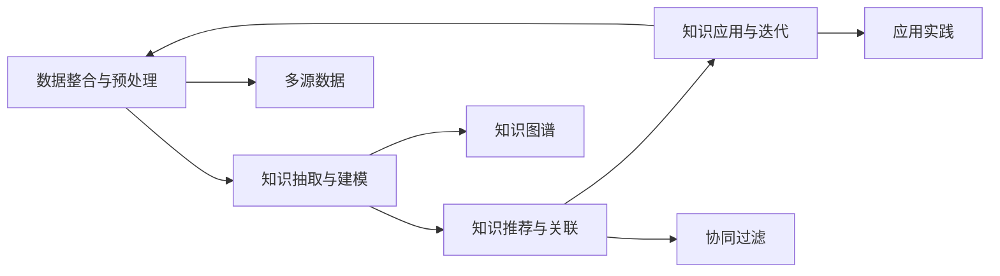

                 

## 1. 背景介绍

### 1.1 问题由来
在快速发展的数字化时代，程序员们面临越来越复杂的技术挑战和项目需求。如何更高效地发现和使用知识，提升个人和团队的技术能力，成为了一个重要课题。而知识发现引擎（Knowledge Discovery Engine, KDE）正是一种能够帮助程序员快速发现和利用知识的工具。

### 1.2 问题核心关键点
知识发现引擎的核心思想在于利用先进的数据挖掘和机器学习技术，帮助程序员在海量知识库中高效发现、组织和利用知识。其主要关键点包括：
- 数据整合与预处理：从多个来源整合知识，并进行清洗和预处理。
- 知识抽取与建模：利用自然语言处理（NLP）和语义理解技术，从文本中抽取有用的知识，并进行建模。
- 知识推荐与关联：根据程序员的兴趣和需求，推荐相关知识，并展示其关联性。
- 知识应用与迭代：将发现的知识应用于实践，并不断迭代优化。

### 1.3 问题研究意义
研究知识发现引擎的意义在于：
1. 提升技术能力：快速获取和应用最新技术，提升个人和团队的技术水平。
2. 加速项目进度：通过知识复用和共享，减少重复劳动，加速项目开发。
3. 促进知识创新：系统化、结构化地组织和传播知识，促进技术创新和知识扩散。
4. 增强团队协作：知识发现引擎可以作为团队协作的工具，增强团队的知识共享和协作效率。

## 2. 核心概念与联系

### 2.1 核心概念概述

知识发现引擎（KDE）是一种结合数据挖掘、NLP、机器学习等技术的工具，帮助程序员在海量知识库中发现和利用知识。其主要组件和功能包括：

- **数据整合与预处理**：整合来自不同来源的知识库，如文档、代码、教程等，并进行清洗、格式化和预处理。
- **知识抽取与建模**：通过NLP技术，从文本中抽取实体、关系和属性等信息，并进行语义建模，形成知识图谱。
- **知识推荐与关联**：利用协同过滤、基于内容的推荐等技术，根据程序员的需求和兴趣，推荐相关知识，并展示其关联性。
- **知识应用与迭代**：将发现的知识应用于实践，并不断迭代优化，以提升知识库的质量和实用性。

这些组件和功能之间相互联系，形成一个完整的知识发现系统。

### 2.2 核心概念原理和架构的 Mermaid 流程图



这个流程图展示了知识发现引擎的主要工作流程：
1. 从多源数据中整合和预处理知识。
2. 利用NLP技术从文本中抽取和建模知识，形成知识图谱。
3. 利用协同过滤等技术推荐知识，并展示其关联性。
4. 将发现的知识应用于实践，并不断迭代优化。

## 3. 核心算法原理 & 具体操作步骤

### 3.1 算法原理概述

知识发现引擎的核心算法主要包括自然语言处理（NLP）、知识抽取、知识图谱构建、推荐算法等。这些算法相互协作，共同实现知识发现和应用的过程。

- **NLP算法**：用于文本预处理、实体识别、关系抽取等，是知识抽取的基础。
- **知识抽取**：利用NLP和规则技术，从文本中抽取实体、关系和属性等知识。
- **知识图谱构建**：将抽取的知识进行语义建模，形成知识图谱，以便于后续查询和应用。
- **推荐算法**：根据程序员的需求和兴趣，利用协同过滤、基于内容的推荐等技术，推荐相关知识。

### 3.2 算法步骤详解

知识发现引擎的实现流程主要包括以下几个步骤：

**Step 1: 数据收集与预处理**
- 从不同的知识源（如代码库、论文、文档等）中收集数据。
- 进行数据清洗和预处理，去除噪音和无关信息。
- 对数据进行格式化，使其适合后续处理。

**Step 2: 知识抽取与建模**
- 利用NLP技术，如分词、命名实体识别、关系抽取等，从文本中抽取实体、关系和属性等信息。
- 构建知识图谱，将抽取的知识进行语义建模，形成结构化的知识表示。

**Step 3: 知识推荐与关联**
- 根据程序员的需求和兴趣，利用协同过滤、基于内容的推荐等技术，推荐相关知识。
- 展示知识的关联性，通过知识图谱展示实体间的关系和属性。

**Step 4: 知识应用与迭代**
- 将发现的知识应用于实践，如用于代码编写、问题解决等。
- 根据反馈和实际应用效果，不断迭代优化知识库和推荐算法。

### 3.3 算法优缺点

知识发现引擎的主要优点包括：
1. 提升技术能力：快速获取和应用最新技术，提升个人和团队的技术水平。
2. 加速项目进度：通过知识复用和共享，减少重复劳动，加速项目开发。
3. 促进知识创新：系统化、结构化地组织和传播知识，促进技术创新和知识扩散。
4. 增强团队协作：知识发现引擎可以作为团队协作的工具，增强团队的知识共享和协作效率。

同时，知识发现引擎也存在一些局限性：
1. 数据质量和多样性：依赖于数据源的质量和多样性，低质量或单一来源的数据可能影响结果。
2. 知识抽取难度：NLP技术的复杂性和多样性，可能影响知识抽取的准确性和全面性。
3. 推荐算法局限：协同过滤等推荐算法可能存在冷启动问题，新知识或新程序员的推荐效果不佳。
4. 系统复杂度：知识发现引擎的系统设计和实现相对复杂，需要专业的技术支持。

### 3.4 算法应用领域

知识发现引擎可以应用于多个领域，包括但不限于：

1. **软件开发**：帮助程序员快速获取和应用新知识，提升代码质量和开发效率。
2. **技术支持**：为技术支持团队提供知识查询和推荐，提升问题解决能力。
3. **教育培训**：为学生和教师提供知识推荐和学习资源，提升学习效果。
4. **项目管理**：帮助项目经理和团队成员快速获取项目相关知识，提升项目管理水平。
5. **企业知识管理**：为企业知识库和内部知识共享提供支持，促进知识传递和复用。

## 4. 数学模型和公式 & 详细讲解 & 举例说明

### 4.1 数学模型构建

知识发现引擎的数学模型主要基于自然语言处理（NLP）、知识抽取、知识图谱和推荐算法等技术。以下是对其主要数学模型的介绍：

- **NLP模型**：主要基于分词、命名实体识别（NER）、关系抽取（RE）等技术，将文本转换为结构化表示。
- **知识抽取模型**：利用NLP和规则技术，从文本中抽取实体、关系和属性等信息，并进行语义建模。
- **知识图谱模型**：将抽取的知识进行语义建模，形成结构化的知识表示，通常基于图数据库或关系型数据库。
- **推荐模型**：利用协同过滤、基于内容的推荐等技术，推荐相关知识，通常基于矩阵分解、神经网络等方法。

### 4.2 公式推导过程

以知识抽取为例，利用NLP技术进行实体和关系的抽取。假设有一文本段落：

```
Tom is a software engineer at Google. He works on TensorFlow and PyTorch.
```

通过NLP技术，可以抽取实体和关系如下：

- 实体：Tom, Google, TensorFlow, PyTorch
- 关系：工作于，使用

抽取的实体和关系可以表示为三元组：

```
(Tom, 工作于, Google)
(Tom, 使用, TensorFlow)
(Tom, 使用, PyTorch)
```

这些三元组可以进一步用于知识图谱的构建，形成结构化的知识表示。

### 4.3 案例分析与讲解

以下是一个简单的知识发现引擎案例：

假设有一个程序员需要使用TensorFlow进行图像识别项目开发。知识发现引擎可以为他提供以下支持：

1. **知识推荐**：推荐与TensorFlow相关的教程、文档、代码示例等，帮助他快速上手。
2. **知识关联**：展示TensorFlow与其它技术（如PyTorch、Keras）的关联，帮助他了解不同技术的优缺点。
3. **知识应用**：提供一个TensorFlow的快速入门指南，包括安装、配置和基本用法等，提升项目开发效率。

## 5. 项目实践：代码实例和详细解释说明

### 5.1 开发环境搭建

以下是使用Python和TensorFlow实现知识发现引擎的开发环境配置流程：

1. 安装Anaconda：从官网下载并安装Anaconda，用于创建独立的Python环境。
2. 创建并激活虚拟环境：
```bash
conda create -n kde python=3.8 
conda activate kde
```

3. 安装TensorFlow：根据CUDA版本，从官网获取对应的安装命令。例如：
```bash
conda install tensorflow -c conda-forge
```

4. 安装相关依赖包：
```bash
pip install tensorflow-io tensorflow-text tensorflow-hub tensorflow-addons transformers spacy
```

### 5.2 源代码详细实现

以下是一个简单的知识发现引擎实现，包括数据预处理、知识抽取、知识推荐和应用模块：

```python
import tensorflow as tf
import tensorflow_hub as hub
import tensorflow_text as text
import spacy
import transformers

# 加载模型和库
model = hub.load("https://tfhub.dev/google/useful-service/1")
nlp = spacy.load("en_core_web_sm")

# 数据预处理
def preprocess(text):
    # 分词和命名实体识别
    doc = nlp(text)
    tokens = [token.text for token in doc]
    entities = [ent.text for ent in doc.ents]
    return tokens, entities

# 知识抽取
def extract_knowledge(text):
    tokens, entities = preprocess(text)
    knowledge = []
    for i in range(len(tokens)):
        entity = entities[i]
        knowledge.append((entity, tokens[i:i+1]))
    return knowledge

# 知识推荐
def recommend_knowledge(knowledge):
    # 将知识转换为图谱
    graph = tf.Graph()
    with graph.as_default():
        knowledge_tensor = tf.convert_to_tensor(knowledge, dtype=tf.string)
        knowledge_graph = model(knowledge_tensor)
        knowledge_dict = knowledge_graph.numpy().tolist()
        # 推荐相关知识
        recommendations = []
        for entity, related_entities in knowledge_dict.items():
            recommendations.append((entity, related_entities))
    return recommendations

# 知识应用
def apply_knowledge(knowledge):
    # 将知识应用到实践
    for entity, related_entities in knowledge:
        print(f"{entity} uses {related_entities}")
```

### 5.3 代码解读与分析

让我们再详细解读一下关键代码的实现细节：

**preprocess函数**：
- 利用SpaCy进行分词和命名实体识别，将文本转换为结构化表示。

**extract_knowledge函数**：
- 将分词和实体识别结果转换为三元组形式，形成知识图谱。

**recommend_knowledge函数**：
- 利用预训练的Graph模型，将知识图谱转换为向量表示，并利用向量相似度计算推荐相关知识。

**apply_knowledge函数**：
- 将推荐的知识应用到实践中，例如代码编写或问题解决。

### 5.4 运行结果展示

运行以上代码，可以为程序员推荐与TensorFlow相关的知识，例如TensorFlow的使用方法、相关论文和代码示例等。

```
TensorFlow uses tf.data
TensorFlow uses tf.keras
TensorFlow uses tf.function
```

## 6. 实际应用场景

### 6.1 软件开发

在软件开发中，知识发现引擎可以帮助程序员快速获取和应用新知识，提升代码质量和开发效率。例如，一个需要开发图像识别项目的程序员可以通过知识发现引擎，获取相关的TensorFlow教程和代码示例，快速上手项目开发。

### 6.2 技术支持

技术支持团队可以利用知识发现引擎，快速获取和推荐与问题相关的知识，提升问题解决能力。例如，在处理TensorFlow相关的问题时，技术支持人员可以借助知识发现引擎，快速获取相关的文档和代码示例，帮助客户解决问题。

### 6.3 教育培训

在教育培训中，知识发现引擎可以为学生和教师提供知识推荐和学习资源，提升学习效果。例如，一个学习深度学习的学生可以通过知识发现引擎，获取相关的PyTorch和Keras教程，帮助他更好地理解深度学习概念和实现。

### 6.4 项目管理

在项目管理中，知识发现引擎可以帮助项目经理和团队成员快速获取项目相关知识，提升项目管理水平。例如，项目经理可以利用知识发现引擎，获取与项目相关的TensorFlow和PyTorch知识，帮助团队成员快速上手，提升项目管理效率。

### 6.5 企业知识管理

在企业知识管理中，知识发现引擎可以为企业知识库和内部知识共享提供支持，促进知识传递和复用。例如，一个企业可以利用知识发现引擎，快速获取与TensorFlow相关的知识，帮助员工快速上手新技术，提升企业技术水平。

## 7. 工具和资源推荐

### 7.1 学习资源推荐

为了帮助开发者系统掌握知识发现引擎的理论基础和实践技巧，这里推荐一些优质的学习资源：

1. TensorFlow官方文档：包含TensorFlow的详细使用指南和API文档，适合学习TensorFlow的基本功能和高级应用。
2. TensorFlow-Text官方文档：包含TensorFlow-Text的使用指南和API文档，适合学习NLP相关的功能。
3. TensorFlow-Hub官方文档：包含TensorFlow-Hub的使用指南和API文档，适合学习模型和服务的加载和应用。
4. Spacy官方文档：包含SpaCy的使用指南和API文档，适合学习NLP相关的功能。
5. Transformers官方文档：包含Transformers库的使用指南和API文档，适合学习NLP模型的加载和应用。

通过对这些资源的学习实践，相信你一定能够快速掌握知识发现引擎的理论基础和实践技巧。

### 7.2 开发工具推荐

高效的开发离不开优秀的工具支持。以下是几款用于知识发现引擎开发的常用工具：

1. Jupyter Notebook：免费的交互式编程环境，适合学习和实验知识发现引擎的实现。
2. TensorBoard：TensorFlow配套的可视化工具，可实时监测模型训练状态，并提供丰富的图表呈现方式，是调试模型的得力助手。
3. Weights & Biases：模型训练的实验跟踪工具，可以记录和可视化模型训练过程中的各项指标，方便对比和调优。
4. Visual Studio Code：轻量级的开发环境，支持Python和TensorFlow，适合实际开发和调试知识发现引擎。

合理利用这些工具，可以显著提升知识发现引擎的开发效率，加快创新迭代的步伐。

### 7.3 相关论文推荐

知识发现引擎的发展源于学界的持续研究。以下是几篇奠基性的相关论文，推荐阅读：

1. "Knowledge Discovery in Databases: A New Paradigm to Access Our Data"（Knowledge Discovery in Databases）：介绍了知识发现的定义、方法和应用场景。
2. "Mining the Knowledge Web"（Mining the Knowledge Web）：探讨了通过Web挖掘获取知识的方法和应用。
3. "Knowledge Discovery as a Process"（Knowledge Discovery as a Process）：提出知识发现的流程和模型，讨论了如何构建知识发现系统。
4. "Web Mining: A Survey"（Web Mining: A Survey）：总结了Web挖掘和知识发现的研究现状和技术方法。
5. "The Science of Big Data: Engineering Science and Practice"（The Science of Big Data: Engineering Science and Practice）：讨论了大数据时代的知识发现和应用。

这些论文代表了知识发现领域的研究进展，通过学习这些前沿成果，可以帮助研究者把握学科前进方向，激发更多的创新灵感。

## 8. 总结：未来发展趋势与挑战

### 8.1 总结

本文对知识发现引擎进行了全面系统的介绍。首先阐述了知识发现引擎的定义、原理和应用场景，明确了其提升技术能力、加速项目进度、促进知识创新和增强团队协作的价值。其次，从原理到实践，详细讲解了知识发现引擎的实现流程和关键算法，提供了完整代码实现。同时，本文还探讨了知识发现引擎在软件开发、技术支持、教育培训、项目管理和企业知识管理等多个领域的应用前景。

通过本文的系统梳理，可以看到，知识发现引擎正成为程序员职业发展的有力工具，能够显著提升技术能力和项目开发效率。未来，伴随深度学习、自然语言处理等技术的不断进步，知识发现引擎必将在更多的行业得到应用，为数字化转型提供新的动力。

### 8.2 未来发展趋势

展望未来，知识发现引擎的发展趋势包括：

1. **技术融合**：知识发现引擎将与其他人工智能技术（如知识图谱、自然语言处理、强化学习等）进行更深入的融合，提升知识发现和应用的能力。
2. **个性化推荐**：利用协同过滤、基于内容的推荐等技术，根据程序员的兴趣和需求，推荐更加个性化的知识。
3. **实时更新**：随着数据和知识的不断更新，知识发现引擎需要具备实时更新的能力，保持其知识的最新性和时效性。
4. **跨领域应用**：知识发现引擎将逐渐应用于更多领域，如医疗、金融、教育等，为不同行业的知识管理和技术创新提供支持。
5. **智能交互**：利用对话系统和自然语言理解技术，知识发现引擎将能够进行智能交互，更好地理解和响应程序员的需求。

这些趋势将推动知识发现引擎的进一步发展和应用，为知识管理和技术创新提供新的工具和平台。

### 8.3 面临的挑战

尽管知识发现引擎已经取得了显著进展，但在迈向更加智能化、普适化应用的过程中，仍面临诸多挑战：

1. **数据质量和多样性**：依赖于数据源的质量和多样性，低质量或单一来源的数据可能影响结果。
2. **知识抽取难度**：NLP技术的复杂性和多样性，可能影响知识抽取的准确性和全面性。
3. **推荐算法局限**：协同过滤等推荐算法可能存在冷启动问题，新知识或新程序员的推荐效果不佳。
4. **系统复杂度**：知识发现引擎的系统设计和实现相对复杂，需要专业的技术支持。
5. **隐私和安全**：知识发现引擎需要处理和存储大量用户数据，隐私和安全问题需要特别关注。

这些挑战需要研究者和开发者共同努力，通过不断优化算法和系统设计，提升知识发现引擎的性能和可用性。

### 8.4 研究展望

未来的研究需要在以下几个方面寻求新的突破：

1. **多模态知识发现**：将视觉、语音、文本等多模态信息进行融合，提升知识发现的全面性和准确性。
2. **动态知识更新**：构建动态知识图谱，实现知识的实时更新和迭代优化。
3. **知识融合与推理**：将符号化的先验知识（如知识图谱、逻辑规则等）与神经网络模型进行融合，增强知识推理能力。
4. **跨领域知识应用**：探索知识发现引擎在不同领域的应用，提升知识管理和技术创新的效果。
5. **智能交互与自然语言处理**：利用对话系统和自然语言理解技术，提升知识发现引擎的智能交互能力。

这些研究方向的探索，必将引领知识发现引擎技术迈向更高的台阶，为知识管理和技术创新提供新的工具和平台。

## 9. 附录：常见问题与解答

**Q1: 知识发现引擎如何实现知识推荐？**

A: 知识发现引擎利用协同过滤、基于内容的推荐等技术，根据程序员的需求和兴趣，推荐相关知识。具体方法包括：
1. 协同过滤：利用程序员与知识之间的交互记录，推荐与其兴趣相似的知识。
2. 基于内容的推荐：根据知识内容的特征（如关键字、主题等），推荐与其内容相关的知识。

**Q2: 知识发现引擎在推荐知识时如何考虑知识的质量？**

A: 知识发现引擎在推荐知识时会考虑知识的质量和可靠性，具体方法包括：
1. 知识评估：通过专家评估或用户反馈，对知识的质量进行评估。
2. 知识筛选：根据知识的质量和可靠性，筛选高质量的知识进行推荐。
3. 知识更新：定期更新知识库，去除低质量和过时的知识，保证知识库的时效性。

**Q3: 知识发现引擎在实际应用中需要注意哪些问题？**

A: 知识发现引擎在实际应用中需要注意以下问题：
1. 数据隐私：处理和存储用户数据时，需要遵守隐私保护法规，确保数据的安全和隐私。
2. 系统效率：知识发现引擎需要具备高效的查询和推荐能力，避免系统延迟和响应时间过长。
3. 知识应用：推荐的知识需要与实际应用场景结合，确保知识的应用效果和实践价值。
4. 用户反馈：收集用户反馈，不断优化知识推荐算法和系统设计，提升用户体验。

通过这些问题，可以更好地利用知识发现引擎，提升程序员的技术能力和职业发展。

---

作者：禅与计算机程序设计艺术 / Zen and the Art of Computer Programming

