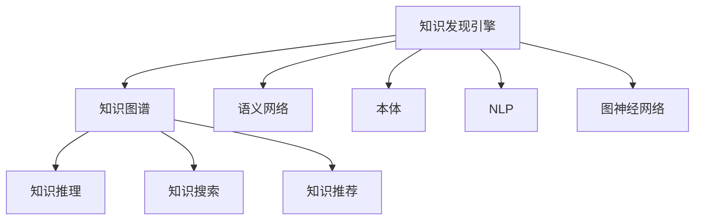

                 

# 知识发现引擎：开启人类知识新时代

## 1. 背景介绍

### 1.1 问题由来
在人类文明发展的历史长河中，知识的积累与传播一直是推动社会进步的重要动力。然而，传统的知识获取与整理方式，如纸质书籍、手工编纂等，存在着信息量有限、更新缓慢、传播效率低下等诸多局限。近年来，伴随着大数据技术、互联网技术、人工智能技术的飞速发展，新型知识发现引擎应运而生，其利用先进的算法和工具，可以从海量数据中高效挖掘、提炼、组织和呈现人类知识，从而加速知识的生成和传播，推动人类认知能力的跃迁。

### 1.2 问题核心关键点
知识发现引擎的核心在于其能够从大量无序、异构的数据中自动识别、提取、整合和重构知识，形成结构化、可查询的知识图谱，从而支持知识的深度挖掘、智能推荐、个性化服务等高级应用。它不仅能够处理结构化数据，如表格、文档等，还能高效处理半结构化和非结构化数据，如图像、语音、视频等，提供更广泛、灵活的知识服务。

当前，知识发现引擎已经成为大数据时代知识管理的核心技术，广泛应用于情报分析、决策支持、推荐系统、内容治理等多个领域，成为企业和科研机构获取竞争优势的关键利器。然而，构建高效、鲁棒的自动知识发现引擎，仍然面临许多技术和工程难题，需要我们持续探索和创新。

## 2. 核心概念与联系

### 2.1 核心概念概述

为更好地理解知识发现引擎的原理和应用，本节将介绍几个关键概念及其相互联系：

- **知识发现引擎(Knowledge Discovery Engine, KDE)**：通过数据挖掘和人工智能技术，从原始数据中自动识别、提取和重构知识，生成知识图谱或知识库的系统。

- **知识图谱(Knowledge Graph)**：一种结构化表示实体、关系及其属性的大型图形数据库，可用于知识推理、搜索和推荐等应用。

- **语义网络(Semantic Network)**：一种基于逻辑和推理的知识表示方式，由节点和边组成，用于描述实体之间的关系和属性。

- **本体(Ontology)**：定义了特定领域内实体、属性、关系及其相互关系的规范和约束，是构建知识图谱的基础。

- **自然语言处理(Natural Language Processing, NLP)**：使计算机能够理解和生成自然语言的技术，可用于知识抽取和语义理解。

- **图神经网络(Graph Neural Network, GNN)**：一类专门用于处理图结构数据的神经网络，可有效提取图结构中的隐含知识。

这些概念之间的逻辑关系可以通过以下Mermaid流程图来展示：



这个流程图展示了知识发现引擎与其他知识表示和处理方法之间的紧密联系。通过知识发现引擎，可以从不同数据源中抽取知识，形成语义网络或知识图谱，并利用图神经网络等技术进行深度学习和推理，从而提供多种高级知识服务。

## 3. 核心算法原理 & 具体操作步骤

### 3.1 算法原理概述

知识发现引擎的算法原理可以总结为以下几个关键步骤：

1. **数据收集与清洗**：从不同来源收集数据，并进行初步清洗和预处理，去除噪声和异常数据。
2. **知识抽取**：从清洗后的数据中自动抽取实体、关系和属性，生成初始的知识库或语义网络。
3. **知识融合**：将多个来源的知识库进行融合，消除冲突，增强知识的一致性和全面性。
4. **知识推理**：利用推理算法，如规则推理、基于图神经网络的推理等，对知识库进行深度挖掘和推理。
5. **知识呈现**：将推理后的知识以可视化的形式呈现，支持搜索、推荐和决策等应用。

### 3.2 算法步骤详解

#### 3.2.1 数据收集与清洗

数据收集与清洗是知识发现引擎的第一步。一般需要从多个数据源收集数据，如数据库、文档、网页、社交媒体、传感器数据等。常用的数据清洗技术包括：

- **数据去重**：去除重复记录，确保数据的唯一性。
- **数据去噪**：去除错误和无效的数据，提高数据质量。
- **数据规整**：统一数据格式和命名规则，便于后续处理。

#### 3.2.2 知识抽取

知识抽取是从原始数据中自动提取结构化和半结构化信息的过程。常用的方法包括：

- **基于规则的抽取**：通过编写复杂的抽取规则，自动从文本中提取实体和关系。
- **基于模板的抽取**：设计特定的抽取模板，自动生成实体和关系。
- **基于机器学习的抽取**：使用分类、序列标注、聚类等算法，自动识别实体和关系。

#### 3.2.3 知识融合

知识融合是将多个知识库进行整合，消除冲突和冗余，增强知识的一致性和全面性的过程。常用的方法包括：

- **关系融合**：通过合并实体和关系，消除不一致的描述。
- **属性融合**：将不同来源的属性进行整合，消除冗余和冲突。
- **权重融合**：对不同来源的知识赋予不同的权重，避免权值偏见。

#### 3.2.4 知识推理

知识推理是通过推理算法，从知识库中自动推导新知识的过程。常用的方法包括：

- **规则推理**：根据预先定义的规则，从知识库中推导新知识。
- **基于图神经网络的推理**：利用图神经网络，自动发现和推导新的关系和属性。
- **基于统计的推理**：通过统计分析和概率模型，推导新知识。

#### 3.2.5 知识呈现

知识呈现是将推理后的知识以可视化的形式呈现，支持搜索、推荐和决策等应用。常用的方法包括：

- **知识图谱**：构建结构化的知识图谱，支持节点搜索和关系查询。
- **本体图谱**：构建基于本体的知识图谱，支持形式化推理和语义搜索。
- **可视化仪表盘**：将知识以图表、仪表盘等形式展示，支持直观的分析和决策。

### 3.3 算法优缺点

知识发现引擎具有以下优点：

1. **高效性**：能够从海量数据中高效抽取和融合知识，生成结构化的知识图谱。
2. **鲁棒性**：能够处理多种数据类型和异构数据源，具有较强的鲁棒性和适应性。
3. **灵活性**：能够适应不同的应用场景，提供定制化的知识服务。
4. **自动化**：能够自动进行知识抽取、融合和推理，减少人工干预，提高效率。

同时，知识发现引擎也存在一些缺点：

1. **复杂性**：算法复杂，需要处理大量异构数据，计算和存储成本较高。
2. **数据质量依赖**：依赖原始数据的质量和完整性，数据清洗和预处理难度较大。
3. **推理局限性**：现有推理算法可能无法处理复杂和动态变化的知识结构。
4. **模型偏见**：可能存在数据偏见和算法偏见，导致知识发现结果不全面或偏差。

尽管存在这些局限性，但知识发现引擎在大数据时代仍然具有重要价值，其高效、鲁棒、自动化的特点使其成为知识管理的核心技术。

### 3.4 算法应用领域

知识发现引擎的应用领域非常广泛，涵盖了情报分析、决策支持、推荐系统、内容治理等多个领域：

- **情报分析**：利用知识发现引擎，从大量公开数据中抽取和分析情报，支持决策支持和安全预警。
- **决策支持**：构建基于知识图谱的决策支持系统，支持自动化决策和辅助分析。
- **推荐系统**：通过知识图谱和推理，提供个性化的推荐服务，如电商推荐、内容推荐等。
- **内容治理**：利用知识发现引擎，构建企业知识库，支持文档管理、信息检索等应用。
- **智能客服**：通过知识图谱和自然语言处理技术，构建智能客服系统，提供实时咨询和问题解答。

## 4. 数学模型和公式 & 详细讲解 & 举例说明

### 4.1 数学模型构建

知识发现引擎的数学模型通常包括以下几个关键部分：

- **知识表示模型**：用于描述实体、关系和属性的数学模型。
- **知识抽取模型**：用于从数据中自动抽取实体、关系和属性的模型。
- **知识融合模型**：用于将多个知识库进行融合的模型。
- **知识推理模型**：用于从知识库中推导新知识的模型。
- **知识呈现模型**：用于将推理后的知识以可视化形式呈现的模型。

### 4.2 公式推导过程

#### 4.2.1 知识表示模型

知识表示模型通常采用图模型、本体模型等形式，用于描述实体、关系和属性之间的关系。常用的知识表示模型包括：

- **知识图谱**：由节点和边组成的图形模型，用于表示实体、关系和属性。
- **本体图谱**：基于本体的知识表示模型，支持形式化推理和语义搜索。

#### 4.2.2 知识抽取模型

知识抽取模型通常使用机器学习或规则方法，从文本中自动抽取实体、关系和属性。常用的知识抽取模型包括：

- **基于规则的抽取**：通过编写复杂的抽取规则，自动从文本中提取实体和关系。
- **基于模板的抽取**：设计特定的抽取模板，自动生成实体和关系。
- **基于机器学习的抽取**：使用分类、序列标注、聚类等算法，自动识别实体和关系。

#### 4.2.3 知识融合模型

知识融合模型通常使用合并算法，将多个知识库进行融合，消除冲突和冗余。常用的知识融合模型包括：

- **关系融合**：通过合并实体和关系，消除不一致的描述。
- **属性融合**：将不同来源的属性进行整合，消除冗余和冲突。
- **权重融合**：对不同来源的知识赋予不同的权重，避免权值偏见。

#### 4.2.4 知识推理模型

知识推理模型通常使用推理算法，从知识库中自动推导新知识。常用的知识推理模型包括：

- **规则推理**：根据预先定义的规则，从知识库中推导新知识。
- **基于图神经网络的推理**：利用图神经网络，自动发现和推导新的关系和属性。
- **基于统计的推理**：通过统计分析和概率模型，推导新知识。

#### 4.2.5 知识呈现模型

知识呈现模型通常使用可视化技术，将推理后的知识以图表、仪表盘等形式展示。常用的知识呈现模型包括：

- **知识图谱**：构建结构化的知识图谱，支持节点搜索和关系查询。
- **本体图谱**：构建基于本体的知识图谱，支持形式化推理和语义搜索。
- **可视化仪表盘**：将知识以图表、仪表盘等形式展示，支持直观的分析和决策。

### 4.3 案例分析与讲解

#### 4.3.1 知识图谱构建案例

以Wikipedia为例，构建Wikipedia的知识图谱，可以通过以下步骤：

1. **数据收集**：从Wikipedia页面提取实体、关系和属性。
2. **数据清洗**：去除噪声和重复数据，统一命名规则。
3. **知识抽取**：使用基于规则和机器学习的抽取方法，自动提取实体、关系和属性。
4. **知识融合**：将不同来源的知识库进行合并，消除冲突和冗余。
5. **知识推理**：利用规则推理和图神经网络推理，自动推导新知识。
6. **知识呈现**：将推理后的知识以知识图谱的形式呈现，支持节点搜索和关系查询。

#### 4.3.2 本体图谱构建案例

以DOLCE本体为例，构建DOLCE本体图谱，可以通过以下步骤：

1. **定义本体**：定义实体、关系和属性，以及它们之间的逻辑关系。
2. **数据收集**：从数据库和文档等来源收集数据，提取实体、关系和属性。
3. **数据清洗**：去除噪声和重复数据，统一命名规则。
4. **知识抽取**：使用基于规则和机器学习的抽取方法，自动提取实体、关系和属性。
5. **知识融合**：将不同来源的知识库进行合并，消除冲突和冗余。
6. **知识推理**：利用规则推理和图神经网络推理，自动推导新知识。
7. **知识呈现**：将推理后的知识以本体图谱的形式呈现，支持形式化推理和语义搜索。

## 5. 项目实践：代码实例和详细解释说明

### 5.1 开发环境搭建

在进行知识发现引擎的开发实践前，我们需要准备好开发环境。以下是使用Python进行Apache Jena开发的环境配置流程：

1. 安装Apache Jena：从官网下载并安装Apache Jena，用于构建和查询知识图谱。

2. 创建并激活虚拟环境：
```bash
conda create -n jena-env python=3.8 
conda activate jena-env
```

3. 安装Apache Jena库：
```bash
pip install jena-ontopy rdf2graph
```

4. 安装各类工具包：
```bash
pip install numpy pandas scikit-learn matplotlib tqdm jupyter notebook ipython
```

完成上述步骤后，即可在`jena-env`环境中开始开发实践。

### 5.2 源代码详细实现

这里我们以构建知识图谱为例，给出使用Apache Jena构建和查询知识图谱的Python代码实现。

首先，定义知识图谱类：

```python
from jena.ontopy import Graph, createNewOntology
from jena.query import SPARQLWrapper

class KnowledgeGraph:
    def __init__(self, ontology_uri, graph_uri):
        self.ontology = createNewOntology(ontology_uri)
        self.graph = Graph(generateUUIDs=True)
        self.graph.setGraphStore(self.ontology)
        self.graph_uri = graph_uri
        self.sparql = SPARQLWrapper(graph_uri)

    def addTriple(self, subject, predicate, object):
        triple = self.ontology.createObjectIRI(subject)
        predicate_uri = self.ontology.createObjectIRI(predicate)
        object_uri = self.ontology.createObjectIRI(object)
        self.graph.add(self.graph_uri, triple, predicate_uri, object_uri)

    def query(self, query):
        results = self.sparql.query(query)
        for result in results:
            print(result)
```

然后，构建知识图谱：

```python
kg = KnowledgeGraph("http://example.org/ontology", "http://example.org/graph")
kg.addTriple("person", "name", "Alice")
kg.addTriple("person", "gender", "female")
kg.addTriple("person", "age", "30")
kg.addTriple("person", "profession", "engineer")
kg.addTriple("person", "nationality", "American")

kg.query("SELECT ?name WHERE { ?person name ?name }")
kg.query("SELECT ?age WHERE { ?person age ?age }")
kg.query("SELECT ?profession WHERE { ?person profession ?profession }")
kg.query("SELECT ?gender WHERE { ?person gender ?gender }")
kg.query("SELECT ?nationality WHERE { ?person nationality ?nationality }")
```

最后，在Jupyter Notebook中运行代码，查看查询结果。

### 5.3 代码解读与分析

让我们再详细解读一下关键代码的实现细节：

**KnowledgeGraph类**：
- `__init__`方法：初始化知识图谱的ontology和graph对象，以及sparql查询器。
- `addTriple`方法：向知识图谱中添加三元组，生成实体、关系和属性的RDF表示。
- `query`方法：使用SPARQL查询器查询知识图谱，并打印输出结果。

**query方法**：
- 使用SPARQL查询语言，查询指定的实体、关系或属性，返回结果。

可以看到，Apache Jena提供了一组强大的API，能够方便地构建和查询知识图谱。开发者可以利用这些API，快速实现知识抽取、融合和推理等核心功能，实现知识发现引擎的构建。

## 6. 实际应用场景

### 6.1 智能推荐系统

知识发现引擎在智能推荐系统中发挥着重要作用。通过构建用户行为图谱和物品属性图谱，知识发现引擎可以自动挖掘用户兴趣和物品特征，提供个性化的推荐服务。

在实践中，可以构建用户行为图谱和物品属性图谱，利用知识推理算法，自动发现用户兴趣和物品属性之间的关系。将推理后的知识以推荐列表的形式呈现，即可实现个性化推荐。

### 6.2 情报分析

知识发现引擎在情报分析中也有重要应用。通过构建大规模知识图谱，知识发现引擎可以从海量数据中自动抽取和推理出关键情报信息，支持决策支持和安全预警。

在情报分析任务中，知识发现引擎可以从各种数据源中抽取情报信息，构建知识图谱，利用推理算法，自动发现潜在威胁和异常行为，实时预警。

### 6.3 医疗知识图谱

医疗知识图谱是知识发现引擎在医疗领域的重要应用。通过构建医疗知识图谱，知识发现引擎可以自动抽取和融合医疗数据，支持临床决策支持和治疗方案推荐。

在医疗知识图谱构建中，知识发现引擎可以从各种医疗数据源中抽取实体、关系和属性，构建知识图谱。利用推理算法，自动发现和推导新的医学知识，支持临床决策和治疗方案推荐。

### 6.4 未来应用展望

随着知识发现引擎技术的发展，其应用领域将进一步拓展。未来，知识发现引擎将在智慧城市、金融风险控制、环境保护等多个领域发挥重要作用，为社会治理和经济发展提供强大的知识支持。

在智慧城市治理中，知识发现引擎可以构建城市事件图谱，支持城市事件监测和应急响应。在金融风险控制中，知识发现引擎可以构建金融事件图谱，支持金融舆情监测和风险预警。在环境保护中，知识发现引擎可以构建环境事件图谱，支持环境监测和治理决策。

## 7. 工具和资源推荐

### 7.1 学习资源推荐

为了帮助开发者系统掌握知识发现引擎的理论基础和实践技巧，这里推荐一些优质的学习资源：

1. **《数据挖掘与统计学习》**：经典教材，详细介绍了数据挖掘和知识发现的基本原理和方法。
2. **《知识图谱与大数据技术》**：权威教材，系统介绍了知识图谱的构建和应用。
3. **《Apache Jena用户手册》**：Apache Jena官方文档，提供了详细的API和使用示例。
4. **《图神经网络入门与实践》**：介绍图神经网络的基本原理和应用实践。
5. **《Python与R数据挖掘与应用》**：实战书籍，结合Python和R语言，介绍了数据挖掘和知识发现的应用案例。

通过对这些资源的学习实践，相信你一定能够快速掌握知识发现引擎的精髓，并用于解决实际的NLP问题。

### 7.2 开发工具推荐

高效的开发离不开优秀的工具支持。以下是几款用于知识发现引擎开发的常用工具：

1. **Apache Jena**：构建和查询知识图谱的开放平台，支持多种数据源和推理引擎。
2. **RDF2Graph**：可视化知识图谱的工具，支持多种图谱格式和查询语言。
3. **OWL-Editor**：构建和编辑本体图谱的工具，支持形式化推理和语义搜索。
4. **Wikidata Query Service**：从Wikidata获取知识的查询服务，支持大规模知识图谱的构建。
5. **Gephi**：可视化图谱的工具，支持多种图谱格式和算法。

合理利用这些工具，可以显著提升知识发现引擎的开发效率，加快创新迭代的步伐。

### 7.3 相关论文推荐

知识发现引擎的研究源于学界的持续研究。以下是几篇奠基性的相关论文，推荐阅读：

1. **《The Semantic Web》**：介绍语义网的基本概念和技术，包括RDF、OWL、SPARQL等。
2. **《Knowledge Discovery and Data Mining》**：经典教材，详细介绍了知识发现和数据挖掘的原理和方法。
3. **《Semantic Networks for Medical Knowledge Discovery》**：介绍知识发现引擎在医学领域的应用。
4. **《Reasoning Over Ontologies》**：介绍本体图谱的推理方法，包括规则推理和图神经网络推理。
5. **《Graph Neural Networks: A Review of Methods and Applications》**：综述图神经网络的基本原理和应用案例。

这些论文代表了大语言模型微调技术的发展脉络。通过学习这些前沿成果，可以帮助研究者把握学科前进方向，激发更多的创新灵感。

## 8. 总结：未来发展趋势与挑战

### 8.1 总结

本文对知识发现引擎进行了全面系统的介绍。首先阐述了知识发现引擎的研究背景和意义，明确了知识发现引擎在知识管理和自动化决策中的独特价值。其次，从原理到实践，详细讲解了知识发现引擎的数学原理和关键步骤，给出了知识发现引擎的完整代码实例。同时，本文还广泛探讨了知识发现引擎在多个行业领域的应用前景，展示了知识发现引擎的巨大潜力。最后，本文精选了知识发现引擎的学习资源，力求为读者提供全方位的技术指引。

通过本文的系统梳理，可以看到，知识发现引擎已经成为大数据时代知识管理的核心技术，其高效、鲁棒、自动化的特点使其成为知识管理的核心技术。未来，伴随技术的发展和应用的拓展，知识发现引擎必将在更多领域大放异彩，为人类认知智能的进化带来深远影响。

### 8.2 未来发展趋势

展望未来，知识发现引擎的发展趋势将呈现以下几个方向：

1. **深度学习与知识发现的融合**：通过深度学习技术，进一步提升知识抽取、融合和推理的精度和效率。
2. **多模态数据的整合**：将文本、图像、语音等多种数据类型进行整合，形成更全面、灵活的知识图谱。
3. **跨领域知识图谱的构建**：利用跨领域知识图谱，支持更广泛、多样化的知识发现应用。
4. **知识图谱的动态更新**：实现知识图谱的动态更新，保持知识的实时性和时效性。
5. **知识图谱的可视化**：将知识图谱以更加直观、易用的形式呈现，支持更广泛的可视化需求。

以上趋势凸显了知识发现引擎的广阔前景，其在多模态数据处理、跨领域知识融合、动态知识更新等方面的探索，必将推动知识发现引擎向更高级别发展，为人类认知智能的进化提供更强大的知识支持。

### 8.3 面临的挑战

尽管知识发现引擎已经取得了瞩目成就，但在迈向更加智能化、普适化应用的过程中，仍然面临诸多挑战：

1. **数据质量和多样性**：依赖高质量、多样化的数据源，数据收集和清洗成本较高。
2. **知识图谱的复杂性**：知识图谱的构建和维护难度较大，需要专业知识和技术支持。
3. **推理算法的局限性**：现有推理算法可能无法处理复杂和动态变化的知识结构。
4. **模型的可解释性**：知识发现引擎的决策过程缺乏可解释性，难以进行调试和优化。
5. **模型的泛化能力**：知识发现引擎在处理新数据时，泛化能力有待提升。

尽管存在这些挑战，但知识发现引擎在大数据时代仍然具有重要价值，其高效、鲁棒、自动化的特点使其成为知识管理的核心技术。

### 8.4 研究展望

面对知识发现引擎所面临的种种挑战，未来的研究需要在以下几个方面寻求新的突破：

1. **大数据下的知识抽取**：在大数据时代，如何高效、自动地从海量数据中抽取知识，是知识发现引擎的关键问题。
2. **知识图谱的动态更新**：如何实现知识图谱的动态更新，保持知识的实时性和时效性，是知识发现引擎的重要研究方向。
3. **多模态数据的整合**：如何将文本、图像、语音等多种数据类型进行整合，形成更全面、灵活的知识图谱，是知识发现引擎的重要任务。
4. **推理算法的创新**：如何开发更加高效、准确的推理算法，支持更复杂、动态的知识结构，是知识发现引擎的重要方向。
5. **模型的可解释性**：如何赋予知识发现引擎更强的可解释性，增强其决策过程的透明度和可信度，是知识发现引擎的重要研究课题。

这些研究方向的探索，必将引领知识发现引擎技术迈向更高的台阶，为构建安全、可靠、可解释、可控的智能系统铺平道路。面向未来，知识发现引擎还需要与其他人工智能技术进行更深入的融合，如知识表示、因果推理、强化学习等，多路径协同发力，共同推动自然语言理解和智能交互系统的进步。只有勇于创新、敢于突破，才能不断拓展知识发现引擎的边界，让智能技术更好地造福人类社会。

## 9. 附录：常见问题与解答

**Q1：知识发现引擎是否适用于所有行业？**

A: 知识发现引擎在许多行业都有广泛的应用，但不同行业的知识特性和应用场景可能有所不同。需要根据具体行业需求，设计适合的模型和算法，才能充分发挥知识发现引擎的潜力。例如，在金融、医疗、电商等领域，知识发现引擎可以提供更加专业化的知识服务。

**Q2：知识发现引擎如何应对数据多样性？**

A: 知识发现引擎可以从多种数据源中抽取知识，包括结构化数据、半结构化数据和非结构化数据。通过数据清洗和预处理，可以统一不同数据源的数据格式和命名规则，从而进行有效的知识抽取和融合。

**Q3：知识图谱的构建和维护有哪些挑战？**

A: 知识图谱的构建和维护是知识发现引擎的核心任务，但面临许多挑战：
1. **数据来源多样**：数据来源复杂多样，需要处理异构数据和数据质量问题。
2. **实体关系复杂**：实体关系复杂，需要设计合适的抽取和推理算法。
3. **知识冲突和冗余**：不同来源的知识可能存在冲突和冗余，需要进行融合和优化。
4. **更新和维护**：知识图谱需要动态更新和维护，以保持知识的实时性和完整性。

**Q4：知识图谱的应用有哪些挑战？**

A: 知识图谱的应用也需要面对一些挑战：
1. **推理准确性**：推理算法需要处理复杂和动态变化的知识结构，推理准确性有待提升。
2. **可解释性**：知识图谱的推理过程缺乏可解释性，难以进行调试和优化。
3. **实时性**：知识图谱需要实时更新和维护，保证知识的实时性和时效性。
4. **可扩展性**：知识图谱需要支持大规模数据和复杂推理，系统可扩展性有待提升。

**Q5：知识图谱的可视化有哪些挑战？**

A: 知识图谱的可视化也需要面对一些挑战：
1. **可视化复杂性**：知识图谱结构复杂，需要设计合适的可视化方法和工具。
2. **交互性**：可视化系统需要支持多种交互方式，方便用户查询和操作。
3. **可视化效果**：可视化效果需要直观、易用，能够有效支持用户的查询和分析需求。

这些挑战需要进一步研究和探索，才能充分发挥知识图谱的潜力，实现更广泛、高效的知识服务。

---

作者：禅与计算机程序设计艺术 / Zen and the Art of Computer Programming

