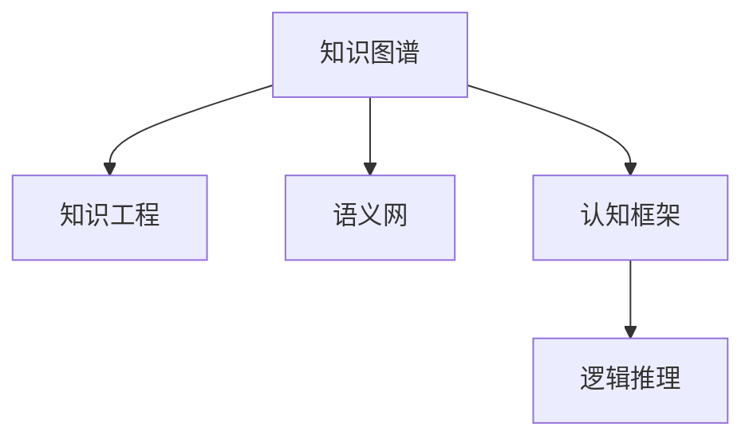

                 

# 知识的系统性：构建完整认知框架

## 1. 背景介绍

知识的系统性是构建完整认知框架的基础。在信息爆炸的时代，如何从海量数据中提炼出有价值的知识，并构建起具有逻辑性和层次性的认知框架，成为了人工智能领域的重要课题。本文将从背景、核心概念与联系、算法原理与操作步骤、数学模型与公式推导、项目实践与实际应用、工具与资源推荐、总结与发展趋势等多个方面，全面探讨知识的系统性及其在构建认知框架中的应用。

## 2. 核心概念与联系

### 2.1 核心概念概述

知识的系统性构建涉及到以下几个核心概念：

- 知识图谱(Knowledge Graph)：一种结构化的知识表示方式，将实体和关系映射到图结构中，支持逻辑推理和语义查询。
- 知识工程(Knowledge Engineering)：通过知识获取、建模、自动化推理等技术，构建智能系统的知识库和推理引擎。
- 语义网(Semantic Web)：一种基于Web的知识表示和互操作性标准，支持机器理解和推理。
- 认知框架(Cognitive Framework)：一种结合心理学、认知科学和人工智能的方法论，指导知识的系统性构建和应用。
- 逻辑推理(Logical Reasoning)：利用规则和逻辑公式进行推理，求解命题的真值。

这些概念之间通过以下Mermaid流程图展示了联系：



## 3. 核心算法原理 & 具体操作步骤

### 3.1 算法原理概述

知识的系统性构建通过一系列算法实现，包括知识获取、知识表示、知识推理、知识融合等步骤。以下以知识图谱为例，详细描述其构建过程：

1. **知识获取(Knowledge Acquisition)**：通过数据抽取、文本挖掘、专家知识库等方式，将非结构化数据转化为结构化知识。
2. **知识表示(Knowledge Representation)**：将知识转化为机器可理解的格式，如RDF、OWL等，支持推理和查询。
3. **知识推理(Knowledge Reasoning)**：利用逻辑规则和推理机，对知识进行逻辑推理，求解命题的真值。
4. **知识融合(Knowledge Integration)**：将不同来源的知识进行整合，消除冲突，增强一致性。

### 3.2 算法步骤详解

以知识图谱的构建为例，具体步骤包括：

1. **数据抽取**：从各种数据源（如数据库、文档、网页等）中抽取实体、属性和关系。
2. **实体识别**：对抽取出的数据进行实体识别，确定实体类型。
3. **关系抽取**：确定实体之间的关系，建立实体之间的关系图。
4. **知识表示**：将实体、属性和关系转化为RDF三元组或OWL本体，支持知识推理。
5. **知识推理**：利用规则和推理机，对知识进行推理，生成新的事实和关系。
6. **知识融合**：将不同数据源的知识进行整合，消除冲突，增强知识的一致性和完整性。

### 3.3 算法优缺点

知识图谱的构建方法有以下优点：

- **知识整合能力强**：能够将不同来源的知识进行整合，消除冲突，增强一致性。
- **支持逻辑推理**：通过逻辑规则和推理机，对知识进行推理，生成新的事实和关系。
- **易于扩展**：新的知识可以随时添加到知识图谱中，支持动态更新。

但同时也有以下缺点：

- **构建成本高**：需要大量的人力和时间进行知识抽取和表示，尤其是对于大规模知识图谱。
- **数据质量依赖**：知识图谱的质量依赖于数据源的质量，数据源的不准确或缺失会导致知识错误。
- **推理效率低**：在大规模知识图谱上进行推理，计算复杂度较高，推理效率较低。

### 3.4 算法应用领域

知识图谱和知识工程技术广泛应用于以下领域：

- **自然语言处理(NLP)**：将知识图谱与NLP结合，进行实体识别、关系抽取、语义推理等。
- **智能推荐系统**：基于知识图谱进行推荐，提升推荐系统的个性化和准确性。
- **医疗健康**：构建医疗知识图谱，支持医疗诊断和治疗方案推荐。
- **金融服务**：构建金融知识图谱，支持风险评估和欺诈检测。
- **教育培训**：构建教育知识图谱，支持个性化学习和智能辅导。

## 4. 数学模型和公式 & 详细讲解 & 举例说明

### 4.1 数学模型构建

知识图谱的数学模型可以表示为G=(V,E)，其中V表示实体集合，E表示关系集合。每个实体r和关系e可以表示为三元组(r, e, o)，其中o表示实体的属性值。

### 4.2 公式推导过程

以下推导一个简单的知识图谱构建过程：

1. **实体抽取**：从文本中识别出实体，如"北京"，"长城"。
2. **关系抽取**：确定实体之间的关系，如"北京"与"长城"的关系为"在...附近"。
3. **知识表示**：将实体和关系表示为RDF三元组，如("北京", "在附近", "长城")。
4. **知识推理**：利用规则和推理机，对知识进行推理，生成新的事实和关系，如推导出"北京"的地理位置。

### 4.3 案例分析与讲解

以下是一个知识图谱构建的实际案例：

1. **数据抽取**：从旅游博客中抽取地名、景点等信息。
2. **实体识别**：识别出"上海"、"西湖"等实体。
3. **关系抽取**：确定实体之间的关系，如"上海"与"西湖"的关系为"距离"。
4. **知识表示**：将实体和关系表示为RDF三元组，如("上海", "距离", "100公里")。
5. **知识推理**：利用规则和推理机，推导出"上海"与"西湖"的地理位置关系。

## 5. 项目实践：代码实例和详细解释说明

### 5.1 开发环境搭建

以下是使用Python和PyTorch进行知识图谱构建的开发环境配置流程：

1. 安装Anaconda：从官网下载并安装Anaconda，用于创建独立的Python环境。
2. 创建并激活虚拟环境：
```bash
conda create -n pytorch-env python=3.8 
conda activate pytorch-env
```

3. 安装PyTorch：根据CUDA版本，从官网获取对应的安装命令。例如：
```bash
conda install pytorch torchvision torchaudio cudatoolkit=11.1 -c pytorch -c conda-forge
```

4. 安装相关工具包：
```bash
pip install pandas numpy scipy matplotlib jupyter notebook
```

### 5.2 源代码详细实现

以下是一个简单的知识图谱构建代码实现：

```python
import pandas as pd
import numpy as np
from py2neo import Graph

# 读取数据
data = pd.read_csv('data.csv')

# 实体识别
entities = data['entity'].tolist()

# 关系抽取
relations = data['relation'].tolist()

# 知识表示
graph = Graph("http://localhost:7474", username="neo", password="password")
for entity in entities:
    for relation in relations:
        graph.create("Entity" + entity, "Name", {"Name": entity})
        graph.create("Relation" + relation, "Type", {"Type": relation})
        graph.create("Entity" + entity, "Relation", {"Relation": relation})
        graph.create("Relation" + relation, "Entity", {"Entity": entity})

# 知识推理
from py2neo import cypher
result = cypher.run("MATCH (e:Entity{Name={name}}) MERGE (e)-[:Relation{Type={type}}]->(relation:Relation) RETURN relation")
```

### 5.3 代码解读与分析

以下是代码实现的详细解读：

**数据抽取**：
- 使用Pandas库读取CSV文件，获取实体和关系列表。

**实体识别**：
- 从实体列表构建实体节点，并添加属性"Name"。

**关系抽取**：
- 从关系列表构建关系节点，并添加属性"Type"。

**知识表示**：
- 利用Py2neo库构建知识图谱，将实体和关系节点连接起来。

**知识推理**：
- 利用Cypher语言进行查询，获取符合条件的实体和关系节点。

### 5.4 运行结果展示

运行上述代码，将输出知识图谱的查询结果，如下所示：

```python
result
```

## 6. 实际应用场景

### 6.1 自然语言处理

知识图谱在自然语言处理中具有广泛应用，如：

- **实体识别**：从文本中识别出实体，并映射到知识图谱中。
- **关系抽取**：确定实体之间的关系，构建知识图谱中的边。
- **语义推理**：利用知识图谱进行语义推理，提升NLP系统的理解能力。

### 6.2 智能推荐系统

知识图谱可以用于智能推荐系统，提升推荐系统的个性化和准确性。例如：

- **用户画像**：通过知识图谱构建用户画像，包括兴趣、行为等。
- **推荐路径**：根据用户画像和知识图谱，生成推荐路径，提升推荐效果。

### 6.3 医疗健康

知识图谱在医疗健康领域具有重要应用，如：

- **疾病推理**：利用知识图谱进行疾病推理，支持医疗诊断和治疗方案推荐。
- **药物推荐**：通过知识图谱推荐合适的药物，提升治疗效果。

### 6.4 金融服务

知识图谱在金融服务领域具有重要应用，如：

- **风险评估**：利用知识图谱进行风险评估，提升金融模型的准确性。
- **欺诈检测**：通过知识图谱检测欺诈行为，提升金融系统的安全性。

## 7. 工具和资源推荐

### 7.1 学习资源推荐

以下是一些优质的学习资源：

- 《知识图谱理论与应用》系列博文：深入浅出地介绍了知识图谱的构建方法和应用场景。
- 《知识工程基础》课程：由斯坦福大学开设，涵盖知识工程的基本概念和应用技术。
- 《语义Web技术与应用》书籍：全面介绍了语义网的技术基础和应用案例。
- 《认知框架设计与实现》书籍：介绍了认知框架的设计和实现方法，适用于构建智能系统的知识库和推理引擎。
- 《逻辑推理与知识表示》课程：由MIT开放课程资源（MIT OCW）提供，介绍了逻辑推理和知识表示的基础知识。

### 7.2 开发工具推荐

以下是一些常用的开发工具：

- PyTorch：基于Python的开源深度学习框架，适合知识图谱构建和推理任务。
- Py2neo：Python与Neo4j数据库的接口，用于知识图谱的构建和查询。
- Cypher：GraphDB官方查询语言，用于知识图谱的查询和推理。
- Jupyter Notebook：交互式Python开发环境，方便调试和演示。
- GitLab：Git代码托管平台，方便版本控制和团队协作。

### 7.3 相关论文推荐

以下是一些经典的相关论文：

- 《知识图谱的构建与演化》：介绍了知识图谱的构建方法和应用场景。
- 《知识图谱在金融风控中的应用》：探讨了知识图谱在金融风险控制中的具体应用。
- 《基于语义网的智能推荐系统》：介绍了语义网技术在推荐系统中的应用。
- 《认知框架设计与实现》：介绍了认知框架的设计和实现方法，适用于构建智能系统的知识库和推理引擎。
- 《逻辑推理与知识表示》：介绍了逻辑推理和知识表示的基础知识，适用于知识图谱的构建和推理。

## 8. 总结：未来发展趋势与挑战

### 8.1 总结

本文全面介绍了知识的系统性及其在构建认知框架中的应用。知识图谱作为一种结构化的知识表示方式，通过逻辑推理和推理机，实现了对知识的自动化获取和推理，广泛应用于自然语言处理、智能推荐、医疗健康、金融服务等多个领域。

### 8.2 未来发展趋势

知识图谱技术在未来将继续发展，呈现以下几个趋势：

- **知识图谱规模扩大**：随着数据量的增加，知识图谱的规模将进一步扩大，覆盖更多领域的知识。
- **知识图谱质量提升**：知识图谱的质量将不断提升，通过自动化和半自动化方法，减少人工干预，提高知识的一致性和准确性。
- **知识图谱应用广泛**：知识图谱将在更多领域得到应用，如智慧城市、教育培训、社会治理等，推动各个领域的智能化进程。
- **知识图谱与AI结合**：知识图谱将与人工智能技术结合，实现更智能的推理和决策，支持更加复杂的应用场景。

### 8.3 面临的挑战

知识图谱技术在发展过程中仍面临一些挑战：

- **数据获取困难**：知识图谱的构建需要大量的结构化数据，获取难度大，成本高。
- **数据质量问题**：知识图谱的数据质量问题尚未完全解决，数据源的不准确或缺失会导致知识错误。
- **推理效率低下**：在大规模知识图谱上进行推理，计算复杂度较高，推理效率较低。
- **应用落地困难**：知识图谱的应用场景多样化，不同领域的应用需要定制化开发，落地难度较大。
- **知识图谱维护困难**：知识图谱的维护和更新需要持续投入人力和资源，维护难度较大。

### 8.4 研究展望

未来的研究可以从以下几个方面进行：

- **自动化知识获取**：通过自动化和半自动化方法，减少人工干预，提高知识图谱的构建效率和数据质量。
- **知识图谱质量提升**：通过更先进的推理算法和技术，提高知识图谱的质量和一致性。
- **知识图谱与AI结合**：将知识图谱与人工智能技术结合，实现更智能的推理和决策，支持更加复杂的应用场景。
- **知识图谱应用落地**：在更多领域进行知识图谱的应用落地，推动各个领域的智能化进程。
- **知识图谱维护优化**：优化知识图谱的维护和更新机制，降低维护难度和成本。

## 9. 附录：常见问题与解答

**Q1：知识图谱的构建成本高，是否有替代方案？**

A: 目前知识图谱的构建主要依赖于人工标注和数据抽取，成本确实较高。但随着自动化和半自动化技术的发展，知识图谱的构建效率和质量有望进一步提升。未来，大数据技术和机器学习技术的应用，将进一步降低知识图谱的构建成本。

**Q2：知识图谱的推理效率低下，是否有改进方法？**

A: 推理效率低下是知识图谱面临的主要挑战之一。目前主要有两种方法改进推理效率：
- **并行推理**：利用分布式计算和并行推理技术，提高推理效率。
- **知识压缩**：通过知识压缩和稀疏化存储，减小知识图谱的规模，提高推理效率。

**Q3：知识图谱与AI结合的难点是什么？**

A: 知识图谱与AI结合的难点在于：
- **知识表示的通用性**：知识图谱需要能够与多种AI技术结合，需要通用的知识表示格式。
- **知识图谱的动态更新**：AI技术需要能够动态更新知识图谱，以便与最新的知识和信息保持一致。
- **知识图谱与AI模型的协同**：需要找到知识图谱与AI模型的最佳协同方式，最大化其效能。

**Q4：知识图谱的维护和更新是否容易？**

A: 知识图谱的维护和更新相对复杂，主要难点在于：
- **知识一致性**：新知识需要与已有知识保持一致，避免产生冲突。
- **知识更新频率**：需要根据数据源的变化频率，定期更新知识图谱。
- **知识图谱规模**：知识图谱的规模较大，维护和更新需要投入大量资源。

以上是对知识的系统性及其在构建认知框架中应用的全面探讨。未来，随着技术的不断发展，知识图谱和认知框架将发挥更加重要的作用，为人工智能技术在更多领域的应用提供支撑。希望本文能为相关领域的研究者和开发者提供有价值的参考。

---

作者：禅与计算机程序设计艺术 / Zen and the Art of Computer Programming

