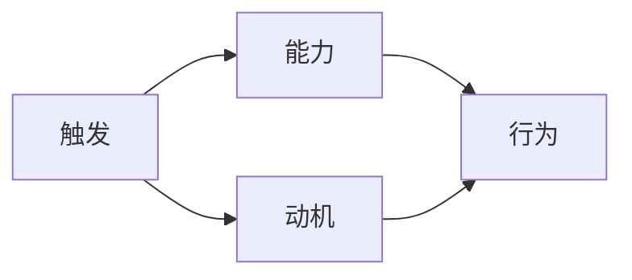

                 

# 福格行为模型在团队建设中的应用

> 关键词：福格行为模型, 团队建设, 行为激励, 行动动机, 行为设计

## 1. 背景介绍

### 1.1 问题由来
在当今快速变化和竞争激烈的企业环境中，团队建设和管理成为了企业成功的关键。传统的团队管理方法已经无法满足现代企业对团队协作、效率和创新能力的需求。如何激励团队成员积极行动，并保持团队的凝聚力和高效运作，成为了每个领导者和管理者面临的重要挑战。

### 1.2 问题核心关键点
福格行为模型（Fogg Behavior Model）作为一种行为设计和激励理论，提供了一套系统的框架来理解和设计人类的行为。在团队建设中，福格行为模型可以帮助领导者更好地理解团队成员的行为动机，设计有效的激励措施，提升团队的协作效率和创新能力。

### 1.3 问题研究意义
研究福格行为模型在团队建设中的应用，对于提升团队成员的积极性和效率，改善团队的整体绩效，推动企业战略目标的实现，具有重要意义。通过福格行为模型的应用，可以为企业提供一个科学、系统的方法来管理团队，促进团队的健康发展。

## 2. 核心概念与联系

### 2.1 核心概念概述

福格行为模型是由斯坦福大学心理学教授布莱恩·福格（Bjarte B. Fogg）提出的行为设计理论，它阐述了人类行为的形成和激励机制。福格行为模型认为，行为的发生需要三个关键元素：触发、能力、动机。通过理解这三个要素，可以设计出更具激励性的行为。

- **触发（Triggers）**：指导致行为发生的刺激因素。
- **能力（Ability）**：指执行行为所需的物理、认知、情感等方面的资源。
- **动机（Motivation）**：指促使行为发生的内在驱动和外在激励。

这些核心概念与团队建设紧密相关，可以帮助领导者设计有效的行为激励措施，提升团队成员的行动动机，从而提高团队的协作效率和创新能力。

### 2.2 核心概念原理和架构的 Mermaid 流程图



这个流程图展示了福格行为模型中触发、能力和动机之间的关系。触发是行为发生的前提，能力决定了行为执行的可能性，动机是行为发生的动力。

## 3. 核心算法原理 & 具体操作步骤

### 3.1 算法原理概述

福格行为模型在团队建设中的应用，主要通过识别和设计触发、能力和动机三个关键要素，来激励团队成员采取积极的行为。具体步骤如下：

1. **触发设计**：通过创造适当的物理环境、心理状态和信息传播，激发团队成员的行动动机。
2. **能力提升**：通过培训、资源配置和激励机制，增强团队成员执行任务的能力。
3. **动机激发**：通过目标设定、奖励机制和情感管理，提升团队成员的内在动机和外在激励。

### 3.2 算法步骤详解

#### 3.2.1 触发设计

- **环境设计**：创造有利于行为发生的环境，如优化办公空间、配置必要工具、搭建协作平台等。
- **信息传播**：利用有效的信息传播渠道，如内部邮件、团队会议、公告板等，确保信息传递的及时性和准确性。
- **情境提示**：通过设定明确的里程碑和重要日期，提醒团队成员关键任务和截止时间。

#### 3.2.2 能力提升

- **培训与学习**：提供必要的技能培训和知识学习，增强团队成员的专业能力和技术水平。
- **资源配置**：合理分配团队所需的物理和人力资源，确保任务执行的顺利进行。
- **技术支持**：提供先进的技术工具和平台，提高团队的工作效率和创新能力。

#### 3.2.3 动机激发

- **目标设定**：设定明确、可实现的目标，并根据不同成员的特点进行个性化调整。
- **奖励机制**：设计合理的奖励制度，包括物质奖励和精神奖励，激励团队成员的积极行为。
- **情感管理**：通过情感支持和团队建设活动，增强团队成员的归属感和责任感。

### 3.3 算法优缺点

**优点**：
- **系统性**：福格行为模型提供了一套系统的框架，有助于全面理解和设计团队行为。
- **灵活性**：模型中的三个要素可以根据具体情况进行调整，灵活性强。
- **可操作性**：通过具体的操作步骤，领导者可以轻松应用模型，提升团队绩效。

**缺点**：
- **复杂性**：模型涉及多个要素，实际操作中需要细致设计和协调。
- **个体差异**：团队成员的个性化需求和行为差异需要考虑，模型可能无法一概而论。
- **执行难度**：设计触发、提升能力和激发动机需要时间和资源投入，执行难度较大。

### 3.4 算法应用领域

福格行为模型在团队建设中的应用广泛，适用于各种类型的团队，包括创新团队、项目团队、跨职能团队等。在实际应用中，该模型可以应用于以下几个方面：

- **项目管理**：通过设定明确的目标和里程碑，提升团队成员的执行力和效率。
- **团队协作**：通过优化工作环境和信息传播，增强团队成员的协作精神和归属感。
- **创新激发**：通过设定挑战性和激励性的任务，激发团队成员的创新思维和行动。
- **员工培训**：通过提升团队成员的能力和技能，提高整体团队的专业水平和竞争力。

## 4. 数学模型和公式 & 详细讲解 & 举例说明

### 4.1 数学模型构建

福格行为模型的数学表达如下：

$$
B = \text{Trigger} \times \text{Ability} \times \text{Motivation}
$$

其中，$B$ 表示行为发生的概率，$\text{Trigger}$ 表示触发因素，$\text{Ability}$ 表示能力，$\text{Motivation}$ 表示动机。

### 4.2 公式推导过程

假设团队成员在某个任务上的行为概率为 $P$，则有：

$$
P = \text{Trigger} \times \text{Ability} \times \text{Motivation}
$$

根据公式，当触发、能力和动机同时满足时，行为发生的概率最高。领导者可以通过调整这三个要素，最大化行为发生的可能性。

### 4.3 案例分析与讲解

**案例**：某科技公司希望提升团队成员的创新能力。

- **触发设计**：公司定期举行创新工作坊和头脑风暴会议，营造创新氛围。
- **能力提升**：为团队成员提供创新培训和相关资源，如创新实验室、创新工具等。
- **动机激发**：设立创新奖金和荣誉表彰，奖励优秀的创新成果，激发团队成员的内在动机。

通过上述措施，公司成功激发了团队成员的创新行为，推出了多项新产品，显著提升了公司的创新能力和市场竞争力。

## 5. 项目实践：代码实例和详细解释说明

### 5.1 开发环境搭建

在进行团队行为管理系统的开发前，需要准备以下开发环境：

1. **Python**：安装Python 3.x版本，建议使用Anaconda进行环境管理。
2. **数据库**：选择MySQL或PostgreSQL等关系型数据库，用于存储团队成员信息和行为数据。
3. **Web框架**：选择Django或Flask等Web框架，用于搭建团队行为管理系统。
4. **开发工具**：安装Visual Studio Code或PyCharm等开发工具，方便代码编写和调试。

完成环境配置后，可以开始项目开发。

### 5.2 源代码详细实现

**代码实现**：

```python
from django.db import models
from django.contrib.auth.models import User

class Team(models.Model):
    name = models.CharField(max_length=100)
    members = models.ManyToManyField(User)
    project = models.ForeignKey('Project', on_delete=models.CASCADE)
    target = models.CharField(max_length=200)

class Project(models.Model):
    name = models.CharField(max_length=100)
    teams = models.ManyToManyField(Team)
    status = models.CharField(max_length=20)
    start_date = models.DateField()
    end_date = models.DateField()
    resources = models.TextField()

class Behavior(models.Model):
    team = models.ForeignKey(Team, on_delete=models.CASCADE)
    date = models.DateField()
    trigger = models.CharField(max_length=200)
    ability = models.TextField()
    motivation = models.TextField()
    action = models.TextField()

def save_behavior(team_id, date, trigger, ability, motivation, action):
    team = Team.objects.get(id=team_id)
    behavior = Behavior.objects.create(team=team, date=date, trigger=trigger, ability=ability, motivation=motivation, action=action)
    team.save()

def get_behaviors(team_id):
    team = Team.objects.get(id=team_id)
    behaviors = Behavior.objects.filter(team=team)
    return behaviors
```

### 5.3 代码解读与分析

**代码解读**：

- **Team模型**：表示团队，包含团队名称、成员、项目、目标等信息。
- **Project模型**：表示项目，包含项目名称、团队、状态、开始和结束日期、资源等信息。
- **Behavior模型**：表示行为，包含触发因素、能力、动机和行动等信息。
- **save_behavior函数**：用于保存行为记录，接收团队ID、日期、触发因素、能力、动机和行动作为参数，创建并保存行为记录。
- **get_behaviors函数**：用于获取指定团队的全体行为记录，返回一个Behavior查询集。

**代码分析**：

通过上述代码，可以搭建一个基本的团队行为管理系统。该系统通过记录团队成员的行为触发、能力提升和动机激发，为团队建设提供了科学的数据支持。

## 6. 实际应用场景

### 6.1 团队协作提升

福格行为模型在团队协作提升中的应用，可以通过优化触发、能力和动机三个要素，提升团队成员的协作效率和协同精神。

**案例**：某跨国公司需要在短时间内完成一个重要项目。

- **触发设计**：公司领导召开紧急会议，明确项目目标和紧急性。
- **能力提升**：为团队成员提供必要的培训和技术支持，确保每个人都具备完成任务的能力。
- **动机激发**：设立项目奖金和团队荣誉，激励团队成员的积极参与和协作。

通过上述措施，公司成功在规定时间内完成了项目，团队成员的协作效率显著提升。

### 6.2 员工培训与学习

福格行为模型在员工培训与学习中的应用，可以通过设计有效的触发、能力和动机，提升团队成员的专业能力和技术水平。

**案例**：某大型制造企业希望提升员工的工艺技能。

- **触发设计**：公司定期举行工艺技能培训和竞赛，营造学习氛围。
- **能力提升**：为员工提供先进的设备和工具，开展工艺技能培训和实战演练。
- **动机激发**：设立工艺技能证书和奖金，奖励优秀的工艺技能员工。

通过上述措施，企业成功提升了员工的技能水平，生产效率和产品质量显著提高。

### 6.3 创新激励

福格行为模型在创新激励中的应用，可以通过设计挑战性和激励性的任务，激发团队成员的创新思维和行动。

**案例**：某互联网公司希望推出新的创新产品。

- **触发设计**：公司设立创新竞赛，定期举办创新工作坊和头脑风暴会议。
- **能力提升**：为创新团队提供必要的创新工具和资源，如创新实验室、创新基金等。
- **动机激发**：设立创新奖金和荣誉表彰，奖励优秀的创新成果，激发团队成员的内在动机。

通过上述措施，公司成功推出了多项创新产品，市场反响热烈，显著提升了公司的创新能力和市场竞争力。

### 6.4 未来应用展望

随着福格行为模型在团队建设中的深入应用，未来将带来以下几个方面的发展：

- **智能化应用**：通过人工智能和大数据分析，进一步优化触发、能力和动机的设计，实现个性化的行为激励。
- **跨文化应用**：福格行为模型可以应用于不同文化背景的团队，帮助领导者和团队成员更好地理解和沟通。
- **线上应用**：开发在线团队行为管理系统，方便远程团队的协作和行为记录。
- **持续优化**：通过反馈机制和持续改进，不断提高团队行为设计的科学性和有效性。

福格行为模型在团队建设中的应用前景广阔，未来将为团队管理提供更为科学、系统、灵活的方法。

## 7. 工具和资源推荐

### 7.1 学习资源推荐

1. **福格行为模型官方资料**：福格行为模型官网提供了详细的理论介绍和应用指南，是理解模型的基础资源。
2. **《行为科学与管理》书籍**：介绍了行为科学在管理中的应用，包括福格行为模型的理论和实践。
3. **Coursera课程**：由斯坦福大学提供的福格行为模型在线课程，深入浅出地讲解了模型的核心概念和应用方法。
4. **MindTools网站**：提供了一系列行为科学和管理工具，包括福格行为模型的应用案例和工具。

### 7.2 开发工具推荐

1. **Python**：Python是目前最流行的编程语言之一，适合开发各种应用系统。
2. **Django**：Django是一个成熟的Web框架，适合快速开发Web应用。
3. **MySQL**：MySQL是一个常用的关系型数据库，支持高效的数据存储和查询。
4. **Visual Studio Code**：Visual Studio Code是一个轻量级但功能强大的开发工具，支持Python等多种编程语言。

### 7.3 相关论文推荐

1. **《行为设计学：激励新行为的科学与艺术》**：福格行为模型理论的创始人布莱恩·福格撰写的经典著作，详细介绍了行为设计的理论基础和应用方法。
2. **《行为设计：从理论到实践》**：福格行为模型应用的实践指南，提供了大量实际案例和工具。
3. **《行为科学的未来》**：探讨了行为科学在未来的发展方向和应用前景，包括福格行为模型的应用。

## 8. 总结：未来发展趋势与挑战

### 8.1 研究成果总结

福格行为模型在团队建设中的应用，为理解和管理人类行为提供了科学的方法。通过触发、能力和动机的设计，领导者可以有效地激励团队成员，提升团队的协作效率和创新能力。该模型已经在多个行业得到了广泛应用，取得了显著的效果。

### 8.2 未来发展趋势

未来，福格行为模型在团队建设中的应用将呈现以下几个发展趋势：

- **智能化**：通过人工智能和大数据分析，进一步优化行为激励设计，实现个性化的行为管理。
- **跨文化**：模型可以应用于不同文化背景的团队，帮助领导者和团队成员更好地理解和沟通。
- **线上化**：开发在线团队行为管理系统，方便远程团队的协作和行为记录。
- **持续优化**：通过反馈机制和持续改进，不断提高行为激励设计的科学性和有效性。

### 8.3 面临的挑战

尽管福格行为模型在团队建设中取得了显著效果，但也面临以下挑战：

- **复杂性**：模型涉及多个要素，实际操作中需要细致设计和协调。
- **个体差异**：团队成员的个性化需求和行为差异需要考虑，模型可能无法一概而论。
- **执行难度**：设计触发、提升能力和激发动机需要时间和资源投入，执行难度较大。

### 8.4 研究展望

未来的研究可以从以下几个方向进行：

- **大数据应用**：利用大数据技术，分析团队成员的行为数据，实现更精准的行为预测和激励设计。
- **多模态设计**：结合多模态数据（如文本、图像、视频等），丰富行为激励的设计维度。
- **心理因素**：考虑团队成员的心理因素，如情感、态度等，进一步提升行为激励的效果。
- **自动化**：开发自动化工具，简化行为激励的设计和执行过程。

这些研究方向将进一步推动福格行为模型在团队建设中的应用，帮助企业实现更高效、更科学的管理。

## 9. 附录：常见问题与解答

**Q1：福格行为模型在团队建设中具体如何使用？**

A: 在团队建设中，福格行为模型主要通过触发、能力和动机的设计，激励团队成员采取积极的行为。具体操作包括：

1. **触发设计**：通过创造适当的物理环境、心理状态和信息传播，激发团队成员的行动动机。
2. **能力提升**：通过培训、资源配置和激励机制，增强团队成员执行任务的能力。
3. **动机激发**：通过目标设定、奖励机制和情感管理，提升团队成员的内在动机和外在激励。

**Q2：福格行为模型在应用过程中需要注意哪些问题？**

A: 福格行为模型在应用过程中需要注意以下几个问题：

1. **复杂性**：模型涉及多个要素，实际操作中需要细致设计和协调。
2. **个体差异**：团队成员的个性化需求和行为差异需要考虑，模型可能无法一概而论。
3. **执行难度**：设计触发、提升能力和激发动机需要时间和资源投入，执行难度较大。

**Q3：福格行为模型在团队建设中如何优化？**

A: 福格行为模型可以通过以下几个方面进行优化：

1. **数据驱动**：利用大数据技术，分析团队成员的行为数据，实现更精准的行为预测和激励设计。
2. **多模态设计**：结合多模态数据（如文本、图像、视频等），丰富行为激励的设计维度。
3. **心理因素**：考虑团队成员的心理因素，如情感、态度等，进一步提升行为激励的效果。
4. **自动化**：开发自动化工具，简化行为激励的设计和执行过程。

通过上述优化，福格行为模型可以更加科学、系统地应用于团队建设，提升团队的整体绩效和成员的积极性。

---

作者：禅与计算机程序设计艺术 / Zen and the Art of Computer Programming

