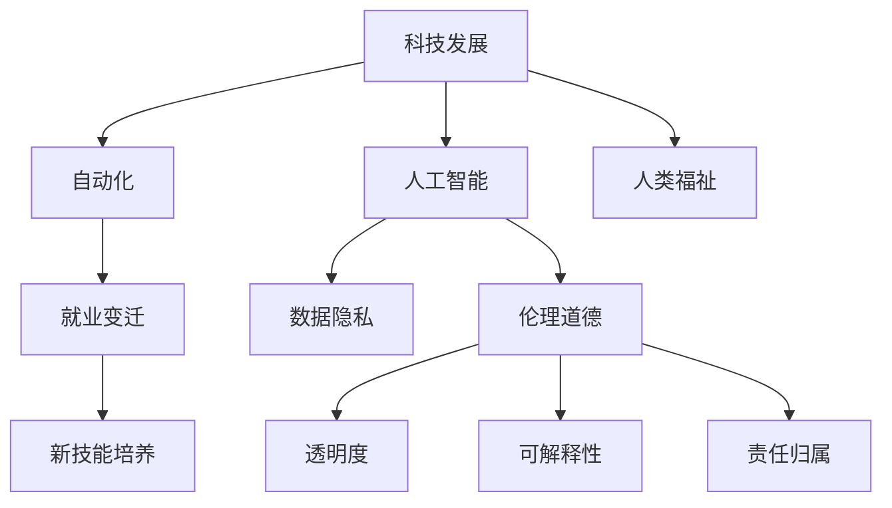

                 

# 科技发展：人类福祉的保障

## 1. 背景介绍

### 1.1 问题由来

随着科技的迅猛发展，尤其是人工智能(AI)和机器学习(ML)技术的突破，我们的生活和工作方式正在发生翻天覆地的变化。从自动驾驶汽车到智能医疗诊断，从智能家居到在线教育，科技正逐步渗透到各个领域，极大地提升了生产效率和生活质量。然而，科技的发展也带来了新的挑战和风险，如数据隐私、伦理道德、就业变迁等问题，需要我们深入思考和慎重应对。

### 1.2 问题核心关键点

科技发展的核心关键点主要包括以下几点：

- 自动化与就业：自动化技术在提升生产效率的同时，也对就业市场产生了深远影响。哪些岗位将被自动化取代，哪些岗位需要新的技能，成为必须面对的挑战。
- 数据隐私与伦理：在数据驱动的科技应用中，如何保障用户数据隐私，避免数据滥用和偏见，是必须解决的重要问题。
- 人工智能的伦理与责任：随着AI技术的发展，AI系统的决策过程变得复杂，如何确保AI系统的透明性、可解释性和责任归属，成为亟需解决的关键问题。
- 科技与人文关怀：科技的快速发展应如何与人类福祉相结合，避免科技发展带来的负面效应，提升人类的整体福祉。

本文将围绕上述核心问题，详细探讨科技发展与人类福祉之间的关系，并提出应对策略，以期为科技应用的可持续发展提供理论支持和实践指导。

## 2. 核心概念与联系

### 2.1 核心概念概述

为了更好地理解科技发展与人类福祉的关系，我们先介绍一些核心概念：

- **科技发展**：指通过技术进步和创新，提升生产效率、改善生活质量、解决复杂问题的过程。
- **人类福祉**：指通过科技发展，增进人类健康、教育、经济、社会、环境等方面的福祉。
- **人工智能**：利用机器学习、深度学习等技术，使机器能够模拟人类智能的行为。
- **数据隐私**：指在数据采集、处理、存储、传输和使用过程中，保障个人数据不被非法获取、使用或泄露的权利。
- **伦理道德**：指在科技应用中，遵循社会公认的道德准则和规范，避免对人类社会造成负面影响。
- **自动化**：指通过机械、电子、软件等技术手段，使工作流程自动化，提升效率、降低成本。

这些概念之间的逻辑关系可以通过以下Mermaid流程图来展示：



这个流程图展示出科技发展与人类福祉的紧密联系：科技发展通过自动化和人工智能，促进经济效率和社会福祉的提升；同时，数据隐私和伦理道德的关注，确保科技应用的负责任和透明性，最终实现人类福祉的可持续提升。

## 3. 核心算法原理 & 具体操作步骤

### 3.1 算法原理概述

在讨论科技发展与人类福祉的关系时，我们可以从算法原理的角度，分析科技如何在不同层面影响人类福祉。以下是一些关键算法原理：

- **数据驱动决策**：基于大数据分析和机器学习模型，科技可以帮助政府和企业做出更科学、更有效的决策。
- **个性化服务**：通过分析用户数据，科技可以提供定制化的服务，如个性化医疗、个性化教育等。
- **自动化流程**：自动化技术可以大幅度提升工作效率，减少人力成本。
- **预测与优化**：机器学习模型可以对未来进行预测，帮助企业和政府优化资源分配。

### 3.2 算法步骤详解

科技在提升人类福祉的过程中，需要经历以下步骤：

1. **数据收集**：通过各种传感器、社交媒体、医疗记录等渠道，收集海量数据。
2. **数据预处理**：对收集到的数据进行清洗、去重、标注等预处理，以便后续分析和应用。
3. **模型训练**：使用机器学习算法，训练模型，以便对数据进行分析和预测。
4. **应用部署**：将训练好的模型部署到实际应用中，如智能医疗诊断、智能推荐系统等。
5. **持续优化**：根据反馈数据，不断调整和优化模型，确保模型性能的稳定和提升。

### 3.3 算法优缺点

科技在提升人类福祉的同时，也存在一些潜在问题和挑战：

- **数据隐私**：科技应用中，如何保障个人数据隐私，避免数据滥用和泄露，是一个重大挑战。
- **算法偏见**：机器学习模型可能存在算法偏见，导致决策不公平，需要寻找解决方案。
- **技术可接受性**：一些科技应用可能被用户不接受，需要改进用户体验。
- **经济不平等**：科技发展可能加剧社会经济不平等，需要找到普惠性的技术解决方案。

### 3.4 算法应用领域

科技发展在多个领域展现了其对人类福祉的提升潜力：

- **医疗健康**：通过智能诊断、个性化治疗等手段，科技极大地提升了医疗服务的质量和效率。
- **教育**：智能教育技术如在线学习、个性化推荐等，使得教育资源更加公平、高效。
- **环境保护**：使用智能监测系统、数据分析等手段，提升环境保护水平，实现可持续发展。
- **社会治理**：通过大数据分析和智能决策，提升政府治理能力和公共服务水平。

## 4. 数学模型和公式 & 详细讲解 & 举例说明

### 4.1 数学模型构建

我们可以使用数学模型来描述科技发展对人类福祉的提升过程。假设科技发展的目标是最大化人类福祉 $W$，其中 $W$ 可以分解为多个子目标，如健康 $H$、教育 $E$、经济 $E$ 等。

设 $F$ 为科技发展的功能，$C$ 为成本，则目标函数为：

$$
\max_{F} W = H + E + \cdots
$$

约束条件为：

$$
C = F - P
$$

其中 $P$ 为科技应用中的隐私损失、伦理风险等负外部性。

### 4.2 公式推导过程

对于上述优化问题，我们可以使用拉格朗日乘子法求解。设 $\lambda$ 为拉格朗日乘子，则拉格朗日函数为：

$$
\mathcal{L}(F, \lambda) = W - \lambda(C - F + P)
$$

求解该优化问题，得到最优解 $F^*$。

### 4.3 案例分析与讲解

以智能医疗诊断为例，我们可以构建如下数学模型：

设 $F = H + E + C$，其中 $H$ 为健康提升，$E$ 为教育改进，$C$ 为成本。目标为最大化 $W = H + E$，约束为 $C = F - P$，其中 $P$ 为隐私损失。

通过求解该模型，我们可以找到最优的 $F$，从而最大化人类福祉。

## 5. 项目实践：代码实例和详细解释说明

### 5.1 开发环境搭建

在实践科技发展与人类福祉的研究时，我们需要一个强大的开发环境。以下是Python环境的搭建步骤：

1. 安装Python 3.9+：从官网下载并安装完成后，进入命令行输入 `python -V` 确认安装成功。
2. 安装Anaconda：从官网下载并安装Anaconda，创建虚拟环境。
3. 安装必要的库：如NumPy、Pandas、Scikit-learn、TensorFlow等。

### 5.2 源代码详细实现

以智能医疗诊断为例，我们可以使用TensorFlow构建一个基于深度学习模型的诊断系统。

首先，准备数据集和标签：

```python
import tensorflow as tf
from sklearn.datasets import load_breast_cancer
from sklearn.model_selection import train_test_split

data = load_breast_cancer()
X_train, X_test, y_train, y_test = train_test_split(data.data, data.target, test_size=0.2, random_state=42)
```

接着，定义模型结构：

```python
model = tf.keras.Sequential([
    tf.keras.layers.Dense(64, activation='relu', input_shape=(30,)),
    tf.keras.layers.Dense(1, activation='sigmoid')
])
```

然后，编译模型并训练：

```python
model.compile(optimizer='adam', loss='binary_crossentropy', metrics=['accuracy'])
model.fit(X_train, y_train, epochs=10, batch_size=32, validation_data=(X_test, y_test))
```

最后，评估模型性能：

```python
model.evaluate(X_test, y_test)
```

### 5.3 代码解读与分析

上述代码展示了从数据准备、模型定义、编译、训练到评估的完整过程。可以看到，使用TensorFlow可以方便地构建、训练和评估深度学习模型。

## 6. 实际应用场景

### 6.1 智能医疗诊断

智能医疗诊断是科技提升人类福祉的重要应用之一。通过深度学习模型，可以从医学影像、基因数据等中提取特征，辅助医生进行精准诊断。例如，使用卷积神经网络(CNN)对医学影像进行分类，使用循环神经网络(RNN)处理基因序列，可以显著提升诊断的准确性和效率。

### 6.2 智能教育

智能教育技术通过个性化学习路径、智能推荐系统等手段，提升教育质量。例如，使用基于协同过滤的推荐算法，为学生推荐合适的学习资源和课程，可以大幅度提升学习效果。

### 6.3 环境保护

科技在环境保护中也发挥了重要作用。通过智能监测系统、数据分析等手段，可以实时监控污染源，预测环境变化趋势，制定科学合理的环保政策。

### 6.4 未来应用展望

未来，科技在提升人类福祉方面的潜力将进一步释放。例如，随着5G、物联网等技术的发展，智能家居、智慧城市等应用将更加普及。AI技术将在更多领域得到应用，如自动驾驶、智能制造等，进一步提升生产效率和生活质量。

## 7. 工具和资源推荐

### 7.1 学习资源推荐

为了深入理解科技发展与人类福祉的关系，我们推荐以下学习资源：

1. 《人工智能：一种现代方法》：详细介绍了AI的原理和应用，适合入门和深入学习。
2. 《数据科学导论》：介绍了数据驱动决策的理论和实践，是理解科技应用的基础。
3. 《机器学习实战》：通过实际项目，展示了机器学习算法在实际问题中的应用。
4. 《深度学习》：讲解了深度学习模型的原理和应用，是理解科技应用的重要基础。
5. Coursera上的相关课程：如《深度学习专项课程》、《机器学习课程》等，提供系统的学习资源。

### 7.2 开发工具推荐

以下是几个推荐的开发工具：

1. Python：Python是一种广泛使用的编程语言，具有丰富的科学计算和机器学习库。
2. TensorFlow：由Google开发的深度学习框架，支持分布式计算，适合大规模应用。
3. PyTorch：由Facebook开发的深度学习框架，具有动态图和灵活性，适合研究和快速迭代。
4. Anaconda：用于创建和管理虚拟环境，方便科学计算和机器学习的开发。
5. Jupyter Notebook：用于编写和分享Python代码，适合学习和项目开发。

### 7.3 相关论文推荐

以下是几篇经典的科技发展与人类福祉的论文，推荐阅读：

1. "AI for Good: Opportunities, Risks, and Ethical Implications"（《AI对美好未来的贡献：机会、风险与伦理影响》）：探讨了AI技术在提升人类福祉方面的潜力与挑战。
2. "The Ethical Implications of Artificial Intelligence: A Research Agenda"（《人工智能伦理：研究议程》）：分析了AI伦理问题的各个方面，提出了未来研究的重点方向。
3. "Human-Centered AI: Navigating the Ethics of Ethical AI"（《以人为中心的AI：导航AI伦理》）：探讨了AI伦理问题的解决方案，提出了人机协同的思路。
4. "Data Privacy and Ethics in AI: A Review"（《AI中数据隐私与伦理：综述》）：总结了AI应用中的数据隐私问题和解决方案。

## 8. 总结：未来发展趋势与挑战

### 8.1 研究成果总结

本文通过分析科技发展对人类福祉的影响，提出了科技与人类福祉相结合的思路。总结来说，科技发展在提升生产效率、改善生活质量、解决复杂问题等方面具有巨大的潜力，但也面临数据隐私、伦理道德、经济不平等等挑战。

### 8.2 未来发展趋势

未来，科技将继续在各个领域发挥重要作用，提升人类福祉。以下是一些可能的趋势：

1. 自动化和智能化：随着AI技术的发展，自动化程度将不断提高，提升生产效率和社会效率。
2. 数据驱动决策：基于大数据和机器学习的决策将越来越普及，提升决策的科学性和准确性。
3. 可持续发展：科技在环境保护、能源利用等方面将发挥重要作用，推动可持续发展。
4. 智能医疗：智能医疗诊断、个性化治疗等将进一步普及，提升医疗服务的质量和效率。
5. 智能教育：智能教育技术将推动教育公平，提升教育质量和效率。

### 8.3 面临的挑战

尽管科技在提升人类福祉方面具有巨大潜力，但也面临诸多挑战：

1. 数据隐私：科技应用中如何保障数据隐私，避免数据滥用和泄露，是一个重大挑战。
2. 算法偏见：机器学习模型可能存在算法偏见，导致决策不公平，需要寻找解决方案。
3. 技术可接受性：一些科技应用可能被用户不接受，需要改进用户体验。
4. 经济不平等：科技发展可能加剧社会经济不平等，需要找到普惠性的技术解决方案。

### 8.4 研究展望

面对这些挑战，未来的研究需要在以下几个方面寻求新的突破：

1. 数据隐私保护：开发隐私保护技术，如差分隐私、联邦学习等，确保数据隐私。
2. 算法公平性：研究公平性算法，消除算法偏见，确保决策公平。
3. 技术普适性：研究普适性技术，确保技术应用的可接受性和普及性。
4. 可持续发展：推动科技在环境保护、能源利用等方面的应用，推动可持续发展。
5. 伦理道德：建立科技应用的伦理道德标准，确保科技应用符合人类价值观和伦理道德。

## 9. 附录：常见问题与解答

**Q1：科技发展是否会带来就业变迁？**

A: 是的，科技发展将带来就业变迁。一些传统岗位可能会被自动化取代，而新的技术岗位将不断出现。因此，需要不断学习新的技能，适应就业市场的变化。

**Q2：如何确保科技应用的透明度和可解释性？**

A: 需要开发可解释性模型，如决策树、可解释的神经网络等，使得模型决策过程透明可解释。同时，建立监督机制，确保模型决策符合伦理道德标准。

**Q3：如何保障数据隐私？**

A: 需要开发隐私保护技术，如差分隐私、联邦学习等，确保数据在传输、存储和使用过程中不被泄露。同时，建立数据使用的透明性和合规性标准。

**Q4：科技如何促进可持续发展？**

A: 科技在环境保护、能源利用等方面可以发挥重要作用。例如，使用智能监测系统、数据分析等手段，提升环境保护水平，实现可持续发展。

**Q5：科技如何提升社会经济公平性？**

A: 需要开发普适性技术，确保科技应用的可接受性和普及性，避免加剧社会经济不平等。同时，政府和企业应积极推动公平科技政策，确保技术惠及所有人。

---

作者：禅与计算机程序设计艺术 / Zen and the Art of Computer Programming

