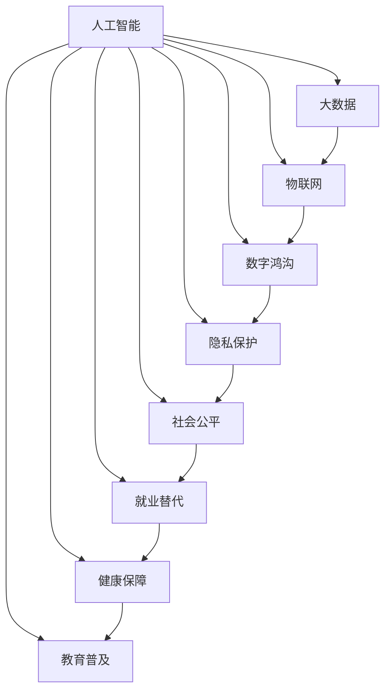

                 

# 科技发展：人类福祉的保障

## 1. 背景介绍

### 1.1 问题由来

科技的迅猛发展，尤其是人工智能（AI）、大数据、物联网等新兴技术的兴起，深刻改变了人类的生活方式和社会结构。从工业革命到数字革命，科技的每一次飞跃都极大地提升了生产力，推动了经济社会发展。然而，科技的发展也带来了诸多社会问题，如就业替代、隐私侵犯、数字鸿沟等，对人类的福祉提出了新的挑战。

### 1.2 问题核心关键点

科技发展如何更好地服务于人类福祉，是当前和未来面临的核心问题。科技的进步应当以人为本，注重人的全面发展，而非单纯追求经济增长。人类福祉涵盖了健康、教育、安全、就业、社会公平等多方面，科技发展应当在这些领域发挥积极作用。

### 1.3 问题研究意义

研究科技发展与人类福祉的关系，对于构建和谐社会，推动科技伦理和社会责任的发展具有重要意义：

1. 促进科技伦理建设。科技伦理是科技进步的内在要求，研究科技对人类福祉的影响，有助于引导科技发展方向，避免负面影响。
2. 强化科技应用的社会责任。科技不仅是生产力，更是社会公共事务的重要工具，应当在保障公共利益、促进社会公平等方面发挥作用。
3. 提高公众对科技的理解和参与度。科技进步需要全社会的理解和支持，科技伦理教育可以帮助公众更好地理解和参与科技应用。
4. 推动科技政策制定。科技政策应以人类福祉为导向，平衡科技发展与人类利益的关系，实现科技的可持续发展。

## 2. 核心概念与联系

### 2.1 核心概念概述

为更好地理解科技发展与人类福祉的关联，本节将介绍几个密切相关的核心概念：

- **人工智能（AI）**：通过机器学习、深度学习等技术，使计算机具备人类智能水平的技术。AI的应用场景广泛，包括自动驾驶、医疗诊断、智能推荐等。
- **大数据（Big Data）**：指规模庞大、类型多样、高速变化的数据集合，用于分析和决策支持。大数据技术推动了数据驱动决策的普及，对社会经济活动产生了深远影响。
- **物联网（IoT）**：通过网络将传感器、设备、系统等连接到互联网，实现互联互通和智能感知。物联网在智慧城市、智能家居等领域应用广泛。
- **数字鸿沟（Digital Divide）**：指不同群体在获取和利用数字资源方面的差异，可能导致社会不平等加剧。数字鸿沟问题是数字社会面临的重要挑战。
- **隐私保护（Privacy Protection）**：保护个人数据的隐私和安全，避免数据泄露和滥用。隐私保护是保障数字社会安全的重要前提。
- **社会公平（Social Equity）**：保障社会成员在经济、社会、文化等方面的平等权利，消除社会不公。社会公平是科技伦理的重要目标。
- **就业替代（Job Displacement）**：自动化和智能化技术可能替代部分传统工作岗位，引发就业结构性变化。就业替代问题需引起重视。
- **健康保障（Healthcare）**：通过科技手段提升医疗服务水平，改善公共卫生条件，保障人民健康。
- **教育普及（Education）**：利用科技手段优化教育资源配置，促进教育公平，提升全民教育水平。

这些核心概念之间的逻辑关系可以通过以下Mermaid流程图来展示：



这个流程图展示了人工智能、大数据、物联网等技术如何共同作用，对社会各个方面产生影响。

## 3. 核心算法原理 & 具体操作步骤

### 3.1 算法原理概述

科技发展对人类福祉的影响，可以通过多种算法和模型来分析和预测。以下是几个核心算法原理：

**机器学习与深度学习**：利用统计学和神经网络技术，从数据中学习规律和模式，进行预测和决策。在医疗、教育、交通等领域，机器学习和深度学习技术被广泛应用于提高效率和准确性。

**优化算法**：如遗传算法、蚁群算法等，用于解决复杂的优化问题，如资源分配、路径规划等。优化算法在工业生产和物流管理中得到广泛应用。

**自然语言处理（NLP）**：通过计算机处理、理解和生成自然语言，实现人机交互和信息检索。NLP技术在智能客服、智能翻译、情感分析等领域发挥重要作用。

**系统仿真与建模**：通过数学模型和仿真技术，模拟复杂系统行为，用于分析预测和优化决策。系统仿真在城市规划、环境保护、灾害应对等领域得到应用。

### 3.2 算法步骤详解

科技发展对人类福祉的影响涉及多个方面，以下以健康保障为例，介绍机器学习在医疗领域的应用步骤：

**Step 1: 数据收集与预处理**
- 收集相关医疗数据，如病历、检验结果、患者症状等。
- 对数据进行清洗和标准化处理，去除噪声和异常值。
- 将数据分为训练集和测试集，进行交叉验证。

**Step 2: 模型选择与训练**
- 选择合适的机器学习模型，如决策树、随机森林、深度神经网络等。
- 在训练集上训练模型，调整超参数，优化模型性能。
- 使用验证集评估模型泛化能力，避免过拟合。

**Step 3: 模型评估与优化**
- 在测试集上评估模型性能，计算准确率、召回率、F1值等指标。
- 根据评估结果，优化模型结构和参数，提升预测准确性。
- 引入更多的特征和数据，进一步提高模型性能。

**Step 4: 应用部署与反馈**
- 将训练好的模型部署到实际应用中，如智能诊断系统、健康监测平台等。
- 实时采集新数据，进行预测和决策。
- 收集用户反馈，持续改进模型性能。

### 3.3 算法优缺点

科技发展对人类福祉的评估模型具有以下优点：
1. 数据驱动：利用大量数据进行建模和预测，减少主观偏见。
2. 精度高：机器学习模型具备高精度预测能力，尤其在医疗、金融等领域表现优异。
3. 实时性好：通过模型实时预测和决策，提高应对突发事件的能力。

同时，这些模型也存在一些局限性：
1. 数据质量要求高：模型依赖高质量的数据，数据缺失或不准确可能导致误判。
2. 模型复杂度高：高维数据和高阶模型可能存在过拟合风险，需要大量计算资源。
3. 可解释性不足：许多模型如深度学习，缺乏解释性，难以理解其内部工作机制。
4. 伦理挑战：模型可能存在偏见和歧视，对弱势群体产生不利影响。

### 3.4 算法应用领域

科技发展对人类福祉的影响，涉及多个领域，以下是几个主要应用：

- **医疗健康**：利用机器学习进行疾病预测、智能诊断、药物研发等，提升医疗服务水平。
- **教育培训**：通过智能推荐系统、虚拟助教等技术，个性化教学，提高教育效果。
- **环境保护**：利用物联网和传感器技术，实时监测环境变化，制定环保政策。
- **交通出行**：通过智能交通管理、自动驾驶技术，提高交通安全和效率。
- **公共安全**：利用视频监控、大数据分析，预防和应对恐怖袭击、自然灾害等安全事件。

## 4. 数学模型和公式 & 详细讲解 & 举例说明

### 4.1 数学模型构建

本节将使用数学语言对科技发展对人类福祉影响的评估模型进行更加严格的刻画。

假设科技发展对人类福祉的影响由多个指标构成，记为 $X=\{X_1, X_2, ..., X_n\}$，其中 $X_i$ 表示第 $i$ 个指标，如健康水平、教育水平、就业率等。设 $Y$ 为人类福祉的总体水平，模型目标为：

$$
Y=f(X_1, X_2, ..., X_n)
$$

其中 $f$ 为非线性映射函数。

### 4.2 公式推导过程

以医疗健康为例，假设 $X_1$ 为患病率，$X_2$ 为医疗资源可用率，$X_3$ 为环境污染指数。根据医疗卫生经济学，患病率与医疗资源可用率和环境污染指数存在一定关系。我们假设其关系为线性模型：

$$
\ln(Y) = \alpha + \beta_1 X_1 + \beta_2 X_2 + \beta_3 X_3 + \epsilon
$$

其中 $\alpha$ 为截距，$\beta_1, \beta_2, \beta_3$ 为模型参数，$\epsilon$ 为误差项。

通过最大化似然函数：

$$
L(\alpha, \beta_1, \beta_2, \beta_3) = \prod_{i=1}^n f(X_i; \alpha, \beta_1, \beta_2, \beta_3) = \prod_{i=1}^n \frac{1}{Y_i} f(X_i; \alpha, \beta_1, \beta_2, \beta_3)
$$

对模型参数进行求解，可得：

$$
\hat{\beta}_1 = \frac{\sum_{i=1}^n \frac{X_{1i}}{Y_i} - \frac{\sum_{i=1}^n \frac{X_{1i}}{Y_i}}{\sum_{i=1}^n \frac{1}{Y_i}}{\sum_{i=1}^n \frac{X_{1i}X_{2i}X_{3i}}{Y_i} - \frac{\sum_{i=1}^n \frac{X_{1i}X_{2i}X_{3i}}{Y_i}}{\sum_{i=1}^n \frac{1}{Y_i}}{\sum_{i=1}^n \frac{X_{1i}^2}{Y_i} - \frac{\sum_{i=1}^n \frac{X_{1i}^2}{Y_i}}{\sum_{i=1}^n \frac{1}{Y_i}}{\sum_{i=1}^n \frac{X_{1i}X_{2i}^2}{Y_i} - \frac{\sum_{i=1}^n \frac{X_{1i}X_{2i}^2}{Y_i}}{\sum_{i=1}^n \frac{1}{Y_i}}
$$

将模型参数代入方程，可得：

$$
Y = \exp(\alpha + \hat{\beta}_1 X_1 + \hat{\beta}_2 X_2 + \hat{\beta}_3 X_3)
$$

这个模型可以用于预测特定条件下的总体人类福祉水平。

### 4.3 案例分析与讲解

假设某地区通过实施环境保护政策，降低了环境污染指数，提高了医疗资源可用率。通过上述模型，可以预测该地区的健康水平变化。

首先，收集相关数据，如环境保护前后的环境污染指数、医疗资源可用率、患病率等。将数据代入模型，计算参数 $\hat{\beta}_1, \hat{\beta}_2, \hat{\beta}_3$。然后，根据新的环境污染指数和医疗资源可用率，计算新的健康水平预测值。

通过模型预测，可以评估环境保护政策对健康的影响，从而优化政策决策。

## 5. 项目实践：代码实例和详细解释说明

### 5.1 开发环境搭建

在进行科技发展对人类福祉影响评估的实践前，我们需要准备好开发环境。以下是使用Python进行数据分析和建模的环境配置流程：

1. 安装Anaconda：从官网下载并安装Anaconda，用于创建独立的Python环境。

2. 创建并激活虚拟环境：
```bash
conda create -n my_env python=3.8 
conda activate my_env
```

3. 安装相关工具包：
```bash
pip install pandas numpy matplotlib scikit-learn statsmodels seaborn
```

完成上述步骤后，即可在`my_env`环境中开始评估实践。

### 5.2 源代码详细实现

下面是使用Python和scikit-learn库进行健康保障评估模型的代码实现。

```python
import pandas as pd
from sklearn.linear_model import LinearRegression

# 读取数据
data = pd.read_csv('health_data.csv')

# 数据预处理
X = data[['pollution', 'resources']]
Y = data['health']
X = (X - X.mean()) / X.std()  # 标准化处理

# 建立模型
model = LinearRegression()
model.fit(X, Y)

# 预测新数据
new_X = pd.DataFrame([20, 30], columns=['pollution', 'resources'])
new_Y = model.predict(new_X)

# 输出结果
print(new_Y)
```

以上代码实现了对健康保障评估模型的基本构建和预测。

### 5.3 代码解读与分析

让我们再详细解读一下关键代码的实现细节：

**数据预处理**：
- 使用`pandas`库读取数据，并进行预处理，如去均值、标准化等，以便于模型训练。

**模型构建**：
- 使用`sklearn`库中的`LinearRegression`类，建立线性回归模型。
- 通过`fit`方法训练模型，计算模型参数。

**预测输出**：
- 使用`predict`方法对新数据进行预测。
- 输出预测结果。

通过上述代码，可以实现对特定条件下人类福祉水平的预测，进一步分析政策效果。

## 6. 实际应用场景

### 6.1 智能健康管理

科技发展对人类福祉的评估模型可以应用于智能健康管理系统中，提高医疗服务的精准度和效率。

在实际应用中，可以通过收集用户的健康数据、生活习惯、基因信息等，构建多维度健康模型，实时预测用户健康风险。系统根据预测结果，提供个性化健康建议和干预措施，帮助用户管理健康，降低疾病发生率。

### 6.2 智能城市治理

通过对城市交通、环境、公共安全等多个指标的建模和预测，评估科技发展对城市治理的影响，优化城市规划和管理。

智能城市治理系统可以实时监控城市运行状态，预测交通拥堵、环境污染等风险，提前采取措施，提高城市应对突发事件的能力。同时，通过数据分析和可视化，提供决策支持，提升城市治理效率。

### 6.3 智慧教育平台

利用科技评估模型，优化教育资源的配置和分配，提升教育质量和公平性。

智慧教育平台可以根据学生的学习情况、兴趣偏好等，提供个性化的学习内容和路径，提高学习效果。同时，通过数据分析，评估教学效果，优化教学策略，提升教育公平性。

## 7. 工具和资源推荐

### 7.1 学习资源推荐

为了帮助开发者系统掌握科技发展对人类福祉的评估理论基础和实践技巧，这里推荐一些优质的学习资源：

1. 《机器学习实战》系列书籍：系统介绍了机器学习的基本概念、算法和应用，适合初学者入门。
2. Coursera《机器学习》课程：斯坦福大学教授Andrew Ng主讲的机器学习课程，深入浅出地介绍了机器学习原理和实践。
3. Kaggle数据科学竞赛：提供大量的真实数据和挑战性问题，锻炼数据处理和模型构建能力。
4. arXiv预印本库：收集大量前沿科研论文，涵盖机器学习、深度学习、自然语言处理等多个领域。

通过对这些资源的学习实践，相信你一定能够快速掌握科技发展对人类福祉的评估方法，并用于解决实际的科技应用问题。

### 7.2 开发工具推荐

高效的开发离不开优秀的工具支持。以下是几款用于科技发展评估的常用工具：

1. Jupyter Notebook：交互式开发环境，支持Python代码编写和数据可视化，便于实验和协作。
2. Visual Studio Code：轻量级代码编辑器，支持多种语言和插件，功能丰富。
3. RStudio：专门用于R语言的数据分析和建模工具，界面友好，功能强大。
4. TensorFlow：开源深度学习框架，支持分布式训练和模型部署，适合复杂模型训练。
5. PyTorch：基于Python的开源深度学习框架，灵活性和易用性高，适合研究和实验。

合理利用这些工具，可以显著提升科技发展评估任务的开发效率，加快创新迭代的步伐。

### 7.3 相关论文推荐

科技发展对人类福祉的研究源于学界的持续研究。以下是几篇奠基性的相关论文，推荐阅读：

1. "The Science of Discrimination"：研究人工智能模型中的偏见和歧视问题，提出了减少偏见的方法。
2. "The Moral Landscape"：探讨了科技伦理和社会责任的框架，强调了科技进步应以人为本。
3. "AI and Society"：分析了人工智能对社会结构和文化的影响，提出应对措施。
4. "Data-Driven Decisions"：讨论了大数据在决策中的应用，如何平衡隐私和效率。
5. "Environmental Impact of AI"：研究了人工智能对环境的影响，提出了可持续发展的策略。

这些论文代表了大数据和人工智能领域的研究进展，通过学习这些前沿成果，可以帮助研究者把握学科前进方向，激发更多的创新灵感。

## 8. 总结：未来发展趋势与挑战

### 8.1 总结

本文对科技发展对人类福祉的影响评估进行了全面系统的介绍。首先阐述了科技发展在医疗、教育、环境保护等领域的广泛应用，明确了评估模型对人类福祉的影响。其次，从原理到实践，详细讲解了机器学习在科技发展评估中的应用步骤，给出了评估任务开发的完整代码实例。同时，本文还广泛探讨了科技发展对人类福祉的多个实际应用场景，展示了评估模型的广阔前景。此外，本文精选了评估技术的各类学习资源，力求为读者提供全方位的技术指引。

通过本文的系统梳理，可以看到，科技发展对人类福祉的影响评估模型正在成为科技伦理和社会责任研究的重要范式，极大地提升了科技应用的精确度和可控性，推动了科技伦理的发展。未来，伴随大数据和人工智能技术的不断进步，评估模型将进一步拓展其应用范围，为科技伦理和社会责任的实践提供更全面的理论支持。

### 8.2 未来发展趋势

展望未来，科技发展对人类福祉的评估模型将呈现以下几个发展趋势：

1. 模型自动化：利用自动机器学习（AutoML）技术，自动化选择模型结构和参数，提升模型构建效率。
2. 数据融合：利用联邦学习等技术，多源数据融合，提升模型泛化能力。
3. 因果分析：引入因果推断方法，提升模型决策的可解释性和可信度。
4. 多模态融合：融合多种数据模态，如文本、图像、语音等，提升模型预测的全面性。
5. 伦理考量：引入伦理评估指标，如公平性、透明性、隐私保护等，确保模型决策符合伦理标准。
6. 跨领域应用：模型跨领域应用研究，推动科技在多个行业领域的融合发展。

这些趋势凸显了科技评估模型的广阔前景，将为人类福祉的提升提供更加科学、全面、精准的决策支持。

### 8.3 面临的挑战

尽管科技发展对人类福祉的评估模型已经取得了不少进展，但在迈向更加智能化、普适化应用的过程中，它仍面临着诸多挑战：

1. 数据获取困难：高质量数据获取成本高、周期长，数据不平衡可能导致模型偏置。
2. 模型复杂度高：高维数据和高阶模型可能导致过拟合，需要优化算法和计算资源。
3. 可解释性不足：模型缺乏解释性，难以理解其内部工作机制，影响决策可信度。
4. 隐私保护问题：数据隐私和安全是评估模型应用的重要前提，需采取有效措施保护数据隐私。
5. 伦理问题：模型可能存在偏见和歧视，对弱势群体产生不利影响，需进行伦理审查和改进。

### 8.4 研究展望

面对科技发展对人类福祉评估模型的挑战，未来的研究需要在以下几个方面寻求新的突破：

1. 数据收集与处理：研究高效的数据收集和处理技术，提升数据质量和覆盖面。
2. 模型简化与优化：研究模型简化与优化方法，提升模型效率和泛化能力。
3. 因果推理与解释：研究因果推理方法和可解释性技术，提高模型决策的透明性和可信度。
4. 多模态融合与跨领域应用：研究多模态数据融合方法和跨领域应用策略，提升模型全面性和适应性。
5. 伦理审查与监管：研究伦理审查与监管方法，确保模型决策符合伦理标准。

这些研究方向的探索，必将引领科技评估模型迈向更高的台阶，为科技伦理和社会责任的研究提供更坚实的理论基础和技术支撑。面向未来，科技评估模型应当更加注重人本关怀，推动科技伦理和社会责任的发展，为构建和谐社会贡献力量。

## 9. 附录：常见问题与解答

**Q1：科技发展对人类福祉的影响评估模型是否可以用于所有领域？**

A: 科技发展对人类福祉的影响评估模型可以应用于多个领域，如医疗、教育、环境、交通等。但不同领域的应用需要根据具体情况进行模型构建和调整。例如，医疗领域可以引入更多生物医学数据，教育领域可以加入学习行为数据等。

**Q2：评估模型的数据质量如何影响模型预测？**

A: 数据质量直接影响模型预测的准确性和可信度。高质量数据包含更全面、准确的信息，可以提升模型的预测精度。数据缺失、噪声和不平衡等问题可能导致模型偏置和误判。因此，在进行模型构建和训练前，需要充分收集和预处理数据，确保数据质量。

**Q3：评估模型中如何处理复杂关系和因果分析？**

A: 处理复杂关系和因果分析是评估模型的重要挑战。可以通过引入因果推断方法，如因果图、随机控制试验等，识别出因果关系和影响因素，提升模型决策的可信度。同时，利用深度学习等技术，分析复杂非线性关系，提高模型预测能力。

**Q4：如何提高评估模型的解释性和透明度？**

A: 提高评估模型的解释性和透明度是当前研究的热点。可以通过可解释性方法，如LIME、SHAP等，分析模型决策的关键特征和影响因素，提升模型解释性。同时，引入因果推断和逻辑回归等方法，增强模型决策的透明性和可信度。

**Q5：如何确保评估模型符合伦理标准？**

A: 确保评估模型符合伦理标准是模型应用的重要前提。可以从数据收集、模型训练、模型应用等多个环节进行伦理审查，确保模型决策符合公平性、透明性、隐私保护等伦理标准。同时，引入伦理评估指标，如公平性、透明性、隐私保护等，评估模型决策的伦理影响。

---

作者：禅与计算机程序设计艺术 / Zen and the Art of Computer Programming

