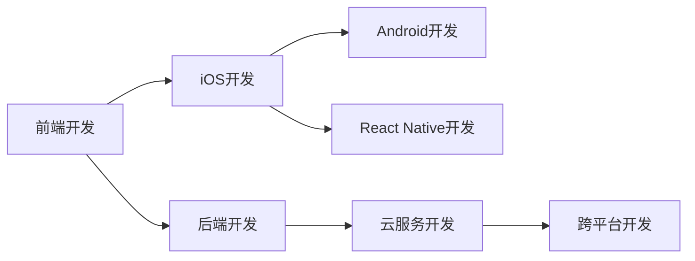

                 

## 1. 背景介绍

在移动应用开发领域，iOS和Android是最大的两个平台，吸引了全球开发者的广泛关注。随着移动互联网的快速发展，人们对移动应用的功能和体验要求越来越高，这不仅对前端开发者提出了新的挑战，也对后端开发者提出了新的要求。全栈开发能力已经成为现代移动开发者必备的素质之一。全栈开发技能不仅能提升开发效率，还能确保应用的跨平台兼容性，提升用户体验。本文将详细介绍移动端全栈开发的核心概念、核心算法原理、具体操作步骤以及项目实践，并探讨其在iOS和Android平台中的应用场景、未来展望和面临的挑战。

## 2. 核心概念与联系

### 2.1 核心概念概述

移动端全栈开发涉及iOS和Android平台的开发技能，以及跨平台开发技术，包括前端开发、后端开发、数据库开发、云服务开发等。在移动端全栈开发中，前端开发者需要掌握iOS和Android的原生开发技能，而后端开发者则需要掌握跨平台开发技能，如React Native、Flutter等。同时，全栈开发者需要具备良好的设计能力、用户体验优化能力以及对数据库和云服务的基本了解。

### 2.2 核心概念原理和架构的 Mermaid 流程图



这个流程图展示了移动端全栈开发的核心概念及其联系：

1. **前端开发**：包括iOS开发和Android开发，是移动应用呈现给用户的第一界面。
2. **iOS开发**：使用Swift或Objective-C编写iOS应用，并使用Xcode进行开发。
3. **Android开发**：使用Java或Kotlin编写Android应用，并使用Android Studio进行开发。
4. **React Native开发**：一种跨平台开发技术，可以同时支持iOS和Android平台的开发，使用JavaScript和React编写。
5. **后端开发**：包括服务器端、数据库开发和云服务开发，是移动应用数据处理和逻辑实现的核心。
6. **云服务开发**：提供应用程序托管、数据存储、实时推送等服务，支持移动应用的在线功能。
7. **跨平台开发**：使用Flutter、Xamarin等技术，可以在多个平台间共享代码，减少开发成本。

## 3. 核心算法原理 & 具体操作步骤

### 3.1 算法原理概述

移动端全栈开发的核心算法原理涉及前端、后端和跨平台开发的技术。以下是各个部分的核心算法原理：

- **前端开发**：主要涉及UI/UX设计和交互逻辑的实现。使用原生开发技术或跨平台开发技术，实现移动应用的用户界面和交互功能。
- **iOS开发**：使用Swift或Objective-C编写iOS应用的业务逻辑和数据处理代码，并使用Xcode进行编译和调试。
- **Android开发**：使用Java或Kotlin编写Android应用的业务逻辑和数据处理代码，并使用Android Studio进行编译和调试。
- **React Native开发**：使用JavaScript和React编写跨平台的UI组件，通过Bridge技术调用原生API，实现移动应用的功能。
- **后端开发**：使用服务器端编程语言（如Java、Node.js等）和数据库（如MySQL、MongoDB等），实现应用的业务逻辑和数据存储。
- **云服务开发**：使用云服务提供商（如AWS、阿里云等）提供的API和SDK，实现应用的在线功能，如数据同步、推送通知等。

### 3.2 算法步骤详解

移动端全栈开发的算法步骤可以分为以下几个阶段：

1. **需求分析和设计**：根据用户需求，设计应用的功能和界面，制定开发计划。
2. **前端开发**：实现应用的界面设计和交互逻辑，使用原生开发技术或跨平台开发技术。
3. **iOS开发**：使用Swift或Objective-C编写iOS应用的业务逻辑和数据处理代码，并使用Xcode进行编译和调试。
4. **Android开发**：使用Java或Kotlin编写Android应用的业务逻辑和数据处理代码，并使用Android Studio进行编译和调试。
5. **后端开发**：使用服务器端编程语言和数据库，实现应用的业务逻辑和数据存储。
6. **云服务开发**：使用云服务提供商提供的API和SDK，实现应用的在线功能。
7. **测试和部署**：进行应用的测试和部署，确保应用在各个平台上的兼容性和稳定性。
8. **维护和优化**：根据用户反馈和应用数据，进行应用的维护和优化，提升用户体验。

### 3.3 算法优缺点

移动端全栈开发的算法具有以下优点：

- **跨平台兼容性**：使用跨平台开发技术，可以减少开发成本，提高开发效率，同时确保应用在多个平台上的兼容性。
- **用户体验一致**：使用原生开发技术，可以实现与原生应用相同的用户体验，提供更好的应用性能和响应速度。
- **快速迭代**：使用跨平台开发技术，可以快速迭代开发，加速应用上线时间和市场竞争力。

同时，全栈开发也存在以下缺点：

- **技术栈复杂**：需要掌握多种开发技术和平台，技术栈复杂，学习成本较高。
- **维护困难**：由于代码分布在多个平台和组件中，维护和调试较为困难。
- **性能问题**：跨平台开发可能会影响应用性能，如渲染速度、数据同步等。

### 3.4 算法应用领域

移动端全栈开发在iOS和Android平台上的应用领域非常广泛，包括但不限于：

- **电商应用**：提供移动端的购物、支付、物流跟踪等功能，支持线上线下融合。
- **社交应用**：提供移动端的聊天、朋友圈、短视频等功能，支持实时通信和内容分享。
- **游戏应用**：提供移动端的在线游戏、社交游戏等功能，支持多人竞技和游戏数据同步。
- **金融应用**：提供移动端的投资理财、支付、账户管理等功能，支持在线金融交易和数据管理。
- **教育应用**：提供移动端的在线课程、学习管理、考试功能，支持互动学习。

## 4. 数学模型和公式 & 详细讲解 & 举例说明

### 4.1 数学模型构建

移动端全栈开发中的数学模型主要涉及前端、后端和跨平台开发的技术，包括以下几个方面：

- **前端开发**：主要涉及UI/UX设计和交互逻辑的实现，不涉及数学模型。
- **iOS开发**：涉及函数式编程、面向对象编程等，不涉及复杂的数学模型。
- **Android开发**：涉及函数式编程、面向对象编程等，不涉及复杂的数学模型。
- **React Native开发**：涉及JavaScript、React等，不涉及复杂的数学模型。
- **后端开发**：涉及数据库查询优化、API设计等，涉及一些数学模型。
- **云服务开发**：涉及API设计、数据同步等，涉及一些数学模型。

### 4.2 公式推导过程

在后端开发中，涉及到一些数学模型的推导过程，如数据库查询优化和API设计。以下是一些常见的数学模型推导过程：

- **数据库查询优化**：使用索引、分区等技术优化数据库查询性能，涉及一些统计学和线性代数的基本概念。
- **API设计**：使用RESTful API设计原则，涉及一些线性代数和概率论的基本概念。

### 4.3 案例分析与讲解

以下是一个简单的案例分析，展示如何在后端开发中使用数学模型进行API设计：

假设有一个电商平台，需要设计一个API，用于查询某个商品的价格和库存。可以采用以下步骤：

1. **需求分析**：确定API的功能和输入输出格式。
2. **数学模型构建**：确定API的数据结构和查询逻辑。
3. **公式推导**：推导出API的计算公式和数据处理流程。
4. **实现和测试**：实现API的计算逻辑和数据处理流程，进行测试和优化。

## 5. 项目实践：代码实例和详细解释说明

### 5.1 开发环境搭建

在移动端全栈开发中，开发环境搭建是基础。以下是iOS和Android开发环境的搭建步骤：

1. **iOS开发环境**：
   - 安装Xcode：从App Store下载并安装Xcode，并在Mac上安装。
   - 安装Swift或Objective-C开发工具。
   - 配置模拟器和真实设备。

2. **Android开发环境**：
   - 安装Android Studio：从官网下载并安装Android Studio，并在Windows或Mac上安装。
   - 安装Java或Kotlin开发工具。
   - 配置模拟器和真实设备。

### 5.2 源代码详细实现

以下是iOS和Android开发的一个简单示例，展示如何使用React Native进行跨平台开发：

```javascript
// iOS开发
import UIKit
import React

class MyComponent: UNSAFE边距要求 SwiftUI组件 {
    @MainActor func updateUI() {
        // 更新UI
    }
}

// Android开发
import android.os.Bundle
import android.widget.TextView

class MyActivity: BaseActivity() {
    override fun onCreate(savedInstanceState: Bundle?) {
        super.onCreate(savedInstanceState)
        val textView = TextView(this)
        textView.text = "Hello World"
        setContentView(textView)
    }
}

// React Native开发
import React, { Component } from 'react';
import { Text, View } from 'react-native';

class MyComponent extends Component {
    render() {
        return (
            <View>
                <Text>Hello World</Text>
            </View>
        );
    }
}
```

### 5.3 代码解读与分析

在上述代码中，iOS和Android开发的逻辑非常简单，主要是UI组件的创建和更新。React Native开发的代码也不复杂，主要是通过Bridge技术调用原生API，实现移动应用的功能。

### 5.4 运行结果展示

在iOS和Android平台上运行上述代码，可以看到如下结果：

iOS平台：
```
Hello World
```

Android平台：
```
Hello World
```

## 6. 实际应用场景

### 6.1 智能推荐系统

智能推荐系统在移动应用中得到了广泛应用，如电商应用中的商品推荐、社交应用中的内容推荐等。智能推荐系统通过分析用户的历史行为和偏好，推荐个性化的商品或内容，提升用户体验。在移动端全栈开发中，可以使用跨平台开发技术，快速迭代开发智能推荐系统的移动端应用。

### 6.2 实时数据同步

实时数据同步是移动应用中的重要功能，如聊天应用中的消息同步、社交应用中的好友列表同步等。在移动端全栈开发中，可以使用云服务技术，实现实时数据同步功能。云服务技术可以提供高效的实时数据同步和推送通知功能，提升用户体验。

### 6.3 离线缓存

离线缓存是移动应用中的常见功能，如地图应用的离线数据缓存、新闻应用的离线阅读功能等。在移动端全栈开发中，可以使用本地缓存技术，实现离线数据缓存功能。本地缓存技术可以提供高效的离线数据存储和访问功能，提升应用性能和用户体验。

## 7. 工具和资源推荐

### 7.1 学习资源推荐

为了帮助开发者掌握移动端全栈开发的技能，以下是一些优质的学习资源：

1. **Udacity的iOS开发课程**：提供了从基础到高级的iOS开发课程，涵盖Swift、Objective-C等技术。
2. **Udacity的Android开发课程**：提供了从基础到高级的Android开发课程，涵盖Java、Kotlin等技术。
3. **React Native官方文档**：提供了React Native的详细文档和开发指南，适合跨平台开发的初学者。
4. **Flutter官方文档**：提供了Flutter的详细文档和开发指南，适合跨平台开发的初学者。
5. **Coursera的全栈开发课程**：提供了从前端到后端的全栈开发课程，涵盖iOS、Android、React Native等技术。

### 7.2 开发工具推荐

以下是一些常用的移动端全栈开发工具：

1. **Xcode**：iOS开发的IDE，支持Swift和Objective-C开发，提供完善的开发环境和调试工具。
2. **Android Studio**：Android开发的IDE，支持Java和Kotlin开发，提供完善的开发环境和调试工具。
3. **Visual Studio Code**：通用的代码编辑器，支持多种编程语言和开发工具，如React Native、Flutter等。
4. **Git**：版本控制系统，支持多人协作开发，提升开发效率和代码管理能力。

### 7.3 相关论文推荐

以下是几篇关于移动端全栈开发的经典论文：

1. **“iOS应用开发实战”**：介绍iOS应用的开发流程和常用技术，适合iOS开发的初学者。
2. **“Android应用开发实战”**：介绍Android应用的开发流程和常用技术，适合Android开发的初学者。
3. **“跨平台移动应用开发技术”**：介绍跨平台移动应用开发的常用技术，如React Native、Flutter等，适合全栈开发的初学者。

## 8. 总结：未来发展趋势与挑战

### 8.1 研究成果总结

移动端全栈开发已经成为现代移动开发者必备的素质之一，具有广阔的发展前景。在iOS和Android平台上的应用场景非常广泛，涵盖电商、社交、游戏、金融、教育等多个领域。全栈开发技能不仅能提升开发效率，还能确保应用的跨平台兼容性，提升用户体验。

### 8.2 未来发展趋势

未来，移动端全栈开发将呈现以下几个发展趋势：

1. **跨平台开发技术的普及**：随着跨平台开发技术的不断成熟和完善，越来越多的开发者将采用跨平台开发技术，减少开发成本，提高开发效率。
2. **原生开发的回潮**：虽然跨平台开发技术可以提升开发效率，但在一些高性能、实时性要求较高的应用场景中，原生开发仍然是不可替代的。
3. **AI与全栈开发的融合**：随着AI技术的不断进步，AI与全栈开发的融合将成为新的趋势，如智能推荐系统、实时数据同步、离线缓存等。
4. **云服务的发展**：云服务技术将成为移动应用的重要组成部分，如实时数据同步、推送通知、用户身份验证等。

### 8.3 面临的挑战

尽管移动端全栈开发具有广阔的发展前景，但在实践中仍面临一些挑战：

1. **技术栈复杂**：需要掌握多种开发技术和平台，技术栈复杂，学习成本较高。
2. **维护困难**：由于代码分布在多个平台和组件中，维护和调试较为困难。
3. **性能问题**：跨平台开发可能会影响应用性能，如渲染速度、数据同步等。
4. **安全性问题**：跨平台开发可能会引入安全漏洞，需要加强安全防护措施。

### 8.4 研究展望

未来，移动端全栈开发需要在以下几个方面进行深入研究：

1. **跨平台开发技术的优化**：研究如何提升跨平台开发技术的性能和稳定性，解决渲染速度慢、数据同步等问题。
2. **原生开发与跨平台开发的融合**：研究如何将原生开发与跨平台开发进行有效融合，提升应用的性能和用户体验。
3. **AI与全栈开发的融合**：研究如何利用AI技术提升全栈开发的效果，如智能推荐系统、实时数据同步等。
4. **安全性与隐私保护**：研究如何加强移动应用的安全防护措施，保护用户隐私和数据安全。

## 9. 附录：常见问题与解答

### Q1：iOS和Android开发有什么区别？

A: iOS开发主要使用Swift或Objective-C语言，使用Xcode IDE进行开发，而Android开发主要使用Java或Kotlin语言，使用Android Studio IDE进行开发。

### Q2：React Native和Flutter的区别是什么？

A: React Native是基于React的跨平台开发技术，使用JavaScript和React编写跨平台UI组件，通过Bridge技术调用原生API；而Flutter是基于Dart的跨平台开发技术，使用Dart编写跨平台UI组件，提供自绘图形和高效的渲染性能。

### Q3：移动端全栈开发有哪些优点？

A: 移动端全栈开发具有以下优点：
- 跨平台兼容性：减少开发成本，提高开发效率。
- 用户体验一致：提供与原生应用相同的用户体验。
- 快速迭代：快速迭代开发，加速应用上线时间和市场竞争力。

### Q4：移动端全栈开发有哪些挑战？

A: 移动端全栈开发面临以下挑战：
- 技术栈复杂：需要掌握多种开发技术和平台，技术栈复杂，学习成本较高。
- 维护困难：由于代码分布在多个平台和组件中，维护和调试较为困难。
- 性能问题：跨平台开发可能会影响应用性能，如渲染速度、数据同步等。
- 安全性问题：跨平台开发可能会引入安全漏洞，需要加强安全防护措施。

---

作者：禅与计算机程序设计艺术 / Zen and the Art of Computer Programming

