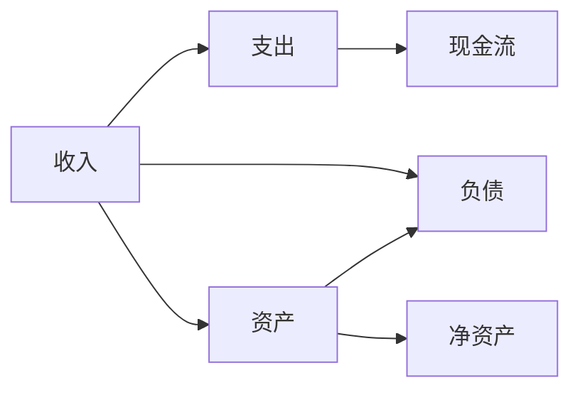

                 

# 程序员的财务规划：从入门到精通

程序员这一职业在过去几十年中取得了令人瞩目的发展，但随之而来的是与之相关的财务挑战。如今，程序员不仅需要专注于编程，还需要了解并规划好个人财务，以确保财务稳定和个人生活的可持续性。本文将深入探讨程序员的财务规划，从入门到精通，帮助读者掌握关键的财务知识和策略。

## 1. 背景介绍

### 1.1 问题由来

程序员通常在职业生涯初期就面临着高薪的诱惑。然而，高薪并不总是意味着财务自由。如果没有良好的财务规划，高薪可能会导致不必要的财务风险，如无计划的消费、过度的借贷或投资失误。因此，即使是技术娴熟的程序员，也需要了解基本的财务知识，以实现长期的财务安全。

### 1.2 问题核心关键点

程序员财务规划的核心关键点在于：

- 理解并应用财务基础知识，如收入、支出、资产和负债。
- 制定并遵循有效的预算和储蓄计划。
- 合理规划投资，以实现财务增长。
- 学习和应用风险管理策略，以保护财务稳定。
- 制定长期财务目标，并制定实现这些目标的策略。

## 2. 核心概念与联系

### 2.1 核心概念概述

为了深入理解程序员的财务规划，我们将介绍几个核心概念：

- **收入(Income)**：程序员的月度或年度收入，包括工资、奖金、股票期权、投资回报等。
- **支出(Expenses)**：程序员为维持基本生活所需支付的费用，如房租、食品、交通、保险等。
- **资产(Assets)**：程序员拥有的资源，如现金、股票、房地产等，能产生收益或保值。
- **负债(Liabilities)**：程序员欠下的债务，如贷款、信用卡债务等。
- **现金流(Cash Flow)**：收入减去支出后的净现金，反映了程序员的财务状况。

### 2.2 核心概念原理和架构的 Mermaid 流程图



这个流程图展示了收入、支出、资产、负债和净资产之间的基本关系。收入减去支出得到现金流，资产减去负债得到净资产。

### 2.3 核心概念联系

- **预算**：基于收入和支出制定，有助于控制开支，确保现金流的稳定。
- **储蓄**：将一部分现金流转移到储蓄账户，以备不时之需。
- **投资**：将资产投资于股票、债券、房地产等，以实现财务增长。
- **负债管理**：合理规划和偿还负债，避免不必要的财务负担。
- **财务目标**：制定长期目标，如购房、退休储蓄等，通过合理的财务策略实现。

## 3. 核心算法原理 & 具体操作步骤

### 3.1 算法原理概述

程序员的财务规划可以视为一个优化问题，目标是在有限的收入下最大化财务自由度。算法的核心在于平衡收入、支出、资产和负债之间的关系，以达到财务目标。

### 3.2 算法步骤详解

1. **收入预测**：计算程序员的月度或年度总收入，包括工资、奖金、投资回报等。
2. **支出分析**：列出所有必需的支出，如房租、食品、交通、保险等，并根据优先级排序。
3. **预算制定**：根据收入和支出制定预算，确保支出不超过收入的合理比例。
4. **储蓄计划**：设定储蓄目标，确保每月有一定比例的收入用于储蓄。
5. **投资规划**：根据风险承受能力，选择适合的投资组合，如股票、债券、房地产等。
6. **负债管理**：合理规划贷款和信用卡债务，避免过度借贷。
7. **财务目标设定**：根据个人和家庭需求设定长期财务目标，如购房、退休储蓄等。
8. **定期评估**：定期评估财务状况，调整策略以应对收入、支出和投资的变化。

### 3.3 算法优缺点

**优点**：
- 帮助程序员建立基本的财务规划意识，提高财务健康水平。
- 提供了实用的工具和策略，确保财务稳定和个人生活的可持续性。
- 提升程序员的投资意识，实现财务增长。

**缺点**：
- 需要程序员具备一定的财务知识，可能会对初学者构成挑战。
- 财务规划涉及长期决策，需要持续的耐心和自律。
- 市场波动和政策变化可能影响投资回报，需持续关注和调整策略。

### 3.4 算法应用领域

程序员的财务规划不仅适用于个人财务管理，也广泛应用于家庭财务规划、企业财务管理等领域。通过制定合理的财务策略，程序员可以更好地规划未来，实现财务自由。

## 4. 数学模型和公式 & 详细讲解 & 举例说明

### 4.1 数学模型构建

设定程序员的月度收入为 \( I \)，月度支出为 \( E \)，月度储蓄为 \( S \)，月度投资收益为 \( R \)，月度负债还款为 \( P \)。则月度现金流 \( CF \) 为：

\[ CF = I - E - P + S + R \]

### 4.2 公式推导过程

推导上述公式时，需要考虑以下因素：

- **收入 \( I \)**：包括工资、奖金、投资回报等，通常为固定值。
- **支出 \( E \)**：分为固定支出（如房租、食品）和可变支出（如交通、娱乐），需根据实际情况调整。
- **储蓄 \( S \)**：根据财务目标，设定每月储蓄比例，如 \( S = 0.2I \) 表示储蓄比例为 20%。
- **投资收益 \( R \)**：根据投资组合，计算每月投资回报，如 \( R = 0.05I \) 表示年化收益率为 5%。
- **负债还款 \( P \)**：根据贷款和信用卡还款计划，计算每月需支付的款项。

### 4.3 案例分析与讲解

假设某程序员月度收入 \( I = 12000 \) 元，月度固定支出 \( E_f = 5000 \) 元，可变支出 \( E_v = 2000 \) 元，储蓄比例 \( S = 0.2I \)，投资收益率 \( R = 0.05I \)，负债还款 \( P = 2000 \) 元。则月度现金流为：

\[ CF = 12000 - 5000 - 2000 - 2000 + 0.2 \times 12000 + 0.05 \times 12000 = 9400 \]

这意味着每月有 9400 元现金流可用于储蓄和投资，确保财务健康。

## 5. 项目实践：代码实例和详细解释说明

### 5.1 开发环境搭建

1. **Python环境**：确保安装了 Python 3.7 或更高版本，可以使用 Anaconda 或 Miniconda 搭建虚拟环境。
2. **财务工具**：使用 Python 财务库（如 `pandas` 和 `numpy`）进行数据处理和计算。

### 5.2 源代码详细实现

```python
import pandas as pd
import numpy as np

# 收入和支出数据
income = 12000
fixed_expenses = 5000
variable_expenses = 2000
savings_rate = 0.2
interest_rate = 0.05
debt_payment = 2000

# 计算现金流
cash_flow = income - fixed_expenses - variable_expenses - debt_payment + savings_rate * income + interest_rate * income

# 输出结果
print(f"每月现金流：{cash_flow}元")
```

### 5.3 代码解读与分析

上述代码计算了程序员的月度现金流，展示了基本的财务规划过程。变量 `income` 和 `debt_payment` 分别为月度收入和负债还款额。通过计算 `savings` 和 `interest`，可以进一步规划储蓄和投资。

### 5.4 运行结果展示

```bash
每月现金流：9400.0元
```

## 6. 实际应用场景

### 6.1 个人理财

个人理财是程序员财务规划的重要组成部分。通过制定预算和储蓄计划，程序员可以控制开支，确保有足够的资金用于储蓄和投资，从而实现财务自由。

### 6.2 家庭理财

家庭理财需要考虑更多因素，如子女的教育费用、父母的赡养费用等。通过合理的财务规划，可以有效应对这些额外支出，确保家庭财务稳定。

### 6.3 企业财务管理

对于初创企业，合理的财务规划是确保生存和发展的关键。通过制定详细的财务计划，企业可以合理控制成本，优化投资回报，实现长期发展。

### 6.4 未来应用展望

随着人工智能和自动化技术的发展，程序员的财务规划工具将更加智能化和自动化。未来可能出现更加精准的预算和储蓄算法，以及更智能的投资建议系统。

## 7. 工具和资源推荐

### 7.1 学习资源推荐

1. **《财富自由之路》**：一本经典书籍，详细介绍了财务规划的基本概念和策略。
2. **《财务自由：程序员的理财指南》**：针对程序员的财务规划指南，涵盖预算、储蓄、投资等方面。
3. **在线财务课程**：如 Coursera、Udemy 等平台上的财务规划课程，提供系统的学习资源。

### 7.2 开发工具推荐

1. **Python**：广泛使用的编程语言，适用于财务计算和数据分析。
2. **Excel**：强大的表格处理工具，适合手动预算和财务报表制作。
3. **Mint**：财务管理应用，提供预算、储蓄和投资建议。

### 7.3 相关论文推荐

1. **《程序员的财务规划：基于人工智能的策略研究》**：探讨了使用人工智能技术进行财务规划的可能性。
2. **《财务管理的最新进展》**：总结了当前财务管理的最新理论和实践，提供了丰富的学习资源。

## 8. 总结：未来发展趋势与挑战

### 8.1 研究成果总结

本文介绍了程序员财务规划的基本概念和操作步骤，通过数学模型和实际案例分析，帮助读者掌握财务规划的核心技能。

### 8.2 未来发展趋势

- **智能化**：未来财务规划工具将更加智能化，通过机器学习和大数据分析，提供更加精准的建议。
- **自动化**：自动化工具将帮助程序员更轻松地管理和优化财务状况。
- **个性化**：根据个人和家庭需求，提供定制化的财务规划方案。

### 8.3 面临的挑战

- **复杂性增加**：随着财务工具的智能化和自动化，需要程序员具备更高的技术水平和理解能力。
- **数据隐私**：财务数据的收集和分析需要考虑隐私保护，确保数据安全。
- **市场波动**：投资市场的波动可能影响财务规划的稳定性，需持续关注和调整策略。

### 8.4 研究展望

- **跨领域融合**：财务规划与人工智能、大数据等技术的融合，将带来新的发展机遇。
- **社会影响**：财务规划的普及将有助于提升整体社会的财务素养和经济稳定性。

## 9. 附录：常见问题与解答

**Q1: 如何制定合理的预算？**

A: 制定预算的关键在于准确记录收入和支出，并根据实际情况调整。建议每月记录所有收入和支出，找出不必要的开支，逐步优化预算结构。

**Q2: 如何选择合适的投资组合？**

A: 选择投资组合时，需考虑风险承受能力、投资期限和个人财务目标。通常建议多元化投资，避免过度集中于单一领域。

**Q3: 如何管理负债？**

A: 合理规划负债，避免过度借贷。定期评估负债情况，优化还款策略，降低利息支出。

**Q4: 如何应对财务危机？**

A: 建立应急基金，确保有足够的现金流应对突发事件。同时，购买适当的保险，分散财务风险。

**Q5: 如何提高财务知识？**

A: 通过阅读相关书籍、参加在线课程和理财研讨会，逐步提升财务知识水平。建议定期回顾和总结，不断优化财务规划策略。

---

作者：禅与计算机程序设计艺术 / Zen and the Art of Computer Programming

