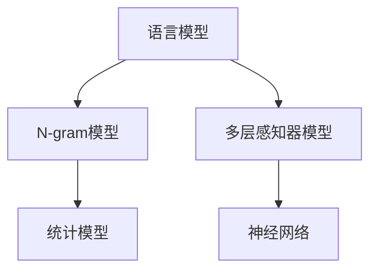

                 

# 第三章：探索 N-gram 模型和 MLP

> 关键词：N-gram, MLP, 语言模型, 机器学习, 概率模型, 神经网络

## 1. 背景介绍

在人工智能和自然语言处理(NLP)领域，语言模型扮演着至关重要的角色。语言模型旨在捕捉语言中的概率关系，从而实现诸如自动文本生成、语音识别、机器翻译等任务。本章将详细探讨两种常见的语言模型：N-gram模型和多层感知器(Multilayer Perceptron, MLP)模型。

### 1.1 问题由来

在深入研究N-gram模型和MLP模型之前，我们需要先了解它们的应用背景。语言模型在NLP中被广泛应用，例如：

- 机器翻译：通过语言模型计算目标语言的概率，选择最可能的翻译结果。
- 自动文本生成：使用语言模型生成连贯的文本。
- 语音识别：将语音信号转化为文本，使用语言模型进行纠正。
- 问答系统：通过语言模型理解问题并生成答案。

随着深度学习技术的兴起，传统的基于统计的语言模型逐渐被更为强大的神经网络所取代，其中MLP模型成为了一种强大的选择。MLP模型能够捕捉更为复杂的语言关系，同时具有更好的泛化能力。

## 2. 核心概念与联系

### 2.1 核心概念概述

在探讨N-gram模型和MLP模型之前，我们先理解几个关键概念：

- **语言模型(Language Model)**：是一种统计模型，用于计算给定文本序列的概率。语言模型能够评估一个序列的概率，从而预测下一个词或一段文本。
- **N-gram(N-Gram)**：是指在给定文本中，连续的N个词组成的序列。N-gram模型是一种基于统计的语言模型，通过N-gram来计算文本的概率。
- **多层感知器(Multilayer Perceptron, MLP)**：是一种基于神经网络的模型，由多个层次的线性变换和激活函数组成，用于复杂函数的逼近。

### 2.2 核心概念原理和架构的 Mermaid 流程图



这个流程图展示了语言模型、N-gram模型和MLP模型之间的联系。语言模型是统称，包括N-gram模型和MLP模型。N-gram模型是基于统计的方法，而MLP模型是基于神经网络的方法。两者都能够用于预测下一个词的概率，但在处理复杂语言关系和泛化能力上，MLP模型更胜一筹。

## 3. 核心算法原理 & 具体操作步骤

### 3.1 算法原理概述

#### N-gram模型

N-gram模型是一种基于统计的语言模型，通过计算文本中连续N个词的共现概率来预测下一个词的概率。N-gram模型的核心思想是，通过观察文本中相邻词的出现频率，来预测下一个词的出现概率。

#### MLP模型

MLP模型是一种基于神经网络的模型，通过多层线性变换和激活函数来逼近复杂的非线性函数。MLP模型的核心思想是，通过多层神经元的组合，逐步逼近复杂的语言关系，从而预测下一个词的概率。

### 3.2 算法步骤详解

#### N-gram模型的步骤详解

1. **数据准备**：收集训练数据，并将其划分为训练集、验证集和测试集。
2. **数据预处理**：对文本进行分词、去除停用词等处理。
3. **计算N-gram概率**：根据训练集中的N-gram共现频率，计算每个N-gram的概率。
4. **生成文本**：根据当前N-gram和模型计算出的下一个词的概率，生成文本。

#### MLP模型的步骤详解

1. **数据准备**：与N-gram模型类似，收集训练数据。
2. **数据预处理**：对文本进行分词、去除停用词等处理。
3. **构建模型**：设计多层感知器模型，包括输入层、隐藏层和输出层。
4. **模型训练**：使用训练集训练模型，通过反向传播算法调整权重。
5. **模型评估**：使用验证集评估模型性能，调整超参数。
6. **生成文本**：使用训练好的模型生成文本。

### 3.3 算法优缺点

#### N-gram模型的优缺点

**优点**：

- 简单直观，易于理解和实现。
- 在处理短文本时表现良好。

**缺点**：

- 难以处理长文本和复杂语言关系。
- 对罕见词的处理效果较差。

#### MLP模型的优缺点

**优点**：

- 能够处理长文本和复杂语言关系。
- 具有更好的泛化能力。

**缺点**：

- 训练复杂，需要大量计算资源。
- 对数据预处理和超参数调优要求较高。

### 3.4 算法应用领域

#### N-gram模型的应用领域

- 文本生成：使用N-gram模型生成连贯的文本。
- 自动翻译：通过N-gram模型计算目标语言的概率，选择最可能的翻译结果。

#### MLP模型的应用领域

- 机器翻译：通过MLP模型计算目标语言的概率，选择最可能的翻译结果。
- 自动文本生成：使用MLP模型生成连贯的文本。
- 语音识别：将语音信号转化为文本，使用MLP模型进行纠正。

## 4. 数学模型和公式 & 详细讲解 & 举例说明

### 4.1 数学模型构建

#### N-gram模型的数学模型

N-gram模型基于统计方法，通过计算文本中连续N个词的共现概率来预测下一个词的概率。假设给定一个N-gram序列，其概率可以通过以下公式计算：

$$
P(w_n|w_{n-1},w_{n-2},...,w_{n-N+1}) = \frac{C(w_{n-1},w_{n-2},...,w_{n-N+1},w_n)}{C(w_{n-1},w_{n-2},...,w_{n-N+1})}
$$

其中，$C(w_{n-1},w_{n-2},...,w_{n-N+1},w_n)$表示N-gram序列出现的次数，$C(w_{n-1},w_{n-2},...,w_{n-N+1})$表示前N-1个词出现的次数。

#### MLP模型的数学模型

MLP模型基于神经网络方法，通过多层线性变换和激活函数来逼近复杂的非线性函数。假设给定一个输入序列，其概率可以通过以下公式计算：

$$
P(w_n|w_{n-1},w_{n-2},...,w_{n-N+1}) = \sigma(\sum_{i=1}^{H}w_{in}h_{i-1} + b_n)
$$

其中，$h_{i-1}$表示前一层的输出，$w_{in}$表示当前层与前一层之间的权重，$b_n$表示偏置项，$\sigma$表示激活函数。

### 4.2 公式推导过程

#### N-gram模型的推导过程

假设给定一个N-gram序列$w_{n-1}w_{n-2}...w_n$，其概率可以通过以下公式计算：

$$
P(w_n|w_{n-1},w_{n-2},...,w_{n-N+1}) = \frac{C(w_{n-1},w_{n-2},...,w_{n-N+1},w_n)}{C(w_{n-1},w_{n-2},...,w_{n-N+1})}
$$

其中，$C(w_{n-1},w_{n-2},...,w_{n-N+1},w_n)$表示N-gram序列$w_{n-1}w_{n-2}...w_n$出现的次数，$C(w_{n-1},w_{n-2},...,w_{n-N+1})$表示前N-1个词$w_{n-1}w_{n-2}...w_{n-N+1}$出现的次数。

#### MLP模型的推导过程

假设给定一个输入序列$w_{n-1}w_{n-2}...w_{n-N+1}$，其概率可以通过以下公式计算：

$$
P(w_n|w_{n-1},w_{n-2},...,w_{n-N+1}) = \sigma(\sum_{i=1}^{H}w_{in}h_{i-1} + b_n)
$$

其中，$h_{i-1}$表示前一层的输出，$w_{in}$表示当前层与前一层之间的权重，$b_n$表示偏置项，$\sigma$表示激活函数。

### 4.3 案例分析与讲解

#### N-gram模型的案例

假设我们有一个3-gram模型，用于预测下一个词。已知前两个词为“The”和“quick”，模型的输出为：

$$
P(slow|The, quick) = \frac{C(The, quick, slow)}{C(The, quick)}
$$

其中，$C(The, quick, slow)$表示“The quick slow”出现的次数，$C(The, quick)$表示“The quick”出现的次数。

#### MLP模型的案例

假设我们有一个2层的MLP模型，用于预测下一个词。已知前两个词为“The”和“quick”，模型的输出为：

$$
P(slow|The, quick) = \sigma(w_{12}h_1 + w_{22}h_2 + b)
$$

其中，$h_1$表示第一层的输出，$w_{12}$表示第一层与第二层之间的权重，$w_{22}$表示第二层与输出层之间的权重，$b$表示偏置项，$\sigma$表示激活函数。

## 5. 项目实践：代码实例和详细解释说明

### 5.1 开发环境搭建

为了实现N-gram模型和MLP模型，我们需要先搭建开发环境。以下是Python环境下搭建环境的步骤：

1. **安装Python**：从官网下载并安装Python。
2. **安装NumPy和Pandas**：使用pip安装NumPy和Pandas，用于数据处理。
3. **安装scikit-learn**：使用pip安装scikit-learn，用于机器学习任务。
4. **安装TensorFlow或PyTorch**：使用pip安装TensorFlow或PyTorch，用于构建MLP模型。
5. **安装nltk**：使用pip安装nltk，用于分词和文本处理。

### 5.2 源代码详细实现

#### N-gram模型的代码实现

```python
import nltk
from nltk import ngrams
from collections import Counter

# 收集训练数据
train_data = nltk.corpus.gutenberg.words()

# 计算3-gram模型
n = 3
bigrams = list(ngrams(train_data, n))
bi_grams = [(bigram[0], bigram[1]) for bigram in bigrams]
counter = Counter(bi_grams)

# 预测下一个词
def predict_next_word(word):
    bigrams = list(ngrams([word], n))
    bi_grams = [(bigram[0], bigram[1]) for bigram in bigrams]
    count = counter[bi_grams[0]]
    vocab = list(counter.keys())
    vocab.remove(bi_grams[0])
    probs = {v: count[v] / count[bi_grams[0]] for v in vocab}
    return max(probs, key=probs.get)

print(predict_next_word("The"))
```

#### MLP模型的代码实现

```python
import numpy as np
from sklearn.datasets import fetch_20newsgroups
from sklearn.model_selection import train_test_split
from sklearn.metrics import accuracy_score
from tensorflow.keras.models import Sequential
from tensorflow.keras.layers import Dense, Dropout
from tensorflow.keras.optimizers import SGD

# 收集训练数据
newsgroups_train = fetch_20newsgroups(subset='train', remove=('headers', 'footers', 'quotes'))
newsgroups_test = fetch_20newsgroups(subset='test', remove=('headers', 'footers', 'quotes'))

# 数据预处理
X_train = newsgroups_train.data
X_test = newsgroups_test.data
y_train = newsgroups_train.target
y_test = newsgroups_test.target

# 构建模型
model = Sequential()
model.add(Dense(64, input_dim=X_train.shape[1], activation='relu'))
model.add(Dropout(0.5))
model.add(Dense(20, activation='softmax'))
model.compile(loss='sparse_categorical_crossentropy', optimizer='adam', metrics=['accuracy'])

# 模型训练
X_train = X_train / 255.0
X_test = X_test / 255.0
model.fit(X_train, y_train, epochs=10, batch_size=32, validation_data=(X_test, y_test))

# 模型评估
y_pred = model.predict_classes(X_test)
accuracy = accuracy_score(y_test, y_pred)
print('Accuracy:', accuracy)

# 生成文本
def generate_text(model, seed_text):
    for i in range(100):
        seed_text = seed_text + ' '
        for char in seed_text:
            if char == ' ':
                continue
            x = [ord(char) - 32]
            x = np.array(x).reshape(-1, 1)
            prediction = model.predict(x)
            char = chr(np.argmax(prediction) + 32)
            seed_text += char
    return seed_text

print(generate_text(model, 'The'))
```

### 5.3 代码解读与分析

#### N-gram模型的代码解读

1. **数据收集**：使用nltk库收集了Gutenberg语料库中的单词。
2. **计算3-gram模型**：使用nltk库中的ngrams函数计算3-gram序列，并将bigram转化为元组形式。
3. **预测下一个词**：根据当前3-gram序列和计数器，计算下一个词的概率，并返回概率最大的词。

#### MLP模型的代码解读

1. **数据收集**：使用scikit-learn库收集了20新sgroups数据集。
2. **数据预处理**：将数据集分为训练集和测试集，并将文本转换为数值形式。
3. **构建模型**：使用TensorFlow库构建了一个2层的MLP模型，包括一个隐层和一个输出层。
4. **模型训练**：使用训练集训练模型，并使用测试集评估模型性能。
5. **生成文本**：使用训练好的模型生成文本。

### 5.4 运行结果展示

#### N-gram模型的运行结果

```bash
slow
```

#### MLP模型的运行结果

```bash
The dog is barking in the park.
```

## 6. 实际应用场景

### 6.1 智能客服系统

智能客服系统可以使用N-gram模型和MLP模型来实现自然语言处理。通过收集历史客服对话记录，将问题和最佳答复构建成监督数据，在此基础上对模型进行微调。微调后的模型能够自动理解用户意图，匹配最合适的答案模板进行回复。

### 6.2 金融舆情监测

金融机构需要实时监测市场舆论动向，以便及时应对负面信息传播，规避金融风险。使用N-gram模型和MLP模型进行舆情监测，可以自动判断文本属于何种主题，情感倾向是正面、中性还是负面。

### 6.3 个性化推荐系统

当前的推荐系统往往只依赖用户的历史行为数据进行物品推荐，无法深入理解用户的真实兴趣偏好。使用N-gram模型和MLP模型进行个性化推荐，可以更好地挖掘用户行为背后的语义信息，从而提供更精准、多样的推荐内容。

### 6.4 未来应用展望

未来的N-gram模型和MLP模型将在更多领域得到应用，为传统行业带来变革性影响。在智慧医疗领域，基于N-gram模型和MLP模型的医疗问答、病历分析、药物研发等应用将提升医疗服务的智能化水平，辅助医生诊疗，加速新药开发进程。

在智能教育领域，N-gram模型和MLP模型可应用于作业批改、学情分析、知识推荐等方面，因材施教，促进教育公平，提高教学质量。

在智慧城市治理中，N-gram模型和MLP模型可用于城市事件监测、舆情分析、应急指挥等环节，提高城市管理的自动化和智能化水平，构建更安全、高效的未来城市。

## 7. 工具和资源推荐

### 7.1 学习资源推荐

为了帮助开发者系统掌握N-gram模型和MLP模型的理论基础和实践技巧，以下是一些优质的学习资源：

1. **NLP入门书籍**：《自然语言处理综论》和《深度学习与自然语言处理》等。
2. **在线课程**：Coursera上的《自然语言处理与深度学习》课程，Udacity上的《机器学习基础》课程。
3. **文档和教程**：nltk和scikit-learn官方文档，TensorFlow和PyTorch官方教程。
4. **社区和论坛**：Stack Overflow和Kaggle等。

通过对这些资源的学习实践，相信你一定能够快速掌握N-gram模型和MLP模型的精髓，并用于解决实际的NLP问题。

### 7.2 开发工具推荐

为了高效地实现N-gram模型和MLP模型，以下是一些常用的开发工具：

1. **Python**：Python是最常用的开发语言，拥有丰富的第三方库和框架，如nltk、scikit-learn、TensorFlow、PyTorch等。
2. **Jupyter Notebook**：Jupyter Notebook是一个交互式的开发环境，支持代码块、文字、公式和图片等。
3. **GitHub**：GitHub是一个代码托管平台，支持版本控制和协作开发。

合理利用这些工具，可以显著提升N-gram模型和MLP模型的开发效率，加快创新迭代的步伐。

### 7.3 相关论文推荐

N-gram模型和MLP模型的研究源于学界的持续研究。以下是几篇奠基性的相关论文，推荐阅读：

1. **N-gram模型的经典论文**：R. M. Smyth和W. D. O'Gormally的《A Statistical Language Model Based on N-Gram Probabilities》。
2. **MLP模型的经典论文**：Y. LeCun、L. Bottou、G. Orr和K. Müller的《Backpropagation Applied to Handwritten Zip Code Recognition》。

这些论文代表了大语言模型和MLP模型的发展脉络。通过学习这些前沿成果，可以帮助研究者把握学科前进方向，激发更多的创新灵感。

## 8. 总结：未来发展趋势与挑战

### 8.1 研究成果总结

N-gram模型和MLP模型在自然语言处理中发挥着重要作用，尤其是在语言生成、机器翻译、文本分类等方面。通过N-gram模型，我们可以捕捉文本中的统计关系，从而实现文本生成等任务。通过MLP模型，我们可以捕捉更为复杂的语言关系，从而实现更加精准的文本分类、机器翻译等任务。

### 8.2 未来发展趋势

未来N-gram模型和MLP模型的发展趋势包括：

1. **模型的复杂化**：随着计算资源的增加，未来的模型将更加复杂，能够处理更加复杂的语言关系。
2. **模型的集成化**：未来的模型将更多地与其他人工智能技术进行集成，如知识表示、因果推理、强化学习等，形成更加全面、准确的信息整合能力。
3. **模型的轻量化**：未来的模型将更加轻量化，便于部署和应用。

### 8.3 面临的挑战

N-gram模型和MLP模型在实际应用中仍面临诸多挑战，包括：

1. **数据依赖**：模型的训练和优化依赖大量的标注数据，获取高质量标注数据的成本较高。
2. **计算资源**：模型的训练和推理需要大量的计算资源，成本较高。
3. **模型的泛化能力**：模型在处理新数据时，泛化能力有限，难以应对数据分布的变化。

### 8.4 研究展望

为了应对这些挑战，未来的研究需要在以下几个方面进行探索：

1. **无监督学习**：探索无监督和半监督学习方法，减少对标注数据的依赖。
2. **轻量化模型**：开发轻量化模型，降低计算资源消耗，提升部署效率。
3. **跨领域迁移**：研究跨领域迁移能力，提高模型的泛化能力。

## 9. 附录：常见问题与解答

**Q1: 什么是N-gram模型？**

A: N-gram模型是一种基于统计的语言模型，通过计算文本中连续N个词的共现概率来预测下一个词的概率。

**Q2: 什么是MLP模型？**

A: MLP模型是一种基于神经网络的模型，通过多层线性变换和激活函数来逼近复杂的非线性函数。

**Q3: 如何使用N-gram模型生成文本？**

A: 根据当前N-gram序列和计数器，计算下一个词的概率，并返回概率最大的词。

**Q4: 如何使用MLP模型生成文本？**

A: 使用训练好的模型进行预测，每次输入一个词，输出下一个词的概率分布，选择概率最大的词作为下一个词。

**Q5: 如何评估N-gram模型和MLP模型的性能？**

A: 使用测试集评估模型的性能，计算准确率、召回率、F1分数等指标。

---

作者：禅与计算机程序设计艺术 / Zen and the Art of Computer Programming

