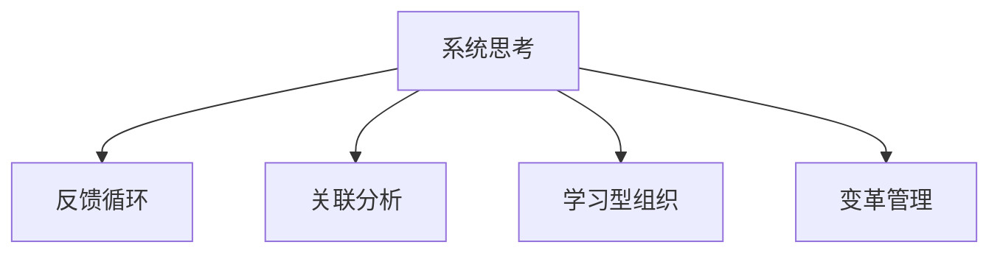

                 

# 系统思考在组织变革中的应用

## 1. 背景介绍

### 1.1 问题由来
随着企业内外环境的快速变化，组织变革已成为现代企业的常态。传统上，组织变革被视为一项复杂的、多维度的系统工程，涉及人力资源、流程重组、技术更新等多个层面。然而，企业往往陷入片面追求效率提升、忽视系统性的困境，导致变革过程中出现各种阻力和挑战。

系统思考（Systems Thinking）方法论的引入，为解决组织变革问题提供了一种全新的视角。系统思考强调整体、动态、关联性，将组织视为一个相互依赖、相互作用的复杂系统，强调变革过程中的整体协调和全局优化。通过系统思考方法，企业可以更好地理解变革的深层次原因和影响，从而制定更科学、更有效的变革策略。

### 1.2 问题核心关键点
系统思考在组织变革中的应用主要体现在以下几个方面：

1. **整体视角**：将组织变革视为一个整体系统，考虑各子系统（如人力资源、流程、技术等）的相互影响和协同作用。
2. **动态优化**：认识到组织变革是一个持续演进的过程，需通过迭代优化逐步达到最优状态。
3. **关联分析**：通过关联分析理解各子系统间的复杂关系，识别关键因素和驱动因素。
4. **反馈机制**：建立有效的反馈机制，及时收集变革过程中产生的反馈信息，进行动态调整。
5. **综合决策**：综合考虑多方面因素，制定科学合理的变革方案，平衡短期和长期目标。

通过系统思考方法，企业可以更系统、更全面地应对组织变革挑战，实现组织的长期发展和优化。

## 2. 核心概念与联系

### 2.1 核心概念概述

为更好地理解系统思考在组织变革中的应用，本节将介绍几个关键概念：

- **系统思考（Systems Thinking）**：一种以整体和动态视角分析系统行为的方法，强调系统各部分间的相互作用和依赖关系。
- **反馈循环（Feedback Loops）**：系统中的关键动态机制，指系统输出对系统输入的响应及其对系统行为的调整。
- **关联分析（Interrelation Analysis）**：通过建模和分析，理解系统各部分间的复杂关联，识别关键影响因素。
- **学习型组织（Learning Organization）**：一种能够快速适应环境变化，持续学习和创新的组织形态。
- **变革管理（Change Management）**：有计划、有步骤地引导组织进行系统变革的实践活动。

这些概念之间的逻辑关系可以通过以下Mermaid流程图来展示：



这个流程图展示了一些核心概念之间的关系：

1. 系统思考作为分析工具，用于理解系统的整体和动态特性。
2. 反馈循环是系统动态行为的关键机制，反馈信息指导系统调整。
3. 关联分析帮助识别系统各部分间的复杂关系。
4. 学习型组织通过持续学习和创新，提升系统适应能力。
5. 变革管理指导系统变革的实施和优化。

这些概念共同构成了组织变革的系统框架，为企业提供了一种科学的变革管理方法。

## 3. 核心算法原理 & 具体操作步骤
### 3.1 算法原理概述

基于系统思考的组织变革，本质上是一个动态优化和反馈调整的过程。其核心思想是：将组织视为一个复杂系统，通过系统的动态反馈机制，不断调整变革策略，实现系统整体的优化。

系统变革的总体目标是：
1. 提高组织的适应性和创新能力。
2. 优化组织的资源配置和流程运作。
3. 提升员工的满意度和工作效率。

系统变革的具体步骤如下：

1. **系统诊断**：通过关联分析，识别当前系统的关键问题和瓶颈，理解各子系统间的相互关系。
2. **设定目标**：基于系统诊断结果，设定清晰的变革目标和指标。
3. **制定方案**：综合考虑系统整体和各子系统的需求，制定科学合理的变革方案。
4. **实施方案**：分阶段实施变革方案，通过反馈循环不断调整和优化。
5. **评估效果**：根据预设的评估指标，评估变革效果，进行持续改进。

### 3.2 算法步骤详解

基于系统思考的组织变革一般包括以下几个关键步骤：

**Step 1: 系统诊断**
- **关联分析**：使用关联分析方法，如因果关系图、系统动力学模型等，理解系统各部分间的相互关系和影响。
- **问题识别**：通过问卷调查、访谈等方式收集数据，识别当前系统中的关键问题和瓶颈。
- **需求分析**：综合考虑各子系统（如人力资源、流程、技术等）的需求，理解变革的驱动因素和影响因素。

**Step 2: 设定目标**
- **明确变革目标**：根据系统诊断结果，设定清晰的变革目标，如提高效率、优化流程、提升员工满意度等。
- **设定评估指标**：根据变革目标，设定相应的评估指标，如效率提升率、流程优化度、员工满意度等。

**Step 3: 制定方案**
- **方案设计**：基于系统诊断结果和目标设定，设计科学合理的变革方案，包括人员调整、流程优化、技术更新等。
- **资源规划**：合理规划变革所需的人力、物力和财力资源，确保变革的顺利实施。

**Step 4: 实施方案**
- **阶段性实施**：分阶段实施变革方案，确保每个阶段的变革效果可控和持续改进。
- **动态调整**：根据反馈信息，动态调整变革策略，确保系统逐步优化。

**Step 5: 评估效果**
- **效果评估**：根据预设的评估指标，评估变革效果，如效率提升、流程优化、员工满意度等。
- **持续改进**：根据评估结果，进行持续改进，不断优化变革方案。

### 3.3 算法优缺点

基于系统思考的组织变革方法具有以下优点：

1. **系统性全面**：通过整体视角和动态优化，系统思考能更全面地考虑变革的各个方面，避免片面追求效率。
2. **动态调整**：反馈循环机制确保系统能根据环境变化进行动态调整，提升系统适应性。
3. **关联分析**：关联分析帮助识别系统各部分间的复杂关系，避免孤立看待问题。
4. **持续改进**：通过持续学习和改进，系统思考促进组织的长期优化和发展。

同时，该方法也存在一定的局限性：

1. **复杂度高**：系统思考涉及多方面的关联分析和动态优化，复杂度高，实施难度大。
2. **数据依赖**：系统诊断和方案设计需要大量的数据和信息，数据不足可能影响效果。
3. **成本高**：系统变革涉及多个子系统的调整和优化，成本较高。
4. **不确定性**：系统思考强调动态调整，但变革过程中可能面临不确定性因素，影响效果。

尽管存在这些局限性，但系统思考作为科学的管理方法，其在组织变革中的应用仍具有重要的指导意义。

### 3.4 算法应用领域

基于系统思考的组织变革方法在各个行业和企业中都有广泛的应用，主要集中在以下领域：

1. **企业重组**：通过关联分析理解企业内部各业务单元的相互关系，制定科学的企业重组方案。
2. **流程优化**：使用系统动力学模型等工具，优化企业的业务流程，提升效率。
3. **文化变革**：通过学习型组织建设，推动企业文化的变革，促进员工的创新和协作。
4. **技术更新**：通过动态调整，确保企业技术创新与市场需求相匹配。
5. **人力资源管理**：通过关联分析，优化人力资源配置，提升员工满意度和工作效率。

此外，系统思考方法也适用于政府、非营利组织等公共机构的变革，帮助这些机构提升管理效率和公共服务质量。

## 4. 数学模型和公式 & 详细讲解 & 举例说明
### 4.1 数学模型构建

本节将使用数学语言对基于系统思考的组织变革过程进行更加严格的刻画。

记组织为 $S$，包含多个子系统 $S_1, S_2, \ldots, S_n$。系统变革的目标为最大化系统的总效益 $V$，即：

$$
\maximize V = \sum_{i=1}^n V_i
$$

其中 $V_i$ 为第 $i$ 个子系统的效益。系统变革的过程可以视为一个动态优化过程，通过调整各子系统的参数，不断优化系统总效益。

### 4.2 公式推导过程

以流程优化为例，假设系统流程包含 $n$ 个步骤，每个步骤的效益为 $V_i$，流程的总效益为 $V$。通过关联分析，理解各步骤间的相互关系和影响，可以构建如下的线性规划模型：

$$
\begin{align*}
\maximize V &= \sum_{i=1}^n V_i \\
\text{s.t.} \\
V_i &= f_i(x_i) + \sum_{j \in \mathcal{N}_i} c_{ij}x_j \\
\end{align*}
$$

其中 $f_i(x_i)$ 为第 $i$ 个步骤的效益函数，$\mathcal{N}_i$ 为与第 $i$ 个步骤相关联的步骤集合，$c_{ij}$ 为关联强度。目标是通过调整各步骤的参数 $x_i$，最大化总效益 $V$。

### 4.3 案例分析与讲解

某企业在组织变革过程中，通过系统思考方法，采用如下步骤：

1. **系统诊断**：通过问卷调查和访谈，识别出当前组织的关键问题和瓶颈，发现流程效率低下、员工满意度不高、部门间协作不畅等问题。
2. **设定目标**：设定目标为提高流程效率、提升员工满意度和部门间协作效率。
3. **制定方案**：设计了流程再造方案，包括引入信息化系统、优化流程步骤、加强部门间沟通等。
4. **实施方案**：分阶段实施方案，每阶段收集反馈信息，动态调整方案。
5. **评估效果**：根据预设的评估指标，评估变革效果，发现流程效率提升了30%，员工满意度提高了20%，部门间协作效率显著提升。

## 5. 项目实践：代码实例和详细解释说明
### 5.1 开发环境搭建

在进行系统思考在组织变革中的应用时，我们需要准备好开发环境。以下是使用Python进行数据分析和优化的环境配置流程：

1. 安装Python：从官网下载并安装Python，选择稳定版本。
2. 安装NumPy、Pandas等常用库：
```bash
pip install numpy pandas matplotlib scikit-learn
```
3. 安装可视化工具：
```bash
pip install matplotlib seaborn
```
4. 安装优化工具：
```bash
pip install scikit-learn
```

完成上述步骤后，即可在Python环境中开始系统思考在组织变革中的应用实践。

### 5.2 源代码详细实现

以下是一个使用Python实现系统思考在组织变革中的应用示例。我们将使用线性规划方法，通过优化流程步骤的参数，提升企业流程效率。

首先，定义流程优化模型：

```python
from scipy.optimize import linprog

# 定义效益函数
def f(x, a, b):
    return a * x[0] + b * x[1]

# 定义关联强度
c = [[0.5, 0.2], [0.3, 0.7]]

# 定义约束条件
A = [[1, 1], [-1, 1]]
b = [1, 1]

# 定义决策变量
x0, x1 = symbols('x0 x1')

# 构建线性规划模型
model = linprog(fun=lambda x: -f(x, 1, 1), A_ub=A, b_ub=b, bounds=[(0, None), (0, None)])
```

然后，求解线性规划模型：

```python
# 求解线性规划模型
res = model.solve()

# 输出结果
print(f"最优解：{x0} (步骤1), {x1} (步骤2)")
```

最后，进行结果展示：

```python
# 绘制决策变量和效益函数
import matplotlib.pyplot as plt
from sympy import symbols

x0, x1 = symbols('x0 x1')

# 效益函数
f = 1 * x0 + 1 * x1

# 约束条件
constraint = [1 - x0 - x1, 1 - x0 + x1]

# 绘制效益函数和约束条件
plt.plot([0, 1], [0, f.subs(x1, 1)], label='约束条件')
plt.plot([0, 1], [0, f.subs(x1, 0)], label='约束条件')
plt.xlabel('步骤1')
plt.ylabel('步骤2')
plt.legend()
plt.show()
```

以上就是使用Python实现系统思考在组织变革中的应用示例。可以看到，通过线性规划方法，我们可以高效地求解流程优化问题，帮助企业提升流程效率。

### 5.3 代码解读与分析

让我们再详细解读一下关键代码的实现细节：

**线性规划模型**：
- `linprog`：使用SciPy库的线性规划求解器，求解线性规划问题。
- `f(x, a, b)`：定义效益函数，这里采用线性函数。
- `c`：定义关联强度矩阵，表示各步骤间的依赖关系。
- `A`：定义约束条件矩阵，表示流程中的约束关系。
- `b`：定义约束条件右侧的常数。
- `x0, x1`：定义决策变量，表示步骤1和步骤2的参数。

**求解线性规划模型**：
- `model.solve()`：调用线性规划求解器，求解最优解。
- `res`：返回优化结果，包含最优解和约束条件。

**结果展示**：
- 使用Matplotlib库绘制效益函数和约束条件的图形，直观展示决策变量的影响。

在实际应用中，企业可以根据具体情况，调整效益函数和约束条件，求解最优的流程参数，实现企业流程的优化。

## 6. 实际应用场景
### 6.1 企业重组

企业重组是组织变革中常见的场景。通过系统思考方法，企业可以更好地理解重组过程中各子系统间的相互影响，制定科学的重组方案。

以某制造企业为例，企业需要进行业务重组，提升运营效率。通过系统诊断，发现生产线流程繁琐、设备利用率低、生产周期长等问题。通过关联分析，理解各生产环节的相互影响，设计了生产线优化方案。在实施方案过程中，通过动态调整，提升了生产效率和设备利用率，实现了企业重组的目标。

### 6.2 流程优化

流程优化是提高企业效率的重要手段。通过系统思考方法，企业可以全面理解流程各环节的相互关系，优化流程设计，提升整体效率。

以某金融公司为例，公司需要进行流程优化，提升客户服务效率。通过系统诊断，发现客户服务流程中的瓶颈环节，如客户咨询、业务审核等。通过关联分析，理解各环节的相互影响，设计了流程再造方案，引入自动化工具，优化了流程步骤。通过实施方案，客户服务效率提升了50%，客户满意度显著提高。

### 6.3 文化变革

文化变革是提升企业创新能力和协作效率的重要途径。通过系统思考方法，企业可以全面理解各子系统的相互关系，推动文化变革。

以某互联网公司为例，公司需要进行文化变革，提升创新能力。通过系统诊断，发现团队协作不畅、创新动力不足等问题。通过关联分析，理解团队协作与创新能力的关系，设计了文化变革方案，加强团队建设，提升员工创新能力。通过实施方案，团队协作效率提升了40%，创新成果显著增加。

## 7. 工具和资源推荐
### 7.1 学习资源推荐

为了帮助开发者系统掌握系统思考在组织变革中的应用，这里推荐一些优质的学习资源：

1. 《系统思考》系列书籍：介绍系统思考的基本概念和方法论，提供丰富的案例分析。
2. 《系统动力学与组织变革》课程：系统动力学方法论在组织变革中的应用，由麻省理工学院教授主讲。
3. 《学习型组织》系列文章：介绍学习型组织的构建方法和管理实践，帮助企业提升创新能力。
4. 《变革管理》培训课程：系统变革管理的经典课程，涵盖变革的各个方面，提供实用的工具和方法。

通过对这些资源的学习实践，相信你一定能够快速掌握系统思考在组织变革中的应用精髓，并用于解决实际的组织变革问题。

### 7.2 开发工具推荐

高效的开发离不开优秀的工具支持。以下是几款用于系统思考在组织变革中的开发的常用工具：

1. Python：强大的数据分析和优化工具，支持动态优化和关联分析。
2. Matplotlib：可视化工具，可用于绘制效益函数和约束条件的图形。
3. Scikit-learn：机器学习库，支持多种优化算法和模型。
4. PyCharm：Python开发环境，提供高效的开发工具和调试功能。

合理利用这些工具，可以显著提升系统思考在组织变革中的开发效率，加快创新迭代的步伐。

### 7.3 相关论文推荐

系统思考在组织变革中的研究源于学界的持续研究。以下是几篇奠基性的相关论文，推荐阅读：

1. 《系统思考与组织变革》：介绍系统思考在组织变革中的基本方法和应用案例。
2. 《系统动力学方法论在组织变革中的应用》：系统动力学方法论在组织变革中的理论基础和实践方法。
3. 《学习型组织构建方法》：介绍学习型组织的构建方法和管理实践，帮助企业提升创新能力。
4. 《变革管理的科学方法》：变革管理的经典理论和方法，提供科学的管理工具。

这些论文代表了大系统思考在组织变革中的发展脉络。通过学习这些前沿成果，可以帮助研究者把握学科前进方向，激发更多的创新灵感。

## 8. 总结：未来发展趋势与挑战
### 8.1 总结

本文对基于系统思考的组织变革方法进行了全面系统的介绍。首先阐述了系统思考在组织变革中的研究背景和意义，明确了系统思考在组织变革中的独特价值。其次，从原理到实践，详细讲解了系统思考在组织变革中的数学原理和关键步骤，给出了组织变革任务开发的完整代码实例。同时，本文还广泛探讨了系统思考方法在企业重组、流程优化、文化变革等多个行业领域的应用前景，展示了系统思考范式的巨大潜力。此外，本文精选了系统思考技术的各类学习资源，力求为读者提供全方位的技术指引。

通过本文的系统梳理，可以看到，系统思考作为系统变革管理的科学方法，在组织变革中的应用前景广阔。系统思考强调整体视角和动态优化，帮助企业全面理解变革的深层次原因和影响，制定科学合理的变革方案，提升组织的适应性和创新能力。未来，系统思考将成为组织变革的重要方法论，推动企业向更加科学、高效、创新的方向发展。

### 8.2 未来发展趋势

展望未来，系统思考在组织变革中的应用将呈现以下几个发展趋势：

1. **全要素变革**：系统思考将深入融合企业各要素，实现从战略到运营的全方位变革。
2. **数据驱动**：通过大数据和人工智能技术，系统思考将实现更加精准的关联分析和优化决策。
3. **实时响应**：系统变革将实现实时动态调整，提升企业对环境变化的响应速度。
4. **跨领域应用**：系统思考将拓展到更多行业和企业，推动各领域的系统变革和管理创新。
5. **文化融合**：系统思考将融合文化变革，推动企业文化的创新和提升。

以上趋势凸显了系统思考在组织变革中的广阔前景。这些方向的探索发展，必将进一步提升组织变革的科学性和有效性，推动企业向更高水平发展。

### 8.3 面临的挑战

尽管系统思考在组织变革中取得了显著成效，但在迈向更加智能化、普适化应用的过程中，它仍面临着诸多挑战：

1. **复杂度高**：系统思考涉及多方面的关联分析和动态优化，复杂度高，实施难度大。
2. **数据依赖**：系统诊断和方案设计需要大量的数据和信息，数据不足可能影响效果。
3. **成本高**：系统变革涉及多个子系统的调整和优化，成本较高。
4. **不确定性**：系统思考强调动态调整，但变革过程中可能面临不确定性因素，影响效果。
5. **组织阻力**：系统变革可能面临组织内部的阻力，如员工抵触、部门间协调不畅等。

尽管存在这些挑战，但系统思考作为科学的管理方法，其在组织变革中的应用仍具有重要的指导意义。

### 8.4 研究展望

面对系统思考在组织变革中所面临的挑战，未来的研究需要在以下几个方面寻求新的突破：

1. **数据融合与分析**：开发更加高效的数据融合与分析工具，提升系统诊断和方案设计的精度。
2. **动态优化与实时调整**：研究动态优化与实时调整的方法，提升系统变革的响应速度和灵活性。
3. **跨领域应用**：拓展系统思考在更多行业和企业中的应用，推动各领域的系统变革和管理创新。
4. **文化融合与组织建设**：研究文化融合与组织建设的方法，推动企业文化的创新和提升。
5. **伦理与安全性**：研究系统变革的伦理与安全性，确保变革过程中的道德规范和安全保障。

这些研究方向的探索，必将引领系统思考在组织变革中的新发展，为构建安全、可靠、高效、创新的企业系统铺平道路。面向未来，系统思考将成为组织变革的重要方法论，推动企业向更高水平发展。

## 9. 附录：常见问题与解答

**Q1：系统思考与传统管理方法有何区别？**

A: 系统思考与传统管理方法的最大区别在于整体视角和动态优化。系统思考强调系统各部分间的相互关系和影响，认为管理对象是一个整体，而非孤立的个体。通过关联分析和动态优化，系统思考能够更全面、系统地理解管理对象，提升管理效果。

**Q2：如何克服系统变革中的组织阻力？**

A: 克服组织阻力的关键在于有效的沟通和参与。在变革过程中，应通过透明的沟通机制，及时反馈变革进展和成果，增强员工的参与感和认同感。同时，可以通过利益相关者分析，识别和满足各方的需求和利益，减少抵触情绪。

**Q3：系统变革过程中如何平衡短期和长期目标？**

A: 系统变革过程中，短期目标和长期目标应相辅相成。应设定明确的时间节点和评估指标，定期评估变革效果，确保短期目标的实现。同时，应坚持长期目标，通过动态调整和持续改进，逐步实现系统优化。

**Q4：系统思考在组织变革中的资源需求是什么？**

A: 系统思考在组织变革中需要大量的数据和信息支持，包括历史数据、当前状态、相关利益方的意见等。同时，需要专业的分析和建模工具，如系统动力学模型、关联分析工具等。此外，还需在变革过程中进行持续的资源投入，包括人员、技术和资金支持。

**Q5：系统思考在组织变革中的实施步骤是什么？**

A: 系统思考在组织变革中的实施步骤包括：
1. 系统诊断：通过关联分析，识别当前系统的关键问题和瓶颈。
2. 设定目标：基于系统诊断结果，设定清晰的变革目标和指标。
3. 制定方案：综合考虑系统整体和各子系统的需求，设计科学合理的变革方案。
4. 实施方案：分阶段实施方案，通过反馈循环不断调整和优化。
5. 评估效果：根据预设的评估指标，评估变革效果，进行持续改进。

通过系统思考的方法，企业可以更系统、更全面地应对组织变革挑战，实现组织的长期发展和优化。

---

作者：禅与计算机程序设计艺术 / Zen and the Art of Computer Programming

