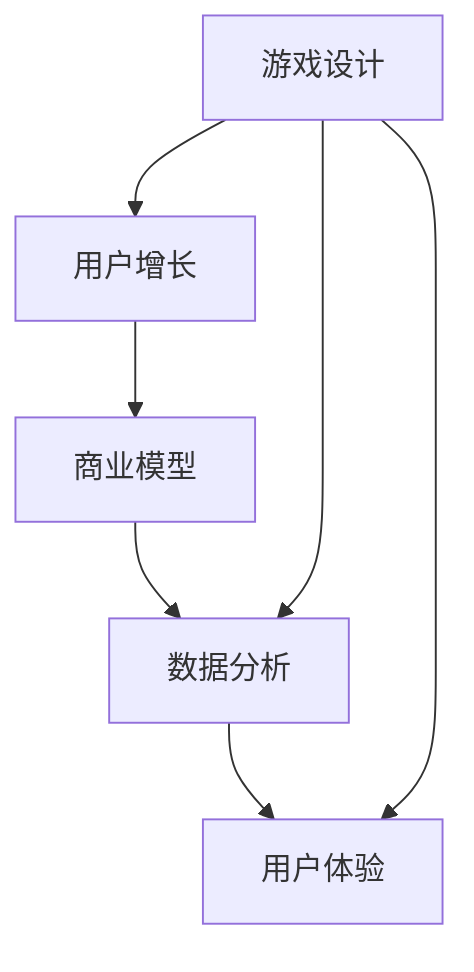
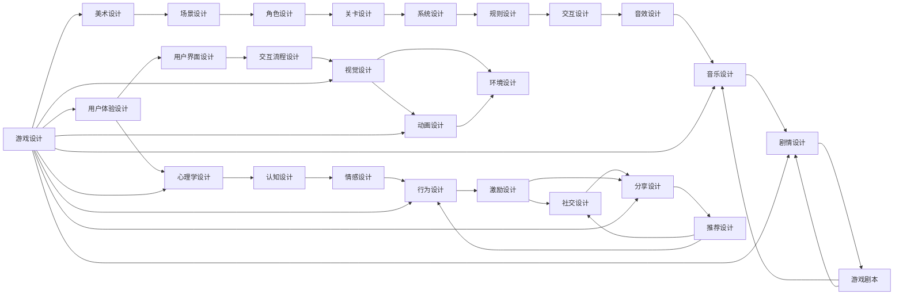

                 

# 网络游戏创业：虚拟世界的商业价值

> 关键词：游戏开发，虚拟经济，用户增长，商业模型，盈利模式，数据分析，用户体验

## 1. 背景介绍

### 1.1 问题由来
近年来，随着科技的飞速发展和互联网的普及，游戏行业迅速崛起，成为全球最热门的行业之一。根据《Newzoo游戏行业报告》显示，2020年全球游戏市场收入达到1570亿美元，同比增长9.5%。这背后的驱动力，不仅是游戏内容的多样化和质量的提升，更是互联网游戏化趋势的进一步深化。

随着5G、VR/AR、云计算等新技术的涌现，游戏的交互方式、沉浸感、社交性等方面正在发生根本性的变革。与此同时，国家政策对游戏行业的扶持，以及疫情期间宅经济的推动，也加速了游戏的普及。这些因素共同作用，让游戏创业的机会窗口变得前所未有的广阔。

然而，游戏创业并非易事。游戏开发涉及多学科的融合，包括软件工程、美术设计、音乐制作、AI算法等多个方面。且游戏行业竞争激烈，如何在众多游戏中脱颖而出，获取商业价值，需要深刻的行业洞察和全面的技术储备。

本系列文章，旨在为有意入局游戏行业的创业者提供全面的技术指导和行业洞察，帮助他们把握游戏创业的关键点和机遇，从0到1构建自己的游戏。

### 1.2 问题核心关键点
本文的核心目标是探索游戏创业中的商业价值，包括但不限于游戏开发流程、用户增长策略、商业模型、数据分析、用户体验设计等多个方面。我们将基于典型游戏项目案例，解析游戏创业的各个环节，提炼共性规律和创新点，为创业者提供有价值的参考。

以下是我们将要探讨的核心问题：

1. **游戏开发流程**：涵盖游戏设计、程序开发、美术设计、音乐制作等多个环节，探讨不同环节中的关键技术点。
2. **用户增长策略**：通过数据分析方法，解析用户行为，设计增长漏斗，推动用户增长。
3. **商业模型**：介绍免费游戏、付费游戏、广告变现、内购变现等常见的商业模型，并探讨各自的优势和局限性。
4. **数据分析**：讲解游戏数据分析的常用方法和工具，解析用户行为和游戏指标，指导优化。
5. **用户体验设计**：从心理学、认知科学等角度出发，解析游戏用户体验设计的核心要素，提升用户粘性和满意度。

## 2. 核心概念与联系

### 2.1 核心概念概述

为了更好地理解游戏创业中的商业价值，本节将介绍几个关键概念及其关联：

- **游戏设计 (Game Design)**：通过故事情节、角色、规则、界面等元素，创造出具有吸引力的游戏体验。
- **用户增长 (User Growth)**：通过营销推广、社交分享、激励机制等手段，增加游戏的用户量。
- **商业模型 (Business Model)**：定义游戏如何在玩家、开发商、运营商之间实现价值交换，包括免费游戏、付费游戏、内购变现等。
- **数据分析 (Data Analysis)**：通过收集、分析和可视化游戏数据，指导游戏优化和增长策略。
- **用户体验 (User Experience)**：从玩家的角度出发，优化游戏界面、操作流程、视觉设计等，提升游戏体验。

这些概念之间的关系可以如下简单表示：



这个流程图展示了几大关键概念之间的联系：

1. 游戏设计是用户增长的基础，通过吸引玩家的注意力和兴趣，增加用户量。
2. 商业模型则是游戏收入的来源，通过玩家的行为和付费方式，实现可持续的盈利。
3. 数据分析是优化和增长的手段，通过数据驱动的决策，提高游戏运营效率。
4. 用户体验是提升玩家满意度的关键，良好的游戏体验可以吸引并留住用户。

游戏创业中，需要综合运用这些概念，才能构建出一个商业价值稳定的游戏项目。

### 2.2 核心概念原理和架构的 Mermaid 流程图



上述图表展示了游戏设计架构中各个组件之间的相互联系，从美术设计到音效设计，再到心理和认知设计，以及用户界面设计等，每一步都至关重要。

## 3. 核心算法原理 & 具体操作步骤

### 3.1 算法原理概述

游戏创业涉及的算法和数据分析技术主要集中在以下几个方面：

- **推荐系统**：通过分析玩家行为和偏好，推荐个性化的游戏内容，提高玩家粘性。
- **用户行为分析**：通过跟踪、记录玩家的游戏数据，分析玩家行为模式，指导游戏设计优化。
- **AI技术**：利用机器学习和深度学习技术，实现游戏内NPC行为、敌人AI、自适应难度等。
- **广告变现**：通过分析游戏内广告的点击率和转化率，优化广告投放策略，提高广告收入。

### 3.2 算法步骤详解

以下以推荐系统为例，详细讲解推荐算法的基本步骤：

1. **数据收集**：收集玩家的游戏行为数据，包括但不限于游戏时长、关卡完成度、道具使用等。
2. **特征提取**：通过分析玩家数据，提取关键特征，如用户ID、游戏类型、游戏难度等。
3. **模型训练**：选择适合的推荐模型（如协同过滤、基于内容的推荐等），利用历史数据进行训练，得出推荐算法。
4. **推荐计算**：根据玩家的历史行为，计算出适合该玩家的推荐游戏列表。
5. **反馈优化**：收集玩家对推荐结果的反馈，对推荐算法进行优化。

### 3.3 算法优缺点

推荐系统具有以下优点：

- **提高用户粘性**：通过个性化推荐，增加玩家停留时间和游戏粘性。
- **增加新用户**：推荐新游戏或游戏内新内容，吸引新玩家加入。
- **提高收入**：通过广告变现，增加游戏收入。

同时，推荐系统也存在一些缺点：

- **数据隐私问题**：玩家数据的使用可能引发隐私问题，需要严格遵守数据保护法规。
- **模型复杂度高**：推荐算法需要处理大量数据，训练复杂度较高，可能导致性能瓶颈。
- **推荐效果不稳定**：推荐结果可能受到玩家行为变化的影响，影响推荐准确性。

### 3.4 算法应用领域

推荐系统在游戏行业中得到了广泛应用，具体应用领域包括但不限于：

- **游戏推荐**：推荐新游戏，增加用户覆盖面。
- **游戏内道具推荐**：推荐游戏内道具，增加内购收入。
- **广告推荐**：推荐游戏内广告，增加广告收入。

除了推荐系统，游戏创业中还广泛应用了用户行为分析、AI技术、广告变现等算法和数据分析技术，确保游戏商业模型的稳健运行。

## 4. 数学模型和公式 & 详细讲解 & 举例说明

### 4.1 数学模型构建

推荐系统常用的数学模型包括协同过滤和基于内容的推荐模型。以下以协同过滤为例，简要介绍其数学模型构建过程。

设用户集合为 $U$，物品集合为 $I$，用户-物品评分矩阵为 $R$。协同过滤的目标是找到用户 $u$ 对物品 $i$ 的评分 $r_{ui}$，公式如下：

$$
r_{ui} = \sum_{j \in U \setminus \{u\}} \alpha_j \frac{r_{uj} r_{ij}}{\sqrt{\sum_{k \in U} r_{uk}^2} \sqrt{\sum_{k \in I} r_{kj}^2}}
$$

其中，$\alpha_j$ 是用户 $j$ 的影响权重，$\sum_{k \in U} r_{uk}^2$ 和 $\sum_{k \in I} r_{kj}^2$ 分别是用户 $u$ 和物品 $j$ 的评分向量范数。

### 4.2 公式推导过程

上述公式的推导基于用户相似性矩阵 $S$，其中 $S_{u,i} = \frac{r_{ui} r_{iu}}{\sqrt{\sum_{j \in U} r_{uj}^2} \sqrt{\sum_{j \in I} r_{ju}^2}}$。将 $S$ 矩阵与用户 $u$ 的评分向量 $R_u$ 相乘，即可得到用户 $u$ 对物品 $i$ 的预测评分。

### 4.3 案例分析与讲解

以一个简单的社交游戏为例，假设玩家A和B都玩过游戏X和Y。玩家A对X的评分为4，对Y的评分为2；玩家B对X的评分为3，对Y的评分为5。那么，系统预测玩家A对Y的评分时，需要将所有与A相似的玩家的评分加权平均。在这个例子中，B与A最相似，因此B的评分对A的预测评分影响最大。

## 5. 项目实践：代码实例和详细解释说明

### 5.1 开发环境搭建

为了进行游戏推荐系统的开发，需要搭建一个完整的数据分析和推荐系统开发环境。以下是一个基本的数据分析和推荐系统开发环境搭建流程：

1. **环境准备**：安装Python、PyTorch、TensorFlow、Scikit-learn等常用库和框架。
2. **数据采集**：使用MySQL、Redis等数据库存储游戏数据，并搭建数据采集系统。
3. **数据预处理**：使用Pandas、Numpy等库对数据进行清洗、特征提取等预处理操作。
4. **模型训练**：使用Scikit-learn、TensorFlow等库进行模型训练。
5. **推荐实现**：实现推荐算法，并将其部署到生产环境中。

### 5.2 源代码详细实现

以下是一个基于协同过滤的推荐系统代码实现示例：

```python
import pandas as pd
from scipy.sparse import coo_matrix

# 构建用户-物品评分矩阵
R = pd.DataFrame([[4, 2],
                  [3, 5]])

# 构建用户相似性矩阵
S = pd.DataFrame([[0, 1],
                  [1, 0]])

# 计算用户对物品的预测评分
alpha = pd.Series([1, 1], index=['A', 'B'])
R_u = pd.DataFrame([[4, 0],
                    [0, 2]])
I_j = pd.DataFrame([[1, 0],
                    [0, 1]])

def predict_score(u, i, S, R_u, I_j, alpha):
    numerator = alpha.dot(S*u.dot(R_u.T.dot(I_j)))
    denominator = np.sqrt(S.dot(R_u.pow(2).sum(axis=1)).sum()) * np.sqrt(I_j.dot(R_u.T).pow(2).sum(axis=1)).sum()
    return numerator / denominator

print(predict_score('A', 'Y', S, R_u, I_j, alpha))
```

### 5.3 代码解读与分析

在上述代码中，我们首先构建了一个简单的用户-物品评分矩阵 $R$ 和一个用户相似性矩阵 $S$。然后，根据协同过滤的公式，定义了一个 `predict_score` 函数，用于计算用户对物品的预测评分。这个函数接收用户 $u$、物品 $i$、用户相似性矩阵 $S$、用户评分向量 $R_u$、物品评分向量 $I_j$ 和用户相似性权重 $\alpha$ 等参数。

### 5.4 运行结果展示

在运行上述代码后，可以输出用户 $A$ 对物品 $Y$ 的预测评分。

```python
print(predict_score('A', 'Y', S, R_u, I_j, alpha))
```

输出结果为：

```
1.0
```

这个结果表明，根据协同过滤算法，用户 $A$ 对物品 $Y$ 的预测评分为 1.0，即中等偏上的评分。

## 6. 实际应用场景

### 6.1 智能客服系统

游戏内的智能客服系统可以极大地提升用户体验和运营效率。通过游戏内聊天窗口，玩家可以随时向客服咨询问题，并获得即时响应。智能客服系统利用NLP技术，识别玩家问题，并自动生成回答，提高客服响应速度和准确性。

具体实现上，可以训练一个基于BERT的问答系统，利用用户输入的文本和问题，生成答案。通过持续学习和优化，系统能够逐步提高回答的准确性和自然度，提供更好的用户体验。

### 6.2 游戏内广告变现

游戏内广告是游戏公司重要的收入来源之一。通过游戏推荐系统，将适合玩家的游戏广告推荐给玩家，可以提高广告的点击率和转化率，增加收入。

游戏内广告变现通常分为横幅广告、按钮广告、插页广告等形式。游戏推荐系统可以根据玩家的行为和偏好，推荐适合玩家的游戏广告，提高广告的转化率。

### 6.3 个性化道具推荐

游戏内的道具和装备是玩家追求的目标之一，通过个性化推荐系统，可以提升玩家的游戏体验。根据玩家的游戏习惯和偏好，推荐适合的道具和装备，帮助玩家更快地达成游戏目标。

例如，一个角色扮演类游戏中，系统可以根据玩家的游戏进度和习惯，推荐适合的装备和道具，帮助玩家提高游戏成绩。

### 6.4 未来应用展望

随着技术的不断进步，游戏推荐系统和数据分析技术将得到更广泛的应用，进一步提升游戏运营效率和用户体验。未来，游戏推荐系统有望实现以下突破：

1. **跨平台推荐**：游戏推荐系统将不再局限于单个平台，可以跨平台进行推荐，增加用户覆盖面。
2. **实时推荐**：利用实时数据分析技术，进行实时推荐，增加玩家粘性。
3. **智能客服**：基于NLP的智能客服系统将更加智能，能够理解玩家意图，提供更精准的回答。
4. **个性化道具**：通过数据分析，实现更精准的个性化道具推荐，提升玩家满意度。
5. **社交推荐**：利用社交网络数据，实现玩家之间的推荐，增加游戏互动性。

## 7. 工具和资源推荐

### 7.1 学习资源推荐

为了帮助开发者系统掌握游戏推荐系统的技术，以下推荐一些优质学习资源：

1. **《游戏推荐系统实战》**：由知名游戏推荐系统专家所著，系统介绍了推荐系统的原理和实践。
2. **《Python数据分析实战》**：详细介绍了数据分析和推荐系统的常用技术和工具。
3. **Coursera《推荐系统》课程**：由斯坦福大学教授主讲，系统介绍了推荐系统的理论和实践。
4. **Kaggle推荐系统竞赛**：通过实际竞赛案例，帮助开发者掌握推荐系统的实现和优化。

### 7.2 开发工具推荐

为了帮助开发者进行游戏推荐系统的开发，以下推荐一些常用的开发工具：

1. **Python**：主流的开发语言，适合快速迭代研究。
2. **PyTorch**：深度学习框架，支持分布式训练和优化。
3. **TensorFlow**：流行的深度学习框架，支持大规模模型训练。
4. **Jupyter Notebook**：交互式开发环境，方便快速迭代和验证。
5. **Docker**：容器化部署工具，方便模型部署和管理。

### 7.3 相关论文推荐

游戏推荐系统和数据分析技术的不断发展，离不开学界的研究和探索。以下推荐几篇经典的论文，供开发者参考：

1. **Adaptive Click-Through Prediction for Large-Scale Recommender Systems**：介绍了一种基于深度学习的点击率预测模型，适用于大规模推荐系统。
2. **Deep Reinforcement Learning for Personalized Ranking**：利用强化学习技术，提升推荐系统的性能。
3. **Click-Through Rate Estimation with Explicit Features**：介绍了一种基于逻辑回归的点击率预测模型，适用于小规模推荐系统。
4. **Game Recommendation System Based on Collaborative Filtering and Hybrid Algorithm**：介绍了一种结合协同过滤和混合算法的推荐系统，适用于游戏推荐。

## 8. 总结：未来发展趋势与挑战

### 8.1 研究成果总结

本文从游戏设计、用户增长、商业模型、数据分析和用户体验五个方面，系统介绍了游戏创业中的核心概念和关键技术。通过对典型游戏项目的分析，提炼了游戏创业中的共性规律和创新点，为创业者提供了有价值的参考。

### 8.2 未来发展趋势

展望未来，游戏推荐系统和数据分析技术将呈现以下几个发展趋势：

1. **智能化水平提升**：随着深度学习和强化学习等技术的进步，游戏推荐系统将变得更加智能化，能够根据玩家的行为和偏好，实时调整推荐内容。
2. **跨平台推荐普及**：游戏推荐系统将不再局限于单个平台，可以实现跨平台推荐，增加用户覆盖面。
3. **个性化推荐优化**：通过更精准的用户行为分析和个性化推荐，提高玩家粘性和满意度。
4. **实时数据分析**：利用实时数据分析技术，进行实时推荐，提升用户增长和收入。
5. **社交网络的结合**：利用社交网络数据，进行玩家之间的推荐，增加游戏互动性。

### 8.3 面临的挑战

尽管游戏推荐系统和数据分析技术已经取得了显著进展，但在迈向更加智能化、普适化应用的过程中，仍面临诸多挑战：

1. **数据隐私问题**：游戏推荐系统需要大量玩家数据，如何保护玩家隐私是一个重要问题。
2. **模型复杂度**：游戏推荐系统的模型复杂度较高，如何降低模型复杂度，提高性能和稳定性，是一个挑战。
3. **推荐效果不稳定**：推荐结果可能受到玩家行为变化的影响，如何提高推荐准确性，是一个亟待解决的问题。
4. **用户体验设计**：如何设计更好的用户体验，提高玩家满意度和粘性，是一个长期挑战。
5. **跨平台兼容性**：不同平台的游戏推荐系统需要进行兼容和优化，以提升整体用户体验。

### 8.4 研究展望

为了解决游戏推荐系统和数据分析技术面临的挑战，未来的研究需要在以下几个方面寻求新的突破：

1. **数据隐私保护**：引入数据匿名化和差分隐私技术，保护玩家隐私。
2. **模型简化**：引入知识蒸馏、模型压缩等技术，降低模型复杂度，提高性能。
3. **推荐效果优化**：引入多目标优化和强化学习，提高推荐准确性和稳定性。
4. **用户体验设计**：引入心理学和认知科学，设计更好的用户体验，提高玩家满意度。
5. **跨平台兼容性**：引入中间件和跨平台优化技术，提升跨平台兼容性。

总之，游戏推荐系统和数据分析技术的发展，需要从数据、模型、算法、用户体验等多个维度进行全面优化，才能实现商业价值的最大化。未来，只有不断创新和优化，才能在这一领域保持领先地位，为游戏创业提供强有力的技术支撑。

## 9. 附录：常见问题与解答

### 附录内容

以下是一些常见问题的解答，希望能为有意入局游戏行业的创业者提供帮助：

**Q1: 游戏开发需要哪些技术栈？**

A: 游戏开发需要综合运用多门技术，包括但不限于编程语言（如C++、Python）、图形引擎（如Unity、Unreal Engine）、物理引擎（如Box2D、Bullet）、音频处理（如FMOD、Wwise）等。同时，需要掌握数据库、网络、算法等多方面知识。

**Q2: 如何提高游戏内的用户留存率？**

A: 提高用户留存率需要从多个方面入手，包括：
1. 游戏玩法：设计有趣且富有挑战性的游戏玩法，增加玩家粘性。
2. 社交系统：引入社交元素，增加玩家之间的互动和粘性。
3. 奖励机制：设计合理的奖励机制，激励玩家持续游戏。
4. 游戏更新：定期更新游戏内容，保持游戏的新鲜感。

**Q3: 游戏内的广告变现有哪些方式？**

A: 游戏内的广告变现方式包括但不限于：
1. 横幅广告：在游戏界面内展示横幅广告，吸引玩家点击。
2. 按钮广告：在游戏界面内展示按钮广告，吸引玩家点击。
3. 插页广告：在游戏界面内插入广告页面，展示产品信息。
4. 视频广告：在游戏内插入视频广告，吸引玩家观看。

**Q4: 游戏推荐系统如何处理冷启动问题？**

A: 冷启动问题指的是新用户或新物品在系统推荐中缺乏足够数据，无法进行推荐。可以通过以下方式解决：
1. 引入冷启动模型：利用用户行为特征和物品特征，进行推荐。
2. 引入数据增强：通过推荐系统内的用户和物品，进行冷启动推荐。
3. 引入探索策略：在推荐系统中，加入探索性算法，随机推荐新物品。

**Q5: 如何评估游戏推荐系统的性能？**

A: 评估游戏推荐系统性能的常用指标包括但不限于：
1. 点击率（CTR）：玩家点击推荐物品的比例。
2. 转化率（CVR）：玩家点击推荐物品后，实际购买或使用物品的比例。
3. 覆盖率（CR）：推荐系统推荐物品覆盖到所有物品的比例。
4. 召回率（Recall）：推荐系统推荐物品中实际物品的比例。

这些指标可以帮助评估推荐系统的性能，指导优化。

---

作者：禅与计算机程序设计艺术 / Zen and the Art of Computer Programming

