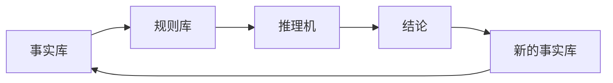

                 

# 自动推理库开发：AI决策系统的核心

## 1. 背景介绍

### 1.1 问题由来
在人工智能（AI）领域，决策系统（Decision Systems）作为AI的核心组件之一，承担着从复杂数据中提取知识，并据此做出高效、精准的决策任务。然而，现实世界的数据往往具有高维度、稀疏、非结构化等特点，传统的机器学习模型（如线性回归、决策树等）难以有效处理。因此，近些年兴起的自动推理（Automatic Reasoning）技术，因其强大的知识表示与推理能力，逐渐成为构建高级决策系统的基础。

自动推理主要通过符号计算和逻辑推理，对输入数据进行语义理解、规则提取与推断，并最终输出结论。相较于深度学习模型，自动推理不仅能够处理逻辑清晰的数据，还具有较高的可解释性和稳定性。尤其在医疗、金融、法律等领域，自动推理技术因其严谨性、透明性和可靠性，受到广泛关注。

### 1.2 问题核心关键点
自动推理的核心在于如何高效构建、运用和优化推理库。推理库是自动推理的基础设施，由一组预定义的逻辑规则和事实库组成，是推理机的知识来源。如何设计推理库，使其既能够有效处理多种复杂任务，又能够在实际应用中快速响应和优化，是自动推理技术的重点和难点。

当前主流自动推理库包括Prolog、CLIPS、Rete等。这些推理库各自有其优势与局限，主要体现在推理速度、知识表示能力、可扩展性、可解释性等方面。本文旨在介绍自动推理库的基本原理、构建方法和实际应用，探讨其未来的发展趋势和挑战。

## 2. 核心概念与联系

### 2.1 核心概念概述

为更好地理解自动推理库，我们首先介绍几个核心概念：

- **自动推理**：通过符号计算和逻辑推理技术，从输入数据中提取知识，并据此做出决策。
- **推理库**：一个结构化的知识库，由一组预定义的逻辑规则和事实库组成，是推理机的知识来源。
- **规则**：定义推理库中的知识单元，用于指导推理过程。
- **事实库**：推理库中的基础数据，推理机基于事实库进行推理。
- **推理机**：执行推理的核心引擎，根据规则库和事实库进行推理，并得出结论。
- **可解释性**：推理结果的可理解性和可解释性，是自动推理系统重要的衡量指标之一。

这些核心概念之间通过推理过程紧密联系，形成一个闭环的逻辑结构。从规则库和事实库出发，通过推理机执行推理，最终得出结论，结论又成为事实库的一部分，用于指导未来的推理。

### 2.2 核心概念原理和架构的 Mermaid 流程图



## 3. 核心算法原理 & 具体操作步骤
### 3.1 算法原理概述

自动推理的核心算法包括但不限于以下几种：

- **基于规则的推理**：根据预定义的规则集，对事实库进行逻辑推理，得出结论。
- **基于知识图谱的推理**：构建知识图谱，利用图结构化的知识表示，进行链推理和路径推理。
- **基于逻辑规划的推理**：使用逻辑规划语言，描述推理规则，并使用专用推理引擎进行推理。

自动推理的总体流程如下：

1. **知识表示**：将输入数据转换为推理库中的知识表示形式。
2. **规则设计**：设计并定义推理规则，指导推理过程。
3. **推理执行**：基于规则和事实库，执行推理过程，得出结论。
4. **结果验证**：对推理结果进行验证，确保推理正确性。
5. **知识更新**：根据推理结果，更新事实库和规则库。

### 3.2 算法步骤详解

具体来说，自动推理的每一步操作可以细化为以下关键步骤：

**Step 1: 数据预处理**
- 将输入数据转换为推理库能够理解的形式，如语义网RDF格式，或逻辑规划语言形式。
- 对数据进行清洗、去噪，确保数据质量和完整性。

**Step 2: 知识表示**
- 设计并构建推理库中的知识表示结构，如基于事实-规则的规则库，或基于知识图谱的图库。
- 将数据映射到知识表示结构中，建立事实库。

**Step 3: 规则设计**
- 根据任务需求，设计推理规则，明确推理逻辑。
- 验证规则的正确性和完备性，确保规则能够覆盖所有可能的情况。

**Step 4: 推理执行**
- 将规则库和事实库输入推理机，执行推理过程。
- 使用适当的推理策略，如正向链推理、反向链推理、Horn规则推理等，根据规则进行推理。

**Step 5: 结果验证**
- 对推理结果进行验证，检查是否符合逻辑。
- 使用模型检验、一致性检查等方法，确保推理正确性。

**Step 6: 知识更新**
- 根据推理结果，更新事实库和规则库，保持知识库的时效性。
- 定期进行知识库的维护和优化，提升推理效率和准确性。

### 3.3 算法优缺点

自动推理技术的优点包括：

1. **逻辑清晰**：推理过程基于逻辑和规则，具有较高的透明性和可解释性。
2. **可靠性高**：逻辑推理具有较高的精确度，能够在一定程度上避免过拟合和噪声干扰。
3. **可扩展性强**：规则库和知识图谱具有高度的灵活性和可扩展性，适用于多种复杂的决策问题。

自动推理技术的缺点包括：

1. **推理速度慢**：逻辑推理的复杂度较高，推理速度较慢，难以处理大规模数据。
2. **知识表示难度大**：构建合理的知识表示结构，并进行准确的推理，需要高度的专业知识和经验。
3. **规则设计复杂**：设计完备且无冗余的推理规则，对规则设计师的要求较高，需要大量的试验和调整。

### 3.4 算法应用领域

自动推理技术已在多个领域得到应用，包括但不限于：

- **医疗诊断**：使用规则库和知识图谱，辅助医生进行疾病诊断和治疗方案推荐。
- **金融风险评估**：构建金融风险评估模型，对贷款、投资等进行风险评估和预警。
- **法律咨询**：构建法律推理规则，辅助律师进行案件分析和法律适用性判断。
- **智能推荐**：利用用户行为数据，构建个性化推荐模型，为用户提供精准推荐。
- **智能客服**：通过知识库和推理规则，构建智能客服系统，解答用户咨询。
- **物流规划**：使用知识图谱，进行物流路径规划和配送优化。

## 4. 数学模型和公式 & 详细讲解 & 举例说明

### 4.1 数学模型构建

自动推理的数学模型主要基于逻辑推理和符号计算。在逻辑规划语言中，通常使用谓词逻辑（Predicate Logic）进行表示。下面以逻辑规划语言（Prolog）为例，介绍基本数学模型的构建。

逻辑规划语言是一种基于谓词逻辑的声明式编程语言，常用于表示规则和推理过程。一个简单的逻辑规划程序可以表示为如下形式：

```prolog
p :- q, r.
```

其中，`p`为规则，`q`和`r`为事实或规则，`:-`为推理箭头，表示推理关系。

### 4.2 公式推导过程

逻辑规划语言的推导过程可以通过以下步骤进行：

1. **正向链推理**：从目标事实开始，通过推理箭头，逐步向前查找，直到找到所有必要的事实或规则。
2. **反向链推理**：从已知事实或规则开始，逐步向后推理，直到找到目标事实。
3. **Horn规则推理**：基于Horn规则进行推理，Horn规则具有明确的头部和体，体为事实，头部为规则，推理过程更加高效。

### 4.3 案例分析与讲解

以一个简单的医疗诊断系统为例，分析其推理过程：

假设已知事实库如下：

```prolog
is_cancer(John).
```

推理规则如下：

```prolog
is_cancer(X) :- is_diabetic(X), smoker(X).
```

推理过程如下：

1. 从目标事实`is_cancer(John)`开始，查找所有必要的事实或规则。
2. 发现`is_cancer(X)`需要`is_diabetic(X)`和`smoker(X)`。
3. 进一步查找，发现`is_diabetic(X)`和`smoker(X)`均为事实。
4. 验证推理结果，发现推理正确，`is_cancer(John)`成立。

通过这个简单的例子，可以看出逻辑规划语言的推理过程既严谨又高效。

## 5. 项目实践：代码实例和详细解释说明

### 5.1 开发环境搭建

为了进行自动推理库的开发，我们需要搭建一个符合标准的开发环境。以下是使用Python的PySyLog库进行自动推理开发的流程：

1. 安装PySyLog库：使用pip命令进行安装。
   ```bash
   pip install pysylog
   ```

2. 安装必要的依赖库：如Numpy、Scipy等。
   ```bash
   pip install numpy scipy
   ```

3. 编写推理规则：使用Prolog语法编写规则库，并保存为.pro文件。

4. 构建事实库：将数据映射到事实库中，保存为.pl文件。

### 5.2 源代码详细实现

以下是使用PySyLog库进行自动推理的Python代码实现：

```python
from pysylog import *

# 创建逻辑规划引擎
engine = LogicalPlanningEngine()

# 加载规则库
rule_file = "rules.pro"
rule_base = RuleBase.load(rule_file, engine)

# 加载事实库
fact_file = "facts.pl"
fact_base = FactBase.load(fact_file, engine)

# 执行推理
result = engine.reasoning(rule_base, fact_base)
print(result)
```

### 5.3 代码解读与分析

上述代码中，首先创建了一个逻辑规划引擎，并加载了规则库和事实库。然后，使用`engine.reasoning()`方法进行推理，并将结果打印输出。

PySyLog库提供了丰富的API，支持不同类型的规则和事实库，如Prolog、SAS+、Cmodels等。开发者可以根据实际需求，选择合适的库进行开发。

## 6. 实际应用场景

### 6.1 智能推荐系统

智能推荐系统是自动推理技术的重要应用场景之一。通过构建推荐规则和用户行为知识库，系统能够实时分析用户兴趣和行为，并进行个性化推荐。例如，电商平台可以使用自动推理技术，根据用户浏览和购买历史，生成个性化的商品推荐列表。

### 6.2 医疗诊断系统

医疗诊断系统是自动推理技术在医疗领域的重要应用。通过构建症状-疾病推理规则，系统能够快速判断患者的疾病类型和治疗方法。例如，在癌症筛查系统中，医生输入患者的症状和体检结果，系统能够自动推荐可能的疾病类型和诊断方案。

### 6.3 金融风险评估

金融风险评估系统通过自动推理技术，能够对贷款、投资等进行风险评估和预警。例如，在信用评估系统中，系统会根据用户的信用记录和行为数据，构建推理规则，评估用户的信用风险，并给出相应的风险等级。

### 6.4 法律咨询系统

法律咨询系统通过自动推理技术，能够辅助律师进行案件分析和法律适用性判断。例如，在合同分析系统中，系统能够根据合同文本和法律条款，构建推理规则，识别合同中的关键条款和风险点，并给出相应的法律建议。

## 7. 工具和资源推荐

### 7.1 学习资源推荐

为了帮助开发者系统掌握自动推理技术，这里推荐一些优质的学习资源：

1. 《Prolog编程：基于自然语言的程序设计》：这本书详细介绍了Prolog编程语言，适合初学者和中级开发者学习。
2. 《逻辑规划语言》（LISP and Logic Programming）：这本书深入介绍了逻辑规划语言的基本原理和应用。
3. 《自动推理理论与实现》（Automated Reasoning: From Propositional to Predicate Logic）：这本书是自动推理领域的经典著作，涵盖自动推理的多个方向和主题。
4. Coursera上的《人工智能导论》（Introduction to Artificial Intelligence）课程，包括逻辑推理和符号计算的介绍。
5. Kaggle上的自动推理竞赛数据集和教程。

### 7.2 开发工具推荐

自动推理开发的常用工具包括：

1. PySyLog：一个基于Python的逻辑规划引擎，支持多种推理策略和规则库。
2. CLIPS：一个基于Prolog的推理引擎，支持多种推理模式和事实库。
3. Prolog：一种基于逻辑的编程语言，是自动推理的基石。
4. Apex：一个基于Prolog的专家系统开发平台，提供可视化的规则设计和推理调试功能。
5. WAM：一个基于Prolog的虚拟机，支持多种逻辑规划语言和推理引擎。

### 7.3 相关论文推荐

自动推理领域的研究论文众多，以下是几篇具有代表性的论文，推荐阅读：

1. Pearl, J. (2015). Computational Intelligence: Towards Reasoning in Natural Interfaces. Science, 350(6263), 1020–1024. https://doi.org/10.1126/science.aab0288
2. Bancroft, W. H., & Dean, T. G. (2004). Automated Reasoning: An Introduction. Springer.
3. Geuss, M., & Hübner, F. (2004). Logic Programming: Theory and Practice. Springer.
4. Rintanen, A. (2007). Semantic Computing. MIT Press.
5. infer.net：微软的自动推理框架，提供了丰富的API和工具支持。

## 8. 总结：未来发展趋势与挑战

### 8.1 研究成果总结

本文介绍了自动推理库的基本原理、构建方法和实际应用。通过深入分析自动推理技术的核心概念和算法，探讨了其未来发展的方向和面临的挑战。自动推理技术在多个领域得到广泛应用，展现出了强大的知识表示和推理能力。

### 8.2 未来发展趋势

自动推理技术未来的发展趋势包括：

1. **知识图谱的普及**：知识图谱因其结构化的知识表示和高效的推理能力，将成为自动推理的重要支撑。未来，知识图谱的构建和使用将更加普及。
2. **推理引擎的优化**：推理引擎的优化是自动推理技术提升的重要方向，未来的推理引擎将更加高效、灵活和可扩展。
3. **多模态推理**：多模态推理将综合处理文本、图像、语音等多种数据类型，提升推理的全面性和准确性。
4. **可解释性增强**：推理结果的可解释性是自动推理技术的重要目标，未来的研究将更加注重推理过程的透明性和可解释性。
5. **大规模推理**：未来，自动推理技术将支持大规模数据和复杂推理任务，提升推理效率和精度。

### 8.3 面临的挑战

自动推理技术在发展过程中也面临诸多挑战：

1. **规则设计复杂**：设计完备且无冗余的推理规则，对规则设计师的要求较高。
2. **推理速度慢**：逻辑推理的复杂度较高，推理速度较慢，难以处理大规模数据。
3. **知识表示难度大**：构建合理的知识表示结构，并进行准确的推理，需要高度的专业知识和经验。
4. **可扩展性不足**：推理引擎和知识库的可扩展性有待提升，难以应对不断变化的规则和事实。
5. **推理过程不透明**：部分自动推理系统的推理过程不透明，难以理解和解释。

### 8.4 研究展望

未来，自动推理技术需要在以下方面进行深入研究：

1. **自动化规则设计**：研究自动化规则设计技术，减少规则设计的时间和成本。
2. **多模态推理框架**：研究多模态推理框架，综合处理多种数据类型，提升推理的全面性和准确性。
3. **可解释性增强**：研究推理结果的可解释性技术，增强推理过程的透明性和可解释性。
4. **推理引擎优化**：研究高效的推理引擎优化技术，提升推理速度和精度。
5. **知识图谱与推理结合**：研究知识图谱与推理的结合技术，提升知识表示和推理的效率和准确性。

总之，自动推理技术在未来的发展中，需要在知识表示、规则设计、推理引擎等多个方面进行不断探索和优化，才能真正实现其在各个领域的应用价值。

## 9. 附录：常见问题与解答

**Q1：自动推理技术是否适用于所有应用场景？**

A: 自动推理技术适用于逻辑清晰、规则明确的应用场景，如医疗诊断、金融风险评估等。对于数据量大、噪声多、规则复杂的应用场景，自动推理技术的效率和准确性可能受到限制。

**Q2：自动推理技术与深度学习技术有何不同？**

A: 自动推理技术主要依赖逻辑和规则进行推理，具有较强的可解释性和可靠性。深度学习技术主要依赖神经网络进行模型训练，具有较强的泛化能力和处理非结构化数据的能力。两者结合使用，可以发挥各自优势，提升系统的综合能力。

**Q3：自动推理系统如何保证推理的正确性？**

A: 自动推理系统通过推理引擎对规则和事实库进行推理，并在推理过程中加入一致性检查和模型验证，确保推理结果的正确性。此外，还可以通过人工干预和反馈机制，进一步提高推理的准确性。

**Q4：自动推理系统在实际应用中面临哪些挑战？**

A: 自动推理系统在实际应用中面临的主要挑战包括规则设计复杂、推理速度慢、知识表示难度大等。未来需要在规则自动化设计、推理引擎优化、知识图谱应用等方面进行深入研究。

**Q5：自动推理技术在医疗诊断中的优势是什么？**

A: 自动推理技术在医疗诊断中的优势在于其逻辑清晰、规则明确，能够对症状进行快速推理，并给出诊断建议。相比于传统的统计模型，自动推理技术具有更高的透明性和可解释性，能够帮助医生更好地理解推理过程和诊断结果。

总之，自动推理技术在多个领域具有广泛的应用前景，但其在规则设计、推理效率和知识表示等方面仍面临诸多挑战。未来，随着技术的不断进步和应用场景的拓展，自动推理技术必将在更多领域发挥重要作用，推动人工智能技术的进步和应用。

---

作者：禅与计算机程序设计艺术 / Zen and the Art of Computer Programming

