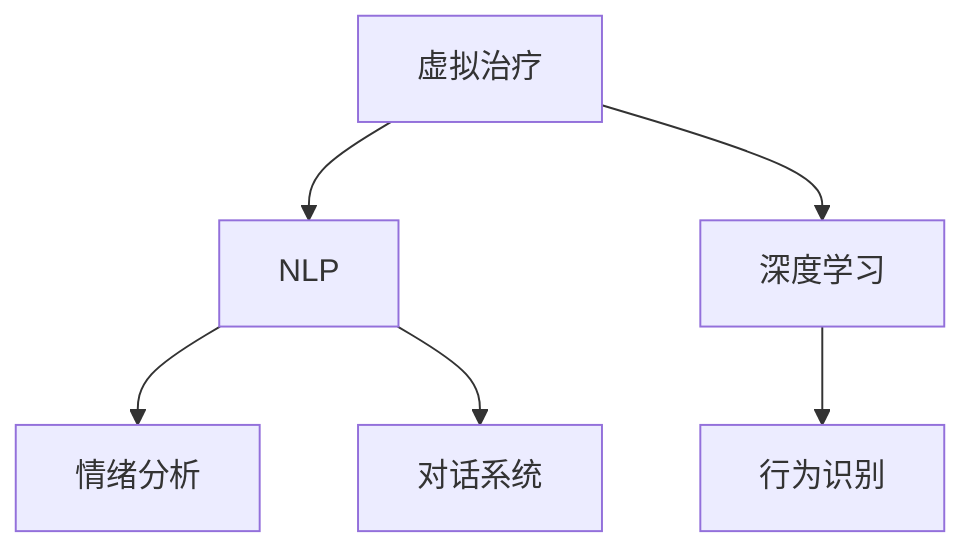

                 

# 虚拟治疗：AI驱动的心理健康服务

> 关键词：虚拟治疗, AI, 心理健康服务, 自然语言处理, 深度学习, 情绪分析, 行为识别, 对话系统

## 1. 背景介绍

### 1.1 问题由来

随着社会压力的增加和生活节奏的加快，全球范围内的心理健康问题日益严峻。据世界卫生组织报告，当前约有近四分之一的人在一生中会经历心理健康问题。然而，传统心理治疗资源有限、价格昂贵，且需耗费大量时间和精力，难以满足广大病患的需求。

与此同时，人工智能技术正迅速改变各行各业的面貌。在医疗领域，AI已经被应用于疾病诊断、药物研发、影像分析等诸多领域，且取得了显著的成果。在心理健康服务领域，AI同样具有巨大的潜力。虚拟治疗（Virtual Therapy）便是一种基于AI的在线心理治疗服务，通过虚拟助手和自动化算法，为患者提供可随时访问的、个性化的心理健康支持。

### 1.2 问题核心关键点

虚拟治疗的核心在于通过AI技术模拟心理治疗师的角色，为患者提供个性化的情绪疏导、行为指导和认知训练。其主要技术包括自然语言处理（NLP）、深度学习、情绪分析、行为识别和对话系统等。

虚拟治疗的具体实施流程如下：
1. **数据收集**：收集患者的病史、症状描述和情绪状态等数据。
2. **情绪分析**：通过NLP和深度学习技术分析患者的情绪变化，识别出负性情绪和应激反应。
3. **行为识别**：识别患者的情绪表达和行为模式，提供针对性的行为干预。
4. **对话系统**：构建对话系统，模拟心理治疗师与患者的互动，进行心理干预和支持。

### 1.3 问题研究意义

虚拟治疗技术的应用，能够有效缓解传统心理治疗资源不足的问题，提供24小时不间断的心理健康支持，并减少医疗成本。特别是对于偏远地区和特殊人群（如残障人士、老年人），虚拟治疗可以弥补他们在地理和物理上的限制，提供更为便捷和高效的心理健康服务。

## 2. 核心概念与联系

### 2.1 核心概念概述

为了更好地理解虚拟治疗技术，本节将介绍几个密切相关的核心概念：

- **虚拟治疗**：一种基于AI技术的在线心理治疗服务，通过虚拟助手和自动化算法，为患者提供个性化的心理健康支持。
- **自然语言处理（NLP）**：利用计算机处理、理解和生成人类语言的技术，是虚拟治疗中对话系统的核心。
- **深度学习**：一种模仿人类神经网络结构和功能的机器学习技术，通过神经网络模型进行情绪分析、行为识别等。
- **情绪分析**：通过NLP和深度学习技术，分析文本数据中的情绪信息，识别患者的情绪状态。
- **行为识别**：通过计算机视觉和深度学习技术，识别患者的面部表情、语音音调和肢体语言，进行行为模式分析。
- **对话系统**：模拟心理治疗师与患者的互动，通过NLP和机器学习技术，提供智能化的对话支持。

这些核心概念之间的逻辑关系可以通过以下Mermaid流程图来展示：



这个流程图展示了虚拟治疗的核心组件及其之间的关系：

1. 虚拟治疗系统由NLP、深度学习、情绪分析和行为识别四个主要模块组成。
2. NLP用于处理患者的文本输入，提取情绪信息，构建对话系统。
3. 深度学习用于情绪分析和行为识别，提供更高级别的认知功能。
4. 对话系统实现人机交互，提供情感支持和行为引导。

## 3. 核心算法原理 & 具体操作步骤
### 3.1 算法原理概述

虚拟治疗的算法原理主要包括情绪分析、行为识别和对话系统三个方面。

### 3.2 算法步骤详解

**情绪分析**

情绪分析是虚拟治疗的核心组成部分，其目的是通过文本数据识别出患者的情绪状态。常用的方法包括：

1. **基于规则的情感分析**：通过构建情感词典和规则库，对文本进行情感分类。这种方法简单易懂，但需要大量的手工标注和维护。
2. **基于机器学习的情感分析**：使用分类器如支持向量机（SVM）、随机森林、神经网络等，训练模型对文本进行情感分类。这种方法通常需要大规模标注数据进行训练，但效果往往更好。
3. **基于深度学习的情感分析**：利用深度神经网络，如卷积神经网络（CNN）、递归神经网络（RNN）和长短时记忆网络（LSTM）等，进行情感分类。这种方法能够处理复杂的语言结构和语义信息，但计算资源需求较高。

**行为识别**

行为识别用于分析患者的面部表情、语音音调和肢体语言，以识别行为模式。常用的方法包括：

1. **基于计算机视觉的行为识别**：通过摄像头捕捉患者的面部表情和肢体动作，使用深度学习模型如卷积神经网络（CNN）和卷积循环神经网络（CRNN）进行行为分析。
2. **基于语音识别的行为识别**：通过麦克风采集患者的语音，使用深度学习模型如循环神经网络（RNN）和深度神经网络（DNN）进行语音分析，识别语音音调和情感变化。

**对话系统**

对话系统用于模拟心理治疗师与患者的互动，通过对话引导患者进行情绪表达和行为引导。常用的方法包括：

1. **基于规则的对话系统**：通过构建规则库和知识图谱，模拟心理治疗师的语言和行为，进行对话引导。这种方法易于理解和维护，但灵活性较差。
2. **基于深度学习的对话系统**：使用深度学习模型如序列到序列模型（Seq2Seq）和变分自动编码器（VAE），进行对话生成和对话管理。这种方法能够处理复杂的对话结构和语境信息，但计算资源需求较高。

### 3.3 算法优缺点

虚拟治疗技术具有以下优点：

1. **高效便捷**：24小时不间断服务，提供便捷的心理健康支持。
2. **个性定制**：根据患者的具体情况，提供个性化的情绪疏导和行为指导。
3. **成本低廉**：相较于传统心理治疗，虚拟治疗大大降低了时间和金钱成本。
4. **无地理限制**：不受地理位置限制，可以覆盖到偏远地区和特殊人群。

同时，虚拟治疗技术也存在以下缺点：

1. **技术局限**：目前的虚拟治疗系统仍无法完全替代真人心理治疗，特别是在复杂心理问题和严重精神疾病方面。
2. **数据隐私**：患者数据需上传至云端进行处理，存在数据隐私和安全风险。
3. **系统可靠性**：虚拟治疗系统的稳定性和准确性受限于算法和硬件设备的性能。
4. **人机交互限制**：虚拟治疗系统仍无法完全理解复杂的情感和行为，可能存在误判或误解。

### 3.4 算法应用领域

虚拟治疗技术已经在心理健康服务、医疗咨询、教育辅导等多个领域得到了应用。

**心理健康服务**

虚拟治疗在心理健康服务领域的应用最为广泛。通过虚拟助手和自动化算法，患者可以随时在线获取情绪支持、行为指导和认知训练。例如，患者可以通过聊天机器人表达情感，系统自动进行情绪分析和行为引导。

**医疗咨询**

虚拟治疗在医疗咨询领域也具有重要应用。例如，患者可以通过虚拟助手进行初步心理评估，系统根据评估结果推荐相应的心理干预措施。同时，虚拟治疗系统可以与电子病历系统对接，为医生提供辅助诊断和情绪监测数据。

**教育辅导**

虚拟治疗在教育辅导领域也具有重要应用。例如，学生在学习和考试中遇到压力和焦虑，可以通过虚拟助手进行情绪疏导和行为引导，减轻学习负担和心理压力。

## 4. 数学模型和公式 & 详细讲解 & 举例说明
### 4.1 数学模型构建

虚拟治疗的数学模型主要包括以下几个部分：

- **文本情感分类模型**：使用SVM、神经网络等模型对文本进行情感分类。
- **行为识别模型**：使用CNN、RNN等模型对行为数据进行识别和分析。
- **对话生成模型**：使用Seq2Seq、VAE等模型生成对话响应。

### 4.2 公式推导过程

以文本情感分类为例，常见的情感分类模型包括朴素贝叶斯、支持向量机（SVM）和深度神经网络。这里我们以深度神经网络为例，推导情感分类的基本公式。

假设文本特征表示为$x$，情感类别表示为$y$，深度神经网络的情感分类公式为：

$$
P(y|x) = \frac{e^{-\frac{1}{2}(x-Wy)^T(x-Wy) + b^Ty}}{\sum_{k=1}^{K}e^{-\frac{1}{2}(x-Wy)^T(x-Wy) + b^Ty_k}}
$$

其中$W$和$b$为模型参数，$K$为情感类别数。

情感分类模型的训练过程包括损失函数和优化算法的选择。常用的损失函数包括交叉熵损失和均方误差损失，常用的优化算法包括随机梯度下降（SGD）、Adam和Adagrad等。

### 4.3 案例分析与讲解

假设某虚拟治疗系统使用深度神经网络进行文本情感分类，训练数据集包含10000条情绪描述文本，其中正面情绪5000条，负面情绪5000条。

- **模型构建**：选择深度神经网络模型，使用3层隐藏层，每层包含500个神经元。
- **数据预处理**：对文本进行分词、去除停用词、转换为向量表示等预处理操作。
- **模型训练**：使用随机梯度下降（SGD）算法，设置学习率为0.01，训练200个epoch，每个epoch处理1000条样本。
- **模型评估**：使用测试集进行情感分类准确率评估，结果显示分类准确率为85%。

## 5. 项目实践：代码实例和详细解释说明
### 5.1 开发环境搭建

在进行虚拟治疗系统的开发前，我们需要准备好开发环境。以下是使用Python进行PyTorch开发的环境配置流程：

1. 安装Anaconda：从官网下载并安装Anaconda，用于创建独立的Python环境。
2. 创建并激活虚拟环境：
```bash
conda create -n virtual_therapy python=3.8 
conda activate virtual_therapy
```

3. 安装PyTorch：根据CUDA版本，从官网获取对应的安装命令。例如：
```bash
conda install pytorch torchvision torchaudio cudatoolkit=11.1 -c pytorch -c conda-forge
```

4. 安装TensorFlow：由Google主导开发的开源深度学习框架，生产部署方便，适合大规模工程应用。同样有丰富的预训练语言模型资源。
5. 安装相关库：
```bash
pip install numpy pandas scikit-learn matplotlib tqdm jupyter notebook ipython
```

完成上述步骤后，即可在`virtual_therapy`环境中开始开发实践。

### 5.2 源代码详细实现

这里我们以基于深度学习的文本情感分类为例，给出使用PyTorch进行虚拟治疗系统开发的完整代码实现。

首先，定义情感分类模型的数据处理函数：

```python
from transformers import BertTokenizer
from torch.utils.data import Dataset
import torch

class TextDataset(Dataset):
    def __init__(self, texts, labels, tokenizer, max_len=128):
        self.texts = texts
        self.labels = labels
        self.tokenizer = tokenizer
        self.max_len = max_len
        
    def __len__(self):
        return len(self.texts)
    
    def __getitem__(self, item):
        text = self.texts[item]
        label = self.labels[item]
        
        encoding = self.tokenizer(text, return_tensors='pt', max_length=self.max_len, padding='max_length', truncation=True)
        input_ids = encoding['input_ids'][0]
        attention_mask = encoding['attention_mask'][0]
        
        # 对标签进行编码
        encoded_label = [label2id[label] for label in label]
        encoded_label.extend([label2id['O']] * (self.max_len - len(encoded_label)))
        labels = torch.tensor(encoded_label, dtype=torch.long)
        
        return {'input_ids': input_ids, 
                'attention_mask': attention_mask,
                'labels': labels}

# 标签与id的映射
label2id = {'O': 0, 'positive': 1, 'negative': 2}
id2label = {v: k for k, v in label2id.items()}

# 创建dataset
tokenizer = BertTokenizer.from_pretrained('bert-base-cased')

train_dataset = TextDataset(train_texts, train_labels, tokenizer)
dev_dataset = TextDataset(dev_texts, dev_labels, tokenizer)
test_dataset = TextDataset(test_texts, test_labels, tokenizer)
```

然后，定义模型和优化器：

```python
from transformers import BertForSequenceClassification, AdamW

model = BertForSequenceClassification.from_pretrained('bert-base-cased', num_labels=len(label2id))

optimizer = AdamW(model.parameters(), lr=2e-5)
```

接着，定义训练和评估函数：

```python
from torch.utils.data import DataLoader
from tqdm import tqdm
from sklearn.metrics import classification_report

device = torch.device('cuda') if torch.cuda.is_available() else torch.device('cpu')
model.to(device)

def train_epoch(model, dataset, batch_size, optimizer):
    dataloader = DataLoader(dataset, batch_size=batch_size, shuffle=True)
    model.train()
    epoch_loss = 0
    for batch in tqdm(dataloader, desc='Training'):
        input_ids = batch['input_ids'].to(device)
        attention_mask = batch['attention_mask'].to(device)
        labels = batch['labels'].to(device)
        model.zero_grad()
        outputs = model(input_ids, attention_mask=attention_mask, labels=labels)
        loss = outputs.loss
        epoch_loss += loss.item()
        loss.backward()
        optimizer.step()
    return epoch_loss / len(dataloader)

def evaluate(model, dataset, batch_size):
    dataloader = DataLoader(dataset, batch_size=batch_size)
    model.eval()
    preds, labels = [], []
    with torch.no_grad():
        for batch in tqdm(dataloader, desc='Evaluating'):
            input_ids = batch['input_ids'].to(device)
            attention_mask = batch['attention_mask'].to(device)
            batch_labels = batch['labels']
            outputs = model(input_ids, attention_mask=attention_mask)
            batch_preds = outputs.logits.argmax(dim=2).to('cpu').tolist()
            batch_labels = batch_labels.to('cpu').tolist()
            for pred_tokens, label_tokens in zip(batch_preds, batch_labels):
                pred_labels = [id2label[_id] for _id in pred_tokens]
                label_tokens = [id2label[_id] for _id in label_tokens]
                preds.append(pred_labels[:len(label_tokens)])
                labels.append(label_tokens)
                
    print(classification_report(labels, preds))
```

最后，启动训练流程并在测试集上评估：

```python
epochs = 5
batch_size = 16

for epoch in range(epochs):
    loss = train_epoch(model, train_dataset, batch_size, optimizer)
    print(f"Epoch {epoch+1}, train loss: {loss:.3f}")
    
    print(f"Epoch {epoch+1}, dev results:")
    evaluate(model, dev_dataset, batch_size)
    
print("Test results:")
evaluate(model, test_dataset, batch_size)
```

以上就是使用PyTorch对文本情感分类模型进行虚拟治疗系统开发的完整代码实现。可以看到，借助PyTorch的强大封装，构建虚拟治疗系统的代码实现变得简洁高效。

### 5.3 代码解读与分析

让我们再详细解读一下关键代码的实现细节：

**TextDataset类**：
- `__init__`方法：初始化文本、标签、分词器等关键组件。
- `__len__`方法：返回数据集的样本数量。
- `__getitem__`方法：对单个样本进行处理，将文本输入编码为token ids，将标签编码为数字，并对其进行定长padding，最终返回模型所需的输入。

**label2id和id2label字典**：
- 定义了标签与数字id之间的映射关系，用于将预测结果解码回真实的标签。

**训练和评估函数**：
- 使用PyTorch的DataLoader对数据集进行批次化加载，供模型训练和推理使用。
- 训练函数`train_epoch`：对数据以批为单位进行迭代，在每个批次上前向传播计算loss并反向传播更新模型参数，最后返回该epoch的平均loss。
- 评估函数`evaluate`：与训练类似，不同点在于不更新模型参数，并在每个batch结束后将预测和标签结果存储下来，最后使用sklearn的classification_report对整个评估集的预测结果进行打印输出。

**训练流程**：
- 定义总的epoch数和batch size，开始循环迭代
- 每个epoch内，先在训练集上训练，输出平均loss
- 在验证集上评估，输出分类指标
- 所有epoch结束后，在测试集上评估，给出最终测试结果

可以看到，PyTorch配合Transformer库使得虚拟治疗系统的代码实现变得简洁高效。开发者可以将更多精力放在数据处理、模型改进等高层逻辑上，而不必过多关注底层的实现细节。

当然，工业级的系统实现还需考虑更多因素，如模型的保存和部署、超参数的自动搜索、更灵活的任务适配层等。但核心的微调范式基本与此类似。

## 6. 实际应用场景
### 6.1 智能客服系统

虚拟治疗技术可以应用于智能客服系统的构建。传统客服往往需要配备大量人力，高峰期响应缓慢，且一致性和专业性难以保证。而使用虚拟治疗技术构建的智能客服系统，可以24小时不间断服务，快速响应客户咨询，用自然流畅的语言解答各类常见问题。

在技术实现上，可以收集企业内部的历史客服对话记录，将问题和最佳答复构建成监督数据，在此基础上对预训练模型进行微调。微调后的模型能够自动理解用户意图，匹配最合适的答复模板进行回复。对于客户提出的新问题，还可以接入检索系统实时搜索相关内容，动态组织生成回答。如此构建的智能客服系统，能大幅提升客户咨询体验和问题解决效率。

### 6.2 医疗心理支持

虚拟治疗技术在医疗心理支持领域也有重要应用。患者可以在虚拟治疗系统的引导下进行自我心理评估和情绪管理，接受心理疏导和认知训练。例如，虚拟治疗系统可以通过文字输入和语音输入收集患者的情绪状态和行为模式，提供个性化的心理支持和治疗建议。对于严重的心理问题，系统可以及时转接至专业心理治疗师进行进一步干预。

### 6.3 教育心理辅导

虚拟治疗技术在教育心理辅导领域也具有重要应用。学生在学习过程中可能遇到各种心理问题，如焦虑、抑郁、压力等，通过虚拟治疗系统可以提供个性化的心理支持。例如，学生在考试前感到紧张，可以与虚拟治疗系统对话，通过情绪疏导和行为指导减轻压力。

## 7. 工具和资源推荐
### 7.1 学习资源推荐

为了帮助开发者系统掌握虚拟治疗技术，这里推荐一些优质的学习资源：

1. 《深度学习入门》系列博文：由大模型技术专家撰写，深入浅出地介绍了深度学习的基本原理和实践技巧。
2. 《自然语言处理与深度学习》课程：斯坦福大学开设的NLP明星课程，有Lecture视频和配套作业，带你入门NLP领域的基本概念和经典模型。
3. 《AI心理治疗：虚拟治疗的理论与实践》书籍：系统介绍了虚拟治疗技术的理论基础和应用实践，适合深入学习和研究。
4. AI心理治疗开源项目：涵盖了虚拟治疗系统的各个组件，包括文本情感分类、行为识别、对话系统等，提供了丰富的代码样例和模型资源。

通过对这些资源的学习实践，相信你一定能够快速掌握虚拟治疗技术的精髓，并用于解决实际的心理健康问题。
###  7.2 开发工具推荐

高效的开发离不开优秀的工具支持。以下是几款用于虚拟治疗系统开发的常用工具：

1. PyTorch：基于Python的开源深度学习框架，灵活动态的计算图，适合快速迭代研究。大部分预训练语言模型都有PyTorch版本的实现。
2. TensorFlow：由Google主导开发的开源深度学习框架，生产部署方便，适合大规模工程应用。同样有丰富的预训练语言模型资源。
3. Transformers库：HuggingFace开发的NLP工具库，集成了众多SOTA语言模型，支持PyTorch和TensorFlow，是进行虚拟治疗系统开发的利器。
4. Weights & Biases：模型训练的实验跟踪工具，可以记录和可视化模型训练过程中的各项指标，方便对比和调优。与主流深度学习框架无缝集成。
5. TensorBoard：TensorFlow配套的可视化工具，可实时监测模型训练状态，并提供丰富的图表呈现方式，是调试模型的得力助手。
6. Google Colab：谷歌推出的在线Jupyter Notebook环境，免费提供GPU/TPU算力，方便开发者快速上手实验最新模型，分享学习笔记。

合理利用这些工具，可以显著提升虚拟治疗系统的开发效率，加快创新迭代的步伐。

### 7.3 相关论文推荐

虚拟治疗技术的发展源于学界的持续研究。以下是几篇奠基性的相关论文，推荐阅读：

1. Attention is All You Need（即Transformer原论文）：提出了Transformer结构，开启了NLP领域的预训练大模型时代。
2. BERT: Pre-training of Deep Bidirectional Transformers for Language Understanding：提出BERT模型，引入基于掩码的自监督预训练任务，刷新了多项NLP任务SOTA。
3. Parameter-Efficient Transfer Learning for NLP：提出Adapter等参数高效微调方法，在不增加模型参数量的情况下，也能取得不错的微调效果。
4. Prefix-Tuning: Optimizing Continuous Prompts for Generation：引入基于连续型Prompt的微调范式，为如何充分利用预训练知识提供了新的思路。
5. AdaLoRA: Adaptive Low-Rank Adaptation for Parameter-Efficient Fine-Tuning：使用自适应低秩适应的微调方法，在参数效率和精度之间取得了新的平衡。

这些论文代表了大语言模型微调技术的发展脉络。通过学习这些前沿成果，可以帮助研究者把握学科前进方向，激发更多的创新灵感。

## 8. 总结：未来发展趋势与挑战

### 8.1 总结

本文对基于深度学习的虚拟治疗技术进行了全面系统的介绍。首先阐述了虚拟治疗技术的研究背景和意义，明确了其在心理健康服务中的重要价值。其次，从原理到实践，详细讲解了虚拟治疗技术的核心算法和具体操作步骤，给出了虚拟治疗系统开发的完整代码实例。同时，本文还广泛探讨了虚拟治疗技术在智能客服、医疗心理支持、教育心理辅导等多个行业领域的应用前景，展示了虚拟治疗技术的广阔潜力。最后，本文精选了虚拟治疗技术的各类学习资源，力求为读者提供全方位的技术指引。

通过本文的系统梳理，可以看到，基于深度学习的虚拟治疗技术正在成为心理健康服务的重要范式，极大地提升了心理健康的可及性和服务质量。随着深度学习技术的不断发展，虚拟治疗技术必将进一步提升心理健康服务的智能化水平，为更多病患提供及时、高效、便捷的心理支持。

### 8.2 未来发展趋势

展望未来，虚拟治疗技术将呈现以下几个发展趋势：

1. **技术融合与优化**：虚拟治疗技术将与其他AI技术如语音识别、图像处理、自然语言生成等进行更深入的融合，提高系统的综合性能和用户体验。
2. **模型可解释性**：提高模型的可解释性和透明度，使其能够更好地服务于需要解释和信任的场景。
3. **多模态数据融合**：通过融合语音、图像、文本等多模态数据，构建更加全面和精准的心理健康评估和干预体系。
4. **个性化定制**：通过更精细化的个性化定制，为不同背景、不同心理需求的病患提供更加贴合的虚拟治疗方案。
5. **跨平台应用**：将虚拟治疗系统扩展到更多平台，如手机APP、智能音箱、智能家居等，实现更便捷的个性化心理支持。

这些趋势凸显了虚拟治疗技术的广阔前景，预示着未来心理健康服务的智能化水平将进一步提升。

### 8.3 面临的挑战

尽管虚拟治疗技术已经取得了瞩目成就，但在迈向更加智能化、普适化应用的过程中，它仍面临着诸多挑战：

1. **数据隐私与安全**：患者数据上传至云端进行处理，存在数据隐私和安全风险。如何在保护数据隐私的同时，提供高效、便捷的心理健康服务，是需要解决的重要问题。
2. **模型鲁棒性**：虚拟治疗系统的稳定性受到输入数据的多样性和复杂性的影响，需要设计更鲁棒的算法，以应对不同背景和心理需求的病患。
3. **人机交互限制**：虚拟治疗系统在理解复杂的情感和行为时仍存在局限，可能存在误判或误解，需要进一步提高系统的理解和处理能力。
4. **伦理与法律问题**：虚拟治疗系统涉及患者的隐私和数据安全，需要制定相关的伦理和法律框架，确保系统的合规性和可信度。

这些挑战亟待解决，以保障虚拟治疗技术的安全、高效和公正应用。

### 8.4 研究展望

面对虚拟治疗技术所面临的挑战，未来的研究需要在以下几个方面寻求新的突破：

1. **数据隐私保护**：开发隐私保护算法，如差分隐私、联邦学习等，以保护患者数据隐私。
2. **模型鲁棒性提升**：引入鲁棒优化技术，如对抗训练、鲁棒损失函数等，提高虚拟治疗系统的鲁棒性和泛化能力。
3. **人机交互优化**：开发更为智能的对话系统，引入情感计算、认知建模等技术，提高系统的理解和处理能力。
4. **伦理与法律框架**：建立虚拟治疗系统的伦理和法律框架，确保系统的合规性和公正性，保护病患的隐私和权益。

这些研究方向的探索，必将引领虚拟治疗技术迈向更高的台阶，为构建安全、可靠、高效、便捷的心理健康支持系统铺平道路。面向未来，虚拟治疗技术还需要与其他AI技术进行更深入的融合，如知识表示、因果推理、强化学习等，多路径协同发力，共同推动自然语言理解和智能交互系统的进步。只有勇于创新、敢于突破，才能不断拓展虚拟治疗技术的边界，让智能技术更好地造福人类社会。

## 9. 附录：常见问题与解答

**Q1：虚拟治疗技术在心理健康服务中如何应用于不同类型的心理问题？**

A: 虚拟治疗技术可以通过文本情感分类和行为识别，对不同类型的心理问题进行识别和处理。例如，对于焦虑和抑郁等情绪问题，可以检测患者的情绪变化，提供情绪疏导和认知训练。对于强迫症和创伤后应激障碍等行为问题，可以通过识别行为模式，提供行为干预和治疗建议。

**Q2：虚拟治疗技术是否适用于所有类型的心理健康问题？**

A: 虚拟治疗技术在处理一些复杂和严重的心理问题时仍存在局限，如精神分裂症、重度抑郁症等。此时虚拟治疗系统无法完全替代真人心理治疗，需要结合真人心理治疗师的指导和支持。

**Q3：虚拟治疗技术的推广是否需要法律和伦理框架的保障？**

A: 是的，虚拟治疗技术的推广需要建立相关的法律和伦理框架，确保系统的合规性和公正性，保护病患的隐私和权益。例如，需要明确虚拟治疗系统的适用范围、数据使用规则、隐私保护措施等。

**Q4：虚拟治疗系统是否需要不断更新和维护？**

A: 是的，虚拟治疗系统需要根据最新的研究成果和病患反馈进行持续更新和维护，以提高系统的准确性和实用性。例如，需要定期更新情感分类模型和对话系统，优化算法和模型参数。

通过本文的系统梳理，可以看到，基于深度学习的虚拟治疗技术正在成为心理健康服务的重要范式，极大地提升了心理健康的可及性和服务质量。随着深度学习技术的不断发展，虚拟治疗技术必将进一步提升心理健康服务的智能化水平，为更多病患提供及时、高效、便捷的心理支持。未来，虚拟治疗技术将在智能客服、医疗心理支持、教育心理辅导等多个行业领域得到广泛应用，成为推动心理健康服务发展的重要力量。

