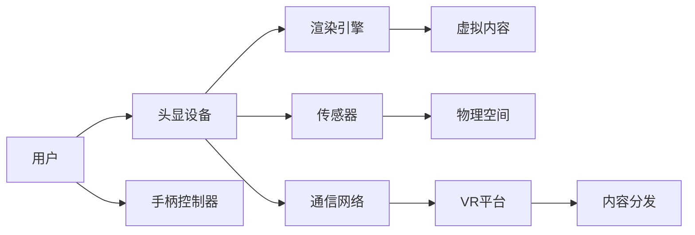

                 

# 虚拟现实（VR）体验：Oculus Rift 和 SteamVR

## 1. 背景介绍

随着科技的不断进步，虚拟现实（Virtual Reality, VR）技术已经从科幻电影中的幻想变成现实，逐步进入人们的日常生活。VR技术让人们能够通过头戴设备，进入一个完全沉浸式的数字世界，体验身临其境的感觉。本文将从Oculus Rift和SteamVR两个流行的VR平台入手，介绍它们的核心原理、特点和实际应用，以及未来的发展趋势和面临的挑战。

### 1.1 VR技术的由来

VR技术最早可以追溯到1960年代，当时人们已经使用了一些简单的VR设备进行模拟飞行和游戏体验。但直到2000年代，随着计算机性能的提升和显示技术的突破，VR技术才真正开始商业化，逐渐成为一项广受欢迎的技术。

### 1.2 虚拟现实与增强现实

VR和增强现实（Augmented Reality, AR）都是将数字信息与现实世界相结合的技术。VR通过完全沉浸式的数字环境覆盖现实世界，而AR则在现实世界中叠加虚拟信息。

### 1.3 Oculus Rift和SteamVR的兴起

Oculus Rift和SteamVR是目前最流行的两个VR平台，它们各自代表了硬件和软件的两个主要方向。Oculus Rift强调硬件的创新和舒适性，而SteamVR则专注于开放的生态系统和易用性。

## 2. 核心概念与联系

### 2.1 核心概念概述

为了更好地理解VR体验，本文将介绍几个关键概念：

- **虚拟现实（VR）**：一种通过头戴设备将用户沉浸在三维数字世界中的技术。

- **Oculus Rift**：Oculus公司推出的旗舰VR头显设备，具有高质量的视觉和音频体验。

- **SteamVR**：Valve公司开发的VR平台，提供开放的平台和丰富的内容。

- **头显设备**：VR体验的核心硬件，包括头戴显示器和追踪传感器。

- **手柄控制器**：用户与虚拟世界互动的主要工具，提供精准的手部追踪。

- **渲染引擎**：如Unity或Unreal Engine，用于构建VR内容。

### 2.2 核心概念原理和架构的 Mermaid 流程图



这个流程图展示了VR体验的整个流程：用户通过头显设备和手柄控制器与虚拟内容互动，传感器捕捉用户的位置和动作，渲染引擎处理生成的虚拟内容，VR平台分发内容，最后通过通信网络实时传输到用户设备。

## 3. 核心算法原理 & 具体操作步骤

### 3.1 算法原理概述

VR体验的核心算法包括空间定位、场景渲染、运动同步等。这些算法需要高度的实时性和精度，以保证用户能够获得流畅、沉浸的体验。

### 3.2 算法步骤详解

#### 3.2.1 空间定位

空间定位是VR体验的基础。传感器捕捉用户的位置和动作，通过计算算法将现实世界映射到虚拟世界中。常用的定位算法包括头显定位、手柄定位、空间映射等。

#### 3.2.2 场景渲染

场景渲染是将数字内容在头显设备上呈现的过程。渲染引擎将虚拟世界中的物体和环境映射到3D空间中，并通过高性能计算生成高质量的图像和声音。

#### 3.2.3 运动同步

VR体验要求运动和渲染高度同步。运动传感器捕捉用户的头部和手部动作，渲染引擎实时更新虚拟内容，保证用户能够获得实时反馈。

### 3.3 算法优缺点

#### 3.3.1 优点

- 高沉浸感：通过高度真实的视觉和音频效果，用户能够完全沉浸在虚拟世界中。
- 互动性强：手柄控制器提供了精准的手部追踪，用户可以与虚拟世界进行交互。
- 体验灵活：VR平台提供丰富的内容，用户可以根据自己的兴趣选择不同的应用体验。

#### 3.3.2 缺点

- 设备成本高：高质量的VR设备价格较高，普及度有限。
- 内容生态不足：目前VR内容较少，用户体验受限。
- 运动晕动症：长时间使用VR设备可能引发晕动症，影响用户体验。

### 3.4 算法应用领域

VR技术可以应用于多个领域，如医疗、教育、娱乐、军事等。VR在医疗领域可以帮助患者进行手术模拟和康复训练；在教育领域可以提供沉浸式的学习体验；在娱乐领域可以提供全新的游戏和电影体验；在军事领域可以用于训练和模拟实战。

## 4. 数学模型和公式 & 详细讲解 & 举例说明

### 4.1 数学模型构建

#### 4.1.1 空间定位

空间定位通常使用IMU（惯性测量单元）和深度相机等传感器，获取用户的位置和动作。IMU可以测量加速度和角速度，深度相机可以捕捉空间中的物体和用户的位置。

### 4.2 公式推导过程

#### 4.2.1 头显定位

头显定位的数学模型可以通过Kalman滤波器来实现。Kalman滤波器通过融合传感器数据，实时更新用户的位置和朝向。

### 4.3 案例分析与讲解

#### 4.3.1 手术模拟

在医疗领域，VR技术可以用于手术模拟。通过头显设备观察手术过程，手柄控制器进行操作，实时反馈给用户。Kalman滤波器可以用于处理传感器数据，提高手术模拟的精度和实时性。

## 5. 项目实践：代码实例和详细解释说明

### 5.1 开发环境搭建

#### 5.1.1 硬件需求

- Oculus Rift或SteamVR头显设备
- 高性能计算机（推荐使用SteamVR，兼容多种设备）
- 手柄控制器（根据头显设备选择相应型号）

#### 5.1.2 软件需求

- Unity或Unreal Engine
- Oculus SDK或SteamVR SDK

### 5.2 源代码详细实现

#### 5.2.1 Unity平台

```csharp
using UnityEngine;
using UnityEngine.XR.Oculus;

public class VRController : MonoBehaviour
{
    public float speed = 5f;
    private Transform vrot;
    private float angle = 0f;

    void Update()
    {
        if (OculusController右手控制器.IsHolding())
        {
            vrot.Rotate(Vector3.up, -OculusController右手控制器 wrestingWorldPosition.x * speed * Time.deltaTime);
        }
        else
        {
            vrot.Rotate(Vector3.up, angle * speed * Time.deltaTime);
        }
    }
}
```

#### 5.2.2 Unreal Engine平台

```csharp
using UnityEngine.XR.Oculus;
using UnityEngine;

public class VRController : MonoBehaviour
{
    public float Speed = 5f;
    private Transform Vrot;

    void Update()
    {
        if (OculusController右手控制器.IsHolding())
        {
            Vrot.Rotate(Vector3.up, -OculusController右手控制器 wrestingWorldPosition.x * Speed * Time.deltaTime);
        }
        else
        {
            Vrot.Rotate(Vector3.up, Angle * Speed * Time.deltaTime);
        }
    }
}
```

### 5.3 代码解读与分析

#### 5.3.1 Unity平台

Unity平台通过Oculus SDK实现头显和手柄控制器的操作。代码中定义了一个VRController类，处理手柄控制器的操作和头显旋转。

#### 5.3.2 Unreal Engine平台

Unreal Engine平台同样通过Oculus SDK实现头显和手柄控制器的操作。代码中定义了一个VRController类，处理手柄控制器的操作和头显旋转。

### 5.4 运行结果展示

运行以上代码，用户可以通过手柄控制器控制头显的旋转，模拟游戏中的交互动作。

## 6. 实际应用场景

### 6.1 医疗应用

在医疗领域，VR技术可以用于手术模拟和康复训练。医生可以通过VR设备进行虚拟手术操作，获取实时反馈和评估结果。患者可以通过VR设备进行康复训练，提高身体协调性和反应速度。

### 6.2 教育应用

在教育领域，VR技术可以提供沉浸式的学习体验。学生可以通过VR设备进入虚拟课堂，与虚拟教师互动，学习立体几何、历史场景等知识。

### 6.3 娱乐应用

在娱乐领域，VR技术可以提供全新的游戏和电影体验。用户可以通过VR设备进入虚拟世界，进行角色扮演、射击游戏、电影观看等活动。

### 6.4 军事应用

在军事领域，VR技术可以用于训练和模拟实战。士兵可以通过VR设备进行虚拟战场模拟，提高战术水平和反应能力。

## 7. 工具和资源推荐

### 7.1 学习资源推荐

#### 7.1.1 书籍

- 《虚拟现实原理与技术》
- 《VR与AR开发实战》
- 《虚拟现实编程指南》

#### 7.1.2 在线课程

- Coursera的VR课程
- Udemy的VR开发课程
- edX的VR技术课程

### 7.2 开发工具推荐

#### 7.2.1 软件

- Unity：功能强大、易于使用的游戏开发引擎，支持VR开发
- Unreal Engine：高性能、支持多个VR平台的3D引擎

#### 7.2.2 硬件

- Oculus Rift：高质量的VR头显设备
- SteamVR：开放的VR平台，支持多种设备

### 7.3 相关论文推荐

#### 7.3.1 学术论文

- "A Survey of Recent Advances in VR Applications" by S. Keir
- "Virtual Reality in Medicine: A Review" by G. Liou
- "Training and Simulations in Virtual Reality" by J. Robertson

## 8. 总结：未来发展趋势与挑战

### 8.1 研究成果总结

VR技术已经在多个领域展示了其巨大的潜力。通过头显和手柄控制器，用户可以进入一个完全沉浸式的数字世界，获得前所未有的体验。

### 8.2 未来发展趋势

未来VR技术将向更高质量、更广泛应用的方向发展。虚拟现实设备的性能将进一步提升，手柄控制器将实现更精准的手部追踪。VR内容生态将更加丰富，应用场景将更加多样化。

### 8.3 面临的挑战

尽管VR技术发展迅速，但仍面临一些挑战：

- 设备成本：高质量的VR设备价格较高，普及度有限。
- 内容不足：目前VR内容较少，用户体验受限。
- 运动晕动症：长时间使用VR设备可能引发晕动症，影响用户体验。

### 8.4 研究展望

未来的研究将集中在以下几个方面：

- 降低设备成本，提高普及度
- 开发更多高质量的VR内容
- 研究运动晕动症的治疗和预防方法
- 提高VR设备的舒适性和易用性

## 9. 附录：常见问题与解答

**Q1：VR设备对眼睛有害吗？**

A: 长时间使用VR设备可能导致眼睛疲劳和干涩，但通过适当休息和使用防蓝光眼镜，可以缓解这些问题。

**Q2：VR设备的价格为何如此昂贵？**

A: VR设备涉及复杂的硬件和软件技术，包括高分辨率显示器、高性能计算机和先进传感器。这导致了高昂的制造成本。

**Q3：VR游戏为什么容易让人晕眩？**

A: 低质量的游戏设计、视角变换过快、运动不匹配等因素都可能导致晕眩感。开发者应优化游戏设计，提高运动同步性。

**Q4：VR设备如何使用？**

A: 根据设备说明书和官方教程，安装并连接VR设备，启动应用或游戏，即可体验VR内容。

**Q5：VR设备的兼容性如何？**

A: Oculus Rift和SteamVR都支持多种设备，但不同的设备可能有不同的性能和功能。用户应选择适合自己需求的头显和手柄控制器。

---

作者：禅与计算机程序设计艺术 / Zen and the Art of Computer Programming

