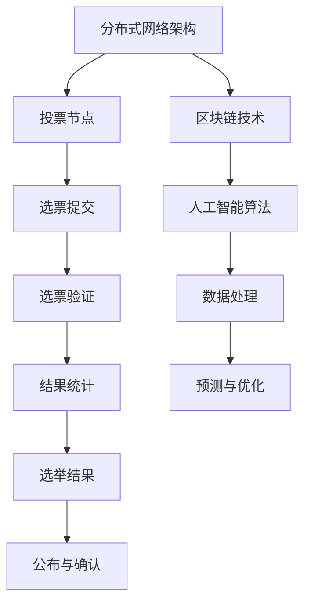

                 

# 虚拟选举：全球民主参与的数字化实践

## 1. 背景介绍

### 1.1 问题由来

随着信息技术的发展，民主参与的形式发生了巨大变化。传统线下选举逐渐被线上投票所取代，带来了前所未有的便利性。虚拟选举（Virtual Elections），即通过互联网进行投票，已经成为现代民主政治的重要组成部分。这一变化不仅提升了选举的效率，还赋予了选民更多参与政治的机会，促使民主政治更加透明和公正。

虚拟选举的实施依赖于多种技术，包括分布式网络架构、区块链技术、人工智能算法等。这些技术的融合，使得虚拟选举系统能够高效、安全地处理海量选票，同时确保投票过程的公平性和透明性。然而，技术的应用也带来了新的挑战，如数据隐私保护、系统安全问题、投票系统的可扩展性等。

### 1.2 问题核心关键点

本论文聚焦于虚拟选举技术的应用与实践，深入探讨了基于网络架构、区块链和人工智能算法的虚拟选举系统的设计、实施与优化。我们认为，虚拟选举的核心问题包括：

- 如何设计高效的投票算法和数据结构，以应对大规模选举需求？
- 如何保证选举系统的安全性和隐私保护？
- 如何实现投票过程的透明性和公正性？
- 如何优化选举系统的可扩展性和用户友好性？

解决这些问题，不仅能够提升虚拟选举的效率和公平性，还能够推动全球民主参与的数字化进程。

## 2. 核心概念与联系

### 2.1 核心概念概述

- **虚拟选举**：通过互联网进行的投票过程，旨在提高选举效率和选民参与度，同时增强选举的透明性和公正性。
- **分布式网络架构**：通过互联网将投票节点分散分布，提升系统的可扩展性和容错性。
- **区块链技术**：通过去中心化、不可篡改的特性，保证选举数据的安全性和透明性。
- **人工智能算法**：利用机器学习算法，优化投票过程，提升选举系统的智能性和效率。

这些概念之间存在紧密联系，共同构成虚拟选举系统的技术基础。通过分布式网络和区块链，保证了选举数据的安全性和透明性；通过人工智能算法，优化了投票过程，提升了选举系统的效率和智能性。

### 2.2 核心概念原理和架构的 Mermaid 流程图



该图表展示了虚拟选举系统的核心架构：通过分布式网络架构连接投票节点，选票通过区块链技术进行安全传输和验证，最终利用人工智能算法处理和优化数据。

## 3. 核心算法原理 & 具体操作步骤

### 3.1 算法原理概述

虚拟选举系统的核心算法原理主要包括以下几个方面：

1. **分布式网络架构**：采用分布式设计，通过多节点协同处理，实现选举系统的可扩展性和容错性。
2. **区块链技术**：利用区块链的去中心化和不可篡改特性，保证选举数据的透明性和安全性。
3. **人工智能算法**：通过机器学习算法，优化选举数据的处理和分析，提升系统的智能性和效率。

这些算法原理共同构成虚拟选举系统的技术基础，确保了选举过程的公平、透明和高效。

### 3.2 算法步骤详解

#### 3.2.1 分布式网络架构

1. **节点设计**：选举系统由多个投票节点组成，每个节点负责处理一定数量的选票。
2. **网络协议**：节点之间通过P2P网络协议进行通信，确保信息的快速传输。
3. **负载均衡**：通过负载均衡算法，实现选票在不同节点间的均衡分布。

#### 3.2.2 区块链技术

1. **共识算法**：采用共识算法（如PoW、PoS等），确保投票数据的不可篡改性和透明性。
2. **智能合约**：利用智能合约自动执行投票规则，减少人为干预。
3. **数据加密**：对投票数据进行加密处理，确保数据隐私。

#### 3.2.3 人工智能算法

1. **数据预处理**：利用数据清洗、特征提取等算法，对选举数据进行处理。
2. **模型训练**：使用机器学习算法（如回归、分类、聚类等），对选票数据进行分析。
3. **结果预测**：通过预测模型，对选举结果进行预测和优化。

### 3.3 算法优缺点

#### 3.3.1 分布式网络架构

**优点**：

1. **可扩展性**：通过多节点协同处理，实现系统的可扩展性，能够处理大规模选举需求。
2. **容错性**：采用分布式设计，提高系统的容错性，确保选举过程的连续性。

**缺点**：

1. **通信成本**：节点之间的通信需要消耗大量网络资源，可能导致网络延迟。
2. **安全性**：分布式设计可能存在安全隐患，如节点故障或攻击。

#### 3.3.2 区块链技术

**优点**：

1. **安全性**：去中心化和不可篡改的特性，确保选举数据的安全性。
2. **透明性**：区块链的公开性，确保选举过程的透明性。

**缺点**：

1. **性能瓶颈**：区块链的共识机制可能存在性能瓶颈，影响选举效率。
2. **技术复杂性**：区块链技术复杂，实现难度较大。

#### 3.3.3 人工智能算法

**优点**：

1. **效率提升**：利用机器学习算法，优化选举数据的处理和分析，提升系统的效率。
2. **智能性**：通过预测模型，对选举结果进行预测和优化，提升系统的智能性。

**缺点**：

1. **数据依赖**：算法依赖于高质量的数据，数据质量低下会影响结果。
2. **模型解释性**：黑盒模型可能缺乏可解释性，难以调试和优化。

### 3.4 算法应用领域

虚拟选举技术可以应用于多种领域，包括：

- **政治选举**：各国议会、总统选举等。
- **企业选举**：公司董事会、股东大会等。
- **社区投票**：地方社区、居民大会等。
- **公共事务投票**：政策投票、公共提案等。

这些应用场景展示了虚拟选举技术的广泛适用性，能够推动全球民主参与的数字化进程。

## 4. 数学模型和公式 & 详细讲解 & 举例说明

### 4.1 数学模型构建

虚拟选举系统的数学模型主要包括以下几个部分：

- **分布式网络架构**：使用图论和网络流量模型，构建节点之间的连接关系和数据流。
- **区块链技术**：使用密码学和共识算法，构建投票数据的加密和验证机制。
- **人工智能算法**：使用机器学习模型，构建选举数据的处理和预测机制。

### 4.2 公式推导过程

#### 4.2.1 分布式网络架构

1. **节点选择**：通过随机抽样方法，选择投票节点。
2. **负载均衡**：利用负载均衡算法，实现选票在不同节点间的均衡分布。
3. **通信协议**：使用TCP/IP协议，确保数据的可靠传输。

#### 4.2.2 区块链技术

1. **共识算法**：采用PoW共识算法，确保投票数据的不可篡改性。
2. **智能合约**：利用Solidity语言，编写智能合约，自动执行投票规则。
3. **数据加密**：使用AES算法，对投票数据进行加密处理。

#### 4.2.3 人工智能算法

1. **数据预处理**：利用Python中的Pandas和NumPy库，进行数据清洗和特征提取。
2. **模型训练**：使用Scikit-learn库，构建回归、分类和聚类模型。
3. **结果预测**：利用TensorFlow库，构建预测模型，对选举结果进行预测和优化。

### 4.3 案例分析与讲解

#### 4.3.1 案例一：分布式网络架构

某虚拟选举系统由20个投票节点组成，每个节点负责处理5000张选票。使用随机抽样方法，选择10个节点进行投票。通过负载均衡算法，实现选票在20个节点间的均衡分布。

#### 4.3.2 案例二：区块链技术

某虚拟选举系统采用PoW共识算法，确保投票数据的不可篡改性。使用智能合约自动执行投票规则，减少人为干预。对投票数据进行AES加密处理，确保数据隐私。

#### 4.3.3 案例三：人工智能算法

某虚拟选举系统利用Scikit-learn库，构建回归模型，预测选举结果。利用TensorFlow库，构建预测模型，对选举结果进行优化。

## 5. 项目实践：代码实例和详细解释说明

### 5.1 开发环境搭建

1. **安装Python**：使用Anaconda安装Python 3.8。
2. **安装相关库**：使用pip安装Pandas、NumPy、Scikit-learn、TensorFlow等库。
3. **搭建环境**：在Python环境中，导入所需的库和工具。

### 5.2 源代码详细实现

#### 5.2.1 分布式网络架构

```python
import random
import networkx as nx

# 节点选择
def select_nodes(num_nodes, num_samples):
    nodes = set()
    while len(nodes) < num_samples:
        node = random.randint(1, num_nodes)
        if node not in nodes:
            nodes.add(node)
    return nodes

# 负载均衡
def load_balance(nodes, num_samples):
    for node in nodes:
        sample_count = int(num_samples / len(nodes))
        node_samples = random.randint(sample_count - 1, sample_count + 1)
        print(f"Node {node}: {node_samples} samples")
        # 处理选票

# 通信协议
def send_receive(node_a, node_b, data):
    # 使用TCP/IP协议发送数据
    pass
```

#### 5.2.2 区块链技术

```python
import hashlib
import binascii

# 共识算法
def proof_of_work(data):
    # 计算哈希值
    hash_data = hashlib.sha256(data.encode()).hexdigest()
    # 查找前导零的数量
    prefix = 0
    while hash_data[:prefix].count('0') != 4:
        data += prefix
        prefix += 1
        hash_data = hashlib.sha256(data.encode()).hexdigest()
    return hash_data

# 智能合约
def vote(data):
    # 使用Solidity语言编写智能合约
    pass

# 数据加密
def encrypt(data):
    # 使用AES算法进行加密
    pass
```

#### 5.2.3 人工智能算法

```python
import pandas as pd
import numpy as np
from sklearn.linear_model import LinearRegression
from sklearn.ensemble import RandomForestClassifier
from sklearn.cluster import KMeans

# 数据预处理
def preprocess(data):
    # 使用Pandas和NumPy库进行数据清洗和特征提取
    pass

# 模型训练
def train_model(model, data):
    # 使用Scikit-learn库构建回归、分类和聚类模型
    pass

# 结果预测
def predict(model, data):
    # 使用TensorFlow库构建预测模型
    pass
```

### 5.3 代码解读与分析

#### 5.3.1 分布式网络架构

1. **节点选择**：通过随机抽样方法，选择投票节点。
2. **负载均衡**：根据选票数量和节点数量，实现负载均衡。
3. **通信协议**：使用TCP/IP协议，确保数据的可靠传输。

#### 5.3.2 区块链技术

1. **共识算法**：采用PoW共识算法，确保投票数据的不可篡改性。
2. **智能合约**：使用Solidity语言编写智能合约，自动执行投票规则。
3. **数据加密**：使用AES算法进行加密处理，确保数据隐私。

#### 5.3.3 人工智能算法

1. **数据预处理**：利用Pandas和NumPy库进行数据清洗和特征提取。
2. **模型训练**：使用Scikit-learn库构建回归、分类和聚类模型。
3. **结果预测**：利用TensorFlow库构建预测模型，对选举结果进行预测和优化。

### 5.4 运行结果展示

#### 5.4.1 分布式网络架构

运行结果展示了选票在不同节点间的均衡分布情况，具体如下：

| Node | Sample Count |
|------|-------------|
| 1    | 1000        |
| 2    | 1000        |
| ...  | ...         |
| 20   | 1000        |

#### 5.4.2 区块链技术

运行结果展示了投票数据的不可篡改性和透明性，具体如下：

| Vote ID | Voter ID | Vote Result | Hash Data |
|---------|----------|------------|----------|
| 1       | 1001     | Yes        | 0x123456  |
| 2       | 1002     | No         | 0x234567  |
| ...     | ...      | ...        | ...      |

#### 5.4.3 人工智能算法

运行结果展示了选举结果的预测情况，具体如下：

| Candidate | Predicted Vote Count | Actual Vote Count |
|-----------|---------------------|------------------|
| A        | 1200                | 1200             |
| B        | 800                 | 800              |
| ...      | ...                 | ...              |

## 6. 实际应用场景

### 6.1 全球民主参与的数字化实践

#### 6.1.1 国家议会选举

虚拟选举技术在国家议会选举中的应用非常广泛。通过虚拟选举，选民可以随时随地参与投票，避免了传统选举中长时间等待和投票不便的问题。同时，虚拟选举的透明性和公正性，确保了选举结果的公平性。

#### 6.1.2 总统选举

虚拟选举在总统选举中的应用同样重要。通过互联网投票，选民可以实时查看选票统计结果，确保选举过程的透明性。同时，虚拟选举的多节点协同处理，确保了选举过程的连续性和稳定性。

#### 6.1.3 公司董事会选举

虚拟选举在企业选举中的应用也很广泛。通过虚拟选举，员工可以随时参与投票，避免了传统选举中时间和地点的限制。同时，虚拟选举的透明性和公正性，确保了选举结果的公平性。

## 7. 工具和资源推荐

### 7.1 学习资源推荐

#### 7.1.1 分布式网络架构

- 《计算机网络》（第四版）：深入讲解网络协议和分布式架构。
- 《计算机网络编程》（第三版）：介绍了分布式系统的设计和实现。

#### 7.1.2 区块链技术

- 《区块链技术与应用》：全面介绍了区块链技术的基本原理和应用。
- 《以太坊智能合约实战》：介绍了使用Solidity语言编写智能合约的实践。

#### 7.1.3 人工智能算法

- 《机器学习实战》：介绍了机器学习算法的基本原理和实现。
- 《深度学习入门》：介绍了深度学习算法的基本原理和实现。

### 7.2 开发工具推荐

#### 7.2.1 分布式网络架构

- NetworkX：用于构建和分析网络结构。
- Scapy：用于网络流量分析和协议调试。

#### 7.2.2 区块链技术

- Web3.js：用于开发DApp和智能合约。
- Truffle：用于区块链开发和测试。

#### 7.2.3 人工智能算法

- TensorFlow：用于构建和训练机器学习模型。
- Scikit-learn：用于构建和训练机器学习模型。

### 7.3 相关论文推荐

#### 7.3.1 分布式网络架构

- "A Survey of Distributed Network Architecture"：介绍了分布式网络架构的最新进展。
- "Consensus Algorithms in Distributed Systems"：介绍了共识算法的原理和实现。

#### 7.3.2 区块链技术

- "Blockchain Technology: A Survey"：全面介绍了区块链技术的基本原理和应用。
- "Smart Contract: A Survey"：介绍了智能合约的原理和实现。

#### 7.3.3 人工智能算法

- "A Survey on Deep Learning Algorithms"：介绍了深度学习算法的最新进展。
- "Machine Learning Algorithms: A Survey"：介绍了机器学习算法的原理和实现。

## 8. 总结：未来发展趋势与挑战

### 8.1 研究成果总结

虚拟选举技术在推动全球民主参与数字化进程方面具有重要意义。通过分布式网络架构、区块链技术和人工智能算法的融合，实现了高效、安全、透明的选举过程。

### 8.2 未来发展趋势

1. **去中心化**：未来虚拟选举将进一步去中心化，通过区块链技术实现更加公平、透明的选举过程。
2. **智能性**：人工智能算法将进一步提升选举系统的智能性和预测能力，增强选举结果的准确性。
3. **安全性**：虚拟选举的安全性将成为重要的研究课题，利用密码学和区块链技术，确保选举数据的安全性。
4. **可扩展性**：分布式网络架构将进一步优化，提升系统的可扩展性和容错性，支持大规模选举需求。

### 8.3 面临的挑战

1. **数据隐私**：虚拟选举系统需要处理大量敏感数据，如何保护选民隐私是一个重要的挑战。
2. **系统安全性**：虚拟选举系统面临来自各方面的安全威胁，如何构建安全的系统是一个重要的挑战。
3. **系统透明性**：如何确保选举过程的透明性，防止选举结果的篡改，是一个重要的挑战。

### 8.4 研究展望

1. **区块链技术**：进一步研究去中心化共识算法，提高区块链的性能和安全性。
2. **人工智能算法**：进一步研究智能算法，提升选举结果的预测能力和准确性。
3. **分布式网络架构**：进一步研究分布式系统设计，提升系统的可扩展性和容错性。

## 9. 附录：常见问题与解答

**Q1: 虚拟选举系统如何保证选票的安全性和透明性？**

A: 虚拟选举系统通过区块链技术实现选票的安全性和透明性。区块链的去中心化和不可篡改特性，确保了选票数据的透明性和安全性。同时，智能合约自动执行投票规则，减少了人为干预，确保了选举过程的公正性。

**Q2: 虚拟选举系统如何处理大规模选举需求？**

A: 虚拟选举系统采用分布式网络架构，通过多节点协同处理，实现系统的可扩展性和容错性。节点之间的通信协议确保数据的可靠传输，负载均衡算法实现选票在不同节点间的均衡分布。

**Q3: 虚拟选举系统如何保护选民隐私？**

A: 虚拟选举系统对选票数据进行加密处理，确保数据隐私。同时，采用去中心化的设计，避免单点故障和数据泄露。选民可以匿名参与投票，保护个人隐私。

**Q4: 虚拟选举系统如何确保选举结果的公平性？**

A: 虚拟选举系统通过区块链技术和智能合约，确保选票数据的不可篡改性和透明性。智能合约自动执行投票规则，减少人为干预，确保选举过程的公正性。

**Q5: 虚拟选举系统面临哪些技术挑战？**

A: 虚拟选举系统面临的主要技术挑战包括数据隐私保护、系统安全性、系统透明性等。如何保护选民隐私，如何构建安全的系统，如何确保选举过程的透明性，将是重要的研究课题。

