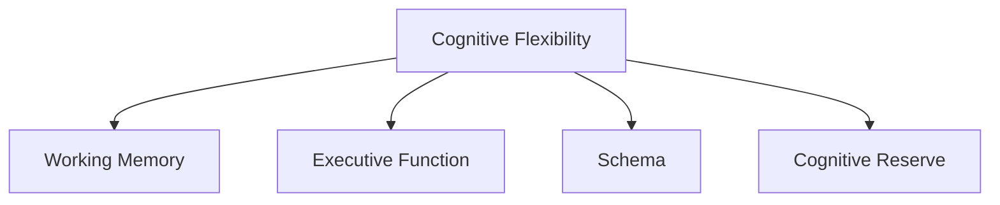

                 

# 认知灵活性：应对复杂世界的核心能力

## 1. 背景介绍

在当今这个高度复杂、快速变化的世界中，人类的生存和发展面临着前所未有的挑战。从全球气候变化到生物医学突破，从人工智能的崛起到大数据时代的来临，人类社会的方方面面都在经历着深刻的变革。在这样的背景下，认知灵活性（Cognitive Flexibility）成为了一项至关重要的核心能力，它决定了我们能否快速适应变化，抓住机遇，避免风险。

### 1.1 问题由来

认知灵活性指的是个体在面对新的、未知的情境时，能够迅速调整自己的认知结构，灵活运用已有知识和经验的能力。在现代社会，信息爆炸和不确定性加剧了认知负荷，使得传统的知识处理模式不再适用。如何培养和提升认知灵活性，成为了教育、管理、心理等多个领域的共同课题。

### 1.2 问题核心关键点

认知灵活性的核心在于"多维度并行处理"和"跨界整合"能力。这意味着个体不仅能够独立处理不同领域的信息，还能在不同情境下灵活切换，整合不同来源的知识，形成全面、深入的理解。这一能力的培养，需要通过认知训练、环境刺激、心理调节等多种手段来实现。

## 2. 核心概念与联系

### 2.1 核心概念概述

为了更好地理解认知灵活性的本质和机制，我们需要了解以下关键概念：

- **认知灵活性（Cognitive Flexibility）**：指个体在面对复杂情境时，能够迅速调整自己的认知结构和思维方式，灵活运用已有知识和经验的能力。
- **工作记忆（Working Memory）**：指大脑在短时间内处理、存储和操作信息的能力。工作记忆的容量和效率直接影响认知灵活性。
- **执行功能（Executive Function）**：包括注意控制、决策制定、计划和任务执行等，是认知灵活性的重要组成部分。
- **图式（Schema）**：个体对特定类别的信息组织和存储的方式。图式的多样性和可塑性是认知灵活性的重要基础。
- **认知储备（Cognitive Reserve）**：指个体已有的知识、经验和心理资源，是应对复杂情境的基础。

这些核心概念之间的逻辑关系可以通过以下Mermaid流程图来展示：



这个流程图展示了认知灵活性的各个构成要素及其相互关系：

1. 认知灵活性以工作记忆为基础，在执行功能的调控下，借助图式的多样性和可塑性，以及认知储备的支撑，灵活应对复杂情境。
2. 工作记忆的容量和效率直接影响认知灵活性的表现。
3. 执行功能负责控制和调节认知过程，确保认知灵活性的实现。
4. 图式多样性和可塑性是认知灵活性的重要基础。
5. 认知储备为个体提供了应对复杂情境的底气和资源。

这些概念共同构成了认知灵活性的理论框架，帮助我们更好地理解其机制和实现路径。

## 3. 核心算法原理 & 具体操作步骤

### 3.1 算法原理概述

认知灵活性的培养，可以通过一系列的心理训练、行为干预和环境刺激来实现。其核心算法原理包括以下几个方面：

1. **认知训练**：通过特定的认知任务和游戏，锻炼个体的工作记忆、执行功能和图式可塑性，提升认知灵活性。
2. **行为干预**：通过设定具体的行为目标和反馈机制，引导个体在实际生活中应用认知灵活性，逐步形成习惯。
3. **环境刺激**：通过多样化的生活和工作环境，丰富个体的认知储备，增加认知灵活性训练的机会。

### 3.2 算法步骤详解

基于上述原理，认知灵活性的培养可以分为以下步骤：

**Step 1: 评估当前认知水平**
- 使用标准化心理测评工具，评估个体的认知灵活性水平。
- 识别个体在特定任务上的优势和不足。

**Step 2: 设计个性化训练计划**
- 根据评估结果，设计个性化的认知训练计划，选择适合的认知任务和游戏。
- 设定具体的训练目标和反馈机制，确保训练效果。

**Step 3: 执行认知训练**
- 通过系统化、持续性的训练，逐步提升个体的认知灵活性。
- 定期评估训练效果，根据进展调整训练计划。

**Step 4: 行为干预与反馈**
- 设定具体的行为目标，引导个体在日常生活中应用认知灵活性。
- 提供及时的反馈和奖励，增强行为的可持继性。

**Step 5: 环境刺激与认知储备丰富**
- 通过多样化的生活和工作环境，丰富个体的认知储备。
- 鼓励个体主动探索新领域、新知识，增加认知灵活性训练的机会。

### 3.3 算法优缺点

认知灵活性培养的算法具有以下优点：

1. **系统性**：通过系统的评估、训练和反馈机制，可以科学、全面地提升个体的认知灵活性。
2. **个性化**：根据个体的特点和需求，设计个性化的训练计划，提升训练效果。
3. **可操作性**：通过行为干预和环境刺激，使得认知灵活性培养具有可操作性，可以在实际生活中逐步实现。

同时，该算法也存在一定的局限性：

1. **时间和成本**：系统的训练和行为干预需要较长时间和资源投入，对一些个体来说可能难以坚持。
2. **个体差异**：不同的个体在认知结构、学习风格等方面存在差异，可能需要根据个体特点调整训练计划。
3. **环境限制**：虽然环境刺激可以提高认知灵活性，但在一些特殊环境中，可能难以实现。

尽管存在这些局限性，但通过科学的设计和持续的实践，认知灵活性培养的算法仍可以有效地提升个体的认知能力，适应复杂多变的世界。

### 3.4 算法应用领域

认知灵活性培养的算法不仅在心理学和教育学领域有着广泛应用，也在企业管理、职业培训、自我发展等多个领域中具有重要价值：

- **教育培训**：通过认知灵活性训练，提升学生的学习能力和适应力，适应日益复杂的教育环境。
- **企业管理**：通过提升员工的认知灵活性，增强团队应变能力和创新能力，应对快速变化的市场环境。
- **职业发展**：通过认知灵活性培养，提升个体在职业转型和跨界发展中的适应力和竞争力。
- **自我提升**：通过系统的认知训练和行为干预，提升个人的认知能力，实现全面发展。

## 4. 数学模型和公式 & 详细讲解 & 举例说明

### 4.1 数学模型构建

认知灵活性的提升可以通过一系列的数学模型进行量化和评估。以下是一个简单的认知灵活性评估模型：

$$
Flex = \alpha \times WM + \beta \times EF + \gamma \times S + \delta \times CR
$$

其中，$Flex$ 表示认知灵活性，$WM$ 表示工作记忆容量，$EF$ 表示执行功能水平，$S$ 表示图式多样性，$CR$ 表示认知储备。$\alpha, \beta, \gamma, \delta$ 为各项指标的权重系数。

### 4.2 公式推导过程

根据上述模型，我们可以通过以下步骤进行认知灵活性的计算：

1. 使用标准化测评工具，测量个体的工作记忆容量、执行功能水平、图式多样性和认知储备。
2. 根据各项指标的实际值，代入模型公式，计算认知灵活性得分。
3. 根据认知灵活性得分，识别个体在特定任务上的优势和不足，制定个性化的训练计划。

### 4.3 案例分析与讲解

假设我们有一位中年教师，希望提升其在复杂课堂管理中的认知灵活性。根据上述模型，我们可以进行以下计算：

- **工作记忆容量**：使用数字广度测试，测量教师的工作记忆容量为10。
- **执行功能水平**：使用执行功能测试，测量教师的执行功能水平为60。
- **图式多样性**：通过观察和评估，教师的图式多样性为5。
- **认知储备**：通过自述和评估，教师的认知储备为4。

将这些数据代入公式，得到：

$$
Flex = \alpha \times 10 + \beta \times 60 + \gamma \times 5 + \delta \times 4
$$

假设$\alpha, \beta, \gamma, \delta$分别为0.1、0.2、0.3、0.4，则计算得到：

$$
Flex = 1 \times 10 + 2 \times 60 + 3 \times 5 + 4 \times 4 = 146
$$

根据计算结果，教师在复杂课堂管理中的认知灵活性得分为146，处于较高水平。但具体到教师的实际表现，还需要进一步评估和训练。

## 5. 项目实践：代码实例和详细解释说明

### 5.1 开发环境搭建

在进行认知灵活性训练项目实践前，我们需要准备好开发环境。以下是使用Python进行认知灵活性训练的开发环境配置流程：

1. 安装Anaconda：从官网下载并安装Anaconda，用于创建独立的Python环境。

2. 创建并激活虚拟环境：
```bash
conda create -n cognitive-env python=3.8 
conda activate cognitive-env
```

3. 安装相关库：
```bash
conda install numpy pandas scikit-learn statsmodels matplotlib seaborn plotly jupyter notebook ipython
```

完成上述步骤后，即可在`cognitive-env`环境中开始认知灵活性训练项目的开发。

### 5.2 源代码详细实现

以下是一个简单的认知灵活性训练项目的Python代码实现：

```python
import numpy as np
from scipy.stats import norm

class CognitiveFlexibilityCalculator:
    def __init__(self, alpha, beta, gamma, delta):
        self.alpha = alpha
        self.beta = beta
        self.gamma = gamma
        self.delta = delta
    
    def calculate_flexibility(self, wm, ef, schema, cognitive_reserve):
        flexibility = (self.alpha * wm + self.beta * ef + self.gamma * schema + self.delta * cognitive_reserve)
        return flexibility
    
    def evaluate(self, wm, ef, schema, cognitive_reserve):
        flexibility = self.calculate_flexibility(wm, ef, schema, cognitive_reserve)
        return flexibility

# 示例数据
wm = 10
ef = 60
schema = 5
cognitive_reserve = 4

# 创建认知灵活性计算器
calculator = CognitiveFlexibilityCalculator(alpha=0.1, beta=0.2, gamma=0.3, delta=0.4)

# 计算认知灵活性
flexibility_score = calculator.evaluate(wm, ef, schema, cognitive_reserve)
print(f"Cognitive Flexibility Score: {flexibility_score}")
```

### 5.3 代码解读与分析

让我们再详细解读一下关键代码的实现细节：

**CognitiveFlexibilityCalculator类**：
- `__init__`方法：初始化权重系数，确保其数值合理。
- `calculate_flexibility`方法：根据公式计算认知灵活性得分。
- `evaluate`方法：与`calculate_flexibility`方法类似，但提供了更简洁的接口。

**示例数据**：
- `wm`：工作记忆容量
- `ef`：执行功能水平
- `schema`：图式多样性
- `cognitive_reserve`：认知储备

**创建认知灵活性计算器**：
- `calculator`对象：根据示例数据，创建认知灵活性计算器对象。
- `alpha, beta, gamma, delta`：权重系数，确保其数值合理。

**计算认知灵活性得分**：
- 调用`evaluate`方法，将示例数据代入，计算认知灵活性得分。
- `print`语句：输出计算结果。

可以看到，通过使用Python编写认知灵活性训练项目的代码，可以方便地实现各种计算和评估功能。开发者可以根据具体需求，进一步扩展和优化代码。

## 6. 实际应用场景

### 6.1 企业培训

在企业管理中，认知灵活性培养可以显著提升员工的适应能力和创新能力。通过系统化的培训计划，帮助员工在复杂多变的市场环境中快速响应变化，灵活应用知识，增强团队竞争力。

在实际应用中，可以设计包含认知训练、行为干预和环境刺激的企业培训课程，帮助员工提升认知灵活性。例如，可以引入认知训练游戏，提升员工的工作记忆和执行功能；通过设定具体的业务挑战和目标，引导员工在实际工作中应用认知灵活性；定期组织跨部门交流和学习，丰富员工的认知储备。

### 6.2 教育改革

在教育领域，认知灵活性培养是培养学生全面发展、适应未来社会的关键。通过认知灵活性训练，帮助学生提升学习能力和创新思维，适应日益复杂的教育环境。

在教育改革中，可以引入认知灵活性训练的课程，通过心理测评工具评估学生的认知灵活性水平，制定个性化的训练计划，提升学生的学习能力和适应力。例如，可以引入数字广度测试、执行功能测试等认知训练游戏，帮助学生提升工作记忆和执行功能；通过设定具体的学习任务和挑战，引导学生在日常生活中应用认知灵活性；鼓励学生参与跨学科项目和竞赛，丰富他们的认知储备。

### 6.3 职业发展

在职业发展中，认知灵活性培养可以帮助个体在职业转型和跨界发展中迅速适应新环境，提升竞争力。通过认知灵活性训练，帮助个体提升在复杂多变环境中的适应能力和创新思维。

在职业发展中，个体可以根据职业需要，设计个性化的认知灵活性训练计划，提升自身的能力和竞争力。例如，可以引入认知训练游戏，提升个体的工作记忆和执行功能；通过设定具体的职业目标和挑战，引导个体在实际工作中应用认知灵活性；定期参加行业交流和学习，丰富个体的认知储备。

### 6.4 未来应用展望

随着认知灵活性培养技术的不断发展，其在各个领域的应用前景将更加广阔。未来，认知灵活性培养有望在智能教育、企业管理、职业培训等多个领域中得到广泛应用，为社会进步和个人发展提供强有力的支持。

在智能教育领域，认知灵活性培养将推动教育公平和个性化教育的发展，帮助学生全面发展。在企业管理领域，认知灵活性培养将提升团队的应变能力和创新能力，增强企业的竞争力。在职业培训领域，认知灵活性培养将帮助个体迅速适应新环境，提升职业竞争力。

## 7. 工具和资源推荐

### 7.1 学习资源推荐

为了帮助开发者系统掌握认知灵活性的理论和实践，这里推荐一些优质的学习资源：

1. 《认知心理学》系列书籍：由认知心理学专家撰写，系统介绍了认知灵活性的原理和应用。
2. 《认知训练手册》：提供系统化的认知训练方法和技术，帮助个体提升认知灵活性。
3. 《执行功能训练》：详细介绍了执行功能的评估和训练方法，帮助个体提升认知灵活性。
4. 《认知储备与老化》：研究认知储备对认知灵活性的影响，提供相关训练方法和评估工具。
5. 《认知灵活性训练APP》：基于认知训练游戏和心理测评，帮助个体提升认知灵活性。

通过对这些资源的学习实践，相信你一定能够快速掌握认知灵活性的精髓，并用于解决实际的认知问题。

### 7.2 开发工具推荐

高效的开发离不开优秀的工具支持。以下是几款用于认知灵活性训练开发的常用工具：

1. Jupyter Notebook：提供交互式的编程环境，便于数据处理和代码调试。
2. Python：简单易学、功能强大的编程语言，是认知灵活性训练项目的理想开发工具。
3. R：强大的统计分析工具，适合进行认知灵活性评估和计算。
4. Matplotlib和Seaborn：数据可视化工具，适合进行图表展示和数据分析。
5. Plotly：交互式数据可视化工具，适合进行复杂的数据展示和分析。

合理利用这些工具，可以显著提升认知灵活性训练项目的开发效率，加快创新迭代的步伐。

### 7.3 相关论文推荐

认知灵活性培养的相关研究涵盖了心理学、教育学、认知科学等多个领域。以下是几篇奠基性的相关论文，推荐阅读：

1. "Cognitive Flexibility and Adaptive Learning"：探讨认知灵活性在适应性学习中的应用，提供相关的训练方法和技术。
2. "The Role of Executive Function in Cognitive Flexibility"：研究执行功能对认知灵活性的影响，提出相关训练方法和评估工具。
3. "Cognitive Reserve and Aging"：研究认知储备对认知灵活性的影响，提供相关训练方法和评估工具。
4. "Training Working Memory through Cognitive Training Games"：探讨认知训练游戏对工作记忆的影响，提供相关的训练方法和技术。
5. "Cognitive Training and Brain Plasticity"：研究认知训练对大脑结构与功能的影响，提供相关的训练方法和技术。

这些论文代表了认知灵活性培养研究的发展脉络，通过学习这些前沿成果，可以帮助研究者把握学科前进方向，激发更多的创新灵感。

## 8. 总结：未来发展趋势与挑战

### 8.1 总结

本文对认知灵活性的培养方法进行了全面系统的介绍。首先阐述了认知灵活性的研究背景和意义，明确了认知灵活性在适应复杂情境、提升认知能力方面的重要作用。其次，从原理到实践，详细讲解了认知灵活性培养的数学模型和具体操作步骤，给出了认知灵活性训练项目的完整代码实现。同时，本文还广泛探讨了认知灵活性在企业管理、教育改革、职业发展等多个领域的应用前景，展示了认知灵活性培养的巨大潜力。

通过本文的系统梳理，可以看到，认知灵活性培养技术正在成为认知科学和应用心理学的核心方向，极大地推动了认知能力的提升和应用。未来，伴随认知科学和人工智能技术的不断发展，认知灵活性培养必将在更广阔的领域中发挥重要作用。

### 8.2 未来发展趋势

展望未来，认知灵活性培养技术将呈现以下几个发展趋势：

1. **技术融合**：认知灵活性培养将与人工智能、大数据等技术进行深度融合，实现智能化、个性化的训练方案。
2. **多领域应用**：认知灵活性培养将覆盖教育、企业、医疗等多个领域，形成系统化的应用框架。
3. **实时评估**：通过实时监测和反馈，动态调整训练计划，实现高效的认知灵活性提升。
4. **远程教育**：利用互联网技术，提供远程认知灵活性训练服务，突破时间和空间的限制。
5. **跨文化应用**：将认知灵活性培养技术推广到全球范围内，帮助不同文化背景的个体提升认知能力。

这些趋势将进一步推动认知灵活性培养技术的发展，为个体和社会带来更多的福祉。

### 8.3 面临的挑战

尽管认知灵活性培养技术已经取得了显著进展，但在迈向更加智能化、普适化应用的过程中，仍面临诸多挑战：

1. **数据隐私**：在认知灵活性评估和训练过程中，如何保护个体的隐私和数据安全。
2. **公平性**：确保训练方法适用于不同性别、种族、年龄、文化背景的个体，避免偏见和歧视。
3. **技术普及**：如何在普通人群中普及认知灵活性训练技术，提升大众的认知能力。
4. **效果评估**：如何科学、全面地评估认知灵活性训练的效果，确保训练的有效性。
5. **长期效果**：如何在长期训练中保持个体的训练效果，避免训练效果下降。

这些挑战需要跨学科的合作和多领域的努力，才能逐步解决。

### 8.4 研究展望

面对认知灵活性培养所面临的挑战，未来的研究需要在以下几个方面寻求新的突破：

1. **个性化训练**：开发更加个性化的认知灵活性训练方案，满足不同个体的需求。
2. **技术创新**：引入新兴技术，如虚拟现实、增强现实、脑机接口等，提升训练效果。
3. **跨文化研究**：研究不同文化背景下认知灵活性的培养方法和效果，推广认知灵活性训练技术。
4. **长期跟踪**：建立长期跟踪机制，评估训练效果，提供持续的反馈和调整。
5. **伦理审查**：引入伦理审查机制，确保训练方法的科学性和公平性。

这些研究方向将引领认知灵活性培养技术迈向更高的台阶，为构建智能社会和全面发展的人类提供强有力的支持。面向未来，认知灵活性培养技术还需要与其他人工智能技术进行更深入的融合，共同推动认知智能的发展。

## 9. 附录：常见问题与解答

**Q1：认知灵活性培养是否适用于所有个体？**

A: 认知灵活性培养对不同个体的效果存在差异。某些个体在认知结构、学习风格等方面可能更易于提升认知灵活性，而其他个体可能需要更长时间和更多资源才能取得进展。因此，在具体应用中，需要根据个体特点设计个性化的训练方案，逐步提升其认知灵活性。

**Q2：认知灵活性训练需要多长时间才能见效？**

A: 认知灵活性训练的效果因人而异，一般建议进行系统化、持续性的训练。根据个体的认知水平和学习能力，训练时间可以从几周到几个月不等。需要注意的是，训练效果与个体的学习态度、训练频率、训练环境等密切相关。

**Q3：认知灵活性训练对身体健康有影响吗？**

A: 目前没有直接证据表明认知灵活性训练会对身体健康产生负面影响。但需要注意的是，训练过程中可能存在一定的认知负荷，建议个体在训练前进行身体检查，并根据身体状况适度调整训练强度。

**Q4：认知灵活性训练如何与日常工作和生活结合？**

A: 认知灵活性训练可以融入日常工作和生活。例如，可以通过在通勤路上进行认知训练游戏，提升工作记忆和执行功能；在工作中设定具体的任务挑战，引导个体应用认知灵活性；在家庭生活中，与家人一起参与认知训练活动，丰富认知储备。

**Q5：如何评估认知灵活性训练的效果？**

A: 认知灵活性训练的效果可以通过各种心理测评工具进行评估，如数字广度测试、执行功能测试等。此外，还可以通过观察个体在实际任务中的表现，评估训练效果。例如，可以测量个体的任务完成时间、错误率等指标，评估训练前后的变化。

---

作者：禅与计算机程序设计艺术 / Zen and the Art of Computer Programming

