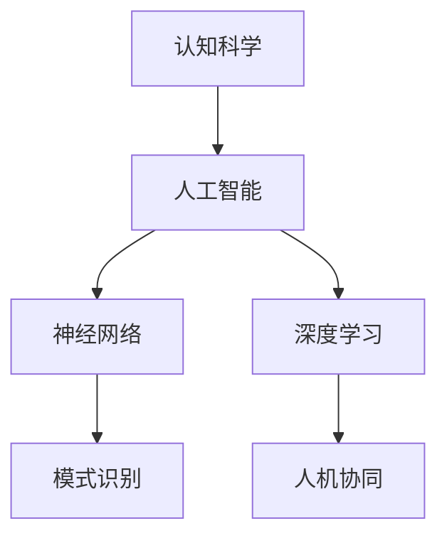

                 

# 认知科学与人工智能：模拟人类思维

> 关键词：认知科学,人工智能,神经网络,模式识别,深度学习,人机协同

## 1. 背景介绍

### 1.1 问题由来

近年来，人工智能(AI)技术的迅猛发展，特别是在深度学习和机器学习领域，已经达到了令人瞩目的成就。从图像识别、语音识别到自然语言处理、机器翻译，AI模型在各种任务上不断刷新着性能记录。然而，尽管AI模型已经可以处理复杂的现实世界问题，但在理解和应用人类认知过程方面，仍然存在巨大的鸿沟。人类思维的复杂性、适应性以及其背后的生物学机制，对当前AI技术构成了挑战，也激发了研究者们探索AI模型如何更好地模拟人类认知科学的热情。

### 1.2 问题核心关键点

本文将聚焦于如何通过认知科学理论指导AI模型的设计，使其不仅能够处理信息，还能够像人类一样进行推理、学习和创造。核心问题包括：

1. **认知建模**：如何将人类认知过程建模为AI模型，使其能够理解复杂的概念和推理机制。
2. **认知模拟**：如何通过AI模型模拟人类认知过程，处理语言、图像、声音等多种数据形式，实现人机协同。
3. **认知增强**：如何将AI模型的输出反馈到人类认知中，实现人机交互的增强与优化。

### 1.3 问题研究意义

模拟人类思维，构建能够理解、推理、创造的AI模型，对于推动人工智能技术的发展和应用具有重要意义：

1. **提升AI的普适性**：通过模拟人类认知过程，AI模型可以更好地理解和适应各种复杂场景，提高其普适性和应用范围。
2. **推动认知科学的进步**：研究AI模型的认知过程，可以为认知科学提供新的数据和方法，推动认知科学的发展。
3. **实现人机协同**：模拟人类思维的AI模型可以更好地理解和响应人类的需求，实现人机协同工作，提升工作效率和用户体验。
4. **促进跨学科研究**：认知科学和人工智能的结合，将促进计算机科学、神经科学、心理学等学科的交叉研究，产生新的创新点。

## 2. 核心概念与联系

### 2.1 核心概念概述

为更好地理解如何模拟人类思维，本节将介绍几个核心概念：

- **认知科学(Cognitive Science)**：研究人类认知过程的科学，包括感知、记忆、思维、语言等。
- **人工智能(Artificial Intelligence)**：模拟人类智能的技术体系，包括机器学习、深度学习、自然语言处理等。
- **神经网络(Neural Networks)**：受到人类大脑结构的启发，用于处理复杂模式识别的算法。
- **模式识别(Pattern Recognition)**：识别和处理输入数据中的模式，是AI模型的核心能力之一。
- **深度学习(Deep Learning)**：通过多层非线性变换，从大量数据中学习复杂特征的算法。
- **人机协同(Human-Machine Collaboration)**：将AI模型与人类进行协同工作，提升人机交互效率和体验。

这些核心概念之间的逻辑关系可以通过以下Mermaid流程图来展示：



这个流程图展示了认知科学与人工智能之间的联系，以及AI模型中的神经网络、模式识别、深度学习等核心技术，它们共同构成了认知模拟的框架。

## 3. 核心算法原理 & 具体操作步骤
### 3.1 算法原理概述

模拟人类思维，构建认知AI模型的核心算法是神经网络。神经网络通过多层非线性变换，模拟人类大脑的神经元连接和信息处理机制。具体来说，神经网络由输入层、隐藏层和输出层组成，每一层包含多个神经元，每个神经元接收来自前一层的信号，经过激活函数处理后输出，最终形成整体模型。

认知AI模型的核心任务是模式识别，即从输入数据中提取特征，进行分类或预测。其基本原理是通过训练大量有标注数据，优化模型参数，使得模型能够在新的数据上准确识别模式。

### 3.2 算法步骤详解

构建认知AI模型的主要步骤包括：

1. **数据准备**：收集和标注用于训练的数据，确保数据集的多样性和代表性。
2. **模型选择**：选择合适的神经网络结构，如卷积神经网络(CNN)、循环神经网络(RNN)、长短时记忆网络(LSTM)等。
3. **模型训练**：通过反向传播算法，调整模型参数，最小化损失函数，优化模型性能。
4. **模型评估**：在测试集上评估模型性能，确保模型泛化能力。
5. **模型部署**：将训练好的模型部署到实际应用场景中，进行人机协同工作。

### 3.3 算法优缺点

认知AI模型的优点包括：

- **强大的模式识别能力**：神经网络可以处理复杂的模式识别任务，如图像、语音、文本等。
- **高度的灵活性**：不同结构的网络适用于不同的应用场景，可以通过调整网络结构来优化性能。
- **自动化的特征提取**：网络自动学习特征，减少了手工特征工程的工作量。

然而，认知AI模型也存在一些局限：

- **数据依赖**：模型的性能依赖于数据的质量和数量，数据不足时性能可能下降。
- **解释性不足**：黑盒模型难以解释其内部决策过程，增加了应用中的不确定性。
- **计算资源消耗**：大规模神经网络需要大量的计算资源，部署和训练成本较高。

### 3.4 算法应用领域

认知AI模型已经在多个领域得到了广泛应用，例如：

- **医疗影像诊断**：通过深度学习网络处理医疗影像，辅助医生进行疾病诊断。
- **自然语言处理(NLP)**：模拟人类语言理解机制，用于机器翻译、情感分析、问答系统等。
- **机器人控制**：通过神经网络控制机器人行为，实现人机交互和协同。
- **智能推荐系统**：基于用户行为和偏好的模式识别，提供个性化推荐服务。
- **自动驾驶**：通过视觉和传感器数据处理，实现车辆路径规划和驾驶决策。
- **金融风控**：利用模式识别和预测模型，进行信用评估和风险控制。

这些应用展示了认知AI模型在各个领域中模拟人类思维的巨大潜力。随着技术的发展，认知AI模型的应用将更加广泛，推动各行业的智能化转型。

## 4. 数学模型和公式 & 详细讲解  
### 4.1 数学模型构建

本节将使用数学语言对认知AI模型的构建过程进行严格的数学描述。

设输入数据集为 $D=\{(x_i, y_i)\}_{i=1}^N$，其中 $x_i$ 为输入样本， $y_i$ 为标注标签。我们的目标是构建一个认知AI模型 $f$，使其能够映射输入 $x$ 到输出 $y$。常用的数学模型为神经网络，其结构可以表示为：

$$
f(x) = W_1W_2...W_lx + b
$$

其中 $W_1, W_2, ..., W_l$ 为权重矩阵， $b$ 为偏置项。模型的损失函数为：

$$
\mathcal{L}(f) = \frac{1}{N}\sum_{i=1}^N L(y_i, f(x_i))
$$

其中 $L$ 为损失函数，常见的有交叉熵损失、均方误差损失等。模型的优化目标是最小化损失函数：

$$
\min_{W_1, W_2, ..., W_l, b} \mathcal{L}(f)
$$

优化方法通常为基于梯度的优化算法，如随机梯度下降(SGD)、Adam等。

### 4.2 公式推导过程

以二分类任务为例，详细推导交叉熵损失函数的梯度。设模型输出为 $\hat{y} = f(x)$，真实标签为 $y$，交叉熵损失函数为：

$$
\ell(\hat{y}, y) = -[y\log\hat{y} + (1-y)\log(1-\hat{y})]
$$

对 $W_1, W_2, ..., W_l, b$ 求偏导数，得：

$$
\frac{\partial \mathcal{L}(f)}{\partial W_k} = -\frac{1}{N}\sum_{i=1}^N [y_i(\frac{\partial f(x_i)}{\partial W_k})\log f(x_i) + (1-y_i)(\frac{\partial f(x_i)}{\partial W_k})\log (1-f(x_i))]
$$

其中 $\frac{\partial f(x_i)}{\partial W_k}$ 为网络对 $W_k$ 的梯度，可通过链式法则递归计算。

### 4.3 案例分析与讲解

考虑一个手写数字识别的任务，使用卷积神经网络(CNN)进行处理。

假设输入数据 $x$ 为 $28\times28$ 的灰度图像，输出 $y$ 为数字标签 $0$ 到 $9$。网络结构包括卷积层、池化层和全连接层。

1. **卷积层**：通过卷积操作提取图像的特征，公式为：

$$
f(x) = W*x + b
$$

其中 $W$ 为卷积核，$x$ 为输入图像，$*$ 为卷积运算。

2. **池化层**：对卷积层的输出进行下采样，减少参数数量。公式为：

$$
f(x) = \frac{1}{n}\sum_{i=1}^n x_i
$$

3. **全连接层**：将池化层的输出转换为数字标签，公式为：

$$
f(x) = W^Tx + b
$$

其中 $W^T$ 为权重矩阵，$x$ 为池化层的输出。

通过以上步骤，可以得到一个简单的认知AI模型，用于手写数字识别。模型的训练过程包括反向传播算法，最小化损失函数，调整模型参数。

## 5. 项目实践：代码实例和详细解释说明
### 5.1 开发环境搭建

在进行认知AI模型实践前，我们需要准备好开发环境。以下是使用Python进行TensorFlow开发的环境配置流程：

1. 安装Anaconda：从官网下载并安装Anaconda，用于创建独立的Python环境。

2. 创建并激活虚拟环境：
```bash
conda create -n tf-env python=3.8 
conda activate tf-env
```

3. 安装TensorFlow：根据CUDA版本，从官网获取对应的安装命令。例如：
```bash
conda install tensorflow -c pytorch -c conda-forge
```

4. 安装各类工具包：
```bash
pip install numpy pandas scikit-learn matplotlib tqdm jupyter notebook ipython
```

完成上述步骤后，即可在`tf-env`环境中开始认知AI模型的实践。

### 5.2 源代码详细实现

这里我们以手写数字识别为例，给出使用TensorFlow实现卷积神经网络的代码实现。

首先，定义数据预处理函数：

```python
import tensorflow as tf
from tensorflow.keras.datasets import mnist
from tensorflow.keras.utils import to_categorical

def preprocess_data():
    (x_train, y_train), (x_test, y_test) = mnist.load_data()
    x_train, x_test = x_train / 255.0, x_test / 255.0
    y_train, y_test = to_categorical(y_train), to_categorical(y_test)
    return x_train, y_train, x_test, y_test
```

然后，定义神经网络模型：

```python
from tensorflow.keras.models import Sequential
from tensorflow.keras.layers import Conv2D, MaxPooling2D, Flatten, Dense

model = Sequential([
    Conv2D(32, (3, 3), activation='relu', input_shape=(28, 28, 1)),
    MaxPooling2D((2, 2)),
    Conv2D(64, (3, 3), activation='relu'),
    MaxPooling2D((2, 2)),
    Flatten(),
    Dense(10, activation='softmax')
])
```

接着，定义损失函数和优化器：

```python
loss_fn = tf.keras.losses.CategoricalCrossentropy()
optimizer = tf.keras.optimizers.Adam(learning_rate=0.001)
```

然后，定义训练和评估函数：

```python
batch_size = 64

def train_epoch(model, x_train, y_train):
    for i in range(len(x_train) // batch_size):
        x_batch = x_train[i*batch_size:(i+1)*batch_size]
        y_batch = y_train[i*batch_size:(i+1)*batch_size]
        with tf.GradientTape() as tape:
            logits = model(x_batch)
            loss = loss_fn(y_batch, logits)
        grads = tape.gradient(loss, model.trainable_variables)
        optimizer.apply_gradients(zip(grads, model.trainable_variables))
    
def evaluate(model, x_test, y_test):
    predictions = model(x_test)
    accuracy = tf.reduce_mean(tf.cast(tf.equal(tf.argmax(predictions, axis=1), tf.argmax(y_test, axis=1))) * 100.0).numpy()
    return accuracy
```

最后，启动训练流程并在测试集上评估：

```python
epochs = 10

x_train, y_train, x_test, y_test = preprocess_data()

for epoch in range(epochs):
    train_epoch(model, x_train, y_train)
    accuracy = evaluate(model, x_test, y_test)
    print(f'Epoch {epoch+1}, accuracy: {accuracy:.2f}%')
```

以上就是使用TensorFlow进行手写数字识别的完整代码实现。可以看到，TensorFlow的Keras API提供了简单易用的高级API，使得神经网络的构建和训练变得非常容易。

### 5.3 代码解读与分析

让我们再详细解读一下关键代码的实现细节：

**preprocess_data函数**：
- 加载MNIST数据集，将其归一化到[0, 1]范围内。
- 将标签进行独热编码，转换为one-hot表示。

**model定义**：
- 使用Sequential模型堆叠多个层。
- 定义卷积层、池化层和全连接层，并设置激活函数。

**损失函数和优化器**：
- 使用交叉熵损失函数，适应多分类问题。
- 使用Adam优化器，调整模型参数。

**train_epoch函数**：
- 将数据批次化，进行前向传播和反向传播，更新模型参数。
- 使用GradientTape记录梯度，并通过apply_gradients更新模型变量。

**evaluate函数**：
- 计算模型在测试集上的准确率。
- 使用tf.equal和tf.argmax进行标签匹配，计算准确率。

**训练流程**：
- 在每个epoch上训练模型，输出训练集上的准确率。
- 通过不断迭代，优化模型性能。

可以看出，TensorFlow的Keras API使得神经网络的实现变得非常简洁高效，开发者可以将更多精力放在模型设计和数据处理上，而不必过多关注底层实现细节。

当然，工业级的系统实现还需考虑更多因素，如模型的保存和部署、超参数的自动搜索、更灵活的网络结构设计等。但核心的认知AI模型构建方法基本与此类似。

## 6. 实际应用场景
### 6.1 医疗影像诊断

在医疗影像诊断领域，认知AI模型可以模拟人类医生对影像的分析过程，帮助医生进行疾病诊断。通过大量有标注的影像数据，训练出能够识别病变区域的认知AI模型，辅助医生进行更准确的诊断。

例如，基于卷积神经网络的模型可以处理X光、CT、MRI等影像数据，识别出肿瘤、炎症等病变区域，并提供相应的诊断报告。这不仅提高了诊断的准确性和效率，还减轻了医生的工作负担。

### 6.2 自然语言处理(NLP)

在自然语言处理领域，认知AI模型可以模拟人类对语言的理解和生成能力，用于机器翻译、情感分析、问答系统等任务。通过大量有标注的文本数据，训练出能够理解语言语义的认知AI模型，使得机器能够自然流畅地与人类进行交互。

例如，基于Transformer的模型可以处理文本数据，进行语义分析和情感识别，提供机器翻译和自动摘要等服务。这不仅提高了文本处理的效率和质量，还增强了人机交互的体验。

### 6.3 机器人控制

在机器人控制领域，认知AI模型可以模拟人类对环境的感知和决策过程，用于控制机器人的行为。通过大量有标注的传感器数据，训练出能够感知环境、规划路径的认知AI模型，使得机器人能够自主导航、执行任务。

例如，基于LSTM的模型可以处理传感器数据，进行环境感知和路径规划，使得机器人能够自主导航、避障、完成任务。这不仅提高了机器人的自主性和智能化程度，还增强了人机协同的效果。

### 6.4 智能推荐系统

在智能推荐系统领域，认知AI模型可以模拟人类对物品的偏好和选择过程，用于提供个性化推荐服务。通过大量用户行为数据，训练出能够理解用户偏好的认知AI模型，提供个性化的物品推荐。

例如，基于深度学习的模型可以处理用户行为数据，进行兴趣分析和推荐建模，提供个性化的商品推荐。这不仅提高了推荐的精准度和效率，还增强了用户的使用体验。

### 6.5 自动驾驶

在自动驾驶领域，认知AI模型可以模拟人类对视觉和传感器数据的处理过程，用于实现车辆路径规划和驾驶决策。通过大量有标注的驾驶数据，训练出能够处理视觉和传感器数据的认知AI模型，使得车辆能够自主导航、避障、完成驾驶任务。

例如，基于卷积神经网络的模型可以处理视觉和传感器数据，进行环境感知和路径规划，使得车辆能够自主导航、避障、完成任务。这不仅提高了驾驶的自主性和智能化程度，还增强了人车协同的效果。

### 6.6 金融风控

在金融风控领域，认知AI模型可以模拟人类对信用和风险的评估过程，用于信用评估和风险控制。通过大量有标注的金融数据，训练出能够评估信用和风险的认知AI模型，提供更准确的信用评估和风险控制策略。

例如，基于深度学习的模型可以处理金融数据，进行信用评估和风险识别，提供个性化的贷款和投资策略。这不仅提高了评估的准确性和效率，还增强了风险管理的水平。

### 6.7 未来应用展望

随着认知AI模型的不断发展，未来其在各领域的应用将更加广泛和深入。

在智慧医疗领域，认知AI模型可以模拟医生的诊断和治疗过程，辅助医生进行更精准的诊断和治疗。通过与医疗设备、电子病历等系统进行集成，可以实现更高效、更个性化的医疗服务。

在智能教育领域，认知AI模型可以模拟教师的教学过程，辅助教师进行更有效的教学。通过与在线教育平台、智能教室等系统进行集成，可以实现更个性化、更互动的教育体验。

在智慧城市治理中，认知AI模型可以模拟城市管理者的决策过程，辅助管理者进行更科学的治理。通过与城市管理平台、公共安全系统等进行集成，可以实现更高效、更智能的城市管理。

在企业生产中，认知AI模型可以模拟管理者的决策过程，辅助管理者进行更科学的决策。通过与企业管理系统、生产设备等进行集成，可以实现更智能、更高效的生产管理。

总之，认知AI模型将在各领域带来深刻的变革，推动各行业的智能化转型，提升社会的整体效率和水平。未来，随着技术的不断进步，认知AI模型将更加强大、更加智能，成为推动社会进步的重要力量。

## 7. 工具和资源推荐
### 7.1 学习资源推荐

为了帮助开发者系统掌握认知AI模型的理论基础和实践技巧，这里推荐一些优质的学习资源：

1. 《深度学习》系列书籍：由Ian Goodfellow、Yoshua Bengio、Aaron Courville等顶级专家撰写，系统介绍了深度学习的理论和实践。

2. 《神经网络与深度学习》课程：由Andrew Ng教授讲授的Coursera课程，介绍了神经网络的基本原理和应用。

3. 《Cognitive Science》期刊：认知科学的顶级期刊，发表了大量关于人类认知过程和AI模型研究的论文。

4. 《NeurIPS》和《ICML》会议：深度学习和认知科学领域的顶级会议，汇集了最新的研究成果和技术进展。

5. Kaggle竞赛平台：提供大量数据集和比赛，实践认知AI模型的构建和优化。

通过对这些资源的学习实践，相信你一定能够快速掌握认知AI模型的精髓，并用于解决实际的AI问题。

### 7.2 开发工具推荐

高效的开发离不开优秀的工具支持。以下是几款用于认知AI模型开发的常用工具：

1. TensorFlow：由Google主导开发的开源深度学习框架，生产部署方便，适合大规模工程应用。

2. PyTorch：基于Python的开源深度学习框架，灵活动态的计算图，适合快速迭代研究。

3. Keras：基于TensorFlow和Theano的高级API，简单易用，适合快速构建和训练神经网络。

4. Jupyter Notebook：交互式编程环境，支持Python、R等多种语言，方便开发者编写和测试代码。

5. Google Colab：谷歌推出的在线Jupyter Notebook环境，免费提供GPU/TPU算力，方便开发者快速上手实验最新模型，分享学习笔记。

6. Weights & Biases：模型训练的实验跟踪工具，可以记录和可视化模型训练过程中的各项指标，方便对比和调优。

合理利用这些工具，可以显著提升认知AI模型的开发效率，加快创新迭代的步伐。

### 7.3 相关论文推荐

认知AI模型和深度学习的发展源于学界的持续研究。以下是几篇奠基性的相关论文，推荐阅读：

1. AlexNet: ImageNet Classification with Deep Convolutional Neural Networks：介绍卷积神经网络的经典论文，展示了其在高识别率上的优势。

2. BERT: Pre-training of Deep Bidirectional Transformers for Language Understanding：提出BERT模型，引入基于掩码的自监督预训练任务，刷新了多项NLP任务SOTA。

3. Deep Residual Learning for Image Recognition：提出残差连接，解决深度神经网络中的梯度消失问题，使得更深的网络可以训练。

4. Attention is All You Need：提出Transformer结构，开启了NLP领域的预训练大模型时代。

5. Multi-task Learning with Memory ：提出多任务学习，通过共享参数提高模型泛化能力。

6. Spiking Neural Networks for Machine Learning：提出神经元级的深度学习模型，模拟人类神经元的处理方式。

这些论文代表了大模型和深度学习的最新进展，为认知AI模型的研究和应用提供了理论基础。

## 8. 总结：未来发展趋势与挑战

### 8.1 总结

本文对认知科学与人工智能的模拟人类思维进行了全面系统的介绍。首先阐述了认知科学和人工智能的联系，明确了认知AI模型在模拟人类思维方面的重要价值。其次，从原理到实践，详细讲解了神经网络和认知AI模型的构建和训练过程，给出了认知AI模型的代码实现。同时，本文还广泛探讨了认知AI模型在医疗影像、自然语言处理、机器人控制、智能推荐、自动驾驶、金融风控等多个领域的应用前景，展示了认知AI模型的巨大潜力。此外，本文精选了认知AI模型的各类学习资源，力求为读者提供全方位的技术指引。

通过本文的系统梳理，可以看到，认知AI模型通过模拟人类思维，在各个领域中展示了强大的应用潜力。未来，随着技术的不断进步，认知AI模型将在更广泛的领域中得到应用，为人类认知智能的进化带来深远影响。

### 8.2 未来发展趋势

展望未来，认知AI模型将呈现以下几个发展趋势：

1. **深度学习的发展**：深度学习将继续向更深、更广的层次发展，提升认知AI模型的处理能力和泛化能力。

2. **跨学科融合**：认知AI模型将与心理学、神经科学等领域进行更深入的融合，推动认知科学的发展。

3. **多模态数据处理**：认知AI模型将处理多模态数据，如图像、语音、文本等，实现更全面的信息整合。

4. **人机协同的提升**：认知AI模型将实现更高水平的人机协同，提高人机交互的效率和体验。

5. **伦理和安全性的关注**：认知AI模型将更加注重伦理和安全性的问题，确保其应用的安全性和公正性。

6. **模型解释性和透明度的提升**：认知AI模型将更加注重解释性和透明度，提高模型的可解释性。

以上趋势凸显了认知AI模型的广阔前景。这些方向的探索发展，必将进一步提升认知AI模型的性能和应用范围，为人工智能技术的发展和应用提供新的动力。

### 8.3 面临的挑战

尽管认知AI模型已经取得了瞩目成就，但在迈向更加智能化、普适化应用的过程中，它仍面临诸多挑战：

1. **数据依赖**：模型的性能依赖于数据的质量和数量，数据不足时性能可能下降。

2. **计算资源消耗**：大规模神经网络需要大量的计算资源，部署和训练成本较高。

3. **模型复杂性**：复杂的神经网络结构增加了模型设计和调优的难度。

4. **可解释性不足**：黑盒模型难以解释其内部决策过程，增加了应用中的不确定性。

5. **伦理和安全性的问题**：认知AI模型可能存在偏见、歧视等问题，需要进一步研究解决。

6. **模型的泛化能力**：模型在不同的数据集上表现不一，需要进一步提高泛化能力。

正视认知AI模型面临的这些挑战，积极应对并寻求突破，将是大模型迈向成熟的必由之路。相信随着学界和产业界的共同努力，这些挑战终将一一被克服，认知AI模型必将在构建安全、可靠、可解释、可控的智能系统铺平道路。

### 8.4 研究展望

面对认知AI模型所面临的种种挑战，未来的研究需要在以下几个方面寻求新的突破：

1. **无监督学习和迁移学习**：探索无监督学习和迁移学习的技术，摆脱对大量标注数据的依赖，提高模型的泛化能力。

2. **模型的可解释性和透明性**：研究模型的可解释性技术，提高模型的透明度，增强其可信度。

3. **跨模态数据处理**：研究跨模态数据处理技术，实现多模态数据的有效整合，提高认知AI模型的信息处理能力。

4. **高效计算资源利用**：研究高效计算资源利用技术，降低神经网络的计算成本，提高模型的训练和推理效率。

5. **模型的伦理和安全性的保证**：研究认知AI模型的伦理和安全性的保障技术，确保其应用的安全性和公正性。

6. **人机协同的增强**：研究人机协同的增强技术，提高人机交互的效率和体验。

这些研究方向的探索，必将引领认知AI模型迈向更高的台阶，为构建安全、可靠、可解释、可控的智能系统提供新的突破。面向未来，认知AI模型还需要与其他人工智能技术进行更深入的融合，如知识表示、因果推理、强化学习等，多路径协同发力，共同推动认知智能的进步。只有勇于创新、敢于突破，才能不断拓展认知AI模型的边界，让智能技术更好地造福人类社会。

## 9. 附录：常见问题与解答

**Q1：认知AI模型与传统AI模型有何不同？**

A: 认知AI模型与传统AI模型的主要区别在于，认知AI模型模拟了人类认知过程，能够理解复杂的概念和推理机制。具体来说，认知AI模型通过多层非线性变换，提取输入数据中的高层次特征，进行分类或预测。而传统AI模型通常使用简单的线性变换，缺乏对输入数据的高层次理解。

**Q2：认知AI模型在构建过程中需要注意哪些问题？**

A: 在构建认知AI模型时，需要注意以下问题：

1. **数据准备**：收集和标注高质量的数据，确保数据集的多样性和代表性。
2. **模型选择**：选择合适的神经网络结构，如卷积神经网络、循环神经网络等。
3. **损失函数**：选择合适的损失函数，如交叉熵损失、均方误差损失等。
4. **优化器**：选择合适的优化器，如Adam、SGD等。
5. **超参数调优**：调整学习率、批大小、迭代轮数等超参数，优化模型性能。
6. **正则化技术**：使用L2正则、Dropout、Early Stopping等正则化技术，防止过拟合。
7. **模型评估**：在测试集上评估模型性能，确保模型泛化能力。

**Q3：认知AI模型在应用过程中需要注意哪些问题？**

A: 在应用认知AI模型时，需要注意以下问题：

1. **模型部署**：将训练好的模型部署到实际应用场景中，进行人机协同工作。
2. **模型裁剪**：去除不必要的层和参数，减小模型尺寸，加快推理速度。
3. **模型量化加速**：将浮点模型转为定点模型，压缩存储空间，提高计算效率。
4. **模型集成**：与其他系统进行集成，实现更高效、更智能的服务。
5. **模型监控**：实时监测模型训练状态，设置异常告警阈值，确保服务稳定性。
6. **模型安全防护**：采用访问鉴权、数据脱敏等措施，保障数据和模型安全。

**Q4：认知AI模型在医疗影像诊断中的优势是什么？**

A: 认知AI模型在医疗影像诊断中的优势主要体现在以下几个方面：

1. **高识别率**：认知AI模型通过大量的数据训练，具有高识别率，能够准确识别病变区域。
2. **高效性**：认知AI模型能够快速处理大量影像数据，提高诊断效率。
3. **可解释性**：认知AI模型通过可视化技术，提供病变区域的解释，帮助医生理解诊断结果。
4. **稳定性**：认知AI模型具有一定的鲁棒性，能够适应不同影像数据的差异，提高诊断的稳定性。

**Q5：认知AI模型在自然语言处理中的应用前景是什么？**

A: 认知AI模型在自然语言处理中的应用前景非常广阔，主要体现在以下几个方面：

1. **情感分析**：通过认知AI模型进行情感分析，能够准确识别文本的情感倾向，提供情感分类服务。
2. **机器翻译**：通过认知AI模型进行机器翻译，能够自然流畅地翻译文本，提供跨语言交流服务。
3. **问答系统**：通过认知AI模型进行问答系统，能够理解自然语言问题，提供智能回答服务。
4. **文本摘要**：通过认知AI模型进行文本摘要，能够自动生成简洁的摘要，提供信息提取服务。
5. **信息检索**：通过认知AI模型进行信息检索，能够快速找到相关的文本信息，提供个性化推荐服务。

总之，认知AI模型在自然语言处理中的应用前景非常广阔，能够显著提升信息处理的效率和质量，提供更智能、更自然的交流体验。

---

作者：禅与计算机程序设计艺术 / Zen and the Art of Computer Programming

