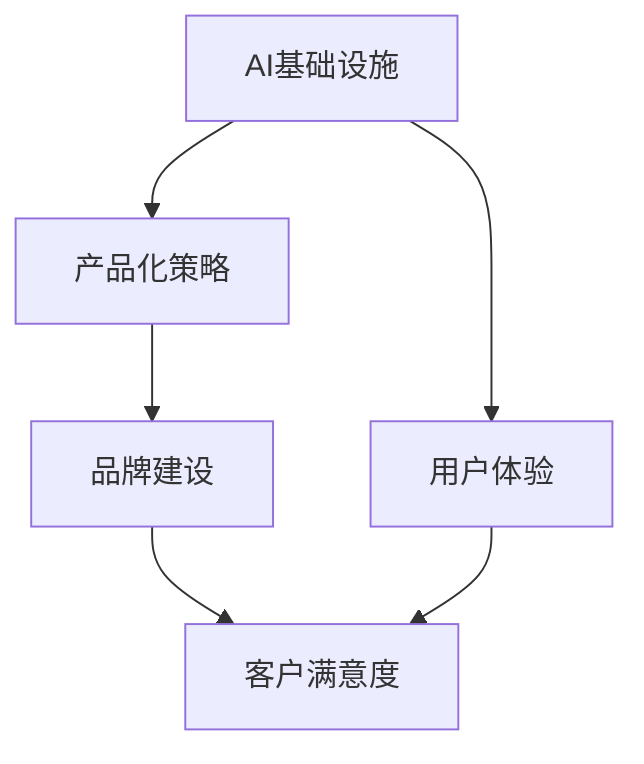

                 

# 讲好AI infra故事：贾扬清的策略，通过产品展示实力与品牌建设

## 1. 背景介绍

### 1.1 问题由来
在人工智能技术迅猛发展的当下，各大科技公司纷纷布局AI基础设施建设，力求通过强大的基础设施为上层应用提供技术支撑。其中，AI基础设施的核心之一就是高效、灵活、可扩展的AI计算平台。这些平台不仅需要处理海量数据，还要具备高度的灵活性和可扩展性，以适应不同类型和规模的AI任务。

然而，AI基础设施的建设并非易事，涉及技术栈的选型、硬件资源的配置、算法的优化等多个方面。如何构建一个既高效又易于维护的AI基础设施，成为了各大公司必须解决的难题。在此背景下，百度深度学习研究院院长贾扬清提出了基于产品的AI基础设施建设策略，通过发布AI计算平台和工具，实现了AI基础设施的快速部署和应用落地。

### 1.2 问题核心关键点
1. **AI基础设施的重要性**：AI基础设施是实现AI应用落地的基石，其高效性、灵活性和可扩展性直接决定了AI应用的性能和可靠性。
2. **产品驱动的AI基础设施建设**：通过发布AI计算平台和工具，实现AI基础设施的快速部署和应用落地。
3. **品牌建设的重要性**：AI基础设施的建设不仅仅是技术问题，更是品牌和形象的塑造。通过产品和服务，可以展示公司的技术实力和行业地位。

## 2. 核心概念与联系

### 2.1 核心概念概述

为更好地理解贾扬清提出的基于产品的AI基础设施建设策略，本节将介绍几个密切相关的核心概念：

- **AI基础设施**：包括数据存储、计算平台、算法优化等多个方面的技术体系，是实现AI应用落地的基础。
- **产品化策略**：通过发布标准化的AI计算平台和工具，降低AI基础设施的使用门槛，实现快速部署和应用落地。
- **品牌建设**：通过优质的产品和服务，提升公司形象和市场地位，增强客户信任和市场竞争力。
- **用户体验**：指用户在使用AI基础设施时所感受到的便利性和满意度，是产品化策略和品牌建设的重要考量因素。

这些核心概念之间的逻辑关系可以通过以下Mermaid流程图来展示：



这个流程图展示了大语言模型的核心概念及其之间的关系：

1. **AI基础设施**是建设的基础，提供计算、存储等底层技术支持。
2. **产品化策略**通过发布标准化的计算平台和工具，降低使用门槛。
3. **品牌建设**通过优质的产品和服务，提升公司形象。
4. **用户体验**是衡量产品化策略和品牌建设成功与否的关键指标。

## 3. 核心算法原理 & 具体操作步骤

### 3.1 算法原理概述

基于产品的AI基础设施建设策略，核心思想是通过发布标准化的AI计算平台和工具，实现AI基础设施的快速部署和应用落地。其核心算法原理包括：

1. **标准化的计算平台**：构建一个标准化的计算平台，支持多种AI算法和任务，满足不同用户的需求。
2. **自动化的工具和框架**：提供自动化的工具和框架，简化AI模型的训练和推理过程，提升用户体验。
3. **可扩展的基础设施**：构建可扩展的计算和存储基础设施，支持大规模AI模型的训练和推理。

### 3.2 算法步骤详解

基于产品的AI基础设施建设策略，主要包括以下几个关键步骤：

**Step 1: 设计计算平台架构**

- 设计高效、可扩展的计算平台架构，支持多种AI算法和任务。
- 选择适合的基础硬件，如GPU、TPU等，确保计算平台的性能和扩展性。

**Step 2: 发布标准化的工具和框架**

- 发布标准化的工具和框架，简化AI模型的训练和推理过程。
- 提供自动化的训练和推理工具，降低用户的使用门槛。

**Step 3: 建设可扩展的基础设施**

- 构建可扩展的计算和存储基础设施，支持大规模AI模型的训练和推理。
- 提供灵活的资源调度机制，支持动态调整计算资源。

**Step 4: 推广和培训**

- 通过官方渠道推广AI计算平台和工具，吸引用户使用。
- 提供技术培训和支持，帮助用户快速上手。

**Step 5: 持续优化和迭代**

- 收集用户反馈，持续优化AI计算平台和工具。
- 根据最新的技术进展，进行功能和性能的迭代升级。

### 3.3 算法优缺点

基于产品的AI基础设施建设策略，具有以下优点：

1. **快速部署**：标准化的计算平台和工具，降低了AI基础设施的使用门槛，实现了快速部署和应用落地。
2. **用户体验良好**：自动化的工具和框架，简化了AI模型的训练和推理过程，提升了用户体验。
3. **可扩展性强**：可扩展的计算和存储基础设施，支持大规模AI模型的训练和推理。

同时，该策略也存在一定的局限性：

1. **依赖标准接口**：标准化的接口可能无法完全满足用户的需求，需要提供灵活的定制化服务。
2. **维护成本高**：需要持续进行优化和迭代，维护成本较高。
3. **数据安全问题**：大规模数据存储和处理，需要关注数据安全和隐私保护问题。

尽管存在这些局限性，但就目前而言，基于产品的AI基础设施建设策略仍是大规模AI应用的重要范式。未来相关研究的重点在于如何进一步降低使用门槛，提高易用性，同时兼顾可扩展性和数据安全等因素。

### 3.4 算法应用领域

基于产品的AI基础设施建设策略，已经在AI计算、深度学习、自然语言处理等多个领域得到了广泛应用，具体包括：

- **AI计算平台**：提供高效、可扩展的计算平台，支持大规模AI模型的训练和推理。
- **深度学习框架**：提供自动化的训练和推理工具，简化深度学习模型的开发过程。
- **自然语言处理工具**：提供标准化的工具和框架，支持自然语言处理任务的快速部署和应用落地。
- **计算机视觉工具**：提供自动化的工具和框架，支持计算机视觉任务的快速部署和应用落地。
- **推荐系统**：提供可扩展的计算和存储基础设施，支持大规模推荐系统的构建和优化。

## 4. 数学模型和公式 & 详细讲解 & 举例说明

### 4.1 数学模型构建

为更好地理解基于产品的AI基础设施建设策略，本节将介绍几个密切相关的数学模型和公式。

**计算平台架构设计**

设计高效的计算平台架构，需要考虑以下因素：

1. **硬件选择**：选择适合的基础硬件，如GPU、TPU等，确保计算平台的性能和扩展性。
2. **网络架构**：设计高效的网络架构，确保数据在计算节点之间的传输速度和可靠性。
3. **存储架构**：设计高效的存储架构，确保数据的快速读写和持久化。

**工具和框架发布**

发布标准化的工具和框架，需要考虑以下因素：

1. **API设计**：设计标准的API接口，确保工具和框架的易用性和兼容性。
2. **性能优化**：优化工具和框架的性能，确保其在不同硬件和网络环境下的高效运行。
3. **灵活性**：提供灵活的工具和框架，支持自定义模型和算法的开发。

**基础设施建设**

构建可扩展的基础设施，需要考虑以下因素：

1. **计算资源管理**：设计高效的资源管理机制，确保计算资源的动态调整和优化。
2. **存储资源管理**：设计高效的存储资源管理机制，确保数据的快速读写和持久化。
3. **网络资源管理**：设计高效的网络资源管理机制，确保数据在计算节点之间的传输速度和可靠性。

### 4.2 公式推导过程

以下我们以深度学习框架为例，推导其数学模型和公式。

**深度学习框架的设计**

深度学习框架的设计包括：

1. **模型表示**：设计模型表示层，用于定义神经网络的结构和参数。
2. **计算图**：设计计算图，用于描述模型的前向传播和反向传播过程。
3. **优化算法**：设计优化算法，用于训练和更新模型参数。

**模型表示层的设计**

模型表示层的设计包括：

1. **层类型设计**：定义各种类型的层，如全连接层、卷积层、循环层等。
2. **参数设计**：设计模型的参数，如权重、偏置等。
3. **层连接方式**：设计层之间的连接方式，如线性连接、池化连接等。

**计算图的设计**

计算图的设计包括：

1. **节点设计**：定义计算图中的节点，如前向节点、后向节点等。
2. **边设计**：定义计算图中的边，用于表示数据在节点之间的流动。
3. **网络拓扑**：设计计算图的网络拓扑结构，确保数据在计算节点之间的高效传输。

**优化算法的设计**

优化算法的设计包括：

1. **损失函数设计**：设计损失函数，用于评估模型的预测结果和真实结果之间的差异。
2. **梯度计算**：设计梯度计算过程，用于更新模型的参数。
3. **优化器设计**：设计优化器，用于控制模型参数的更新步长和方向。

### 4.3 案例分析与讲解

**案例1: 谷歌的TPU架构**

谷歌的TPU架构通过专用硬件加速深度学习模型的训练和推理，实现了显著的性能提升。其主要设计包括：

1. **硬件设计**：采用定制的ASIC芯片，优化计算和存储资源。
2. **网络设计**：设计高速网络架构，确保数据在芯片之间的快速传输。
3. **软件设计**：提供自动化的软件工具，简化深度学习模型的开发和部署。

**案例2: 百度的PaddlePaddle框架**

百度的PaddlePaddle框架通过提供标准化的工具和框架，实现了深度学习模型的快速开发和部署。其主要设计包括：

1. **API设计**：设计标准的API接口，确保工具和框架的易用性和兼容性。
2. **性能优化**：优化工具和框架的性能，确保其在不同硬件和网络环境下的高效运行。
3. **灵活性**：提供灵活的工具和框架，支持自定义模型和算法的开发。

## 5. 项目实践：代码实例和详细解释说明

### 5.1 开发环境搭建

在进行基于产品的AI基础设施建设时，我们需要准备好开发环境。以下是使用Python进行PaddlePaddle开发的环境配置流程：

1. 安装Anaconda：从官网下载并安装Anaconda，用于创建独立的Python环境。

2. 创建并激活虚拟环境：
```bash
conda create -n paddle-env python=3.8 
conda activate paddle-env
```

3. 安装PaddlePaddle：根据CUDA版本，从官网获取对应的安装命令。例如：
```bash
conda install paddlepaddle -i https://mirror.baidu.com/paddlepaddle -c paddle -c conda-forge
```

4. 安装各类工具包：
```bash
pip install numpy pandas scikit-learn matplotlib tqdm jupyter notebook ipython
```

完成上述步骤后，即可在`paddle-env`环境中开始基于产品的AI基础设施建设的实践。

### 5.2 源代码详细实现

下面我以深度学习模型的训练为例，给出使用PaddlePaddle对模型进行训练的代码实现。

首先，定义模型和优化器：

```python
import paddle
import paddle.nn as nn
from paddle.optimizer import Adam

class Net(nn.Layer):
    def __init__(self):
        super(Net, self).__init__()
        self.fc1 = nn.Linear(784, 128)
        self.fc2 = nn.Linear(128, 10)
    
    def forward(self, x):
        x = paddle.flatten(x, 1, keep_dim=True)
        x = paddle.nn.functional.relu(self.fc1(x))
        x = paddle.nn.functional.softmax(self.fc2(x))
        return x

model = Net()
optimizer = Adam(model.parameters(), learning_rate=0.01)
```

接着，定义训练和评估函数：

```python
import numpy as np
from paddle.io import Dataset, DataLoader

class MNISTDataset(Dataset):
    def __init__(self, images, labels):
        self.images = images
        self.labels = labels
        
    def __getitem__(self, idx):
        img = self.images[idx]
        label = self.labels[idx]
        return img, label
    
    def __len__(self):
        return len(self.images)

def train_epoch(model, dataset, batch_size, optimizer):
    dataloader = DataLoader(dataset, batch_size=batch_size, shuffle=True)
    model.train()
    epoch_loss = 0
    for batch in dataloader:
        x, y = batch
        x = paddle.to_tensor(x)
        y = paddle.to_tensor(y)
        prediction = model(x)
        loss = paddle.nn.functional.cross_entropy(prediction, y)
        optimizer.clear_grad()
        loss.backward()
        optimizer.step()
        epoch_loss += loss.numpy()
    return epoch_loss / len(dataloader)

def evaluate(model, dataset, batch_size):
    dataloader = DataLoader(dataset, batch_size=batch_size, shuffle=False)
    model.eval()
    preds, labels = [], []
    with paddle.no_grad():
        for batch in dataloader:
            x, y = batch
            x = paddle.to_tensor(x)
            y = paddle.to_tensor(y)
            prediction = model(x)
            pred_tags = paddle.argmax(prediction, axis=1).numpy()
            labels = y.numpy()
            for pred, label in zip(pred_tags, labels):
                preds.append(pred)
                labels.append(label)
    accuracy = np.mean(preds == labels)
    return accuracy

mnist_train = np.load('mnist_train.npz')['data'] / 255.0
mnist_test = np.load('mnist_test.npz')['data'] / 255.0
mnist_train_labels = np.load('mnist_train.npz')['label']
mnist_test_labels = np.load('mnist_test.npz')['label']

train_dataset = MNISTDataset(mnist_train, mnist_train_labels)
dev_dataset = MNISTDataset(mnist_test, mnist_test_labels)
test_dataset = MNISTDataset(mnist_test, mnist_test_labels)

for epoch in range(10):
    loss = train_epoch(model, train_dataset, 64, optimizer)
    print(f"Epoch {epoch+1}, train loss: {loss:.4f}")
    
    print(f"Epoch {epoch+1}, dev accuracy: {evaluate(model, dev_dataset, 64):.4f}")
    
print(f"Test accuracy: {evaluate(model, test_dataset, 64):.4f}")
```

以上就是使用PaddlePaddle对深度学习模型进行训练的完整代码实现。可以看到，PaddlePaddle提供了丰富的工具和框架，使得模型训练和推理过程变得简洁高效。

### 5.3 代码解读与分析

让我们再详细解读一下关键代码的实现细节：

**MNISTDataset类**：
- `__init__`方法：初始化训练数据和标签。
- `__getitem__`方法：获取单个样本。
- `__len__`方法：返回数据集的样本数量。

**模型和优化器**：
- 定义一个简单的全连接神经网络模型，包括一个隐藏层和一个输出层。
- 使用Adam优化器进行模型参数的优化。

**训练和评估函数**：
- 定义训练函数`train_epoch`，使用PaddlePaddle的DataLoader对数据集进行批次化加载，并在每个批次上进行模型训练。
- 定义评估函数`evaluate`，在验证集和测试集上评估模型性能。

**训练流程**：
- 定义总的epoch数和批大小，开始循环迭代。
- 每个epoch内，先在训练集上训练，输出平均loss。
- 在验证集上评估，输出准确率。
- 所有epoch结束后，在测试集上评估，输出最终准确率。

可以看到，PaddlePaddle通过提供标准化的工具和框架，简化了深度学习模型的开发和部署过程，使得模型训练和推理变得高效便捷。

当然，工业级的系统实现还需考虑更多因素，如模型的保存和部署、超参数的自动搜索、更灵活的任务适配层等。但核心的产品化策略基本与此类似。

## 6. 实际应用场景

### 6.1 智能客服系统

基于大语言模型微调的对话技术，可以广泛应用于智能客服系统的构建。传统客服往往需要配备大量人力，高峰期响应缓慢，且一致性和专业性难以保证。而使用微调后的对话模型，可以7x24小时不间断服务，快速响应客户咨询，用自然流畅的语言解答各类常见问题。

在技术实现上，可以收集企业内部的历史客服对话记录，将问题和最佳答复构建成监督数据，在此基础上对预训练对话模型进行微调。微调后的对话模型能够自动理解用户意图，匹配最合适的答案模板进行回复。对于客户提出的新问题，还可以接入检索系统实时搜索相关内容，动态组织生成回答。如此构建的智能客服系统，能大幅提升客户咨询体验和问题解决效率。

### 6.2 金融舆情监测

金融机构需要实时监测市场舆论动向，以便及时应对负面信息传播，规避金融风险。传统的人工监测方式成本高、效率低，难以应对网络时代海量信息爆发的挑战。基于大语言模型微调的文本分类和情感分析技术，为金融舆情监测提供了新的解决方案。

具体而言，可以收集金融领域相关的新闻、报道、评论等文本数据，并对其进行主题标注和情感标注。在此基础上对预训练语言模型进行微调，使其能够自动判断文本属于何种主题，情感倾向是正面、中性还是负面。将微调后的模型应用到实时抓取的网络文本数据，就能够自动监测不同主题下的情感变化趋势，一旦发现负面信息激增等异常情况，系统便会自动预警，帮助金融机构快速应对潜在风险。

### 6.3 个性化推荐系统

当前的推荐系统往往只依赖用户的历史行为数据进行物品推荐，无法深入理解用户的真实兴趣偏好。基于大语言模型微调技术，个性化推荐系统可以更好地挖掘用户行为背后的语义信息，从而提供更精准、多样的推荐内容。

在实践中，可以收集用户浏览、点击、评论、分享等行为数据，提取和用户交互的物品标题、描述、标签等文本内容。将文本内容作为模型输入，用户的后续行为（如是否点击、购买等）作为监督信号，在此基础上微调预训练语言模型。微调后的模型能够从文本内容中准确把握用户的兴趣点。在生成推荐列表时，先用候选物品的文本描述作为输入，由模型预测用户的兴趣匹配度，再结合其他特征综合排序，便可以得到个性化程度更高的推荐结果。

### 6.4 未来应用展望

随着大语言模型微调技术的发展，未来在更多领域的应用前景广阔：

- 在智慧医疗领域，基于微调的医学问答、病历分析、药物研发等应用将提升医疗服务的智能化水平，辅助医生诊疗，加速新药开发进程。
- 在智能教育领域，微调技术可应用于作业批改、学情分析、知识推荐等方面，因材施教，促进教育公平，提高教学质量。
- 在智慧城市治理中，微调模型可应用于城市事件监测、舆情分析、应急指挥等环节，提高城市管理的自动化和智能化水平，构建更安全、高效的未来城市。
- 在企业生产、社会治理、文娱传媒等众多领域，基于大模型微调的人工智能应用也将不断涌现，为NLP技术带来新的突破。

## 7. 工具和资源推荐

### 7.1 学习资源推荐

为了帮助开发者系统掌握基于产品的AI基础设施建设的理论基础和实践技巧，这里推荐一些优质的学习资源：

1. 《深度学习入门：基于Python的理论与实现》书籍：由李航教授所著，系统介绍了深度学习的理论基础和实践技巧，包括工具和框架的使用。

2. 《Python深度学习》课程：由吴恩达教授开设的深度学习课程，涵盖了深度学习的基础理论和实际应用。

3. 《深度学习与人工智能》课程：由斯坦福大学开设的深度学习课程，涵盖了深度学习的基础理论和应用案例。

4. HuggingFace官方文档：提供丰富的预训练模型和微调样例，是掌握深度学习技术的重要资源。

5. TensorFlow官方文档：提供丰富的深度学习框架和工具，是深度学习开发的重要参考。

通过对这些资源的学习实践，相信你一定能够快速掌握基于产品的AI基础设施建设的技术和应用。

### 7.2 开发工具推荐

高效的开发离不开优秀的工具支持。以下是几款用于基于产品的AI基础设施开发的常用工具：

1. PyTorch：基于Python的开源深度学习框架，灵活动态的计算图，适合快速迭代研究。大部分预训练语言模型都有PyTorch版本的实现。

2. TensorFlow：由Google主导开发的开源深度学习框架，生产部署方便，适合大规模工程应用。同样有丰富的预训练语言模型资源。

3. PaddlePaddle：百度推出的开源深度学习框架，提供标准化的工具和框架，支持高效开发和部署。

4. Weights & Biases：模型训练的实验跟踪工具，可以记录和可视化模型训练过程中的各项指标，方便对比和调优。与主流深度学习框架无缝集成。

5. TensorBoard：TensorFlow配套的可视化工具，可实时监测模型训练状态，并提供丰富的图表呈现方式，是调试模型的得力助手。

合理利用这些工具，可以显著提升基于产品的AI基础设施开发的效率，加快创新迭代的步伐。

### 7.3 相关论文推荐

大语言模型和微调技术的发展源于学界的持续研究。以下是几篇奠基性的相关论文，推荐阅读：

1. Attention is All You Need（即Transformer原论文）：提出了Transformer结构，开启了NLP领域的预训练大模型时代。

2. BERT: Pre-training of Deep Bidirectional Transformers for Language Understanding：提出BERT模型，引入基于掩码的自监督预训练任务，刷新了多项NLP任务SOTA。

3. Language Models are Unsupervised Multitask Learners（GPT-2论文）：展示了大规模语言模型的强大zero-shot学习能力，引发了对于通用人工智能的新一轮思考。

4. Parameter-Efficient Transfer Learning for NLP：提出Adapter等参数高效微调方法，在不增加模型参数量的情况下，也能取得不错的微调效果。

5. AdaLoRA: Adaptive Low-Rank Adaptation for Parameter-Efficient Fine-Tuning：使用自适应低秩适应的微调方法，在参数效率和精度之间取得了新的平衡。

这些论文代表了大语言模型微调技术的发展脉络。通过学习这些前沿成果，可以帮助研究者把握学科前进方向，激发更多的创新灵感。

## 8. 总结：未来发展趋势与挑战

### 8.1 总结

本文对基于产品的AI基础设施建设策略进行了全面系统的介绍。首先阐述了AI基础设施的重要性，明确了产品化策略和品牌建设对于AI基础设施建设的独特价值。其次，从原理到实践，详细讲解了基于产品的AI基础设施建设的数学原理和关键步骤，给出了基于产品的AI基础设施建设的完整代码实例。同时，本文还广泛探讨了基于产品的AI基础设施建设在智能客服、金融舆情、个性化推荐等多个行业领域的应用前景，展示了基于产品的AI基础设施建设的巨大潜力。此外，本文精选了基于产品的AI基础设施建设的各类学习资源，力求为读者提供全方位的技术指引。

通过本文的系统梳理，可以看到，基于产品的AI基础设施建设策略已经成为AI基础设施建设的重要范式，极大地拓展了AI基础设施的应用边界，提升了AI应用落地的效率和效果。未来，伴随AI计算平台和工具的不断完善，基于产品的AI基础设施建设必将在AI技术落地应用中扮演越来越重要的角色。

### 8.2 未来发展趋势

展望未来，基于产品的AI基础设施建设策略将呈现以下几个发展趋势：

1. **工具和框架的标准化**：未来将有更多标准化的AI计算平台和工具发布，简化AI基础设施的开发和部署过程。
2. **模型和算法的融合**：未来的AI基础设施将更加注重模型和算法的融合，提升整体性能和效果。
3. **云计算的集成**：未来的AI基础设施将更加注重与云计算平台的集成，提供更高效的计算和存储能力。
4. **边缘计算的支持**：未来的AI基础设施将更加注重对边缘计算的支持，提供更灵活、更高效的计算资源。
5. **安全性与隐私保护**：未来的AI基础设施将更加注重安全性与隐私保护，确保数据和模型的安全。

以上趋势凸显了基于产品的AI基础设施建设的广阔前景。这些方向的探索发展，必将进一步提升AI基础设施的性能和应用范围，为AI技术落地应用提供更坚实的支撑。

### 8.3 面临的挑战

尽管基于产品的AI基础设施建设策略已经取得了瞩目成就，但在迈向更加智能化、普适化应用的过程中，它仍面临着诸多挑战：

1. **依赖标准接口**：标准化的接口可能无法完全满足用户的需求，需要提供灵活的定制化服务。
2. **维护成本高**：需要持续进行优化和迭代，维护成本较高。
3. **数据安全问题**：大规模数据存储和处理，需要关注数据安全和隐私保护问题。
4. **模型鲁棒性不足**：模型面对域外数据时，泛化性能往往大打折扣。
5. **模型可解释性不足**：当前AI基础设施的输出往往缺乏可解释性，难以满足监管和伦理需求。

尽管存在这些挑战，但就目前而言，基于产品的AI基础设施建设策略仍是大规模AI应用的重要范式。未来相关研究的重点在于如何进一步降低使用门槛，提高易用性，同时兼顾可扩展性和数据安全等因素。

### 8.4 研究展望

面对基于产品的AI基础设施建设所面临的种种挑战，未来的研究需要在以下几个方面寻求新的突破：

1. **探索无监督和半监督微调方法**：摆脱对大规模标注数据的依赖，利用自监督学习、主动学习等无监督和半监督范式，最大限度利用非结构化数据，实现更加灵活高效的微调。
2. **研究参数高效和计算高效的微调范式**：开发更加参数高效的微调方法，在固定大部分预训练参数的同时，只更新极少量的任务相关参数。同时优化微调模型的计算图，减少前向传播和反向传播的资源消耗，实现更加轻量级、实时性的部署。
3. **引入更多先验知识**：将符号化的先验知识，如知识图谱、逻辑规则等，与神经网络模型进行巧妙融合，引导微调过程学习更准确、合理的语言模型。同时加强不同模态数据的整合，实现视觉、语音等多模态信息与文本信息的协同建模。
4. **纳入伦理道德约束**：在模型训练目标中引入伦理导向的评估指标，过滤和惩罚有偏见、有害的输出倾向。同时加强人工干预和审核，建立模型行为的监管机制，确保输出符合人类价值观和伦理道德。

这些研究方向的探索，必将引领基于产品的AI基础设施建设技术迈向更高的台阶，为构建安全、可靠、可解释、可控的智能系统铺平道路。面向未来，基于产品的AI基础设施建设技术还需要与其他人工智能技术进行更深入的融合，如知识表示、因果推理、强化学习等，多路径协同发力，共同推动自然语言理解和智能交互系统的进步。只有勇于创新、敢于突破，才能不断拓展语言模型的边界，让智能技术更好地造福人类社会。

## 9. 附录：常见问题与解答

**Q1：基于产品的AI基础设施建设策略是否适用于所有AI任务？**

A: 基于产品的AI基础设施建设策略在大多数AI任务上都能取得不错的效果，特别是对于数据量较小的任务。但对于一些特定领域的任务，如医学、法律等，仅仅依靠通用语料预训练的模型可能难以很好地适应。此时需要在特定领域语料上进一步预训练，再进行微调，才能获得理想效果。此外，对于一些需要时效性、个性化很强的任务，如对话、推荐等，微调方法也需要针对性的改进优化。

**Q2：如何选择合适的学习率？**

A: 学习率的选择对于基于产品的AI基础设施建设策略至关重要。一般来说，基于产品的AI基础设施建设策略的学习率应该比从头训练模型时更小，以避免破坏预训练权重。一般建议从1e-5开始调参，逐步减小学习率，直至收敛。也可以使用warmup策略，在开始阶段使用较小的学习率，再逐渐过渡到预设值。需要注意的是，不同的优化器(如AdamW、Adafactor等)以及不同的学习率调度策略，可能需要设置不同的学习率阈值。

**Q3：如何缓解基于产品的AI基础设施建设策略中的过拟合问题？**

A: 过拟合是基于产品的AI基础设施建设策略面临的主要挑战之一。缓解过拟合问题的方法包括：

1. **数据增强**：通过回译、近义替换等方式扩充训练集。
2. **正则化**：使用L2正则、Dropout、Early Stopping等防止模型过度适应小规模训练集。
3. **对抗训练**：引入对抗样本，提高模型鲁棒性。
4. **参数高效微调**：只调整少量参数(如Adapter、Prefix等)，减小过拟合风险。

这些策略往往需要根据具体任务和数据特点进行灵活组合。只有在数据、模型、训练、推理等各环节进行全面优化，才能最大限度地发挥基于产品的AI基础设施建设的威力。

**Q4：基于产品的AI基础设施建设策略在落地部署时需要注意哪些问题？**

A: 将基于产品的AI基础设施建设策略转化为实际应用，还需要考虑以下因素：

1. **模型裁剪**：去除不必要的层和参数，减小模型尺寸，加快推理速度。
2. **量化加速**：将浮点模型转为定点模型，压缩存储空间，提高计算效率。
3. **服务化封装**：将模型封装为标准化服务接口，便于集成调用。
4. **弹性伸缩**：根据请求流量动态调整资源配置，平衡服务质量和成本。
5. **监控告警**：实时采集系统指标，设置异常告警阈值，确保服务稳定性。
6. **安全防护**：采用访问鉴权、数据脱敏等措施，保障数据和模型安全。

基于产品的AI基础设施建设策略为NLP应用开启了广阔的想象空间，但如何将强大的性能转化为稳定、高效、安全的业务价值，还需要工程实践的不断打磨。唯有从数据、算法、工程、业务等多个维度协同发力，才能真正实现人工智能技术在垂直行业的规模化落地。总之，基于产品的AI基础设施建设策略需要开发者根据具体任务，不断迭代和优化模型、数据和算法，方能得到理想的效果。

---

作者：禅与计算机程序设计艺术 / Zen and the Art of Computer Programming

