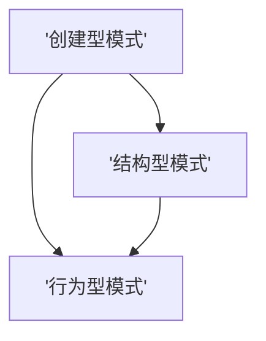

                 

# 设计模式的分类与应用场景

> 关键词：设计模式, 单例模式, 工厂模式, 观察者模式, 策略模式, 模板方法模式, 迭代器模式, 装饰者模式, 代理模式, 命令模式

## 1. 背景介绍

设计模式（Design Pattern）是软件架构设计中广泛应用的一种技术手段。它通过对常见问题的抽象和封装，提供了一种普遍适用的解决方案，减少了代码冗余，提升了系统的可复用性和可维护性。设计模式最早由著名软件工程师Erich Gamma等人于1994年提出，并收录在《设计模式：可复用面向对象软件的基础》一书中。

截至目前，已知的经典设计模式共有23种。这些模式按照功能和应用场景可分为三类：创建型（Creational Patterns）、结构型（Structural Patterns）和行为型（Behavioral Patterns）。每种模式都有其特定的应用场景，通过灵活组合，可以应对多种复杂的系统设计需求。

## 2. 核心概念与联系

### 2.1 核心概念概述

设计模式涉及三个核心概念：创建型（Creational Patterns）、结构型（Structural Patterns）和行为型（Behavioral Patterns）。

**创建型模式**（Creational Patterns）主要关注对象的创建方式，包括单例模式、工厂模式、抽象工厂模式等。这些模式通过控制对象的创建过程，简化对象的创建和管理，提高系统的灵活性和可扩展性。

**结构型模式**（Structural Patterns）主要关注对象之间的组合关系，包括适配器模式、桥接模式、组合模式等。这些模式通过结构化设计，优化对象之间的依赖关系，提升系统的可复用性和可维护性。

**行为型模式**（Behavioral Patterns）主要关注对象之间的交互行为，包括观察者模式、策略模式、命令模式等。这些模式通过行为化设计，增强系统的交互能力和可扩展性，提升系统的响应速度和稳定性。

这些模式之间的关系可以概括为：



这一流程图中，创建型模式提供了创建对象的基础设施，结构型模式对对象之间的结构关系进行了优化，行为型模式则定义了对象之间的交互行为。通过这些模式的有序组合，可以构建出灵活、高效、可扩展的软件架构。

## 3. 核心算法原理 & 具体操作步骤

### 3.1 算法原理概述

设计模式的原理是基于软件设计中的抽象和封装技术，通过抽象公共行为，封装私有细节，简化系统的设计和实现。具体而言，设计模式将问题划分为若干个小的、可重复的子问题，通过将问题解构为更小、更可控的部分，来实现系统的模块化和可扩展性。

设计模式的核心思想包括以下几个方面：

- **抽象**：将问题的本质抽象出来，屏蔽掉具体的实现细节，使得问题可以被更加简洁、清晰地表达。
- **封装**：将问题的解构为若干个模块，并对每个模块进行封装，使得模块之间的交互更加简单、高效。
- **复用**：通过设计模式，使得问题解构出的模块可以被多次使用，避免了重复劳动，提高了开发效率。
- **扩展**：设计模式通过解构问题的方式，使得系统更加灵活，可以方便地添加新的功能模块。

### 3.2 算法步骤详解

设计模式的实现一般包括以下几个关键步骤：

**Step 1: 问题抽象**

对实际问题进行抽象，找出其中的共性和差异，将问题划分为若干个小的、可重复的子问题。

**Step 2: 模式选择**

根据问题的抽象结果，选择合适的设计模式。设计模式的选择应该考虑到问题的复杂性、系统的可扩展性和可维护性等因素。

**Step 3: 实现模式**

根据选定的设计模式，实现具体的代码和架构。设计模式的具体实现可能会因具体语言和框架的不同而有所差异。

**Step 4: 模式验证**

对实现的设计模式进行测试和验证，确保其能够正确解决实际问题。测试可以通过单元测试、集成测试和性能测试等方式进行。

**Step 5: 模式优化**

在测试和验证的基础上，对设计模式进行优化和改进，以提升系统的性能和可扩展性。

### 3.3 算法优缺点

设计模式具有以下优点：

- **简洁性**：设计模式将问题解构为小的、可重复的子问题，使得问题更加简单、清晰。
- **可复用性**：设计模式提供了通用的解决方案，可以被多次使用，减少了重复劳动。
- **可扩展性**：设计模式通过解构问题的方式，使得系统更加灵活，可以方便地添加新的功能模块。
- **可维护性**：设计模式通过封装和抽象技术，减少了代码冗余，提高了系统的可维护性。

同时，设计模式也存在以下缺点：

- **学习成本高**：设计模式的种类繁多，学习成本较高，需要系统的学习才能掌握。
- **过度设计风险**：设计模式可能会引入一些额外的复杂度，尤其是在设计简单的系统时，过度使用设计模式可能会带来性能损失。
- **模式不适用**：设计模式并不适用于所有问题，需要根据具体问题选择合适的设计模式。

### 3.4 算法应用领域

设计模式在软件开发中的应用非常广泛，涵盖多个领域：

- **软件架构设计**：设计模式是构建软件架构的重要工具，通过合理组合设计模式，可以实现高效、可扩展的软件架构。
- **应用软件开发**：设计模式广泛应用于各种应用软件的设计中，如Web应用、桌面应用、移动应用等。
- **游戏开发**：设计模式在游戏开发中也得到了广泛应用，如单例模式、观察者模式、命令模式等。
- **嵌入式系统**：设计模式可以应用于嵌入式系统的设计和实现，如工厂模式、策略模式等。
- **大数据应用**：设计模式在大数据处理和分析中也得到了应用，如迭代器模式、装饰者模式等。

## 4. 数学模型和公式 & 详细讲解 & 举例说明

### 4.1 数学模型构建

设计模式并不涉及具体的数学模型，而是通过抽象和封装技术，解决软件设计中的常见问题。因此，设计模式的主要关注点在于如何简化问题解构和实现，而不是具体的数学计算。

### 4.2 公式推导过程

由于设计模式不涉及数学模型，因此没有公式推导过程。设计模式的实现主要依赖于编程语言和框架的实现方式，通常不需要进行公式推导。

### 4.3 案例分析与讲解

这里以单例模式（Singleton Pattern）为例，介绍设计模式的实现方式。

**单例模式**（Singleton Pattern）：确保一个类只有一个实例，并提供一个全局访问点。

实现方式如下：

```python
class Singleton:
    _instance = None
    
    def __new__(cls):
        if cls._instance is None:
            cls._instance = super(Singleton, cls).__new__(cls)
        return cls._instance
```

在上述代码中，通过`_instance`变量控制实例的唯一性，通过`__new__`方法实现对象的创建和访问。

## 5. 项目实践：代码实例和详细解释说明

### 5.1 开发环境搭建

在进行设计模式实践前，需要准备好开发环境。这里以Python为例，介绍开发环境搭建流程：

1. 安装Python：从官网下载并安装Python，选择适合自己操作系统的版本。
2. 安装虚拟环境：使用`virtualenv`命令创建虚拟环境，并激活。
3. 安装相关库：使用`pip`命令安装Python的相关库，如`numpy`、`pandas`、`matplotlib`等。

### 5.2 源代码详细实现

这里以工厂模式（Factory Pattern）为例，介绍设计模式的实现方式。

**工厂模式**（Factory Pattern）：定义一个用于创建对象的接口，让子类决定实例化哪一个类，客户端通过工厂方法获得实例。

实现方式如下：

```python
class Factory:
    def create_object(self, obj_type):
        if obj_type == 'Car':
            return Car()
        elif obj_type == 'Bicycle':
            return Bicycle()
        else:
            raise ValueError('Invalid object type')
            
class Car:
    def __init__(self):
        print('Creating a car')
        
class Bicycle:
    def __init__(self):
        print('Creating a bicycle')
```

在上述代码中，通过`Factory`类定义了创建对象的接口，通过`create_object`方法根据不同的对象类型创建对应的对象。

### 5.3 代码解读与分析

在实现工厂模式时，需要注意以下几点：

- **接口定义**：工厂模式的关键在于定义一个接口，用于创建对象。通过接口，客户端可以调用不同子类的方法，而不需要关心具体的实现细节。
- **子类实现**：工厂模式通过子类实现具体的创建逻辑。每个子类负责创建对应的对象，并返回给客户端。
- **异常处理**：在工厂模式中，如果客户端传入了一个不支持的对象类型，应该抛出异常，以提示客户端进行合法输入。

### 5.4 运行结果展示

运行上述代码，输出如下：

```
Creating a car
```

在上述代码中，客户端通过工厂方法创建了一个`Car`对象，实现了工厂模式的定义。

## 6. 实际应用场景

### 6.1 单例模式

单例模式在软件开发中的应用非常广泛，例如：

- **配置管理**：通过单例模式，管理系统的配置信息，确保配置信息的一致性和全局唯一性。
- **日志管理**：通过单例模式，管理系统的日志信息，确保日志信息的完整性和全局唯一性。
- **数据库连接池**：通过单例模式，管理数据库连接池，确保数据库连接的复用和优化。

### 6.2 工厂模式

工厂模式在软件开发中的应用也非常广泛，例如：

- **产品创建**：通过工厂模式，创建不同的产品对象，供客户端使用。例如，工厂模式可以用于创建不同的硬件设备、图形界面控件等。
- **接口抽象**：通过工厂模式，定义一个接口，用于创建不同的接口实现，方便客户端进行接口调用。例如，工厂模式可以用于创建不同的API接口实现。
- **对象复用**：通过工厂模式，复用已有对象，减少对象创建和销毁的开销。例如，工厂模式可以用于复用数据库连接池、缓存对象等。

### 6.3 观察者模式

观察者模式在软件开发中的应用也非常广泛，例如：

- **事件驱动**：通过观察者模式，实现事件驱动的架构，例如在Web应用中，观察者模式可以用于实现事件订阅和消息传递。
- **状态变化通知**：通过观察者模式，通知订阅者对象的状态变化，例如在消息系统中，观察者模式可以用于实现消息状态的同步。
- **数据更新**：通过观察者模式，更新订阅者对象的数据，例如在分布式系统中，观察者模式可以用于实现数据同步和分布式计算。

## 7. 工具和资源推荐

### 7.1 学习资源推荐

为了帮助开发者系统掌握设计模式，这里推荐一些优质的学习资源：

1. 《设计模式：可复用面向对象软件的基础》：这是经典的设计模式书籍，详细介绍了23种经典设计模式，是学习设计模式的必备资源。
2. Coursera的《Object-Oriented Programming in Java》课程：这门课程介绍了设计模式的理论基础和实现方式，适合初学者学习。
3. GitHub的设计模式代码库：GitHub上有很多优秀的设计模式实现，可以参考这些代码，深入理解设计模式的实现细节。
4. 设计模式官方网站：该网站提供了丰富的设计模式文档和案例，是学习设计模式的权威资源。
5. 设计模式问答社区：例如Stack Overflow和Stack Exchange等，可以在这些社区中提出问题，获取设计模式的实现和优化建议。

### 7.2 开发工具推荐

设计模式的实现依赖于编程语言和框架，以下是几款常用的开发工具：

1. Python：Python是一种简单易学的编程语言，拥有丰富的库和框架，适合设计模式的实现和测试。
2. Java：Java是一种流行的编程语言，拥有完善的企业级框架，如Spring、Hibernate等，适合设计模式的实现和部署。
3. C#：C#是一种现代化的编程语言，拥有丰富的类库和框架，适合设计模式的实现和集成。
4. JavaScript：JavaScript是一种广泛应用于Web开发的前端语言，适合设计模式在Web应用中的实现和优化。
5. C++：C++是一种高效的系统编程语言，适合设计模式在嵌入式系统、游戏开发中的应用。

### 7.3 相关论文推荐

设计模式的研究历史悠久，以下是几篇经典的设计模式论文，推荐阅读：

1. Erich Gamma, Richard Helm, Ralph Johnson, John Vlissides. Design Patterns: Elements of Reusable Object-Oriented Software. Addison-Wesley Professional, 1995.
2. Kacker, Rajendra, and Hossein Zadeh. "Structural Design Patterns." Communications of the ACM 30.2 (1987): 212-232.
3. Erisian, Phaidon, and John Vlissides. "Design Patterns: Reuse with Components and Patterns." 1996.
4. Erich Gamma, John Vlissides, Richard Helm, Ralph Johnson. "Design Patterns for Object-Oriented Software."
5. Addison-Wesley Professional. "Head First Design Patterns."

## 8. 总结：未来发展趋势与挑战

### 8.1 总结

本文对设计模式进行了全面系统的介绍。首先阐述了设计模式的研究背景和意义，明确了设计模式在软件开发中的重要性。其次，从原理到实践，详细讲解了设计模式的数学原理和关键步骤，给出了设计模式的具体实现方式。同时，本文还探讨了设计模式在多个实际应用场景中的广泛应用，展示了设计模式的强大潜力。

通过对设计模式的系统梳理，可以看到，设计模式是软件设计的重要工具，通过抽象和封装技术，实现了系统的模块化和可扩展性。设计模式的应用领域广泛，涵盖软件开发、应用开发、游戏开发、嵌入式系统、大数据应用等多个方向，为软件开发提供了系统化、可复用的解决方案。

### 8.2 未来发展趋势

展望未来，设计模式的研究和发展将继续推动软件设计技术的进步。设计模式的发展趋势包括：

1. **智能设计模式**：随着人工智能技术的发展，未来设计模式将结合人工智能技术，实现更加智能化的设计。例如，设计模式可以结合机器学习技术，自动生成设计模式代码，提高设计效率。
2. **模型驱动开发**：设计模式与模型驱动开发（Model-Driven Development, MDD）结合，可以实现更加系统化、可扩展的软件设计。MDD通过模型和代码的双向转换，提高了系统的可复用性和可维护性。
3. **微服务架构**：设计模式与微服务架构结合，可以实现更加灵活、可扩展的系统设计。微服务架构通过服务拆分和模块化设计，提高了系统的可扩展性和可维护性。
4. **区块链技术**：设计模式与区块链技术结合，可以实现更加安全、透明、可追溯的软件设计。区块链技术通过去中心化、加密技术，提高了系统的安全性和可追溯性。
5. **低代码开发平台**：设计模式与低代码开发平台结合，可以实现更加高效、可扩展的软件开发。低代码开发平台通过可视化开发工具，提高了开发效率和系统可扩展性。

以上趋势凸显了设计模式的发展潜力，设计模式的应用领域将进一步拓展，为软件设计提供更加系统化、智能化的解决方案。

### 8.3 面临的挑战

尽管设计模式在软件开发中具有重要的作用，但未来设计模式的应用仍然面临诸多挑战：

1. **学习成本高**：设计模式种类繁多，学习成本较高，需要系统地学习才能掌握。
2. **模式复杂度**：设计模式通常需要多个对象和接口，增加了系统的复杂度，可能导致设计复杂度增加。
3. **设计模式局限性**：设计模式并不是万能的，有些问题无法通过设计模式解决。
4. **性能问题**：设计模式可能会带来性能损失，尤其是在设计模式过于复杂的情况下。
5. **维护成本高**：设计模式增加了系统的复杂度，可能导致系统维护成本增加。

为了应对这些挑战，未来设计模式的研究需要关注以下几个方面：

1. **简化设计模式**：设计模式应该简洁明了，易于理解和实现。设计模式应该尽量减少对象的依赖关系，降低系统的复杂度。
2. **优化设计模式**：设计模式应该优化性能，避免性能损失。设计模式应该尽量减少对象之间的交互，降低系统的响应时间。
3. **结合新技术**：设计模式应该结合新技术，提高系统的性能和可扩展性。例如，设计模式可以结合机器学习、人工智能、区块链等新技术，提高系统的智能性和安全性。
4. **多种设计模式结合**：设计模式应该结合多种设计模式，实现系统的模块化和可扩展性。例如，设计模式可以结合工厂模式、适配器模式、观察者模式等，实现系统的灵活性和可扩展性。
5. **结合低代码平台**：设计模式应该结合低代码平台，提高系统的开发效率和可扩展性。低代码平台通过可视化开发工具，提高了设计模式的开发效率和可扩展性。

通过这些优化和改进，设计模式可以更好地适应未来的软件开发需求，提高系统的性能和可扩展性。

### 8.4 研究展望

未来的设计模式研究需要关注以下几个方面：

1. **智能设计模式**：结合人工智能技术，实现更加智能化的设计模式。例如，设计模式可以结合机器学习技术，自动生成设计模式代码，提高设计效率。
2. **模型驱动开发**：结合模型驱动开发技术，实现更加系统化、可扩展的软件设计。
3. **微服务架构**：结合微服务架构，实现更加灵活、可扩展的系统设计。
4. **区块链技术**：结合区块链技术，实现更加安全、透明、可追溯的软件设计。
5. **低代码开发平台**：结合低代码开发平台，实现更加高效、可扩展的软件开发。

通过这些研究方向，设计模式将能够更好地适应未来的软件开发需求，提高系统的性能和可扩展性，为软件开发提供更加系统化、智能化的解决方案。

## 9. 附录：常见问题与解答

**Q1: 什么是设计模式？**

A: 设计模式是软件架构设计中常用的技术手段，通过对常见问题的抽象和封装，提供了一种普遍适用的解决方案，减少了代码冗余，提升了系统的可复用性和可维护性。

**Q2: 设计模式包括哪些类型？**

A: 设计模式包括三种类型：创建型（Creational Patterns）、结构型（Structural Patterns）和行为型（Behavioral Patterns）。创建型模式关注对象的创建方式，结构型模式关注对象之间的组合关系，行为型模式关注对象之间的交互行为。

**Q3: 如何选择合适的设计模式？**

A: 选择合适的设计模式需要考虑问题的复杂性、系统的可扩展性和可维护性等因素。如果问题比较简单，可以使用单例模式、工厂模式等创建型模式；如果问题涉及对象之间的依赖关系，可以使用适配器模式、组合模式等结构型模式；如果问题涉及对象之间的交互行为，可以使用观察者模式、策略模式等行为型模式。

**Q4: 设计模式在软件开发中的应用有哪些？**

A: 设计模式在软件开发中的应用非常广泛，包括软件架构设计、应用软件开发、游戏开发、嵌入式系统、大数据应用等方向。通过合理组合设计模式，可以实现高效、可扩展的软件架构。

**Q5: 如何优化设计模式？**

A: 设计模式可以通过简化设计、优化性能、结合新技术等方式进行优化。例如，设计模式可以结合机器学习、人工智能、区块链等新技术，提高系统的智能性和安全性。同时，设计模式也可以结合低代码开发平台，提高系统的开发效率和可扩展性。

**Q6: 设计模式的学习成本高吗？**

A: 设计模式的学习成本较高，需要系统地学习才能掌握。设计模式种类繁多，需要深入理解其原理和实现方式，才能灵活应用。

**Q7: 设计模式的局限性有哪些？**

A: 设计模式的局限性包括学习成本高、模式复杂度、设计模式局限性、性能问题和维护成本高等。设计模式并不能解决所有问题，需要根据具体问题选择合适的设计模式。

**Q8: 设计模式的未来发展方向是什么？**

A: 设计模式的未来发展方向包括智能设计模式、模型驱动开发、微服务架构、区块链技术、低代码开发平台等。通过结合新技术，设计模式可以更好地适应未来的软件开发需求，提高系统的性能和可扩展性。

