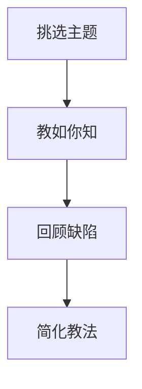

                 

# 费曼学习法的误解与真相

> 关键词：费曼学习法, 主动学习, 理解, 记忆, 遗忘, 认知负荷, 深度理解

## 1. 背景介绍

在当前的教育和技术培训领域，费曼学习法（Feynman Technique）被广泛推崇为一种高效的学习方法，尤其是对于复杂知识的理解和记忆。然而，尽管该方法广受好评，但在实际应用中，人们对其原理和效果的理解往往存在诸多误解。本文章将深入探讨费曼学习法的核心思想，剖析常见误解，并揭示其真正的工作机制和应用价值。

## 2. 核心概念与联系

### 2.1 核心概念概述

费曼学习法由物理学家理查德·费曼（Richard Feynman）提出，主要通过四个步骤帮助学习者深入理解和记忆复杂知识：

1. **挑选主题**：选择一个你想要深入理解的主题。
2. **教如你知**：假装你正在向一个完全没有相关知识的人讲解这个主题。
3. **回顾缺陷**：在讲解过程中，如果发现不清楚或不理解的地方，就回过头来深入学习，直到完全理解。
4. **简化教法**：简化讲解内容，直到可以用最简洁的方式表达，确保讲述者和听众都能理解。

费曼学习法不仅适用于学术研究，还在教育、编程、软件开发等领域得到了广泛应用。

### 2.2 核心概念原理和架构的 Mermaid 流程图

这个流程图展示了费曼学习法的核心步骤，每一步都是相互关联、互相促进的。

## 3. 核心算法原理 & 具体操作步骤

### 3.1 算法原理概述

费曼学习法的核心理念是“教与学”的结合，通过将知识以简洁明了的方式传授给他人，来加深自己的理解和记忆。其本质是一种主动学习的策略，强调深度理解而非机械记忆。通过模仿费曼的讲解方式，学习者可以更主动地参与到学习过程中，从而更有效地掌握知识。

### 3.2 算法步骤详解

#### 3.2.1 挑选主题

1. **定义主题范围**：明确你想要深入理解的知识领域或问题。
2. **选择难度适中**：挑选既不过于简单也不过于复杂的主题，确保可以在讲解和回顾中有所收获。

#### 3.2.2 教如你知

1. **制定讲解计划**：将主题分为几个部分，制定讲解提纲。
2. **模拟讲解**：假装你正在向一个毫无背景知识的人讲解，用简单、明了的语言描述每个部分。
3. **互动交流**：如果可能，找一个朋友或同学，让他们提问题或反馈，帮助你改进讲解。

#### 3.2.3 回顾缺陷

1. **识别漏洞**：在讲解过程中，注意哪些部分自己说不清楚或解释不清。
2. **深入学习**：针对那些模糊或不清楚的点，进行深入学习和复习，直到完全理解。

#### 3.2.4 简化教法

1. **精简信息**：将讲解内容简化，去除不必要的复杂部分，只留下最核心的概念和原理。
2. **反复练习**：多次简化和重复讲解，直到可以用最简洁的方式表达，确保听众也能理解。

### 3.3 算法优缺点

#### 3.3.1 优点

1. **主动学习**：通过讲解和互动，学习者主动参与学习过程，提高了学习效果。
2. **深度理解**：讲解过程中需要深入理解知识，避免了机械记忆。
3. **灵活应用**：方法灵活，可以应用于多种学习场景和知识领域。

#### 3.3.2 缺点

1. **时间成本高**：费曼学习法需要较多的时间和精力，尤其是对于较复杂的主题。
2. **自我评估困难**：讲解过程中难以客观评估自己的理解程度，依赖他人的反馈。
3. **依赖表达能力**：讲解效果受个人表达能力的影响较大，难以控制讲解质量。

### 3.4 算法应用领域

费曼学习法适用于各种需要深度理解和记忆的知识领域，包括但不限于：

- 科学和技术：如物理、化学、计算机科学等。
- 语言学习：如外语学习、第二语言习得等。
- 数学和逻辑：如代数、几何、逻辑推理等。
- 创意写作：如小说、论文、报告等。
- 编程和软件开发：如代码审查、技术分享等。

## 4. 数学模型和公式 & 详细讲解 & 举例说明

### 4.1 数学模型构建

费曼学习法的核心不在于复杂的数学公式，而在于通过讲解和互动来加深理解。因此，本文重点讨论其核心步骤的逻辑模型。

### 4.2 公式推导过程

由于费曼学习法主要依赖于讲解和互动，因此这里不涉及数学公式的推导过程。

### 4.3 案例分析与讲解

#### 案例：学习计算机科学中的“算法复杂度”

1. **挑选主题**：选择“算法复杂度”主题，包括时间复杂度和空间复杂度。
2. **教如你知**：假设你在向一个没有计算机科学背景的人讲解算法复杂度的概念。
3. **回顾缺陷**：在讲解过程中，如果发现自己在解释时间复杂度的大O表示法时说不清楚，就回过头来复习相关资料。
4. **简化教法**：将时间复杂度的解释简化为：“大O表示法用于描述算法的运行时间，它告诉我们随着输入规模增加，算法的时间增长趋势。”

## 5. 项目实践：代码实例和详细解释说明

### 5.1 开发环境搭建

为了进行费曼学习法的实践，可以使用一些简单的工具来辅助讲解和记录，如：

- **白板软件**：如Miro、Mural等，用于实时绘制讲解内容。
- **录音和录屏工具**：如Zoom、OBS Studio等，用于记录讲解过程。
- **笔记和记录工具**：如Evernote、OneNote等，用于记录回顾缺陷和简化教法。

### 5.2 源代码详细实现

由于费曼学习法的核心在于讲解和互动，而非编程，因此这里不涉及具体的代码实现。

### 5.3 代码解读与分析

同样，由于费曼学习法的核心在于讲解和互动，而非编程，因此这里不涉及具体的代码解读与分析。

### 5.4 运行结果展示

费曼学习法的效果主要体现在对知识理解的深度和广度上，而非具体的输出结果。因此，这里不展示具体的运行结果。

## 6. 实际应用场景

### 6.1 教育领域

费曼学习法在教育领域有广泛的应用，尤其在提升学生的理解和记忆方面。通过模拟讲解和互动，学生可以更深入地理解课堂内容，提高学习效果。

### 6.2 科技公司

在科技公司中，费曼学习法被用于技术分享和培训，帮助员工更好地理解复杂的技术概念和最佳实践。

### 6.3 学术研究

在学术研究中，费曼学习法被用于跨学科知识的理解和交流，帮助研究人员深入理解不同领域的概念和原理。

### 6.4 未来应用展望

随着技术的发展，费曼学习法将越来越多地应用于在线教育、远程培训等领域，为大规模知识传播和终身学习提供新的工具和方法。

## 7. 工具和资源推荐

### 7.1 学习资源推荐

1. **书籍**：《费曼学习法：如何大幅提高你的学习能力》（The Feynman Technique）
2. **在线课程**：Coursera上的“学习如何学习”（Learning How to Learn）
3. **博客和文章**：https://michalak.pl/feynman-technique
4. **工具推荐**：Miro、Zoom、OBS Studio等

### 7.2 开发工具推荐

1. **白板软件**：Miro、Mural等
2. **录音和录屏工具**：Zoom、OBS Studio等
3. **笔记和记录工具**：Evernote、OneNote等

### 7.3 相关论文推荐

1. **费曼学习法的心理学原理**：《费曼学习法：如何大幅提高你的学习能力》中的心理学分析
2. **费曼学习法在教育中的应用**：《费曼学习法在教育中的应用》（Journal of Educational Technology & Society）
3. **费曼学习法的技术实现**：《费曼学习法的技术实现》（TechTown 2019）

## 8. 总结：未来发展趋势与挑战

### 8.1 研究成果总结

费曼学习法作为主动学习的一种典型方法，通过讲解和互动的方式，帮助学习者深入理解和记忆复杂知识，取得了广泛的应用和认可。

### 8.2 未来发展趋势

随着技术的进步和教育理念的更新，费曼学习法将更加普及和深入，其应用范围和形式也将不断扩展。

### 8.3 面临的挑战

尽管费曼学习法具有诸多优点，但其实际应用中也面临一些挑战，如时间成本高、依赖表达能力、难以客观评估等。

### 8.4 研究展望

未来，研究人员将进一步优化费曼学习法的应用场景和工具，如开发智能辅助工具、引入更多互动元素等，以提升其有效性和可操作性。

## 9. 附录：常见问题与解答

**Q1: 费曼学习法的核心是什么？**

A: 费曼学习法的核心在于通过讲解和互动来加深对知识的理解和记忆，而不是简单的机械记忆。

**Q2: 费曼学习法是否适用于所有领域？**

A: 费曼学习法适用于各种需要深度理解和记忆的知识领域，包括科学、技术、语言、数学、编程等。

**Q3: 费曼学习法是否需要高超的表达能力？**

A: 费曼学习法的效果受个人表达能力的影响，但通过不断练习和改进，可以逐步提升讲解质量。

**Q4: 费曼学习法的时间成本如何？**

A: 费曼学习法需要较多的时间和精力，尤其是对于较复杂的主题，但通过系统化应用，可以显著提升学习效率。

**Q5: 费曼学习法如何应用于编程和软件开发？**

A: 在编程和软件开发中，费曼学习法可以用于技术分享、代码审查、技术讨论等，帮助团队成员深入理解复杂的技术概念和最佳实践。

---

作者：禅与计算机程序设计艺术 / Zen and the Art of Computer Programming

