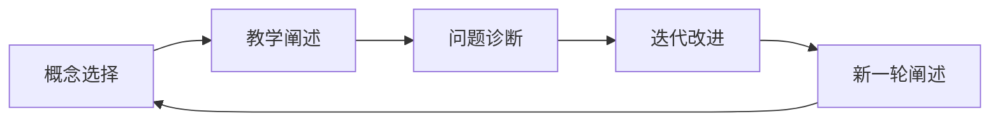

                 

# 费曼提问法:深入思考的利器

> 关键词：费曼提问法, 深入思考, 认知心理学, 自我教育, 技术博文, 编程技巧, 项目管理, 问题驱动

## 1. 背景介绍

费曼学习法（Feynman Technique），又称为费曼提问法，由诺贝尔物理学奖得主理查德·费曼（Richard Feynman）提出，旨在通过深入理解并教授他人，来提高自身对知识的掌握。费曼提问法不仅适用于物理学的学习，而且对各类知识的掌握同样有效。本文将详细介绍费曼提问法的基本概念、应用技巧，并结合实际案例，探讨其在技术博客撰写、项目管理、软件工程等领域的实践应用，帮助读者更深入地思考和掌握知识。

## 2. 核心概念与联系

### 2.1 核心概念概述

费曼提问法是一种基于主动学习的认知心理学方法，通过将知识以教与学的形式表达，不断深化理解，并解决可能出现的疑问。费曼提问法包含以下几个核心步骤：

1. **概念选择**：选取一个不熟悉的概念。
2. **教学阐述**：将概念用简洁的语言向虚拟的“初学者”或他人讲述，看是否能用简单的语言解释。
3. **问题诊断**：在阐述过程中，检查是否遇到不理解或说不清的地方。
4. **迭代改进**：针对不熟悉或不理解的地方，进一步研究和深入学习，直到能够清晰讲解为止。

### 2.2 核心概念原理和架构的 Mermaid 流程图

此流程图展示了费曼提问法的基本流程：选择一个概念 -> 教学阐述 -> 问题诊断 -> 迭代改进 -> 重新阐述，构成了一个自我教育、自我改进的闭环。

## 3. 核心算法原理 & 具体操作步骤

### 3.1 算法原理概述

费曼提问法的核心在于通过教学过程深化理解。当一个人试图将一个复杂的概念简化后向他人讲解时，会产生对概念的深刻理解，同时识别出自身的不足之处。费曼提问法通过主动获取反馈，不断迭代改进，最终实现对知识的深入掌握。

### 3.2 算法步骤详解

1. **概念选择**：
   - 选择一个不熟悉的领域或概念。可以通过阅读书籍、观看视频或与他人交流获取。
   - 选择一个能够激发兴趣的主题，使自己愿意深入学习。

2. **教学阐述**：
   - 尝试以简洁的语言向“初学者”（虚拟或真实的）解释这个概念。
   - 使用类比、比喻、图像等手段，让解释更加直观易懂。
   - 如果讲解过程中遇到障碍，先记录下来，然后继续讲解其他部分。

3. **问题诊断**：
   - 在讲解过程中，找出自己未能解释清楚的部分。
   - 如果他人能够提出更好的解释或例子，要认真听取并理解。

4. **迭代改进**：
   - 针对未解释清楚的部分，查找更详细的信息，再次尝试解释。
   - 可以查阅文献、与其他专家讨论、使用不同的方法重新理解。
   - 不断重复这个过程，直到能够清楚地讲解为止。

5. **重新阐述**：
   - 在深入理解后，尝试重新向他人解释，确保自己真正掌握了这个概念。
   - 可以再次提问、获取反馈、不断改进。

### 3.3 算法优缺点

**优点**：
- **深度理解**：通过教学阐述，深入理解概念，克服片面认知。
- **自我诊断**：问题诊断过程中，识别出自身的不足，精准定位知识盲点。
- **持续改进**：通过不断的迭代改进，逐步完善知识体系。

**缺点**：
- **时间投入**：需要投入大量时间来选择、学习和阐述概念。
- **信息过载**：在查找信息的过程中，可能会遇到信息过载问题，需要筛选有效信息。
- **初期困难**：对于初学者来说，可能一开始并不清楚如何应用费曼提问法，需要指导和练习。

### 3.4 算法应用领域

费曼提问法不仅适用于学术研究，还广泛应用于技术、商业、管理等多个领域。例如：

1. **技术博客撰写**：
   - 选择新技术或知识点作为概念，通过教学阐述来撰写博客。
   - 在撰写过程中，不断查找资料和案例，解决疑问，提升博客质量。

2. **项目管理**：
   - 选择项目管理中的关键概念或工具作为学习对象。
   - 向团队成员或同事讲解项目管理知识，通过反馈不断改进。

3. **软件工程**：
   - 选择编程语言或开发工具中的新特性作为学习对象。
   - 通过编程练习和教学阐述，加深理解，提高编程技能。

## 4. 数学模型和公式 & 详细讲解 & 举例说明

### 4.1 数学模型构建

费曼提问法不需要复杂的数学模型，主要关注知识的结构化表达和深入理解。其核心在于将知识分解成可理解的部分，并通过教学和反馈不断改进。

### 4.2 公式推导过程

尽管费曼提问法不涉及数学公式，但可以通过数学模型类比来理解其原理。例如，费曼提问法类似于机器学习中的迭代优化算法，通过不断的迭代训练，逐步逼近最优解。

### 4.3 案例分析与讲解

假设要学习机器学习中的决策树算法。通过费曼提问法，可以这样进行操作：

1. **概念选择**：决策树算法。
2. **教学阐述**：尝试向“初学者”解释决策树的基本原理和步骤。
3. **问题诊断**：如果发现初学者无法理解，指出问题所在，例如“叶节点的分割标准是什么？”。
4. **迭代改进**：查找资料，理解叶节点分割标准（如信息增益、基尼不纯度等）。
5. **重新阐述**：再次向“初学者”讲解决策树算法，确保其理解。

## 5. 项目实践：代码实例和详细解释说明

### 5.1 开发环境搭建

费曼提问法的应用主要涉及知识的理解和阐述，不涉及代码实现。因此，环境搭建相对简单。

1. **文本编辑器**：选择如Visual Studio Code、Atom等文本编辑器。
2. **知识管理工具**：如Anki、Notion等，用于记录概念、笔记和问题。

### 5.2 源代码详细实现

由于费曼提问法不涉及代码，故此部分为空。

### 5.3 代码解读与分析

同样，由于不涉及代码实现，故此部分也为空。

### 5.4 运行结果展示

由于不涉及代码，故此部分为空。

## 6. 实际应用场景

### 6.1 技术博客撰写

费曼提问法在技术博客撰写中极为有效。通过向虚拟的读者讲解技术概念，不断查找资料和理解问题，提升文章的深度和广度。

### 6.2 项目管理

项目管理中的风险管理、敏捷开发等概念，通过费曼提问法不断学习，提升项目管理能力。

### 6.3 软件工程

学习新的编程语言或框架时，通过费曼提问法，加深理解，提高编码技能。

### 6.4 未来应用展望

费曼提问法未来将在更多领域得到应用，成为一种通用的自我学习工具。例如，在金融、医疗、法律等专业领域，通过深入理解和讲解专业概念，提升从业者的知识水平。

## 7. 工具和资源推荐

### 7.1 学习资源推荐

1. **《费曼学习法》书籍**：
   - 书籍详细介绍了费曼学习法的基本原理和实践步骤。
   - 这本书适合所有希望提升学习效果的人士阅读。

2. **YouTube频道**：
   - 费曼学习法的实践者制作的视频教程，生动有趣。
   - 观看这些视频，有助于更好地理解费曼提问法的应用。

### 7.2 开发工具推荐

1. **文本编辑器**：
   - Visual Studio Code：功能强大，插件丰富。
   - Atom：简洁易用，支持Markdown格式。

2. **知识管理工具**：
   - Anki：记忆卡片应用，适合长期记忆。
   - Notion：多功能笔记应用，支持多平台同步。

### 7.3 相关论文推荐

1. **费曼学习法的心理学研究**：
   - 探索费曼学习法在心理学中的应用，理解其原理。
   - 通过理解心理学背景，可以更深入地掌握费曼提问法。

## 8. 总结：未来发展趋势与挑战

### 8.1 研究成果总结

费曼提问法通过教学和反馈不断深化理解，已成为自我教育的重要方法。其在技术博客、项目管理、软件工程等领域的应用，已经展现出巨大的潜力。

### 8.2 未来发展趋势

1. **多领域应用**：费曼提问法将不断扩展到更多领域，提升从业者的知识水平。
2. **技术改进**：结合AI技术，实现智能化的知识管理和学习建议。
3. **教育普及**：在教育领域推广费曼提问法，提升学生的学习效果。

### 8.3 面临的挑战

1. **时间管理**：在繁忙的工作中，如何合理分配时间进行自我学习。
2. **知识筛选**：在信息过载的时代，如何高效筛选和利用知识资源。
3. **应用推广**：如何引导更多人了解和应用费曼提问法。

### 8.4 研究展望

1. **智能化工具**：开发智能化的知识管理系统，辅助费曼提问法的应用。
2. **多语言支持**：将费曼提问法推广到更多语言，提升全球知识共享。
3. **跨学科融合**：将费曼提问法与其他学科的认知方法相结合，形成综合性的学习策略。

## 9. 附录：常见问题与解答

**Q1：费曼提问法是否适用于所有领域？**

A: 费曼提问法适用于大多数领域，尤其是需要深入理解知识的概念或问题。但对于一些依赖实践经验的领域，如医学、法律等，可能需要进行更多的实际操作和实践。

**Q2：费曼提问法如何应用于技术博客撰写？**

A: 在技术博客撰写中，选取一个新技术或知识点作为概念，通过教学阐述来撰写文章。在撰写过程中，不断查找资料和案例，解决疑问，提升文章深度。

**Q3：如何高效使用费曼提问法？**

A: 设定一个明确的目标，选择有价值的概念，采用简洁的语言阐述，不断寻找问题并改进。使用知识管理工具记录和跟踪进展，确保学习过程有条不紊。

**Q4：费曼提问法在项目管理中的应用有什么优势？**

A: 费曼提问法通过不断学习和反馈，提升项目管理的知识水平。通过讲解项目管理知识，发现团队中的知识盲点，促进团队协作和知识共享。

---

作者：禅与计算机程序设计艺术 / Zen and the Art of Computer Programming

