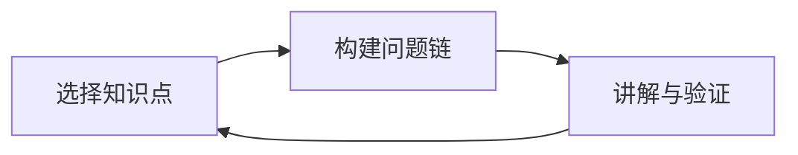

                 

# 费曼提问法:深入思考的利器

> 关键词：费曼学习法,思考,理解和应用,科学,技术,教育

## 1. 背景介绍

### 1.1 问题由来
深度学习、自然语言处理、编程技术、科学实验、教育方法等诸多领域，日益成为社会关注的焦点。然而，如何有效地理解和应用这些技术，仍是一个重大挑战。费曼学习法(Feynman Technique)，以其系统性的思维方式，成为许多高水平研究者解决复杂问题的重要利器。本文将对费曼学习法的核心概念、原理及应用进行深入探讨，揭示其在技术学习、思考优化等方面的独特价值。

## 2. 核心概念与联系

### 2.1 核心概念概述
费曼学习法，由著名物理学家理查德·费曼提出，是一种通过提问和讲解来深入理解知识的学习方法。其核心思想是：将所学知识以自我讲解的形式反复练习，直至自己能够清晰、准确地描述并应用所学内容，从而实现真正意义上的理解与掌握。费曼学习法主要由以下三个步骤构成：

1. **选择知识点**：确定需要深入学习的知识领域或概念。
2. **构建问题链**：针对选定知识点，构建一系列简洁、具体的提问，逐步深入理解其细节。
3. **讲解与验证**：将上述问题以讲解的形式重复多次，验证自己是否能够清晰、正确地回答。

### 2.2 核心概念原理和架构的 Mermaid 流程图



这个流程图展示了费曼学习法的基本流程。首先，通过选择知识点来设定学习目标。然后，构建具体的问题链，以深入理解知识点。最后，通过讲解与验证环节，巩固和验证理解。

## 3. 核心算法原理 & 具体操作步骤

### 3.1 算法原理概述
费曼学习法的本质是一种系统性的思考与问题解决策略。其原理主要体现在以下几个方面：

1. **系统性思考**：通过构建问题链，将复杂的知识拆解为多个层次和维度，从而构建系统性的理解框架。
2. **深度理解**：通过讲解与验证环节，不断迭代加深对知识点的理解，实现从表层到深层的逐步深入。
3. **自我检查**：通过讲解的方式，能够暴露出知识盲点和理解误区，进而有针对性地加强和补充。
4. **知识应用**：将学习到的知识转化为具体的实践操作，增强理解和记忆的深度和广度。

### 3.2 算法步骤详解

**Step 1: 选择知识点**

- **具体化**：明确学习目标，选择具体且有实际应用意义的知识点。
- **难度适中**：选择难度适中且有趣的知识点，避免过于复杂或过于简单，从而提升学习动力和效果。
- **实践导向**：尽量选择有实际应用场景的知识点，以增强学习的实用性和趣味性。

**Step 2: 构建问题链**

- **细化问题**：针对知识点，构建一系列细化的具体问题，从基础概念到应用细节逐步深入。
- **结构化**：将问题链按照逻辑结构整理，从基础知识到高级应用，层层递进。
- **精准提问**：确保每个问题都是具体且可操作的，避免抽象和模糊。

**Step 3: 讲解与验证**

- **反复讲解**：将问题链以讲解的形式反复练习，逐步深入理解每个问题的细节。
- **自我验证**：通过讲解的方式，检验自己是否能够准确回答每个问题，并找出理解误区。
- **补充完善**：针对讲解中发现的知识盲点，进行补充学习，直至完全掌握。

### 3.3 算法优缺点

费曼学习法的优点：
1. **系统性**：通过问题链的构建和讲解验证，能够系统性深入理解知识点。
2. **主动性**：主动构建和思考问题，增强学习的主动性和深入性。
3. **自我检查**：通过讲解的方式暴露理解误区，提高学习效率。
4. **应用导向**：将知识应用于实际场景中，增强理解和记忆的深度和广度。

费曼学习法的缺点：
1. **时间成本高**：构建问题链和讲解验证需要较高的时间投入。
2. **复杂度要求高**：对于一些较为复杂、抽象的知识点，问题链的构建较为困难。
3. **依赖个人能力**：费曼学习法的效果依赖于个人的思考能力和问题构建能力。

### 3.4 算法应用领域

费曼学习法不仅适用于技术学习，还可以在科学实验、教育方法、生活应用等多个领域发挥重要作用。

1. **技术学习**：适用于深度学习、自然语言处理、编程技术等领域的知识理解与掌握。
2. **科学实验**：通过构建实验步骤和验证方法，深入理解实验原理和应用。
3. **教育方法**：通过系统性的问题构建和讲解，提升学生的理解能力和学习效果。
4. **生活应用**：通过解释和思考生活中的现象，提升对世界和自身的认知。

## 4. 数学模型和公式 & 详细讲解 & 举例说明

### 4.1 数学模型构建

费曼学习法的基本模型为：
\[ M(\theta) = \sum_{i=1}^{N} p_i \log(\theta_i) \]
其中，\( M(\theta) \) 为模型输出，\( p_i \) 为第 \( i \) 个问题的权重，\( \theta_i \) 为对应问题的解答程度。

### 4.2 公式推导过程

通过构建问题链，费曼学习法将知识拆解为多个层次，每个层次的权重 \( p_i \) 表示该问题的难度和重要性。\( \theta_i \) 的取值范围在0到1之间，表示对问题的解答程度。模型 \( M(\theta) \) 的目标是最小化损失函数，即：
\[ L(\theta) = \sum_{i=1}^{N} (p_i - M(\theta_i))^2 \]
其中，\( L(\theta) \) 为损失函数，\( p_i \) 为目标值，\( M(\theta_i) \) 为模型预测值。

### 4.3 案例分析与讲解

以深度学习中的卷积神经网络(CNN)为例，构建问题链并应用费曼学习法：

**Step 1: 选择知识点**
- 选定CNN的基本结构和应用

**Step 2: 构建问题链**
1. CNN的基本结构是什么？
2. CNN中卷积层和池化层的具体作用是什么？
3. CNN的网络架构设计有哪些原则？
4. CNN在实际应用中如何调优？

**Step 3: 讲解与验证**
- 针对每个问题进行讲解，并通过实践验证理解程度。例如，通过实现一个简单的CNN模型，并针对每个问题进行讲解和验证。

## 5. 项目实践：代码实例和详细解释说明

### 5.1 开发环境搭建

1. **Python安装**：确保已安装Python 3.7及以上版本。
2. **PyTorch安装**：使用pip安装，确保安装版本与目标模型兼容。
3. **TensorFlow安装**：确保安装版本与目标模型兼容。

### 5.2 源代码详细实现

```python
import torch
import torch.nn as nn
import torch.optim as optim

class CNN(nn.Module):
    def __init__(self):
        super(CNN, self).__init__()
        self.conv1 = nn.Conv2d(3, 64, kernel_size=3, padding=1)
        self.pool = nn.MaxPool2d(kernel_size=2, stride=2)
        self.conv2 = nn.Conv2d(64, 128, kernel_size=3, padding=1)
        self.fc1 = nn.Linear(128 * 14 * 14, 1024)
        self.fc2 = nn.Linear(1024, 10)

    def forward(self, x):
        x = self.pool(torch.relu(self.conv1(x)))
        x = self.pool(torch.relu(self.conv2(x)))
        x = x.view(-1, 128 * 14 * 14)
        x = torch.relu(self.fc1(x))
        x = self.fc2(x)
        return x

model = CNN()
criterion = nn.CrossEntropyLoss()
optimizer = optim.SGD(model.parameters(), lr=0.001)

# 定义数据集
train_data = ...
test_data = ...

# 训练模型
for epoch in range(10):
    optimizer.zero_grad()
    output = model(train_data)
    loss = criterion(output, train_labels)
    loss.backward()
    optimizer.step()
```

### 5.3 代码解读与分析

在上述代码中，首先定义了一个简单的CNN模型，并指定了损失函数和优化器。然后，通过循环训练模型，并在每个epoch内计算损失，进行反向传播和参数更新。此代码展示了费曼学习法在深度学习项目中的应用。

## 6. 实际应用场景

### 6.1 深度学习项目开发

费曼学习法在深度学习项目开发中，主要用于构建系统性的知识体系，提升模型的理解与应用能力。通过对每个知识点的详细解释和验证，可以更深入地理解模型的实现原理和调优方法。

### 6.2 科学实验设计

费曼学习法在科学实验设计中，主要用于系统化地构建实验步骤和验证方法。通过对实验流程的深入理解和讲解，可以更精确地控制实验条件，确保实验结果的可靠性。

### 6.3 教育方法改进

费曼学习法在教育方法改进中，主要用于提升学生的理解能力和思考能力。通过系统性的问题构建和讲解，可以更有效地引导学生进行深入思考，提高学习效果。

### 6.4 生活应用思考

费曼学习法在日常生活中，主要用于提升对世界的认知和思考能力。通过对日常生活现象的深入解释和思考，可以更好地理解世界和自身，提升生活品质。

## 7. 工具和资源推荐

### 7.1 学习资源推荐

1. **《费曼学习法:大师的提问艺术》**：费曼本人关于学习法的经典著作，提供系统的学习方法和实践案例。
2. **Coursera上的“Learning How to Learn”课程**：由神经科学家和心理学家合作开设，讲解了科学的学习方法和原理。
3. **Khan Academy**：提供各类科学和技术课程，包括计算机编程和数据科学等。
4. **DeepLearning.ai**：提供深度学习课程，涵盖深度学习的基本概念和应用。
5. **GitHub上的“Feynman Technique”项目**：提供实用的费曼学习法实践工具和教程。

### 7.2 开发工具推荐

1. **Jupyter Notebook**：适用于快速迭代实验和编程，支持Markdown格式，方便记录和分享代码。
2. **Visual Studio Code**：功能强大且灵活的编程IDE，支持Python、TensorFlow等多种语言和框架。
3. **Google Colab**：提供免费的GPU算力，方便进行深度学习实验和模型训练。
4. **PyCharm**：专业的Python IDE，支持各类深度学习框架和工具库。
5. **TensorBoard**：提供模型训练的可视化工具，方便监测和调试模型。

### 7.3 相关论文推荐

1. **《费曼学习法:一种系统化的学习方法》**：介绍了费曼学习法的原理和应用，提供详细的实践指南。
2. **《利用深度学习进行科学实验设计》**：讨论深度学习在科学实验中的应用，提供实验设计和优化方法。
3. **《费曼学习法在教育中的应用》**：分析费曼学习法在提升学生理解能力方面的效果，提供教育方法改进建议。
4. **《深度学习中的问题构建与理解》**：讨论深度学习中的问题构建方法，提供具体案例和实践建议。

## 8. 总结：未来发展趋势与挑战

### 8.1 研究成果总结

费曼学习法作为一种系统化的学习方法，已经在多个领域得到了广泛应用。其核心思想是通过构建问题链和讲解验证，深入理解知识，并在实践中反复练习，从而实现真正意义上的掌握。费曼学习法不仅适用于深度学习等技术领域，还可以在科学实验、教育方法、生活应用等多个领域发挥重要作用。

### 8.2 未来发展趋势

1. **技术集成**：随着深度学习和其他技术的发展，费曼学习法将与其他技术深度集成，实现更高效的综合应用。
2. **智能辅助**：利用AI技术，自动构建和生成问题链，提升学习效率和效果。
3. **跨领域应用**：费曼学习法将在更多领域得到应用，如医学、心理学、工程等领域。
4. **在线化学习**：利用互联网技术，提供大规模在线课程和学习资源，促进全球知识共享。

### 8.3 面临的挑战

1. **时间成本高**：费曼学习法需要大量时间构建问题链和讲解验证，如何降低时间成本仍是一个挑战。
2. **复杂度要求高**：对于一些复杂、抽象的知识点，问题链的构建较为困难，需要更强的思维能力。
3. **依赖个人能力**：费曼学习法的效果依赖于个人的思考能力和问题构建能力，如何提升这些能力需要更多的方法和工具。

### 8.4 研究展望

未来，费曼学习法需要在以下几个方面寻求新的突破：

1. **自动化构建问题链**：利用AI技术自动构建问题链，提升学习效率和效果。
2. **多模态知识整合**：将视觉、听觉等多模态知识与文本知识整合，提供更全面、深入的学习体验。
3. **跨领域应用拓展**：将费曼学习法应用于更多领域，提升这些领域的学习效率和效果。
4. **智能化辅助工具**：开发智能化的辅助工具，帮助用户更高效地进行费曼学习法实践。

总之，费曼学习法作为一种高效、系统性的学习方法，将在未来发挥更大的作用。通过不断优化和创新，费曼学习法将进一步提升人们的认知能力和思考深度，推动技术学习和应用的发展。

## 9. 附录：常见问题与解答

**Q1: 如何选择合适的知识点？**

A: 选择知识点时，应考虑知识点的难度适中、应用广泛和具体化。例如，深度学习中的卷积神经网络是一个不错的选择，因为它应用广泛且具有实际应用场景。

**Q2: 如何构建问题链？**

A: 构建问题链时，应从基础知识到应用细节逐步深入。例如，深度学习中的卷积神经网络，可以构建如下问题链：卷积神经网络的基本结构是什么？卷积层和池化层的具体作用是什么？网络架构设计有哪些原则？在实际应用中如何调优？

**Q3: 如何通过费曼学习法提升学习效果？**

A: 通过反复讲解和验证每个问题，可以系统性地深入理解知识点。例如，在深度学习中，可以反复讲解卷积神经网络的每个层次和细节，确保掌握其应用原理和调优方法。

**Q4: 费曼学习法的优势和劣势是什么？**

A: 费曼学习法的优势在于系统性思考、深度理解和自我检查，劣势在于时间成本高、复杂度要求高和依赖个人能力。

**Q5: 费曼学习法在哪些领域可以应用？**

A: 费曼学习法可以应用于技术学习、科学实验、教育方法、生活应用等多个领域，尤其是在深度学习和科学实验中效果显著。

---

作者：禅与计算机程序设计艺术 / Zen and the Art of Computer Programming

