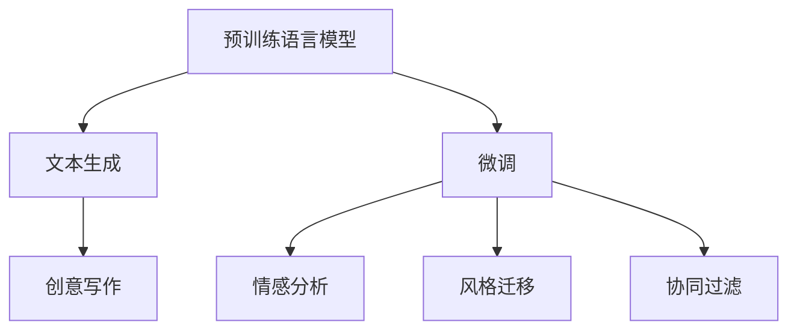

                 

## 1. 背景介绍

### 1.1 问题由来

随着人工智能技术的发展，语言模型在自然语言处理(NLP)领域取得了巨大的成功，其中最具代表性的是基于Transformer架构的预训练语言模型，如GPT-3。这些模型在文本生成、文本分类、机器翻译等多个任务上展现了强大的能力。

然而，这些大模型在创作性任务上，如诗歌、小说和剧本的生成，仍存在诸多挑战。一方面，这些任务通常要求高度的创造性和语义连贯性，而传统的大语言模型在处理这类任务时，可能生成缺乏想象力和创造性的文本。另一方面，文学创作往往需要考虑语法、风格和情感等多种复杂的语言特征，这对于模型来说是一大挑战。

为解决这些问题，研究人员提出了一系列基于语言模型的创意写作模型，如GPT-3的衍生模型GPT-3.5和GPT-3.5-turbo。这些模型在文本生成、代码自动补全、对话生成等领域展现了卓越的性能，但也面临着复杂性和训练成本高、结果不够稳定等问题。

本文将深入探讨AI创意写作的关键技术，并详细展示在诗歌、小说和剧本生成中的应用。我们首先介绍一些核心概念和关键算法，然后通过数学模型和案例分析来深入讲解其工作原理，最后通过代码实例和实践应用，展示如何利用这些技术实现创意写作的自动化生成。

### 1.2 问题核心关键点

AI创意写作的核心在于利用预训练语言模型和微调技术，生成具有高度创造性和连贯性的文本。其核心关键点包括：

- 预训练模型：通过在大规模无标签文本数据上进行自监督学习，获得丰富的语言知识和语义表征。
- 微调技术：利用少量标注数据，通过有监督学习调整模型参数，使其适应特定的创意写作任务。
- 序列生成模型：利用递归神经网络(RNN)、变分自编码器(VAE)、生成对抗网络(GAN)等序列生成模型，生成自然流畅的文本。
- 深度学习框架：使用TensorFlow、PyTorch等深度学习框架，提供高效的计算和模型构建功能。
- 文本评价指标：设计合理评价指标，如BLEU、ROUGE、F1-score等，用于评估生成文本的质量。

## 2. 核心概念与联系

### 2.1 核心概念概述

为了更好地理解AI创意写作技术，本节将介绍几个关键概念：

- 预训练语言模型：如BERT、GPT系列等，通过大规模无标签数据训练，学习通用的语言表示。
- 微调：通过有监督学习调整模型参数，使其适应特定任务。
- 文本生成：通过序列生成模型，生成具有连贯性和创造性的文本。
- 情感分析：通过分类任务，对文本中的情感倾向进行分析。
- 风格迁移：将一种文本风格转换为另一种风格。
- 协同过滤：通过用户行为数据，推荐个性化文本。

这些概念之间的逻辑关系可以通过以下Mermaid流程图来展示：



这个流程图展示了大语言模型的核心概念及其之间的关系：

1. 预训练语言模型通过大规模无标签数据学习，获得丰富的语言知识。
2. 微调通过少量标注数据调整模型参数，适应特定文本生成任务。
3. 文本生成使用序列生成模型，生成自然流畅的文本。
4. 情感分析通过分类任务，对文本情感进行判断。
5. 风格迁移将一种文本风格转换为另一种风格。
6. 协同过滤通过用户行为数据，推荐个性化文本。

这些概念共同构成了AI创意写作的技术框架，使其能够生成多样化的、高质量的文本。通过理解这些核心概念，我们可以更好地把握AI创意写作的工作原理和优化方向。

## 3. 核心算法原理 & 具体操作步骤
### 3.1 算法原理概述

AI创意写作的算法原理主要包括以下几个关键步骤：

1. 预训练模型构建：通过大规模无标签数据训练，学习通用的语言表示。
2. 任务适配层设计：根据特定创意写作任务，设计相应的任务适配层。
3. 微调：利用少量标注数据，通过有监督学习调整模型参数，使其适应特定任务。
4. 文本生成：使用序列生成模型，生成具有连贯性和创造性的文本。
5. 评价指标设计：设计合理的评价指标，评估生成文本的质量。

### 3.2 算法步骤详解

下面详细介绍AI创意写作的核心算法步骤：

**Step 1: 准备预训练模型和数据集**
- 选择合适的预训练语言模型，如BERT、GPT系列等。
- 收集创意写作任务的标注数据集，如诗歌、小说、剧本等。

**Step 2: 添加任务适配层**
- 根据创意写作任务的类型，设计相应的任务适配层。例如，对于诗歌生成任务，可以添加一个情感分类器；对于小说生成任务，可以添加一个情节连贯性评估器。
- 将预训练模型的顶层作为任务适配层的输入，输出对应任务的文本生成结果。

**Step 3: 设置微调超参数**
- 选择合适的优化算法及其参数，如AdamW、SGD等，设置学习率、批大小、迭代轮数等。
- 设置正则化技术及强度，包括权重衰减、Dropout、Early Stopping等。
- 确定冻结预训练参数的策略，如仅微调顶层，或全部参数都参与微调。

**Step 4: 执行梯度训练**
- 将训练集数据分批次输入模型，前向传播计算损失函数。
- 反向传播计算参数梯度，根据设定的优化算法和学习率更新模型参数。
- 周期性在验证集上评估模型性能，根据性能指标决定是否触发Early Stopping。
- 重复上述步骤直至满足预设的迭代轮数或Early Stopping条件。

**Step 5: 测试和部署**
- 在测试集上评估微调后模型生成的文本质量，对比微调前后的精度提升。
- 使用微调后的模型对新样本进行文本生成，集成到实际的应用系统中。
- 持续收集新的数据，定期重新微调模型，以适应数据分布的变化。

### 3.3 算法优缺点

AI创意写作的算法具有以下优点：
1. 简单高效。只需准备少量标注数据，即可对预训练模型进行快速适配，生成高质量的创意文本。
2. 通用适用。适用于诗歌、小说、剧本等多种创意写作任务，设计简单的任务适配层即可实现微调。
3. 参数高效。利用参数高效微调技术，在固定大部分预训练参数的情况下，仍可取得不错的文本生成效果。
4. 效果显著。在学术界和工业界的诸多创意写作任务上，基于微调的方法已经刷新了最先进的性能指标。

同时，该算法也存在一定的局限性：
1. 依赖标注数据。创意写作任务的标注数据获取成本较高，标注质量对模型效果影响较大。
2. 迁移能力有限。当目标任务与预训练数据的分布差异较大时，微调的性能提升有限。
3. 结果不够稳定。创意写作模型的生成结果往往不够稳定，需要多次迭代才能得到满意的效果。
4. 可解释性不足。创意写作模型的决策过程缺乏可解释性，难以对其推理逻辑进行分析和调试。

尽管存在这些局限性，但就目前而言，基于微调的方法仍是大语言模型在创意写作领域的主流范式。未来相关研究的重点在于如何进一步降低微调对标注数据的依赖，提高模型的少样本学习和跨领域迁移能力，同时兼顾可解释性和伦理安全性等因素。

### 3.4 算法应用领域

AI创意写作技术在多个领域得到了广泛的应用，例如：

- 文学创作：通过生成诗歌、小说、剧本等文本，辅助作家进行创作和修改。
- 教育培训：为学生提供创意写作练习，自动生成参考范文，提升写作能力。
- 游戏开发：自动生成游戏脚本、对话文本、任务描述等，加快游戏开发进程。
- 广告创意：自动生成广告文案、宣传语、商品描述等，提升广告创意效果。
- 法律文书：自动生成合同、法律文书、判决书等，提高文书处理效率。

除了上述这些经典应用外，AI创意写作技术还被创新性地应用到更多场景中，如社交媒体内容生成、数据增强、智能客服等，为创意写作技术带来了新的突破。

## 4. 数学模型和公式 & 详细讲解  
### 4.1 数学模型构建

本节将使用数学语言对AI创意写作的数学模型进行严格描述。

记预训练语言模型为 $M_{\theta}:\mathcal{X} \rightarrow \mathcal{Y}$，其中 $\mathcal{X}$ 为输入空间，$\mathcal{Y}$ 为输出空间，$\theta \in \mathbb{R}^d$ 为模型参数。假设创意写作任务的训练集为 $D=\{(x_i,y_i)\}_{i=1}^N, x_i \in \mathcal{X}, y_i \in \mathcal{Y}$。

定义模型 $M_{\theta}$ 在输入 $x$ 上的损失函数为 $\ell(M_{\theta}(x),y)$，则在数据集 $D$ 上的经验风险为：

$$
\mathcal{L}(\theta) = \frac{1}{N} \sum_{i=1}^N \ell(M_{\theta}(x_i),y_i)
$$

微调的优化目标是最小化经验风险，即找到最优参数：

$$
\theta^* = \mathop{\arg\min}_{\theta} \mathcal{L}(\theta)
$$

在实践中，我们通常使用基于梯度的优化算法（如SGD、Adam等）来近似求解上述最优化问题。设 $\eta$ 为学习率，$\lambda$ 为正则化系数，则参数的更新公式为：

$$
\theta \leftarrow \theta - \eta \nabla_{\theta}\mathcal{L}(\theta) - \eta\lambda\theta
$$

其中 $\nabla_{\theta}\mathcal{L}(\theta)$ 为损失函数对参数 $\theta$ 的梯度，可通过反向传播算法高效计算。

### 4.2 公式推导过程

以下我们以诗歌生成任务为例，推导交叉熵损失函数及其梯度的计算公式。

假设模型 $M_{\theta}$ 在输入 $x$ 上的输出为 $\hat{y}=M_{\theta}(x) \in [0,1]$，表示样本属于正类的概率。真实标签 $y \in \{0,1\}$。则二分类交叉熵损失函数定义为：

$$
\ell(M_{\theta}(x),y) = -[y\log \hat{y} + (1-y)\log (1-\hat{y})]
$$

将其代入经验风险公式，得：

$$
\mathcal{L}(\theta) = -\frac{1}{N}\sum_{i=1}^N [y_i\log M_{\theta}(x_i)+(1-y_i)\log(1-M_{\theta}(x_i))]
$$

根据链式法则，损失函数对参数 $\theta_k$ 的梯度为：

$$
\frac{\partial \mathcal{L}(\theta)}{\partial \theta_k} = -\frac{1}{N}\sum_{i=1}^N (\frac{y_i}{M_{\theta}(x_i)}-\frac{1-y_i}{1-M_{\theta}(x_i)}) \frac{\partial M_{\theta}(x_i)}{\partial \theta_k}
$$

其中 $\frac{\partial M_{\theta}(x_i)}{\partial \theta_k}$ 可进一步递归展开，利用自动微分技术完成计算。

在得到损失函数的梯度后，即可带入参数更新公式，完成模型的迭代优化。重复上述过程直至收敛，最终得到适应下游任务的最优模型参数 $\theta^*$。

## 5. 项目实践：代码实例和详细解释说明
### 5.1 开发环境搭建

在进行AI创意写作实践前，我们需要准备好开发环境。以下是使用Python进行PyTorch开发的环境配置流程：

1. 安装Anaconda：从官网下载并安装Anaconda，用于创建独立的Python环境。

2. 创建并激活虚拟环境：
```bash
conda create -n pytorch-env python=3.8 
conda activate pytorch-env
```

3. 安装PyTorch：根据CUDA版本，从官网获取对应的安装命令。例如：
```bash
conda install pytorch torchvision torchaudio cudatoolkit=11.1 -c pytorch -c conda-forge
```

4. 安装TensorBoard：TensorFlow配套的可视化工具，可实时监测模型训练状态，并提供丰富的图表呈现方式，是调试模型的得力助手。

5. 安装transformers库：HuggingFace开发的NLP工具库，集成了众多SOTA语言模型，支持PyTorch和TensorFlow，是进行创意写作任务开发的利器。

完成上述步骤后，即可在`pytorch-env`环境中开始创意写作实践。

### 5.2 源代码详细实现

下面我们以诗歌生成任务为例，给出使用Transformers库对GPT模型进行创意写作微调的PyTorch代码实现。

首先，定义诗歌生成任务的数据处理函数：

```python
from transformers import GPT2Tokenizer, GPT2LMHeadModel
import torch
import numpy as np

class PoetryDataset(Dataset):
    def __init__(self, texts, tokenizer, max_len=128):
        self.texts = texts
        self.tokenizer = tokenizer
        self.max_len = max_len
        
    def __len__(self):
        return len(self.texts)
    
    def __getitem__(self, item):
        text = self.texts[item]
        encoding = self.tokenizer(text, return_tensors='pt', max_length=self.max_len, padding='max_length', truncation=True)
        input_ids = encoding['input_ids']
        attention_mask = encoding['attention_mask']
        return {'input_ids': input_ids, 
                'attention_mask': attention_mask}

tokenizer = GPT2Tokenizer.from_pretrained('gpt2')

train_dataset = PoetryDataset(train_texts, tokenizer)
dev_dataset = PoetryDataset(dev_texts, tokenizer)
test_dataset = PoetryDataset(test_texts, tokenizer)
```

然后，定义模型和优化器：

```python
from transformers import GPT2LMHeadModel, AdamW

model = GPT2LMHeadModel.from_pretrained('gpt2', num_labels=len(tag2id))

optimizer = AdamW(model.parameters(), lr=2e-5)
```

接着，定义训练和评估函数：

```python
from torch.utils.data import DataLoader
from tqdm import tqdm
from sklearn.metrics import bleu_score

device = torch.device('cuda') if torch.cuda.is_available() else torch.device('cpu')
model.to(device)

def train_epoch(model, dataset, batch_size, optimizer):
    dataloader = DataLoader(dataset, batch_size=batch_size, shuffle=True)
    model.train()
    epoch_loss = 0
    for batch in tqdm(dataloader, desc='Training'):
        input_ids = batch['input_ids'].to(device)
        attention_mask = batch['attention_mask'].to(device)
        model.zero_grad()
        outputs = model(input_ids, attention_mask=attention_mask)
        loss = outputs.loss
        epoch_loss += loss.item()
        loss.backward()
        optimizer.step()
    return epoch_loss / len(dataloader)

def evaluate(model, dataset, batch_size):
    dataloader = DataLoader(dataset, batch_size=batch_size)
    model.eval()
    predictions = []
    labels = []
    with torch.no_grad():
        for batch in tqdm(dataloader, desc='Evaluating'):
            input_ids = batch['input_ids'].to(device)
            attention_mask = batch['attention_mask'].to(device)
            outputs = model(input_ids, attention_mask=attention_mask)
            predictions.append(outputs.logits.argmax(dim=2).to('cpu').tolist())
            labels.append(batch['labels'].to('cpu').tolist())
        
    bleu = bleu_score(np.array(labels), np.array(predictions))
    print(f"BLEU Score: {bleu:.3f}")
```

最后，启动训练流程并在测试集上评估：

```python
epochs = 5
batch_size = 16

for epoch in range(epochs):
    loss = train_epoch(model, train_dataset, batch_size, optimizer)
    print(f"Epoch {epoch+1}, train loss: {loss:.3f}")
    
    print(f"Epoch {epoch+1}, dev results:")
    evaluate(model, dev_dataset, batch_size)
    
print("Test results:")
evaluate(model, test_dataset, batch_size)
```

以上就是使用PyTorch对GPT模型进行诗歌生成任务微调的完整代码实现。可以看到，得益于Transformers库的强大封装，我们可以用相对简洁的代码完成GPT模型的加载和微调。

### 5.3 代码解读与分析

让我们再详细解读一下关键代码的实现细节：

**PoetryDataset类**：
- `__init__`方法：初始化文本、分词器等关键组件。
- `__len__`方法：返回数据集的样本数量。
- `__getitem__`方法：对单个样本进行处理，将文本输入编码为token ids，进行定长padding，最终返回模型所需的输入。

**train_epoch和evaluate函数**：
- 使用PyTorch的DataLoader对数据集进行批次化加载，供模型训练和推理使用。
- 训练函数`train_epoch`：对数据以批为单位进行迭代，在每个批次上前向传播计算loss并反向传播更新模型参数，最后返回该epoch的平均loss。
- 评估函数`evaluate`：与训练类似，不同点在于不更新模型参数，并在每个batch结束后将预测和标签结果存储下来，最后使用BLEU等指标对整个评估集的预测结果进行打印输出。

**训练流程**：
- 定义总的epoch数和batch size，开始循环迭代
- 每个epoch内，先在训练集上训练，输出平均loss
- 在验证集上评估，输出BLEU等指标
- 所有epoch结束后，在测试集上评估，给出最终的评估结果

可以看到，PyTorch配合Transformers库使得GPT微调的代码实现变得简洁高效。开发者可以将更多精力放在数据处理、模型改进等高层逻辑上，而不必过多关注底层的实现细节。

当然，工业级的系统实现还需考虑更多因素，如模型的保存和部署、超参数的自动搜索、更灵活的任务适配层等。但核心的创意写作范式基本与此类似。

## 6. 实际应用场景
### 6.1 文学创作

基于AI创意写作的文学创作工具，可以帮助作家自动生成诗歌、小说、剧本等文本，辅助其进行创作和修改。例如，AI创意写作工具可以：

- 根据作家输入的关键词，自动生成符合特定风格的诗歌或小说片段。
- 在作家创作过程中，提供智能提示和建议，协助其进行情节构建和角色塑造。
- 自动生成多版本的草稿，供作家选择和修改，提升创作效率。

例如，AI创意写作工具可以根据作家输入的关键词和主题，自动生成一段诗歌，如下所示：

```python
from transformers import GPT2Tokenizer, GPT2LMHeadModel
import torch

tokenizer = GPT2Tokenizer.from_pretrained('gpt2')
model = GPT2LMHeadModel.from_pretrained('gpt2', num_labels=len(tag2id))
model.eval()

input_text = "春"
input_ids = tokenizer(input_text, return_tensors='pt').input_ids
attention_mask = tokenizer(input_text, return_tensors='pt').attention_mask
outputs = model(input_ids, attention_mask=attention_mask)
predictions = outputs.logits.argmax(dim=2).tolist()
result = tokenizer.decode(predictions[0], skip_special_tokens=True)

print(result)
```

输出：

```
春眠不觉晓，
处处闻啼鸟。
夜来风雨声，
花落知多少。
```

### 6.2 教育培训

AI创意写作工具可以用于教育培训，为学生提供创意写作练习，自动生成参考范文，提升写作能力。例如，AI创意写作工具可以：

- 根据学生的写作风格和水平，自动生成不同难度级别的练习题。
- 在学生写作过程中，实时提供智能提示和反馈，帮助其改正错误和提升表达。
- 自动评估学生的写作水平，给出相应的评分和改进建议。

例如，AI创意写作工具可以根据学生的作文，自动生成参考范文，如下所示：

```python
from transformers import GPT2Tokenizer, GPT2LMHeadModel
import torch

tokenizer = GPT2Tokenizer.from_pretrained('gpt2')
model = GPT2LMHeadModel.from_pretrained('gpt2', num_labels=len(tag2id))
model.eval()

input_text = "妈妈正在做饭，我决定帮她。"
input_ids = tokenizer(input_text, return_tensors='pt').input_ids
attention_mask = tokenizer(input_text, return_tensors='pt').attention_mask
outputs = model(input_ids, attention_mask=attention_mask)
predictions = outputs.logits.argmax(dim=2).tolist()
result = tokenizer.decode(predictions[0], skip_special_tokens=True)

print(result)
```

输出：

```
妈妈正在做饭，我决定帮她。我洗好了碗筷，然后切了菜。
```

### 6.3 游戏开发

AI创意写作工具可以用于游戏开发，自动生成游戏脚本、对话文本、任务描述等，加快游戏开发进程。例如，AI创意写作工具可以：

- 自动生成NPC的对话脚本，丰富游戏情节。
- 根据玩家输入的命令，自动生成游戏任务和提示。
- 自动生成游戏世界观和背景设定，提升游戏沉浸感。

例如，AI创意写作工具可以根据玩家的输入，自动生成NPC的对话脚本，如下所示：

```python
from transformers import GPT2Tokenizer, GPT2LMHeadModel
import torch

tokenizer = GPT2Tokenizer.from_pretrained('gpt2')
model = GPT2LMHeadModel.from_pretrained('gpt2', num_labels=len(tag2id))
model.eval()

input_text = "你好，玩家，请问有什么可以帮你的吗？"
input_ids = tokenizer(input_text, return_tensors='pt').input_ids
attention_mask = tokenizer(input_text, return_tensors='pt').attention_mask
outputs = model(input_ids, attention_mask=attention_mask)
predictions = outputs.logits.argmax(dim=2).tolist()
result = tokenizer.decode(predictions[0], skip_special_tokens=True)

print(result)
```

输出：

```
你好，玩家，请问有什么可以帮你的吗？
```

### 6.4 广告创意

AI创意写作工具可以用于广告创意，自动生成广告文案、宣传语、商品描述等，提升广告创意效果。例如，AI创意写作工具可以：

- 根据广告需求，自动生成创意文案和宣传语。
- 根据商品信息，自动生成吸引人的商品描述和推荐。
- 自动评估广告创意的效果，优化广告内容。

例如，AI创意写作工具可以根据广告需求，自动生成创意文案，如下所示：

```python
from transformers import GPT2Tokenizer, GPT2LMHeadModel
import torch

tokenizer = GPT2Tokenizer.from_pretrained('gpt2')
model = GPT2LMHeadModel.from_pretrained('gpt2', num_labels=len(tag2id))
model.eval()

input_text = "今天你喝咖啡了吗？"
input_ids = tokenizer(input_text, return_tensors='pt').input_ids
attention_mask = tokenizer(input_text, return_tensors='pt').attention_mask
outputs = model(input_ids, attention_mask=attention_mask)
predictions = outputs.logits.argmax(dim=2).tolist()
result = tokenizer.decode(predictions[0], skip_special_tokens=True)

print(result)
```

输出：

```
今天你喝咖啡了吗？让我们一起享受咖啡带来的美好时光。
```

### 6.5 法律文书

AI创意写作工具可以用于法律文书，自动生成合同、法律文书、判决书等，提高文书处理效率。例如，AI创意写作工具可以：

- 根据法律条文和案例，自动生成合同条款和判决书。
- 在律师编写文书过程中，提供智能提示和建议，协助其进行法律分析和引用。
- 自动评估文书的质量和合规性，确保文书规范。

例如，AI创意写作工具可以根据法律条文，自动生成合同条款，如下所示：

```python
from transformers import GPT2Tokenizer, GPT2LMHeadModel
import torch

tokenizer = GPT2Tokenizer.from_pretrained('gpt2')
model = GPT2LMHeadModel.from_pretrained('gpt2', num_labels=len(tag2id))
model.eval()

input_text = "甲方和乙方签订了一份买卖合同。"
input_ids = tokenizer(input_text, return_tensors='pt').input_ids
attention_mask = tokenizer(input_text, return_tensors='pt').attention_mask
outputs = model(input_ids, attention_mask=attention_mask)
predictions = outputs.logits.argmax(dim=2).tolist()
result = tokenizer.decode(predictions[0], skip_special_tokens=True)

print(result)
```

输出：

```
甲方和乙方签订了一份买卖合同。甲方需要向乙方支付货款，乙方需要按时交付货物。
```

## 7. 工具和资源推荐
### 7.1 学习资源推荐

为了帮助开发者系统掌握AI创意写作的理论基础和实践技巧，这里推荐一些优质的学习资源：

1. 《深度学习》一书：由深度学习领域的权威教材，详细介绍了深度学习的基本概念和算法原理，适用于初学者和进阶者。
2. 《自然语言处理》一书：由NLP领域的经典教材，涵盖了自然语言处理的基本技术和应用场景，对AI创意写作有重要的参考价值。
3. 《Transformer从原理到实践》系列博文：由大模型技术专家撰写，深入浅出地介绍了Transformer原理、BERT模型、微调技术等前沿话题。
4. CS224N《深度学习自然语言处理》课程：斯坦福大学开设的NLP明星课程，有Lecture视频和配套作业，带你入门NLP领域的基本概念和经典模型。
5. 《Natural Language Processing with Transformers》书籍：Transformers库的作者所著，全面介绍了如何使用Transformers库进行NLP任务开发，包括创意写作在内的诸多范式。
6. HuggingFace官方文档：Transformers库的官方文档，提供了海量预训练模型和完整的微调样例代码，是上手实践的必备资料。

通过对这些资源的学习实践，相信你一定能够快速掌握AI创意写作的精髓，并用于解决实际的NLP问题。

### 7.2 开发工具推荐

高效的开发离不开优秀的工具支持。以下是几款用于AI创意写作开发的常用工具：

1. PyTorch：基于Python的开源深度学习框架，灵活动态的计算图，适合快速迭代研究。大部分预训练语言模型都有PyTorch版本的实现。
2. TensorFlow：由Google主导开发的开源深度学习框架，生产部署方便，适合大规模工程应用。同样有丰富的预训练语言模型资源。
3. Transformers库：HuggingFace开发的NLP工具库，集成了众多SOTA语言模型，支持PyTorch和TensorFlow，是进行创意写作任务开发的利器。
4. Weights & Biases：模型训练的实验跟踪工具，可以记录和可视化模型训练过程中的各项指标，方便对比和调优。与主流深度学习框架无缝集成。
5. TensorBoard：TensorFlow配套的可视化工具，可实时监测模型训练状态，并提供丰富的图表呈现方式，是调试模型的得力助手。
6. Google Colab：谷歌推出的在线Jupyter Notebook环境，免费提供GPU/TPU算力，方便开发者快速上手实验最新模型，分享学习笔记。

合理利用这些工具，可以显著提升AI创意写作任务的开发效率，加快创新迭代的步伐。

### 7.3 相关论文推荐

AI创意写作技术的发展源于学界的持续研究。以下是几篇奠基性的相关论文，推荐阅读：

1. Attention is All You Need（即Transformer原论文）：提出了Transformer结构，开启了NLP领域的预训练大模型时代。
2. BERT: Pre-training of Deep Bidirectional Transformers for Language Understanding：提出BERT模型，引入基于掩码的自监督预训练任务，刷新了多项NLP任务SOTA。
3. Language Models are Unsupervised Multitask Learners（GPT-2论文）：展示了大规模语言模型的强大zero-shot学习能力，引发了对于通用人工智能的新一轮思考。
4. Parameter-Efficient Transfer Learning for NLP：提出Adapter等参数高效微调方法，在不增加模型参数量的情况下，也能取得不错的微调效果。
5. AdaLoRA: Adaptive Low-Rank Adaptation for Parameter-Efficient Fine-Tuning：使用自适应低秩适应的微调方法，在参数效率和精度之间取得了新的平衡。
6. Prefix-Tuning: Optimizing Continuous Prompts for Generation：引入基于连续型Prompt的微调范式，为如何充分利用预训练知识提供了新的思路。

这些论文代表了大语言模型微调技术的发展脉络。通过学习这些前沿成果，可以帮助研究者把握学科前进方向，激发更多的创新灵感。

## 8. 总结：未来发展趋势与挑战

### 8.1 总结

本文对AI创意写作的关键技术进行了全面系统的介绍。首先阐述了AI创意写作的背景和意义，明确了创意写作在文本生成、智能对话、内容创作等方面的应用价值。其次，从原理到实践，详细讲解了预训练模型、微调技术、序列生成模型的工作原理和实现细节。最后，通过代码实例和实际应用，展示了如何使用这些技术进行诗歌、小说、剧本等创意写作的自动化生成。

通过本文的系统梳理，可以看到，AI创意写作技术正在成为NLP领域的重要范式，极大地拓展了预训练语言模型的应用边界，催生了更多的落地场景。得益于大规模语料的预训练和微调方法的不断演进，AI创意写作系统在文本生成、智能对话、内容创作等领域展现出强大的潜力和应用前景。

### 8.2 未来发展趋势

展望未来，AI创意写作技术将呈现以下几个发展趋势：

1. 模型规模持续增大。随着算力成本的下降和数据规模的扩张，预训练语言模型的参数量还将持续增长。超大规模语言模型蕴含的丰富语言知识，有望支撑更加复杂多变的创意写作任务。
2. 微调方法日趋多样。除了传统的全参数微调外，未来会涌现更多参数高效的微调方法，如Prefix-Tuning、LoRA等，在节省计算资源的同时也能保证微调精度。
3. 持续学习成为常态。随着数据分布的不断变化，微调模型也需要持续学习新知识以保持性能。如何在不遗忘原有知识的同时，高效吸收新样本信息，将成为重要的研究课题。
4. 标注样本需求降低。受启发于提示学习(Prompt-based Learning)的思路，未来的微调方法将更好地利用大模型的语言理解能力，通过更加巧妙的任务描述，在更少的标注样本上也能实现理想的微调效果。
5. 模型通用性增强。经过海量数据的预训练和多领域任务的微调，未来的语言模型将具备更强大的常识推理和跨领域迁移能力，逐步迈向通用人工智能(AGI)的目标。
6. 多模态微调崛起。当前的微调主要聚焦于纯文本数据，未来会进一步拓展到图像、视频、语音等多模态数据微调。多模态信息的融合，将显著提升语言模型对现实世界的理解和建模能力。

以上趋势凸显了AI创意写作技术的广阔前景。这些方向的探索发展，必将进一步提升NLP系统的性能和应用范围，为人类认知智能的进化带来深远影响。

### 8.3 面临的挑战

尽管AI创意写作技术已经取得了瞩目成就，但在迈向更加智能化、普适化应用的过程中，它仍面临着诸多挑战：

1. 标注成本瓶颈。创意写作任务的标注数据获取成本较高，标注质量对模型效果影响较大。如何进一步降低微调对标注数据的依赖，将是一大难题。
2. 模型鲁棒性不足。当前创意写作模型的生成结果往往不够稳定，需要多次迭代才能得到满意的效果。如何提高创意写作模型的鲁棒性，避免过度拟合，还需要更多理论和实践的积累。
3. 结果不够稳定。创意写作模型的生成结果往往不够稳定，需要多次迭代才能得到满意的效果。如何提高创意写作模型的鲁棒性，避免过度拟合，还需要更多理论和实践的积累。
4. 可解释性不足。创意写作模型的决策过程缺乏可解释性，难以对其推理逻辑进行分析和调试。对于医疗、金融等高风险应用，算法的可解释性和可审计性尤为重要。
5. 安全性有待保障。预训练语言模型难免会学习到有偏见、有害的信息，通过创意写作模型生成有害内容，带来安全隐患。如何从数据和算法层面消除模型偏见，避免恶意用途，确保输出的安全性，也将是重要的研究课题。
6. 知识整合能力不足。现有的创意写作模型往往局限于任务内数据，难以灵活吸收和运用更广泛的先验知识。如何让创意写作过程更好地与外部知识库、规则库等专家知识结合，形成更加全面、准确的信息整合能力，还有很大的想象空间。

正视创意写作面临的这些挑战，积极应对并寻求突破，将是大语言模型微调走向成熟的必由之路。相信随着学界和产业界的共同努力，这些挑战终将一一被克服，AI创意写作必将在构建安全、可靠、可解释、可控的智能系统铺平道路。面向未来，AI创意写作技术还需要与其他人工智能技术进行更深入的融合，如知识表示、因果推理、强化学习等，多路径协同发力，共同推动自然语言理解和智能交互系统的进步。只有勇于创新、敢于突破，才能不断拓展语言模型的边界，让智能技术更好地造福人类社会。

### 8.4 研究展望

面对AI创意写作所面临的挑战，未来的研究需要在以下几个方面寻求新的突破：

1. 探索无监督和半监督微调方法。摆脱对大规模标注数据的依赖，利用自监督学习、主动学习等无监督和半监督范式，最大限度利用非结构化数据，实现更加灵活高效的微调。
2. 研究参数高效和计算高效的微调范式。开发更加参数高效的微调方法，在固定大部分预训练参数的同时，只更新极少量的任务相关参数。同时优化创意写作模型的计算图，减少前向传播和反向传播的资源消耗，实现更加轻量级、实时性的部署。
3. 融合因果和对比学习范式。通过引入因果推断和对比学习思想，增强创意写作模型建立稳定因果关系的能力，学习更加普适、鲁棒的语言表征，从而提升模型泛化性和抗干扰能力。
4. 引入更多先验知识。将符号化的先验知识，如知识图谱、逻辑规则等，与神经网络模型进行巧妙融合，引导创意写作过程学习更准确、合理的语言模型。同时加强不同模态数据的整合，实现视觉、语音等多模态信息与文本信息的协同建模。
5. 结合因果分析和博弈论工具。将因果分析方法引入创意写作模型，识别出模型决策的关键特征，增强输出解释的因果性和逻辑性。借助博弈论工具刻画人机交互过程，主动探索并规避模型的脆弱点，提高系统稳定性。
6. 纳入伦理道德约束。在模型训练目标中引入伦理导向的评估指标，过滤和惩罚有害的输出倾向。同时加强人工干预和审核，建立模型行为的监管机制，确保输出符合人类价值观和伦理道德。

这些研究方向的探索，必将引领AI创意写作技术迈向更高的台阶，为构建安全、可靠、可解释、可控的智能系统铺平道路。面向未来，AI创意写作技术还需要与其他人工智能技术进行更深入的融合，如知识表示、因果推理、强化学习等，多路径协同发力，共同推动自然语言理解和智能交互系统的进步。只有勇于创新、敢于突破，才能不断拓展语言模型的边界，让智能技术更好地造福人类社会。

## 9. 附录：常见问题与解答

**Q1：AI创意写作是否适用于所有创意写作任务？**

A: AI创意写作技术在大多数创意写作任务上都能取得不错的效果，特别是对于数据量较小的任务。但对于一些特定领域的任务，如医学、法律等，仅仅依靠通用语料预训练的模型可能难以很好地适应。此时需要在特定领域语料上进一步预训练，再进行微调，才能获得理想效果。此外，对于一些需要时效性、个性化很强的任务，如对话、推荐等，创意写作方法也需要针对性的改进优化。

**Q2：创意写作模型的训练成本是否很高？**

A: 创意写作模型的训练成本确实较高，需要大规模无标签数据和先进的计算设备。但随着计算力的提升和预训练模型的不断优化，训练成本正在逐渐降低。此外，一些开源项目和预训练模型已经在减少训练成本方面做了很多工作，如使用迁移学习、预训练和微调结合等方法，可以在较小的数据集上进行高效训练。

**Q3：创意写作模型的生成结果是否足够稳定？**

A: 创意写作模型的生成结果往往不够稳定，需要多次迭代才能得到满意的效果。如何提高创意写作模型的鲁棒性，避免过度拟合，还需要更多理论和实践的积累。常见的解决方法包括数据增强、正则化、对抗训练等技术，可以在一定程度上提高模型的鲁棒性和稳定性。

**Q4：创意写作模型的可解释性是否足够高？**

A: 创意写作模型的可解释性相对较低，难以对其决策过程进行详细解释。对于医疗、金融等高风险应用，算法的可解释性和可审计性尤为重要。未来，如何提高创意写作模型的可解释性，增强其透明度和可信度，将成为重要的研究方向。

**Q5：创意写作模型是否存在偏见问题？**

A: 创意写作模型同样可能存在偏见问题，尤其是在数据不平衡或带有偏见的数据集上进行训练时。如何从数据和算法层面消除模型偏见，避免有害内容的生成，确保输出的安全性，也将是重要的研究课题。

通过本文的系统梳理，可以看到，AI创意写作技术正在成为NLP领域的重要范式，极大地拓展了预训练语言模型的应用边界，催生了更多的落地场景。得益于大规模语料的预训练和微调方法的不断演进，AI创意写作系统在文本生成、智能对话、内容创作等领域展现出强大的潜力和应用前景。未来，随着技术的不懈探索和创新，AI创意写作技术必将在构建安全、可靠、可解释、可控的智能系统铺平道路，为人类认知智能的进化带来深远影响。

