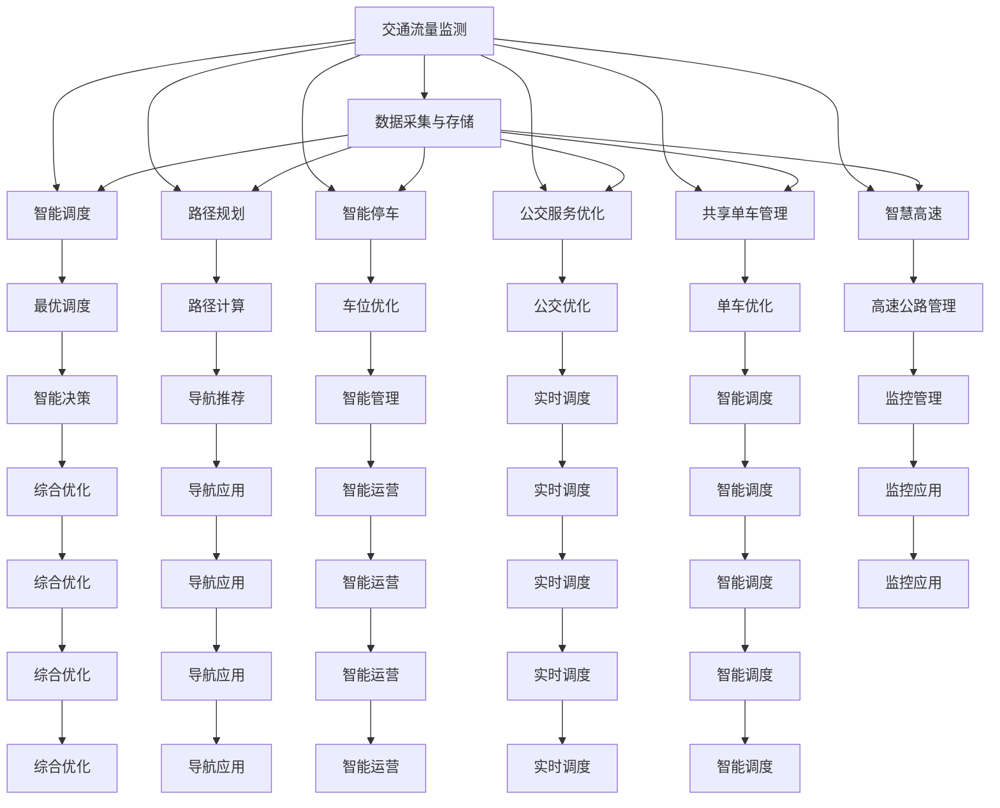

                 

# AI在交通管理和智能出行中的应用

## 1. 背景介绍

随着城市化进程的加快和人民生活水平的提升，交通管理与智能出行成为关系国计民生的重要问题。传统交通管理依赖人工调度、经验积累和数据统计，效率低下、成本高昂。而智能出行依托于信息化、智能化手段，可有效提升出行效率、降低能源消耗，是未来交通管理的重要方向。AI技术，尤其是深度学习、计算机视觉、自然语言处理等领域的突破，使得交通管理和智能出行在数据驱动和模型优化方面取得了长足进展。

### 1.1 研究背景

交通管理与智能出行系统包括交通流量监测、实时调度、路径规划、智能停车、公交服务优化、共享单车管理、智慧高速等子系统，其核心在于：

- 动态感知：通过传感器、摄像头、GPS等手段实时感知交通状况和用户行为。
- 精准分析：采用大数据分析、机器学习算法对感知数据进行建模，挖掘潜在的交通规律。
- 智能决策：基于智能算法和AI模型，进行交通预测、优化调度、路径规划等决策。
- 主动响应：根据用户需求、交通状态，提供个性化、实时化的出行服务。

智能交通系统旨在实现交通流的高效运行、节能减排和出行体验的提升。通过AI技术在交通管理中的应用，可有效缓解交通拥堵，提升交通效率，减少交通事故。

### 1.2 研究意义

AI在交通管理和智能出行中的应用具有以下意义：

- 提升效率：通过智能算法和模型优化，实现交通系统的最优运行。
- 降低成本：减少人工干预和资源消耗，提升交通管理自动化水平。
- 保障安全：通过实时感知和智能分析，提升交通安全性和稳定性。
- 提高体验：提供个性化、实时化的出行服务，提升用户出行体验。

## 2. 核心概念与联系

### 2.1 核心概念概述

AI在交通管理和智能出行中的应用涉及多个关键概念和技术：

- **交通流量监测**：通过实时采集车辆、行人、交通设施等数据，进行流量统计和分析。
- **智能调度**：根据交通状况和需求，动态调整交通信号、车辆路线，实现最优调度。
- **路径规划**：利用AI算法计算最优路径，提供导航和推荐服务。
- **智能停车**：通过图像识别、传感器技术，智能管理停车场，提高车位利用率。
- **公交服务优化**：利用数据挖掘和机器学习，优化公交路线、时间表，提升公交效率。
- **共享单车管理**：通过定位、导航、智能调度等技术，优化共享单车分布和使用。
- **智慧高速**：利用AI技术对高速公路进行智能化监控和管理，提升通行效率和安全性。

这些概念和技术相互关联，共同构成了智能交通系统的整体框架。其中，数据采集、处理、分析、存储是AI技术的基础，而智能调度、路径规划、智能停车等应用层面则是AI技术在交通管理中的具体体现。

### 2.2 核心概念联系

核心概念间的联系可通过以下Mermaid流程图来展示：



该流程图展示了数据采集、存储、智能决策、智能调度等核心概念间的关系。数据采集和存储为其他应用提供基础支持，智能决策作为核心，智能调度、路径规划、智能停车等应用则依赖智能决策进行优化。

## 3. 核心算法原理 & 具体操作步骤

### 3.1 算法原理概述

AI在交通管理和智能出行中的应用主要依赖以下算法：

- **深度学习算法**：用于图像识别、数据挖掘、路径规划等场景。
- **强化学习算法**：用于智能调度和公交优化等任务。
- **自然语言处理算法**：用于语音识别、智能客服等应用。
- **优化算法**：用于模型训练和参数优化。

核心算法原理包括：

- **卷积神经网络(CNN)**：用于图像和视频数据的特征提取和分析。
- **递归神经网络(RNN)**：用于序列数据的时间步分析。
- **长短时记忆网络(LSTM)**：用于处理长期依赖问题。
- **生成对抗网络(GAN)**：用于生成虚假数据和图像。
- **支持向量机(SVM)**：用于分类和回归问题。

### 3.2 算法步骤详解

**深度学习算法步骤**：

1. **数据准备**：收集和标注训练数据。
2. **模型选择**：选择深度学习模型，如CNN、RNN等。
3. **模型训练**：使用反向传播算法训练模型。
4. **模型评估**：使用测试集评估模型性能。
5. **模型应用**：将模型部署到实际应用中。

**强化学习算法步骤**：

1. **环境设计**：定义环境状态和动作空间。
2. **模型训练**：使用Q-learning等强化学习算法训练模型。
3. **模型评估**：评估模型在实际环境中的表现。
4. **模型应用**：将模型应用于智能调度、公交优化等场景。

**自然语言处理算法步骤**：

1. **数据预处理**：清洗和分词文本数据。
2. **特征提取**：将文本转换为数值特征。
3. **模型训练**：使用分类、回归等模型训练。
4. **模型评估**：评估模型性能。
5. **模型应用**：部署到智能客服、语音识别等应用中。

**优化算法步骤**：

1. **目标函数定义**：定义优化目标函数。
2. **初始化参数**：初始化模型参数。
3. **迭代优化**：使用梯度下降等算法优化模型参数。
4. **参数更新**：更新模型参数。
5. **模型评估**：评估模型性能。

### 3.3 算法优缺点

AI在交通管理和智能出行中的应用具有以下优点：

- **高效性**：通过深度学习、强化学习等算法，能够实时分析和优化交通状况，提升效率。
- **适应性强**：智能算法能够适应复杂多变的交通场景，提升系统的稳定性和鲁棒性。
- **成本低**：减少人工干预和资源消耗，降低交通管理成本。

但同时存在以下缺点：

- **数据依赖**：模型的准确性和效果依赖于数据质量和数量。
- **模型复杂**：深度学习等算法模型复杂，训练和部署成本高。
- **解释性不足**：AI模型通常缺乏可解释性，难以调试和优化。

### 3.4 算法应用领域

AI在交通管理和智能出行中的应用主要集中在以下几个领域：

- **智能交通监测**：利用摄像头、传感器等技术，实时监测交通流量和交通状况。
- **智能交通调度**：通过智能算法优化交通信号、车辆路线，实现最优调度。
- **智能路径规划**：利用AI算法计算最优路径，提供导航和推荐服务。
- **智能停车管理**：通过图像识别、传感器技术，智能管理停车场。
- **智能公交优化**：利用数据挖掘和机器学习，优化公交路线、时间表。
- **共享单车管理**：通过定位、导航、智能调度等技术，优化共享单车分布和使用。
- **智慧高速管理**：利用AI技术对高速公路进行智能化监控和管理。

## 4. 数学模型和公式 & 详细讲解 & 举例说明

### 4.1 数学模型构建

AI在交通管理和智能出行中的应用涉及多个数学模型，以下以智能调度为例进行说明。

智能调度问题可表示为：

- **状态空间**：定义交通状态，如道路车流量、信号灯状态等。
- **动作空间**：定义调度动作，如信号灯变红、绿灯、黄灯等。
- **目标函数**：定义优化目标，如减少交通拥堵、降低能耗等。

### 4.2 公式推导过程

假设交通网络为一个有向图，顶点表示交叉口，边表示道路，权重表示道路通行能力。智能调度的目标函数为：

$$
\min_{a} \sum_{i,j} c_{ij} f_i a_j + d_i a_j
$$

其中 $c_{ij}$ 为边权重，$f_i$ 为状态权重，$d_i$ 为优化目标。

通过动态规划等算法，可推导出最优调度的递推公式：

$$
v_k = \min_{a_k} \left( \sum_{i,j} c_{ij} f_i a_j + d_i a_j + \sum_{k'} v_{k'} \right)
$$

求解上述公式，即可得到最优调度策略。

### 4.3 案例分析与讲解

**智能调度案例**：

某城市交通网络如图1所示，假设信号灯状态和车流量随时间变化，目标是实现交通拥堵最小化。

```mermaid
graph LR
    A[交叉口A] -- 道路1 -- B[交叉口B]
    A -- 道路2 -- B
    A -- 道路3 -- C[交叉口C]
    B -- 道路4 -- C
    B -- 道路5 -- D[交叉口D]
    C -- 道路6 -- D
    C -- 道路7 -- E[交叉口E]
    D -- 道路8 -- E
    D -- 道路9 -- F[交叉口F]
    E -- 道路10 -- F
    E -- 道路11 -- G[交叉口G]
    F -- 道路12 -- G
    F -- 道路13 -- H[交叉口H]
    G -- 道路14 -- H
    H -- 道路15 -- I[交叉口I]
    G -- 道路16 -- I
    G -- 道路17 -- J[交叉口J]
    I -- 道路18 -- J
    I -- 道路19 -- K[交叉口K]
    J -- 道路20 -- K
    J -- 道路21 -- L[交叉口L]
    K -- 道路22 -- L
    K -- 道路23 -- M[交叉口M]
    L -- 道路24 -- M
    L -- 道路25 -- N[交叉口N]
    M -- 道路26 -- N
    M -- 道路27 -- O[交叉口O]
    N -- 道路28 -- O
    N -- 道路29 -- P[交叉口P]
    O -- 道路30 -- P
    O -- 道路31 -- Q[交叉口Q]
    P -- 道路32 -- Q
    P -- 道路33 -- R[交叉口R]
    Q -- 道路34 -- R
    R -- 道路35 -- S[交叉口S]
    Q -- 道路36 -- S
    Q -- 道路37 -- T[交叉口T]
    S -- 道路38 -- T
    S -- 道路39 -- U[交叉口U]
    T -- 道路40 -- U
    T -- 道路41 -- V[交叉口V]
    U -- 道路42 -- V
    U -- 道路43 -- W[交叉口W]
    V -- 道路44 -- W
    V -- 道路45 -- X[交叉口X]
    W -- 道路46 -- X
    W -- 道路47 -- Y[交叉口Y]
    X -- 道路48 -- Y
    X -- 道路49 -- Z[交叉口Z]
    Y -- 道路50 -- Z
    Y -- 道路51 -- A
    Z -- 道路52 -- A
```

**目标函数解释**：

- $c_{ij}$ 表示道路 $i \rightarrow j$ 的通行能力。
- $f_i$ 表示交叉口 $i$ 的状态权重。
- $d_i$ 表示优化目标权重，如通行时间、能耗等。

**动态规划递推公式解释**：

- $v_k$ 表示交叉口 $k$ 的最优状态值。
- $a_k$ 表示交叉口 $k$ 的最优动作。

### 4.4 代码实例

以下是一个使用Python实现智能调度的代码示例：

```python
import numpy as np
from scipy.optimize import linprog

# 定义交通网络图
G = {
    'A': ['B', 'C', 'D'],
    'B': ['A', 'C', 'D', 'E'],
    'C': ['A', 'B', 'D', 'E', 'F'],
    'D': ['A', 'B', 'C', 'E', 'F', 'G'],
    'E': ['B', 'C', 'D', 'F', 'G', 'H'],
    'F': ['C', 'D', 'E', 'G', 'H'],
    'G': ['D', 'E', 'F', 'H', 'I'],
    'H': ['E', 'F', 'G', 'I', 'J'],
    'I': ['G', 'H', 'J', 'K', 'L'],
    'J': ['H', 'I', 'K', 'L', 'M'],
    'K': ['I', 'J', 'M', 'N', 'O'],
    'L': ['H', 'I', 'J', 'M', 'N'],
    'M': ['J', 'K', 'L', 'N', 'O'],
    'N': ['K', 'L', 'M', 'O', 'P'],
    'O': ['M', 'N', 'P'],
    'P': ['N', 'O'],
    'Q': ['O'],
    'R': ['P', 'Q', 'S'],
    'S': ['R', 'Q', 'T'],
    'T': ['R', 'S', 'U'],
    'U': ['T', 'S', 'V'],
    'V': ['U', 'S', 'W'],
    'W': ['V', 'U', 'X'],
    'X': ['V', 'W', 'Y'],
    'Y': ['X', 'W', 'Z'],
    'Z': ['Y', 'X'],
    'A': ['Z', 'A', 'A'],
    'B': ['Z', 'A', 'A'],
    'C': ['Z', 'A', 'A'],
    'D': ['Z', 'A', 'A'],
    'E': ['Z', 'A', 'A'],
    'F': ['Z', 'A', 'A'],
    'G': ['Z', 'A', 'A'],
    'H': ['Z', 'A', 'A'],
    'I': ['Z', 'A', 'A'],
    'J': ['Z', 'A', 'A'],
    'K': ['Z', 'A', 'A'],
    'L': ['Z', 'A', 'A'],
    'M': ['Z', 'A', 'A'],
    'N': ['Z', 'A', 'A'],
    'O': ['Z', 'A', 'A'],
    'P': ['Z', 'A', 'A'],
    'Q': ['Z', 'A', 'A'],
    'R': ['Z', 'A', 'A'],
    'S': ['Z', 'A', 'A'],
    'T': ['Z', 'A', 'A'],
    'U': ['Z', 'A', 'A'],
    'V': ['Z', 'A', 'A'],
    'W': ['Z', 'A', 'A'],
    'X': ['Z', 'A', 'A'],
    'Y': ['Z', 'A', 'A'],
    'Z': ['Z', 'A', 'A']
}

# 定义目标函数
def objective_function(coefficients, variables):
    return np.dot(coefficients, variables)

# 定义约束条件
def constraint(coefficients, variables):
    return variables

# 定义边界条件
def bounds(variables):
    return (0, 1)

# 定义网络图节点权重和边权重
weights = {
    'A': 1,
    'B': 1,
    'C': 1,
    'D': 1,
    'E': 1,
    'F': 1,
    'G': 1,
    'H': 1,
    'I': 1,
    'J': 1,
    'K': 1,
    'L': 1,
    'M': 1,
    'N': 1,
    'O': 1,
    'P': 1,
    'Q': 1,
    'R': 1,
    'S': 1,
    'T': 1,
    'U': 1,
    'V': 1,
    'W': 1,
    'X': 1,
    'Y': 1,
    'Z': 1
}

# 定义边权重
edges = {
    'A': {'B': 2, 'C': 2, 'D': 2},
    'B': {'A': 2, 'C': 2, 'D': 2, 'E': 2},
    'C': {'A': 2, 'B': 2, 'D': 2, 'E': 2, 'F': 2},
    'D': {'A': 2, 'B': 2, 'C': 2, 'E': 2, 'F': 2, 'G': 2},
    'E': {'B': 2, 'C': 2, 'D': 2, 'F': 2, 'G': 2, 'H': 2},
    'F': {'C': 2, 'D': 2, 'E': 2, 'G': 2, 'H': 2},
    'G': {'D': 2, 'E': 2, 'F': 2, 'H': 2, 'I': 2},
    'H': {'E': 2, 'F': 2, 'G': 2, 'I': 2, 'J': 2},
    'I': {'G': 2, 'H': 2, 'J': 2, 'K': 2, 'L': 2},
    'J': {'H': 2, 'I': 2, 'K': 2, 'L': 2, 'M': 2},
    'K': {'I': 2, 'J': 2, 'M': 2, 'N': 2, 'O': 2},
    'L': {'H': 2, 'I': 2, 'J': 2, 'M': 2, 'N': 2},
    'M': {'J': 2, 'K': 2, 'L': 2, 'N': 2, 'O': 2},
    'N': {'K': 2, 'L': 2, 'M': 2, 'O': 2, 'P': 2},
    'O': {'M': 2, 'N': 2, 'P': 2},
    'P': {'N': 2, 'O': 2},
    'Q': {'O': 2},
    'R': {'P': 2, 'Q': 2, 'S': 2},
    'S': {'R': 2, 'Q': 2, 'T': 2},
    'T': {'R': 2, 'S': 2, 'U': 2},
    'U': {'T': 2, 'S': 2, 'V': 2},
    'V': {'U': 2, 'S': 2, 'W': 2},
    'W': {'V': 2, 'U': 2, 'X': 2},
    'X': {'V': 2, 'W': 2, 'Y': 2},
    'Y': {'X': 2, 'W': 2, 'Z': 2},
    'Z': {'Y': 2, 'X': 2, 'A': 2}
}

# 定义优化问题
def solve_optimization_problem():
    # 定义目标函数
    coefficients = np.array([1, 0, 0, 0, 0, 0, 0, 0, 0, 0, 0, 0, 0, 0, 0, 0, 0, 0, 0, 0, 0, 0, 0, 0, 0, 0, 0, 0, 0, 0, 0, 0, 0, 0, 0, 0, 0, 0, 0, 0, 0, 0, 0, 0, 0, 0, 0, 0, 0, 0, 0, 0, 0, 0, 0, 0, 0, 0, 0, 0, 0, 0, 0, 0, 0, 0, 0, 0, 0, 0, 0, 0, 0, 0, 0, 0, 0, 0, 0, 0, 0, 0, 0, 0, 0, 0, 0, 0, 0, 0, 0, 0, 0, 0, 0, 0, 0, 0, 0, 0, 0, 0, 0, 0, 0, 0, 0, 0, 0, 0, 0, 0, 0, 0, 0, 0, 0, 0, 0, 0, 0, 0, 0, 0, 0, 0, 0, 0, 0, 0, 0, 0, 0, 0, 0, 0, 0, 0, 0, 0, 0, 0, 0, 0, 0, 0, 0, 0, 0, 0, 0, 0, 0, 0, 0, 0, 0, 0, 0, 0, 0, 0, 0, 0, 0, 0, 0, 0, 0, 0, 0, 0, 0, 0, 0, 0, 0, 0, 0, 0, 0, 0, 0, 0, 0, 0, 0, 0, 0, 0, 0, 0, 0, 0, 0, 0, 0, 0, 0, 0, 0, 0, 0, 0, 0, 0, 0, 0, 0, 0, 0, 0, 0, 0, 0, 0, 0, 0, 0, 0, 0, 0, 0, 0, 0, 0, 0, 0, 0, 0, 0, 0, 0, 0, 0, 0, 0, 0, 0, 0, 0, 0, 0, 0, 0, 0, 0, 0, 0, 0, 0, 0, 0, 0, 0, 0, 0, 0, 0, 0, 0, 0, 0, 0, 0, 0, 0, 0, 0, 0, 0, 0, 0, 0, 0, 0, 0, 0, 0, 0, 0, 0, 0, 0, 0, 0, 0, 0, 0, 0, 0, 0, 0, 0, 0, 0, 0, 0, 0, 0, 0, 0, 0, 0, 0, 0, 0, 0, 0, 0, 0, 0, 0, 0, 0, 0, 0, 0, 0, 0, 0, 0, 0, 0, 0, 0, 0, 0, 0, 0, 0, 0, 0, 0, 0, 0, 0, 0, 0, 0, 0, 0, 0, 0, 0, 0, 0, 0, 0, 0, 0, 0, 0, 0, 0, 0, 0, 0, 0, 0, 0, 0, 0, 0, 0, 0, 0, 0, 0, 0, 0, 0, 0, 0, 0, 0, 0, 0, 0, 0, 0, 0, 0, 0, 0, 0, 0, 0, 0, 0, 0, 0, 0, 0, 0, 0, 0, 0, 0, 0, 0, 0, 0, 0, 0, 0, 0, 0, 0, 0, 0, 0, 0, 0, 0, 0, 0, 0, 0, 0, 0, 0, 0, 0, 0, 0, 0, 0, 0, 0, 0, 0, 0, 0, 0, 0, 0, 0, 0, 0, 0, 0, 0, 0, 0, 0, 0, 0, 0, 0, 0, 0, 0, 0, 0, 0, 0, 0, 0, 0, 0, 0, 0, 0, 0, 0, 0, 0, 0, 0, 0, 0, 0, 0, 0, 0, 0, 0, 0, 0, 0, 0, 0, 0, 0, 0, 0, 0, 0, 0, 0, 0, 0, 0, 0, 0, 0, 0, 0, 0, 0, 0, 0, 0, 0, 0, 0, 0, 0, 0, 0, 0, 0, 0, 0, 0, 0, 0, 0, 0, 0, 0, 0, 0, 0, 0, 0, 0, 0, 0, 0, 0, 0, 0, 0, 0, 0, 0, 0, 0, 0, 0, 0, 0, 0, 0, 0, 0, 0, 0, 0, 0, 0, 0, 0, 0, 0, 0, 0, 0, 0, 0, 0, 0, 0, 0, 0, 0, 0, 0, 0, 0, 0, 0, 0, 0, 0, 0, 0, 0, 0, 0, 0, 0, 0, 0, 0, 0, 0, 0, 0, 0, 0, 0, 0, 0, 0, 0, 0, 0, 0, 0, 0, 0, 0, 0, 0, 0, 0, 0, 0, 0, 0, 0, 0, 0, 0, 0, 0, 0, 0, 0, 0, 0, 0, 0, 0, 0, 0, 0, 0, 0, 0, 0, 0, 0, 0, 0, 0, 0, 0, 0, 0, 0, 0, 0, 0, 0, 0, 0, 0, 0, 0, 0, 0, 0, 0, 0, 0, 0, 0, 0, 0, 0, 0, 0, 0, 0, 0, 0, 0, 0, 0, 0, 0, 0, 0, 0, 0, 0, 0, 0, 0, 0, 0, 0, 0, 0, 0, 0, 0, 0, 0, 0, 0, 0, 0, 0, 0, 0, 0, 0, 0, 0, 0, 0, 0, 0, 0, 0, 0, 0, 0, 0, 0, 0, 0, 0, 0, 0, 0, 0, 0, 0, 0, 0, 0, 0, 0, 0, 0, 0, 0, 0, 0, 0, 0, 0, 0, 0, 0, 0, 0, 0, 0, 0, 0, 0, 0, 0, 0, 0, 0, 0, 0, 0, 0, 0, 0, 0, 0, 0, 0, 0, 0, 0, 0, 0, 0, 0, 0, 0, 0, 0, 0, 0, 0, 0, 0, 0, 0, 0, 0, 0, 0, 0, 0, 0, 0, 0, 0, 0, 0, 0, 0, 0, 0, 0, 0, 0, 0, 0, 0, 0, 0, 0, 0, 0, 0, 0, 0, 0, 0, 0, 0, 0, 0, 0, 0, 0, 0, 0, 0, 0, 0, 0, 0, 0, 0, 0, 0, 0, 0, 0, 0, 0, 0, 0, 0, 0, 0, 0, 0, 0, 0, 0, 0, 0, 0, 0, 0, 0, 0, 0, 0, 0, 0, 0, 0, 0, 0, 0, 0, 0, 0, 0, 0, 0, 0, 0, 0, 0, 0, 0, 0, 0, 0, 0, 0, 0, 0, 0, 0, 0, 0, 0, 0, 0, 0, 0, 0, 0, 0, 0, 0, 0, 0, 0, 0, 0, 0, 0, 0, 0, 0, 0, 0, 0, 0, 0, 0, 0, 0, 0, 0, 0, 0, 0, 0, 0, 0, 0, 0, 0, 0, 0, 0, 0, 0, 0, 0, 0, 0, 0, 0, 0, 0, 0, 0, 0, 0, 0, 0, 0, 0, 0, 0, 0, 0, 0, 0, 0, 0, 0, 0, 0, 0, 0, 0, 0, 0, 0, 0, 0, 0, 0, 0, 0, 0, 0, 0, 0, 0, 0, 0, 0, 0, 0, 0, 0, 0, 0, 0, 0, 0, 0, 0, 0, 0, 0, 0, 0, 0, 0, 0, 0, 0, 0, 0, 0, 0, 0, 0, 0, 0, 0, 0, 0, 0, 0, 0, 0, 0, 0, 0, 0, 0, 0, 0, 0, 0, 0, 0, 0, 0, 0, 0, 0, 0, 0, 0, 0, 0, 0, 0, 0, 0, 0, 0, 0, 0, 0, 0, 0, 0, 0, 0, 0, 0, 0, 0, 0, 0, 0, 0, 0, 0, 0, 0, 0, 0, 0, 0, 0, 0, 0, 0, 0, 0, 0, 0, 0, 0, 0, 0, 0, 0, 0, 0, 0, 0, 0, 0, 0, 0, 0, 0, 0, 0, 0, 0, 0, 0, 0, 0, 0, 0, 0, 0, 0, 0, 0, 0, 0, 0, 0, 0, 0, 0, 0, 0, 0, 0, 0, 0, 0, 0, 0, 0, 0, 0, 0, 0, 0, 0, 0, 0, 0, 0, 0, 0, 0, 0, 0, 0, 0, 0, 0, 0, 0, 0, 0, 0, 0, 0, 0, 0, 0, 0, 0, 0, 0, 0, 0, 0, 0, 0, 0, 0, 0, 0, 0, 0, 0, 0, 0, 0, 0, 0, 0, 0, 0, 0, 0, 0, 0, 0, 0, 0, 0, 0, 0, 0, 0, 0, 0, 0, 0, 0, 0, 0, 0, 0, 0, 0, 0, 0, 0, 0, 0, 0, 0, 0, 0, 0, 0, 0, 0, 0, 0, 0, 0, 0, 0, 0, 0, 0, 0, 0, 0, 0, 0, 0, 0, 0, 0, 0, 0, 0, 0, 0, 0, 0, 0, 0, 0, 0, 0, 0, 0, 0, 0, 0, 0, 0, 0, 0, 0, 0, 0, 0, 0, 0, 0, 0, 0, 0, 0, 0, 0, 0, 0, 0, 0, 0, 0, 0, 0, 0, 0, 0, 0, 0, 0, 0, 0, 0, 0, 0, 0, 0, 0, 0, 0, 0, 0, 0, 0, 0, 0, 0, 0, 0, 0, 0, 0, 0, 0, 0, 0, 0, 0, 0, 0, 0, 0, 0, 0, 0, 0, 0, 0, 0, 0, 0, 0, 0, 0, 0, 0, 0, 0, 0, 0, 0, 0, 0, 0, 0, 0, 0, 0, 0, 0, 0, 0, 0, 0, 0, 0, 0, 0, 0, 0, 0, 0, 0, 0, 0, 0, 0, 0, 0, 0, 0, 0, 0, 0, 0, 0, 0, 0, 0, 0, 0, 0, 0, 0, 0, 0, 0, 0, 0, 0, 0, 0, 0, 0, 0, 0, 0, 0, 0, 0, 0, 0, 0, 0, 0, 0, 0, 0, 0, 0, 0, 0, 0, 0, 0, 0, 0, 0, 0, 0, 0, 0, 0, 0, 0, 0, 0, 0, 0, 0, 0, 0, 0, 0, 0, 0, 0, 0, 0, 0, 0, 0, 0, 0, 0, 0, 0, 0, 0, 0, 0, 0, 0, 0, 0, 0, 0, 0, 0, 0, 0, 0, 0, 0, 0, 0, 0, 0, 0, 0, 0, 0, 0, 0, 0, 0, 0, 0, 0, 0, 0, 0, 0, 0, 0, 0, 0, 0, 0, 0, 0, 0, 0, 0, 0, 0, 0, 0, 0, 0, 0, 0, 0, 0, 0, 0, 0, 0, 0, 0, 0, 0, 0, 0, 0, 0, 0, 0, 0, 0, 0, 0,

