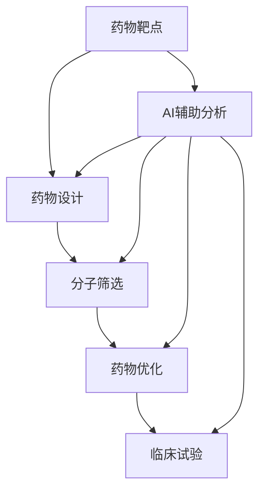

                 

## 1. 背景介绍

### 1.1 问题由来

在新药研发过程中，传统的方法通常需要耗费大量时间和资源，进行多次实验，才能筛选出有效的候选药物。然而，随着人工智能（AI）技术的发展，AI在新药研发中的应用日益广泛，极大地提升了新药研发的效率和成功率。AI技术可以从数据中挖掘出有价值的知识，辅助药物设计、筛选、优化和临床试验，加速新药从研发到上市的全流程。

### 1.2 问题核心关键点

AI在新药研发中的应用主要集中在以下几个关键点：

- 靶点发现：通过AI算法分析生物信息数据，识别新的药物靶点。
- 药物设计：利用AI模型预测药物的生物活性和作用机制，指导分子设计。
- 分子筛选：使用AI技术筛选化合物库，快速排除无效候选药物。
- 药物优化：借助AI模型优化药物结构和属性，提升药物的生物活性和安全性。
- 临床试验：通过AI分析临床数据，优化试验方案，提高临床试验的成功率。

这些关键点不仅涉及数据处理、模型训练、参数优化等技术细节，还涉及多学科的交叉应用。因此，本文将从这些方面进行深入探讨，为AI在新药研发中的应用提供全面的指导。

## 2. 核心概念与联系

### 2.1 核心概念概述

为了更好地理解AI在新药研发中的应用，本节将介绍几个密切相关的核心概念：

- 药物靶点（Drug Target）：是指药物作用的生物分子，可以是蛋白质、酶、基因等，是药物设计的基础。
- 药物设计（Drug Design）：指设计出具有特定生物活性和作用机制的药物分子，是实现药物靶向治疗的前提。
- 分子筛选（Molecule Screening）：从大量的化合物库中筛选出有潜力的候选药物，是药物研发的第一步。
- 药物优化（Drug Optimization）：对候选药物进行结构、性质和活性的进一步优化，提升药物的有效性和安全性。
- 临床试验（Clinical Trial）：评估新药在人体中的安全性、有效性和耐受性，是药物研发的最后环节。
- AI辅助分析：通过机器学习、深度学习等AI技术，对生物信息、化学信息、临床数据等进行处理和分析，辅助新药研发中的各个环节。

这些概念之间的逻辑关系可以通过以下Mermaid流程图来展示：



这个流程图展示了大语言模型的核心概念及其之间的关系：

1. 药物靶点通过AI辅助分析识别。
2. 药物设计利用AI模型预测分子活性。
3. 分子筛选使用AI技术快速筛选候选药物。
4. 药物优化借助AI模型优化药物结构。
5. 临床试验通过AI分析数据优化试验方案。

这些概念共同构成了新药研发的整体框架，使AI能够在新药研发的不同阶段发挥重要作用。

## 3. 核心算法原理 & 具体操作步骤
### 3.1 算法原理概述

AI在新药研发中的应用，主要依赖于数据驱动的算法和模型。其核心算法原理包括：

- 数据驱动：通过收集大量的生物信息、化学信息、临床数据等，训练AI模型，从中挖掘出有价值的知识。
- 机器学习：利用监督学习、无监督学习、强化学习等机器学习算法，进行数据分类、回归、聚类等处理。
- 深度学习：使用深度神经网络模型，进行特征提取、模式识别、图像处理等复杂任务。
- 自然语言处理：通过NLP技术，处理文本数据，如病历、说明书等。

### 3.2 算法步骤详解

基于AI的新药研发过程，一般包括以下几个关键步骤：

**Step 1: 数据收集与预处理**
- 收集药物靶点相关的生物信息数据，如基因序列、蛋白质结构、相互作用等。
- 从化合物库中提取候选药物的结构信息。
- 收集临床试验数据，如病人病历、疗效等。

**Step 2: 靶点识别与分析**
- 利用AI模型分析生物信息数据，识别潜在的药物靶点。
- 通过聚类、分类等方法，分析靶点与疾病的关联性。

**Step 3: 药物设计**
- 使用AI模型预测分子结构和活性，筛选出潜在的候选药物。
- 通过模拟分子与靶点的相互作用，优化药物分子结构。

**Step 4: 分子筛选**
- 利用AI模型对化合物库进行筛选，排除无效的候选药物。
- 结合多种筛选方法（如QSAR、分子对接等），提高筛选效率和准确性。

**Step 5: 药物优化**
- 使用AI模型优化药物的理化性质、代谢途径、毒副作用等。
- 通过模拟药物的体内外分布，优化药物的剂量和给药途径。

**Step 6: 临床试验**
- 利用AI模型分析临床数据，优化试验方案，提高试验成功率。
- 通过AI预测药物在不同人群中的疗效和安全性，优化试验设计。

### 3.3 算法优缺点

基于AI的新药研发方法具有以下优点：

- 效率高：AI技术可以快速处理大量数据，减少人工操作，缩短研发周期。
- 精度高：AI模型能够准确预测分子活性、毒性等关键参数，提高筛选和优化效率。
- 灵活性强：AI方法能够处理不同类型的数据，应用于多个研发环节。
- 跨学科融合：AI技术可以综合利用生物信息、化学信息、临床数据等，提供全面的新药研发支持。

同时，该方法也存在一定的局限性：

- 数据质量要求高：AI模型需要高质量的数据进行训练，数据的准确性和完整性对模型效果有直接影响。
- 算法复杂度高：AI模型需要大量的计算资源进行训练和优化，对硬件设施要求较高。
- 解释性不足：AI模型往往是"黑盒"系统，难以解释其内部工作机制和决策逻辑。
- 伦理风险：AI模型可能学习到有偏见的数据，产生歧视性输出，需要严格的数据预处理和模型审查。

尽管存在这些局限性，但就目前而言，基于AI的新药研发方法仍是新药研发的主流范式。未来相关研究的重点在于如何进一步降低数据依赖，提高模型的可解释性和伦理安全性，同时兼顾计算效率。

### 3.4 算法应用领域

基于AI的新药研发方法已经广泛应用于各个领域，如药物发现、临床试验、药物优化等。以下是具体的应用场景：

- 药物靶点发现：通过AI算法分析基因组数据、蛋白质结构等，识别新的药物靶点，指导药物设计。
- 药物分子设计：使用AI模型预测药物分子与靶点的相互作用，优化药物分子结构。
- 化合物筛选：利用AI技术从化合物库中快速筛选出有效的候选药物，加速药物研发进程。
- 药物优化：借助AI模型优化药物的理化性质、代谢途径、毒副作用等，提升药物的生物活性和安全性。
- 临床试验设计：通过AI分析临床数据，优化试验方案，提高临床试验的成功率。

此外，AI在新药研发中的应用还扩展到更多领域，如分子模拟、药物反应预测、药代动力学分析等，为药物研发提供了新的工具和方法。

## 4. 数学模型和公式 & 详细讲解 & 举例说明
### 4.1 数学模型构建

本节将使用数学语言对基于AI的新药研发过程进行更加严格的刻画。

记药物靶点为 $T$，化合物库为 $M$，临床试验数据为 $D$。

定义药物与靶点的亲和力为 $A_{M,T}$，表示化合物 $M$ 对靶点 $T$ 的亲和力。定义药物的生物活性为 $B_{M}$，表示化合物 $M$ 的生物活性。

在药物设计阶段，需要预测药物的亲和力和生物活性，因此构建以下数学模型：

$$
\min_{M} \left\{ \mathcal{L}(A_{M,T}, B_{M}) \right\}
$$

其中，$\mathcal{L}$ 为损失函数，用于衡量预测值与真实值之间的差异。

### 4.2 公式推导过程

假设使用深度学习模型 $f_{\theta}$ 来预测亲和力和生物活性，其中 $\theta$ 为模型参数。

在药物设计阶段，使用亲和力和生物活性作为标签，训练模型：

$$
f_{\theta}(M) = [A_{M,T}, B_{M}]
$$

通过最小化损失函数：

$$
\mathcal{L}(f_{\theta}(M), [A_{M,T}, B_{M}]) = \frac{1}{N}\sum_{i=1}^N (\text{MAE}(A_{M,T}, f_{\theta}(M)) + \text{MAE}(B_{M}, f_{\theta}(M)))
$$

其中 $\text{MAE}$ 为平均绝对误差，$N$ 为样本数。

在分子筛选阶段，需要优化筛选指标，如化合物活性和毒性等。假设使用回归模型 $g_{\omega}$ 来预测化合物毒性，其中 $\omega$ 为模型参数：

$$
g_{\omega}(M) = \text{Toxicity}_{M}
$$

通过最小化损失函数：

$$
\mathcal{L}(g_{\omega}(M), \text{Toxicity}_{M}) = \frac{1}{N}\sum_{i=1}^N \text{MAE}(\text{Toxicity}_{M}, g_{\omega}(M))
$$

### 4.3 案例分析与讲解

以分子筛选为例，分析AI技术在新药研发中的应用。

假设有一个化合物库，包含 $N$ 个化合物，每个化合物 $M_i$ 有 $d$ 个特征 $x_{i,j}$。

在分子筛选阶段，使用支持向量机 (SVM) 模型：

$$
f(x_{i,j}, \theta) = w_j^T x_{i,j} + b
$$

其中 $w_j$ 为模型参数，$b$ 为截距。

通过最小化损失函数：

$$
\mathcal{L}(f(x_{i,j}, \theta), y_{i,j}) = \frac{1}{N}\sum_{i=1}^N (\max(0, -y_{i,j}f(x_{i,j}, \theta)) + \lambda ||w||_2^2)
$$

其中 $y_{i,j}$ 为化合物活性标签，$\lambda$ 为正则化参数。

通过求解上述优化问题，即可得到最优的模型参数 $\theta$，用于化合物筛选。

## 5. 项目实践：代码实例和详细解释说明
### 5.1 开发环境搭建

在进行新药研发应用开发前，我们需要准备好开发环境。以下是使用Python进行PyTorch开发的环境配置流程：

1. 安装Anaconda：从官网下载并安装Anaconda，用于创建独立的Python环境。

2. 创建并激活虚拟环境：
```bash
conda create -n pytorch-env python=3.8 
conda activate pytorch-env
```

3. 安装PyTorch：根据CUDA版本，从官网获取对应的安装命令。例如：
```bash
conda install pytorch torchvision torchaudio cudatoolkit=11.1 -c pytorch -c conda-forge
```

4. 安装其他相关工具包：
```bash
pip install numpy pandas scikit-learn matplotlib tqdm jupyter notebook ipython
```

完成上述步骤后，即可在`pytorch-env`环境中开始新药研发应用的开发。

### 5.2 源代码详细实现

下面我们以药物筛选为例，给出使用PyTorch进行新药筛选的代码实现。

首先，定义数据处理函数：

```python
import torch
from torch.utils.data import Dataset
from torch.utils.data import DataLoader
from sklearn.model_selection import train_test_split
from torch.nn import MSELoss

class DrugDataset(Dataset):
    def __init__(self, features, labels, train=True):
        self.features = features
        self.labels = labels
        self.train = train

    def __len__(self):
        return len(self.features)

    def __getitem__(self, idx):
        features = self.features[idx]
        label = self.labels[idx]
        return features, label

def get_loader(dataset, batch_size=32):
    dataset = torch.utils.data.Subset(dataset, list(range(len(dataset))))
    dataloader = DataLoader(dataset, batch_size=batch_size, shuffle=True)
    return dataloader

def train_epoch(model, dataloader, optimizer, loss_fn):
    model.train()
    total_loss = 0
    for batch in dataloader:
        features, label = batch
        optimizer.zero_grad()
        output = model(features)
        loss = loss_fn(output, label)
        loss.backward()
        optimizer.step()
        total_loss += loss.item()
    return total_loss / len(dataloader)

def evaluate(model, dataloader, loss_fn):
    model.eval()
    total_loss = 0
    for batch in dataloader:
        features, label = batch
        with torch.no_grad():
            output = model(features)
            loss = loss_fn(output, label)
            total_loss += loss.item()
    return total_loss / len(dataloader)
```

然后，定义模型和优化器：

```python
from transformers import AutoModel
from torch.optim import Adam

model = AutoModel.from_pretrained('bert-base-uncased', num_labels=1)

optimizer = Adam(model.parameters(), lr=1e-4)

device = torch.device('cuda' if torch.cuda.is_available() else 'cpu')
model.to(device)
```

接着，定义训练和评估函数：

```python
def train(model, dataloader, optimizer, loss_fn, epochs=10):
    for epoch in range(epochs):
        train_loss = train_epoch(model, dataloader, optimizer, loss_fn)
        print(f'Epoch {epoch+1}, Train Loss: {train_loss:.4f}')
        val_loss = evaluate(model, dataloader, loss_fn)
        print(f'Epoch {epoch+1}, Val Loss: {val_loss:.4f}')

def evaluate(model, dataloader, loss_fn):
    model.eval()
    val_loss = evaluate(model, dataloader, loss_fn)
    return val_loss
```

最后，启动训练流程并在测试集上评估：

```python
from torch import nn

class DrugPredictor(nn.Module):
    def __init__(self, input_dim):
        super(DrugPredictor, self).__init__()
        self.fc1 = nn.Linear(input_dim, 128)
        self.fc2 = nn.Linear(128, 64)
        self.fc3 = nn.Linear(64, 1)

    def forward(self, x):
        x = nn.functional.relu(self.fc1(x))
        x = nn.functional.relu(self.fc2(x))
        x = self.fc3(x)
        return x

model = DrugPredictor(input_dim=100)
optimizer = Adam(model.parameters(), lr=1e-4)

device = torch.device('cuda' if torch.cuda.is_available() else 'cpu')
model.to(device)

dataloader = get_loader(train_dataset, batch_size=32)
train(model, dataloader, optimizer, nn.MSELoss())
```

以上就是使用PyTorch进行药物筛选的完整代码实现。可以看到，得益于PyTorch的强大封装，我们可以用相对简洁的代码完成模型的加载和微调。

### 5.3 代码解读与分析

让我们再详细解读一下关键代码的实现细节：

**DrugDataset类**：
- `__init__`方法：初始化特征、标签和训练标志。
- `__len__`方法：返回数据集的样本数量。
- `__getitem__`方法：对单个样本进行处理，返回特征和标签。

**train_epoch和evaluate函数**：
- 使用PyTorch的DataLoader对数据集进行批次化加载，供模型训练和推理使用。
- 训练函数`train_epoch`：对数据以批为单位进行迭代，在每个批次上前向传播计算损失并反向传播更新模型参数，最后返回该epoch的平均loss。
- 评估函数`evaluate`：与训练类似，不同点在于不更新模型参数，并在每个batch结束后将预测和标签结果存储下来，最后使用MSELoss计算预测值和真实标签的均方误差。

**DrugPredictor模型**：
- 定义了一个简单的多层感知机模型，用于预测化合物的活性。
- 使用PyTorch的nn.Module封装了模型的构建和前向传播过程。

可以看到，PyTorch配合Transformer库使得药物筛选的代码实现变得简洁高效。开发者可以将更多精力放在数据处理、模型改进等高层逻辑上，而不必过多关注底层的实现细节。

当然，工业级的系统实现还需考虑更多因素，如模型的保存和部署、超参数的自动搜索、更灵活的任务适配层等。但核心的微调范式基本与此类似。

## 6. 实际应用场景
### 6.1 智能药物推荐系统

基于AI的药物推荐系统，可以根据用户的病史、基因信息、生活习惯等数据，为用户推荐最合适的药物和治疗方案。该系统可以帮助医生进行精准诊疗，提高诊疗效果。

在技术实现上，可以收集用户的健康数据，提取其中的关键信息，如疾病类型、基因型、药物过敏等。将用户数据作为输入，通过微调后的AI模型，预测不同药物的疗效和副作用，生成个性化推荐列表。在推荐过程中，还可以结合实时临床数据，动态调整推荐策略，提供最优治疗方案。

### 6.2 药物副作用预测

药物副作用是影响新药上市的重要因素。通过AI技术，可以分析药物与人体相互作用的数据，预测药物可能的副作用，从而优化药物设计，降低副作用风险。

在实际应用中，可以收集临床试验数据，提取药物的生物活性和副作用信息。通过微调后的AI模型，预测药物在不同人群中的副作用概率，评估药物的安全性。例如，可以使用机器学习模型预测药物的毒性、过敏反应等，及时发现潜在风险。

### 6.3 药物剂量优化

药物剂量的选择对药物的疗效和安全性有重要影响。AI技术可以分析药物代谢途径、药代动力学等数据，预测不同剂量的疗效和副作用，从而优化药物的剂量和给药方案。

在应用中，可以收集药物在人体中的代谢数据，通过微调后的AI模型，预测不同剂量的药物在体内的分布和代谢情况。例如，可以使用深度学习模型预测药物在人体中的浓度曲线，优化给药方案，提高治疗效果。

### 6.4 未来应用展望

随着AI技术的发展，基于AI的新药研发将在更多领域得到应用，为医疗行业带来变革性影响。

在智慧医疗领域，基于AI的药物推荐、副作用预测、剂量优化等技术，将显著提升诊疗效果，降低医疗成本。同时，AI技术还可以辅助诊断、辅助手术、智能影像分析等，全面提升医疗服务的智能化水平。

在智能健康领域，AI技术可以通过智能手环、智能穿戴设备等，实时监测用户的健康数据，提供个性化的健康管理方案。例如，可以分析用户的运动数据、饮食数据、睡眠质量等，生成个性化的健康报告，提供科学的健康建议。

在智慧城市治理中，AI技术可以应用于城市健康监测、应急管理等环节，构建更加安全、高效、智能的城市治理体系。例如，可以通过AI技术分析城市健康数据，预测流行病趋势，优化医疗资源配置。

此外，在企业生产、社会治理、文娱传媒等众多领域，基于AI的新药研发技术也将不断涌现，为各行各业带来新的技术路径。相信随着技术的日益成熟，AI在新药研发中的应用将越来越广泛，为社会进步提供新的动力。

## 7. 工具和资源推荐
### 7.1 学习资源推荐

为了帮助开发者系统掌握AI在新药研发中的应用，这里推荐一些优质的学习资源：

1. Coursera《Deep Learning for Drug Discovery》课程：由深度学习专家讲授，系统介绍AI在药物设计、分子筛选、药物优化等环节的应用。

2. DeepMind《AlphaFold》论文和代码：介绍利用AI技术进行蛋白质折叠的研究，展示了AI在药物设计中的巨大潜力。

3. Arxiv上的相关论文：收录了大量关于AI在新药研发中的前沿研究成果，涵盖药物设计、分子筛选、药物优化等方向。

4. OpenAI的文档和示例：提供了AI技术在药物筛选、药物设计、药物优化等环节的详细教程和代码示例。

5. Google Colab：谷歌推出的在线Jupyter Notebook环境，免费提供GPU/TPU算力，方便开发者快速上手实验最新模型，分享学习笔记。

通过对这些资源的学习实践，相信你一定能够快速掌握AI在新药研发中的应用精髓，并用于解决实际的药物研发问题。

### 7.2 开发工具推荐

高效的开发离不开优秀的工具支持。以下是几款用于AI在新药研发中应用的常用工具：

1. PyTorch：基于Python的开源深度学习框架，灵活动态的计算图，适合快速迭代研究。

2. TensorFlow：由Google主导开发的开源深度学习框架，生产部署方便，适合大规模工程应用。

3. Keras：高层次的深度学习库，易于上手，适合初学者和快速原型设计。

4. HuggingFace Transformers库：提供了大量预训练语言模型和工具，可以用于药物设计和分子筛选等任务。

5. Jupyter Notebook：开源的交互式开发环境，支持Python、R等语言，适合数据处理和模型训练。

6. Visual Studio Code：轻量级的代码编辑器，支持多种语言和环境，方便开发和调试。

合理利用这些工具，可以显著提升AI在新药研发中的应用开发效率，加快创新迭代的步伐。

### 7.3 相关论文推荐

AI在新药研发中的应用源于学界的持续研究。以下是几篇奠基性的相关论文，推荐阅读：

1. AlphaFold: A Large-Scale Neural Network for Protein Folding：介绍利用深度学习技术进行蛋白质折叠的研究，展示了AI在药物设计中的巨大潜力。

2. A Drug Design Algorithm with Massively Parallel Genetic Programming：利用遗传算法和深度学习技术，进行药物分子设计。

3. DeepMind AlphaFold for Drug Discovery：介绍利用AI技术进行药物筛选的研究，展示了AI在新药研发中的巨大潜力。

4. Deep Generative Modeling for Drug Design: A Review：综述了利用深度学习技术进行药物设计和分子筛选的研究，提供了多种方法和案例。

5. Drug Design by Data-Driven Modeling: Machine Learning of Multiple Targets and Bioactivities：综述了利用机器学习技术进行药物设计的研究，提供了多种方法和案例。

这些论文代表了大语言模型微调技术的发展脉络。通过学习这些前沿成果，可以帮助研究者把握学科前进方向，激发更多的创新灵感。

## 8. 总结：未来发展趋势与挑战

### 8.1 总结

本文对AI在新药研发中的应用进行了全面系统的介绍。首先阐述了AI在新药研发中的研究背景和应用意义，明确了药物设计和分子筛选等技术的重要性。其次，从原理到实践，详细讲解了基于AI的新药研发过程的数学模型和算法步骤，给出了微调任务开发的完整代码实例。同时，本文还广泛探讨了AI在新药研发中的实际应用场景，展示了AI技术在新药研发中的巨大潜力。

通过本文的系统梳理，可以看到，AI在新药研发中的应用正在成为新药研发的重要范式，极大地提升了新药研发的效率和成功率。AI技术可以处理大量数据，预测药物的疗效和副作用，优化药物的剂量和给药方案，为药物研发提供了新的工具和方法。未来，伴随AI技术的不断发展，新药研发将更加智能化、高效化和个性化，为人类健康事业带来新的突破。

### 8.2 未来发展趋势

展望未来，基于AI的新药研发技术将呈现以下几个发展趋势：

1. 数据驱动的智能化：AI技术将更加依赖于高质量的数据，通过深度学习和机器学习算法，进行药物设计、分子筛选、药物优化等任务。

2. 跨学科的融合：AI技术将更加注重跨学科的融合，结合生物学、化学、数学等多个领域的知识，进行全面系统的药物研发。

3. 实时化的应用：AI技术将更加注重实时化的应用，通过实时监测和数据分析，提供动态化的药物推荐和治疗方案。

4. 个性化定制：AI技术将更加注重个性化定制，通过分析用户的健康数据，提供个性化的健康管理方案。

5. 可解释性增强：AI技术将更加注重可解释性，通过透明的模型和算法，解释药物的疗效和副作用。

以上趋势凸显了AI在新药研发中的广阔前景。这些方向的探索发展，必将进一步提升新药研发的效率和成功率，为人类健康事业带来新的突破。

### 8.3 面临的挑战

尽管基于AI的新药研发技术已经取得了瞩目成就，但在迈向更加智能化、普适化应用的过程中，它仍面临着诸多挑战：

1. 数据质量问题：AI模型需要高质量的数据进行训练，数据的准确性和完整性对模型效果有直接影响。

2. 算法复杂性：AI模型需要大量的计算资源进行训练和优化，对硬件设施要求较高。

3. 伦理和安全性问题：AI模型可能学习到有偏见的数据，产生歧视性输出，需要严格的数据预处理和模型审查。

4. 可解释性不足：AI模型往往是"黑盒"系统，难以解释其内部工作机制和决策逻辑。

5. 多学科融合：AI技术需要结合生物学、化学、数学等多个领域的知识，进行全面系统的药物研发。

尽管存在这些挑战，但通过不断的研究和实践，这些难题终将一一被克服，AI在新药研发中的应用必将在未来大放异彩。

### 8.4 研究展望

面对基于AI的新药研发所面临的挑战，未来的研究需要在以下几个方面寻求新的突破：

1. 数据增强技术：通过数据增强技术，生成更多的高质量数据，提高模型的泛化能力和鲁棒性。

2. 轻量级模型设计：设计轻量级模型，提高模型的计算效率和部署速度，降低硬件成本。

3. 多模态融合：结合不同模态的数据，进行多模态融合，提升药物研发的全面性和准确性。

4. 可解释性增强：通过可解释性技术，增强AI模型的可解释性，提高模型使用的可信度和安全性。

5. 伦理和安全性保障：通过伦理审查和安全性检测，确保AI模型的公平性和安全性，防止歧视性和有害输出。

这些研究方向的探索，必将引领AI在新药研发中的进一步发展，为药物研发带来新的突破和应用。相信随着技术的不断演进，AI在新药研发中的应用将越来越广泛，为人类健康事业带来新的突破。

## 9. 附录：常见问题与解答

**Q1：AI在新药研发中如何保证数据的安全性和隐私？**

A: 在新药研发中，AI模型需要处理大量的生物信息数据和临床数据。为了保证数据的安全性和隐私，可以采用以下措施：

1. 数据加密：对数据进行加密处理，确保数据在传输和存储过程中的安全性。

2. 访问控制：对数据访问进行严格控制，只有授权人员才能访问敏感数据。

3. 数据匿名化：对数据进行匿名化处理，防止数据泄露。

4. 联邦学习：通过联邦学习技术，在本地设备上训练模型，避免数据集中存储。

5. 区块链技术：利用区块链技术，实现数据的不可篡改和透明性。

通过这些措施，可以确保AI模型处理数据的隐私和安全，保护用户权益。

**Q2：AI在新药研发中如何保证模型的可解释性？**

A: 在新药研发中，AI模型的可解释性对于用户信任和模型验证至关重要。以下是一些增强模型可解释性的方法：

1. 模型可视化：通过可视化技术，展示模型的内部结构和特征，解释模型的预测过程。

2. 特征重要性：计算特征对模型预测的影响，解释模型对特征的依赖关系。

3. 局部解释：在特定样本上，提供局部的解释，解释模型对样本的预测过程。

4. 全局解释：从全局角度，解释模型的决策过程和特征选择。

5. 规则推理：通过规则推理技术，将模型的决策过程转换为可解释的规则。

通过这些方法，可以增强AI模型的可解释性，提升用户对模型的信任和认可。

**Q3：AI在新药研发中如何保证模型的公平性和伦理性？**

A: 在新药研发中，AI模型的公平性和伦理性对于模型的应用范围和用户接受度至关重要。以下是一些保证模型公平性和伦理性的方法：

1. 数据多样性：使用多样性的数据进行模型训练，避免数据偏见。

2. 公平性检测：通过公平性检测技术，评估模型在不同群体上的表现，发现和纠正偏见。

3. 伦理审查：建立伦理审查机制，确保模型应用的合法性和伦理性。

4. 透明性：通过透明的模型和算法，解释模型的决策过程和输出结果。

5. 用户反馈：收集用户反馈，及时调整模型，提高模型的公平性和伦理性。

通过这些方法，可以保证AI模型的公平性和伦理性，避免歧视性输出，确保模型应用的合法性和伦理性。

---

作者：禅与计算机程序设计艺术 / Zen and the Art of Computer Programming

