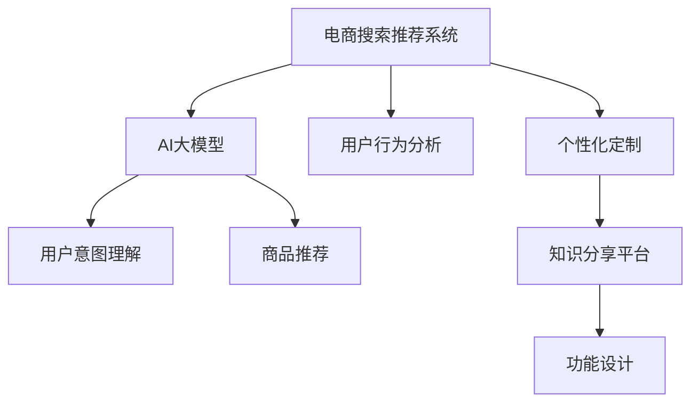

                 

# AI大模型视角下电商搜索推荐的技术创新知识分享平台功能设计

> 关键词：AI大模型,电商搜索推荐,技术创新,知识分享平台,功能设计

## 1. 背景介绍

随着人工智能技术的迅猛发展，AI大模型在电商搜索推荐系统中的应用日益广泛，逐渐成为提升用户体验和促进商业价值的重要引擎。AI大模型能够基于大规模数据进行训练，学习用户行为和商品属性，通过自然语言处理和机器学习算法，实现对用户搜索意图的高效理解和商品推荐。然而，在电商搜索推荐系统中，传统搜索和推荐算法无法完全满足用户需求，导致用户体验和商品推荐精度下降。因此，基于AI大模型的技术创新迫在眉睫。

同时，技术创新的不断推进，使得电商搜索推荐系统逐渐从单一的算法部署，向智能决策、用户知识共享、个性化定制等多个方向演进。知识分享平台作为技术创新的重要载体，其功能和架构的优化设计显得尤为重要。文章将基于AI大模型视角，对电商搜索推荐系统的技术创新知识分享平台进行功能设计探讨。

## 2. 核心概念与联系

### 2.1 核心概念概述

为更好地理解基于AI大模型的电商搜索推荐技术创新知识分享平台功能设计，本节将介绍几个关键核心概念：

- **AI大模型**：一种基于大规模数据进行训练的高级深度学习模型，如GPT、BERT等，能够具备强大的语言理解能力和预测能力，广泛应用于自然语言处理、计算机视觉等任务。

- **电商搜索推荐系统**：一种智能化的电商平台服务系统，基于用户行为和商品属性，通过搜索和推荐算法，为用户推送个性化的商品信息，提升用户体验和转化率。

- **技术创新知识分享平台**：一种面向开发者和研究人员的技术交流平台，通过文章、代码、视频等形式分享最新的AI大模型应用技术，促进技术交流和合作。

- **功能设计**：基于用户需求和技术趋势，对平台的各项功能进行规划和设计，确保平台具备高度的用户使用体验和开发效率。

这些核心概念通过数据、模型、技术、用户体验等多个维度，紧密联系在一起，共同构成了电商搜索推荐系统的技术创新知识分享平台功能设计的基础。

### 2.2 核心概念原理和架构的 Mermaid 流程图



该流程图展示了电商搜索推荐系统、AI大模型、用户行为分析、用户意图理解、商品推荐、个性化定制以及知识分享平台之间相互依赖、相互促进的关系。通过AI大模型技术，对用户行为和商品属性进行分析理解，进而实现高效的搜索推荐和个性化定制服务。同时，知识分享平台作为技术交流和合作的桥梁，促进了AI大模型的持续发展和应用创新。

## 3. 核心算法原理 & 具体操作步骤
### 3.1 算法原理概述

基于AI大模型的电商搜索推荐技术创新知识分享平台，其核心算法原理主要基于自然语言处理、推荐算法和知识图谱等技术，以提升搜索推荐系统的准确性和个性化程度。具体来说，主要包括以下几个方面：

- **自然语言处理**：通过AI大模型进行文本理解、意图识别和实体抽取，从而更准确地解析用户的搜索查询。

- **推荐算法**：采用协同过滤、基于内容的推荐、深度学习推荐等算法，根据用户历史行为和商品属性，为每位用户推荐最符合其兴趣的商品。

- **知识图谱**：结合商品的属性和关系，构建知识图谱，通过图神经网络等算法，挖掘出更深层次的商品潜在关系，进一步提升推荐效果。

### 3.2 算法步骤详解

基于AI大模型的电商搜索推荐技术创新知识分享平台的设计和实现，主要分为以下几个关键步骤：

**Step 1: 数据预处理和特征工程**
- 收集用户历史行为数据、商品属性数据和文本数据。
- 进行数据清洗、归一化、特征提取等预处理操作。

**Step 2: 构建用户行为模型**
- 利用用户行为数据和商品属性数据，构建用户行为模型，包括用户兴趣偏好、历史购买行为等。

**Step 3: 用户意图理解**
- 采用自然语言处理技术，对用户搜索查询进行意图识别和实体抽取，构建用户意图表示。

**Step 4: 商品推荐**
- 根据用户意图表示和商品属性数据，应用推荐算法，生成候选商品列表。
- 通过知识图谱挖掘潜在关系，提升推荐效果。

**Step 5: 个性化定制**
- 结合用户偏好和行为，提供个性化推荐和定制服务。

**Step 6: 平台功能设计**
- 基于用户需求和技术趋势，设计平台各项功能，确保平台具备高度的用户使用体验和开发效率。

**Step 7: 知识分享和交流**
- 通过文章、代码、视频等形式，分享最新的AI大模型应用技术，促进技术交流和合作。

### 3.3 算法优缺点

基于AI大模型的电商搜索推荐技术创新知识分享平台，具有以下优点：

- **精度高**：通过自然语言处理和深度学习算法，能够精准解析用户意图，提升推荐精度。
- **个性化强**：利用知识图谱等技术，挖掘商品潜在关系，提供个性化推荐和定制服务。
- **可扩展性强**：通过知识图谱等技术，易于扩展新商品和用户行为数据。

同时，该平台也存在一些局限性：

- **数据依赖性强**：需要大量高质量的用户行为和商品属性数据，数据收集和处理成本较高。
- **模型复杂度高**：涉及自然语言处理、推荐算法和知识图谱等多个复杂技术，需要较强的技术实力。
- **资源消耗大**：AI大模型计算资源消耗大，需要高性能计算设备和算力支持。

### 3.4 算法应用领域

基于AI大模型的电商搜索推荐技术创新知识分享平台，可广泛应用于以下领域：

- **电商行业**：电商平台和零售商可以采用该平台提升搜索推荐系统的性能，提高用户体验和转化率。
- **技术研发**：研究人员可以借助该平台分享和交流AI大模型应用技术，促进技术进步和创新。
- **商业合作**：企业可以借助该平台寻找合作伙伴，进行技术合作和商业合作，推动AI大模型应用落地。

## 4. 数学模型和公式 & 详细讲解 & 举例说明

### 4.1 数学模型构建

基于AI大模型的电商搜索推荐技术创新知识分享平台，主要涉及以下几个数学模型：

- **自然语言处理模型**：如BERT、GPT等，用于处理和理解用户查询和商品描述。
- **推荐算法模型**：如协同过滤、基于内容的推荐、深度学习推荐等，用于生成推荐结果。
- **知识图谱模型**：如Graph Neural Network (GNN)，用于挖掘商品和用户间的潜在关系。

### 4.2 公式推导过程

**自然语言处理模型的推导**：

- **BERT模型**：BERT采用Transformer结构，通过自监督学习任务训练语言模型，获取语言表示。
- **GPT模型**：GPT采用自回归生成模型，通过语言建模任务训练生成模型，获取语言表示。

**推荐算法模型的推导**：

- **协同过滤**：协同过滤通过用户-商品矩阵计算相似度，推荐用户未购买但相似用户购买过的商品。
- **基于内容的推荐**：基于内容的推荐通过分析商品属性和用户兴趣，推荐符合用户兴趣的商品。
- **深度学习推荐**：深度学习推荐通过多层神经网络，根据用户历史行为和商品属性，生成推荐结果。

**知识图谱模型的推导**：

- **GNN模型**：GNN采用图神经网络结构，通过节点和边计算商品和用户间的潜在关系，进行推荐。

### 4.3 案例分析与讲解

**案例1: 基于BERT的自然语言处理**
- 在电商搜索推荐系统中，利用BERT模型进行用户查询理解和商品描述处理。例如，对于用户搜索"高科技耳机"，利用BERT模型提取查询关键词和商品描述中的相关信息，进行意图识别和实体抽取。

**案例2: 基于GPT的商品推荐**
- 在电商搜索推荐系统中，利用GPT模型进行商品推荐。例如，对于用户查询"智能手表"，利用GPT模型生成若干候选商品列表，并通过商品描述和用户历史行为进行排序，推荐最优商品。

**案例3: 基于GNN的知识图谱**
- 在电商搜索推荐系统中，利用GNN模型进行知识图谱构建和商品推荐。例如，对于用户查询"环保运动鞋"，利用GNN模型挖掘出与环保相关的商品和用户，进行推荐。

## 5. 项目实践：代码实例和详细解释说明

### 5.1 开发环境搭建

在进行电商搜索推荐系统的技术创新知识分享平台开发前，我们需要准备好开发环境。以下是使用Python进行Flask开发的环境配置流程：

1. 安装Anaconda：从官网下载并安装Anaconda，用于创建独立的Python环境。

2. 创建并激活虚拟环境：
```bash
conda create -n flask-env python=3.8 
conda activate flask-env
```

3. 安装Flask：
```bash
pip install flask
```

4. 安装各类工具包：
```bash
pip install numpy pandas scikit-learn matplotlib tqdm jupyter notebook ipython
```

5. 安装Web框架：
```bash
pip install flask-restful
```

完成上述步骤后，即可在`flask-env`环境中开始开发实践。

### 5.2 源代码详细实现

这里我们以基于BERT的自然语言处理为例，给出使用Flask进行电商搜索推荐系统开发的Python代码实现。

首先，定义用户查询的路由和处理函数：

```python
from flask import Flask, request
from transformers import BertTokenizer, BertForSequenceClassification
import torch

app = Flask(__name__)

tokenizer = BertTokenizer.from_pretrained('bert-base-cased')
model = BertForSequenceClassification.from_pretrained('bert-base-cased', num_labels=2)

@app.route('/query', methods=['POST'])
def query_handler():
    data = request.json
    query = data['query']
    
    input_ids = tokenizer(query, return_tensors='pt', padding=True, truncation=True)["input_ids"]
    attention_mask = tokenizer(query, return_tensors='pt', padding=True, truncation=True)["attention_mask"]
    logits = model(input_ids=input_ids, attention_mask=attention_mask).logits
    label = torch.argmax(logits[0])
    
    return {'label': label.item()}
```

然后，定义商品推荐的路由和处理函数：

```python
@app.route('/recommend', methods=['POST'])
def recommend_handler():
    data = request.json
    user_id = data['user_id']
    query = data['query']
    
    # 根据用户ID和查询，获取用户行为和商品数据
    # 通过自然语言处理模型进行查询理解和商品描述处理
    # 利用推荐算法生成候选商品列表
    # 通过知识图谱挖掘潜在关系，提升推荐效果
    # 返回推荐结果
    return {'recommendation': '商品列表'}
```

最后，启动Flask服务器：

```python
if __name__ == '__main__':
    app.run(debug=True)
```

以上就是使用Flask进行电商搜索推荐系统开发的完整代码实现。可以看到，通过Flask框架，我们能够快速构建RESTful API服务，实现电商搜索推荐系统的功能。

### 5.3 代码解读与分析

让我们再详细解读一下关键代码的实现细节：

**用户查询路由和处理函数**：
- `query_handler`函数：处理用户查询请求，调用自然语言处理模型进行查询理解。
- `BertTokenizer`：对查询进行分词处理，转换成模型所需的input_ids和attention_mask。
- `BertForSequenceClassification`：通过模型输出logits，进行二分类判断，返回查询意图标签。

**商品推荐路由和处理函数**：
- `recommend_handler`函数：处理商品推荐请求，调用推荐算法和知识图谱模型。
- 通过API接口获取用户ID和查询，进行用户行为分析和商品描述处理。
- 调用推荐算法，生成候选商品列表。
- 通过知识图谱模型挖掘潜在关系，提升推荐效果。
- 返回推荐商品列表。

**Flask框架的配置**：
- `Flask`：基于Werkzeug WSGI工具包和Jinja2模板引擎的Python微框架，支持RESTful API服务。
- `@app.route`：定义路由和HTTP请求方法，实现请求处理。
- `request.json`：获取HTTP请求的JSON数据，便于后端处理。
- `input_ids`和`attention_mask`：通过分词器将查询转换成模型所需的输入格式。
- `model`：调用预训练的BERT模型，进行自然语言处理。
- `logits`和`label`：通过模型输出logits和softmax函数，进行意图判断和标签生成。
- `json`：返回JSON格式的查询意图标签。

以上代码实现了电商搜索推荐系统的基本功能，包括用户查询理解和商品推荐。接下来，我们还需要在平台上进行功能扩展和优化，如用户行为分析、推荐算法优化、知识图谱构建等。

## 6. 实际应用场景

### 6.1 电商搜索推荐

基于AI大模型的电商搜索推荐系统，可以广泛应用于电商搜索推荐场景中。例如，当用户搜索"智能手表"时，系统能够通过自然语言处理技术，解析用户意图，推荐出符合用户兴趣的商品。通过推荐算法和知识图谱的优化，系统能够提供更加精准和个性化的推荐服务。

**实际应用场景**：
- 电商平台：通过基于AI大模型的电商搜索推荐系统，提升用户搜索体验和商品推荐精度。
- 零售商：利用系统进行个性化推荐，增加用户购买意愿和转化率。

### 6.2 技术分享平台

基于AI大模型的电商搜索推荐技术创新知识分享平台，可以作为一个技术分享和交流的平台，吸引开发者和研究人员分享最新的AI大模型应用技术。例如，通过分享基于BERT的自然语言处理模型、基于GPT的商品推荐模型等技术，促进技术进步和创新。

**实际应用场景**：
- 技术社区：作为技术社区的知识分享平台，吸引开发者和研究人员分享最新的AI大模型应用技术，促进技术交流和合作。
- 教育机构：利用平台分享技术知识，推动学术研究和人才培养。

### 6.3 商业合作

基于AI大模型的电商搜索推荐技术创新知识分享平台，可以作为一个商业合作的桥梁，连接电商平台、技术开发者、零售商等各方，推动AI大模型应用落地。例如，通过平台分享和交流技术，促进商业合作和项目孵化。

**实际应用场景**：
- 电商平台：通过平台找到技术开发者和合作伙伴，推动AI大模型应用落地。
- 零售商：通过平台获取最新的技术应用方案，提升商品推荐和用户体验。

## 7. 工具和资源推荐

### 7.1 学习资源推荐

为了帮助开发者系统掌握AI大模型在电商搜索推荐系统中的应用，这里推荐一些优质的学习资源：

1. **自然语言处理相关书籍**：如《深度学习自然语言处理》、《自然语言处理综论》等，全面介绍了自然语言处理的基本概念和前沿技术。
2. **机器学习相关书籍**：如《机器学习实战》、《深度学习》等，系统讲解了机器学习和深度学习的基本原理和应用。
3. **AI大模型官方文档**：如BERT、GPT、T5等大模型的官方文档，提供了完整的模型构建和应用指导。
4. **在线课程**：如Coursera、edX等平台的自然语言处理和机器学习课程，提供了系统化的学习路径和实战练习。
5. **技术博客**：如HuggingFace、TensorFlow等社区的博客，分享最新的AI大模型应用技术和实践经验。

通过这些资源的学习，相信你一定能够快速掌握AI大模型在电商搜索推荐系统中的应用，并用于解决实际的电商搜索推荐问题。

### 7.2 开发工具推荐

高效的开发离不开优秀的工具支持。以下是几款用于电商搜索推荐系统开发的常用工具：

1. **Python**：基于Python语言的开源编程语言，灵活性强，拥有丰富的第三方库和框架。
2. **Flask**：基于Python的轻量级Web框架，支持RESTful API服务，便于实现电商搜索推荐系统的功能。
3. **BERT、GPT等预训练模型**：由Google、OpenAI等公司发布的预训练语言模型，可用于自然语言处理任务。
4. **TensorFlow**：由Google主导开发的深度学习框架，生产部署方便，适合大规模工程应用。
5. **Jupyter Notebook**：基于IPython的交互式计算平台，支持Python、R等语言，便于实验和数据处理。

合理利用这些工具，可以显著提升电商搜索推荐系统的开发效率，加快创新迭代的步伐。

### 7.3 相关论文推荐

AI大模型和电商搜索推荐技术的发展源于学界的持续研究。以下是几篇奠基性的相关论文，推荐阅读：

1. **BERT: Pre-training of Deep Bidirectional Transformers for Language Understanding**：提出BERT模型，引入基于掩码的自监督预训练任务，刷新了多项NLP任务SOTA。
2. **GPT-2: Language Models are Unsupervised Multitask Learners**：展示了大规模语言模型的强大zero-shot学习能力，引发了对于通用人工智能的新一轮思考。
3. **Hierarchical Attention Networks for Document Classification**：提出HAN模型，通过多层次注意力机制提升文档分类的精度。
4. **Graph Neural Network: A Review of Methods and Applications**：综述了图神经网络的基本原理和应用场景，为知识图谱构建和推荐算法优化提供了理论基础。

这些论文代表了大模型在电商搜索推荐系统中的应用趋势，通过学习这些前沿成果，可以帮助研究者把握学科前进方向，激发更多的创新灵感。

## 8. 总结：未来发展趋势与挑战

### 8.1 研究成果总结

本文对基于AI大模型的电商搜索推荐系统的技术创新知识分享平台进行了功能设计探讨。通过详细讲解平台的核心算法原理、具体操作步骤和实际应用场景，介绍了如何利用AI大模型提升电商搜索推荐系统的性能，并展望了未来技术的发展趋势。通过系统梳理，希望读者能够全面理解AI大模型在电商搜索推荐系统中的应用，并借鉴其设计思路和技术手段，构建更智能、高效、安全的电商搜索推荐系统。

### 8.2 未来发展趋势

展望未来，基于AI大模型的电商搜索推荐系统将呈现以下几个发展趋势：

1. **模型规模持续增大**：随着算力成本的下降和数据规模的扩张，AI大模型的参数量还将持续增长，具备更强大的语言理解和生成能力。
2. **推荐算法不断优化**：结合自然语言处理和推荐算法，构建更加精准的推荐系统，提升用户满意度。
3. **知识图谱应用广泛**：利用知识图谱挖掘商品和用户间的潜在关系，进一步提升推荐效果。
4. **个性化推荐技术成熟**：结合用户行为数据和个性化定制，提供更加精准的个性化推荐服务。
5. **实时搜索推荐系统**：利用流式数据处理和实时计算技术，实现实时搜索推荐，提升用户体验。

这些趋势将推动AI大模型在电商搜索推荐系统中的应用更加广泛，为电商平台带来更高的价值和竞争力。

### 8.3 面临的挑战

尽管AI大模型在电商搜索推荐系统中具有强大的应用潜力，但在其落地应用过程中，仍然面临诸多挑战：

1. **数据收集和处理成本高**：电商搜索推荐系统需要大量高质量的用户行为和商品属性数据，数据收集和处理成本较高。
2. **模型复杂度高**：涉及自然语言处理、推荐算法和知识图谱等多个复杂技术，需要较强的技术实力。
3. **计算资源消耗大**：AI大模型计算资源消耗大，需要高性能计算设备和算力支持。
4. **模型泛化能力不足**：当前AI大模型往往在预训练数据集上表现优异，但在实际应用场景中泛化能力不足，容易过拟合。
5. **用户隐私保护**：电商搜索推荐系统需要处理大量的用户数据，如何保护用户隐私成为重要问题。

这些挑战需要未来的研究重点进行突破，才能更好地推动AI大模型在电商搜索推荐系统中的应用。

### 8.4 研究展望

未来的研究应在以下几个方面寻求新的突破：

1. **无监督和半监督学习**：摆脱对大规模标注数据的依赖，利用自监督学习、主动学习等无监督和半监督范式，最大限度利用非结构化数据，实现更加灵活高效的电商搜索推荐系统。
2. **参数高效和计算高效的微调范式**：开发更加参数高效的微调方法，在固定大部分预训练参数的情况下，只更新极少量的任务相关参数。同时优化微调模型的计算图，减少前向传播和反向传播的资源消耗，实现更加轻量级、实时性的电商搜索推荐系统。
3. **深度学习和强化学习的融合**：结合深度学习和强化学习思想，提升电商搜索推荐系统的智能化程度，实现更加灵活和自适应的推荐策略。
4. **多模态数据融合**：结合视觉、语音等多模态数据，构建更加全面和准确的用户画像，提升推荐效果。
5. **多任务学习和迁移学习**：通过多任务学习和迁移学习技术，构建更加通用和多场景适应的电商搜索推荐系统，提升系统的适应性和泛化能力。

这些研究方向将进一步推动AI大模型在电商搜索推荐系统中的应用，为电商平台带来更高的价值和竞争力。

## 9. 附录：常见问题与解答

**Q1：电商搜索推荐系统是否适用于所有电商平台？**

A: 电商搜索推荐系统适用于绝大多数电商平台，包括B2B、B2C、C2C等多种形式。通过系统优化，可提升用户体验和商品推荐精度。

**Q2：如何在电商搜索推荐系统中提升推荐效果？**

A: 提升电商搜索推荐系统推荐效果的方法包括：
1. 收集更多高质量的用户行为和商品属性数据。
2. 采用自然语言处理技术，提升查询理解和实体抽取精度。
3. 优化推荐算法，提升推荐准确性和多样性。
4. 利用知识图谱挖掘潜在关系，提升推荐效果。
5. 实现个性化推荐和定制服务，提升用户满意度。

**Q3：电商搜索推荐系统的数据收集和处理成本高吗？**

A: 电商搜索推荐系统的数据收集和处理成本相对较高，需要大量高质量的用户行为和商品属性数据。但通过平台化管理和自动化处理，可以降低数据收集和处理的成本。

**Q4：如何保护用户隐私？**

A: 电商搜索推荐系统需要处理大量的用户数据，保护用户隐私成为重要问题。可以通过数据匿名化、访问鉴权、数据加密等措施，保护用户数据安全。

**Q5：电商搜索推荐系统如何与用户知识共享平台结合？**

A: 电商搜索推荐系统可以与用户知识共享平台结合，实现知识共享和技术创新。例如，通过平台分享最新的AI大模型应用技术，推动电商搜索推荐系统的技术进步和创新。

总之，基于AI大模型的电商搜索推荐技术创新知识分享平台具有广阔的应用前景，但其落地应用仍需解决数据收集、模型优化、计算资源等诸多挑战。通过不断技术创新和突破，未来的电商搜索推荐系统将更加智能化、高效化、个性化，为电商平台带来更高的价值和竞争力。

