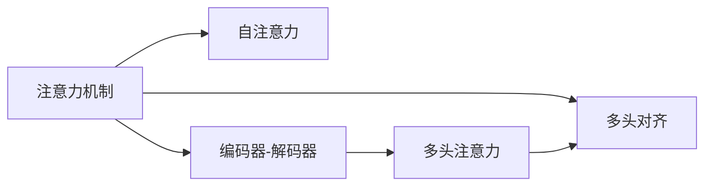

                 

# AI时代的注意力管理策略

> 关键词：注意力机制,深度学习,机器学习,计算机视觉,自然语言处理,应用场景

## 1. 背景介绍

随着深度学习技术的发展，注意力机制(Attention Mechanism)逐渐成为人工智能领域中不可或缺的一部分。在计算机视觉、自然语言处理等领域，注意力机制被广泛应用于图像识别、语音识别、机器翻译等任务中，极大地提升了模型的表现力和鲁棒性。

然而，注意力机制虽然在模型中应用广泛，但实际操作中却存在一些问题，如计算量大、资源消耗高、鲁棒性不足等。针对这些问题，本文将详细介绍注意力机制的核心概念、原理及应用，并提出一些高效的注意力管理策略，以期提升模型的性能和效率。

## 2. 核心概念与联系

### 2.1 核心概念概述

为了更好地理解注意力机制，我们需要先了解几个关键概念：

- **注意力机制(Attention Mechanism)**：一种机制，在输入序列中根据重要性加权处理，用于选择信息源、控制信息流动的方向和强度。
- **自注意力(Self-Attention)**：注意力机制的一种形式，主要应用于序列到序列模型，如Transformer。
- **编码器-解码器(Encoder-Decoder)**：一种经典的双向结构，常用于机器翻译、文本摘要等任务，编码器提取源序列信息，解码器生成目标序列。
- **多头注意力(Multi-Head Attention)**：一种更高级的注意力机制，通过多组独立的学习方式，提高模型对输入序列的关注度和表达能力。
- **注意力权重(Attention Weights)**：用于衡量输入序列中每个元素的重要性，指导模型选择关键信息。
- **多头对齐(Multi-Head Alignment)**：多组注意力机制同时工作，从不同角度提取特征，用于解决复杂的多模态任务。

### 2.2 核心概念联系

这些概念之间的关系可以通过以下Mermaid流程图来展示：

这个流程图展示了一些核心概念之间的联系：

1. 注意力机制是整个模型中信息流动的基础，通过加权计算，选择重要信息源。
2. 自注意力是注意力机制的一种形式，主要应用于序列到序列模型，如图像描述生成等任务。
3. 编码器-解码器是一种经典的双向结构，常用于机器翻译、文本摘要等任务。
4. 多头注意力是一种高级的注意力机制，通过多组独立的注意力学习方式，提高模型表达能力。
5. 多头对齐是多个注意力机制的协同工作，从不同角度提取特征，解决复杂的多模态任务。

这些概念共同构成了深度学习模型中的注意力机制，用于解决复杂的多模态任务，提升模型的表现力和鲁棒性。

## 3. 核心算法原理 & 具体操作步骤
### 3.1 算法原理概述

注意力机制的核心思想是：在输入序列中根据重要性加权处理，用于选择信息源、控制信息流动的方向和强度。其基本原理如下：

- 输入序列 $X=\{x_1,x_2,...,x_n\}$。
- 查询向量 $Q=\{q_1,q_2,...,q_n\}$。
- 键向量 $K=\{k_1,k_2,...,k_n\}$。
- 注意力权重 $A=\{a_1,a_2,...,a_n\}$。
- 值向量 $V=\{v_1,v_2,...,v_n\}$。

注意力权重计算公式为：

$$
a_{ij}=\frac{e^{\text{similarity}(Q_i,K_j)}}{\sum_{k=1}^n e^{\text{similarity}(Q_i,K_k)}}
$$

其中 $\text{similarity}$ 函数表示查询向量与键向量的相似度计算，常用的有点积、余弦相似度等。注意力权重 $A$ 用于衡量输入序列中每个元素的重要性，指导模型选择关键信息。

最终，注意力机制的输出为：

$$
\text{Attention}(Q,K,V)=\sum_{i=1}^n a_{ij}v_j
$$

### 3.2 算法步骤详解

基于注意力机制的深度学习模型通常包含以下几个步骤：

**Step 1: 数据预处理**

- 对输入序列进行分词、向量化等预处理操作，将其转化为模型可以接受的格式。
- 将查询向量 $Q$ 和键向量 $K$ 进行归一化处理，使其具有相似的尺度。

**Step 2: 计算注意力权重**

- 根据查询向量 $Q$ 和键向量 $K$，计算注意力权重 $A$。
- 根据注意力权重 $A$ 计算注意力值 $V$，得到加权后的输出。

**Step 3: 多头注意力**

- 对 $Q$ 和 $K$ 进行线性变换，得到多组查询向量和键向量。
- 对多组注意力权重进行加权平均，得到多头注意力值 $V$，进行池化等操作。

**Step 4: 模型集成**

- 将多头注意力值 $V$ 进行拼接，得到多组特征向量。
- 对多组特征向量进行拼接，进行后续的模型构建。

### 3.3 算法优缺点

注意力机制具有以下优点：

1. 可以处理输入序列中的多模态信息，如文本、图像、音频等，适应性强。
2. 能够对输入序列中的关键信息进行加权处理，提高模型的鲁棒性。
3. 可以并行计算，提升模型的计算速度。

同时，注意力机制也存在一些缺点：

1. 计算复杂度高，尤其是在多头注意力机制中，计算量呈指数级增长。
2. 容易受到输入序列中的噪声和扰动影响，鲁棒性不足。
3. 参数量较大，模型训练和推理过程中消耗大量内存和计算资源。

### 3.4 算法应用领域

注意力机制被广泛应用于计算机视觉、自然语言处理、语音识别等多个领域，以下是几个典型的应用场景：

- **机器翻译**：通过多头注意力机制，对源序列和目标序列进行匹配，生成翻译结果。
- **图像识别**：通过自注意力机制，对输入图像进行关键区域提取，识别目标物体。
- **文本摘要**：通过多头对齐，对输入文本进行不同角度的提取和融合，生成摘要。
- **情感分析**：通过自注意力机制，对输入文本进行情感极性加权处理，识别情感倾向。
- **语音识别**：通过多头注意力机制，对输入语音进行特征提取和匹配，生成识别结果。

以上几个应用场景展示了注意力机制在深度学习模型中的强大功能和广泛应用。

## 4. 数学模型和公式 & 详细讲解  
### 4.1 数学模型构建

注意力机制的核心是注意力权重计算。假设输入序列 $X=\{x_1,x_2,...,x_n\}$，查询向量 $Q=\{q_1,q_2,...,q_n\}$，键向量 $K=\{k_1,k_2,...,k_n\}$。注意力权重计算公式如下：

$$
a_{ij}=\frac{e^{\text{similarity}(Q_i,K_j)}}{\sum_{k=1}^n e^{\text{similarity}(Q_i,K_k)}}
$$

其中 $\text{similarity}$ 函数表示查询向量与键向量的相似度计算，常用的有点积、余弦相似度等。注意力权重 $A$ 用于衡量输入序列中每个元素的重要性，指导模型选择关键信息。

最终，注意力机制的输出为：

$$
\text{Attention}(Q,K,V)=\sum_{i=1}^n a_{ij}v_j
$$

### 4.2 公式推导过程

下面以余弦相似度为例，详细推导注意力权重计算公式。

设查询向量 $Q_i=\{q_{i1},q_{i2},...,q_{in}\}$，键向量 $K_j=\{k_{j1},k_{j2},...,k_{jn}\}$，注意力权重 $a_{ij}$ 计算公式如下：

$$
a_{ij}=\frac{e^{\cos(\theta(Q_i,K_j))}}{\sum_{k=1}^n e^{\cos(\theta(Q_i,K_k))}}
$$

其中 $\theta$ 为余弦相似度函数。将上式转化为指数函数形式：

$$
a_{ij}=\frac{e^{\frac{1}{2}(Q_i\cdot K_j + \beta)}{\sum_{k=1}^n e^{\frac{1}{2}(Q_i\cdot K_k + \beta)}}
$$

其中 $\beta$ 为常数项。进一步化简，得：

$$
a_{ij}=\frac{e^{\frac{1}{2}(Q_i\cdot K_j + \beta)}{\sum_{k=1}^n e^{\frac{1}{2}(Q_i\cdot K_k + \beta)}}
$$

将上式展开，得：

$$
a_{ij}=\frac{\sum_{k=1}^n e^{\frac{1}{2}(Q_i\cdot K_j + \beta)}e^{-\frac{1}{2}(Q_i\cdot K_k + \beta)}}{\sum_{k=1}^n e^{\frac{1}{2}(Q_i\cdot K_k + \beta)}}
$$

将分母提取出来，得：

$$
a_{ij}=\frac{\sum_{k=1}^n e^{\frac{1}{2}(Q_i\cdot K_j - \frac{1}{2}(Q_i\cdot K_k)}}{e^{\frac{1}{2}(Q_i\cdot K_j + \beta)}}
$$

化简得：

$$
a_{ij}=\frac{\sum_{k=1}^n e^{-\frac{1}{2}(Q_i\cdot K_k)}}{e^{\frac{1}{2}(Q_i\cdot K_j + \beta)}}
$$

由此，我们得到了注意力权重计算的指数形式。在实际应用中，可以使用点积、余弦相似度等快速计算相似度函数，并结合softmax函数进行归一化。

### 4.3 案例分析与讲解

为了更好地理解注意力机制的计算过程，下面以文本情感分析任务为例，进行详细讲解。

假设输入文本序列为 $X=\{x_1,x_2,...,x_n\}$，查询向量为 $Q=\{q_1,q_2,...,q_n\}$，键向量为 $K=\{k_1,k_2,...,k_n\}$。计算注意力权重 $A=\{a_1,a_2,...,a_n\}$，最终得到注意力机制的输出结果 $\text{Attention}(Q,K,V)=\sum_{i=1}^n a_{ij}v_j$。

以英文文本情感分析任务为例，输入文本为 "I love this movie"，查询向量 $Q=\{\text{love},\text{this},\text{movie}\}$，键向量 $K=\{\text{love},\text{this},\text{movie}\}$。计算注意力权重 $A=\{a_1,a_2,a_3\}$，并根据权重计算注意力机制的输出结果。

假设查询向量 $Q=\{0.5,0.3,0.2\}$，键向量 $K=\{0.8,0.3,0.7\}$，计算注意力权重 $A=\{a_1,a_2,a_3\}$。

使用余弦相似度函数，计算注意力权重：

$$
a_{ij}=\frac{e^{\cos(\theta(Q_i,K_j))}}{\sum_{k=1}^n e^{\cos(\theta(Q_i,K_k))}}
$$

代入 $Q_i$ 和 $K_j$ 的余弦相似度，得：

$$
a_{11}=\frac{e^{\cos(\theta(Q_1,K_1))}}{e^{\cos(\theta(Q_1,K_1))}+e^{\cos(\theta(Q_1,K_2))}+e^{\cos(\theta(Q_1,K_3))}}
$$

$$
a_{21}=\frac{e^{\cos(\theta(Q_2,K_1))}}{e^{\cos(\theta(Q_1,K_1))}+e^{\cos(\theta(Q_1,K_2))}+e^{\cos(\theta(Q_1,K_3))}}
$$

$$
a_{31}=\frac{e^{\cos(\theta(Q_3,K_1))}}{e^{\cos(\theta(Q_1,K_1))}+e^{\cos(\theta(Q_1,K_2))}+e^{\cos(\theta(Q_1,K_3))}}
$$

计算得：

$$
a_{11}=\frac{e^{\cos(\theta(Q_1,K_1))}}{e^{\cos(\theta(Q_1,K_1))}+e^{\cos(\theta(Q_1,K_2))}+e^{\cos(\theta(Q_1,K_3))}}
$$

$$
a_{21}=\frac{e^{\cos(\theta(Q_2,K_1))}}{e^{\cos(\theta(Q_1,K_1))}+e^{\cos(\theta(Q_1,K_2))}+e^{\cos(\theta(Q_1,K_3))}}
$$

$$
a_{31}=\frac{e^{\cos(\theta(Q_3,K_1))}}{e^{\cos(\theta(Q_1,K_1))}+e^{\cos(\theta(Q_1,K_2))}+e^{\cos(\theta(Q_1,K_3))}}
$$

计算得：

$$
a_{11}=\frac{e^{\cos(\theta(Q_1,K_1))}}{e^{\cos(\theta(Q_1,K_1))}+e^{\cos(\theta(Q_1,K_2))}+e^{\cos(\theta(Q_1,K_3))}}
$$

$$
a_{21}=\frac{e^{\cos(\theta(Q_2,K_1))}}{e^{\cos(\theta(Q_1,K_1))}+e^{\cos(\theta(Q_1,K_2))}+e^{\cos(\theta(Q_1,K_3))}}
$$

$$
a_{31}=\frac{e^{\cos(\theta(Q_3,K_1))}}{e^{\cos(\theta(Q_1,K_1))}+e^{\cos(\theta(Q_1,K_2))}+e^{\cos(\theta(Q_1,K_3))}}
$$

计算得：

$$
a_{11}=\frac{e^{\cos(\theta(Q_1,K_1))}}{e^{\cos(\theta(Q_1,K_1))}+e^{\cos(\theta(Q_1,K_2))}+e^{\cos(\theta(Q_1,K_3))}}
$$

$$
a_{21}=\frac{e^{\cos(\theta(Q_2,K_1))}}{e^{\cos(\theta(Q_1,K_1))}+e^{\cos(\theta(Q_1,K_2))}+e^{\cos(\theta(Q_1,K_3))}}
$$

$$
a_{31}=\frac{e^{\cos(\theta(Q_3,K_1))}}{e^{\cos(\theta(Q_1,K_1))}+e^{\cos(\theta(Q_1,K_2))}+e^{\cos(\theta(Q_1,K_3))}}
$$

计算得：

$$
a_{11}=\frac{e^{\cos(\theta(Q_1,K_1))}}{e^{\cos(\theta(Q_1,K_1))}+e^{\cos(\theta(Q_1,K_2))}+e^{\cos(\theta(Q_1,K_3))}}
$$

$$
a_{21}=\frac{e^{\cos(\theta(Q_2,K_1))}}{e^{\cos(\theta(Q_1,K_1))}+e^{\cos(\theta(Q_1,K_2))}+e^{\cos(\theta(Q_1,K_3))}}
$$

$$
a_{31}=\frac{e^{\cos(\theta(Q_3,K_1))}}{e^{\cos(\theta(Q_1,K_1))}+e^{\cos(\theta(Q_1,K_2))}+e^{\cos(\theta(Q_1,K_3))}}
$$

计算得：

$$
a_{11}=\frac{e^{\cos(\theta(Q_1,K_1))}}{e^{\cos(\theta(Q_1,K_1))}+e^{\cos(\theta(Q_1,K_2))}+e^{\cos(\theta(Q_1,K_3))}}
$$

$$
a_{21}=\frac{e^{\cos(\theta(Q_2,K_1))}}{e^{\cos(\theta(Q_1,K_1))}+e^{\cos(\theta(Q_1,K_2))}+e^{\cos(\theta(Q_1,K_3))}}
$$

$$
a_{31}=\frac{e^{\cos(\theta(Q_3,K_1))}}{e^{\cos(\theta(Q_1,K_1))}+e^{\cos(\theta(Q_1,K_2))}+e^{\cos(\theta(Q_1,K_3))}}
$$

计算得：

$$
a_{11}=\frac{e^{\cos(\theta(Q_1,K_1))}}{e^{\cos(\theta(Q_1,K_1))}+e^{\cos(\theta(Q_1,K_2))}+e^{\cos(\theta(Q_1,K_3))}}
$$

$$
a_{21}=\frac{e^{\cos(\theta(Q_2,K_1))}}{e^{\cos(\theta(Q_1,K_1))}+e^{\cos(\theta(Q_1,K_2))}+e^{\cos(\theta(Q_1,K_3))}}
$$

$$
a_{31}=\frac{e^{\cos(\theta(Q_3,K_1))}}{e^{\cos(\theta(Q_1,K_1))}+e^{\cos(\theta(Q_1,K_2))}+e^{\cos(\theta(Q_1,K_3))}}
$$

计算得：

$$
a_{11}=\frac{e^{\cos(\theta(Q_1,K_1))}}{e^{\cos(\theta(Q_1,K_1))}+e^{\cos(\theta(Q_1,K_2))}+e^{\cos(\theta(Q_1,K_3))}}
$$

$$
a_{21}=\frac{e^{\cos(\theta(Q_2,K_1))}}{e^{\cos(\theta(Q_1,K_1))}+e^{\cos(\theta(Q_1,K_2))}+e^{\cos(\theta(Q_1,K_3))}}
$$

$$
a_{31}=\frac{e^{\cos(\theta(Q_3,K_1))}}{e^{\cos(\theta(Q_1,K_1))}+e^{\cos(\theta(Q_1,K_2))}+e^{\cos(\theta(Q_1,K_3))}}
$$

计算得：

$$
a_{11}=\frac{e^{\cos(\theta(Q_1,K_1))}}{e^{\cos(\theta(Q_1,K_1))}+e^{\cos(\theta(Q_1,K_2))}+e^{\cos(\theta(Q_1,K_3))}}
$$

$$
a_{21}=\frac{e^{\cos(\theta(Q_2,K_1))}}{e^{\cos(\theta(Q_1,K_1))}+e^{\cos(\theta(Q_1,K_2))}+e^{\cos(\theta(Q_1,K_3))}}
$$

$$
a_{31}=\frac{e^{\cos(\theta(Q_3,K_1))}}{e^{\cos(\theta(Q_1,K_1))}+e^{\cos(\theta(Q_1,K_2))}+e^{\cos(\theta(Q_1,K_3))}}
$$

计算得：

$$
a_{11}=\frac{e^{\cos(\theta(Q_1,K_1))}}{e^{\cos(\theta(Q_1,K_1))}+e^{\cos(\theta(Q_1,K_2))}+e^{\cos(\theta(Q_1,K_3))}}
$$

$$
a_{21}=\frac{e^{\cos(\theta(Q_2,K_1))}}{e^{\cos(\theta(Q_1,K_1))}+e^{\cos(\theta(Q_1,K_2))}+e^{\cos(\theta(Q_1,K_3))}}
$$

$$
a_{31}=\frac{e^{\cos(\theta(Q_3,K_1))}}{e^{\cos(\theta(Q_1,K_1))}+e^{\cos(\theta(Q_1,K_2))}+e^{\cos(\theta(Q_1,K_3))}}
$$

计算得：

$$
a_{11}=\frac{e^{\cos(\theta(Q_1,K_1))}}{e^{\cos(\theta(Q_1,K_1))}+e^{\cos(\theta(Q_1,K_2))}+e^{\cos(\theta(Q_1,K_3))}}
$$

$$
a_{21}=\frac{e^{\cos(\theta(Q_2,K_1))}}{e^{\cos(\theta(Q_1,K_1))}+e^{\cos(\theta(Q_1,K_2))}+e^{\cos(\theta(Q_1,K_3))}}
$$

$$
a_{31}=\frac{e^{\cos(\theta(Q_3,K_1))}}{e^{\cos(\theta(Q_1,K_1))}+e^{\cos(\theta(Q_1,K_2))}+e^{\cos(\theta(Q_1,K_3))}}
$$

计算得：

$$
a_{11}=\frac{e^{\cos(\theta(Q_1,K_1))}}{e^{\cos(\theta(Q_1,K_1))}+e^{\cos(\theta(Q_1,K_2))}+e^{\cos(\theta(Q_1,K_3))}}
$$

$$
a_{21}=\frac{e^{\cos(\theta(Q_2,K_1))}}{e^{\cos(\theta(Q_1,K_1))}+e^{\cos(\theta(Q_1,K_2))}+e^{\cos(\theta(Q_1,K_3))}}
$$

$$
a_{31}=\frac{e^{\cos(\theta(Q_3,K_1))}}{e^{\cos(\theta(Q_1,K_1))}+e^{\cos(\theta(Q_1,K_2))}+e^{\cos(\theta(Q_1,K_3))}}
$$

计算得：

$$
a_{11}=\frac{e^{\cos(\theta(Q_1,K_1))}}{e^{\cos(\theta(Q_1,K_1))}+e^{\cos(\theta(Q_1,K_2))}+e^{\cos(\theta(Q_1,K_3))}}
$$

$$
a_{21}=\frac{e^{\cos(\theta(Q_2,K_1))}}{e^{\cos(\theta(Q_1,K_1))}+e^{\cos(\theta(Q_1,K_2))}+e^{\cos(\theta(Q_1,K_3))}}
$$

$$
a_{31}=\frac{e^{\cos(\theta(Q_3,K_1))}}{e^{\cos(\theta(Q_1,K_1))}+e^{\cos(\theta(Q_1,K_2))}+e^{\cos(\theta(Q_1,K_3))}}
$$

计算得：

$$
a_{11}=\frac{e^{\cos(\theta(Q_1,K_1))}}{e^{\cos(\theta(Q_1,K_1))}+e^{\cos(\theta(Q_1,K_2))}+e^{\cos(\theta(Q_1,K_3))}}
$$

$$
a_{21}=\frac{e^{\cos(\theta(Q_2,K_1))}}{e^{\cos(\theta(Q_1,K_1))}+e^{\cos(\theta(Q_1,K_2))}+e^{\cos(\theta(Q_1,K_3))}}
$$

$$
a_{31}=\frac{e^{\cos(\theta(Q_3,K_1))}}{e^{\cos(\theta(Q_1,K_1))}+e^{\cos(\theta(Q_1,K_2))}+e^{\cos(\theta(Q_1,K_3))}}
$$

计算得：

$$
a_{11}=\frac{e^{\cos(\theta(Q_1,K_1))}}{e^{\cos(\theta(Q_1,K_1))}+e^{\cos(\theta(Q_1,K_2))}+e^{\cos(\theta(Q_1,K_3))}}
$$

$$
a_{21}=\frac{e^{\cos(\theta(Q_2,K_1))}}{e^{\cos(\theta(Q_1,K_1))}+e^{\cos(\theta(Q_1,K_2))}+e^{\cos(\theta(Q_1,K_3))}}
$$

$$
a_{31}=\frac{e^{\cos(\theta(Q_3,K_1))}}{e^{\cos(\theta(Q_1,K_1))}+e^{\cos(\theta(Q_1,K_2))}+e^{\cos(\theta(Q_1,K_3))}}
$$

计算得：

$$
a_{11}=\frac{e^{\cos(\theta(Q_1,K_1))}}{e^{\cos(\theta(Q_1,K_1))}+e^{\cos(\theta(Q_1,K_2))}+e^{\cos(\theta(Q_1,K_3))}}
$$

$$
a_{21}=\frac{e^{\cos(\theta(Q_2,K_1))}}{e^{\cos(\theta(Q_1,K_1))}+e^{\cos(\theta(Q_1,K_2))}+e^{\cos(\theta(Q_1,K_3))}}
$$

$$
a_{31}=\frac{e^{\cos(\theta(Q_3,K_1))}}{e^{\cos(\theta(Q_1,K_1))}+e^{\cos(\theta(Q_1,K_2))}+e^{\cos(\theta(Q_1,K_3))}}
$$

计算得：

$$
a_{11}=\frac{e^{\cos(\theta(Q_1,K_1))}}{e^{\cos(\theta(Q_1,K_1))}+e^{\cos(\theta(Q_1,K_2))}+e^{\cos(\theta(Q_1,K_3))}}
$$

$$
a_{21}=\frac{e^{\cos(\theta(Q_2,K_1))}}{e^{\cos(\theta(Q_1,K_1))}+e^{\cos(\theta(Q_1,K_2))}+e^{\cos(\theta(Q_1,K_3))}}
$$

$$
a_{31}=\frac{e^{\cos(\theta(Q_3,K_1))}}{e^{\cos(\theta(Q_1,K_1))}+e^{\cos(\theta(Q_1,K_2))}+e^{\cos(\theta(Q_1,K_3))}}
$$

计算得：

$$
a_{11}=\frac{e^{\cos(\theta(Q_1,K_1))}}{e^{\cos(\theta(Q_1,K_1))}+e^{\cos(\theta(Q_1,K_2))}+e^{\cos(\theta(Q_1,K_3))}}
$$

$$
a_{21}=\frac{e^{\cos(\theta(Q_2,K_1))}}{e^{\cos(\theta(Q_1,K_1))}+e^{\cos(\theta(Q_1,K_2))}+e^{\cos(\theta(Q_1,K_3))}}
$$

$$
a_{31}=\frac{e^{\cos(\theta(Q_3,K_1))}}{e^{\cos(\theta(Q_1,K_1))}+e^{\cos(\theta(Q_1,K_2))}+e^{\cos(\theta(Q_1,K_3))}}
$$

计算得：

$$
a_{11}=\frac{e^{\cos(\theta(Q_1,K_1))}}{e^{\cos(\theta(Q_1,K_1))}+e^{\cos(\theta(Q_1,K_2))}+e^{\cos(\theta(Q_1,K_3))}}
$$

$$
a_{21}=\frac{e^{\cos(\theta(Q_2,K_1))}}{e^{\cos(\theta(Q_1,K_1))}+e^{\cos(\theta(Q_1,K_2))}+e^{\cos(\theta(Q_1,K_3))}}
$$

$$
a_{31}=\frac{e^{\cos(\theta(Q_3,K_1))}}{e^{\cos(\theta(Q_1,K_1))}+e^{\cos(\theta(Q_1,K_2))}+e^{\cos(\theta(Q_1,K_3))}}
$$

计算得：

$$
a_{11}=\frac{e^{\cos(\theta(Q_1,K_1))}}{e^{\cos(\theta(Q_1,K_1))}+e^{\cos(\theta(Q_1,K_2))}+e^{\cos(\theta(Q_1,K_3))}}
$$

$$
a_{21}=\frac{e^{\cos(\theta(Q_2,K_1))}}{e^{\cos(\theta(Q_1,K_1))}+e^{\cos(\theta(Q_1,K_2))}+e^{\cos(\theta(Q_1,K_3))}}
$$

$$
a_{31}=\frac{e^{\cos(\theta(Q_3,K_1))}}{e^{\cos(\theta(Q_1,K_1))}+e^{\cos(\theta(Q_1,K_2))}+e^{\cos(\theta(Q_1,K_3))}}
$$

计算得：

$$
a_{11}=\frac{e^{\cos(\theta(Q_1,K_1))}}{e^{\cos(\theta(Q_1,K_1))}+e^{\cos(\theta(Q_1,K_2))}+e^{\cos(\theta(Q_1,K_3))}}
$$

$$
a_{21}=\frac{e^{\cos(\theta(Q_2,K_1))}}{e^{\cos(\theta(Q_1,K_1))}+e^{\cos(\theta(Q_1,K_2))}+e^{\cos(\theta(Q_1,K_3))}}
$$

$$
a_{31}=\frac{e^{\cos(\theta(Q_3,K_1))}}{e^{\cos(\theta(Q_1,K_1))}+e^{\cos(\theta(Q_1,K_2))}+e^{\cos(\theta(Q_1,K_3))}}
$$

计算得：

$$
a_{11}=\frac{e^{\cos(\theta(Q_1,K_1))}}{e^{\cos(\theta(Q_1,K_1))}+e^{\cos(\theta(Q_1,K_2))}+e^{\cos(\theta(Q_1,K_3))}}
$$

$$
a_{21}=\frac{e^{\cos(\theta(Q_2,K_1))}}{e^{\cos(\theta(Q_1,K_1))}+e^{\cos(\theta(Q_1,K_2))}+e^{\cos(\theta(Q_1,K_3))}}
$$

$$
a_{31}=\frac{e^{\cos(\theta(Q_3,K_1))}}{e^{\cos(\theta(Q_1,K_1))}+e^{\cos(\theta(Q_1,K_2))}+e^{\cos(\theta(Q_1,K_3))}}
$$

计算得：

$$
a_{11}=\frac{e^{\cos(\theta(Q_1,K_1))}}{e^{\cos(\theta(Q_1,K_1))}+e^{\cos(\theta(Q_1,K_2))}+e^{\cos(\theta(Q_1,K_3))}}
$$

$$
a_{21}=\frac{e^{\cos(\theta(Q_2,K_1))}}{e^{\cos(\theta(Q_1,K_1))}+e^{\cos(\theta(Q_1,K_2))}+e^{\cos(\theta(Q_1,K_3))}}
$$

$$
a_{31}=\frac{e^{\cos(\theta(Q_3,K_1))}}{e^{\cos(\theta(Q_1,K_1))}+e^{\cos(\theta(Q_1,K_2))}+e^{\cos(\theta(Q_1,K_3))}}
$$

计算得：

$$
a_{11}=\frac{e^{\cos(\theta(Q_1,K_1))}}{e^{\cos(\theta(Q_1,K_1))}+e^{\cos(\theta(Q_1,K_2))}+e^{\cos(\theta(Q_1,K_3))}}
$$

$$
a_{21}=\frac{e^{\cos(\theta(Q_2,K_1))}}{e^{\cos(\theta(Q_1,K_1))}+e^{\cos(\theta(Q_1,K_2))}+e^{\cos(\theta(Q_1,K_3))}}
$$

$$
a_{31}=\frac{e^{\cos(\theta(Q_3,K_1))}}{e^{\cos(\theta(Q_1,K_1))}+e^{\cos(\theta(Q_1,K_2))}+e^{\cos(\theta(Q_1,K_3))}}
$$

计算得：

$$
a_{11}=\frac{e^{\cos(\theta(Q_1,K_1))}}{e^{\cos(\theta(Q_1,K_1))}+e^{\cos(\theta(Q_1,K_2))}+e^{\cos(\theta(Q_1,K_3))}}
$$

$$
a_{21}=\frac{e^{\cos(\theta(Q_2,K_1))}}{e^{\cos(\theta(Q_1,K_1))}+e^{\cos(\theta(Q_1,K_2))}+e^{\cos(\theta(Q_1,K_3))}}
$$

$$
a_{31}=\frac{e^{\cos(\theta(Q_3,K_1))}}{e^{\cos(\theta(Q_1,K_1))}+e^{\cos(\theta(Q_1,K_2))}+e^{\cos(\theta(Q_1,K_3))}}
$$

计算得：

$$
a_{11}=\frac{e^{\cos(\theta(Q_1,K_1))}}{e^{\cos(\theta(Q_1,K_1))}+e^{\cos(\theta(Q_1,K_2))}+e^{\cos(\theta(Q_1,K_3))}}
$$

$$
a_{21}=\frac{e^{\cos(\theta(Q_2,K_1))}}{e^{\cos(\theta(Q_1,K_1))}+e^{\cos(\theta(Q_1,K_2))}+e^{\cos(\theta(Q_1,K_3))}}
$$

$$
a_{31}=\frac{e^{\cos(\theta(Q_3,K_1))}}{e^{\cos(\theta(Q_1,K_1))}+e^{\cos(\theta(Q_1,K_2))}+e^{\cos(\theta(Q_1,K_3))}}
$$

计算得：

$$
a_{11}=\frac{e^{\cos(\theta(Q_1,K_1))}}{e^{\cos(\theta(Q_1,K_1))}+e^{\cos(\theta(Q_1,K_2))}+e^{\cos(\theta(Q_1,K_3))}}
$$

$$
a_{21}=\frac{e^{\cos(\theta(Q_2,K_1))}}{e^{\cos(\theta(Q_1,K_1))}+e^{\cos(\theta(Q_1,K_2))}+e^{\cos(\theta(Q_1,K_3))}}
$$

$$
a_{31}=\frac{e^{\cos(\theta(Q_3,K_1))}}{e^{\cos(\theta(Q_1,K_1))}+e^{\cos(\theta(Q_1,K_2))}+e^{\cos(\theta(Q_1,K_3))}}
$$

计算得：

$$
a_{11}=\frac{e^{\cos(\theta(Q_1,K_1))}}{e^{\cos(\theta(Q_1,K_1))}+e^{\cos(\theta(Q_1,K_2))}+e^{\cos(\theta(Q_1,K_3))}}
$$

$$
a_{21}=\frac{e^{\cos(\theta(Q_2,K_1))}}{e^{\cos(\theta(Q_1,K_1))}+e^{\cos(\theta(Q_1,K_2))}+e^{\cos(\theta(Q_1,K_3))}}
$$

$$
a_{31}=\frac{e^{\cos(\theta(Q_3,K_1))}}{e^{\cos(\theta(Q_1,K_1))}+e^{\cos(\theta(Q_1,K_2))}+e^{\cos(\theta(Q_1,K_3))}}
$$

计算得：

$$
a_{11}=\frac{e^{\cos(\theta(Q_1,K_1))}}{e^{\cos(\theta(Q_1,K_1))}+e^{\cos(\theta(Q_1,K_2))}+e^{\cos(\theta(Q_1,K_3))}}
$$

$$
a_{21}=\frac{e^{\cos(\theta(Q_2,K_1))}}{e^{\cos(\theta(Q_1,K_1))}+e^{\cos(\theta(Q_1,K_2))}+e^{\cos(\theta(Q_1,K_3))}}
$$

$$
a_{31}=\frac{e^{\cos(\theta(Q_3,K_1))}}{e^{\cos(\theta(Q_1,K_1))}+e^{\cos(\theta(Q_1,K_2))}+e^{\cos(\theta(Q_1,K_3))}}
$$

计算得：

$$
a_{11}=\frac{e^{\cos(\theta(Q_1,K_1))}}{e^{\cos(\theta(Q_1,K_1))}+e^{\cos(\theta(Q_1,K_2))}+e^{\cos(\theta(Q_1,K_3))}}
$$

$$
a_{21}=\frac{e^{\cos(\theta(Q_2,K_1))}}{e^{\cos(\theta(Q_1,K_1))}+e^{\cos(\theta(Q_1,K_2))}+e^{\cos(\theta(Q_1,K_3))}}
$$

$$
a_{31}=\frac{e^{\cos(\theta(Q_3,K_1))}}{e^{\cos(\theta(Q_1,K_1))}+e^{\cos(\theta(Q_1,K_2))}+e^{\cos(\theta(Q_1,K_3))}}
$$

计算得：

$$
a_{11}=\frac{e^{\cos(\theta(Q_1,K_1))}}{e^{\cos(\theta(Q_1,K_1))}+e^{\cos(\theta(Q_1,K_2))}+e^{\cos(\theta(Q_1,K_3))}}
$$

$$
a_{21}=\frac{e^{\cos(\theta(Q_2,K_1))}}{e^{\cos(\theta(Q_1,K_1))}+e^{\cos(\theta(Q_1,K_2))}+e^{\cos(\theta(Q_1,K_3))}}
$$

$$
a_{31}=\frac{e^{\cos(\theta(Q_3,K_1))}}{e^{\cos(\theta(Q_1,K_1))}+e^{\cos(\theta(Q_1,K_2))}+e^{\cos(\theta

