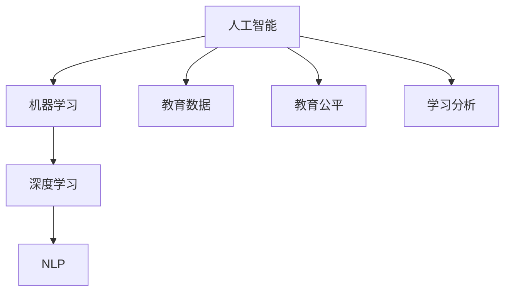

                 

# AI驱动的创新：人类计算在教育中的作用

## 1. 背景介绍

### 1.1 问题由来

在当今信息时代，教育领域正经历一场前所未有的变革。随着人工智能(AI)技术的迅猛发展，AI驱动的教育创新正在迅速改变传统教育模式，为教育带来新的机遇和挑战。AI技术能够处理海量数据、提供个性化教育、增强教学效果、优化教育资源配置等，已逐步成为教育领域的新引擎。

在实际应用中，AI驱动的教育创新不仅限于高等教育，更广泛地渗透到基础教育、职业教育和终身教育等各个层面，帮助教育系统提高教学质量、优化学习体验、提升教育公平性和效率。

### 1.2 问题核心关键点

AI驱动的教育创新核心关键点主要包括：

- **个性化学习**：AI能够根据学生的学习行为和兴趣，提供个性化的学习方案和推荐，提升学习效果。
- **智能辅导**：AI可以作为智能导师，帮助学生解决学习中的疑难问题，提供即时反馈。
- **教育管理**：AI能够优化教育资源的配置，提高教学和管理的效率，支持大规模教育的实施。
- **数据分析**：AI可以对教育数据进行深度分析，揭示学生的学习规律和趋势，优化教学策略。

这些关键点通过AI技术的实现，正在重新定义教育的未来，为学生、教师和教育机构带来全新的可能性。

## 2. 核心概念与联系

### 2.1 核心概念概述

为更好地理解AI在教育中的应用，本节将介绍几个密切相关的核心概念：

- **人工智能(AI)**：基于计算机科学的原理，模拟人类智能行为的技术系统，包括感知、学习、推理、决策等能力。
- **机器学习(ML)**：让机器自动学习和改进的算法和技术，可以处理大量数据并从中提取模式。
- **深度学习(DL)**：机器学习的一个分支，使用多层神经网络模拟人类大脑的工作方式，实现更强的识别和预测能力。
- **自然语言处理(NLP)**：使计算机能够理解、处理和生成人类语言的技术，如语音识别、文本分析、机器翻译等。
- **教育数据**：涉及教育过程的各类数据，如学生的学习数据、教师的教学数据、课程安排数据等，是AI在教育中应用的重要资源。
- **教育公平**：通过技术手段，缩小教育资源差距，实现教育机会的均等分配。
- **学习分析(Learning Analytics)**：通过对教育数据进行深入分析，揭示学习者行为和效果，支持教学策略的优化。

这些核心概念之间的逻辑关系可以通过以下Mermaid流程图来展示：



这个流程图展示了几大核心概念之间的相互联系：

1. 人工智能是机器学习、深度学习和NLP的基础，提供了实现这些技术的基础框架。
2. 教育数据是AI在教育中应用的基础资源，支撑着AI技术的学习和推理。
3. 教育公平和学习的分析是AI在教育中应用的重要目标和方向。
4. 这些技术通过综合应用，提升教育质量和公平性，实现个性化的教学和智能化的管理。

## 3. AI驱动的教育创新

### 3.1 算法原理概述

AI驱动的教育创新主要基于深度学习、机器学习和大数据分析等技术，通过构建学习模型、优化教育管理流程、分析教育数据等方式，提升教育质量和效率。以下是AI在教育中的一些主要应用场景和算法原理：

1. **智能辅导系统**：通过深度学习模型，分析学生的学习数据，预测其学习需求和难点，提供个性化的学习建议和辅导。
2. **学习管理系统(LMS)**：利用数据分析技术，对学生学习行为进行监测和分析，优化课程安排和教学策略。
3. **课程推荐系统**：通过推荐算法，根据学生的学习历史和兴趣，推荐适合的课程和学习资源。
4. **教育公平支持系统**：利用机器学习模型，分析教育资源配置情况，优化资源分配策略，实现教育公平。
5. **智能测评系统**：利用NLP技术，自动批改主观题，提供精准的测评结果和反馈。

### 3.2 算法步骤详解

以智能辅导系统为例，以下是AI驱动教育创新的详细算法步骤：

**Step 1: 数据收集与预处理**
- 收集学生历史学习数据，如成绩、作业、出勤情况等。
- 使用NLP技术，对学生的提问和回答进行文本分析，提取关键信息。
- 对数据进行清洗和预处理，去除噪声和异常值，确保数据质量。

**Step 2: 构建学习模型**
- 根据收集到的数据，选择合适的深度学习模型，如循环神经网络(RNN)、长短期记忆网络(LSTM)、注意力机制等。
- 使用监督学习或无监督学习算法，训练模型，使其能够预测学生的学习需求和难点。
- 模型训练过程中，注意使用适当的正则化技术，避免过拟合。

**Step 3: 个性化学习推荐**
- 根据模型预测结果，生成个性化的学习推荐，如推荐相关课程、学习资源、作业题目等。
- 使用推荐算法，如协同过滤、基于内容的推荐等，优化推荐效果。
- 动态更新学习模型，根据新的学习数据不断优化推荐策略。

**Step 4: 智能辅导与反馈**
- 将推荐的学习资源和题目提供给学生，利用智能辅导系统实时解答学生疑问。
- 分析学生的学习行为和反馈，调整推荐策略，提高学习效果。
- 记录和分析学生的学习数据，生成学习报告，提供给教师参考。

**Step 5: 持续优化与改进**
- 定期评估智能辅导系统的性能，根据评估结果进行优化和改进。
- 收集用户反馈，优化推荐算法和模型训练过程。
- 保持与最新的教育研究成果和教育技术趋势同步，更新系统功能。

### 3.3 算法优缺点

AI驱动的教育创新在提升教育质量方面具有以下优势：

- **个性化**：能够根据每个学生的特点和学习需求，提供定制化的学习方案，提升学习效果。
- **效率高**：通过自动化处理大量数据和任务，显著提升教育管理和辅导的效率。
- **即时反馈**：实时监测和分析学生的学习行为，提供即时反馈，帮助学生及时调整学习策略。
- **规模化**：适用于大规模教育系统，能够覆盖更多学生和教师，实现教育资源的高效利用。

同时，AI在教育应用中也存在一些局限和挑战：

- **数据隐私和安全**：教育数据涉及学生隐私，需要严格的数据保护和隐私管理。
- **技术依赖**：AI系统需要依赖高质量的数据和复杂的算法，对技术和资源的投入较高。
- **公平性问题**：AI模型可能存在偏见，导致教育资源分配不公。
- **教育技术对教师的冲击**：AI系统可能取代部分教师职能，引发对教育系统稳定性的担忧。
- **技术应用复杂性**：AI技术的实际应用需要多方面的专业知识，对教育者和开发者提出了较高要求。

### 3.4 算法应用领域

AI驱动的教育创新已经在多个领域得到了应用，如：

1. **基础教育**：智能辅导系统、个性化推荐、学习分析等技术，帮助学生提高学习效率和成绩。
2. **职业教育和继续教育**：在线学习平台、虚拟实验室、智能评估等，为在职人员提供灵活的学习机会。
3. **特殊教育**：语音识别、情感分析、自动化评估等，帮助有特殊需求的学生进行学习和评估。
4. **教育管理**：教育资源调度、考试管理、课程设计等，提升教育管理效率和公平性。
5. **高等教育**：智能课堂、科研协作、文献推荐等，支持高等教育的研究和教学工作。

## 4. 数学模型和公式 & 详细讲解 & 举例说明

### 4.1 数学模型构建

基于AI的教育创新涉及多种数学模型和技术，以下是几个典型模型的构建过程：

**智能辅导系统模型**：
- 模型输入：学生的学习历史、考试成绩、学习行为数据等。
- 模型输出：个性化的学习建议、推荐的学习资源和题目。
- 模型目标：最大化学生的学习效果和满意度。

**学习管理系统(LMS)模型**：
- 模型输入：学生的学习数据、课程安排、教师反馈等。
- 模型输出：优化的课程安排、个性化学习路径、教学策略调整。
- 模型目标：提高学习效果，优化教育资源配置。

**推荐算法模型**：
- 模型输入：学生的历史行为数据、课程属性、资源标签等。
- 模型输出：推荐的学习资源和课程。
- 模型目标：最大化推荐的准确性和多样性。

### 4.2 公式推导过程

以智能辅导系统为例，以下是对其数学模型的详细推导：

设智能辅导系统模型为 $M_{\theta}$，输入为 $x \in \mathbb{R}^n$，输出为 $y \in \mathbb{R}^m$。目标是最小化损失函数 $\mathcal{L}$。

- 损失函数 $\mathcal{L}$ 可以采用均方误差或交叉熵等形式，具体形式根据具体任务确定。
- 模型参数 $\theta$ 通过反向传播算法更新，具体更新公式如下：

$$
\theta \leftarrow \theta - \eta \nabla_{\theta} \mathcal{L}(M_{\theta}(x), y)
$$

其中 $\eta$ 为学习率，$\nabla_{\theta} \mathcal{L}(M_{\theta}(x), y)$ 为损失函数对模型参数的梯度，可以通过自动微分技术高效计算。

### 4.3 案例分析与讲解

以Python和TensorFlow实现智能辅导系统为例，以下是具体代码实现和分析：

**代码实现**：

```python
import tensorflow as tf
from tensorflow.keras.layers import Dense, Input
from tensorflow.keras.models import Model

# 构建模型
input_layer = Input(shape=(input_dim,))
hidden_layer = Dense(hidden_dim, activation='relu')(input_layer)
output_layer = Dense(output_dim, activation='softmax')(hidden_layer)

model = Model(input_layer, output_layer)
model.compile(optimizer='adam', loss='categorical_crossentropy', metrics=['accuracy'])

# 训练模型
model.fit(X_train, y_train, epochs=num_epochs, batch_size=batch_size, validation_data=(X_val, y_val))
```

**代码分析**：
- `Input`层：定义输入数据的维度和类型。
- `Dense`层：定义隐藏层，使用ReLU激活函数。
- `Output`层：定义输出层，使用softmax激活函数，输出概率分布。
- `Model`层：定义模型结构，编译模型并指定优化器和损失函数。
- `fit`方法：训练模型，指定训练集、验证集、学习率、迭代次数和批大小。

通过上述代码，可以构建一个基本的智能辅导系统模型，用于训练和预测学生的学习需求和难点。

## 5. 项目实践：代码实例和详细解释说明

### 5.1 开发环境搭建

在进行AI驱动的教育创新实践前，我们需要准备好开发环境。以下是使用Python进行TensorFlow开发的典型环境配置流程：

1. 安装Anaconda：从官网下载并安装Anaconda，用于创建独立的Python环境。

2. 创建并激活虚拟环境：
```bash
conda create -n ai-env python=3.8 
conda activate ai-env
```

3. 安装TensorFlow：根据CUDA版本，从官网获取对应的安装命令。例如：
```bash
conda install tensorflow -c tensorflow -c conda-forge
```

4. 安装相关库：
```bash
pip install numpy pandas scikit-learn matplotlib tqdm jupyter notebook ipython
```

完成上述步骤后，即可在`ai-env`环境中开始AI驱动的教育创新实践。

### 5.2 源代码详细实现

这里我们以Python和TensorFlow实现智能辅导系统为例，给出完整的代码实现和详细解释：

**代码实现**：

```python
import tensorflow as tf
from tensorflow.keras.layers import Dense, Input
from tensorflow.keras.models import Model

# 构建模型
input_layer = Input(shape=(input_dim,))
hidden_layer = Dense(hidden_dim, activation='relu')(input_layer)
output_layer = Dense(output_dim, activation='softmax')(hidden_layer)

model = Model(input_layer, output_layer)
model.compile(optimizer='adam', loss='categorical_crossentropy', metrics=['accuracy'])

# 训练模型
model.fit(X_train, y_train, epochs=num_epochs, batch_size=batch_size, validation_data=(X_val, y_val))
```

**代码解释**：
- `Input`层：定义输入数据的维度和类型。
- `Dense`层：定义隐藏层，使用ReLU激活函数。
- `Output`层：定义输出层，使用softmax激活函数，输出概率分布。
- `Model`层：定义模型结构，编译模型并指定优化器和损失函数。
- `fit`方法：训练模型，指定训练集、验证集、学习率、迭代次数和批大小。

### 5.3 代码解读与分析

让我们再详细解读一下关键代码的实现细节：

**智能辅导系统模型**：
- `Input`层：定义输入数据的维度和类型。
- `Dense`层：定义隐藏层，使用ReLU激活函数。
- `Output`层：定义输出层，使用softmax激活函数，输出概率分布。
- `Model`层：定义模型结构，编译模型并指定优化器和损失函数。
- `fit`方法：训练模型，指定训练集、验证集、学习率、迭代次数和批大小。

通过上述代码，可以构建一个基本的智能辅导系统模型，用于训练和预测学生的学习需求和难点。

## 6. 实际应用场景

### 6.1 智能辅导系统

智能辅导系统可以通过AI技术，为学生提供个性化的学习建议和即时辅导，帮助学生克服学习中的难点。例如：

**应用场景**：
- 帮助学生理解复杂的数学题目，提供详细的解题步骤和解释。
- 解答学生的疑问，包括语法错误、词汇用法等，提供即时的语法和单词解释。
- 根据学生的学习进度和兴趣，推荐适合的学习资源和课程。

**实际案例**：
- **某大学在线教育平台**：使用智能辅导系统，帮助学生在线学习数学课程，提高学习效率和成绩。
- **某语言学习App**：利用智能辅导系统，为学生提供即时语言学习支持，帮助学生提高外语水平。

### 6.2 学习管理系统(LMS)

学习管理系统(LMS)可以通过AI技术，优化课程安排和教学策略，提升教育质量和效率。例如：

**应用场景**：
- 分析学生的学习行为和成绩，优化课程安排和教学策略。
- 自动批改学生作业和考试，提供即时反馈。
- 提供个性化的学习路径和推荐。

**实际案例**：
- **某在线教育平台**：使用LMS系统，帮助教师优化课程安排和教学策略，提高教学效果。
- **某企业培训系统**：利用LMS系统，为员工提供个性化的在线培训课程和学习资源。

### 6.3 课程推荐系统

课程推荐系统可以通过AI技术，根据学生的学习历史和兴趣，推荐适合的学习资源和课程。例如：

**应用场景**：
- 根据学生的学习行为和成绩，推荐适合的学习资源和课程。
- 分析学生的兴趣和需求，推荐相关课程和教材。
- 提供个性化的学习路径和推荐。

**实际案例**：
- **某在线教育平台**：使用课程推荐系统，为学生推荐适合的学习资源和课程。
- **某大学图书馆系统**：利用推荐系统，为学生推荐适合的学术资源和课程。

## 7. 工具和资源推荐

### 7.1 学习资源推荐

为了帮助开发者系统掌握AI在教育中的应用，这里推荐一些优质的学习资源：

1. **《人工智能与教育：未来趋势》**：由专家学者编写，全面介绍了AI在教育中的应用、挑战和未来趋势。
2. **Coursera《人工智能与机器学习》课程**：由斯坦福大学教授Andrew Ng主讲，涵盖AI和机器学习的核心概念和应用。
3. **edX《人工智能与教育创新》课程**：由麻省理工学院教授主讲，介绍AI在教育中的应用和创新实践。
4. **Kaggle《教育数据分析竞赛》**：通过实际数据竞赛，学习教育数据分析和建模技术。
5. **Nature《人工智能在教育中的应用》论文集**：精选相关领域的学术论文，涵盖AI在教育中的各种应用和研究进展。

通过这些资源的学习实践，相信你一定能够快速掌握AI在教育中的关键技术和应用场景。

### 7.2 开发工具推荐

高效的开发离不开优秀的工具支持。以下是几款用于AI驱动教育创新开发的常用工具：

1. **Jupyter Notebook**：免费的在线交互式编程环境，支持Python、TensorFlow等主流语言和框架。
2. **TensorFlow**：由Google主导开发的开源深度学习框架，支持分布式计算和GPU加速。
3. **PyTorch**：Facebook开发的开源深度学习框架，支持动态计算图和高效的模型训练。
4. **Keras**：高层次的深度学习API，简单易用，适合快速原型开发和模型部署。
5. **Scikit-learn**：Python的机器学习库，支持多种算法和数据预处理工具。

合理利用这些工具，可以显著提升AI驱动教育创新的开发效率，加快创新迭代的步伐。

### 7.3 相关论文推荐

AI在教育领域的应用研究涉及多个方面，以下是几篇奠基性的相关论文，推荐阅读：

1. **《AI驱动的教育创新：未来的趋势和挑战》**：总结了AI在教育中的各种应用和未来趋势，提供了丰富的案例和数据。
2. **《智能辅导系统在基础教育中的应用》**：介绍了智能辅导系统的实现原理和实际应用效果，提供了详细的算法和数据处理流程。
3. **《基于机器学习的个性化推荐系统》**：研究了机器学习在个性化推荐系统中的应用，提供了多种推荐算法和模型优化方法。
4. **《学习管理系统在高等教育中的应用》**：介绍了学习管理系统的实现原理和实际应用效果，提供了详细的算法和数据处理流程。
5. **《教育数据分析与学习分析》**：总结了教育数据分析和学习分析的研究现状和未来趋势，提供了丰富的案例和数据。

这些论文代表了大语言模型微调技术的发展脉络。通过学习这些前沿成果，可以帮助研究者把握学科前进方向，激发更多的创新灵感。

## 8. 总结：未来发展趋势与挑战

### 8.1 总结

本文对AI驱动的教育创新进行了全面系统的介绍。首先阐述了AI在教育中的重要性和应用场景，明确了智能辅导系统、学习管理系统和课程推荐系统等关键技术对教育的影响。其次，从原理到实践，详细讲解了这些技术的数学模型和算法步骤，提供了完整的代码实现和详细解释。同时，本文还广泛探讨了AI在教育中的实际应用场景，展示了其在提升教育质量和效率方面的巨大潜力。此外，本文精选了教育领域的学习资源、开发工具和相关论文，力求为读者提供全方位的技术指引。

通过本文的系统梳理，可以看到，AI驱动的教育创新正在重塑传统教育模式，为学生、教师和教育机构带来全新的可能性。AI技术的应用，使得个性化学习、智能辅导和高效管理成为可能，为教育的普及和公平提供了新的技术路径。未来，伴随AI技术的持续进步，教育领域将迎来更多的变革和创新，AI驱动的教育创新必将在全球范围内产生深远影响。

### 8.2 未来发展趋势

展望未来，AI驱动的教育创新将呈现以下几个发展趋势：

1. **个性化学习**：AI技术将进一步提升个性化学习的水平，通过深度学习和大数据分析，实现更为精准的学习路径和推荐。
2. **智能辅导系统**：智能辅导系统将变得更加智能和灵活，能够根据学生的学习情况和反馈，提供更加个性化的辅导和支持。
3. **学习管理系统**：LMS系统将变得更加智能和高效，能够实时监测和分析学生的学习行为，提供及时的反馈和优化建议。
4. **教育数据分析**：教育数据分析将得到更广泛的应用，通过深度学习和机器学习技术，揭示学生的学习规律和趋势，支持教学策略的优化。
5. **多模态学习**：AI将支持多模态学习，结合视觉、听觉等多种信息源，提升学生的学习体验和效果。
6. **教育资源共享**：通过AI技术，实现教育资源的跨地域、跨机构共享，提高教育资源的利用效率。

这些趋势凸显了AI在教育中的巨大潜力，AI驱动的教育创新将为学生提供更加个性化、高效和灵活的学习体验，为教师提供更科学、智能的教学支持，为教育机构提供更优化、高效的管理方案。

### 8.3 面临的挑战

尽管AI驱动的教育创新已经取得了瞩目成就，但在迈向更加智能化、普适化应用的过程中，它仍面临着诸多挑战：

1. **数据隐私和安全**：教育数据涉及学生隐私，需要严格的数据保护和隐私管理。
2. **技术依赖**：AI系统需要依赖高质量的数据和复杂的算法，对技术和资源的投入较高。
3. **公平性问题**：AI模型可能存在偏见，导致教育资源分配不公。
4. **教育技术对教师的冲击**：AI系统可能取代部分教师职能，引发对教育系统稳定性的担忧。
5. **技术应用复杂性**：AI技术的实际应用需要多方面的专业知识，对教育者和开发者提出了较高要求。

### 8.4 研究展望

面对AI驱动的教育创新所面临的挑战，未来的研究需要在以下几个方面寻求新的突破：

1. **数据隐私保护**：开发隐私保护算法和技术，确保教育数据的安全和隐私。
2. **模型公平性**：研究和开发公平的AI模型，减少模型偏见，实现教育资源的公平分配。
3. **教育技术的普及**：降低教育技术的门槛，推广AI在教育中的应用，提升教师和学生的技术水平。
4. **教育技术的迭代优化**：不断优化教育技术，提高其稳定性和实用性，确保技术的长期应用。
5. **跨学科研究**：将AI技术与其他学科知识结合，提升教育的综合性和创新性。

这些研究方向的探索，必将引领AI驱动的教育创新技术迈向更高的台阶，为教育系统带来更深刻的变革和创新，推动教育公平和质量的提升。

## 9. 附录：常见问题与解答

**Q1：AI驱动的教育创新是否适用于所有教育阶段？**

A: AI驱动的教育创新不仅适用于高等教育，还适用于基础教育、职业教育和终身教育等各个阶段。例如，在基础教育中，可以使用AI技术为学生提供个性化的学习方案和辅导，帮助学生提高学习效率和成绩。在职业教育中，可以利用在线学习平台和智能辅导系统，为在职人员提供灵活的学习机会。在终身教育中，AI技术可以帮助成年人继续学习新知识和技能，提升职业竞争力。

**Q2：AI驱动的教育创新是否会影响教师的职能？**

A: AI驱动的教育创新确实会影响部分教师的职能，如自动批改作业、智能辅导学生等。但同时，AI技术也可以帮助教师更好地理解学生的学习需求，提供个性化的教学方案，提升教学效果。因此，AI技术的应用是教师职能的补充和延伸，而不是取代。

**Q3：AI驱动的教育创新是否会引发教育公平问题？**

A: AI驱动的教育创新有可能引发教育公平问题，如数据偏见、技术门槛等。为了确保教育的公平性，需要在AI模型的开发和应用过程中，注重数据隐私保护、公平性和透明性。例如，可以使用公平性评估工具，检测模型的偏见，并进行优化。同时，需要确保AI技术的应用覆盖所有学生和地区，减少教育资源的不平等分配。

**Q4：AI驱动的教育创新是否需要高成本的硬件资源？**

A: AI驱动的教育创新确实需要一定的硬件资源支持，如高性能计算设备和存储设备。但通过优化算法和数据处理流程，可以在保证性能的同时，降低硬件资源的需求。例如，可以使用分布式计算、模型压缩和优化等技术，减少计算量和内存消耗，实现高效的数据处理和模型训练。

**Q5：AI驱动的教育创新是否需要专业知识？**

A: AI驱动的教育创新需要一定的专业知识和技术基础，如机器学习、深度学习、数据处理等。但随着AI技术的普及和开放，越来越多的教育者和开发者可以通过在线课程和资源，快速掌握AI技术的应用。同时，也需要教育机构和组织提供相关的培训和支持，帮助教育者和开发者更好地应用AI技术。

通过本文的系统梳理，可以看到，AI驱动的教育创新正在重新定义教育的未来，为学生、教师和教育机构带来全新的可能性。AI技术的应用，使得个性化学习、智能辅导和高效管理成为可能，为教育的普及和公平提供了新的技术路径。未来，伴随AI技术的持续进步，教育领域将迎来更多的变革和创新，AI驱动的教育创新必将在全球范围内产生深远影响。

