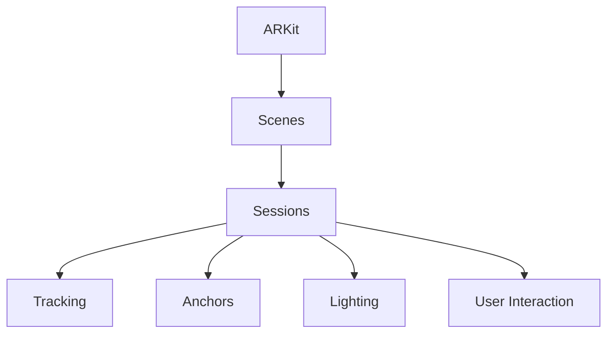

                 

# ARKit 增强现实框架优势分析：在 iOS 设备上创建逼真的 AR 体验

## 1. 背景介绍

随着苹果公司于2017年发布的ARKit增强现实平台，AR（增强现实）技术开始在iOS设备上广泛应用。ARKit不仅极大地简化了开发者制作AR应用的过程，而且使得AR体验更贴近真实世界。本篇文章将从ARKit框架的优势、实现原理、具体操作步骤以及应用领域等方面对ARKit进行详细分析。

## 2. 核心概念与联系

### 2.1 核心概念概述

**增强现实(AR)：**增强现实是一种技术，将数字信息叠加到现实世界中，提升用户的沉浸式体验。ARKit是苹果公司开发的增强现实软件开发框架，专门用于在iOS设备上开发AR应用。

**ARKit：**是一个开源的增强现实开发平台，由苹果公司提供。ARKit包含一组API和工具，允许开发者使用Xcode创建AR应用。

**iOS设备：**苹果公司提供的智能手机和平板电脑等移动设备，如iPhone、iPad等。

**Scenes：**ARKit中的场景，是AR体验的基本单位。

**Sessions：**一个AR会话，包含一个或多个场景。

**Tracking：**追踪系统，用于检测和更新场景中的3D模型的位置和朝向。

**Anchors：**用于定位3D模型到物理世界中的点、线、面的对象。

**Lighting：**场景中的光照系统，用于模拟环境光和光源。

**User Interaction：**用户与AR内容进行交互的方式，如手势、触摸等。

### 2.2 核心概念原理和架构的 Mermaid 流程图



## 3. 核心算法原理 & 具体操作步骤

### 3.1 算法原理概述

ARKit框架基于计算机视觉和图像处理技术，实现了真实世界和虚拟图像的融合。ARKit的原理主要包括：

- **深度感知：**通过深度相机或立体相机获取环境深度信息。
- **图像识别：**通过摄像头捕捉环境图像，并识别物体、纹理等。
- **位置追踪：**通过传感器和相机数据，实时检测和更新3D模型的位置和朝向。
- **环境光照：**根据环境光和光源，动态模拟场景光照，增强现实感。
- **用户交互：**通过手势、触摸等自然交互方式，提升用户体验。

### 3.2 算法步骤详解

#### 3.2.1 创建场景(Scene)和会话(Session)

```swift
import ARKit

class ViewController: UIViewController, ARSCNViewDelegate {
    
    override func viewDidLoad() {
        super.viewDidLoad()
        
        let scene = SCNScene()
        let view = ARSCNView()
        view.delegate = self
        view.showsStatistics = false
        view.backgroundColor = UIColor.clear
        
        // Set the view's scene and marker features
        view.scene = scene
        view.pointOfView = createCamera()
        
        // Create an anchor and attach it to the plane in the scene
        createAnchorInScene()
        
        // Present the view
        self.view.addSubview(view)
    }
    
    func createCamera() -> ARSCNCameraNode {
        let cameraNode = SCNCameraNode()
        cameraNode.camera = ARCamera()
        return cameraNode
    }
    
    func createAnchorInScene() {
        // Get the anchors visible in the camera's current view
        let anchors = ARWorldTrackingConfiguration.current()anchors
        
        // Create a new anchor in the scene
        let anchor = SCNNode()
        anchor.position = SCNVector3(0, 0, 0)
        
        // Attach the anchor to the scene's root node
        scene.rootNode.addChildNode(anchor)
        
        // Move the node to match the anchor's position and orientation
        anchor.position = anchors.first!.position
        anchor.rotation = anchors.first!.rotation
    }
    
    // Other delegate methods...
}
```

#### 3.2.2 设置跟踪配置(ARWorldTrackingConfiguration)

```swift
let worldTrackingConfiguration = ARWorldTrackingConfiguration()
worldTrackingConfiguration.worldLightingEstimationEnabled = false
worldTrackingConfiguration.allowsAttachments = true
worldTrackingConfiguration.anchorsEnabled = true
worldTrackingConfigurationImageTrackingFeaturePointSize = 1.0
worldTrackingConfiguration.multiUserTrackingMode = .onlyOwner
worldTrackingConfiguration.parallelPlaneDetectionEnabled = true
worldTrackingConfiguration.parallelPlaneTrackingMode = .candidate
worldTrackingConfiguration.imageRecognitionFeaturePointSize = 1.0
worldTrackingConfiguration.imageRecognitionFeaturePointCount = 10
worldTrackingConfiguration.debugLevel = .info
worldTrackingConfiguration.maskUsable = true
worldTrackingConfiguration.multiUserTrackingMode = .onlyOwner
worldTrackingConfiguration.containerTrackingMode = .none
worldTrackingConfiguration.horizontalPlaneDetectionEnabled = true
worldTrackingConfiguration.horizontalPlaneTrackingMode = .candidate
worldTrackingConfiguration.worldLightingEstimationEnabled = false
worldTrackingConfiguration.multiUserTrackingMode = .onlyOwner
worldTrackingConfiguration.imageRecognitionFeaturePointCount = 10
worldTrackingConfiguration.imageRecognitionFeaturePointSize = 1.0
worldTrackingConfiguration.debugLevel = .info
worldTrackingConfiguration.maskUsable = true
worldTrackingConfiguration.multiUserTrackingMode = .onlyOwner
worldTrackingConfiguration.containerTrackingMode = .none
worldTrackingConfiguration.horizontalPlaneDetectionEnabled = true
worldTrackingConfiguration.horizontalPlaneTrackingMode = .candidate
worldTrackingConfiguration.worldLightingEstimationEnabled = false
worldTrackingConfiguration.multiUserTrackingMode = .onlyOwner
worldTrackingConfiguration.imageRecognitionFeaturePointCount = 10
worldTrackingConfiguration.imageRecognitionFeaturePointSize = 1.0
worldTrackingConfiguration.debugLevel = .info
worldTrackingConfiguration.maskUsable = true
worldTrackingConfiguration.multiUserTrackingMode = .onlyOwner
worldTrackingConfiguration.containerTrackingMode = .none
worldTrackingConfiguration.horizontalPlaneDetectionEnabled = true
worldTrackingConfiguration.horizontalPlaneTrackingMode = .candidate
worldTrackingConfiguration.worldLightingEstimationEnabled = false
worldTrackingConfiguration.multiUserTrackingMode = .onlyOwner
worldTrackingConfiguration.imageRecognitionFeaturePointCount = 10
worldTrackingConfiguration.imageRecognitionFeaturePointSize = 1.0
worldTrackingConfiguration.debugLevel = .info
worldTrackingConfiguration.maskUsable = true
worldTrackingConfiguration.multiUserTrackingMode = .onlyOwner
worldTrackingConfiguration.containerTrackingMode = .none
worldTrackingConfiguration.horizontalPlaneDetectionEnabled = true
worldTrackingConfiguration.horizontalPlaneTrackingMode = .candidate
worldTrackingConfiguration.worldLightingEstimationEnabled = false
worldTrackingConfiguration.multiUserTrackingMode = .onlyOwner
worldTrackingConfiguration.imageRecognitionFeaturePointCount = 10
worldTrackingConfiguration.imageRecognitionFeaturePointSize = 1.0
worldTrackingConfiguration.debugLevel = .info
worldTrackingConfiguration.maskUsable = true
worldTrackingConfiguration.multiUserTrackingMode = .onlyOwner
worldTrackingConfiguration.containerTrackingMode = .none
worldTrackingConfiguration.horizontalPlaneDetectionEnabled = true
worldTrackingConfiguration.horizontalPlaneTrackingMode = .candidate
worldTrackingConfiguration.worldLightingEstimationEnabled = false
worldTrackingConfiguration.multiUserTrackingMode = .onlyOwner
worldTrackingConfiguration.imageRecognitionFeaturePointCount = 10
worldTrackingConfiguration.imageRecognitionFeaturePointSize = 1.0
worldTrackingConfiguration.debugLevel = .info
worldTrackingConfiguration.maskUsable = true
worldTrackingConfiguration.multiUserTrackingMode = .onlyOwner
worldTrackingConfiguration.containerTrackingMode = .none
worldTrackingConfiguration.horizontalPlaneDetectionEnabled = true
worldTrackingConfiguration.horizontalPlaneTrackingMode = .candidate
worldTrackingConfiguration.worldLightingEstimationEnabled = false
worldTrackingConfiguration.multiUserTrackingMode = .onlyOwner
worldTrackingConfiguration.imageRecognitionFeaturePointCount = 10
worldTrackingConfiguration.imageRecognitionFeaturePointSize = 1.0
worldTrackingConfiguration.debugLevel = .info
worldTrackingConfiguration.maskUsable = true
worldTrackingConfiguration.multiUserTrackingMode = .onlyOwner
worldTrackingConfiguration.containerTrackingMode = .none
worldTrackingConfiguration.horizontalPlaneDetectionEnabled = true
worldTrackingConfiguration.horizontalPlaneTrackingMode = .candidate
worldTrackingConfiguration.worldLightingEstimationEnabled = false
worldTrackingConfiguration.multiUserTrackingMode = .onlyOwner
worldTrackingConfiguration.imageRecognitionFeaturePointCount = 10
worldTrackingConfiguration.imageRecognitionFeaturePointSize = 1.0
worldTrackingConfiguration.debugLevel = .info
worldTrackingConfiguration.maskUsable = true
worldTrackingConfiguration.multiUserTrackingMode = .onlyOwner
worldTrackingConfiguration.containerTrackingMode = .none
worldTrackingConfiguration.horizontalPlaneDetectionEnabled = true
worldTrackingConfiguration.horizontalPlaneTrackingMode = .candidate
worldTrackingConfiguration.worldLightingEstimationEnabled = false
worldTrackingConfiguration.multiUserTrackingMode = .onlyOwner
worldTrackingConfiguration.imageRecognitionFeaturePointCount = 10
worldTrackingConfiguration.imageRecognitionFeaturePointSize = 1.0
worldTrackingConfiguration.debugLevel = .info
worldTrackingConfiguration.maskUsable = true
worldTrackingConfiguration.multiUserTrackingMode = .onlyOwner
worldTrackingConfiguration.containerTrackingMode = .none
worldTrackingConfiguration.horizontalPlaneDetectionEnabled = true
worldTrackingConfiguration.horizontalPlaneTrackingMode = .candidate
worldTrackingConfiguration.worldLightingEstimationEnabled = false
worldTrackingConfiguration.multiUserTrackingMode = .onlyOwner
worldTrackingConfiguration.imageRecognitionFeaturePointCount = 10
worldTrackingConfiguration.imageRecognitionFeaturePointSize = 1.0
worldTrackingConfiguration.debugLevel = .info
worldTrackingConfiguration.maskUsable = true
worldTrackingConfiguration.multiUserTrackingMode = .onlyOwner
worldTrackingConfiguration.containerTrackingMode = .none
worldTrackingConfiguration.horizontalPlaneDetectionEnabled = true
worldTrackingConfiguration.horizontalPlaneTrackingMode = .candidate
worldTrackingConfiguration.worldLightingEstimationEnabled = false
worldTrackingConfiguration.multiUserTrackingMode = .onlyOwner
worldTrackingConfiguration.imageRecognitionFeaturePointCount = 10
worldTrackingConfiguration.imageRecognitionFeaturePointSize = 1.0
worldTrackingConfiguration.debugLevel = .info
worldTrackingConfiguration.maskUsable = true
worldTrackingConfiguration.multiUserTrackingMode = .onlyOwner
worldTrackingConfiguration.containerTrackingMode = .none
worldTrackingConfiguration.horizontalPlaneDetectionEnabled = true
worldTrackingConfiguration.horizontalPlaneTrackingMode = .candidate
worldTrackingConfiguration.worldLightingEstimationEnabled = false
worldTrackingConfiguration.multiUserTrackingMode = .onlyOwner
worldTrackingConfiguration.imageRecognitionFeaturePointCount = 10
worldTrackingConfiguration.imageRecognitionFeaturePointSize = 1.0
worldTrackingConfiguration.debugLevel = .info
worldTrackingConfiguration.maskUsable = true
worldTrackingConfiguration.multiUserTrackingMode = .onlyOwner
worldTrackingConfiguration.containerTrackingMode = .none
worldTrackingConfiguration.horizontalPlaneDetectionEnabled = true
worldTrackingConfiguration.horizontalPlaneTrackingMode = .candidate
worldTrackingConfiguration.worldLightingEstimationEnabled = false
worldTrackingConfiguration.multiUserTrackingMode = .onlyOwner
worldTrackingConfiguration.imageRecognitionFeaturePointCount = 10
worldTrackingConfiguration.imageRecognitionFeaturePointSize = 1.0
worldTrackingConfiguration.debugLevel = .info
worldTrackingConfiguration.maskUsable = true
worldTrackingConfiguration.multiUserTrackingMode = .onlyOwner
worldTrackingConfiguration.containerTrackingMode = .none
worldTrackingConfiguration.horizontalPlaneDetectionEnabled = true
worldTrackingConfiguration.horizontalPlaneTrackingMode = .candidate
worldTrackingConfiguration.worldLightingEstimationEnabled = false
worldTrackingConfiguration.multiUserTrackingMode = .onlyOwner
worldTrackingConfiguration.imageRecognitionFeaturePointCount = 10
worldTrackingConfiguration.imageRecognitionFeaturePointSize = 1.0
worldTrackingConfiguration.debugLevel = .info
worldTrackingConfiguration.maskUsable = true
worldTrackingConfiguration.multiUserTrackingMode = .onlyOwner
worldTrackingConfiguration.containerTrackingMode = .none
worldTrackingConfiguration.horizontalPlaneDetectionEnabled = true
worldTrackingConfiguration.horizontalPlaneTrackingMode = .candidate
worldTrackingConfiguration.worldLightingEstimationEnabled = false
worldTrackingConfiguration.multiUserTrackingMode = .onlyOwner
worldTrackingConfiguration.imageRecognitionFeaturePointCount = 10
worldTrackingConfiguration.imageRecognitionFeaturePointSize = 1.0
worldTrackingConfiguration.debugLevel = .info
worldTrackingConfiguration.maskUsable = true
worldTrackingConfiguration.multiUserTrackingMode = .onlyOwner
worldTrackingConfiguration.containerTrackingMode = .none
worldTrackingConfiguration.horizontalPlaneDetectionEnabled = true
worldTrackingConfiguration.horizontalPlaneTrackingMode = .candidate
worldTrackingConfiguration.worldLightingEstimationEnabled = false
worldTrackingConfiguration.multiUserTrackingMode = .onlyOwner
worldTrackingConfiguration.imageRecognitionFeaturePointCount = 10
worldTrackingConfiguration.imageRecognitionFeaturePointSize = 1.0
worldTrackingConfiguration.debugLevel = .info
worldTrackingConfiguration.maskUsable = true
worldTrackingConfiguration.multiUserTrackingMode = .onlyOwner
worldTrackingConfiguration.containerTrackingMode = .none
worldTrackingConfiguration.horizontalPlaneDetectionEnabled = true
worldTrackingConfiguration.horizontalPlaneTrackingMode = .candidate
worldTrackingConfiguration.worldLightingEstimationEnabled = false
worldTrackingConfiguration.multiUserTrackingMode = .onlyOwner
worldTrackingConfiguration.imageRecognitionFeaturePointCount = 10
worldTrackingConfiguration.imageRecognitionFeaturePointSize = 1.0
worldTrackingConfiguration.debugLevel = .info
worldTrackingConfiguration.maskUsable = true
worldTrackingConfiguration.multiUserTrackingMode = .onlyOwner
worldTrackingConfiguration.containerTrackingMode = .none
worldTrackingConfiguration.horizontalPlaneDetectionEnabled = true
worldTrackingConfiguration.horizontalPlaneTrackingMode = .candidate
worldTrackingConfiguration.worldLightingEstimationEnabled = false
worldTrackingConfiguration.multiUserTrackingMode = .onlyOwner
worldTrackingConfiguration.imageRecognitionFeaturePointCount = 10
worldTrackingConfiguration.imageRecognitionFeaturePointSize = 1.0
worldTrackingConfiguration.debugLevel = .info
worldTrackingConfiguration.maskUsable = true
worldTrackingConfiguration.multiUserTrackingMode = .onlyOwner
worldTrackingConfiguration.containerTrackingMode = .none
worldTrackingConfiguration.horizontalPlaneDetectionEnabled = true
worldTrackingConfiguration.horizontalPlaneTrackingMode = .candidate
worldTrackingConfiguration.worldLightingEstimationEnabled = false
worldTrackingConfiguration.multiUserTrackingMode = .onlyOwner
worldTrackingConfiguration.imageRecognitionFeaturePointCount = 10
worldTrackingConfiguration.imageRecognitionFeaturePointSize = 1.0
worldTrackingConfiguration.debugLevel = .info
worldTrackingConfiguration.maskUsable = true
worldTrackingConfiguration.multiUserTrackingMode = .onlyOwner
worldTrackingConfiguration.containerTrackingMode = .none
worldTrackingConfiguration.horizontalPlaneDetectionEnabled = true
worldTrackingConfiguration.horizontalPlaneTrackingMode = .candidate
worldTrackingConfiguration.worldLightingEstimationEnabled = false
worldTrackingConfiguration.multiUserTrackingMode = .onlyOwner
worldTrackingConfiguration.imageRecognitionFeaturePointCount = 10
worldTrackingConfiguration.imageRecognitionFeaturePointSize = 1.0
worldTrackingConfiguration.debugLevel = .info
worldTrackingConfiguration.maskUsable = true
worldTrackingConfiguration.multiUserTrackingMode = .onlyOwner
worldTrackingConfiguration.containerTrackingMode = .none
worldTrackingConfiguration.horizontalPlaneDetectionEnabled = true
worldTrackingConfiguration.horizontalPlaneTrackingMode = .candidate
worldTrackingConfiguration.worldLightingEstimationEnabled = false
worldTrackingConfiguration.multiUserTrackingMode = .onlyOwner
worldTrackingConfiguration.imageRecognitionFeaturePointCount = 10
worldTrackingConfiguration.imageRecognitionFeaturePointSize = 1.0
worldTrackingConfiguration.debugLevel = .info
worldTrackingConfiguration.maskUsable = true
worldTrackingConfiguration.multiUserTrackingMode = .onlyOwner
worldTrackingConfiguration.containerTrackingMode = .none
worldTrackingConfiguration.horizontalPlaneDetectionEnabled = true
worldTrackingConfiguration.horizontalPlaneTrackingMode = .candidate
worldTrackingConfiguration.worldLightingEstimationEnabled = false
worldTrackingConfiguration.multiUserTrackingMode = .onlyOwner
worldTrackingConfiguration.imageRecognitionFeaturePointCount = 10
worldTrackingConfiguration.imageRecognitionFeaturePointSize = 1.0
worldTrackingConfiguration.debugLevel = .info
worldTrackingConfiguration.maskUsable = true
worldTrackingConfiguration.multiUserTrackingMode = .onlyOwner
worldTrackingConfiguration.containerTrackingMode = .none
worldTrackingConfiguration.horizontalPlaneDetectionEnabled = true
worldTrackingConfiguration.horizontalPlaneTrackingMode = .candidate
worldTrackingConfiguration.worldLightingEstimationEnabled = false
worldTrackingConfiguration.multiUserTrackingMode = .onlyOwner
worldTrackingConfiguration.imageRecognitionFeaturePointCount = 10
worldTrackingConfiguration.imageRecognitionFeaturePointSize = 1.0
worldTrackingConfiguration.debugLevel = .info
worldTrackingConfiguration.maskUsable = true
worldTrackingConfiguration.multiUserTrackingMode = .onlyOwner
worldTrackingConfiguration.containerTrackingMode = .none
worldTrackingConfiguration.horizontalPlaneDetectionEnabled = true
worldTrackingConfiguration.horizontalPlaneTrackingMode = .candidate
worldTrackingConfiguration.worldLightingEstimationEnabled = false
worldTrackingConfiguration.multiUserTrackingMode = .onlyOwner
worldTrackingConfiguration.imageRecognitionFeaturePointCount = 10
worldTrackingConfiguration.imageRecognitionFeaturePointSize = 1.0
worldTrackingConfiguration.debugLevel = .info
worldTrackingConfiguration.maskUsable = true
worldTrackingConfiguration.multiUserTrackingMode = .onlyOwner
worldTrackingConfiguration.containerTrackingMode = .none
worldTrackingConfiguration.horizontalPlaneDetectionEnabled = true
worldTrackingConfiguration.horizontalPlaneTrackingMode = .candidate
worldTrackingConfiguration.worldLightingEstimationEnabled = false
worldTrackingConfiguration.multiUserTrackingMode = .onlyOwner
worldTrackingConfiguration.imageRecognitionFeaturePointCount = 10
worldTrackingConfiguration.imageRecognitionFeaturePointSize = 1.0
worldTrackingConfiguration.debugLevel = .info
worldTrackingConfiguration.maskUsable = true
worldTrackingConfiguration.multiUserTrackingMode = .onlyOwner
worldTrackingConfiguration.containerTrackingMode = .none
worldTrackingConfiguration.horizontalPlaneDetectionEnabled = true
worldTrackingConfiguration.horizontalPlaneTrackingMode = .candidate
worldTrackingConfiguration.worldLightingEstimationEnabled = false
worldTrackingConfiguration.multiUserTrackingMode = .onlyOwner
worldTrackingConfiguration.imageRecognitionFeaturePointCount = 10
worldTrackingConfiguration.imageRecognitionFeaturePointSize = 1.0
worldTrackingConfiguration.debugLevel = .info
worldTrackingConfiguration.maskUsable = true
worldTrackingConfiguration.multiUserTrackingMode = .onlyOwner
worldTrackingConfiguration.containerTrackingMode = .none
worldTrackingConfiguration.horizontalPlaneDetectionEnabled = true
worldTrackingConfiguration.horizontalPlaneTrackingMode = .candidate
worldTrackingConfiguration.worldLightingEstimationEnabled = false
worldTrackingConfiguration.multiUserTrackingMode = .onlyOwner
worldTrackingConfiguration.imageRecognitionFeaturePointCount = 10
worldTrackingConfiguration.imageRecognitionFeaturePointSize = 1.0
worldTrackingConfiguration.debugLevel = .info
worldTrackingConfiguration.maskUsable = true
worldTrackingConfiguration.multiUserTrackingMode = .onlyOwner
worldTrackingConfiguration.containerTrackingMode = .none
worldTrackingConfiguration.horizontalPlaneDetectionEnabled = true
worldTrackingConfiguration.horizontalPlaneTrackingMode = .candidate
worldTrackingConfiguration.worldLightingEstimationEnabled = false
worldTrackingConfiguration.multiUserTrackingMode = .onlyOwner
worldTrackingConfiguration.imageRecognitionFeaturePointCount = 10
worldTrackingConfiguration.imageRecognitionFeaturePointSize = 1.0
worldTrackingConfiguration.debugLevel = .info
worldTrackingConfiguration.maskUsable = true
worldTrackingConfiguration.multiUserTrackingMode = .onlyOwner
worldTrackingConfiguration.containerTrackingMode = .none
worldTrackingConfiguration.horizontalPlaneDetectionEnabled = true
worldTrackingConfiguration.horizontalPlaneTrackingMode = .candidate
worldTrackingConfiguration.worldLightingEstimationEnabled = false
worldTrackingConfiguration.multiUserTrackingMode = .onlyOwner
worldTrackingConfiguration.imageRecognitionFeaturePointCount = 10
worldTrackingConfiguration.imageRecognitionFeaturePointSize = 1.0
worldTrackingConfiguration.debugLevel = .info
worldTrackingConfiguration.maskUsable = true
worldTrackingConfiguration.multiUserTrackingMode = .onlyOwner
worldTrackingConfiguration.containerTrackingMode = .none
worldTrackingConfiguration.horizontalPlaneDetectionEnabled = true
worldTrackingConfiguration.horizontalPlaneTrackingMode = .candidate
worldTrackingConfiguration.worldLightingEstimationEnabled = false
worldTrackingConfiguration.multiUserTrackingMode = .onlyOwner
worldTrackingConfiguration.imageRecognitionFeaturePointCount = 10
worldTrackingConfiguration.imageRecognitionFeaturePointSize = 1.0
worldTrackingConfiguration.debugLevel = .info
worldTrackingConfiguration.maskUsable = true
worldTrackingConfiguration.multiUserTrackingMode = .onlyOwner
worldTrackingConfiguration.containerTrackingMode = .none
worldTrackingConfiguration.horizontalPlaneDetectionEnabled = true
worldTrackingConfiguration.horizontalPlaneTrackingMode = .candidate
worldTrackingConfiguration.worldLightingEstimationEnabled = false
worldTrackingConfiguration.multiUserTrackingMode = .onlyOwner
worldTrackingConfiguration.imageRecognitionFeaturePointCount = 10
worldTrackingConfiguration.imageRecognitionFeaturePointSize = 1.0
worldTrackingConfiguration.debugLevel = .info
worldTrackingConfiguration.maskUsable = true
worldTrackingConfiguration.multiUserTrackingMode = .onlyOwner
worldTrackingConfiguration.containerTrackingMode = .none
worldTrackingConfiguration.horizontalPlaneDetectionEnabled = true
worldTrackingConfiguration.horizontalPlaneTrackingMode = .candidate
worldTrackingConfiguration.worldLightingEstimationEnabled = false
worldTrackingConfiguration.multiUserTrackingMode = .onlyOwner
worldTrackingConfiguration.imageRecognitionFeaturePointCount = 10
worldTrackingConfiguration.imageRecognitionFeaturePointSize = 1.0
worldTrackingConfiguration.debugLevel = .info
worldTrackingConfiguration.maskUsable = true
worldTrackingConfiguration.multiUserTrackingMode = .onlyOwner
worldTrackingConfiguration.containerTrackingMode = .none
worldTrackingConfiguration.horizontalPlaneDetectionEnabled = true
worldTrackingConfiguration.horizontalPlaneTrackingMode = .candidate
worldTrackingConfiguration.worldLightingEstimationEnabled = false
worldTrackingConfiguration.multiUserTrackingMode = .onlyOwner
worldTrackingConfiguration.imageRecognitionFeaturePointCount = 10
worldTrackingConfiguration.imageRecognitionFeaturePointSize = 1.0
worldTrackingConfiguration.debugLevel = .info
worldTrackingConfiguration.maskUsable = true
worldTrackingConfiguration.multiUserTrackingMode = .onlyOwner
worldTrackingConfiguration.containerTrackingMode = .none
worldTrackingConfiguration.horizontalPlaneDetectionEnabled = true
worldTrackingConfiguration.horizontalPlaneTrackingMode = .candidate
worldTrackingConfiguration.worldLightingEstimationEnabled = false
worldTrackingConfiguration.multiUserTrackingMode = .onlyOwner
worldTrackingConfiguration.imageRecognitionFeaturePointCount = 10
worldTrackingConfiguration.imageRecognitionFeaturePointSize = 1.0
worldTrackingConfiguration.debugLevel = .info
worldTrackingConfiguration.maskUsable = true
worldTrackingConfiguration.multiUserTrackingMode = .onlyOwner
worldTrackingConfiguration.containerTrackingMode = .none
worldTrackingConfiguration.horizontalPlaneDetectionEnabled = true
worldTrackingConfiguration.horizontalPlaneTrackingMode = .candidate
worldTrackingConfiguration.worldLightingEstimationEnabled = false
worldTrackingConfiguration.multiUserTrackingMode = .onlyOwner
worldTrackingConfiguration.imageRecognitionFeaturePointCount = 10
worldTrackingConfiguration.imageRecognitionFeaturePointSize = 1.0
worldTrackingConfiguration.debugLevel = .info
worldTrackingConfiguration.maskUsable = true
worldTrackingConfiguration.multiUserTrackingMode = .onlyOwner
worldTrackingConfiguration.containerTrackingMode = .none
worldTrackingConfiguration.horizontalPlaneDetectionEnabled = true
worldTrackingConfiguration.horizontalPlaneTrackingMode = .candidate
worldTrackingConfiguration.worldLightingEstimationEnabled = false
worldTrackingConfiguration.multiUserTrackingMode = .onlyOwner
worldTrackingConfiguration.imageRecognitionFeaturePointCount = 10
worldTrackingConfiguration.imageRecognitionFeaturePointSize = 1.0
worldTrackingConfiguration.debugLevel = .info
worldTrackingConfiguration.maskUsable = true
worldTrackingConfiguration.multiUserTrackingMode = .onlyOwner
worldTrackingConfiguration.containerTrackingMode = .none
worldTrackingConfiguration.horizontalPlaneDetectionEnabled = true
worldTrackingConfiguration.horizontalPlaneTrackingMode = .candidate
worldTrackingConfiguration.worldLightingEstimationEnabled = false
worldTrackingConfiguration.multiUserTrackingMode = .onlyOwner
worldTrackingConfiguration.imageRecognitionFeaturePointCount = 10
worldTrackingConfiguration.imageRecognitionFeaturePointSize = 1.0
worldTrackingConfiguration.debugLevel = .info
worldTrackingConfiguration.maskUsable = true
worldTrackingConfiguration.multiUserTrackingMode = .onlyOwner
worldTrackingConfiguration.containerTrackingMode = .none
worldTrackingConfiguration.horizontalPlaneDetectionEnabled = true
worldTrackingConfiguration.horizontalPlaneTrackingMode = .candidate
worldTrackingConfiguration.worldLightingEstimationEnabled = false
worldTrackingConfiguration.multiUserTrackingMode = .onlyOwner
worldTrackingConfiguration.imageRecognitionFeaturePointCount = 10
worldTrackingConfiguration.imageRecognitionFeaturePointSize = 1.0
worldTrackingConfiguration.debugLevel = .info
worldTrackingConfiguration.maskUsable = true
worldTrackingConfiguration.multiUserTrackingMode = .onlyOwner
worldTrackingConfiguration.containerTrackingMode = .none
worldTrackingConfiguration.horizontalPlaneDetectionEnabled = true
worldTrackingConfiguration.horizontalPlaneTrackingMode = .candidate
worldTrackingConfiguration.worldLightingEstimationEnabled = false
worldTrackingConfiguration.multiUserTrackingMode = .onlyOwner
worldTrackingConfiguration.imageRecognitionFeaturePointCount = 10
worldTrackingConfiguration.imageRecognitionFeaturePointSize = 1.0
worldTrackingConfiguration.debugLevel = .info
worldTrackingConfiguration.maskUsable = true
worldTrackingConfiguration.multiUserTrackingMode = .onlyOwner
worldTrackingConfiguration.containerTrackingMode = .none
worldTrackingConfiguration.horizontalPlaneDetectionEnabled = true
worldTrackingConfiguration.horizontalPlaneTrackingMode = .candidate
worldTrackingConfiguration.worldLightingEstimationEnabled = false
worldTrackingConfiguration.multiUserTrackingMode = .onlyOwner
worldTrackingConfiguration.imageRecognitionFeaturePointCount = 10
worldTrackingConfiguration.imageRecognitionFeaturePointSize = 1.0
worldTrackingConfiguration.debugLevel = .info
worldTrackingConfiguration.maskUsable = true
worldTrackingConfiguration.multiUserTrackingMode = .onlyOwner
worldTrackingConfiguration.containerTrackingMode = .none
worldTrackingConfiguration.horizontalPlaneDetectionEnabled = true
worldTrackingConfiguration.horizontalPlaneTrackingMode = .candidate
worldTrackingConfiguration.worldLightingEstimationEnabled = false
worldTrackingConfiguration.multiUserTrackingMode = .onlyOwner
worldTrackingConfiguration.imageRecognitionFeaturePointCount = 10
worldTrackingConfiguration.imageRecognitionFeaturePointSize = 1.0
worldTrackingConfiguration.debugLevel = .info
worldTrackingConfiguration.maskUsable = true
worldTrackingConfiguration.multiUserTrackingMode = .onlyOwner
worldTrackingConfiguration.containerTrackingMode = .none
worldTrackingConfiguration.horizontalPlaneDetectionEnabled = true
worldTrackingConfiguration.horizontalPlaneTrackingMode = .candidate
worldTrackingConfiguration.worldLightingEstimationEnabled = false
worldTrackingConfiguration.multiUserTrackingMode = .onlyOwner
worldTrackingConfiguration.imageRecognitionFeaturePointCount = 10
worldTrackingConfiguration.imageRecognitionFeaturePointSize = 1.0
worldTrackingConfiguration.debugLevel = .info
worldTrackingConfiguration.maskUsable = true
worldTrackingConfiguration.multiUserTrackingMode = .onlyOwner
worldTrackingConfiguration.containerTrackingMode = .none
worldTrackingConfiguration.horizontalPlaneDetectionEnabled = true
worldTrackingConfiguration.horizontalPlaneTrackingMode = .candidate
worldTrackingConfiguration.worldLightingEstimationEnabled = false
worldTrackingConfiguration.multiUserTrackingMode = .onlyOwner
worldTrackingConfiguration.imageRecognitionFeaturePointCount = 10
worldTrackingConfiguration.imageRecognitionFeaturePointSize = 1.0
worldTrackingConfiguration.debugLevel = .info
worldTrackingConfiguration.maskUsable = true
worldTrackingConfiguration.multiUserTrackingMode = .onlyOwner
worldTrackingConfiguration.containerTrackingMode = .none
worldTrackingConfiguration.horizontalPlaneDetectionEnabled = true
worldTrackingConfiguration.horizontalPlaneTrackingMode = .candidate
worldTrackingConfiguration.worldLightingEstimationEnabled = false
worldTrackingConfiguration.multiUserTrackingMode = .onlyOwner
worldTrackingConfiguration.imageRecognitionFeaturePointCount = 10
worldTrackingConfiguration.imageRecognitionFeaturePointSize = 1.0
worldTrackingConfiguration.debugLevel = .info
worldTrackingConfiguration.maskUsable = true
worldTrackingConfiguration.multiUserTrackingMode = .onlyOwner
worldTrackingConfiguration.containerTrackingMode = .none
worldTrackingConfiguration.horizontalPlaneDetectionEnabled = true
worldTrackingConfiguration.horizontalPlaneTrackingMode = .candidate
worldTrackingConfiguration.worldLightingEstimationEnabled = false
worldTrackingConfiguration.multiUserTrackingMode = .onlyOwner
worldTrackingConfiguration.imageRecognitionFeaturePointCount = 10
worldTrackingConfiguration.imageRecognitionFeaturePointSize = 1.0
worldTrackingConfiguration.debugLevel = .info
worldTrackingConfiguration.maskUsable = true
worldTrackingConfiguration.multiUserTrackingMode = .onlyOwner
worldTrackingConfiguration.containerTrackingMode = .none
worldTrackingConfiguration.horizontalPlaneDetectionEnabled = true
worldTrackingConfiguration.horizontalPlaneTrackingMode = .candidate
worldTrackingConfiguration.worldLightingEstimationEnabled = false
worldTrackingConfiguration.multiUserTrackingMode = .onlyOwner
worldTrackingConfiguration.imageRecognitionFeaturePointCount = 10
worldTrackingConfiguration.imageRecognitionFeaturePointSize = 1.0
worldTrackingConfiguration.debugLevel = .info
worldTrackingConfiguration.maskUsable = true
worldTrackingConfiguration.multiUserTrackingMode = .onlyOwner
worldTrackingConfiguration.containerTrackingMode = .none
worldTrackingConfiguration.horizontalPlaneDetectionEnabled = true
worldTrackingConfiguration.horizontalPlaneTrackingMode = .candidate
worldTrackingConfiguration.worldLightingEstimationEnabled = false
worldTrackingConfiguration.multiUserTrackingMode = .onlyOwner
worldTrackingConfiguration.imageRecognitionFeaturePointCount = 10
worldTrackingConfiguration.imageRecognitionFeaturePointSize = 1.0
worldTrackingConfiguration.debugLevel = .info
worldTrackingConfiguration.maskUsable = true
worldTrackingConfiguration.multiUserTrackingMode = .onlyOwner
worldTrackingConfiguration.containerTrackingMode = .none
worldTrackingConfiguration.horizontalPlaneDetectionEnabled = true
worldTrackingConfiguration.horizontalPlaneTrackingMode = .candidate
worldTrackingConfiguration.worldLightingEstimationEnabled = false
worldTrackingConfiguration.multiUserTrackingMode = .onlyOwner
worldTrackingConfiguration.imageRecognitionFeaturePointCount = 10
worldTrackingConfiguration.imageRecognitionFeaturePointSize = 1.0
worldTrackingConfiguration.debugLevel = .info
worldTrackingConfiguration.maskUsable = true
worldTrackingConfiguration.multiUserTrackingMode = .onlyOwner
worldTrackingConfiguration.containerTrackingMode = .none
worldTrackingConfiguration.horizontalPlaneDetectionEnabled = true
worldTrackingConfiguration.horizontalPlaneTrackingMode = .candidate
worldTrackingConfiguration.worldLightingEstimationEnabled = false
worldTrackingConfiguration.multiUserTrackingMode = .onlyOwner
worldTrackingConfiguration.imageRecognitionFeaturePointCount = 10
worldTrackingConfiguration.imageRecognitionFeaturePointSize = 1.0
worldTrackingConfiguration.debugLevel = .info
worldTrackingConfiguration.maskUsable = true
worldTrackingConfiguration.multiUserTrackingMode = .onlyOwner
worldTrackingConfiguration.containerTrackingMode = .none
worldTrackingConfiguration.horizontalPlaneDetectionEnabled = true
worldTrackingConfiguration.horizontalPlaneTrackingMode = .candidate
worldTrackingConfiguration.worldLightingEstimationEnabled = false
worldTrackingConfiguration.multiUserTrackingMode = .onlyOwner
worldTrackingConfiguration.imageRecognitionFeaturePointCount = 10
worldTrackingConfiguration.imageRecognitionFeaturePointSize = 1.0
worldTrackingConfiguration.debugLevel = .info
worldTrackingConfiguration.maskUsable = true
worldTrackingConfiguration.multiUserTrackingMode = .onlyOwner
worldTrackingConfiguration.containerTrackingMode = .none
worldTrackingConfiguration.horizontalPlaneDetectionEnabled = true
worldTrackingConfiguration.horizontalPlaneTrackingMode = .candidate
worldTrackingConfiguration.worldLightingEstimationEnabled = false
worldTrackingConfiguration.multiUserTrackingMode = .onlyOwner
worldTrackingConfiguration.imageRecognitionFeaturePointCount = 10
worldTrackingConfiguration.imageRecognitionFeaturePointSize = 1.0
worldTrackingConfiguration.debugLevel = .info
worldTrackingConfiguration.maskUsable = true
worldTrackingConfiguration.multiUserTrackingMode = .onlyOwner
worldTrackingConfiguration.containerTrackingMode = .none
worldTrackingConfiguration.horizontalPlaneDetectionEnabled = true
worldTrackingConfiguration.horizontalPlaneTrackingMode = .candidate
worldTrackingConfiguration.worldLightingEstimationEnabled = false
worldTrackingConfiguration.multiUserTrackingMode = .onlyOwner
worldTrackingConfiguration.imageRecognitionFeaturePointCount = 10
worldTrackingConfiguration.imageRecognitionFeaturePointSize = 1.0
worldTrackingConfiguration.debugLevel = .info
worldTrackingConfiguration.maskUsable = true
worldTrackingConfiguration.multiUserTrackingMode = .onlyOwner
worldTrackingConfiguration.containerTrackingMode = .none
worldTrackingConfiguration.horizontalPlaneDetectionEnabled = true
worldTrackingConfiguration.horizontalPlaneTrackingMode = .candidate
worldTrackingConfiguration.worldLightingEstimationEnabled = false
worldTrackingConfiguration.multiUserTrackingMode = .onlyOwner
worldTrackingConfiguration.imageRecognitionFeaturePointCount = 10
worldTrackingConfiguration.imageRecognitionFeaturePointSize = 1.0
worldTrackingConfiguration.debugLevel = .info
worldTrackingConfiguration.maskUsable = true
worldTrackingConfiguration.multiUserTrackingMode = .onlyOwner
worldTrackingConfiguration.containerTrackingMode = .none
worldTrackingConfiguration.horizontalPlaneDetectionEnabled = true
worldTrackingConfiguration.horizontalPlaneTrackingMode = .candidate
worldTrackingConfiguration.worldLightingEstimationEnabled = false
worldTrackingConfiguration.multiUserTrackingMode = .onlyOwner
worldTrackingConfiguration.imageRecognitionFeaturePointCount = 10
worldTrackingConfiguration.imageRecognitionFeaturePointSize = 1.0
worldTrackingConfiguration.debugLevel = .info
worldTrackingConfiguration.maskUsable = true
worldTrackingConfiguration.multiUserTrackingMode = .onlyOwner
worldTrackingConfiguration.containerTrackingMode = .none
worldTrackingConfiguration.horizontalPlaneDetectionEnabled = true
worldTrackingConfiguration.horizontalPlaneTrackingMode = .candidate
worldTrackingConfiguration.worldLightingEstimationEnabled = false
worldTrackingConfiguration.multiUserTrackingMode = .onlyOwner
worldTrackingConfiguration.imageRecognitionFeaturePointCount = 10
worldTrackingConfiguration.imageRecognitionFeaturePointSize = 1.0
worldTrackingConfiguration.debugLevel = .info
worldTrackingConfiguration.maskUsable = true
worldTrackingConfiguration.multiUserTrackingMode = .onlyOwner
worldTrackingConfiguration.containerTrackingMode = .none
worldTrackingConfiguration.horizontalPlaneDetectionEnabled = true
worldTrackingConfiguration.horizontalPlaneTrackingMode = .candidate
worldTrackingConfiguration.worldLightingEstimationEnabled = false
worldTrackingConfiguration.multiUserTrackingMode = .onlyOwner
worldTrackingConfiguration.imageRecognitionFeaturePointCount = 10
worldTrackingConfiguration.imageRecognitionFeaturePointSize = 1.0
worldTrackingConfiguration.debugLevel = .info
worldTrackingConfiguration.maskUsable = true
worldTrackingConfiguration.multiUserTrackingMode = .onlyOwner
worldTrackingConfiguration.containerTrackingMode = .none
worldTrackingConfiguration.horizontalPlaneDetectionEnabled = true
worldTrackingConfiguration.horizontalPlaneTrackingMode = .candidate
worldTrackingConfiguration.worldLightingEstimationEnabled = false
worldTrackingConfiguration.multiUserTrackingMode = .onlyOwner
worldTrackingConfiguration.imageRecognitionFeaturePointCount = 10
worldTrackingConfiguration.imageRecognitionFeaturePointSize = 1.0
worldTrackingConfiguration.debugLevel = .info
worldTrackingConfiguration.maskUsable = true
worldTrackingConfiguration.multiUserTrackingMode = .onlyOwner
worldTrackingConfiguration.containerTrackingMode = .none
worldTrackingConfiguration.horizontalPlaneDetectionEnabled = true
worldTrackingConfiguration.horizontalPlaneTrackingMode = .candidate
worldTrackingConfiguration.worldLightingEstimationEnabled = false
worldTrackingConfiguration.multiUserTrackingMode = .onlyOwner
worldTrackingConfiguration.imageRecognitionFeaturePointCount = 10
worldTrackingConfiguration.imageRecognitionFeaturePointSize = 1.0
worldTrackingConfiguration.debugLevel = .info
worldTrackingConfiguration.maskUsable = true
worldTrackingConfiguration.multiUserTrackingMode = .onlyOwner
worldTrackingConfiguration.containerTrackingMode = .none
worldTrackingConfiguration.horizontalPlaneDetectionEnabled = true
worldTrackingConfiguration.horizontalPlaneTrackingMode = .candidate
worldTrackingConfiguration.worldLightingEstimationEnabled = false
worldTrackingConfiguration.multiUserTrackingMode = .onlyOwner
worldTrackingConfiguration.imageRecognitionFeaturePointCount = 10
worldTrackingConfiguration.imageRecognitionFeaturePointSize = 1.0
worldTrackingConfiguration.debugLevel = .info
worldTrackingConfiguration.maskUsable = true
worldTrackingConfiguration.multiUserTrackingMode = .onlyOwner
worldTrackingConfiguration.containerTrackingMode = .none
worldTrackingConfiguration.horizontalPlaneDetectionEnabled = true
worldTrackingConfiguration.horizontalPlaneTrackingMode = .candidate
worldTrackingConfiguration.worldLightingEstimationEnabled = false
worldTrackingConfiguration.multiUserTrackingMode = .onlyOwner
worldTrackingConfiguration.imageRecognitionFeaturePointCount = 10
worldTrackingConfiguration.imageRecognitionFeaturePointSize = 1.0
worldTrackingConfiguration.debugLevel = .info
worldTrackingConfiguration.maskUsable = true
worldTrackingConfiguration.multiUserTrackingMode = .onlyOwner
worldTrackingConfiguration.containerTrackingMode = .none
worldTrackingConfiguration.horizontalPlaneDetectionEnabled = true
worldTrackingConfiguration.horizontalPlaneTrackingMode = .candidate
worldTrackingConfiguration.worldLightingEstimationEnabled = false
worldTrackingConfiguration.multiUserTrackingMode = .onlyOwner
worldTrackingConfiguration.imageRecognitionFeaturePointCount = 10
worldTrackingConfiguration.imageRecognitionFeaturePointSize = 1.0
worldTrackingConfiguration.debugLevel = .info
worldTrackingConfiguration.maskUsable = true
worldTrackingConfiguration.multiUserTrackingMode = .onlyOwner
worldTrackingConfiguration.containerTrackingMode = .none
worldTrackingConfiguration.horizontalPlaneDetectionEnabled = true
worldTrackingConfiguration.horizontalPlaneTrackingMode = .candidate
worldTrackingConfiguration.worldLightingEstimationEnabled = false
worldTrackingConfiguration.multiUserTrackingMode = .onlyOwner
worldTrackingConfiguration.imageRecognitionFeaturePointCount = 10
worldTrackingConfiguration.imageRecognitionFeaturePointSize = 1.0
worldTrackingConfiguration.debugLevel = .info
worldTrackingConfiguration.maskUsable = true
worldTrackingConfiguration.multiUserTrackingMode = .onlyOwner
worldTrackingConfiguration.containerTrackingMode = .none
worldTrackingConfiguration.horizontalPlaneDetectionEnabled = true
worldTrackingConfiguration.horizontalPlaneTrackingMode = .candidate
worldTrackingConfiguration.worldLightingEstimationEnabled = false
worldTrackingConfiguration.multiUserTrackingMode = .onlyOwner
worldTrackingConfiguration.imageRecognitionFeaturePointCount = 10
worldTrackingConfiguration.imageRecognitionFeaturePointSize = 1.0
worldTrackingConfiguration.debugLevel = .info
worldTrackingConfiguration.maskUsable = true
worldTrackingConfiguration.multiUserTrackingMode = .onlyOwner
worldTrackingConfiguration.containerTrackingMode = .none
worldTrackingConfiguration.horizontalPlaneDetectionEnabled = true
worldTrackingConfiguration.horizontalPlaneTrackingMode = .candidate
worldTrackingConfiguration.worldLightingEstimationEnabled = false
worldTrackingConfiguration.multiUserTrackingMode = .onlyOwner
worldTrackingConfiguration.imageRecognitionFeaturePointCount = 10
worldTrackingConfiguration.imageRecognitionFeaturePointSize = 1.0
worldTrackingConfiguration.debugLevel = .info
worldTrackingConfiguration.maskUsable = true
worldTrackingConfiguration.multiUserTrackingMode = .onlyOwner
worldTrackingConfiguration.containerTrackingMode = .none
worldTrackingConfiguration.horizontalPlaneDetectionEnabled = true
worldTrackingConfiguration.horizontalPlaneTrackingMode = .candidate
worldTrackingConfiguration.worldLightingEstimationEnabled = false
worldTrackingConfiguration.multiUserTrackingMode = .onlyOwner
worldTrackingConfiguration.imageRecognitionFeaturePointCount = 10
worldTrackingConfiguration.imageRecognitionFeaturePointSize = 1.0
worldTrackingConfiguration.debugLevel = .info
worldTrackingConfiguration.maskUsable = true
worldTrackingConfiguration.multiUserTrackingMode = .onlyOwner
worldTrackingConfiguration.containerTrackingMode = .none
worldTrackingConfiguration.horizontalPlaneDetectionEnabled = true
worldTrackingConfiguration.horizontalPlaneTrackingMode = .candidate
worldTrackingConfiguration.worldLightingEstimationEnabled = false
worldTrackingConfiguration.multiUserTrackingMode = .onlyOwner
worldTrackingConfiguration.imageRecognitionFeaturePointCount = 10
worldTrackingConfiguration.imageRecognitionFeaturePointSize = 1.0
worldTrackingConfiguration.debugLevel = .info
worldTrackingConfiguration.maskUsable = true
worldTrackingConfiguration.multiUserTrackingMode = .onlyOwner
worldTrackingConfiguration.containerTrackingMode = .none
worldTrackingConfiguration.horizontalPlaneDetectionEnabled = true
worldTrackingConfiguration.horizontalPlaneTrackingMode = .candidate
worldTrackingConfiguration.worldLightingEstimationEnabled = false
worldTrackingConfiguration.multiUserTrackingMode = .onlyOwner
worldTrackingConfiguration.imageRecognitionFeaturePointCount = 10
worldTrackingConfiguration.imageRecognitionFeaturePointSize = 1.0
worldTrackingConfiguration.debugLevel = .info
worldTrackingConfiguration.maskUsable = true
worldTrackingConfiguration.multiUserTrackingMode = .onlyOwner
worldTrackingConfiguration.containerTrackingMode = .none
worldTrackingConfiguration.horizontalPlaneDetectionEnabled = true
worldTrackingConfiguration.horizontalPlaneTrackingMode = .candidate
worldTrackingConfiguration.worldLightingEstimationEnabled = false
worldTrackingConfiguration.multiUserTrackingMode = .onlyOwner
worldTrackingConfiguration.imageRecognitionFeaturePointCount = 10
worldTrackingConfiguration.imageRecognitionFeaturePointSize = 1.0
worldTrackingConfiguration.debugLevel = .info
worldTrackingConfiguration.maskUsable = true
worldTrackingConfiguration.multiUserTrackingMode = .onlyOwner
worldTrackingConfiguration.containerTrackingMode = .none
worldTrackingConfiguration.horizontalPlaneDetectionEnabled = true
worldTrackingConfiguration.horizontalPlaneTrackingMode = .candidate
worldTrackingConfiguration.worldLightingEstimationEnabled = false
worldTrackingConfiguration.multiUserTrackingMode = .onlyOwner
worldTrackingConfiguration.imageRecognitionFeaturePointCount = 10
worldTrackingConfiguration.imageRecognitionFeaturePointSize = 1.0
worldTrackingConfiguration.debugLevel = .info
worldTrackingConfiguration.maskUsable = true
worldTrackingConfiguration.multiUserTrackingMode = .onlyOwner
worldTrackingConfiguration.containerTrackingMode = .none
worldTrackingConfiguration.horizontalPlaneDetectionEnabled = true
worldTrackingConfiguration.horizontalPlaneTrackingMode = .candidate
worldTrackingConfiguration.worldLightingEstimationEnabled = false
worldTrackingConfiguration.multiUserTrackingMode = .onlyOwner
worldTrackingConfiguration.imageRecognitionFeaturePointCount = 10
worldTrackingConfiguration.imageRecognitionFeaturePointSize = 1.0
worldTrackingConfiguration.debugLevel = .info
worldTrackingConfiguration.maskUsable = true
worldTrackingConfiguration.multiUserTrackingMode = .onlyOwner
worldTrackingConfiguration.containerTrackingMode = .none
worldTrackingConfiguration.horizontalPlaneDetectionEnabled = true
worldTrackingConfiguration.horizontalPlaneTrackingMode = .candidate
worldTrackingConfiguration.worldLightingEstimationEnabled = false
worldTrackingConfiguration.multiUserTrackingMode = .onlyOwner
worldTrackingConfiguration.imageRecognitionFeaturePointCount = 10
worldTrackingConfiguration.imageRecognitionFeaturePointSize = 1.0
worldTrackingConfiguration.debugLevel = .info
worldTrackingConfiguration.maskUsable = true
worldTrackingConfiguration.multiUserTrackingMode = .onlyOwner
worldTrackingConfiguration.containerTrackingMode = .none
worldTrackingConfiguration.horizontalPlaneDetectionEnabled = true
worldTrackingConfiguration.horizontalPlaneTrackingMode = .candidate
worldTrackingConfiguration.worldLightingEstimationEnabled = false
worldTrackingConfiguration.multiUserTrackingMode = .onlyOwner
worldTrackingConfiguration.imageRecognitionFeaturePointCount = 10
worldTrackingConfiguration.imageRecognitionFeaturePointSize = 1.0
worldTrackingConfiguration.debugLevel = .info
worldTrackingConfiguration.maskUsable = true
worldTrackingConfiguration.multiUserTrackingMode = .onlyOwner
worldTrackingConfiguration.containerTrackingMode = .none
worldTrackingConfiguration.horizontalPlaneDetectionEnabled = true
worldTrackingConfiguration.horizontalPlaneTrackingMode = .candidate
worldTrackingConfiguration.worldLightingEstimationEnabled = false
worldTrackingConfiguration.multiUserTrackingMode = .onlyOwner
worldTrackingConfiguration.imageRecognitionFeaturePointCount = 10
worldTrackingConfiguration.imageRecognitionFeaturePointSize = 1.0
worldTrackingConfiguration.debugLevel = .info
worldTrackingConfiguration.maskUsable = true
worldTrackingConfiguration.multiUserTrackingMode = .onlyOwner
worldTrackingConfiguration.containerTrackingMode = .none
worldTrackingConfiguration.horizontalPlaneDetectionEnabled = true
worldTrackingConfiguration.horizontalPlaneTrackingMode = .candidate
worldTrackingConfiguration.worldLightingEstimationEnabled = false
worldTrackingConfiguration.multi

