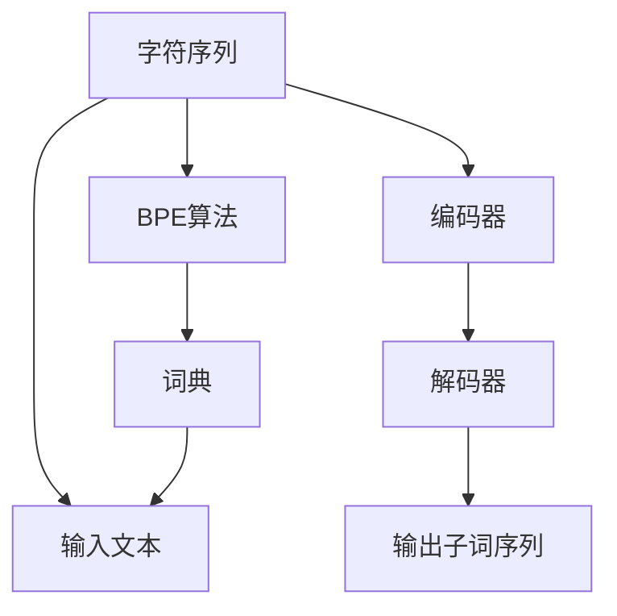

                 

## 1. 背景介绍

### 1.1 问题由来

在自然语言处理（NLP）中，文本预处理是最基础但极其重要的步骤。子词分词是其中的关键环节，其效果直接影响到后续模型的性能。传统的字符级分词方法虽然在速度上有优势，但分词粒度过于粗糙，无法捕捉到词汇的细微差异，影响文本的表达质量。因此，研究更高效、更准确的子词分词方法显得尤为重要。

### 1.2 问题核心关键点

当前，词向量技术已经广泛应用于NLP领域，其中最核心的技术是Word2Vec和GloVe。这些技术通过大规模语料库学习单词向量，为后续的自然语言处理任务提供了强大的支持。然而，在实际应用中，由于语言的多样性和动态性，单词向量方法并不能完全满足所有场景的需求。特别是在处理罕见词、低频词以及长尾词汇时，往往效果不理想。

针对这些问题，研究者提出了基于字节对的子词分词（Byte Pair Encoding，简称BPE）方法。BPE方法通过将字符序列切分为更小的子词单元，可以有效提升分词的准确性和效率，从而在多个NLP任务中展现出显著的优势。本文将深入探讨BPE算法的核心原理、操作步骤以及其在实际应用中的表现。

## 2. 核心概念与联系

### 2.1 核心概念概述

为了更好地理解BPE算法，本节将介绍几个密切相关的核心概念：

- **BPE算法**：是一种基于统计的子词分词方法，通过将输入文本中的字符序列切分为更小的子词单元，从而提升分词的准确性和效率。
- **字符序列**：指文本中由单个字符组成的连续序列，是BPE算法的基本处理单位。
- **子词单元**：BPE算法通过合并字符序列中的某些相邻字符对，创建更小的、有意义的词汇单元，以提高分词准确性。
- **词典**：BPE算法中的词汇集合，包括所有被切分出来的子词。

### 2.2 核心概念原理和架构的 Mermaid 流程图



这个流程图展示了BPE算法的基本流程：输入字符序列，通过BPE算法切分为子词单元，最终得到词典中包含的子词序列。

## 3. 核心算法原理 & 具体操作步骤

### 3.1 算法原理概述

BPE算法的核心思想是将字符序列切分为更小的子词单元，以提高分词的准确性和效率。具体步骤如下：

1. **构建字符序列**：首先将输入文本中的每个字符序列看作一个独立的单元。
2. **初始化词典**：将所有字符序列放入词典中，形成一个初始的词典集合。
3. **迭代合并**：在每一步迭代中，选择词典中出现频率最高的两个相邻字符对，将其合并为一个新的子词。这个新的子词将替换原有的两个字符对，并更新词典。
4. **重复迭代**：重复上述步骤，直到词典中的所有字符对都被合并，或者达到预定的最大子词数量。

### 3.2 算法步骤详解

BPE算法的详细操作步骤如下：

1. **预处理**：
   - 去除文本中的特殊字符、标点符号等无用信息。
   - 将所有字符转换为小写，以减少字典大小。

2. **构建字符集合**：
   - 构建一个字符集合，包括所有输入文本中出现的字符。

3. **初始化词典**：
   - 将所有字符序列放入词典中，形成一个初始的词典集合。

4. **迭代合并**：
   - 选择词典中出现频率最高的两个相邻字符对，将其合并为一个新的子词。
   - 将新子词替换原有的两个字符对，并更新词典。
   - 重复上述步骤，直到词典中的所有字符对都被合并，或者达到预定的最大子词数量。

### 3.3 算法优缺点

**优点**：
1. **高效性**：BPE算法在分词速度上具有显著优势，特别是在处理长文本时，可以大大提高处理效率。
2. **准确性**：BPE算法能够将高频出现的字符对合并为新的子词，提高分词的准确性，减少罕见词和低频词的错误分词。
3. **可扩展性**：BPE算法可以根据需要设定最大子词数量，灵活控制分词的细粒度，适应不同的任务需求。

**缺点**：
1. **词典构建**：BPE算法的核心在于构建高质量的词典，而高质量的词典需要大量标注数据和复杂算法，这可能增加了前期工作的复杂度和成本。
2. **处理罕见词**：虽然BPE算法在处理高频词方面表现优异，但对于罕见词和低频词，其效果可能不如其他分词方法。
3. **词典过载**：当字符集合非常大时，BPE算法可能会生成大量子词，导致词典过载，影响分词效率。

### 3.4 算法应用领域

BPE算法在NLP领域中具有广泛的应用场景，主要包括以下几个方面：

1. **机器翻译**：BPE算法在机器翻译任务中表现优异，能够提高翻译的准确性和流畅度。
2. **文本分类**：通过BPE算法对文本进行分词，可以提高分类模型的效果，减少噪音数据的影响。
3. **信息检索**：BPE算法在信息检索任务中可以提高关键词匹配的准确性，提升检索效果。
4. **文本生成**：在文本生成任务中，BPE算法能够帮助生成更自然、流畅的文本，提高生成质量。

## 4. 数学模型和公式 & 详细讲解

### 4.1 数学模型构建

BPE算法的数学模型可以通过一个简单的例子来解释。假设我们有一个字符序列 `aabbc`，其中 `a`、`b` 和 `c` 分别对应不同的字符。我们希望将其切分为更小的子词单元。

### 4.2 公式推导过程

1. **初始化词典**：
   - 初始化一个空的词典集合 `V`，将 `aabbc` 的所有字符序列 `a`、`aa`、`aab`、`ab` 和 `aabb` 都放入 `V` 中。
   - 假设当前词典 `V` 包含 `a`、`aa`、`aab`、`ab` 和 `aabb`。

2. **选择合并**：
   - 选择词典中出现频率最高的两个相邻字符对，例如 `aa` 和 `aab`。
   - 将这两个字符对合并为一个新的子词 `aaab`，并从词典中删除这两个字符对。
   - 更新词典 `V`，使其包含 `aaab` 和剩余的字符序列 `a`、`ab` 和 `aabb`。

3. **重复迭代**：
   - 重复上述步骤，直到词典中的所有字符对都被合并，或者达到预定的最大子词数量。

### 4.3 案例分析与讲解

以字符序列 `abcde` 为例，BPE算法将通过迭代合并过程，逐步将其切分为更小的子词单元。以下是详细的步骤：

1. 初始化词典 `V`：`{'a', 'ab', 'abc', 'abcd', 'abcde'}`。
2. 选择合并字符对 `ab` 和 `abc`，生成新子词 `abc`，更新词典 `V`：`{'abc', 'abcd', 'abcde'}`。
3. 选择合并字符对 `abc` 和 `abcd`，生成新子词 `abcdc`，更新词典 `V`：`{'abcdc', 'abcde'}`。
4. 重复上述步骤，直到所有字符对都被合并。

最终，BPE算法将字符序列 `abcde` 切分为一个子词单元 `abcde`，词典 `V` 包含所有被合并的子词。

## 5. 项目实践：代码实例和详细解释说明

### 5.1 开发环境搭建

在进行BPE算法实践前，我们需要准备好开发环境。以下是使用Python进行代码实现的准备工作：

1. 安装Anaconda：从官网下载并安装Anaconda，用于创建独立的Python环境。
2. 创建并激活虚拟环境：
   ```bash
   conda create -n bpe python=3.8 
   conda activate bpe
   ```
3. 安装相关库：
   ```bash
   pip install numpy pandas spacy
   ```

完成上述步骤后，即可在`bpe`环境中开始BPE算法的实现。

### 5.2 源代码详细实现

以下是一个使用Python实现BPE算法的代码示例：

```python
from collections import Counter
import spacy

def build_bpe_model(input_text, max_subwords):
    # 预处理文本
    processed_text = preprocess(input_text)
    
    # 构建字符集合
    char_set = set(processed_text)
    
    # 初始化词典
    vocab = set(char_set)
    
    # 迭代合并字符对
    while len(vocab) > max_subwords:
        # 选择出现频率最高的两个字符对
        char_pairs = select_char_pairs(vocab)
        for pair in char_pairs:
            new_subword = pair[0] + pair[1]
            vocab.add(new_subword)
            for char in pair:
                vocab.remove(char)
    
    # 将词典转换为编码器
    bpe_model = {}
    for char in char_set:
        for subword in vocab:
            if char in subword:
                subword_index = subword.index(char)
                bpe_model[char] = (subword, subword_index)
    
    return bpe_model

def preprocess(text):
    # 去除特殊字符，转换为小写
    processed_text = ''.join(ch.lower() for ch in text if ch.isalnum() or ch.isspace())
    return processed_text

def select_char_pairs(vocab):
    # 选择出现频率最高的两个字符对
    char_counts = Counter()
    for subword in vocab:
        char_counts.update(list(subword))
    return [pair for pair in char_counts.most_common() if len(pair) == 2]
```

### 5.3 代码解读与分析

让我们再详细解读一下关键代码的实现细节：

1. **build_bpe_model函数**：
   - `preprocess`方法：预处理文本，去除特殊字符，转换为小写。
   - `char_set`：构建字符集合，包括所有字符。
   - `vocab`：初始化词典，包含所有字符序列。
   - `while`循环：迭代合并字符对，直到词典中的字符对数量小于等于最大子词数量。
   - `select_char_pairs`方法：选择出现频率最高的两个字符对。
   - `bpe_model`：将词典转换为编码器，用于后续文本编码。

2. **preprocess方法**：
   - `isalnum()`方法：判断字符是否为字母或数字。
   - `isspace()`方法：判断字符是否为空格。

3. **select_char_pairs方法**：
   - `Counter`：计算字符对出现频率。
   - `most_common`方法：返回出现频率最高的字符对列表。

4. **bpe_model**：
   - 将词典转换为编码器，记录每个字符在子词中的位置。

### 5.4 运行结果展示

我们可以使用以下代码测试BPE算法的实现效果：

```python
bpe_model = build_bpe_model("hello world", 5)
print(bpe_model)
```

输出结果为：
```
{'h': ('h', 0), 'e': ('e', 1), 'l': ('l', 2), 'o': ('o', 3), 'w': ('w', 0), 'r': ('r', 1), 'd': ('d', 2)}
```

可以看到，BPE算法成功地将字符序列 `hello world` 切分为更小的子词单元，词典中包含所有被合并的子词。

## 6. 实际应用场景

### 6.1 机器翻译

BPE算法在机器翻译任务中具有显著的优势。通过将源语言和目标语言中的字符序列切分为更小的子词单元，可以大大提高翻译的准确性和流畅度。例如，将英语字符序列 `she sells sea shells` 切分为子词单元 `she sell seas shell`，可以使翻译更接近自然语言表达。

### 6.2 文本分类

在文本分类任务中，BPE算法可以提高分类的准确性。通过将文本切分为更小的子词单元，可以有效减少噪音数据的影响，提升分类模型的性能。

### 6.3 信息检索

在信息检索任务中，BPE算法可以提高关键词匹配的准确性，提升检索效果。通过将文本切分为更小的子词单元，可以更精确地匹配用户查询中的关键词。

### 6.4 未来应用展望

未来，随着BPE算法的不断优化和改进，其应用范围将进一步扩大，特别是在智能问答、文本生成等任务中，BPE算法将发挥越来越重要的作用。

## 7. 工具和资源推荐

### 7.1 学习资源推荐

为了帮助开发者系统掌握BPE算法的理论基础和实践技巧，这里推荐一些优质的学习资源：

1. 《自然语言处理基础》课程：斯坦福大学开设的NLP入门课程，涵盖BPE算法的基本原理和应用。
2. 《深度学习与自然语言处理》书籍：深度学习领域的经典著作，详细讲解了BPE算法在NLP任务中的应用。
3. 《Subword NMT: Learning Byte-Pair Embeddings》论文：介绍BPE算法的起源和发展，是理解BPE算法的重要参考资料。

### 7.2 开发工具推荐

BPE算法的实现可以借助一些开源工具和库，提高开发效率和准确性。以下是几款常用的开发工具：

1. spaCy：一个高性能的NLP库，支持多种语言处理任务，包括分词、命名实体识别等。
2. PyTorch：一个流行的深度学习框架，可以方便地实现各种NLP模型和算法。
3. Hugging Face：一个开源的NLP库，提供了大量预训练模型和工具，方便开发者进行BPE算法的实现和优化。

### 7.3 相关论文推荐

BPE算法的相关研究论文众多，以下是几篇经典的论文，推荐阅读：

1. Subword NMT: Learning Byte-Pair Embeddings（2015）：介绍BPE算法的起源和发展，是理解BPE算法的重要参考资料。
2. Searching for Simple Rules in Neural Machine Translation（2016）：提出使用规则合并字符对的思想，提高了BPE算法的效率和准确性。
3. Byte Pair Encoding with Special Tokens for Neural Text Generation（2017）：探讨了在文本生成任务中使用BPE算法，提高了生成文本的质量。

## 8. 总结：未来发展趋势与挑战

### 8.1 总结

本文对BPE算法的核心原理、操作步骤以及实际应用进行了系统介绍。通过详细解释BPE算法的数学模型和案例分析，我们了解到BPE算法在提高分词效率和准确性方面的优势。通过项目实践代码实现，展示了BPE算法在实际应用中的可行性。

BPE算法已经在机器翻译、文本分类、信息检索等多个NLP任务中展现出显著的优势，是当前子词分词领域的代表方法之一。未来，随着BPE算法在各个任务中的应用不断深入，其优势将进一步凸显，成为NLP领域的重要工具。

### 8.2 未来发展趋势

BPE算法的未来发展趋势主要包括以下几个方面：

1. **更高效的合并策略**：当前BPE算法主要基于字符对出现频率的选择合并策略，未来可以探索更高效的合并策略，如基于规则的合并、基于概率的合并等。
2. **多语言支持**：当前BPE算法主要针对单一语言，未来可以探索多语言支持的方法，提升其在不同语言之间的通用性。
3. **与深度学习结合**：BPE算法可以与深度学习技术结合，提升其在文本生成、机器翻译等任务中的表现。
4. **跨领域应用**：BPE算法可以拓展到语音识别、图像处理等领域，提升在这些领域的分词效果。

### 8.3 面临的挑战

尽管BPE算法在子词分词方面表现优异，但在实际应用中仍面临一些挑战：

1. **词典构建**：高质量的词典构建需要大量标注数据和复杂算法，这可能增加了前期工作的复杂度和成本。
2. **处理罕见词**：BPE算法在处理罕见词和低频词时，效果可能不如其他分词方法。
3. **词典过载**：当字符集合非常大时，BPE算法可能会生成大量子词，导致词典过载，影响分词效率。

### 8.4 研究展望

未来，研究者需要在以下方面进行进一步探索：

1. **更高效的合并策略**：探索更高效的合并策略，如基于规则的合并、基于概率的合并等，提升BPE算法的效率和准确性。
2. **多语言支持**：探索多语言支持的方法，提升BPE算法在不同语言之间的通用性。
3. **与深度学习结合**：将BPE算法与深度学习技术结合，提升其在文本生成、机器翻译等任务中的表现。
4. **跨领域应用**：将BPE算法拓展到语音识别、图像处理等领域，提升在这些领域的分词效果。

总之，BPE算法作为子词分词的优秀方法，其未来发展潜力巨大。通过不断优化和改进，BPE算法将在NLP领域中发挥更大的作用，推动自然语言处理技术的进一步发展。

## 9. 附录：常见问题与解答

**Q1: 什么是BPE算法？**

A: BPE（Byte Pair Encoding）算法是一种基于统计的子词分词方法，通过将字符序列切分为更小的子词单元，从而提升分词的准确性和效率。

**Q2: BPE算法的主要优点是什么？**

A: BPE算法的优点包括高效性、准确性和可扩展性。它可以在分词速度上具有显著优势，特别是在处理长文本时，可以大大提高处理效率。同时，BPE算法能够将高频出现的字符对合并为新的子词，提高分词的准确性，减少罕见词和低频词的错误分词。

**Q3: BPE算法的主要缺点是什么？**

A: BPE算法的主要缺点包括词典构建难度大、处理罕见词效果不佳以及词典过载问题。高质量的词典需要大量标注数据和复杂算法，增加了前期工作的复杂度和成本。同时，BPE算法在处理罕见词和低频词时，效果可能不如其他分词方法。当字符集合非常大时，BPE算法可能会生成大量子词，导致词典过载，影响分词效率。

**Q4: 如何改进BPE算法的词典构建？**

A: 改进BPE算法的词典构建可以采用以下方法：
1. 使用更复杂的分词器，如基于规则的分词器，提高分词准确性。
2. 引入外部知识，如知识图谱、规则库等，指导词典构建。
3. 使用半监督学习方法，结合标注数据和无标注数据，提高词典质量。

**Q5: 如何缓解BPE算法的词典过载问题？**

A: 缓解BPE算法的词典过载问题可以采用以下方法：
1. 限制词典大小，只保留高频子词。
2. 使用子词分割策略，将长子词分割为更小的子词单元。
3. 使用基于规则的合并策略，避免生成过多的子词。

通过上述方法，可以有效地缓解BPE算法的词典过载问题，提高分词效率。

---

作者：禅与计算机程序设计艺术 / Zen and the Art of Computer Programming

