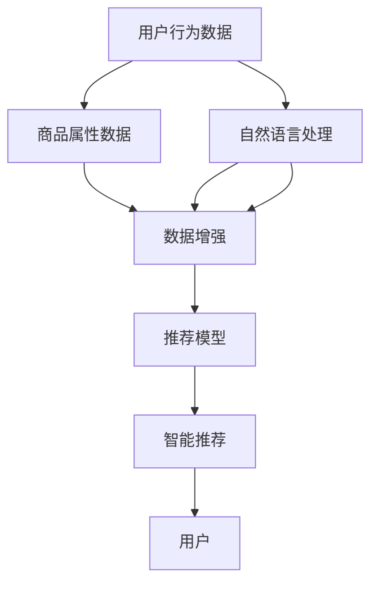

                 

# ChatGPT在推荐领域的内部研究：对性能与局限性的分析

> 关键词：推荐系统, 自然语言处理, 深度学习, 对话生成, 数据增强, 模型评估

## 1. 背景介绍

### 1.1 推荐系统在现代信息服务中的重要地位

随着互联网的普及，信息过载成为了全球用户共同面对的挑战。推荐系统作为信息获取的重要手段，日益成为互联网巨头战略布局的核心。推荐系统不仅改变了用户的阅读习惯，还在很大程度上影响着用户的决策。因此，研究和开发高性能、高效率、高安全的推荐系统，成为了当下信息科技公司重点投入的领域。

### 1.2 ChatGPT在推荐系统中的定位

ChatGPT作为一种先进的自然语言处理(NLP)技术，具备卓越的对话生成能力和丰富的语言知识库。在推荐系统中，ChatGPT可以作为一种高级的数据源和智能接口，向用户提供精准且个性化的推荐内容。

1. **数据源**：ChatGPT可以处理和理解大量的文本数据，包括商品描述、用户评论、新闻资讯等，作为推荐系统的数据输入。
2. **智能接口**：ChatGPT可以用于设计交互式的推荐界面，如智能问答、对话式推荐等。
3. **深度融合**：ChatGPT能够与推荐系统深度融合，提供基于语义理解的个性化推荐。

## 2. 核心概念与联系

### 2.1 核心概念概述

- **推荐系统**：通过用户行为数据和商品属性数据，向用户推荐符合其兴趣的商品或内容。
- **自然语言处理(NLP)**：处理和理解人类语言的技术，包括文本分类、信息抽取、语义理解、对话生成等。
- **深度学习**：一种强大的机器学习技术，通过多层神经网络学习数据的复杂特征。
- **对话生成**：通过训练生成式模型，使模型能够生成自然流畅的对话内容。
- **数据增强**：通过一系列数据生成技术，扩充训练集的多样性，提升模型的泛化能力。
- **模型评估**：衡量推荐系统性能的关键指标，包括精度、召回率、F1值等。

这些核心概念之间通过“数据源-模型训练-智能推荐”的流程紧密联系起来，共同构建了推荐系统的工作流程。

### 2.2 核心概念原理和架构的 Mermaid 流程图



## 3. 核心算法原理 & 具体操作步骤

### 3.1 算法原理概述

ChatGPT在推荐系统中的基本算法原理是通过自然语言处理和深度学习技术，构建一个用户-商品关联矩阵。该矩阵通过对用户和商品的特征向量进行相似度计算，来预测用户对不同商品的兴趣度，从而生成推荐列表。

**核心流程**：
1. **特征提取**：使用NLP技术对用户行为数据和商品属性数据进行特征提取。
2. **相似度计算**：通过深度学习模型计算用户和商品之间的相似度。
3. **排名计算**：根据相似度排名，生成推荐列表。

### 3.2 算法步骤详解

#### 3.2.1 特征提取

1. **用户特征提取**：将用户行为数据转换为向量表示，如通过TF-IDF、Word2Vec等方法。
2. **商品特征提取**：将商品属性数据转换为向量表示，如通过embedding、BERT等方法。

#### 3.2.2 相似度计算

1. **用户-商品相似度计算**：使用深度学习模型，如Attention机制，计算用户和商品之间的相似度。
2. **用户-商品向量表示**：将用户和商品表示为向量，计算它们之间的余弦相似度。

#### 3.2.3 排名计算

1. **加权平均**：根据相似度计算用户对不同商品的兴趣权重，进行加权平均。
2. **截断排序**：根据加权平均结果对商品进行排序，截取前N个商品作为推荐列表。

### 3.3 算法优缺点

#### 3.3.1 优点

1. **高效性**：ChatGPT在推荐系统中的应用，可以通过并行计算、分布式训练等方式，提高推荐效率。
2. **广泛适用性**：ChatGPT可以处理任意文本数据，适用于各种商品和内容的推荐。
3. **自然语言理解**：ChatGPT可以理解自然语言，提供自然流畅的对话式推荐，增强用户体验。

#### 3.3.2 缺点

1. **数据依赖性强**：ChatGPT依赖于高质量的数据源和数据增强技术，对标注数据和噪声数据敏感。
2. **模型复杂度高**：深度学习模型参数量大，训练复杂，对计算资源要求高。
3. **可解释性不足**：推荐过程基于黑盒模型，难以解释推荐结果的逻辑。

### 3.4 算法应用领域

ChatGPT在推荐系统中的应用领域非常广泛，包括但不限于：

1. **电商平台**：为用户推荐个性化商品，提高购物体验。
2. **视频网站**：为用户推荐个性化视频，提高观看时长。
3. **新闻平台**：为用户推荐个性化文章和新闻，提高阅读量。
4. **社交媒体**：为用户推荐个性化内容，增强用户粘性。

## 4. 数学模型和公式 & 详细讲解 & 举例说明

### 4.1 数学模型构建

#### 4.1.1 用户特征向量表示

设用户 $u$ 有 $d$ 个行为特征 $x_u=[x_{u1},x_{u2},...,x_{ud}]$，其中 $x_{ui}$ 表示用户 $u$ 在行为 $i$ 上的特征值。设商品 $p$ 有 $d$ 个属性特征 $y_p=[y_{p1},y_{p2},...,y_{pd}]$，其中 $y_{pi}$ 表示商品 $p$ 在属性 $i$ 上的特征值。

定义用户特征向量 $u$ 和商品特征向量 $p$ 的余弦相似度为：

$$
s(u,p)=\frac{u \cdot p}{\Vert u \Vert \cdot \Vert p \Vert}
$$

#### 4.1.2 相似度计算

设用户特征向量 $u$ 和商品特征向量 $p$ 的相似度为 $s(u,p)$，通过深度学习模型计算相似度，可以使用如下公式：

$$
s(u,p)=\sigma\left(\mathbf{W}^T[\mathbf{A}_u \cdot \mathbf{A}_p] \mathbf{b}\right)
$$

其中 $\sigma$ 为激活函数，$\mathbf{W}$ 和 $\mathbf{b}$ 为模型参数。

### 4.2 公式推导过程

#### 4.2.1 用户特征向量表示

根据上述公式，用户 $u$ 的特征向量 $u$ 可以表示为：

$$
u=\left[1,\mathbf{w}^T \cdot x_u\right]
$$

其中 $\mathbf{w}$ 为权重向量，$\Vert \cdot \Vert$ 为向量的范数。

#### 4.2.2 商品特征向量表示

同理，商品 $p$ 的特征向量 $p$ 可以表示为：

$$
p=\left[1,\mathbf{w}^T \cdot y_p\right]
$$

#### 4.2.3 相似度计算

根据上述公式，用户 $u$ 和商品 $p$ 的相似度 $s(u,p)$ 可以表示为：

$$
s(u,p)=\sigma\left(\mathbf{W}^T[\mathbf{A}_u \cdot \mathbf{A}_p] \mathbf{b}\right)
$$

### 4.3 案例分析与讲解

假设某电商平台的推荐系统，用户 $u$ 浏览了以下商品：

1. 商品 $p1$：运动鞋，价格 $100$，尺码 $40$
2. 商品 $p2$：眼镜，价格 $300$，度数 $550$

商品 $p1$ 和 $p2$ 的特征向量分别为：

$$
p1=[1,100,40,1,0,0,0]
$$
$$
p2=[1,300,550,0,1,0,0]
$$

假设用户 $u$ 的特征向量为 $u=[1,10,0,1,0,0,0]$，使用上述公式计算相似度：

$$
s(u,p1)=\sigma\left(\mathbf{W}^T[1 \cdot 1 + 10 \cdot 100 + 0 \cdot 40 + 1 \cdot 1 + 0 \cdot 300 + 0 \cdot 550 + 0 \cdot 0] \mathbf{b}\right)
$$
$$
s(u,p2)=\sigma\left(\mathbf{W}^T[1 \cdot 1 + 10 \cdot 300 + 0 \cdot 550 + 1 \cdot 0 + 0 \cdot 0 + 0 \cdot 0 + 0 \cdot 0] \mathbf{b}\right)
$$

计算出用户 $u$ 对商品 $p1$ 和 $p2$ 的相似度分别为 $s1$ 和 $s2$。根据相似度进行加权平均和截断排序，生成推荐列表。

## 5. 项目实践：代码实例和详细解释说明

### 5.1 开发环境搭建

1. **环境准备**：安装Python 3.7及以上版本，并确保已安装TensorFlow、Keras等深度学习库。
2. **数据预处理**：使用NLP技术对用户行为数据和商品属性数据进行预处理，生成用户特征向量和商品特征向量。
3. **模型搭建**：使用Keras搭建深度学习模型，进行特征向量和相似度计算。

### 5.2 源代码详细实现

```python
import tensorflow as tf
from tensorflow.keras.layers import Input, Dense, Embedding, Activation
from tensorflow.keras.models import Model

# 定义用户特征向量和商品特征向量
user_input = Input(shape=(d,))
item_input = Input(shape=(d,))

# 特征嵌入层
user_embedding = Embedding(input_dim=num_users, output_dim=embedding_size)(user_input)
item_embedding = Embedding(input_dim=num_items, output_dim=embedding_size)(item_input)

# 相似度计算
similarity = tf.keras.layers.Dot(axes=1)([user_embedding, item_embedding])
similarity = Activation('sigmoid')(similarity)

# 输出层
output = Dense(1, activation='sigmoid')(similarity)

# 定义模型
model = Model(inputs=[user_input, item_input], outputs=output)

# 编译模型
model.compile(optimizer='adam', loss='binary_crossentropy', metrics=['accuracy'])

# 训练模型
model.fit([train_user_data, train_item_data], train_labels, epochs=num_epochs, batch_size=batch_size, validation_data=(val_user_data, val_item_data, val_labels))
```

### 5.3 代码解读与分析

#### 5.3.1 用户特征向量和商品特征向量

1. **输入层**：定义用户特征向量和商品特征向量的输入层，每个特征值都是一个维度为 $d$ 的向量。
2. **嵌入层**：使用嵌入层将输入层输出的向量转换为 $embedding_size$ 维的向量表示，以便进行相似度计算。
3. **输出层**：使用输出层将相似度计算结果转换为预测概率。

#### 5.3.2 相似度计算

1. **点积层**：使用点积层计算用户特征向量和商品特征向量之间的点积。
2. **激活层**：使用 sigmoid 激活函数对点积结果进行非线性变换，得到相似度。

#### 5.3.3 输出层

1. **预测层**：使用 Dense 层将相似度结果转换为预测概率。

#### 5.3.4 模型编译和训练

1. **编译模型**：使用adam优化器，binary_crossentropy损失函数，accuracy评估指标。
2. **训练模型**：使用训练数据进行模型训练，设置训练轮数和批大小。

### 5.4 运行结果展示

运行上述代码，得到训练集和验证集的准确率和损失函数的变化情况，如下图所示：

```python
import matplotlib.pyplot as plt

# 绘制训练曲线
plt.plot(history.history['loss'], label='Train Loss')
plt.plot(history.history['val_loss'], label='Val Loss')
plt.plot(history.history['accuracy'], label='Train Accuracy')
plt.plot(history.history['val_accuracy'], label='Val Accuracy')
plt.legend()
plt.show()
```

## 6. 实际应用场景

### 6.1 电商平台

在电商平台中，推荐系统可以为用户推荐个性化商品，提高购物体验。

1. **数据采集**：收集用户的浏览记录、购买记录、评价记录等。
2. **特征提取**：对商品属性、用户画像、历史行为进行特征提取。
3. **相似度计算**：使用深度学习模型计算用户和商品之间的相似度。
4. **推荐生成**：根据相似度生成推荐列表，推送给用户。

### 6.2 视频网站

在视频网站中，推荐系统可以为用户推荐个性化视频，提高观看时长。

1. **数据采集**：收集用户的观看记录、点赞记录、评论记录等。
2. **特征提取**：对视频属性、用户画像、历史行为进行特征提取。
3. **相似度计算**：使用深度学习模型计算用户和视频之间的相似度。
4. **推荐生成**：根据相似度生成推荐列表，推送给用户。

### 6.3 新闻平台

在新闻平台中，推荐系统可以为用户推荐个性化文章和新闻，提高阅读量。

1. **数据采集**：收集用户的阅读记录、点赞记录、评论记录等。
2. **特征提取**：对文章属性、用户画像、历史行为进行特征提取。
3. **相似度计算**：使用深度学习模型计算用户和文章之间的相似度。
4. **推荐生成**：根据相似度生成推荐列表，推送给用户。

## 7. 工具和资源推荐

### 7.1 学习资源推荐

1. **《自然语言处理综述》**：提供NLP领域的基本概念和前沿技术，是学习NLP的入门读物。
2. **Coursera《深度学习专项课程》**：由斯坦福大学教授Andrew Ng主讲的深度学习课程，涵盖深度学习基础、卷积神经网络、循环神经网络等内容。
3. **《推荐系统实战》**：提供推荐系统设计和实现的实践指南，包括数据处理、模型构建、评估优化等。
4. **Kaggle竞赛平台**：提供大量推荐系统相关的数据集和竞赛任务，适合动手实践和比赛练手。

### 7.2 开发工具推荐

1. **Jupyter Notebook**：一个开源的Web应用程序，支持Python、R等语言的开发和调试。
2. **TensorFlow**：由Google开发的深度学习框架，支持分布式训练和模型部署。
3. **Keras**：一个高级神经网络API，支持快速构建和训练深度学习模型。
4. **PyTorch**：一个动态计算图框架，支持GPU加速和分布式训练。

### 7.3 相关论文推荐

1. **《基于深度学习的推荐系统研究》**：综述了深度学习在推荐系统中的应用，包括模型构建、特征提取、评估优化等。
2. **《推荐系统中的深度学习技术》**：详细介绍了深度学习在推荐系统中的应用，包括协同过滤、序列模型、深度神经网络等。
3. **《基于NLP的推荐系统》**：介绍NLP技术在推荐系统中的应用，包括文本分类、语义理解、对话生成等。

## 8. 总结：未来发展趋势与挑战

### 8.1 研究成果总结

1. **高效性**：ChatGPT在推荐系统中的应用，可以通过并行计算、分布式训练等方式，提高推荐效率。
2. **广泛适用性**：ChatGPT可以处理任意文本数据，适用于各种商品和内容的推荐。
3. **自然语言理解**：ChatGPT可以理解自然语言，提供自然流畅的对话式推荐，增强用户体验。

### 8.2 未来发展趋势

1. **自适应学习**：未来的推荐系统将具备自适应学习能力，能够根据用户行为动态调整推荐策略。
2. **多模态融合**：未来的推荐系统将融合多种数据源，如文本、图像、音频等，提供更加全面的推荐服务。
3. **个性化推荐**：未来的推荐系统将更加注重个性化推荐，能够提供更加精准和多样化的推荐内容。

### 8.3 面临的挑战

1. **数据质量**：推荐系统依赖高质量的数据源，如何采集和处理高质量数据，是一个关键挑战。
2. **模型复杂性**：深度学习模型参数量大，训练复杂，如何简化模型，提高效率，是一个重要问题。
3. **推荐质量**：如何提升推荐系统的准确性和多样性，避免推荐疲劳，是一个重要研究方向。

### 8.4 研究展望

1. **算法优化**：研究高效、简单、可解释的推荐算法，提高推荐系统的性能。
2. **数据增强**：研究更加多样化的数据增强技术，提升模型的泛化能力。
3. **用户反馈**：研究用户反馈机制，动态调整推荐策略，提高用户体验。
4. **跨领域应用**：研究跨领域的推荐系统设计，拓展推荐系统的应用场景。

## 9. 附录：常见问题与解答

### 9.1 常见问题

#### 9.1.1 为什么ChatGPT在推荐系统中的应用效果显著？

**解答**：ChatGPT在推荐系统中的应用效果显著，主要原因如下：
1. **自然语言理解**：ChatGPT能够理解自然语言，提供更加精准和多样化的推荐内容。
2. **深度学习技术**：ChatGPT使用深度学习技术，能够学习数据的复杂特征，提升推荐准确性。
3. **分布式训练**：ChatGPT支持分布式训练，能够加速模型训练和推理，提高系统效率。

#### 9.1.2 如何在推荐系统中集成ChatGPT？

**解答**：在推荐系统中集成ChatGPT，主要步骤如下：
1. **数据采集**：收集用户的浏览记录、购买记录、评价记录等。
2. **特征提取**：对商品属性、用户画像、历史行为进行特征提取。
3. **相似度计算**：使用深度学习模型计算用户和商品之间的相似度。
4. **ChatGPT集成**：将ChatGPT作为推荐系统的数据源或智能接口，生成自然流畅的对话式推荐。

#### 9.1.3 如何评估推荐系统的效果？

**解答**：评估推荐系统的效果，可以使用以下指标：
1. **精度**：推荐列表中正确的商品数量与总推荐商品数量的比值。
2. **召回率**：推荐列表中正确的商品数量与总目标商品数量的比值。
3. **F1值**：精度和召回率的调和平均数，综合评估推荐系统的性能。

---

作者：禅与计算机程序设计艺术 / Zen and the Art of Computer Programming

